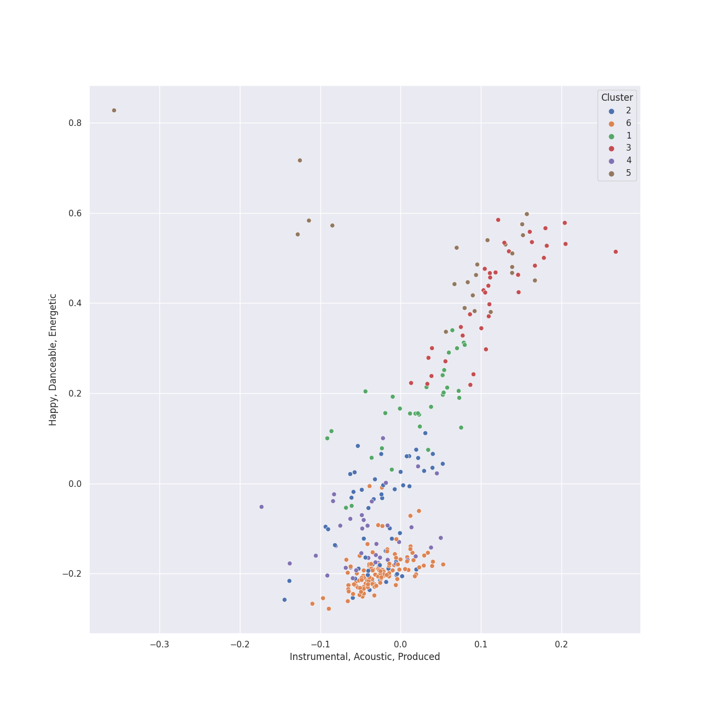

# Clusters in german romanticism

## Cluster #1

32 tracks

| Art | Track | Album | Artists | Label | 💚 | 🔗 |
|:---|:---|:---|:---|:---|:---|:---|
|  | String Quartet No. 2 In A Minor, Op. 51 No. 2: 4. Finale (Allegro non assai - Più vivace) | Brahms: String Quartets & Piano Quintet | Johannes Brahms, Emerson String Quartet | [Deutsche Grammophon (DG)](../../../../labels/deutsche_grammophon__dg_) | | [🔗](https://open.spotify.com/track/0vYV5hep1Ybn1fUhFsamys) |
|  | Symphony No. 6 In F, Op. 68 -"Pastoral": 1. Erwachen heiterer Empfindungen bei der Ankunft auf dem Lande: Allegro ma non troppo | Beethoven: 9 Symphonies; Overtures | [Ludwig van Beethoven](../../../../artists/ludwig_van_beethoven/overview.md), [Berliner Philharmoniker](../../../../artists/berliner_philharmoniker/overview.md), [Herbert von Karajan](../../../../artists/herbert_von_karajan/overview.md) | [Deutsche Grammophon (DG)](../../../../labels/deutsche_grammophon__dg_) | | [🔗](https://open.spotify.com/track/11YigXaFNjzST4L0HAaFv3) |
|  | String Quartet No. 10 in E-Flat Major, Op. 74 "Harp": I. Poco Adagio - Allegro | Beethoven: Complete String Quartets | [Ludwig van Beethoven](../../../../artists/ludwig_van_beethoven/overview.md), [Tokyo String Quartet](../../../../artists/tokyo_string_quartet/overview.md) | [harmonia mundi](../../../../labels/harmonia_mundi) | | [🔗](https://open.spotify.com/track/4R65AF62OndtREjmSvcfcJ) |
|  | String Quartet No. 15 in A minor, Op. 132: V. Allegro appassionato - Presto | Beethoven: Complete String Quartets | [Ludwig van Beethoven](../../../../artists/ludwig_van_beethoven/overview.md), [Tokyo String Quartet](../../../../artists/tokyo_string_quartet/overview.md) | [harmonia mundi](../../../../labels/harmonia_mundi) | | [🔗](https://open.spotify.com/track/7oIlqfDug1iDhuWUscjgPy) |
|  | String Quartet No. 8 in E Minor, Op. 59 No. 2: III. Allegretto | Beethoven: Complete String Quartets | [Ludwig van Beethoven](../../../../artists/ludwig_van_beethoven/overview.md), [Tokyo String Quartet](../../../../artists/tokyo_string_quartet/overview.md) | [harmonia mundi](../../../../labels/harmonia_mundi) | | [🔗](https://open.spotify.com/track/1e0KnK30nx7GxphZVx7DFI) |
|  | String Quartet No. 9 in C Major, Op. 59 No. 3: I. Introduzione (Andante con moto - Allegro vivace) | Beethoven: Complete String Quartets | [Ludwig van Beethoven](../../../../artists/ludwig_van_beethoven/overview.md), [Tokyo String Quartet](../../../../artists/tokyo_string_quartet/overview.md) | [harmonia mundi](../../../../labels/harmonia_mundi) | | [🔗](https://open.spotify.com/track/5bUQPchwRlyhMMNP7OYrcW) |
|  | String Quartet No. 2 in G Major, Op. 18, No. 2: I. Allegro | Beethoven: String Quartets, Op. 18 | [Ludwig van Beethoven](../../../../artists/ludwig_van_beethoven/overview.md), [Jerusalem Quartet](../../../../artists/jerusalem_quartet/overview.md) | [harmonia mundi](../../../../labels/harmonia_mundi) | | [🔗](https://open.spotify.com/track/558uK4J0UIghC9WVf1lAuk) |
|  | String Quartet No. 4 in C Minor, Op. 18 No. 4: III. Menuetto (Allegro) - Trio | Beethoven: String Quartets, Op. 18 | [Ludwig van Beethoven](../../../../artists/ludwig_van_beethoven/overview.md), [Jerusalem Quartet](../../../../artists/jerusalem_quartet/overview.md) | [harmonia mundi](../../../../labels/harmonia_mundi) | | [🔗](https://open.spotify.com/track/2dQGXr6v2FXXPeBvqrTZW2) |
|  | String Quartet No. 5 in A Major, Op. 18 No. 5: I. Allegro | Beethoven: String Quartets, Op. 18 | [Ludwig van Beethoven](../../../../artists/ludwig_van_beethoven/overview.md), [Jerusalem Quartet](../../../../artists/jerusalem_quartet/overview.md) | [harmonia mundi](../../../../labels/harmonia_mundi) | | [🔗](https://open.spotify.com/track/26rU4aScCfqkgrtNmAAUMW) |
|  | String Quartet No. 5 in A Major, Op. 18 No. 5: II. Menuetto - Trio | Beethoven: String Quartets, Op. 18 | [Ludwig van Beethoven](../../../../artists/ludwig_van_beethoven/overview.md), [Jerusalem Quartet](../../../../artists/jerusalem_quartet/overview.md) | [harmonia mundi](../../../../labels/harmonia_mundi) | | [🔗](https://open.spotify.com/track/0AtBrNtW0crqbSyUtwNykS) |
## Cluster #2

56 tracks

| Art | Track | Album | Artists | Label | 💚 | 🔗 |
|:---|:---|:---|:---|:---|:---|:---|
|  | Overture to "A Midsummer Night's Dream", Op. 21: Tempo primo | Mendelssohn: A Midsummer Night's Dream | Felix Mendelssohn, John Eliot Gardiner, London Symphony Orchestra | [Lso Live](../../../../labels/lso_live) | | [🔗](https://open.spotify.com/track/2idvFSH2im8mdSaMiE81vn) |
|  | String Quartet No. 2 In A Minor, Op. 51 No. 2: 1. Allegro non troppo | Brahms: String Quartets & Piano Quintet | Johannes Brahms, Emerson String Quartet | [Deutsche Grammophon (DG)](../../../../labels/deutsche_grammophon__dg_) | | [🔗](https://open.spotify.com/track/0dn5JlmuEtBAEQ79fQUiLK) |
|  | String Quartet No. 2 In A Minor, Op. 51 No. 2: 2. Andante moderato | Brahms: String Quartets & Piano Quintet | Johannes Brahms, Emerson String Quartet | [Deutsche Grammophon (DG)](../../../../labels/deutsche_grammophon__dg_) | | [🔗](https://open.spotify.com/track/1WoXiu07Xzld9f9pz3jb6z) |
|  | String Quartet No. 3 In B Flat, Op. 67: 2. Andante | Brahms: String Quartets & Piano Quintet | Johannes Brahms, Emerson String Quartet | [Deutsche Grammophon (DG)](../../../../labels/deutsche_grammophon__dg_) | | [🔗](https://open.spotify.com/track/7xnwMGTClM3uyaUfJBGAH3) |
|  | Music To Goethe's Tragedy "Egmont" Op. 84: Ouverture - Sostenuto, ma non troppo - Allegro | Beethoven: 9 Symphonies; Overtures | [Ludwig van Beethoven](../../../../artists/ludwig_van_beethoven/overview.md), [Berliner Philharmoniker](../../../../artists/berliner_philharmoniker/overview.md), [Herbert von Karajan](../../../../artists/herbert_von_karajan/overview.md) | [Deutsche Grammophon (DG)](../../../../labels/deutsche_grammophon__dg_) | | [🔗](https://open.spotify.com/track/6qvHVRS4Uzyw0a9Dz4fDVn) |
|  | Symphony No. 2 In D, Op. 36: 2. Larghetto | Beethoven: 9 Symphonies; Overtures | [Ludwig van Beethoven](../../../../artists/ludwig_van_beethoven/overview.md), [Berliner Philharmoniker](../../../../artists/berliner_philharmoniker/overview.md), [Herbert von Karajan](../../../../artists/herbert_von_karajan/overview.md) | [Deutsche Grammophon (DG)](../../../../labels/deutsche_grammophon__dg_) | | [🔗](https://open.spotify.com/track/6mecmuj3ZX7Ux9ff52x4Y4) |
|  | Symphony No. 7 In A, Op. 92: 2. Allegretto | Beethoven: 9 Symphonies; Overtures | [Ludwig van Beethoven](../../../../artists/ludwig_van_beethoven/overview.md), [Berliner Philharmoniker](../../../../artists/berliner_philharmoniker/overview.md), [Herbert von Karajan](../../../../artists/herbert_von_karajan/overview.md) | [Deutsche Grammophon (DG)](../../../../labels/deutsche_grammophon__dg_) | | [🔗](https://open.spotify.com/track/0ADhD2DsEi5OTt21ljNUBz) |
|  | String Quartet No. 10 in E-Flat Major, Op. 74 "Harp": II. Adagio ma non troppo | Beethoven: Complete String Quartets | [Ludwig van Beethoven](../../../../artists/ludwig_van_beethoven/overview.md), [Tokyo String Quartet](../../../../artists/tokyo_string_quartet/overview.md) | [harmonia mundi](../../../../labels/harmonia_mundi) | | [🔗](https://open.spotify.com/track/3wWs6OyC5Sd8WUSL8dx1ls) |
|  | String Quartet No. 13 in B-Flat Major, Op. 130: V. Cavatina (Adagio molto espressivo) | Beethoven: Complete String Quartets | [Ludwig van Beethoven](../../../../artists/ludwig_van_beethoven/overview.md), [Tokyo String Quartet](../../../../artists/tokyo_string_quartet/overview.md) | [harmonia mundi](../../../../labels/harmonia_mundi) | | [🔗](https://open.spotify.com/track/4pA0GR1f9KsRNGX18Va5Qe) |
|  | String Quartet No. 3 in D Major, Op. 18: II. Andante con moto | Beethoven: String Quartets, Op. 18 | [Ludwig van Beethoven](../../../../artists/ludwig_van_beethoven/overview.md), [Jerusalem Quartet](../../../../artists/jerusalem_quartet/overview.md) | [harmonia mundi](../../../../labels/harmonia_mundi) | | [🔗](https://open.spotify.com/track/0o3Mcv1JOPsrnc3wBROq2S) |
## Cluster #3

36 tracks

| Art | Track | Album | Artists | Label | 💚 | 🔗 |
|:---|:---|:---|:---|:---|:---|:---|
|  | String Quartet No. 11 in F Minor, Op. 95 "Quartetto serioso": III. Allegro assai - Vivace ma serioso | Beethoven: Complete String Quartets | [Ludwig van Beethoven](../../../../artists/ludwig_van_beethoven/overview.md), [Tokyo String Quartet](../../../../artists/tokyo_string_quartet/overview.md) | [harmonia mundi](../../../../labels/harmonia_mundi) | | [🔗](https://open.spotify.com/track/59PsKABOvB8hAjJp91IsRP) |
|  | String Quartet No. 12 in E-Flat Major, Op. 127: I. Maestoso - Allegro | Beethoven: Complete String Quartets | [Ludwig van Beethoven](../../../../artists/ludwig_van_beethoven/overview.md), [Tokyo String Quartet](../../../../artists/tokyo_string_quartet/overview.md) | [harmonia mundi](../../../../labels/harmonia_mundi) | | [🔗](https://open.spotify.com/track/1Oj4z7SesvJsdi52adQHkG) |
|  | String Quartet No. 14 in C-Sharp Minor, Op. 131: III. Allegro moderato - Adagio - Piu vivace | Beethoven: Complete String Quartets | [Ludwig van Beethoven](../../../../artists/ludwig_van_beethoven/overview.md), [Tokyo String Quartet](../../../../artists/tokyo_string_quartet/overview.md) | [harmonia mundi](../../../../labels/harmonia_mundi) | | [🔗](https://open.spotify.com/track/0qAphY2YKqhNBrYaWucjQu) |
|  | String Quartet No. 2 in G Major, Op. 18, No. 2: II. Adagio cantabile - Allegro | Beethoven: Complete String Quartets | [Ludwig van Beethoven](../../../../artists/ludwig_van_beethoven/overview.md), [Tokyo String Quartet](../../../../artists/tokyo_string_quartet/overview.md) | [harmonia mundi](../../../../labels/harmonia_mundi) | | [🔗](https://open.spotify.com/track/1RZDwDuCrrWhlpviuwVEEO) |
|  | String Quartet No. 3 in D Major, Op. 18: II. Andante con moto | Beethoven: Complete String Quartets | [Ludwig van Beethoven](../../../../artists/ludwig_van_beethoven/overview.md), [Tokyo String Quartet](../../../../artists/tokyo_string_quartet/overview.md) | [harmonia mundi](../../../../labels/harmonia_mundi) | | [🔗](https://open.spotify.com/track/2V5dO6szHHSoAqIRTJViYA) |
|  | String Quartet No. 5 in A Major, Op. 18 No. 5: III. Andante cantabile | Beethoven: Complete String Quartets | [Ludwig van Beethoven](../../../../artists/ludwig_van_beethoven/overview.md), [Tokyo String Quartet](../../../../artists/tokyo_string_quartet/overview.md) | [harmonia mundi](../../../../labels/harmonia_mundi) | | [🔗](https://open.spotify.com/track/4WOEg6BxJIlMVx3mz8gJSw) |
|  | String Quartet No. 6 in B-Flat Major, Op. 18 No. 6: IV. Adagio "La Malinconia" - Allegretto quasi allegro | Beethoven: Complete String Quartets | [Ludwig van Beethoven](../../../../artists/ludwig_van_beethoven/overview.md), [Tokyo String Quartet](../../../../artists/tokyo_string_quartet/overview.md) | [harmonia mundi](../../../../labels/harmonia_mundi) | | [🔗](https://open.spotify.com/track/3f7VWJWHJQaxPq1o1Rbwpl) |
|  | String Quartet No. 7 In F Major, Op. 59 No. 1: I. Allegro | Beethoven: Complete String Quartets | [Ludwig van Beethoven](../../../../artists/ludwig_van_beethoven/overview.md), [Tokyo String Quartet](../../../../artists/tokyo_string_quartet/overview.md) | [harmonia mundi](../../../../labels/harmonia_mundi) | | [🔗](https://open.spotify.com/track/4ckknlEygDKbsmUxt8CR00) |
|  | String Quartet No. 8 in E Minor, Op. 59 No. 2: I. Allegro | Beethoven: Complete String Quartets | [Ludwig van Beethoven](../../../../artists/ludwig_van_beethoven/overview.md), [Tokyo String Quartet](../../../../artists/tokyo_string_quartet/overview.md) | [harmonia mundi](../../../../labels/harmonia_mundi) | | [🔗](https://open.spotify.com/track/0OxAVSIGLWnYcsv7ob6AU1) |
|  | String Quartet No. 6 in B-Flat Major, Op. 18 No. 6: II. Adagio ma non troppo | Beethoven: String Quartets, Op. 18 | [Ludwig van Beethoven](../../../../artists/ludwig_van_beethoven/overview.md), [Jerusalem Quartet](../../../../artists/jerusalem_quartet/overview.md) | [harmonia mundi](../../../../labels/harmonia_mundi) | | [🔗](https://open.spotify.com/track/5haDu6D9Afpa5GIt5wVWMb) |
## Cluster #4

40 tracks

| Art | Track | Album | Artists | Label | 💚 | 🔗 |
|:---|:---|:---|:---|:---|:---|:---|
|  | Symphony No. 2 In D, Op. 36: 3. Scherzo (Allegro) | Beethoven: 9 Symphonies; Overtures | [Ludwig van Beethoven](../../../../artists/ludwig_van_beethoven/overview.md), [Berliner Philharmoniker](../../../../artists/berliner_philharmoniker/overview.md), [Herbert von Karajan](../../../../artists/herbert_von_karajan/overview.md) | [Deutsche Grammophon (DG)](../../../../labels/deutsche_grammophon__dg_) | | [🔗](https://open.spotify.com/track/64v8YQdGgHATztGNTmtAP8) |
|  | Piano Sonata No. 10 in G Major, Op. 14 No. 2: 3. Scherzo. Allegro assai | Beethoven: The Piano Sonatas | [Ludwig van Beethoven](../../../../artists/ludwig_van_beethoven/overview.md), [Vladimir Ashkenazy](../../../../artists/vladimir_ashkenazy/overview.md) | [Decca Music Group Ltd.](../../../../labels/decca_music_group_ltd_) | | [🔗](https://open.spotify.com/track/0VEufDhQQQvz863wJ7unXm) |
|  | Piano Sonata No. 12 in A flat, Op. 26: 2. Scherzo (Allegro molto) | Beethoven: The Piano Sonatas | [Ludwig van Beethoven](../../../../artists/ludwig_van_beethoven/overview.md), [Vladimir Ashkenazy](../../../../artists/vladimir_ashkenazy/overview.md) | [Decca Music Group Ltd.](../../../../labels/decca_music_group_ltd_) | | [🔗](https://open.spotify.com/track/1ceRZjxysooUhNqjsvetIF) |
|  | Piano Sonata No. 19 in G minor, Op. 49 No. 1: 2. Rondo (Allegro) | Beethoven: The Piano Sonatas | [Ludwig van Beethoven](../../../../artists/ludwig_van_beethoven/overview.md), [Vladimir Ashkenazy](../../../../artists/vladimir_ashkenazy/overview.md) | [Decca Music Group Ltd.](../../../../labels/decca_music_group_ltd_) | | [🔗](https://open.spotify.com/track/2yYoMpdah6zLxZakpCFs9I) |
|  | Piano Sonata No. 2 in A, Op. 2 No. 2: 1. Allegro vivace | Beethoven: The Piano Sonatas | [Ludwig van Beethoven](../../../../artists/ludwig_van_beethoven/overview.md), [Vladimir Ashkenazy](../../../../artists/vladimir_ashkenazy/overview.md) | [Decca Music Group Ltd.](../../../../labels/decca_music_group_ltd_) | | [🔗](https://open.spotify.com/track/0j6XoSUHbf3aj487ZOn6t6) |
|  | Piano Sonata No. 20 in G, Op. 49 No. 2: 2. Tempo di Menuetto | Beethoven: The Piano Sonatas | [Ludwig van Beethoven](../../../../artists/ludwig_van_beethoven/overview.md), [Vladimir Ashkenazy](../../../../artists/vladimir_ashkenazy/overview.md) | [Decca Music Group Ltd.](../../../../labels/decca_music_group_ltd_) | | [🔗](https://open.spotify.com/track/34c7zY3bo50nlq6x69nfNc) |
|  | Piano Sonata No. 25 in G, Op. 79: 1. Presto alla tedesca | Beethoven: The Piano Sonatas | [Ludwig van Beethoven](../../../../artists/ludwig_van_beethoven/overview.md), [Vladimir Ashkenazy](../../../../artists/vladimir_ashkenazy/overview.md) | [Decca Music Group Ltd.](../../../../labels/decca_music_group_ltd_) | | [🔗](https://open.spotify.com/track/51etNICsNf6ltMHZ4I0i2q) |
|  | Piano Sonata No. 31 in A flat, Op. 110: 2. Allegro molto | Beethoven: The Piano Sonatas | [Ludwig van Beethoven](../../../../artists/ludwig_van_beethoven/overview.md), [Vladimir Ashkenazy](../../../../artists/vladimir_ashkenazy/overview.md) | [Decca Music Group Ltd.](../../../../labels/decca_music_group_ltd_) | | [🔗](https://open.spotify.com/track/3UfHf3OZVwTS9bip0AQykg) |
|  | String Quartet No. 16 in F Major, Op. 135: II. Vivace | Beethoven: Complete String Quartets | [Ludwig van Beethoven](../../../../artists/ludwig_van_beethoven/overview.md), [Tokyo String Quartet](../../../../artists/tokyo_string_quartet/overview.md) | [harmonia mundi](../../../../labels/harmonia_mundi) | | [🔗](https://open.spotify.com/track/6MLcMKBVoM7iPeTTkGwWlg) |
|  | String Quartet No. 9 in C Major, Op. 59 No. 3: IV. Finale (Allegro molto) | Beethoven: Complete String Quartets | [Ludwig van Beethoven](../../../../artists/ludwig_van_beethoven/overview.md), [Tokyo String Quartet](../../../../artists/tokyo_string_quartet/overview.md) | [harmonia mundi](../../../../labels/harmonia_mundi) | | [🔗](https://open.spotify.com/track/1KM3GCkFAaob2g2GRTSeum) |
## Cluster #5

24 tracks

| Art | Track | Album | Artists | Label | 💚 | 🔗 |
|:---|:---|:---|:---|:---|:---|:---|
|  | Symphony No. 3 In E Flat, Op. 55 -"Eroica": 3. Scherzo (Allegro vivace) | Beethoven: 9 Symphonies; Overtures | [Ludwig van Beethoven](../../../../artists/ludwig_van_beethoven/overview.md), [Berliner Philharmoniker](../../../../artists/berliner_philharmoniker/overview.md), [Herbert von Karajan](../../../../artists/herbert_von_karajan/overview.md) | [Deutsche Grammophon (DG)](../../../../labels/deutsche_grammophon__dg_) | | [🔗](https://open.spotify.com/track/5b3322i4oAchfQQfcwZcxV) |
|  | Symphony No. 6 In F, Op. 68 -"Pastoral": 3. Lustiges Zusammensein der Landleute (Allegro) | Beethoven: 9 Symphonies; Overtures | [Ludwig van Beethoven](../../../../artists/ludwig_van_beethoven/overview.md), [Berliner Philharmoniker](../../../../artists/berliner_philharmoniker/overview.md), [Herbert von Karajan](../../../../artists/herbert_von_karajan/overview.md) | [Deutsche Grammophon (DG)](../../../../labels/deutsche_grammophon__dg_) | | [🔗](https://open.spotify.com/track/1rClQ3viDyCkJVC2yealEp) |
|  | String Quartet No. 1 in F Major, Op. 18 No. 1: III. Scherzo (Allegro molto) - Trio | Beethoven: Complete String Quartets | [Ludwig van Beethoven](../../../../artists/ludwig_van_beethoven/overview.md), [Tokyo String Quartet](../../../../artists/tokyo_string_quartet/overview.md) | [harmonia mundi](../../../../labels/harmonia_mundi) | | [🔗](https://open.spotify.com/track/6Qa7Y6Mv50TeLSRR5YMdfC) |
|  | String Quartet No. 13 in B-Flat Major, Op. 130: II. Presto | Beethoven: Complete String Quartets | [Ludwig van Beethoven](../../../../artists/ludwig_van_beethoven/overview.md), [Tokyo String Quartet](../../../../artists/tokyo_string_quartet/overview.md) | [harmonia mundi](../../../../labels/harmonia_mundi) | | [🔗](https://open.spotify.com/track/0Ls01nfIiOKq7BpUdAHc9k) |
|  | String Quartet No. 13 in B-Flat Major, Op. 130: III. Andante con moto ma non troppo | Beethoven: Complete String Quartets | [Ludwig van Beethoven](../../../../artists/ludwig_van_beethoven/overview.md), [Tokyo String Quartet](../../../../artists/tokyo_string_quartet/overview.md) | [harmonia mundi](../../../../labels/harmonia_mundi) | | [🔗](https://open.spotify.com/track/5ZDsIt23kqzWVzusGej26t) |
|  | String Quartet No. 15 in A minor, Op. 132: IV. Alla marcia, assai vivace - Più Allegro | Beethoven: Complete String Quartets | [Ludwig van Beethoven](../../../../artists/ludwig_van_beethoven/overview.md), [Tokyo String Quartet](../../../../artists/tokyo_string_quartet/overview.md) | [harmonia mundi](../../../../labels/harmonia_mundi) | | [🔗](https://open.spotify.com/track/4qkbe0akfBLNyR8JwJ9CxL) |
|  | String Quartet No. 2 in G Major, Op. 18, No. 2: I. Allegro | Beethoven: Complete String Quartets | [Ludwig van Beethoven](../../../../artists/ludwig_van_beethoven/overview.md), [Tokyo String Quartet](../../../../artists/tokyo_string_quartet/overview.md) | [harmonia mundi](../../../../labels/harmonia_mundi) | | [🔗](https://open.spotify.com/track/20EVddwXhPAFwP4YKRykw2) |
|  | String Quartet No. 3 in D Major, Op. 18: III. Allegro | Beethoven: Complete String Quartets | [Ludwig van Beethoven](../../../../artists/ludwig_van_beethoven/overview.md), [Tokyo String Quartet](../../../../artists/tokyo_string_quartet/overview.md) | [harmonia mundi](../../../../labels/harmonia_mundi) | | [🔗](https://open.spotify.com/track/5G6akNf0PvWHz7vtgEmPzn) |
|  | String Quartet No. 5 in A Major, Op. 18 No. 5: I. Allegro | Beethoven: Complete String Quartets | [Ludwig van Beethoven](../../../../artists/ludwig_van_beethoven/overview.md), [Tokyo String Quartet](../../../../artists/tokyo_string_quartet/overview.md) | [harmonia mundi](../../../../labels/harmonia_mundi) | | [🔗](https://open.spotify.com/track/1JEQuOAmBYecUKo7rnBfs6) |
|  | String Quartet No. 4 in C Minor, Op. 18 No. 4: II. Andante scherzoso quasi allegretto | Beethoven: String Quartets, Op. 18 | [Ludwig van Beethoven](../../../../artists/ludwig_van_beethoven/overview.md), [Jerusalem Quartet](../../../../artists/jerusalem_quartet/overview.md) | [harmonia mundi](../../../../labels/harmonia_mundi) | | [🔗](https://open.spotify.com/track/3utDQmK6hHWqyHGQUJ1mHN) |
## Cluster #6

118 tracks

| Art | Track | Album | Artists | Label | 💚 | 🔗 |
|:---|:---|:---|:---|:---|:---|:---|
|  | Piano Sonata No. 15 in D, Op. 28 -"Pastorale": 4. Rondo. Allegro ma non troppo | Beethoven: The Piano Sonatas | [Ludwig van Beethoven](../../../../artists/ludwig_van_beethoven/overview.md), [Vladimir Ashkenazy](../../../../artists/vladimir_ashkenazy/overview.md) | [Decca Music Group Ltd.](../../../../labels/decca_music_group_ltd_) | | [🔗](https://open.spotify.com/track/32ohdHhdVPpZtRKlZv6dS5) |
|  | Piano Sonata No. 18 in E flat, Op. 31 No. 3 -"The Hunt": 1. Allegro | Beethoven: The Piano Sonatas | [Ludwig van Beethoven](../../../../artists/ludwig_van_beethoven/overview.md), [Vladimir Ashkenazy](../../../../artists/vladimir_ashkenazy/overview.md) | [Decca Music Group Ltd.](../../../../labels/decca_music_group_ltd_) | | [🔗](https://open.spotify.com/track/06WBwk3ploTpWPjgM2jdF0) |
|  | Piano Sonata No. 26 in E-Flat Major, Op. 81a "Les Adieux": I. Das Lebewohl (Adagio - Allegro) | Beethoven: The Piano Sonatas | [Ludwig van Beethoven](../../../../artists/ludwig_van_beethoven/overview.md), [Vladimir Ashkenazy](../../../../artists/vladimir_ashkenazy/overview.md) | [Decca Music Group Ltd.](../../../../labels/decca_music_group_ltd_) | | [🔗](https://open.spotify.com/track/76915vyJFSFWrz8AYVMN2p) |
|  | Piano Sonata No. 28 in A, Op. 101: 2. Lebhaft, marschmäßig (Vivace alla marcia) | Beethoven: The Piano Sonatas | [Ludwig van Beethoven](../../../../artists/ludwig_van_beethoven/overview.md), [Vladimir Ashkenazy](../../../../artists/vladimir_ashkenazy/overview.md) | [Decca Music Group Ltd.](../../../../labels/decca_music_group_ltd_) | | [🔗](https://open.spotify.com/track/34mjwTLHXOlw8hkXThHtkG) |
|  | Piano Sonata No. 29 in B flat, Op. 106 -"Hammerklavier": 1. Allegro | Beethoven: The Piano Sonatas | [Ludwig van Beethoven](../../../../artists/ludwig_van_beethoven/overview.md), [Vladimir Ashkenazy](../../../../artists/vladimir_ashkenazy/overview.md) | [Decca Music Group Ltd.](../../../../labels/decca_music_group_ltd_) | | [🔗](https://open.spotify.com/track/7HuiaLJAKmUDZSSe5gsPBb) |
|  | Piano Sonata No. 4 in E flat, Op. 7: 1. Allegro molto e con brio | Beethoven: The Piano Sonatas | [Ludwig van Beethoven](../../../../artists/ludwig_van_beethoven/overview.md), [Vladimir Ashkenazy](../../../../artists/vladimir_ashkenazy/overview.md) | [Decca Music Group Ltd.](../../../../labels/decca_music_group_ltd_) | | [🔗](https://open.spotify.com/track/7bqW46yJPC7pGVOksJibHX) |
|  | Piano Sonata No. 6 in F, Op. 10 No. 2: 2. Allegretto | Beethoven: The Piano Sonatas | [Ludwig van Beethoven](../../../../artists/ludwig_van_beethoven/overview.md), [Vladimir Ashkenazy](../../../../artists/vladimir_ashkenazy/overview.md) | [Decca Music Group Ltd.](../../../../labels/decca_music_group_ltd_) | | [🔗](https://open.spotify.com/track/4gThvgaLCcABLJIFFKTlig) |
|  | Piano Sonata No. 1 in F Minor, Op. 2 No. 1: III. Menuetto. Allegretto | Beethoven: Piano Sonatas Nos. 1-3 | [Ludwig van Beethoven](../../../../artists/ludwig_van_beethoven/overview.md), Mari Kodama | [PENTATONE](../../../../labels/pentatone) | | [🔗](https://open.spotify.com/track/1KPoOvPxTqWhv77OLbcE6R) |
|  | Piano Sonata No. 2 in A Major, Op. 2 No. 2: IV. Rondo. Grazioso | Beethoven: Piano Sonatas Nos. 1-3 | [Ludwig van Beethoven](../../../../artists/ludwig_van_beethoven/overview.md), Mari Kodama | [PENTATONE](../../../../labels/pentatone) | | [🔗](https://open.spotify.com/track/7FeVdrg9qHpIHhiJiuLcCG) |
|  | Piano Sonata No. 3 in C Major, Op. 2 No. 3: I. Allegro con brio | Beethoven: Piano Sonatas Nos. 1-3 | [Ludwig van Beethoven](../../../../artists/ludwig_van_beethoven/overview.md), Mari Kodama | [PENTATONE](../../../../labels/pentatone) | | [🔗](https://open.spotify.com/track/0bNUIIUQ9aKmG3Ud4h3XNn) |