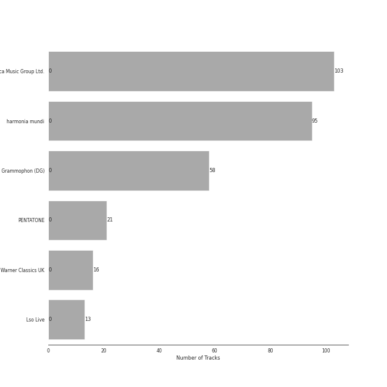

# german romanticism

306 songs

[See Track Features](audio_features.md)

[See Clusters](clusters/overview.md)

## Top Artists

| Art | Rank | Tracks | 💚 | Artist | 🔗 |
|:---|---:|---:|---:|:---|:---|
|  | 280 | 261 | 0 | [Ludwig van Beethoven](../../artists/ludwig_van_beethoven/overview.md) | [🔗](https://open.spotify.com/artist/2wOqMjp9TyABvtHdOSOTUS) |
|  | 146 | 103 | 0 | [Vladimir Ashkenazy](../../artists/vladimir_ashkenazy/overview.md) | [🔗](https://open.spotify.com/artist/20iZXzMb8LoWXOeca32i82) |
|  | 409 | 71 | 0 | [Tokyo String Quartet](../../artists/tokyo_string_quartet/overview.md) | [🔗](https://open.spotify.com/artist/15G9RnBNBDCFUMANna2CvO) |
|  | 409 | 58 | 0 | [Berliner Philharmoniker](../../artists/berliner_philharmoniker/overview.md) | [🔗](https://open.spotify.com/artist/6uRJnvQ3f8whVnmeoecv5Z) |
|  | 409 | 42 | 0 | [Herbert von Karajan](../../artists/herbert_von_karajan/overview.md) | [🔗](https://open.spotify.com/artist/5zCaQxjl110XTrm4LQ1CxY) |
|  | 409 | 32 | 0 | Johannes Brahms | [🔗](https://open.spotify.com/artist/5wTAi7QkpP6kp8a54lmTOq) |
|  | 141 | 24 | 0 | [Jerusalem Quartet](../../artists/jerusalem_quartet/overview.md) | [🔗](https://open.spotify.com/artist/7AnE8Jpu1vxLeXcs6OKYHE) |
|  | 409 | 21 | 0 | Mari Kodama | [🔗](https://open.spotify.com/artist/0s0wG03kPyu7MXERfcuxim) |
|  | 409 | 16 | 0 | Emerson String Quartet | [🔗](https://open.spotify.com/artist/4IBl8k6ZsBagsI5zRjyXH7) |
|  | 409 | 16 | 0 | Sir Simon Rattle | [🔗](https://open.spotify.com/artist/4GQwgdcDQwqtcHICjUNndp) |

See all 24 artists

| Art | Rank | Tracks | 💚 | Artist | 🔗 |
|:---|---:|---:|---:|:---|:---|
|  | 409 | 13 | 0 | Felix Mendelssohn | [🔗](https://open.spotify.com/artist/6MF58APd3YV72Ln2eVg710) |
|  | 409 | 13 | 0 | John Eliot Gardiner | [🔗](https://open.spotify.com/artist/1qIRoGEKXINqrCx5N1engi) |
|  | 409 | 12 | 0 | [London Symphony Orchestra](../../artists/london_symphony_orchestra/overview.md) | [🔗](https://open.spotify.com/artist/5yxyJsFanEAuwSM5kOuZKc) |
| | 409 | 8 | 0 | Alexander Knox | [🔗](https://open.spotify.com/artist/4vzwv4zzBTlG8qsFCqP2Yv) |
| | 409 | 6 | 0 | Ceri-lyn Cissone | [🔗](https://open.spotify.com/artist/6F3jOFmhUwRxRdWAZU6G1A) |
| | 409 | 4 | 0 | Frankie Wakefield | [🔗](https://open.spotify.com/artist/7jobsaZIFhejECE605yxx6) |
|  | 409 | 4 | 0 | Leon Fleisher | [🔗](https://open.spotify.com/artist/6ncNdxBc8zVWMOF7nJ5Pgy) |
|  | 409 | 2 | 0 | The Monteverdi Choir | [🔗](https://open.spotify.com/artist/0Cqfz92flAzrp94pgN1jEW) |
|  | 409 | 1 | 0 | José van Dam | [🔗](https://open.spotify.com/artist/5qNUHMEhszyeXNYMn4sswd) |
|  | 409 | 1 | 0 | Wiener Singverein | [🔗](https://open.spotify.com/artist/35QSympF887CO8h5eZHme2) |
|  | 409 | 1 | 0 | Vinson Cole | [🔗](https://open.spotify.com/artist/2j6cP3f3TxyHzcKdWYSm6h) |
|  | 409 | 1 | 0 | Agnes Baltsa | [🔗](https://open.spotify.com/artist/2amF56vDuTTbZJQsqUgbuC) |
|  | 409 | 1 | 0 | Janet Perry | [🔗](https://open.spotify.com/artist/1bV3KjOPs1AI3OolJiYogN) |
|  | 409 | 1 | 0 | Helmut Froschauer | [🔗](https://open.spotify.com/artist/172Encqfd2ZhWAleNg1gbO) |

## Most and least listened tracks
| Rank | ​ | Most listened tracks | Rank | ​​ | Least listened tracks |
|---:|:---|:---|---:|:---|:---|
| 490 |  | [String Quartet No. 3 in D Major, Op. 18: I. Allegro](../../artists/ludwig_van_beethoven/overview.md) | 904 |  | [String Quartet No. 4 in C Minor, Op. 18 No. 4: I. Allegro ma non tanto](../../artists/ludwig_van_beethoven/overview.md) |
| 904 |  | Brahms: Symphony No. 3 in F Major, Op. 90: III. Poco allegretto | 904 |  | String Quartet No. 3 In B Flat, Op. 67: 2. Andante |
| 904 |  | [Piano Sonata No. 18 in E flat, Op. 31 No. 3 -"The Hunt": 1. Allegro](../../artists/ludwig_van_beethoven/overview.md) | 904 |  | [String Quartet No. 15 in A minor, Op. 132: I. Assai sostenuto - Allegro](../../artists/ludwig_van_beethoven/overview.md) |
| 904 |  | [Piano Sonata No. 31 in A flat, Op. 110: 3. Adagio ma non troppo](../../artists/ludwig_van_beethoven/overview.md) | 904 |  | [String Quartet No. 2 in G Major, Op. 18, No. 2: II. Adagio cantabile - Allegro](../../artists/ludwig_van_beethoven/overview.md) |
| 904 |  | [Piano Sonata No. 11 in B flat, Op. 22: 4. Rondo (Allegretto)](../../artists/ludwig_van_beethoven/overview.md) | 904 |  | Brahms: Symphony No. 4 in E Minor, Op. 98: III. Allegro giocoso |
| 904 |  | [Symphony No. 7 In A, Op. 92: 2. Allegretto](../../artists/ludwig_van_beethoven/overview.md) | 904 |  | [Piano Sonata No. 14 in C-Sharp Minor, Op. 27 No. 2 "Moonlight": I. Adagio sostenuto](../../artists/ludwig_van_beethoven/overview.md) |
| 904 |  | [String Quartet No. 5 in A Major, Op. 18 No. 5: II. Menuetto - Trio](../../artists/ludwig_van_beethoven/overview.md) | 904 |  | Overture to "A Midsummer Night's Dream", Op. 21: Allegro di molto |
| 904 |  | [Piano Sonata No. 1 in F Minor, Op. 2 No. 1: II. Adagio](../../artists/ludwig_van_beethoven/overview.md) | 904 |  | [Piano Sonata No. 20 in G, Op. 49 No. 2: 1. Allegro ma non troppo](../../artists/ludwig_van_beethoven/overview.md) |
| 904 |  | [Piano Sonata No. 32 in C Minor, Op. 111: I. Maestoso - Allegro con brio ed appassionato](../../artists/ludwig_van_beethoven/overview.md) | 904 |  | [Piano Sonata No. 30 in E Major, Op. 109: III. Gesangvoll, mit innigster Empfindung. Andante molto cantabile ed espressivo](../../artists/ludwig_van_beethoven/overview.md) |
| 904 |  | [String Quartet No. 10 in E-Flat Major, Op. 74 "Harp": III. Presto - Più presto quasi prestissimo](../../artists/ludwig_van_beethoven/overview.md) | 904 |  | [Piano Sonata No. 23 in F Minor, Op. 57 "Appassionata": I. Allegro assai](../../artists/ludwig_van_beethoven/overview.md) |

## Top Albums

| Art | Rank | Tracks | 💚 | Album | Release Date | 🔗 |
|:---|---:|---:|---:|:---|:---|:---|
|  | 604 | 94 | 0 | Beethoven: The Piano Sonatas | 1995-01-01 | [🔗](https://open.spotify.com/album/7xbsSOswKgms1fUFuwKArz) |
|  | 604 | 71 | 0 | Beethoven: Complete String Quartets | 2010-10-12 | [🔗](https://open.spotify.com/album/4JhUG1lr4xztAcqyA0Jm3a) |
|  | 604 | 42 | 0 | Beethoven: 9 Symphonies; Overtures | 1993-01-01 | [🔗](https://open.spotify.com/album/2DQTNTznsteIZciZdyeWdj) |
|  | 342 | 24 | 0 | Beethoven: String Quartets, Op. 18 | 2015-08-31 | [🔗](https://open.spotify.com/album/37iUq5Dekt8uP5itTiVs2Q) |
|  | 604 | 16 | 0 | Brahms: The Symphonies | 2009-09-07 | [🔗](https://open.spotify.com/album/2dL2qDsg6teV1cueLxCRa1) |
|  | 604 | 16 | 0 | Brahms: String Quartets & Piano Quintet | 2007-01-01 | [🔗](https://open.spotify.com/album/5nZ5ePGoQZGt1MbGphwqph) |
|  | 604 | 13 | 0 | Mendelssohn: A Midsummer Night's Dream | 2017-02-03 | [🔗](https://open.spotify.com/album/60J66evwnrnfH03HgDTrwN) |
|  | 604 | 12 | 0 | Beethoven: Piano Sonatas Nos. 1-3 | 2008-01-01 | [🔗](https://open.spotify.com/album/5CjMjZJnjdHHgwAVkqrvXq) |
|  | 604 | 9 | 0 | Beethoven: Piano Sonatas Nos. 30, 31 & 32 | 2012-03-06 | [🔗](https://open.spotify.com/album/478l1JdqbqDzcmmgrqw2zu) |
|  | 604 | 9 | 0 | Beethoven: Piano Sonatas "Moonlight"; "Appassionata"; "Pathétique" | 1983-01-01 | [🔗](https://open.spotify.com/album/0RCfE1YhkdrjnM3kXT3YLl) |

## Top Record Labels

| Tracks | 💚 | Label |
|---:|---:|:---|
| 103 | 0 | [Decca Music Group Ltd.](../../labels/decca_music_group_ltd_/overview.md) |
| 95 | 0 | [harmonia mundi](../../labels/harmonia_mundi/overview.md) |
| 58 | 0 | [Deutsche Grammophon (DG)](../../labels/deutsche_grammophon_(dg)/overview.md) |
| 21 | 0 | [PENTATONE](../../labels/pentatone/overview.md) |
| 16 | 0 | [Warner Classics UK](../../labels/warner_classics_uk/overview.md) |
| 13 | 0 | [Lso Live](../../labels/lso_live/overview.md) |

## Years

| ​ | 10 newest albums | ​​ | 10 oldest albums |
|:---|:---|:---|:---|
|  | Mendelssohn: A Midsummer Night's Dream (2017-02-03) |  | Beethoven: Piano Sonatas "Moonlight"; "Appassionata"; "Pathétique" (1983-01-01) |
|  | Beethoven: String Quartets, Op. 18 (2015-08-31) |  | Beethoven: 9 Symphonies; Overtures (1993-01-01) |
|  | Beethoven: Piano Sonatas Nos. 30, 31 & 32 (2012-03-06) |  | Beethoven: The Piano Sonatas (1995-01-01) |
|  | Beethoven: Complete String Quartets (2010-10-12) |  | Brahms: String Quartets & Piano Quintet (2007-01-01) |
|  | Brahms: The Symphonies (2009-09-07) |  | Beethoven: Piano Sonatas Nos. 1-3 (2008-01-01) |
|  | Beethoven: Piano Sonatas Nos. 1-3 (2008-01-01) |  | Brahms: The Symphonies (2009-09-07) |
|  | Brahms: String Quartets & Piano Quintet (2007-01-01) |  | Beethoven: Complete String Quartets (2010-10-12) |
|  | Beethoven: The Piano Sonatas (1995-01-01) |  | Beethoven: Piano Sonatas Nos. 30, 31 & 32 (2012-03-06) |
|  | Beethoven: 9 Symphonies; Overtures (1993-01-01) |  | Beethoven: String Quartets, Op. 18 (2015-08-31) |
|  | Beethoven: Piano Sonatas "Moonlight"; "Appassionata"; "Pathétique" (1983-01-01) |  | Mendelssohn: A Midsummer Night's Dream (2017-02-03) |

