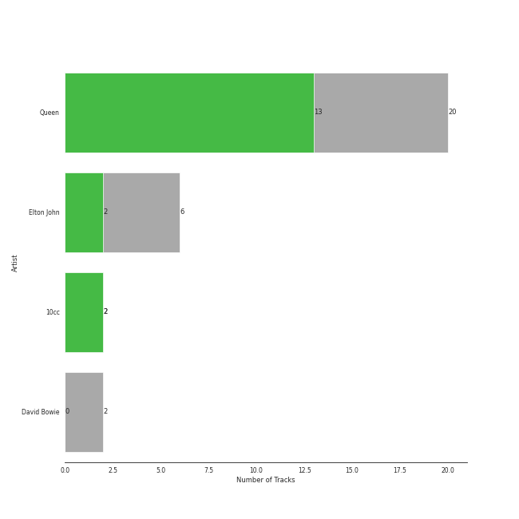
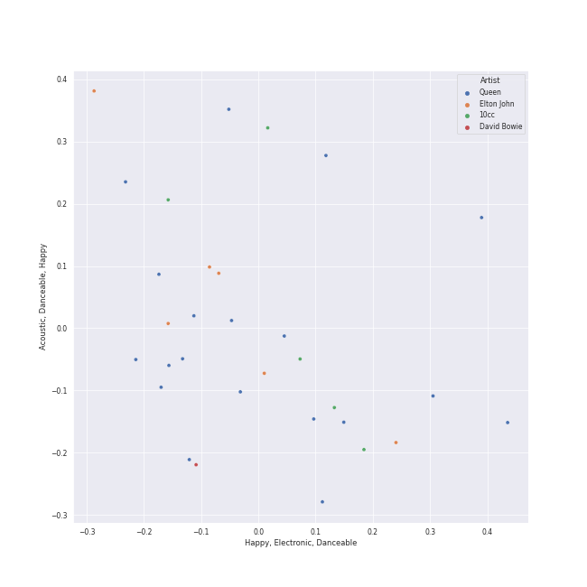
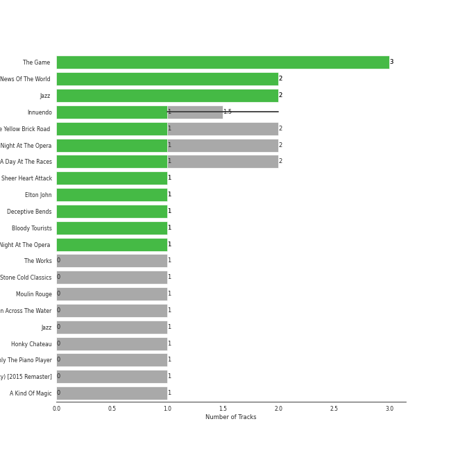
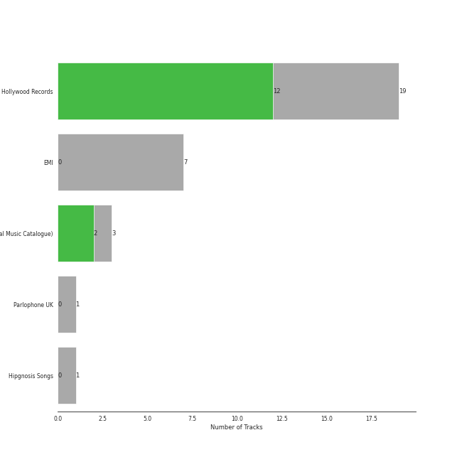
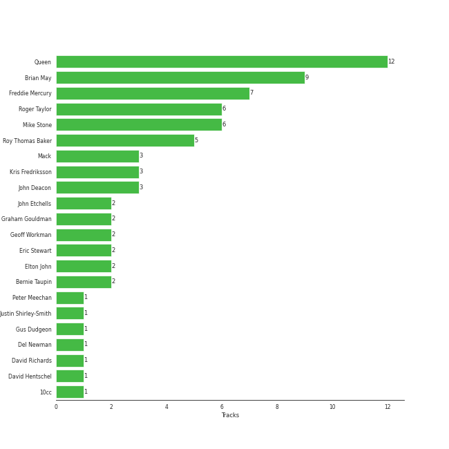
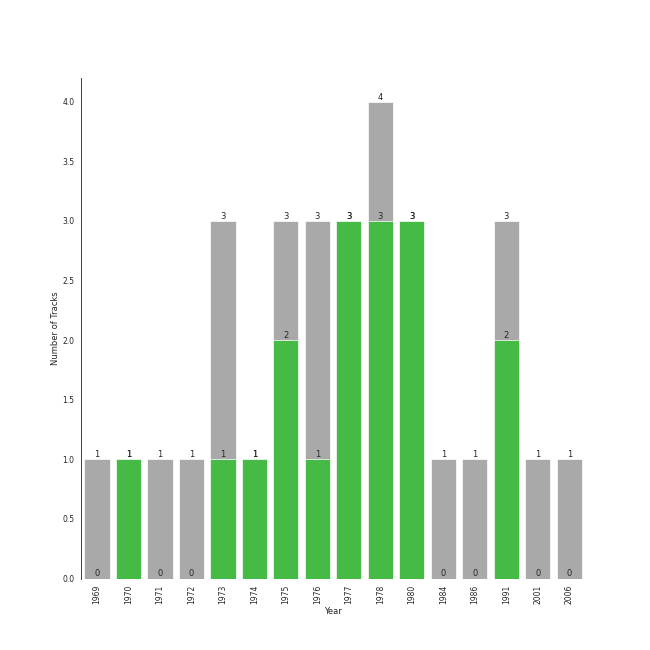

# glam rock

30 songs

[See Track Features](audio_features.md)

[See Clusters](clusters/overview.md)

## Top Artists

| Art | Tracks | 💚 | Artist | 🔗 |
|:---|---:|---:|:---|:---|
|  | 20 | 13 | [Queen](../../artists/queen/overview.md) | [🔗](https://open.spotify.com/artist/1dfeR4HaWDbWqFHLkxsg1d) |
|  | 6 | 2 | Elton John | [🔗](https://open.spotify.com/artist/3PhoLpVuITZKcymswpck5b) |
|  | 2 | 2 | 10cc | [🔗](https://open.spotify.com/artist/6i6WlGzQtXtz7GcC5H5st5) |
|  | 2 | 0 | David Bowie | [🔗](https://open.spotify.com/artist/0oSGxfWSnnOXhD2fKuz2Gy) |

## Most and least listened tracks
| ​ | Most listened tracks | Score | ​​ | Least listened tracks | Score |
|:---|:---|---:|:---|:---|---:|
|  | Your Song | 308 |  | [I Want To Break Free](../../artists/queen/overview.md) | 0 |
|  | [Fat Bottomed Girls - Remastered 2011](../../artists/queen/overview.md) | 24 |  | [Killer Queen](../../artists/queen/overview.md) | 0 |
|  | [Innuendo](../../artists/queen/overview.md) | 8 |  | Candle In The Wind - Remastered 2014 | 0 |
|  | [Bohemian Rhapsody - Remastered 2011](../../artists/queen/overview.md) | 0 |  | Dreadlock Holiday | 0 |
|  | [Don't Stop Me Now - Remastered 2011](../../artists/queen/overview.md) | 0 |  | Good Morning Judge | 0 |
|  | [We Are The Champions - Remastered 2011](../../artists/queen/overview.md) | 0 |  | [Innuendo - Remastered 2011](../../artists/queen/overview.md) | 0 |
|  | [Somebody To Love](../../artists/queen/overview.md) | 0 |  | Tiny Dancer | 0 |
|  | [A Kind Of Magic](../../artists/queen/overview.md) | 0 |  | [Save Me - Remastered 2011](../../artists/queen/overview.md) | 0 |
|  | Space Oddity - 2015 Remaster | 0 |  | [Crazy Little Thing Called Love - Remastered 2011](../../artists/queen/overview.md) | 0 |
|  | [Bohemian Rhapsody](../../artists/queen/overview.md) | 0 |  | [Good Old Fashioned Lover Boy](../../artists/queen/overview.md) | 0 |

## Top Albums

| Art | Tracks | 💚 | Album | Release Date | 🔗 |
|:---|---:|---:|:---|:---|:---|
|  | 3 | 3 | The Game (Deluxe Remastered Version) | 1980-06-27 | [🔗](https://open.spotify.com/album/6wPXUmYJ9mOWrKlLzZ5cCa) |
|  | 2 | 2 | News Of The World (Deluxe Remastered Version) | 1977-10-28 | [🔗](https://open.spotify.com/album/6Di4m5k1BtMJ0R44bWNutu) |
|  | 2 | 2 | Jazz (Deluxe Remastered Version) | 1978-11-10 | [🔗](https://open.spotify.com/album/21HMAUrbbYSj9NiPPlGumy) |
|  | 2 | 1 | Innuendo | 1991-02-04 | [🔗](https://open.spotify.com/album/5yAM3CcaXF6DPRJW3oL6Ya) |
|  | 2 | 1 | Goodbye Yellow Brick Road (Remastered) | 1973-10-05 | [🔗](https://open.spotify.com/album/5WupqgR68HfuHt3BMJtgun) |
|  | 2 | 1 | A Night At The Opera | 1975-11-21 | [🔗](https://open.spotify.com/album/3KCJzwKOdBxDu6TKaFPqM9) |
|  | 2 | 1 | A Day At The Races | 1976-12-10 | [🔗](https://open.spotify.com/album/3f45rzbU4dYQBTV9v5RFBB) |
|  | 1 | 1 | Sheer Heart Attack | 1974-11-08 | [🔗](https://open.spotify.com/album/4yO8TpSaJtUKkkjmsA4VXf) |
|  | 1 | 1 | Innuendo | 1991-02-04 | [🔗](https://open.spotify.com/album/3jYy7yGNCysTHE8MKrIF1k) |
|  | 1 | 1 | Elton John | 1970-04-10 | [🔗](https://open.spotify.com/album/69P9Ro0W286yLFgYwrGVN0) |

See all 22 albums

| Art | Tracks | 💚 | Album | Release Date | 🔗 |
|:---|---:|---:|:---|:---|:---|
|  | 1 | 1 | Deceptive Bends | 1977 | [🔗](https://open.spotify.com/album/6D3RQD5AQZ4P2aDzsZmBI4) |
|  | 1 | 1 | Bloody Tourists | 1978 | [🔗](https://open.spotify.com/album/3MecVG0PeBObAhjwEAczFG) |
|  | 1 | 1 | A Night At The Opera (Deluxe Remastered Version) | 1975-11-21 | [🔗](https://open.spotify.com/album/6X9k3hSsvQck2OfKYdBbXr) |
|  | 1 | 0 | The Works | 1984-02-27 | [🔗](https://open.spotify.com/album/0FbnXAGmgmWBmNthZSgm43) |
|  | 1 | 0 | Stone Cold Classics | 2006-01-01 | [🔗](https://open.spotify.com/album/7C2DKB8C12LqxMkfJRwTo9) |
|  | 1 | 0 | Moulin Rouge | 2001-01-01 | [🔗](https://open.spotify.com/album/1Kg7AyuyIMTfD6geg9VghI) |
|  | 1 | 0 | Madman Across The Water | 1971-11-05 | [🔗](https://open.spotify.com/album/2OZbaW9tgO62ndm375lFZr) |
|  | 1 | 0 | Jazz | 1978-11-10 | [🔗](https://open.spotify.com/album/5X3rA8To5GDOeIWdQyMEcE) |
|  | 1 | 0 | Honky Chateau | 1972-05-19 | [🔗](https://open.spotify.com/album/2ei2X6ghPnw7YRwQtAH075) |
|  | 1 | 0 | Don't Shoot Me I'm Only The Piano Player | 1973-01-22 | [🔗](https://open.spotify.com/album/1reJ8DttK5EGwdyf7y9FBR) |
|  | 1 | 0 | David Bowie (aka Space Oddity) [2015 Remaster] | 1969-11-04 | [🔗](https://open.spotify.com/album/1ay9Z4R5ZYI2TY7WiDhNYQ) |
|  | 1 | 0 | A Kind Of Magic | 1986-06-02 | [🔗](https://open.spotify.com/album/34xBXeJgmQrn1wQvhyVCsw) |

## Top Record Labels

| Tracks | 💚 | Label |
|---:|---:|:---|
| 20 | 13 | [Hollywood Records](../../labels/hollywood_records/overview.md) |
| 5 | 2 | [EMI](../../labels/emi/overview.md) |
| 3 | 2 | [UMC (Universal Music Catalogue)](../../labels/umc_(universal_music_catalogue)/overview.md) |
| 1 | 0 | [Parlophone UK](../../labels/parlophone_uk/overview.md) |
| 1 | 0 | Moulin Rouge |
| 1 | 0 | [Interscope Records](../../labels/interscope_records/overview.md) |

## Top Producers

| Art | Producer | Tracks | Credit Types |
|:---|:---|---:|:---|
|  | [Queen](../../artists/queen/overview.md) | 12 | Producer, Arranger |
| | [Brian May](../../producers/brian_may/overview.md) | 9 | Songwriter, Lyricist, Producer, Arranger |
| | [Freddie Mercury](../../producers/freddie_mercury/overview.md) | 7 | Songwriter, Lyricist |
| | Mike Stone | 6 | Producer |
| | Roger Taylor | 6 | Songwriter, Producer |
| | Roy Thomas Baker | 5 | Producer |
| | Mack | 3 | Producer |
| | John Deacon | 3 | Songwriter, Lyricist |
| | Kris Fredriksson | 3 | Producer |
| | Eric Stewart | 2 | Producer, Songwriter |

View all

| Art | Producer | Tracks | Credit Types |
|:---|:---|---:|:---|
|  | Elton John | 2 | Songwriter |
| | Bernie Taupin | 2 | Lyricist |
| | Graham Gouldman | 2 | Producer, Songwriter |
| | John Etchells | 2 | Producer |
| | Geoff Workman | 2 | Producer |
| | Justin Shirley-Smith | 1 | Producer |
| | David Richards | 1 | Producer |
| | Del Newman | 1 | Arranger |
| | Peter Meechan | 1 | Arranger |
| | David Hentschel | 1 | Producer |
| | Gus Dudgeon | 1 | Producer |
|  | 10cc | 1 | Producer |

## Years

| ​ | 10 newest albums | ​​ | 10 oldest albums |
|:---|:---|:---|:---|
|  | Stone Cold Classics (2006-01-01) |  | David Bowie (aka Space Oddity) [2015 Remaster] (1969-11-04) |
|  | Moulin Rouge (2001-01-01) |  | Elton John (1970-04-10) |
|  | Innuendo (1991-02-04) |  | Madman Across The Water (1971-11-05) |
|  | Innuendo (1991-02-04) |  | Honky Chateau (1972-05-19) |
|  | A Kind Of Magic (1986-06-02) |  | Don't Shoot Me I'm Only The Piano Player (1973-01-22) |
|  | The Works (1984-02-27) |  | Goodbye Yellow Brick Road (Remastered) (1973-10-05) |
|  | The Game (Deluxe Remastered Version) (1980-06-27) |  | Sheer Heart Attack (1974-11-08) |
|  | Jazz (1978-11-10) |  | A Night At The Opera (Deluxe Remastered Version) (1975-11-21) |
|  | Jazz (Deluxe Remastered Version) (1978-11-10) |  | A Night At The Opera (1975-11-21) |
|  | Bloody Tourists (1978) |  | A Day At The Races (1976-12-10) |

