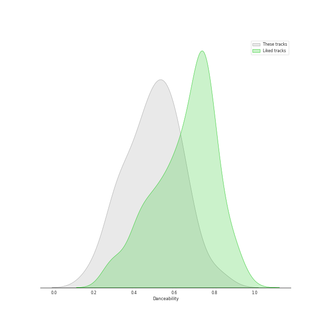
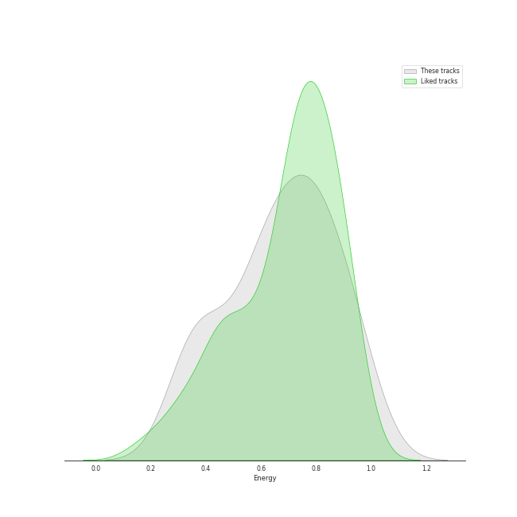
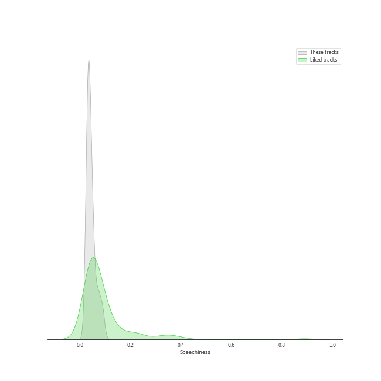
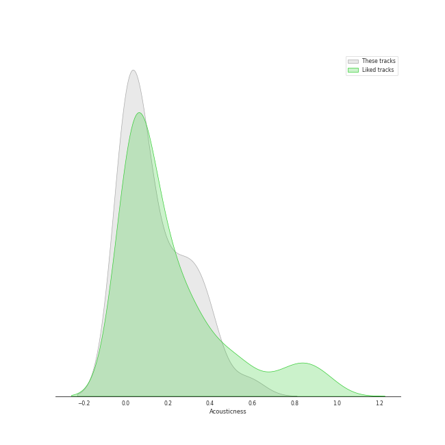
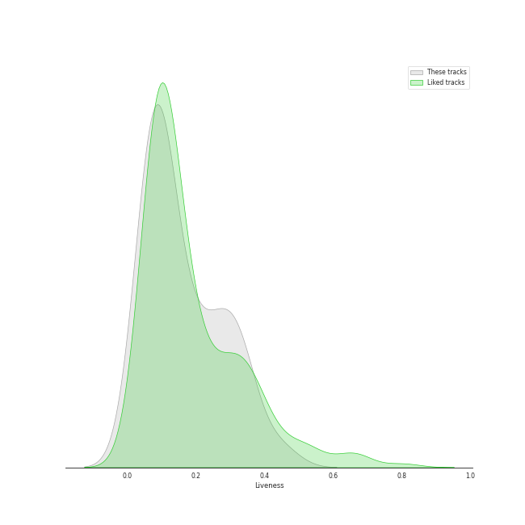
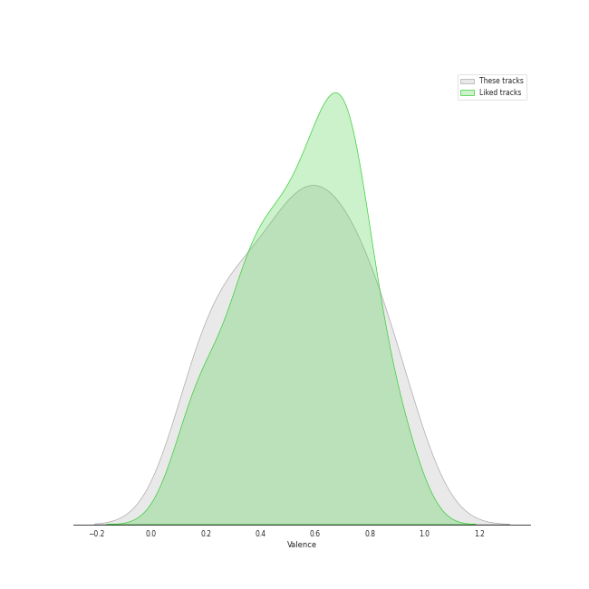
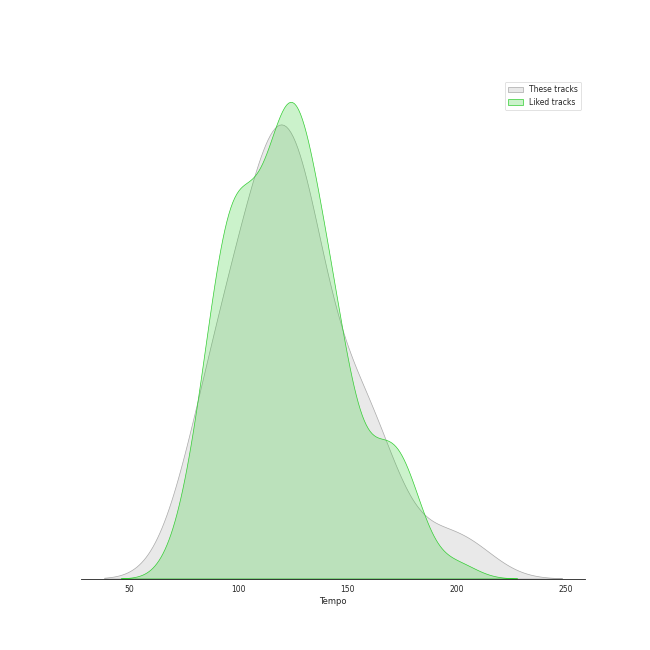

# Track Features for hard rock

## Danceability

| ​ | 10 most Danceable tracks | ​​ | 10 least Danceable tracks |
|:---|:---|:---|:---|
|  | Eye of the Tiger (0.817) |  | Lights (0.193) |
|  | Won't Get Fooled Again - Remix (0.702) |  | The Trooper - 2015 Remaster (0.285) |
|  | Walk This Way (0.653) |  | Dream On (0.307) |
|  | Who Are You (0.651) |  | Back In Black (0.31) |
|  | Smoke on the Water (0.632) |  | Come Sail Away (0.324) |
|  | Hard To Handle (0.599) |  | Iron Man (0.332) |
|  | The Joker (0.596) |  | Stairway to Heaven - Remaster (0.338) |
|  | Enter Sandman (0.579) |  | Behind Blue Eyes (0.394) |
|  | Immigrant Song - Remaster (0.564) |  | Paranoid - 2012 - Remaster (0.412) |
|  | Cold as Ice (0.562) |  | My Generation - Stereo Version (0.412) |

## Energy

| ​ | 10 most Energetic tracks | ​​ | 10 least Energetic tracks |
|:---|:---|:---|:---|
|  | Sweet Child O' Mine (0.952) |  | Dust in the Wind (0.322) |
|  | Immigrant Song - Remaster (0.932) |  | Come Sail Away (0.335) |
|  | Any Way You Want It (0.932) |  | Stairway to Heaven - Remaster (0.34) |
|  | The Trooper - 2015 Remaster (0.908) |  | Nothing Else Matters (0.364) |
|  | Black Dog - Remaster (0.864) |  | Dream On (0.433) |
|  | Won't Get Fooled Again - Remix (0.841) |  | The Joker (0.448) |
|  | Wherever I May Roam (Remastered) (0.834) |  | Lights (0.498) |
|  | Enter Sandman (0.824) |  | Renegade (0.552) |
|  | Hard To Handle (0.79) |  | Smoke on the Water (0.586) |
|  | Carry on Wayward Son (0.786) |  | Eye of the Tiger (0.599) |

## Speechiness

| ​ | 10 most Speechy tracks | ​​ | 10 least Speechy tracks |
|:---|:---|:---|:---|
|  | Black Dog - Remaster (0.0904) |  | Nothing Else Matters (0.0265) |
|  | Iron Man (0.0765) |  | Cold as Ice (0.0271) |
|  | Paranoid - 2012 - Remaster (0.0708) |  | Dust in the Wind (0.0283) |
|  | The Trooper - 2015 Remaster (0.0705) |  | Smoke on the Water (0.0284) |
|  | My Generation - Stereo Version (0.058) |  | Dream On (0.029) |
|  | Immigrant Song - Remaster (0.0554) |  | Enter Sandman (0.03) |
|  | Sweet Child O' Mine (0.0523) |  | Carry on Wayward Son (0.032) |
|  | Who Are You (0.0501) |  | Eye of the Tiger (0.0328) |
|  | Any Way You Want It (0.0488) |  | Behind Blue Eyes (0.0336) |
|  | Back In Black (0.047) |  | Stairway to Heaven - Remaster (0.0339) |

## Acousticness

| ​ | 10 most Acoustic tracks | ​​ | 10 least Acoustic tracks |
|:---|:---|:---|:---|
|  | Stairway to Heaven - Remaster (0.58) |  | Paranoid - 2012 - Remaster (4.52e-05) |
|  | Black Dog - Remaster (0.396) |  | Wherever I May Roam (Remastered) (0.000646) |
|  | Dream On (0.388) |  | Enter Sandman (0.00206) |
|  | Dust in the Wind (0.367) |  | Any Way You Want It (0.00251) |
|  | The Joker (0.365) |  | Hard To Handle (0.00257) |
|  | Baba O'Riley (0.313) |  | Carry on Wayward Son (0.00321) |
|  | My Generation - Stereo Version (0.308) |  | Iron Man (0.00367) |
|  | Who Are You (0.262) |  | Back In Black (0.011) |
|  | Won't Get Fooled Again - Remix (0.256) |  | Walk This Way (0.0114) |
|  | Behind Blue Eyes (0.213) |  | Immigrant Song - Remaster (0.013) |

## Instrumentalness

| ​ | 10 most Instrumental tracks | ​​ | 10 least Instrumental tracks |
|:---|:---|:---|:---|
|  | Smoke on the Water (0.581) |  | Don't Stop Believin' (0.0) |
|  | Won't Get Fooled Again - Remix (0.235) |  | Pinball Wizard (0.0) |
|  | Baba O'Riley (0.185) |  | Cold as Ice (0.0) |
|  | Immigrant Song - Remaster (0.169) |  | Come Sail Away (1.08e-06) |
|  | Sweet Child O' Mine (0.0857) |  | Nothing Else Matters (5.02e-06) |
|  | Black Dog - Remaster (0.0314) |  | The Joker (5.3e-06) |
|  | Back In Black (0.00965) |  | Walk This Way (1.03e-05) |
|  | The Trooper - 2015 Remaster (0.00909) |  | Renegade (3.74e-05) |
|  | Enter Sandman (0.00903) |  | Behind Blue Eyes (4.45e-05) |
|  | My Generation - Stereo Version (0.00822) |  | Carry on Wayward Son (8.88e-05) |

## Liveness

| ​ | 10 most Live tracks | ​​ | 10 least Live tracks |
|:---|:---|:---|:---|
|  | Don't Stop Believin' (0.447) |  | Iron Man (0.0372) |
|  | Carry on Wayward Son (0.446) |  | Smoke on the Water (0.0535) |
|  | Immigrant Song - Remaster (0.349) |  | Won't Get Fooled Again - Remix (0.0584) |
|  | Lights (0.332) |  | Enter Sandman (0.059) |
|  | Dream On (0.332) |  | Who Are You (0.0655) |
|  | Hard To Handle (0.312) |  | Renegade (0.0723) |
|  | The Trooper - 2015 Remaster (0.311) |  | Nothing Else Matters (0.0753) |
|  | Baba O'Riley (0.287) |  | Walk This Way (0.0754) |
|  | Pinball Wizard (0.256) |  | My Generation - Stereo Version (0.0775) |
|  | Black Dog - Remaster (0.242) |  | Back In Black (0.0828) |

## Valence

| ​ | 10 most Happy tracks | ​​ | 10 least Happy tracks |
|:---|:---|:---|:---|
|  | Hard To Handle (0.961) |  | Come Sail Away (0.141) |
|  | Walk This Way (0.894) |  | Baba O'Riley (0.15) |
|  | Smoke on the Water (0.89) |  | Nothing Else Matters (0.17) |
|  | The Joker (0.796) |  | Stairway to Heaven - Remaster (0.197) |
|  | Carry on Wayward Son (0.793) |  | Dream On (0.224) |
|  | Back In Black (0.763) |  | Won't Get Fooled Again - Remix (0.271) |
|  | Black Dog - Remaster (0.749) |  | Wherever I May Roam (Remastered) (0.339) |
|  | My Generation - Stereo Version (0.705) |  | Behind Blue Eyes (0.342) |
|  | The Trooper - 2015 Remaster (0.669) |  | Lights (0.344) |
|  | Renegade (0.655) |  | Dust in the Wind (0.387) |

## Tempo

| ​ | 10 most Fast tracks | ​​ | 10 least Fast tracks |
|:---|:---|:---|:---|
|  | Lights (205.422) |  | Black Dog - Remaster (81.394) |
|  | Back In Black (188.386) |  | Stairway to Heaven - Remaster (82.433) |
|  | Paranoid - 2012 - Remaster (163.071) |  | The Joker (83.293) |
|  | Dream On (160.9) |  | Dust in the Wind (93.503) |
|  | The Trooper - 2015 Remaster (159.756) |  | My Generation - Stereo Version (96.732) |
|  | Iron Man (157.378) |  | Hard To Handle (103.783) |
|  | Who Are You (156.372) |  | Renegade (105.623) |
|  | Nothing Else Matters (142.171) |  | Walk This Way (108.705) |
|  | Any Way You Want It (138.158) |  | Eye of the Tiger (108.873) |
|  | Won't Get Fooled Again - Remix (134.919) |  | Immigrant Song - Remaster (112.937) |
