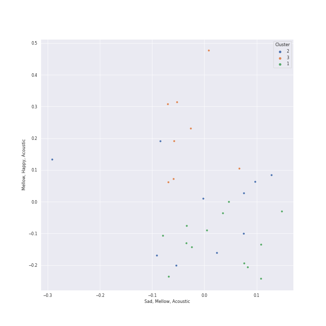

# Clusters in hard rock

## Cluster #1

13 tracks

| Art | Track | Album | Artists | Label | 💚 | 🔗 |
|:---|:---|:---|:---|:---|:---|:---|
|  | Paranoid - 2012 - Remaster | Paranoid (Remaster) | Black Sabbath | [Rhino](../../../../labels/rhino), [Warner Records](../../../../labels/warner_records) | | [🔗](https://open.spotify.com/track/1Y373MqadDRtclJNdnUXVc) |
|  | Iron Man | The Ultimate Collection | Black Sabbath | [Rhino](../../../../labels/rhino), [Warner Records](../../../../labels/warner_records) | 💚 | [🔗](https://open.spotify.com/track/4svkPL62HbvyFgf0nHFXAF) |
|  | Cold as Ice | Foreigner (Expanded) | Foreigner | Rhino Atlantic | 💚 | [🔗](https://open.spotify.com/track/7vidktgNZFQylTgH1GEnMs) |
|  | Sweet Child O' Mine | Appetite For Destruction | Guns N' Roses | Guns N Roses P&D | 💚 | [🔗](https://open.spotify.com/track/7snQQk1zcKl8gZ92AnueZW) |
|  | Any Way You Want It | Departure | Journey | [Columbia](../../../../labels/columbia), [Legacy](../../../../labels/legacy) | | [🔗](https://open.spotify.com/track/71SvEDmsOwIWw1IozsZoMA) |
|  | Enter Sandman | Metallica | Metallica | Blackened Recordings | 💚 | [🔗](https://open.spotify.com/track/5BIMPccDwShpXq784RJlJp) |
|  | Wherever I May Roam (Remastered) | Metallica (Remastered) | Metallica | Blackened Recordings | 💚 | [🔗](https://open.spotify.com/track/745sNpjWbAxo2MA2zSYbyD) |
|  | Eye of the Tiger | Rocky IV | Survivor | [Volcano/Legacy](../../../../labels/legacy) | | [🔗](https://open.spotify.com/track/2KH16WveTQWT6KOG9Rg6e2) |
|  | Pinball Wizard | Tommy | [The Who](../../../../artists/the_who/overview.md) | [UMC (Universal Music Catalogue)](../../../../labels/umc_(universal_music_catalogue)) | 💚 | [🔗](https://open.spotify.com/track/6LbbHFEajG9e4m0G3L47c4) |
|  | Who Are You | Who Are You | [The Who](../../../../artists/the_who/overview.md) | [Geffen](../../../../labels/geffen) | 💚 | [🔗](https://open.spotify.com/track/23IJ5wLRhEZ9DOuia5mPiZ) |
## Cluster #2

10 tracks

| Art | Track | Album | Artists | Label | 💚 | 🔗 |
|:---|:---|:---|:---|:---|:---|:---|
|  | Back In Black | Back In Black | AC/DC | [Columbia](../../../../labels/columbia) | 💚 | [🔗](https://open.spotify.com/track/08mG3Y1vljYA6bvDt4Wqkj) |
|  | Walk This Way | Toys In The Attic | Aerosmith | [Columbia](../../../../labels/columbia) | | [🔗](https://open.spotify.com/track/5SZ6zX4rOrEQferfFC2MfP) |
|  | Smoke on the Water | Machine Head | Deep Purple | [Rhino](../../../../labels/rhino), [Warner Records](../../../../labels/warner_records) | | [🔗](https://open.spotify.com/track/5SAUIWdZ04OxYfJFDchC7S) |
|  | The Trooper - 2015 Remaster | Piece of Mind (2015 - Remaster) | Iron Maiden | Sanctuary Records | | [🔗](https://open.spotify.com/track/1Ab3hhOw1TJWDgO10vlxNZ) |
|  | Carry on Wayward Son | Leftoverture (Expanded Edition) | Kansas | [Epic](../../../../labels/epic), [Legacy](../../../../labels/legacy) | | [🔗](https://open.spotify.com/track/4DMKwE2E2iYDKY01C335Uw) |
|  | Black Dog - Remaster | Led Zeppelin IV (Deluxe Edition) | Led Zeppelin | [Atlantic Records](../../../../labels/atlantic_records) | | [🔗](https://open.spotify.com/track/3qT4bUD1MaWpGrTwcvguhb) |
|  | The Joker | The Joker | Steve Miller Band | CAPITOL CATALOG MKT (C92) | 💚 | [🔗](https://open.spotify.com/track/1bp2IO61zbQrbWNmKKxg3f) |
|  | Renegade | Pieces Of Eight | Styx | A&M | 💚 | [🔗](https://open.spotify.com/track/1CQqupcyMg7176PPmIVmSj) |
|  | Hard To Handle | Shake Your Money Maker | The Black Crowes | American Recordings Catalog P&D | 💚 | [🔗](https://open.spotify.com/track/05NYcsjJwOYq4jIiKPVj9p) |
|  | My Generation - Stereo Version | My Generation (Stereo Version) | [The Who](../../../../artists/the_who/overview.md) | [Geffen](../../../../labels/geffen) | 💚 | [🔗](https://open.spotify.com/track/4u9f8hqstB7iITDJNzKhQx) |
## Cluster #3

8 tracks

| Art | Track | Album | Artists | Label | 💚 | 🔗 |
|:---|:---|:---|:---|:---|:---|:---|
|  | Dream On | Aerosmith | Aerosmith | [Columbia](../../../../labels/columbia) | 💚 | [🔗](https://open.spotify.com/track/5MxNLUsfh7uzROypsoO5qe) |
|  | Lights | Infinity | Journey | [Columbia](../../../../labels/columbia), [Legacy](../../../../labels/legacy) | 💚 | [🔗](https://open.spotify.com/track/7EHmKkyAr6MZv5Y2FdZbXw) |
|  | Dust in the Wind | Point Of Know Return (Expanded Edition) | Kansas | [Epic](../../../../labels/epic), [Legacy](../../../../labels/legacy) | 💚 | [🔗](https://open.spotify.com/track/6zeE5tKyr8Nu882DQhhSQI) |
|  | Stairway to Heaven - Remaster | Led Zeppelin IV (Deluxe Edition) | Led Zeppelin | [Atlantic Records](../../../../labels/atlantic_records) | | [🔗](https://open.spotify.com/track/5CQ30WqJwcep0pYcV4AMNc) |
|  | Nothing Else Matters | Metallica | Metallica | Blackened Recordings | | [🔗](https://open.spotify.com/track/10igKaIKsSB6ZnWxPxPvKO) |
|  | Come Sail Away | The Grand Illusion | Styx | A&M | 💚 | [🔗](https://open.spotify.com/track/0PsbWiVtix5FoTZ1s00mEl) |
|  | Baba O'Riley | Who's Next (Deluxe Edition) | [The Who](../../../../artists/the_who/overview.md) | [Polydor Records](../../../../labels/polydor_records) | 💚 | [🔗](https://open.spotify.com/track/3qiyyUfYe7CRYLucrPmulD) |
|  | Behind Blue Eyes | Who's Next (Deluxe Edition) | [The Who](../../../../artists/the_who/overview.md) | [Polydor Records](../../../../labels/polydor_records) | 💚 | [🔗](https://open.spotify.com/track/0cKk8BKEi7zXbdrYdyqBP5) |