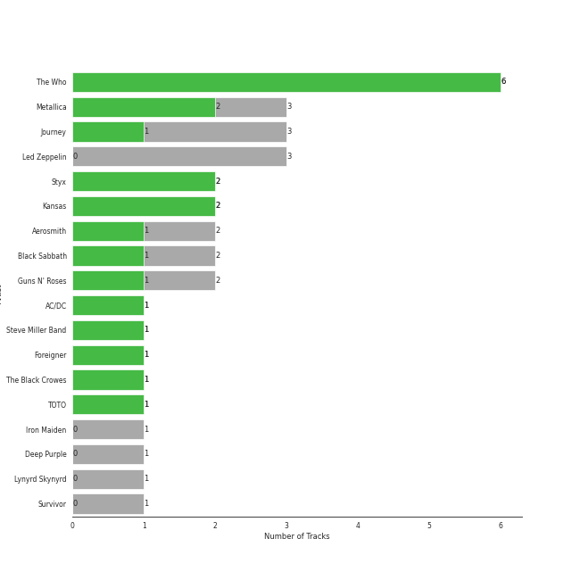
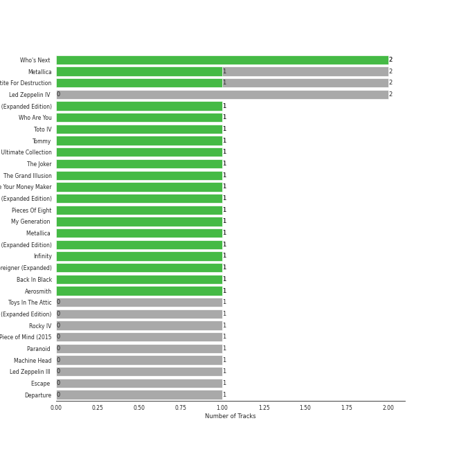
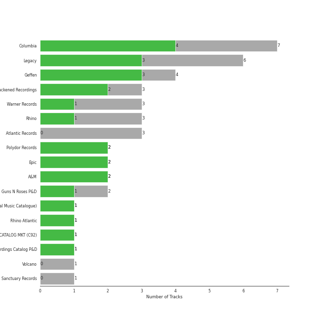
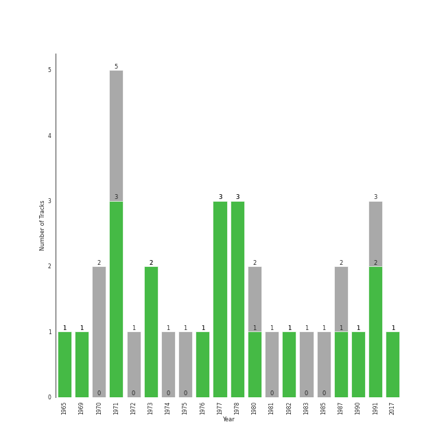

# hard rock

34 songs

[See Track Features](audio_features.md)

[See Clusters](clusters/overview.md)

## Top Artists

| Art | Rank | Tracks | 💚 | Artist | 🔗 |
|:---|---:|---:|---:|:---|:---|
|  | 327 | 6 | 6 | [The Who](../../artists/the_who/overview.md) | [🔗](https://open.spotify.com/artist/67ea9eGLXYMsO2eYQRui3w) |
|  | 419 | 3 | 2 | Metallica | [🔗](https://open.spotify.com/artist/2ye2Wgw4gimLv2eAKyk1NB) |
|  | 312 | 2 | 2 | Styx | [🔗](https://open.spotify.com/artist/4salDzkGmfycRqNUbyBphh) |
|  | 419 | 2 | 2 | Kansas | [🔗](https://open.spotify.com/artist/2hl0xAkS2AIRAu23TVMBG1) |
|  | 419 | 3 | 1 | Journey | [🔗](https://open.spotify.com/artist/0rvjqX7ttXeg3mTy8Xscbt) |
|  | 419 | 2 | 1 | Aerosmith | [🔗](https://open.spotify.com/artist/7Ey4PD4MYsKc5I2dolUwbH) |
|  | 419 | 2 | 1 | Black Sabbath | [🔗](https://open.spotify.com/artist/5M52tdBnJaKSvOpJGz8mfZ) |
|  | 345 | 2 | 1 | Guns N' Roses | [🔗](https://open.spotify.com/artist/3qm84nBOXUEQ2vnTfUTTFC) |
|  | 419 | 1 | 1 | AC/DC | [🔗](https://open.spotify.com/artist/711MCceyCBcFnzjGY4Q7Un) |
|  | 419 | 1 | 1 | Steve Miller Band | [🔗](https://open.spotify.com/artist/6QtGlUje9TIkLrgPZrESuk) |

See all 18 artists

| Art | Rank | Tracks | 💚 | Artist | 🔗 |
|:---|---:|---:|---:|:---|:---|
|  | 419 | 1 | 1 | Foreigner | [🔗](https://open.spotify.com/artist/6IRouO5mvvfcyxtPDKMYFN) |
|  | 419 | 1 | 1 | The Black Crowes | [🔗](https://open.spotify.com/artist/5krkohEVJYw0qoB5VWwxaC) |
|  | 234 | 1 | 1 | TOTO | [🔗](https://open.spotify.com/artist/0PFtn5NtBbbUNbU9EAmIWF) |
|  | 419 | 3 | 0 | Led Zeppelin | [🔗](https://open.spotify.com/artist/36QJpDe2go2KgaRleHCDTp) |
|  | 419 | 1 | 0 | Iron Maiden | [🔗](https://open.spotify.com/artist/6mdiAmATAx73kdxrNrnlao) |
|  | 419 | 1 | 0 | Deep Purple | [🔗](https://open.spotify.com/artist/568ZhdwyaiCyOGJRtNYhWf) |
|  | 419 | 1 | 0 | Lynyrd Skynyrd | [🔗](https://open.spotify.com/artist/4MVyzYMgTwdP7Z49wAZHx0) |
|  | 419 | 1 | 0 | Survivor | [🔗](https://open.spotify.com/artist/26bcq2nyj5GB7uRr558iQg) |

## Most and least listened tracks
| Rank | ​ | Most listened tracks | Rank | ​​ | Least listened tracks |
|---:|:---|:---|---:|:---|:---|
| 380 |  | Africa | 934 |  | Cold as Ice |
| 596 |  | Renegade | 934 |  | Sweet Child O' Mine |
| 633 |  | [Who Are You](../../artists/the_who/overview.md) | 934 |  | Sweet Home Alabama |
| 704 |  | Welcome To The Jungle | 934 |  | Lights |
| 934 |  | Hard To Handle | 934 |  | Immigrant Song - Remaster |
| 934 |  | Back In Black | 934 |  | Wherever I May Roam (Remastered) |
| 934 |  | Come Sail Away | 934 |  | Any Way You Want It |
| 934 |  | [Behind Blue Eyes](../../artists/the_who/overview.md) | 934 |  | Dust in the Wind |
| 934 |  | Nothing Else Matters | 934 |  | [Pinball Wizard](../../artists/the_who/overview.md) |
| 934 |  | The Trooper - 2015 Remaster | 934 |  | Walk This Way |

## Top Albums

| Art | Rank | Tracks | 💚 | Album | Release Date | 🔗 |
|:---|---:|---:|---:|:---|:---|:---|
|  | 619 | 2 | 2 | Who's Next (Deluxe Edition) | 1971-08-14 | [🔗](https://open.spotify.com/album/5MqyhhHbT13zsloD3uHhlQ) |
|  | 619 | 2 | 1 | Metallica | 1991-08-12 | [🔗](https://open.spotify.com/album/6QdCohkHKNTVoaSx1ZzitH) |
|  | 473 | 2 | 1 | Appetite For Destruction | 1987-07-21 | [🔗](https://open.spotify.com/album/28yHV3Gdg30AiB8h8em1eW) |
|  | 619 | 2 | 0 | Led Zeppelin IV (Deluxe Edition) | 1971-11-08 | [🔗](https://open.spotify.com/album/44Ig8dzqOkvkGDzaUof9lK) |
|  | 619 | 1 | 1 | Who's Next (Expanded Edition) | 1971-08-14 | [🔗](https://open.spotify.com/album/53PBYiedQrASAs5sy63JqT) |
|  | 427 | 1 | 1 | Who Are You | 1978-08-18 | [🔗](https://open.spotify.com/album/7at3CV9Y9P57wsEXkfU0q8) |
|  | 269 | 1 | 1 | Toto IV | 1982-04-08 | [🔗](https://open.spotify.com/album/62U7xIHcID94o20Of5ea4D) |
|  | 619 | 1 | 1 | Tommy | 1969-05-23 | [🔗](https://open.spotify.com/album/5cT7ee1sy2oEbFalP4asS4) |
|  | 619 | 1 | 1 | The Ultimate Collection | 2017-02-03 | [🔗](https://open.spotify.com/album/6TcPqftScGmR0aEgIb43Vv) |
|  | 619 | 1 | 1 | The Joker | 1973-01-01 | [🔗](https://open.spotify.com/album/5uYNj1HkZrWKAkhEYcGmJr) |

See all 30 albums

| Art | Rank | Tracks | 💚 | Album | Release Date | 🔗 |
|:---|---:|---:|---:|:---|:---|:---|
|  | 619 | 1 | 1 | The Grand Illusion | 1977-01-01 | [🔗](https://open.spotify.com/album/6MFIBPVrZjHjP0pPkVF3IU) |
|  | 619 | 1 | 1 | Shake Your Money Maker | 1990-02-13 | [🔗](https://open.spotify.com/album/2NRRQLuW6j3EsoWpIl2MR3) |
|  | 619 | 1 | 1 | Point Of Know Return (Expanded Edition) | 1977 | [🔗](https://open.spotify.com/album/6oU298pdPTCQnMx1PYwyUA) |
|  | 401 | 1 | 1 | Pieces Of Eight | 1978-01-01 | [🔗](https://open.spotify.com/album/294yFGYq9SBXWR4g6dK63D) |
|  | 619 | 1 | 1 | My Generation (Stereo Version) | 1965-12-03 | [🔗](https://open.spotify.com/album/6Oc6Ok1Oawu8lRkjmD4mXy) |
|  | 619 | 1 | 1 | Metallica (Remastered) | 1991-08-12 | [🔗](https://open.spotify.com/album/55fq75UfkYbGMq4CncCtOH) |
|  | 619 | 1 | 1 | Leftoverture (Expanded Edition) | 1976 | [🔗](https://open.spotify.com/album/7MejfRSNnrpcLZIxkeZDqR) |
|  | 619 | 1 | 1 | Infinity | 1978 | [🔗](https://open.spotify.com/album/7K4Nk5fHkCuzNm5A6mdo2U) |
|  | 619 | 1 | 1 | Foreigner (Expanded) | 1977-03-08 | [🔗](https://open.spotify.com/album/1OU7zJvUfgxxPHgkTClt1M) |
|  | 619 | 1 | 1 | Back In Black | 1980-07-25 | [🔗](https://open.spotify.com/album/6mUdeDZCsExyJLMdAfDuwh) |
|  | 619 | 1 | 1 | Aerosmith | 1973-01-05 | [🔗](https://open.spotify.com/album/19lEZSnCCbVEkKchoPQWDZ) |
|  | 619 | 1 | 0 | Toys In The Attic | 1975-04-08 | [🔗](https://open.spotify.com/album/36IxIOGEBAXVozDSiVs09B) |
|  | 619 | 1 | 0 | Second Helping (Expanded Edition) | 1974-04-15 | [🔗](https://open.spotify.com/album/54V1ljNtyzAm053oJqi0SH) |
|  | 619 | 1 | 0 | Rocky IV | 1985 | [🔗](https://open.spotify.com/album/3t3BbpFJiGcXl4jI5CRLLA) |
|  | 619 | 1 | 0 | Piece of Mind (2015 - Remaster) | 1983-05-16 | [🔗](https://open.spotify.com/album/6iVSpex7UohpwPOYZEYmvm) |
|  | 619 | 1 | 0 | Paranoid (Remaster) | 1970-09-18 | [🔗](https://open.spotify.com/album/6r7LZXAVueS5DqdrvXJJK7) |
|  | 619 | 1 | 0 | Machine Head | 1972-03-25 | [🔗](https://open.spotify.com/album/1EK3a0Yctg4d3nGQzE4Uty) |
|  | 619 | 1 | 0 | Led Zeppelin III (Remaster) | 1970 | [🔗](https://open.spotify.com/album/6P5QHz4XtxOmS5EuiGIPut) |
|  | 619 | 1 | 0 | Escape (2022 Remaster) | 1981-07-17 | [🔗](https://open.spotify.com/album/4guAwaniEAEQSW0NCpo4gm) |
|  | 619 | 1 | 0 | Departure | 1980 | [🔗](https://open.spotify.com/album/2OyVtIEp7O7a6o82DF4Ba5) |

## Top Record Labels

| Tracks | 💚 | Label |
|---:|---:|:---|
| 7 | 4 | [Columbia](../../labels/columbia/overview.md) |
| 6 | 3 | [Legacy](../../labels/legacy/overview.md) |
| 4 | 3 | [Geffen](../../labels/geffen/overview.md) |
| 3 | 2 | Blackened Recordings |
| 2 | 2 | [Polydor Records](../../labels/polydor_records/overview.md) |
| 2 | 2 | [Epic](../../labels/epic/overview.md) |
| 2 | 2 | A&M |
| 3 | 1 | [Warner Records](../../labels/warner_records/overview.md) |
| 3 | 1 | [Rhino](../../labels/rhino/overview.md) |
| 2 | 1 | Guns N Roses P&D |

See all 17 labels

| Tracks | 💚 | Label |
|---:|---:|:---|
| 1 | 1 | [UMC (Universal Music Catalogue)](../../labels/umc_(universal_music_catalogue)/overview.md) |
| 1 | 1 | Rhino Atlantic |
| 1 | 1 | CAPITOL CATALOG MKT (C92) |
| 1 | 1 | American Recordings Catalog P&D |
| 3 | 0 | [Atlantic Records](../../labels/atlantic_records/overview.md) |
| 1 | 0 | Volcano |
| 1 | 0 | Sanctuary Records |

## Top Producers

| Art | Producer | Tracks | Credit Types |
|:---|:---|---:|:---|
| | Pete Townshend | 5 | Lyricist, Songwriter |
| | Glyn Johns | 4 | Producer |
|  | [The Who](../../artists/the_who/overview.md) | 3 | Producer |
| | Kerry Livgren | 2 | Lyricist, Songwriter |
| | Randy Staub | 2 | Producer |
| | Barry Mraz | 2 | Producer |
|  | Styx | 2 | Producer |
| | Dennis DeYoung | 2 | Lyricist, Songwriter, Producer |
|  | Kansas | 2 | Arranger |
| | James Hetfield | 2 | Producer, Songwriter |

View all

| Art | Producer | Tracks | Credit Types |
|:---|:---|---:|:---|
| | Bob Rock | 2 | Producer |
| | Lars Ulrich | 2 | Producer, Songwriter |
| | Jeff Glixman | 2 | Producer |
| | Rob Kingsland | 2 | Producer |
| | Jon Astley | 1 | Producer |
| | Ray Colcord | 1 | Producer |
| | Aynsley Dunbar | 1 | Producer |
| | John Sinclair | 1 | Producer |
| | Terry Becker | 1 | Producer |
| | Tommy Shaw | 1 | Lyricist, Songwriter |
| | Caryl Weinstock | 1 | Producer |
| | Kit Lambert | 1 | Producer |
| | Angus Young | 1 | Songwriter |
| | Duff McKagan | 1 | Songwriter |
| | Ahmet Ertegun | 1 | Songwriter |
| | George Drakoulias | 1 | Producer |
| | Steve Miller | 1 | Producer, Songwriter |
| | Jimmy Douglass | 1 | Producer |
| | Malcolm Young | 1 | Songwriter |
| | Rodger Bain | 1 | Producer |
| | Alvertis Isbell | 1 | Songwriter |
| | Izzy Stradlin | 1 | Songwriter |
| | Axl Rose | 1 | Songwriter |
| | Steven Adler | 1 | Songwriter |
| | Bill Ward | 1 | Songwriter |
| | Michael Barbiero | 1 | Producer |
| | Tony Iommi | 1 | Songwriter |
| | Brad Samuelsohn | 1 | Producer |
| | Keith Moon | 1 | Producer |
| | Tony Platt | 1 | Producer |
| | Rick Rubin | 1 | Producer |
| | Ian McDonald | 1 | Producer |
| | Brian Johnson | 1 | Songwriter |
| | Ross Valory | 1 | Producer |
| | Eddie Curtis | 1 | Songwriter |
| | Kevin Herron | 1 | Producer |
| | Gary Lyons | 1 | Producer |
| | Geezer Butler | 1 | Lyricist, Songwriter |
| | Lou Gramm | 1 | Songwriter |
| | Randy Mason | 1 | Producer |
| | Tom Allom | 1 | Producer |
| | Ed Walsh | 1 | Producer |
| | Damon Lyon-Shaw | 1 | Producer |
| | Brendan O'Brien | 1 | Producer |
| | Gregg Rolie | 1 | Producer |
| | Geoff Workman | 1 | Producer |
| | Mick Jones | 1 | Producer, Songwriter |
| | Kirk Hammett | 1 | Songwriter |
| | Brian Humphries | 1 | Producer |
| | Michael Getlin | 1 | Producer |
| | Roy Thomas Baker | 1 | Producer |
| | Neal Schon | 1 | Producer, Songwriter |
| | Steve Thompson | 1 | Producer |
| | Allen Jones | 1 | Songwriter |
| | Bill "Bleu" Evans | 1 | Producer |
| | Slash | 1 | Songwriter |
| | Robert John "Mutt" Lange | 1 | Producer |
| | Mike Clink | 1 | Producer |
| | Adrian Barber | 1 | Producer |
| | Chris Stamp | 1 | Producer |
| | Steven Tyler | 1 | Lyricist, Songwriter |
| | Otis Redding | 1 | Songwriter |
| | Steve Perry | 1 | Songwriter |
| | Ozzy Osbourne | 1 | Songwriter |

## Years

| ​ | 10 newest albums | ​​ | 10 oldest albums |
|:---|:---|:---|:---|
|  | The Ultimate Collection (2017-02-03) |  | My Generation (Stereo Version) (1965-12-03) |
|  | Metallica (Remastered) (1991-08-12) |  | Tommy (1969-05-23) |
|  | Metallica (1991-08-12) |  | Led Zeppelin III (Remaster) (1970) |
|  | Shake Your Money Maker (1990-02-13) |  | Paranoid (Remaster) (1970-09-18) |
|  | Appetite For Destruction (1987-07-21) |  | Who's Next (Deluxe Edition) (1971-08-14) |
|  | Rocky IV (1985) |  | Who's Next (Expanded Edition) (1971-08-14) |
|  | Piece of Mind (2015 - Remaster) (1983-05-16) |  | Led Zeppelin IV (Deluxe Edition) (1971-11-08) |
|  | Toto IV (1982-04-08) |  | Machine Head (1972-03-25) |
|  | Escape (2022 Remaster) (1981-07-17) |  | The Joker (1973-01-01) |
|  | Back In Black (1980-07-25) |  | Aerosmith (1973-01-05) |

