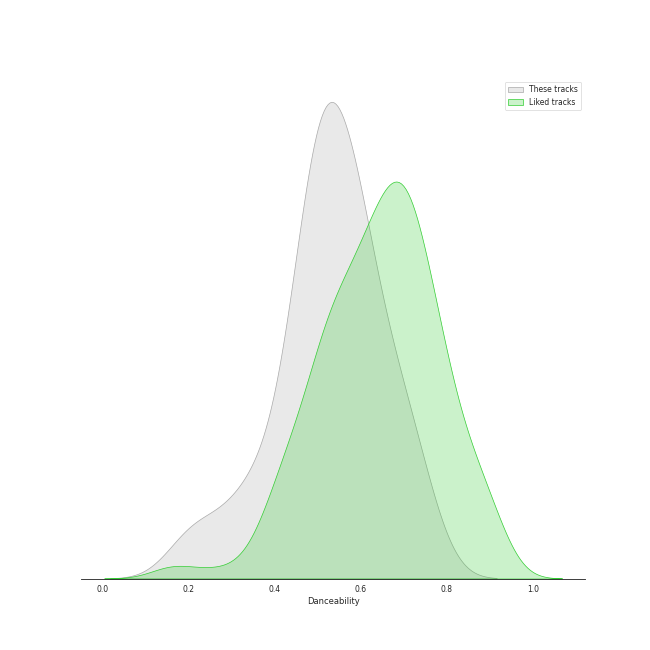
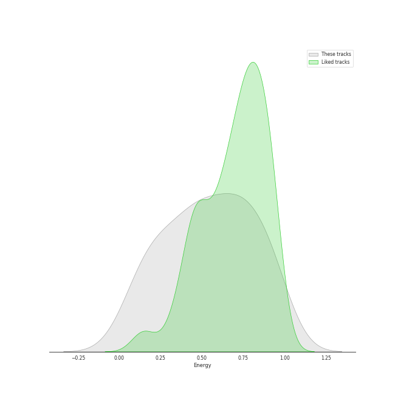
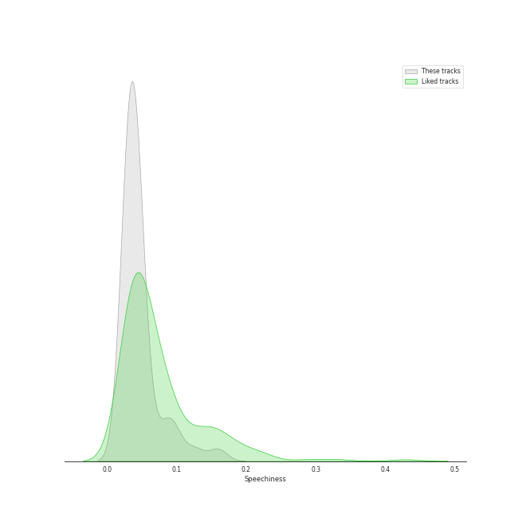
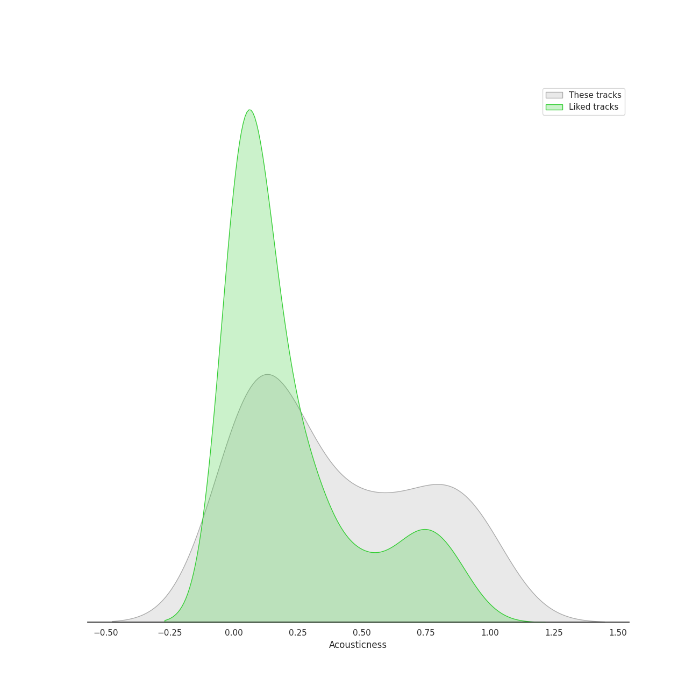
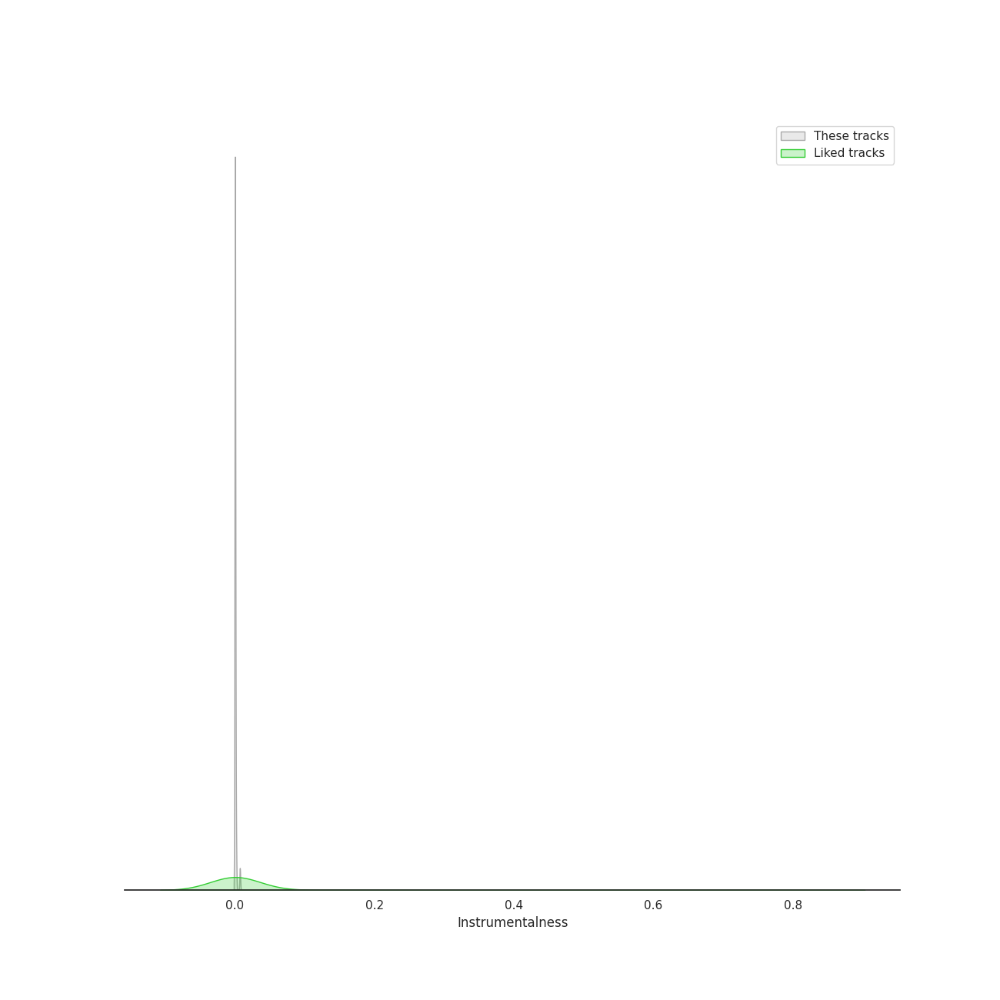
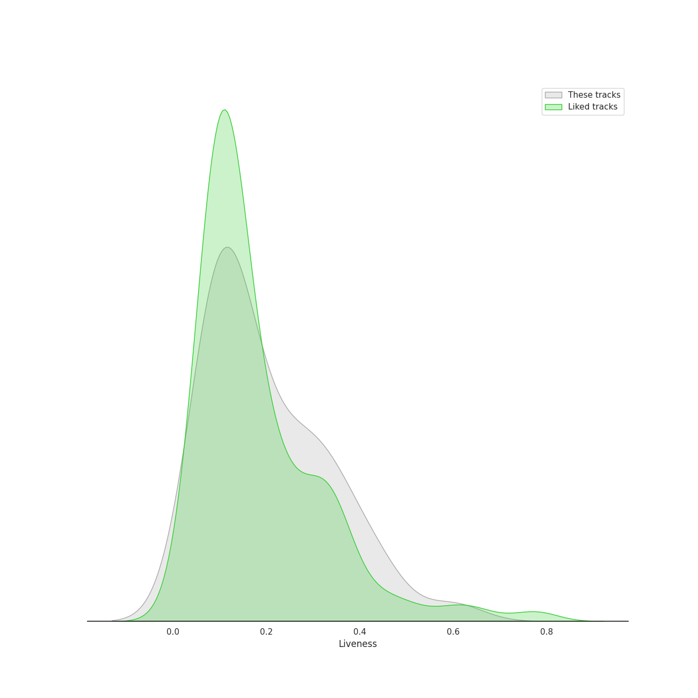
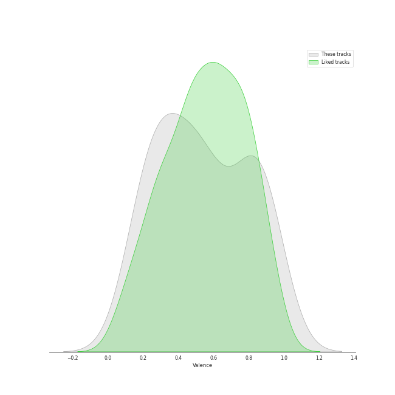
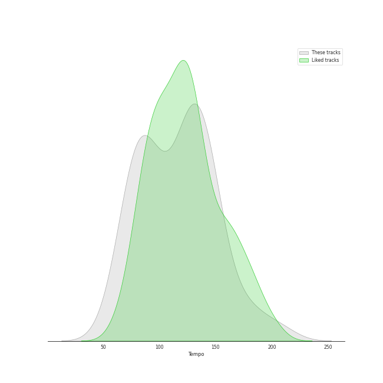

# Track Features for heartland rock

## Danceability

| ​ | 10 most Danceable tracks | ​​ | 10 least Danceable tracks |
|:---|:---|:---|:---|
|  | My Life (0.741) |  | Lights (0.193) |
|  | A Matter of Trust (0.738) |  | Desperado - 2013 Remaster (0.228) |
|  | We Didn't Start the Fire (0.712) |  | She's Always a Woman (0.292) |
|  | Uptown Girl (0.701) |  | Piano Man (0.334) |
|  | Don't Ask Me Why (0.691) |  | And So It Goes (0.351) |
|  | The Stranger (0.664) |  | Captain Jack (0.392) |
|  | Movin' Out (Anthony's Song) (0.664) |  | Scenes from an Italian Restaurant (0.415) |
|  | The Longest Time (0.637) |  | And So It Goes (0.433) |
|  | The River of Dreams (0.631) |  | Lullabye (Goodnight, My Angel) (0.442) |
|  | Moondance - 2013 Remaster (0.606) |  | Dust in the Wind (0.475) |

## Energy

| ​ | 10 most Energetic tracks | ​​ | 10 least Energetic tracks |
|:---|:---|:---|:---|
|  | We Didn't Start the Fire (0.967) |  | And So It Goes (0.0387) |
|  | Uptown Girl (0.944) |  | And So It Goes (0.0871) |
|  | Any Way You Want It (0.932) |  | She's Got a Way (0.142) |
|  | Scenes from an Italian Restaurant (0.931) |  | I Can't Make You Love Me (0.149) |
|  | Movin' Out (Anthony's Song) (0.88) |  | Lullabye (Goodnight, My Angel) (0.157) |
|  | The Stranger (0.878) |  | Crazy Love - 2013 Remaster (0.188) |
|  | Only the Good Die Young (0.872) |  | Desperado - 2013 Remaster (0.224) |
|  | Hard To Handle (0.79) |  | Crazy Love (0.236) |
|  | Carry on Wayward Son (0.786) |  | Moondance - 2013 Remaster (0.282) |
|  | I'm a Believer - 2006 Remaster (0.775) |  | Dust in the Wind (0.322) |

## Speechiness

| ​ | 10 most Speechy tracks | ​​ | 10 least Speechy tracks |
|:---|:---|:---|:---|
|  | Only the Good Die Young (0.159) |  | The Longest Time (0.0262) |
|  | Scenes from an Italian Restaurant (0.126) |  | A Matter of Trust (0.0268) |
|  | Big Shot (0.0972) |  | Hotel California - 2013 Remaster (0.027) |
|  | Crazy Love - 2013 Remaster (0.0959) |  | Cold as Ice (0.0271) |
|  | The Stranger (0.0837) |  | Piano Man (0.0276) |
|  | Crazy Love (0.0819) |  | Dust in the Wind (0.0283) |
|  | The River of Dreams (0.0576) |  | Daydream Believer (0.0304) |
|  | Don't Ask Me Why (0.0543) |  | Desperado - 2013 Remaster (0.0311) |
|  | Any Way You Want It (0.0488) |  | I Can't Make You Love Me (0.0319) |
|  | Pressure (0.0474) |  | Carry on Wayward Son (0.032) |

## Acousticness

| ​ | 10 most Acoustic tracks | ​​ | 10 least Acoustic tracks |
|:---|:---|:---|:---|
|  | She's Got a Way (0.97) |  | Any Way You Want It (0.00251) |
|  | Lullabye (Goodnight, My Angel) (0.948) |  | Hard To Handle (0.00257) |
|  | Desperado - 2013 Remaster (0.946) |  | Carry on Wayward Son (0.00321) |
|  | And So It Goes (0.941) |  | Hotel California - 2013 Remaster (0.00574) |
|  | And So It Goes (0.91) |  | Pressure (0.0148) |
|  | Crazy Love (0.85) |  | Cold as Ice (0.0264) |
|  | I Can't Make You Love Me (0.846) |  | A Matter of Trust (0.0589) |
|  | Crazy Love - 2013 Remaster (0.841) |  | Uptown Girl (0.0755) |
|  | She's Always a Woman (0.797) |  | We Didn't Start the Fire (0.0771) |
|  | I'm a Believer - 2006 Remaster (0.707) |  | Lights (0.107) |

## Instrumentalness

| ​ | 10 most Instrumental tracks | ​​ | 10 least Instrumental tracks |
|:---|:---|:---|:---|
|  | Lights (0.00711) |  | And So It Goes (0.0) |
|  | Hard To Handle (0.00181) |  | Cat's in the Cradle (0.0) |
|  | My Life (0.00139) |  | Only the Good Die Young (0.0) |
|  | Any Way You Want It (0.00109) |  | We Didn't Start the Fire (0.0) |
|  | Pressure (0.000949) |  | Brown Eyed Girl (0.0) |
|  | Dust in the Wind (0.00056) |  | Don't Stop Believin' (0.0) |
|  | Scenes from an Italian Restaurant (0.000501) |  | Lullabye (Goodnight, My Angel) (0.0) |
|  | Hotel California - 2013 Remaster (0.000494) |  | The Longest Time (0.0) |
|  | She's Always a Woman (0.000473) |  | Uptown Girl (0.0) |
|  | Desperado - 2013 Remaster (0.000222) |  | Don't Ask Me Why (0.0) |

## Liveness

| ​ | 10 most Live tracks | ​​ | 10 least Live tracks |
|:---|:---|:---|:---|
|  | Uptown Girl (0.601) |  | My Life (0.0555) |
|  | Don't Stop Believin' (0.447) |  | Hotel California - 2013 Remaster (0.0575) |
|  | Carry on Wayward Son (0.446) |  | Movin' Out (Anthony's Song) (0.0591) |
|  | Brown Eyed Girl (0.406) |  | The River of Dreams (0.0667) |
|  | Captain Jack (0.374) |  | Vienna (0.0754) |
|  | We Didn't Start the Fire (0.356) |  | The Stranger (0.0812) |
|  | Lights (0.332) |  | Big Shot (0.0866) |
|  | New York State of Mind (0.323) |  | Pressure (0.0877) |
|  | Piano Man (0.312) |  | Only the Good Die Young (0.0935) |
|  | Hard To Handle (0.312) |  | Don't Ask Me Why (0.11) |

## Valence

| ​ | 10 most Happy tracks | ​​ | 10 least Happy tracks |
|:---|:---|:---|:---|
|  | I'm a Believer - 2006 Remaster (0.962) |  | I Can't Make You Love Me (0.113) |
|  | Hard To Handle (0.961) |  | Desperado - 2013 Remaster (0.18) |
|  | Brown Eyed Girl (0.908) |  | New York State of Mind (0.194) |
|  | Movin' Out (Anthony's Song) (0.895) |  | She's Got a Way (0.196) |
|  | We Didn't Start the Fire (0.895) |  | Lullabye (Goodnight, My Angel) (0.22) |
|  | A Matter of Trust (0.88) |  | The Stranger (0.222) |
|  | Don't Ask Me Why (0.868) |  | And So It Goes (0.24) |
|  | Pressure (0.851) |  | Vienna (0.308) |
|  | My Life (0.804) |  | Crazy Love (0.325) |
|  | The Joker (0.796) |  | Crazy Love - 2013 Remaster (0.334) |

## Tempo

| ​ | 10 most Fast tracks | ​​ | 10 least Fast tracks |
|:---|:---|:---|:---|
|  | Lights (205.422) |  | Desperado - 2013 Remaster (60.3) |
|  | Piano Man (179.239) |  | Moondance - 2013 Remaster (67.409) |
|  | She's Always a Woman (176.631) |  | She's Got a Way (75.859) |
|  | Brown Eyed Girl (150.566) |  | Only the Good Die Young (76.214) |
|  | Big Shot (149.861) |  | Lullabye (Goodnight, My Angel) (76.48) |
|  | Pressure (148.494) |  | Crazy Love - 2013 Remaster (77.464) |
|  | Hotel California - 2013 Remaster (147.125) |  | Crazy Love (77.539) |
|  | Captain Jack (146.657) |  | Cat's in the Cradle (78.111) |
|  | We Didn't Start the Fire (145.024) |  | I'm a Believer - 2006 Remaster (80.106) |
|  | Just the Way You Are (139.148) |  | The Joker (83.293) |
