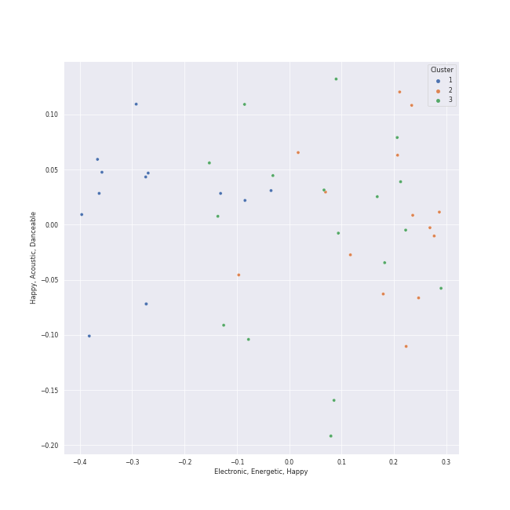

# Clusters in heartland rock

## Cluster #1

20 tracks

| Art | Track | Album | Artists | Label | Score | 💚 | 🔗 |
|:---|:---|:---|:---|:---|---:|:---|:---|
|  | Crazy Love | The Essential Van Morrison | Van Morrison | Legacy Recordings | 0 | | [🔗](https://open.spotify.com/track/04glHdRn4SgTADxKoKzOoO) |
|  | Crazy Love - 2013 Remaster | Moondance (Expanded Edition) | Van Morrison | [Warner Records](../../../../labels/warner_records) | 0 | | [🔗](https://open.spotify.com/track/2hjAc6x8EoSLhGxRNg8KEw) |
|  | Vienna | The Stranger | [Billy Joel](../../../../artists/billy_joel/overview.md) | [Columbia](../../../../labels/columbia) | 0 | 💚 | [🔗](https://open.spotify.com/track/7gREIuHognJFspylIDJ94p) |
|  | Turn the Lights Back On | Turn the Lights Back On | [Billy Joel](../../../../artists/billy_joel/overview.md) | [Columbia](../../../../labels/columbia) | 0 | 💚 | [🔗](https://open.spotify.com/track/1KTemUlHzS0SvVtTjY1NTw) |
|  | Light As the Breeze | Greatest Hits Vol. III | [Billy Joel](../../../../artists/billy_joel/overview.md) | [Columbia](../../../../labels/columbia) | 0 | 💚 | [🔗](https://open.spotify.com/track/1irDnW4t5Ph52hR2xuNtmF) |
|  | And So It Goes | Storm Front | [Billy Joel](../../../../artists/billy_joel/overview.md) | [Columbia](../../../../labels/columbia) | 0 | 💚 | [🔗](https://open.spotify.com/track/1u7kQUb3lQcpHaYRfia13A) |
|  | Lullabye (Goodnight, My Angel) | River Of Dreams | [Billy Joel](../../../../artists/billy_joel/overview.md) | [Columbia](../../../../labels/columbia) | 0 | 💚 | [🔗](https://open.spotify.com/track/4cURHmiuYii52BVbhrGbv0) |
|  | She's Got a Way | Cold Spring Harbor | [Billy Joel](../../../../artists/billy_joel/overview.md) | [Columbia](../../../../labels/columbia) | 0 | | [🔗](https://open.spotify.com/track/3Ie2eLOIj2IhKnzPwXrLbJ) |
|  | Piano Man | Piano Man | [Billy Joel](../../../../artists/billy_joel/overview.md) | [Columbia](../../../../labels/columbia) | 0 | 💚 | [🔗](https://open.spotify.com/track/78WVLOP9pN0G3gRLFy1rAa) |
|  | I Can't Make You Love Me | Luck Of The Draw | Bonnie Raitt | [Capitol Records](../../../../labels/capitol_records) | 0 | | [🔗](https://open.spotify.com/track/69uJi5QsBtqlYkGURTBli8) |
## Cluster #2

16 tracks

| Art | Track | Album | Artists | Label | Score | 💚 | 🔗 |
|:---|:---|:---|:---|:---|---:|:---|:---|
|  | Moondance - 2013 Remaster | Moondance (Deluxe Edition) | Van Morrison | [Warner Records](../../../../labels/warner_records) | 0 | 💚 | [🔗](https://open.spotify.com/track/683b4ikwa62JevCjwrmfg6) |
|  | Only the Good Die Young | The Stranger | [Billy Joel](../../../../artists/billy_joel/overview.md) | [Columbia](../../../../labels/columbia) | 0 | 💚 | [🔗](https://open.spotify.com/track/2xabqm0YNQCTcPteQjJ22K) |
|  | Big Shot | 52nd Street | [Billy Joel](../../../../artists/billy_joel/overview.md) | [Columbia](../../../../labels/columbia) | 0 | | [🔗](https://open.spotify.com/track/22wxe2Yc9JzihICXYLGAQ7) |
|  | My Life | 52nd Street | [Billy Joel](../../../../artists/billy_joel/overview.md) | [Columbia](../../../../labels/columbia) | 0 | 💚 | [🔗](https://open.spotify.com/track/4ZoBC5MhSEzuknIgAkBaoT) |
|  | Pressure | The Nylon Curtain | [Billy Joel](../../../../artists/billy_joel/overview.md) | [Columbia](../../../../labels/columbia) | 0 | | [🔗](https://open.spotify.com/track/3LqvmDtXWXjF7fg8mh8iZh) |
|  | The Longest Time | An Innocent Man | [Billy Joel](../../../../artists/billy_joel/overview.md) | [Columbia](../../../../labels/columbia) | 0 | 💚 | [🔗](https://open.spotify.com/track/5DH7nDryMhpixm4G4B7RP9) |
|  | The Joker | The Joker | Steve Miller Band | CAPITOL CATALOG MKT (C92) | 0 | 💚 | [🔗](https://open.spotify.com/track/1bp2IO61zbQrbWNmKKxg3f) |
|  | Hotel California - 2013 Remaster | Hotel California (2013 Remaster) | Eagles | [Rhino/Elektra](../../../../labels/rhino) | 0 | | [🔗](https://open.spotify.com/track/40riOy7x9W7GXjyGp4pjAv) |
|  | Daydream Believer | The Birds, The Bees, & The Monkees | The Monkees | [Rhino](../../../../labels/rhino) | 0 | | [🔗](https://open.spotify.com/track/7uEcCGtM1FBBGIhPozhJjv) |
|  | Any Way You Want It | Departure | Journey | [Columbia](../../../../labels/columbia), [Legacy](../../../../labels/legacy) | 0 | | [🔗](https://open.spotify.com/track/71SvEDmsOwIWw1IozsZoMA) |
## Cluster #3

7 tracks

| Art | Track | Album | Artists | Label | Score | 💚 | 🔗 |
|:---|:---|:---|:---|:---|---:|:---|:---|
|  | Brown Eyed Girl | Blowin' Your Mind! | Van Morrison | [Columbia](../../../../labels/columbia), [Legacy](../../../../labels/legacy) | 0 | 💚 | [🔗](https://open.spotify.com/track/3yrSvpt2l1xhsV9Em88Pul) |
|  | Hard To Handle | Shake Your Money Maker | The Black Crowes | American Recordings Catalog P&D | 0 | 💚 | [🔗](https://open.spotify.com/track/05NYcsjJwOYq4jIiKPVj9p) |
|  | We Didn't Start the Fire | Storm Front | [Billy Joel](../../../../artists/billy_joel/overview.md) | [Columbia](../../../../labels/columbia) | 0 | | [🔗](https://open.spotify.com/track/3Cx4yrFaX8CeHwBMReOWXI) |
|  | Uptown Girl | An Innocent Man | [Billy Joel](../../../../artists/billy_joel/overview.md) | [Columbia](../../../../labels/columbia) | 0 | 💚 | [🔗](https://open.spotify.com/track/5zA8vzDGqPl2AzZkEYQGKh) |
|  | A Matter of Trust | The Bridge | [Billy Joel](../../../../artists/billy_joel/overview.md) | [Columbia](../../../../labels/columbia) | 0 | 💚 | [🔗](https://open.spotify.com/track/6J212smZzpeOCYQ9DITMSC) |
|  | Carry on Wayward Son | Leftoverture (Expanded Edition) | Kansas | [Epic](../../../../labels/epic), [Legacy](../../../../labels/legacy) | 0 | | [🔗](https://open.spotify.com/track/4DMKwE2E2iYDKY01C335Uw) |
|  | Don't Stop Believin' | Escape (Bonus Track Version) | Journey | [Columbia](../../../../labels/columbia) | 0 | | [🔗](https://open.spotify.com/track/4bHsxqR3GMrXTxEPLuK5ue) |