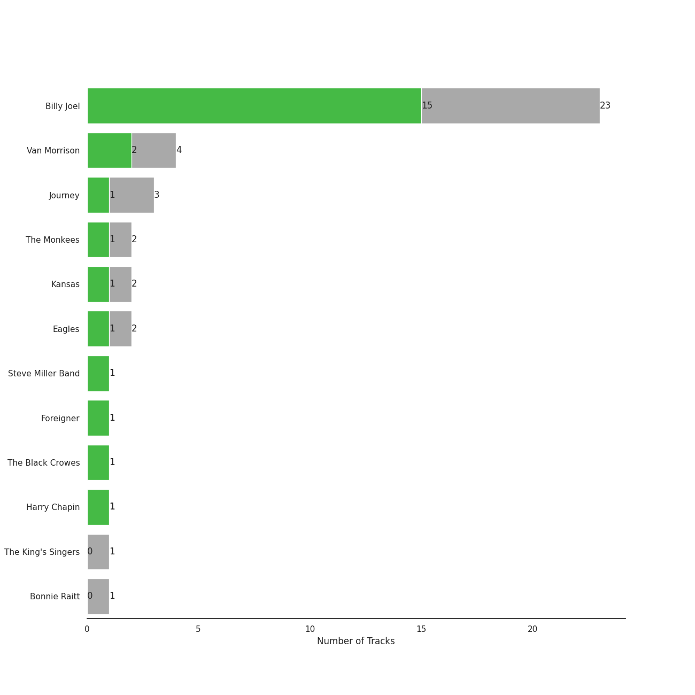
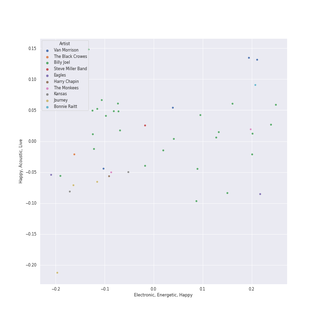
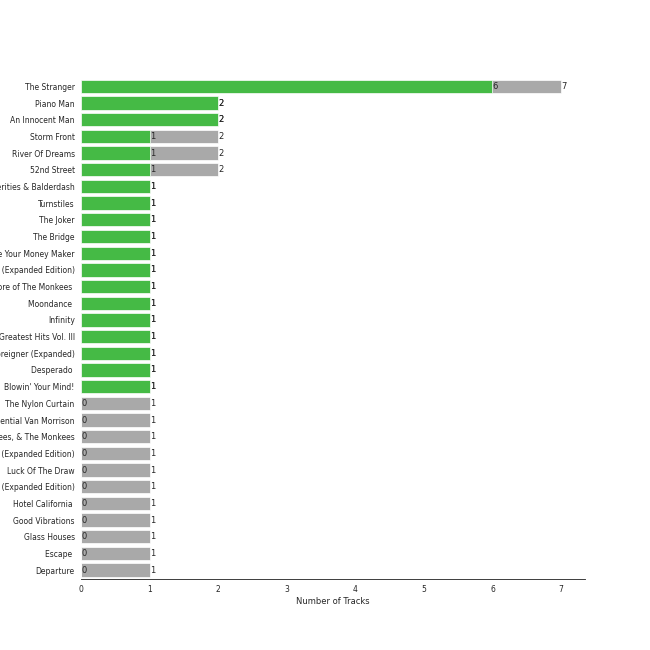
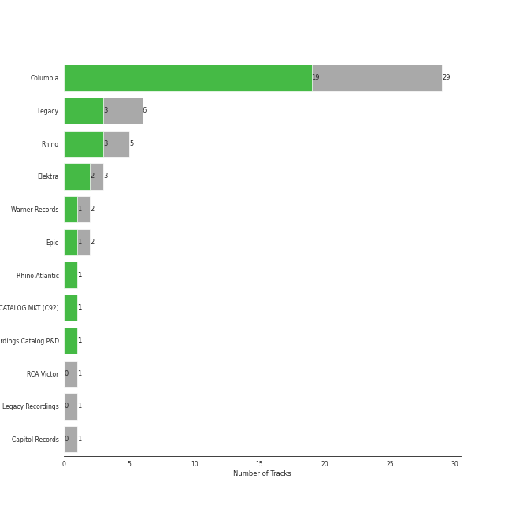
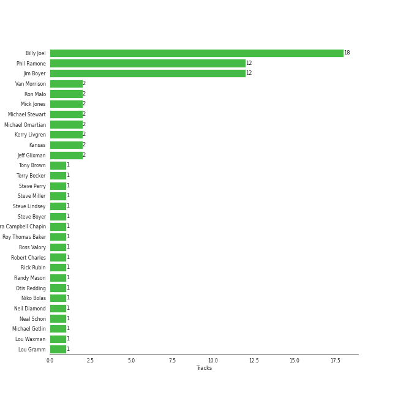
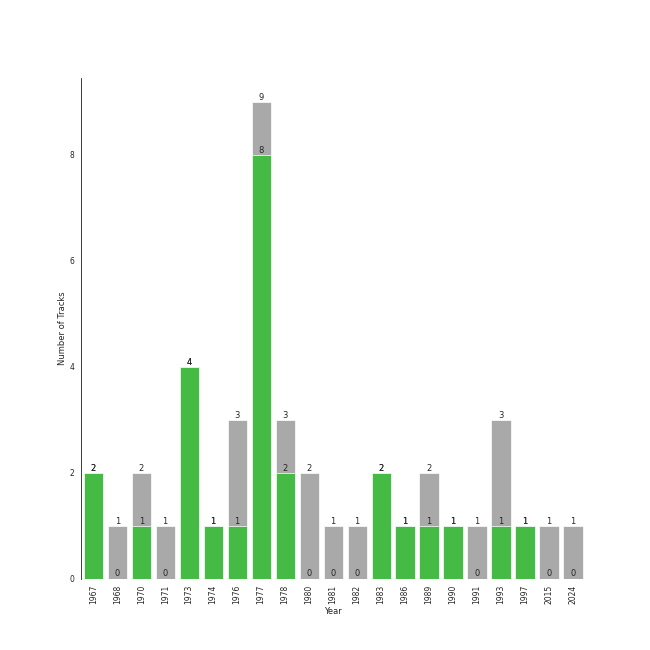

# heartland rock

44 songs

[See Track Features](audio_features.md)

[See Clusters](clusters/overview.md)

## Top Artists

| Art | Tracks | 💚 | Artist | 🔗 |
|:---|---:|---:|:---|:---|
|  | 26 | 21 | [Billy Joel](../../artists/billy_joel/overview.md) | [🔗](https://open.spotify.com/artist/6zFYqv1mOsgBRQbae3JJ9e) |
|  | 4 | 2 | Van Morrison | [🔗](https://open.spotify.com/artist/44NX2ffIYHr6D4n7RaZF7A) |
|  | 2 | 2 | Kansas | [🔗](https://open.spotify.com/artist/2hl0xAkS2AIRAu23TVMBG1) |
|  | 3 | 1 | Journey | [🔗](https://open.spotify.com/artist/0rvjqX7ttXeg3mTy8Xscbt) |
|  | 2 | 1 | The Monkees | [🔗](https://open.spotify.com/artist/320EPCSEezHt1rtbfwH6Ck) |
|  | 2 | 1 | Eagles | [🔗](https://open.spotify.com/artist/0ECwFtbIWEVNwjlrfc6xoL) |
|  | 1 | 1 | Steve Miller Band | [🔗](https://open.spotify.com/artist/6QtGlUje9TIkLrgPZrESuk) |
|  | 1 | 1 | Foreigner | [🔗](https://open.spotify.com/artist/6IRouO5mvvfcyxtPDKMYFN) |
|  | 1 | 1 | The Black Crowes | [🔗](https://open.spotify.com/artist/5krkohEVJYw0qoB5VWwxaC) |
|  | 1 | 1 | Harry Chapin | [🔗](https://open.spotify.com/artist/42q4Ivs7tAiCZ5C7eG5q4c) |

See all 12 artists

| Art | Tracks | 💚 | Artist | 🔗 |
|:---|---:|---:|:---|:---|
|  | 1 | 0 | The King's Singers | [🔗](https://open.spotify.com/artist/5lR7yDVN4z9kahOiUSlMhe) |
|  | 1 | 0 | Bonnie Raitt | [🔗](https://open.spotify.com/artist/4KDyYWR7IpxZ7xrdYbKrqY) |

## Most and least listened tracks
| ​ | Most listened tracks | Rank | ​​ | Least listened tracks | Rank |
|:---|:---|---:|:---|:---|---:|
|  | [Movin' Out (Anthony's Song)](../../artists/billy_joel/overview.md) | 434 |  | Crazy Love | nan |
|  | [Vienna](../../artists/billy_joel/overview.md) | 441 |  | Hard To Handle | nan |
|  | [Only the Good Die Young](../../artists/billy_joel/overview.md) | 538 |  | [Turn the Lights Back On](../../artists/billy_joel/overview.md) | nan |
|  | [A Matter of Trust](../../artists/billy_joel/overview.md) | 556 |  | The Joker | nan |
|  | Desperado - 2013 Remaster | 709 |  | [Light As the Breeze](../../artists/billy_joel/overview.md) | nan |
|  | Cold as Ice | nan |  | [And So It Goes](../../artists/billy_joel/overview.md) | nan |
|  | Daydream Believer | nan |  | [And So It Goes](../../artists/billy_joel/overview.md) | nan |
|  | Lights | nan |  | [Big Shot](../../artists/billy_joel/overview.md) | nan |
|  | Any Way You Want It | nan |  | Crazy Love - 2013 Remaster | nan |
|  | [Piano Man](../../artists/billy_joel/overview.md) | nan |  | Cat's in the Cradle | nan |

## Top Albums

| Art | Tracks | 💚 | Album | Release Date | 🔗 |
|:---|---:|---:|:---|:---|:---|
|  | 7 | 7 | The Stranger (Legacy Edition) | 1977 | [🔗](https://open.spotify.com/album/1Mhn9VosyjtWn4dMPFlna6) |
|  | 2 | 2 | Glass Houses | 1980-03-12 | [🔗](https://open.spotify.com/album/5sztejERqpktXEdemlUvU5) |
|  | 2 | 2 | An Innocent Man | 1983-08-08 | [🔗](https://open.spotify.com/album/3R3x4zIabsvpD3yxqLaUpc) |
|  | 2 | 2 | 52nd Street | 1978-10-13 | [🔗](https://open.spotify.com/album/1HmCO8VK98AU6EXPOjGYyI) |
|  | 2 | 1 | Storm Front | 1989-10-17 | [🔗](https://open.spotify.com/album/1Vw2uoVkLAJFVViJ1QyK1D) |
|  | 2 | 1 | River Of Dreams | 1993-08-10 | [🔗](https://open.spotify.com/album/4HPnwQJAEvTY910q4RNeOu) |
|  | 1 | 1 | Verities & Balderdash | 1974 | [🔗](https://open.spotify.com/album/3nta4nhqWoWjc6LmHIB0kT) |
|  | 1 | 1 | Turnstiles | 1976-05-19 | [🔗](https://open.spotify.com/album/7GiLfxL1su3MSqz7pmKMZi) |
|  | 1 | 1 | Turn the Lights Back On | 2024-02-01 | [🔗](https://open.spotify.com/album/4csPGLYTb7kt85U377UCuC) |
|  | 1 | 1 | The Joker | 1973-01-01 | [🔗](https://open.spotify.com/album/5uYNj1HkZrWKAkhEYcGmJr) |

See all 33 albums

| Art | Tracks | 💚 | Album | Release Date | 🔗 |
|:---|---:|---:|:---|:---|:---|
|  | 1 | 1 | The Bridge | 1986-07-28 | [🔗](https://open.spotify.com/album/2fRxSC6FtiAkhEDVZr2seH) |
|  | 1 | 1 | Shake Your Money Maker | 1990-02-13 | [🔗](https://open.spotify.com/album/2NRRQLuW6j3EsoWpIl2MR3) |
|  | 1 | 1 | Point Of Know Return (Expanded Edition) | 1977 | [🔗](https://open.spotify.com/album/6oU298pdPTCQnMx1PYwyUA) |
|  | 1 | 1 | Piano Man (Legacy Edition) | 1973-11-07 | [🔗](https://open.spotify.com/album/69wjSAZXZiD2EBia3b3gxL) |
|  | 1 | 1 | Piano Man | 1973-11-09 | [🔗](https://open.spotify.com/album/77ErLrVvYETIlQJHAwhfIH) |
|  | 1 | 1 | More of The Monkees (Deluxe Edition) | 1967-01-09 | [🔗](https://open.spotify.com/album/50zHjIiTOZM232gnWvOydX) |
|  | 1 | 1 | Moondance (Deluxe Edition) | 1970-02 | [🔗](https://open.spotify.com/album/7diHYi0CglGJekoM3KaWBK) |
|  | 1 | 1 | Leftoverture (Expanded Edition) | 1976 | [🔗](https://open.spotify.com/album/7MejfRSNnrpcLZIxkeZDqR) |
|  | 1 | 1 | Infinity | 1978 | [🔗](https://open.spotify.com/album/7K4Nk5fHkCuzNm5A6mdo2U) |
|  | 1 | 1 | Greatest Hits Vol. III | 1997-06-13 | [🔗](https://open.spotify.com/album/3cJ6ZymbUcNGe1T8YZtGyE) |
|  | 1 | 1 | Foreigner (Expanded) | 1977-03-08 | [🔗](https://open.spotify.com/album/1OU7zJvUfgxxPHgkTClt1M) |
|  | 1 | 1 | Desperado (2013 Remaster) | 1973-04-17 | [🔗](https://open.spotify.com/album/09WBxbis5Sixt01FVMs8UM) |
|  | 1 | 1 | Blowin' Your Mind! | 1967-09 | [🔗](https://open.spotify.com/album/7dsWupQRlFuhG8FGiQAUjC) |
|  | 1 | 0 | The Nylon Curtain | 1982-06-23 | [🔗](https://open.spotify.com/album/50bajZpetfL5T0iRCOR74J) |
|  | 1 | 0 | The Essential Van Morrison | 2015-12-04 | [🔗](https://open.spotify.com/album/0RXzDyBEGd2EGQTmv8cxQa) |
|  | 1 | 0 | The Birds, The Bees, & The Monkees | 1968-04-22 | [🔗](https://open.spotify.com/album/2Ov6zb7NfgDh3EXSIIWrb2) |
|  | 1 | 0 | Moondance (Expanded Edition) | 1970-02 | [🔗](https://open.spotify.com/album/6yNYC35npMBHbxG0Vle83O) |
|  | 1 | 0 | Luck Of The Draw | 1991-01-01 | [🔗](https://open.spotify.com/album/6blrkOZ0VmkhYPjfoD7eqf) |
|  | 1 | 0 | Hotel California (2013 Remaster) | 1976-12-08 | [🔗](https://open.spotify.com/album/2widuo17g5CEC66IbzveRu) |
|  | 1 | 0 | Good Vibrations | 1993 | [🔗](https://open.spotify.com/album/10IUKCLZPs9onPwXfQVxfv) |
|  | 1 | 0 | Escape (2022 Remaster) | 1981-07-17 | [🔗](https://open.spotify.com/album/4guAwaniEAEQSW0NCpo4gm) |
|  | 1 | 0 | Departure | 1980 | [🔗](https://open.spotify.com/album/2OyVtIEp7O7a6o82DF4Ba5) |
|  | 1 | 0 | Cold Spring Harbor | 1971-11-01 | [🔗](https://open.spotify.com/album/274rMlKrr22086ohmwAJZA) |

## Top Record Labels

| Tracks | 💚 | Label |
|---:|---:|:---|
| 29 | 23 | [Columbia](../../labels/columbia/overview.md) |
| 14 | 12 | [Legacy](../../labels/legacy/overview.md) |
| 5 | 3 | [Rhino](../../labels/rhino/overview.md) |
| 3 | 2 | Elektra |
| 2 | 2 | [Epic](../../labels/epic/overview.md) |
| 2 | 1 | [Warner Records](../../labels/warner_records/overview.md) |
| 1 | 1 | Rhino Atlantic |
| 1 | 1 | CAPITOL CATALOG MKT (C92) |
| 1 | 1 | American Recordings Catalog P&D |
| 1 | 0 | RCA Victor |

See all 12 labels

| Tracks | 💚 | Label |
|---:|---:|:---|
| 1 | 0 | Legacy Recordings |
| 1 | 0 | [Capitol Records](../../labels/capitol_records/overview.md) |

## Top Producers

| Art | Producer | Tracks | Credit Types |
|:---|:---|---:|:---|
|  | [Billy Joel](../../artists/billy_joel/overview.md) | 18 | Lyricist, Producer, Songwriter, Arranger |
| | [Jim Boyer](../../producers/jim_boyer/overview.md) | 12 | Producer |
| | [Phil Ramone](../../producers/phil_ramone/overview.md) | 12 | Producer |
|  | Kansas | 2 | Arranger |
| | Mick Jones | 2 | Producer, Songwriter |
| | Michael Omartian | 2 | Arranger |
|  | Van Morrison | 2 | Lyricist, Producer, Songwriter |
| | Ron Malo | 2 | Producer |
| | Jeff Glixman | 2 | Producer |
| | Kerry Livgren | 2 | Lyricist, Songwriter |

View all

| Art | Producer | Tracks | Credit Types |
|:---|:---|---:|:---|
| | Michael Stewart | 2 | Producer |
| | Steve Boyer | 1 | Producer |
| | Jimmy Douglass | 1 | Producer |
| | Ian McDonald | 1 | Producer |
| | Jim Ed Norman | 1 | Arranger |
| | Liberty DeVitto | 1 | Arranger |
| | John Sinclair | 1 | Producer |
| | Eddie Curtis | 1 | Songwriter |
| | Glyn Johns | 1 | Producer |
| | George Drakoulias | 1 | Producer |
| | Ross Valory | 1 | Producer |
| | Neil Diamond | 1 | Lyricist, Songwriter |
| | Steve Miller | 1 | Producer, Songwriter |
| | Justin Niebank | 1 | Producer |
| | Fred Tenny | 1 | Producer |
| | Glenn Frey | 1 | Songwriter |
|  | Harry Chapin | 1 | Songwriter |
| | Steve Perry | 1 | Songwriter |
| | Ira Newborn | 1 | Arranger |
| | Don Henley | 1 | Songwriter |
| | Steve Lindsey | 1 | Arranger, Producer |
| | John Hendrickson | 1 | Producer |
| | Doug Stegmeyer | 1 | Arranger |
| | Leanne Ungar | 1 | Producer |
| | Alvertis Isbell | 1 | Songwriter |
| | Tony Brown | 1 | Producer |
| | Lewis Merenstein | 1 | Producer |
| | Ahmet Ertegun | 1 | Songwriter |
| | Bruce Botnick | 1 | Producer |
| | Terry Becker | 1 | Producer |
| | Aynsley Dunbar | 1 | Producer |
| | Kevin Herron | 1 | Producer |
| | Jim Horn | 1 | Arranger |
| | Lou Waxman | 1 | Producer |
| | Michael Getlin | 1 | Producer |
| | Don Puluse | 1 | Producer |
| | Robert Charles | 1 | Producer |
| | David Dickson | 1 | Producer |
| | Bert Russell Berns | 1 | Producer |
| | Brendan O'Brien | 1 | Producer |
| | John Bradley | 1 | Producer |
| | Bill Schnee | 1 | Producer |
| | Gregg Rolie | 1 | Producer |
| | Bradshaw Leigh | 1 | Producer |
| | Geoff Workman | 1 | Producer |
| | Jay Healy | 1 | Producer |
| | Jim DeMain | 1 | Producer |
| | Danny Kortchmar | 1 | Producer |
| | Niko Bolas | 1 | Producer |
| | Elliot Scheiner | 1 | Producer |
| | Roy Thomas Baker | 1 | Producer |
| | Neal Schon | 1 | Producer, Songwriter |
| | Sandra Campbell Chapin | 1 | Songwriter |
| | Allen Jones | 1 | Songwriter |
| | Bill "Bleu" Evans | 1 | Producer |
| | Brooks Arthur | 1 | Producer |
| | Ed Cherney | 1 | Producer |
| | Randy Mason | 1 | Producer |
| | Leonard Cohen | 1 | Lyricist, Songwriter |
| | Kenny Ascher | 1 | Arranger |
| | Lou Gramm | 1 | Songwriter |
| | Gary Lyons | 1 | Producer |
| | Otis Redding | 1 | Songwriter |
| | Rick Rubin | 1 | Producer |

## Years

| ​ | 10 newest albums | ​​ | 10 oldest albums |
|:---|:---|:---|:---|
|  | Turn the Lights Back On (2024-02-01) |  | More of The Monkees (Deluxe Edition) (1967-01-09) |
|  | The Essential Van Morrison (2015-12-04) |  | Blowin' Your Mind! (1967-09) |
|  | Greatest Hits Vol. III (1997-06-13) |  | The Birds, The Bees, & The Monkees (1968-04-22) |
|  | River Of Dreams (1993-08-10) |  | Moondance (Expanded Edition) (1970-02) |
|  | Good Vibrations (1993) |  | Moondance (Deluxe Edition) (1970-02) |
|  | Luck Of The Draw (1991-01-01) |  | Cold Spring Harbor (1971-11-01) |
|  | Shake Your Money Maker (1990-02-13) |  | The Joker (1973-01-01) |
|  | Storm Front (1989-10-17) |  | Desperado (2013 Remaster) (1973-04-17) |
|  | The Bridge (1986-07-28) |  | Piano Man (Legacy Edition) (1973-11-07) |
|  | An Innocent Man (1983-08-08) |  | Piano Man (1973-11-09) |

