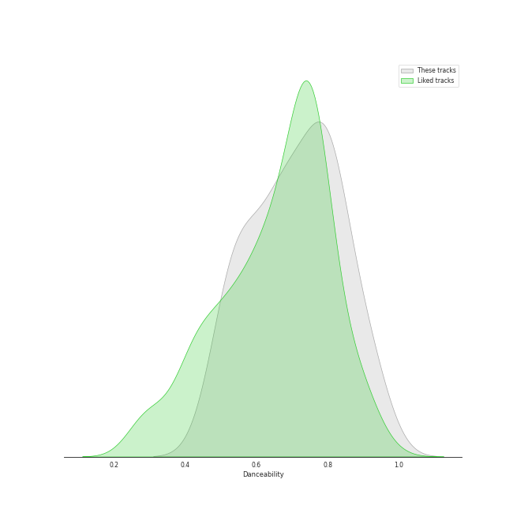
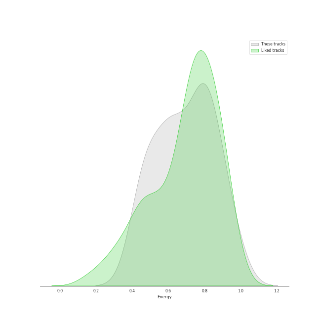
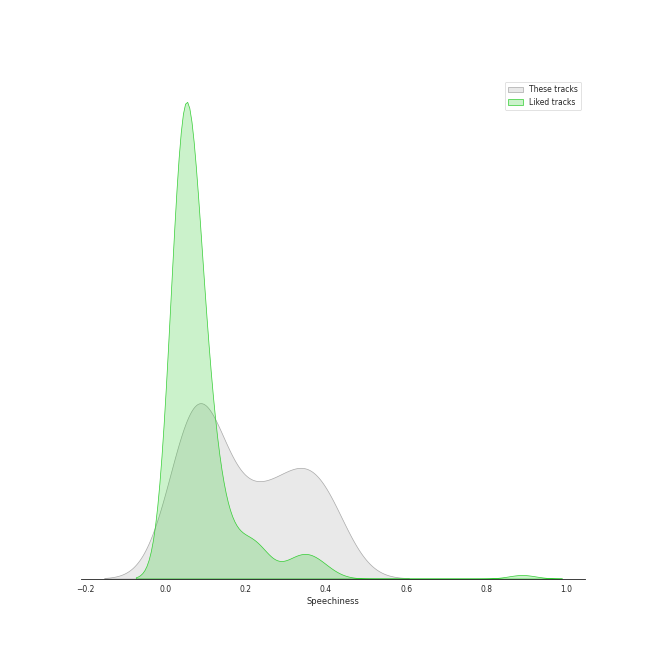
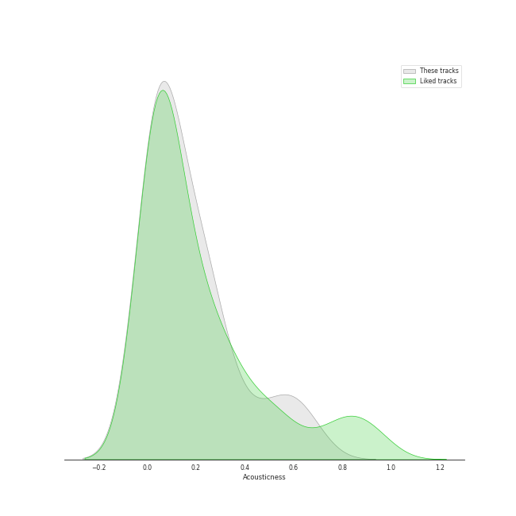
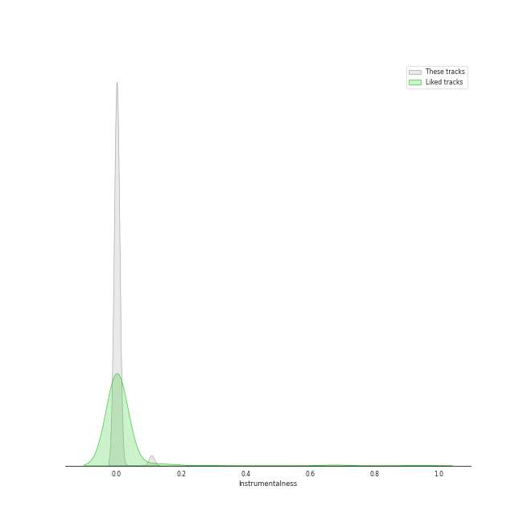
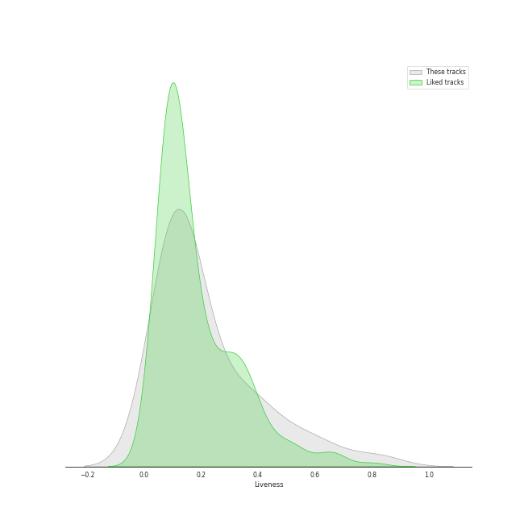
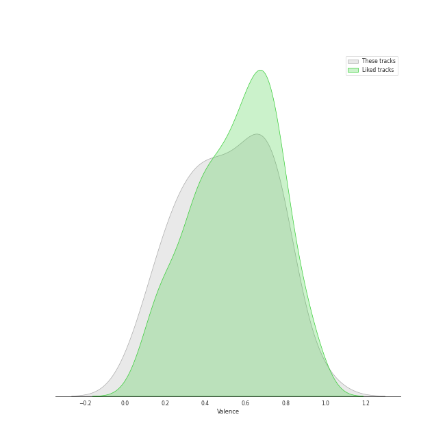
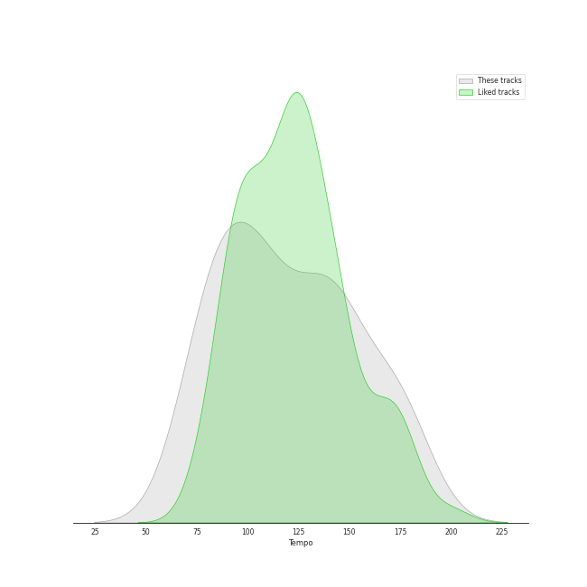

# Track Features for hip hop

## Danceability

| ​ | 10 most Danceable tracks | ​​ | 10 least Danceable tracks |
|:---|:---|:---|:---|
|  | We Made You (0.924) |  | Empire State Of Mind (0.491) |
|  | Clout (feat. Cardi B) (0.919) |  | Sucker for Pain (with Wiz Khalifa, Imagine Dragons, Logic & Ty Dolla $ign feat. X Ambassadors) (0.502) |
|  | HUMBLE. (0.908) |  | United In Grief (0.529) |
|  | Work Out (0.831) |  | All Of The Lights (0.531) |
|  | Break Ya Neck (0.82) |  | Silicon Valley (0.545) |
|  | It's A Vibe (0.82) |  | On To The Next One (0.546) |
|  | LOVE. FEAT. ZACARI. (0.8) |  | Can't Tell Me Nothing (0.587) |
|  | Freaky Deaky (0.799) |  | 1-800-273-8255 (0.62) |
|  | Momma I Hit A Lick (feat. Kendrick Lamar) (0.796) |  | Gold Digger (0.629) |
|  | Alright (0.796) |  | Jesus Walks (0.637) |

## Energy

| ​ | 10 most Energetic tracks | ​​ | 10 least Energetic tracks |
|:---|:---|:---|:---|
|  | Hey Ya! (0.974) |  | Work Out (0.427) |
|  | Empire State Of Mind (0.956) |  | Count Me Out (0.431) |
|  | Love The Way You Lie (0.925) |  | Silicon Valley (0.451) |
|  | On To The Next One (0.908) |  | Momma I Hit A Lick (feat. Kendrick Lamar) (0.467) |
|  | Ni**as In Paris (0.858) |  | See You Again (feat. Charlie Puth) (0.481) |
|  | We Made You (0.853) |  | It's A Vibe (0.502) |
|  | The Monster (0.853) |  | DNA. (0.523) |
|  | United In Grief (0.845) |  | Money Trees (0.531) |
|  | Jesus Walks (0.834) |  | 1-800-273-8255 (0.574) |
|  | Break Ya Neck (0.809) |  | LOVE. FEAT. ZACARI. (0.585) |

## Speechiness

| ​ | 10 most Speechy tracks | ​​ | 10 least Speechy tracks |
|:---|:---|:---|:---|
|  | On To The Next One (0.417) |  | Freaky Deaky (0.037) |
|  | United In Grief (0.404) |  | Everyday (0.0378) |
|  | Homicide (feat. Eminem) (0.398) |  | Can't Tell Me Nothing (0.042) |
|  | Empire State Of Mind (0.392) |  | 1-800-273-8255 (0.0479) |
|  | DNA. (0.357) |  | All The Stars (with SZA) (0.0599) |
|  | Gold Digger (0.348) |  | Hey Ya! (0.0664) |
|  | Momma I Hit A Lick (feat. Kendrick Lamar) (0.34) |  | The Monster (0.0714) |
|  | Jesus Walks (0.323) |  | All Of The Lights (0.0717) |
|  | Sucker for Pain (with Wiz Khalifa, Imagine Dragons, Logic & Ty Dolla $ign feat. X Ambassadors) (0.317) |  | We Made You (0.0792) |
|  | Ni**as In Paris (0.311) |  | See You Again (feat. Charlie Puth) (0.0815) |

## Acousticness

| ​ | 10 most Acoustic tracks | ​​ | 10 least Acoustic tracks |
|:---|:---|:---|:---|
|  | Count Me Out (0.671) |  | HUMBLE. (0.000282) |
|  | Jesus Walks (0.614) |  | DNA. (0.00454) |
|  | 1-800-273-8255 (0.569) |  | Lose Yourself (0.00868) |
|  | Break Ya Neck (0.443) |  | Can't Tell Me Nothing (0.0122) |
|  | See You Again (feat. Charlie Puth) (0.369) |  | Freaky Deaky (0.019) |
|  | Silicon Valley (0.302) |  | Gold Digger (0.0195) |
|  | LOVE. FEAT. ZACARI. (0.264) |  | Empire State Of Mind (0.0295) |
|  | Sucker for Pain (with Wiz Khalifa, Imagine Dragons, Logic & Ty Dolla $ign feat. X Ambassadors) (0.255) |  | It's A Vibe (0.0312) |
|  | United In Grief (0.244) |  | Everyday (0.0425) |
|  | Love The Way You Lie (0.241) |  | The Monster (0.0526) |

## Instrumentalness

| ​ | 10 most Instrumental tracks | ​​ | 10 least Instrumental tracks |
|:---|:---|:---|:---|
|  | Break Ya Neck (0.00175) |  | Can't Tell Me Nothing (0.0) |
|  | It's A Vibe (0.000884) |  | Love The Way You Lie (0.0) |
|  | Hey Ya! (0.000532) |  | Gold Digger (0.0) |
|  | Lose Yourself (0.000423) |  | Ni**as In Paris (0.0) |
|  | All The Stars (with SZA) (0.000195) |  | Money Trees (0.0) |
|  | HUMBLE. (5.39e-05) |  | Empire State Of Mind (0.0) |
|  | Momma I Hit A Lick (feat. Kendrick Lamar) (3.58e-05) |  | Work Out (0.0) |
|  | All Of The Lights (1.71e-05) |  | Alright (0.0) |
|  | On To The Next One (9.47e-06) |  | Freaky Deaky (0.0) |
|  | Clout (feat. Cardi B) (4.24e-06) |  | The Monster (0.0) |

## Liveness

| ​ | 10 most Live tracks | ​​ | 10 least Live tracks |
|:---|:---|:---|:---|
|  | Can't Tell Me Nothing (0.82) |  | Gold Digger (0.0554) |
|  | Sucker for Pain (with Wiz Khalifa, Imagine Dragons, Logic & Ty Dolla $ign feat. X Ambassadors) (0.65) |  | Break Ya Neck (0.0613) |
|  | Numb / Encore (0.582) |  | See You Again (feat. Charlie Puth) (0.0649) |
|  | Love The Way You Lie (0.52) |  | Everyday (0.0761) |
|  | Empire State Of Mind (0.46) |  | Alright (0.0827) |
|  | Silicon Valley (0.382) |  | DNA. (0.0842) |
|  | Lose Yourself (0.359) |  | All The Stars (with SZA) (0.0926) |
|  | Ni**as In Paris (0.349) |  | Freaky Deaky (0.0935) |
|  | Jesus Walks (0.317) |  | HUMBLE. (0.0958) |
|  | Work Out (0.307) |  | On To The Next One (0.107) |

## Valence

| ​ | 10 most Happy tracks | ​​ | 10 least Happy tracks |
|:---|:---|:---|:---|
|  | Hey Ya! (0.965) |  | Lose Yourself (0.0612) |
|  | Empire State Of Mind (0.811) |  | Can't Tell Me Nothing (0.106) |
|  | LOVE. FEAT. ZACARI. (0.779) |  | Work Out (0.216) |
|  | Ni**as In Paris (0.775) |  | All Of The Lights (0.221) |
|  | Homicide (feat. Eminem) (0.769) |  | Freaky Deaky (0.236) |
|  | Numb / Encore (0.751) |  | See You Again (feat. Charlie Puth) (0.283) |
|  | Sucker for Pain (with Wiz Khalifa, Imagine Dragons, Logic & Ty Dolla $ign feat. X Ambassadors) (0.739) |  | United In Grief (0.331) |
|  | Break Ya Neck (0.737) |  | Money Trees (0.344) |
|  | Jesus Walks (0.715) |  | 1-800-273-8255 (0.357) |
|  | We Made You (0.67) |  | Momma I Hit A Lick (feat. Kendrick Lamar) (0.399) |

## Tempo

| ​ | 10 most Fast tracks | ​​ | 10 least Fast tracks |
|:---|:---|:---|:---|
|  | Momma I Hit A Lick (feat. Kendrick Lamar) (179.974) |  | Money Trees (71.994) |
|  | Empire State Of Mind (173.585) |  | It's A Vibe (73.04) |
|  | Lose Yourself (171.374) |  | Hey Ya! (79.526) |
|  | Sucker for Pain (with Wiz Khalifa, Imagine Dragons, Logic & Ty Dolla $ign feat. X Ambassadors) (169.021) |  | Can't Tell Me Nothing (79.928) |
|  | HUMBLE. (150.011) |  | See You Again (feat. Charlie Puth) (80.025) |
|  | Everyday (149.908) |  | Break Ya Neck (83.011) |
|  | All Of The Lights (142.113) |  | United In Grief (85.63) |
|  | Homicide (feat. Eminem) (140.056) |  | Love The Way You Lie (86.989) |
|  | Clout (feat. Cardi B) (140.022) |  | Jesus Walks (87.312) |
|  | Ni**as In Paris (140.022) |  | Work Out (93.004) |
