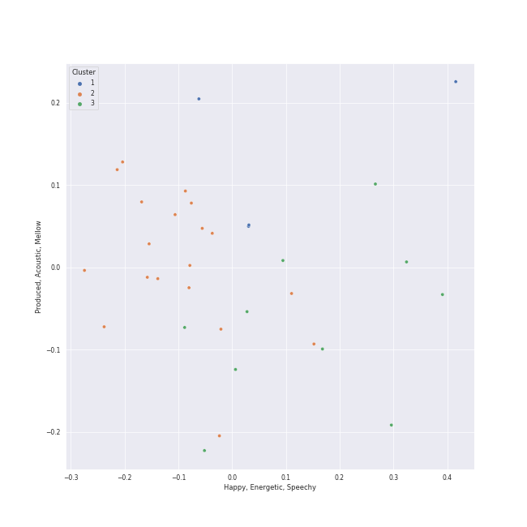

# Clusters in hip hop

## Cluster #1

3 tracks

| Art | Track | Album | Artists | Label | Rank | 💚 | 🔗 |
|:---|:---|:---|:---|:---|---:|:---|:---|
|  | Can't Tell Me Nothing | Graduation | Kanye West | Roc-A-Fella | nan | 💚 | [🔗](https://open.spotify.com/track/0mEdbdeRFQwBhN4xfyIeUM) |
|  | Lose Yourself | Curtain Call: The Hits (Deluxe Edition) | [Eminem](../../../../artists/eminem/overview.md) | [Aftermath](../../../../labels/aftermath) | nan | 💚 | [🔗](https://open.spotify.com/track/5Z01UMMf7V1o0MzF86s6WJ) |
|  | Work Out | Cole World: The Sideline Story | J. Cole | Roc Nation LLC | nan | 💚 | [🔗](https://open.spotify.com/track/2wAJTrFhCnQyNSD3oUgTZO) |
## Cluster #2

19 tracks

| Art | Track | Album | Artists | Label | Rank | 💚 | 🔗 |
|:---|:---|:---|:---|:---|---:|:---|:---|
|  | The Monster | The Marshall Mathers LP2 | [Eminem](../../../../artists/eminem/overview.md), [Rihanna](../../../../artists/rihanna/overview.md) | [Aftermath](../../../../labels/aftermath) | 524 | 💚 | [🔗](https://open.spotify.com/track/48RrDBpOSSl1aLVCalGl5C) |
|  | Money Trees | good kid, m.A.A.d city | [Kendrick Lamar](../../../../artists/kendrick_lamar/overview.md), Jay Rock | [Aftermath](../../../../labels/aftermath) | nan | | [🔗](https://open.spotify.com/track/2HbKqm4o0w5wEeEFXm2sD4) |
|  | All The Stars (with SZA) | Black Panther The Album Music From And Inspired By | [Kendrick Lamar](../../../../artists/kendrick_lamar/overview.md), SZA | Black Panther (TDE/DMG) PS | nan | 💚 | [🔗](https://open.spotify.com/track/3GCdLUSnKSMJhs4Tj6CV3s) |
|  | Alright | To Pimp A Butterfly | [Kendrick Lamar](../../../../artists/kendrick_lamar/overview.md) | [Aftermath](../../../../labels/aftermath) | nan | | [🔗](https://open.spotify.com/track/3iVcZ5G6tvkXZkZKlMpIUs) |
|  | DNA. | DAMN. | [Kendrick Lamar](../../../../artists/kendrick_lamar/overview.md) | [Aftermath](../../../../labels/aftermath) | nan | 💚 | [🔗](https://open.spotify.com/track/6HZILIRieu8S0iqY8kIKhj) |
|  | HUMBLE. | DAMN. | [Kendrick Lamar](../../../../artists/kendrick_lamar/overview.md) | [Aftermath](../../../../labels/aftermath) | nan | 💚 | [🔗](https://open.spotify.com/track/7KXjTSCq5nL1LoYtL7XAwS) |
|  | Everyday | Bobby Tarantino II | Logic, Marshmello | [Def Jam Recordings](../../../../labels/def_jam_recordings) | nan | | [🔗](https://open.spotify.com/track/4EAV2cKiqKP5UPZmY6dejk) |
|  | Clout (feat. Cardi B) | FATHER OF 4 | Offset, Cardi B | [Quality Control Music/Motown Records](../../../../labels/motown) | nan | 💚 | [🔗](https://open.spotify.com/track/59ywHNwwchG4nZJMLyxSzd) |
|  | It's A Vibe | Pretty Girls Like Trap Music | 2 Chainz, Ty Dolla $ign, Trey Songz, Jhené Aiko | 2Chainz PS/Def Jam | nan | | [🔗](https://open.spotify.com/track/6H0AwSQ20mo62jGlPGB8S6) |
|  | Momma I Hit A Lick (feat. Kendrick Lamar) | Rap Or Go To The League | 2 Chainz, [Kendrick Lamar](../../../../artists/kendrick_lamar/overview.md) | [Gamebread, LLC / Def Jam Recordings](../../../../labels/def_jam_recordings) | nan | | [🔗](https://open.spotify.com/track/7jKUnzzOGhAlPjr7LkIUlE) |
## Cluster #3

11 tracks

| Art | Track | Album | Artists | Label | Rank | 💚 | 🔗 |
|:---|:---|:---|:---|:---|---:|:---|:---|
|  | Jesus Walks | The College Dropout | Kanye West | Roc-A-Fella | nan | | [🔗](https://open.spotify.com/track/5g1vtHqi9uV7xtYeCcFOBx) |
|  | Love The Way You Lie | Recovery | [Eminem](../../../../artists/eminem/overview.md), [Rihanna](../../../../artists/rihanna/overview.md) | [Aftermath](../../../../labels/aftermath) | nan | 💚 | [🔗](https://open.spotify.com/track/15JINEqzVMv3SvJTAXAKED) |
|  | Ni**as In Paris | Watch The Throne | JAY-Z, Kanye West | Roc Nation/RocAFella/IDJ | nan | | [🔗](https://open.spotify.com/track/1auxYwYrFRqZP7t3s7w4um) |
|  | Empire State Of Mind | The Blueprint 3 | JAY-Z, Alicia Keys | Roc Nation / Jay-Z | nan | | [🔗](https://open.spotify.com/track/2igwFfvr1OAGX9SKDCPBwO) |
|  | On To The Next One | The Blueprint 3 | JAY-Z, Swizz Beatz | Roc Nation / Jay-Z | nan | | [🔗](https://open.spotify.com/track/4ljDnzzqwnRIynr1g55um4) |
|  | Numb / Encore | Numb / Encore: MTV Ultimate Mash-Ups Presents Collision Course | JAY-Z, Linkin Park | [Warner Records/Roc-A-Fella](../../../../labels/warner_records) | nan | | [🔗](https://open.spotify.com/track/5sNESr6pQfIhL3krM8CtZn) |
|  | Homicide (feat. Eminem) | Confessions of a Dangerous Mind | Logic, [Eminem](../../../../artists/eminem/overview.md) | [Def Jam Recordings](../../../../labels/def_jam_recordings) | nan | | [🔗](https://open.spotify.com/track/7M2tXmeS15NAzEn7ABFeBg) |
|  | Sucker for Pain (with Wiz Khalifa, Imagine Dragons, Logic & Ty Dolla $ign feat. X Ambassadors) | Sucker for Pain (with Logic & Ty Dolla $ign feat. X Ambassadors) | Lil Wayne, Wiz Khalifa, Imagine Dragons, X Ambassadors, Logic, Ty Dolla $ign | [Atlantic Records](../../../../labels/atlantic_records) | nan | | [🔗](https://open.spotify.com/track/4dASQiO1Eoo3RJvt74FtXB) |
|  | Silicon Valley | Malibu | Anderson .Paak | Steel Wool / OBE / Art Club / EMPIRE | nan | | [🔗](https://open.spotify.com/track/6zyXhzPJg7dCGuC5ToIxqN) |
|  | Break Ya Neck | Genesis | Busta Rhymes | [J Records/Legacy](../../../../labels/legacy) | nan | | [🔗](https://open.spotify.com/track/7gKgd0P3dAAePiSQQBqrlf) |