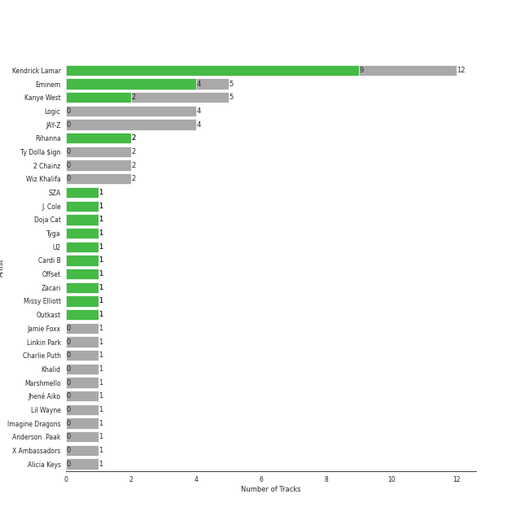
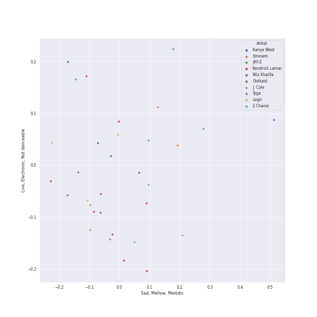
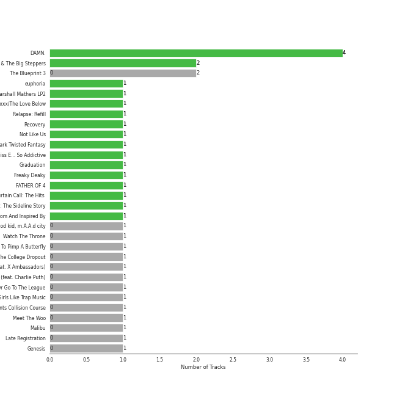
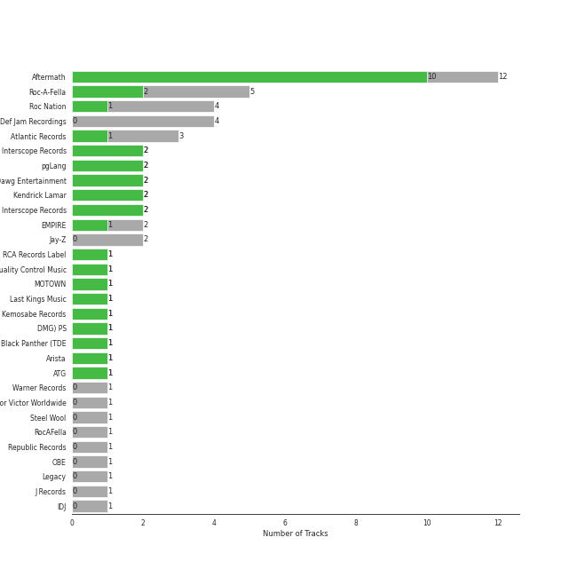
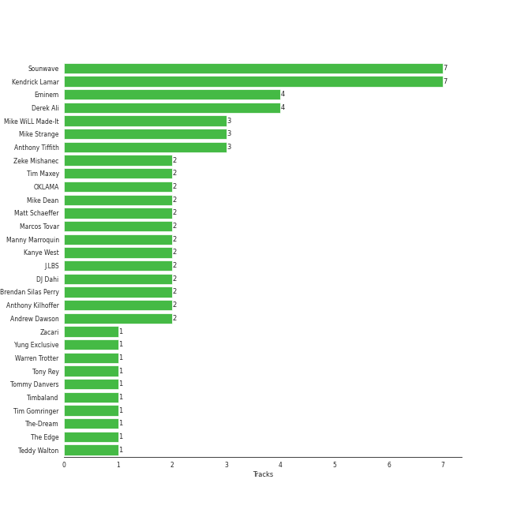

# hip hop

36 songs

[See Track Features](audio_features.md)

[See Clusters](clusters/overview.md)

## Top Artists

| Art | Rank | Tracks | 💚 | Artist | 🔗 |
|:---|---:|---:|---:|:---|:---|
|  | 286 | 11 | 8 | [Kendrick Lamar](../../artists/kendrick_lamar/overview.md) | [🔗](https://open.spotify.com/artist/2YZyLoL8N0Wb9xBt1NhZWg) |
|  | 307 | 5 | 4 | [Eminem](../../artists/eminem/overview.md) | [🔗](https://open.spotify.com/artist/7dGJo4pcD2V6oG8kP0tJRR) |
|  | 409 | 5 | 2 | Kanye West | [🔗](https://open.spotify.com/artist/5K4W6rqBFWDnAN6FQUkS6x) |
|  | 124 | 2 | 2 | [Rihanna](../../artists/rihanna/overview.md) | [🔗](https://open.spotify.com/artist/5pKCCKE2ajJHZ9KAiaK11H) |
|  | 198 | 1 | 1 | SZA | [🔗](https://open.spotify.com/artist/7tYKF4w9nC0nq9CsPZTHyP) |
|  | 409 | 1 | 1 | J. Cole | [🔗](https://open.spotify.com/artist/6l3HvQ5sa6mXTsMTB19rO5) |
|  | 199 | 1 | 1 | [Doja Cat](../../artists/doja_cat/overview.md) | [🔗](https://open.spotify.com/artist/5cj0lLjcoR7YOSnhnX0Po5) |
|  | 409 | 1 | 1 | Tyga | [🔗](https://open.spotify.com/artist/5LHRHt1k9lMyONurDHEdrp) |
|  | 409 | 1 | 1 | Cardi B | [🔗](https://open.spotify.com/artist/4kYSro6naA4h99UJvo89HB) |
|  | 409 | 1 | 1 | Offset | [🔗](https://open.spotify.com/artist/4DdkRBBYG6Yk9Ka8tdJ9BW) |

See all 34 artists

| Art | Rank | Tracks | 💚 | Artist | 🔗 |
|:---|---:|---:|---:|:---|:---|
|  | 409 | 1 | 1 | Zacari | [🔗](https://open.spotify.com/artist/3qBKjEOanahMxlRojwCzhI) |
|  | 409 | 1 | 1 | Outkast | [🔗](https://open.spotify.com/artist/1G9G7WwrXka3Z1r7aIDjI7) |
|  | 409 | 4 | 0 | Logic | [🔗](https://open.spotify.com/artist/4xRYI6VqpkE3UwrDrAZL8L) |
|  | 409 | 4 | 0 | JAY-Z | [🔗](https://open.spotify.com/artist/3nFkdlSjzX9mRTtwJOzDYB) |
|  | 409 | 2 | 0 | Ty Dolla $ign | [🔗](https://open.spotify.com/artist/7c0XG5cIJTrrAgEC3ULPiq) |
|  | 409 | 2 | 0 | 2 Chainz | [🔗](https://open.spotify.com/artist/17lzZA2AlOHwCwFALHttmp) |
|  | 409 | 2 | 0 | Wiz Khalifa | [🔗](https://open.spotify.com/artist/137W8MRPWKqSmrBGDBFSop) |
|  | 409 | 1 | 0 | Jamie Foxx | [🔗](https://open.spotify.com/artist/7LnaAXbDVIL75IVPnndf7w) |
|  | 409 | 1 | 0 | Linkin Park | [🔗](https://open.spotify.com/artist/6XyY86QOPPrYVGvF9ch6wz) |
|  | 358 | 1 | 0 | Charlie Puth | [🔗](https://open.spotify.com/artist/6VuMaDnrHyPL1p4EHjYLi7) |
|  | 409 | 1 | 0 | Khalid | [🔗](https://open.spotify.com/artist/6LuN9FCkKOj5PcnpouEgny) |
|  | 409 | 1 | 0 | Marshmello | [🔗](https://open.spotify.com/artist/64KEffDW9EtZ1y2vBYgq8T) |
|  | 409 | 1 | 0 | Jhené Aiko | [🔗](https://open.spotify.com/artist/5ZS223C6JyBfXasXxrRqOk) |
|  | 409 | 1 | 0 | Lil Wayne | [🔗](https://open.spotify.com/artist/55Aa2cqylxrFIXC767Z865) |
|  | 370 | 1 | 0 | Imagine Dragons | [🔗](https://open.spotify.com/artist/53XhwfbYqKCa1cC15pYq2q) |
|  | 409 | 1 | 0 | Anderson .Paak | [🔗](https://open.spotify.com/artist/3jK9MiCrA42lLAdMGUZpwa) |
|  | 409 | 1 | 0 | X Ambassadors | [🔗](https://open.spotify.com/artist/3NPpFNZtSTHheNBaWC82rB) |
|  | 409 | 1 | 0 | Alicia Keys | [🔗](https://open.spotify.com/artist/3DiDSECUqqY1AuBP8qtaIa) |
|  | 409 | 1 | 0 | Alessia Cara | [🔗](https://open.spotify.com/artist/2wUjUUtkb5lvLKcGKsKqsR) |
|  | 409 | 1 | 0 | Trey Songz | [🔗](https://open.spotify.com/artist/2iojnBLj0qIMiKPvVhLnsH) |
|  | 409 | 1 | 0 | Swizz Beatz | [🔗](https://open.spotify.com/artist/2cADQgiLMjNhbsfeN52Bf3) |
|  | 409 | 1 | 0 | Jay Rock | [🔗](https://open.spotify.com/artist/28ExwzUQsvgJooOI0X1mr3) |
|  | 409 | 1 | 0 | Busta Rhymes | [🔗](https://open.spotify.com/artist/1YfEcTuGvBQ8xSD1f53UnK) |
|  | 409 | 1 | 0 | Pop Smoke | [🔗](https://open.spotify.com/artist/0eDvMgVFoNV3TpwtrVCoTj) |

## Most and least listened tracks
| Rank | ​ | Most listened tracks | Rank | ​​ | Least listened tracks |
|---:|:---|:---|---:|:---|:---|
| 628 |  | [The Monster](../../artists/eminem/overview.md) | 904 |  | Momma I Hit A Lick (feat. Kendrick Lamar) |
| 755 |  | [We Made You](../../artists/eminem/overview.md) | 904 |  | Break Ya Neck |
| 904 |  | Can't Tell Me Nothing | 904 |  | Homicide (feat. Eminem) |
| 904 |  | [Love The Way You Lie](../../artists/eminem/overview.md) | 904 |  | [HUMBLE.](../../artists/kendrick_lamar/overview.md) |
| 904 |  | Gold Digger | 904 |  | Dior |
| 904 |  | Ni**as In Paris | 904 |  | [euphoria](../../artists/kendrick_lamar/overview.md) |
| 904 |  | All Of The Lights | 904 |  | Silicon Valley |
| 904 |  | [Money Trees](../../artists/kendrick_lamar/overview.md) | 904 |  | [LOVE. FEAT. ZACARI.](../../artists/kendrick_lamar/overview.md) |
| 904 |  | See You Again (feat. Charlie Puth) | 904 |  | [DNA.](../../artists/kendrick_lamar/overview.md) |
| 904 |  | Hey Ya! | 904 |  | It's A Vibe |

## Top Albums

| Art | Rank | Tracks | 💚 | Album | Release Date | 🔗 |
|:---|---:|---:|---:|:---|:---|:---|
|  | 604 | 3 | 3 | DAMN. | 2017-04-14 | [🔗](https://open.spotify.com/album/4eLPsYPBmXABThSJ821sqY) |
|  | 604 | 2 | 2 | Mr. Morale & The Big Steppers | 2022-05-13 | [🔗](https://open.spotify.com/album/79ONNoS4M9tfIA1mYLBYVX) |
|  | 604 | 2 | 0 | The Blueprint 3 | 2009-09-08 | [🔗](https://open.spotify.com/album/2CUT0104gySOIvqwtXeFsX) |
|  | 604 | 1 | 1 | euphoria | 2024-04-30 | [🔗](https://open.spotify.com/album/32bR4LcEc1PvJEhaKoo4ZN) |
|  | 429 | 1 | 1 | The Marshall Mathers LP2 | 2013-11-05 | [🔗](https://open.spotify.com/album/3vOgbDjgsZBAPwV2M3bNOj) |
|  | 604 | 1 | 1 | Speakerboxxx/The Love Below | 2003 | [🔗](https://open.spotify.com/album/1UsmQ3bpJTyK6ygoOOjG1r) |
|  | 508 | 1 | 1 | Relapse: Refill | 2009-05-15 | [🔗](https://open.spotify.com/album/7MZzYkbHL9Tk3O6WeD4Z0Z) |
|  | 604 | 1 | 1 | Recovery | 2010-06-18 | [🔗](https://open.spotify.com/album/47BiFcV59TQi2s9SkBo2pb) |
|  | 604 | 1 | 1 | Not Like Us | 2024-05-04 | [🔗](https://open.spotify.com/album/5JjnoGJyOxfSZUZtk2rRwZ) |
|  | 604 | 1 | 1 | My Beautiful Dark Twisted Fantasy | 2010-11-22 | [🔗](https://open.spotify.com/album/20r762YmB5HeofjMCiPMLv) |

See all 32 albums

| Art | Rank | Tracks | 💚 | Album | Release Date | 🔗 |
|:---|---:|---:|---:|:---|:---|:---|
|  | 604 | 1 | 1 | Graduation | 2007-09-11 | [🔗](https://open.spotify.com/album/4SZko61aMnmgvNhfhgTuD3) |
|  | 604 | 1 | 1 | Freaky Deaky | 2022-02-25 | [🔗](https://open.spotify.com/album/05oVghsqITa33yHnbW7uPz) |
|  | 604 | 1 | 1 | FATHER OF 4 | 2019-02-22 | [🔗](https://open.spotify.com/album/6bPpXqJRpjwy0hLyUGtzYc) |
|  | 604 | 1 | 1 | Curtain Call: The Hits (Deluxe Edition) | 2005-12-06 | [🔗](https://open.spotify.com/album/5qENHeCSlwWpEzb25peRmQ) |
|  | 604 | 1 | 1 | Cole World: The Sideline Story | 2011-09-27 | [🔗](https://open.spotify.com/album/0fhmJYVhW0e4i33pCLPA5i) |
|  | 604 | 1 | 1 | Black Panther The Album Music From And Inspired By | 2018-02-09 | [🔗](https://open.spotify.com/album/3pLdWdkj83EYfDN6H2N8MR) |
|  | 604 | 1 | 0 | good kid, m.A.A.d city | 2012 | [🔗](https://open.spotify.com/album/6PBZN8cbwkqm1ERj2BGXJ1) |
|  | 604 | 1 | 0 | Watch The Throne | 2011-08-08 | [🔗](https://open.spotify.com/album/0OcMap99vLEeGkBCfCwRwS) |
|  | 604 | 1 | 0 | To Pimp A Butterfly | 2015-03-16 | [🔗](https://open.spotify.com/album/7ycBtnsMtyVbbwTfJwRjSP) |
|  | 604 | 1 | 0 | The College Dropout | 2004-02-10 | [🔗](https://open.spotify.com/album/4Uv86qWpGTxf7fU7lG5X6F) |
|  | 604 | 1 | 0 | Sucker for Pain (with Logic & Ty Dolla $ign feat. X Ambassadors) | 2016-06-24 | [🔗](https://open.spotify.com/album/704GHNtZhEe9TBgleCNNGv) |
|  | 604 | 1 | 0 | See You Again (feat. Charlie Puth) | 2015 | [🔗](https://open.spotify.com/album/5FXIqS1XqbpfOKNoi5VUwS) |
|  | 604 | 1 | 0 | Rap Or Go To The League | 2019-03-01 | [🔗](https://open.spotify.com/album/1BR69wIifGZUSimcuTjWVg) |
|  | 604 | 1 | 0 | Pretty Girls Like Trap Music | 2017-06-16 | [🔗](https://open.spotify.com/album/5vvvo79z68vWj9yimoygfS) |
|  | 604 | 1 | 0 | Numb / Encore: MTV Ultimate Mash-Ups Presents Collision Course | 2004-11-30 | [🔗](https://open.spotify.com/album/4lhyg7YGQagE8FT8cZBqyw) |
|  | 604 | 1 | 0 | Meet The Woo | 2019-07-26 | [🔗](https://open.spotify.com/album/6d1vGZsr6Uy3h9IigBpPAf) |
|  | 604 | 1 | 0 | Malibu | 2016-01-15 | [🔗](https://open.spotify.com/album/4VFG1DOuTeDMBjBLZT7hCK) |
|  | 604 | 1 | 0 | Late Registration | 2005-08-30 | [🔗](https://open.spotify.com/album/5ll74bqtkcXlKE7wwkMq4g) |
|  | 604 | 1 | 0 | Genesis | 2001-11-07 | [🔗](https://open.spotify.com/album/6cj1gdwhr2MVJr9YnWghUd) |
|  | 604 | 1 | 0 | Everybody | 2017-05-05 | [🔗](https://open.spotify.com/album/1HiN2YXZcc3EjmVZ4WjfBk) |
|  | 604 | 1 | 0 | Confessions of a Dangerous Mind | 2019-05-10 | [🔗](https://open.spotify.com/album/0XLwImzaZEtqHE4NHAepDz) |
|  | 604 | 1 | 0 | Bobby Tarantino II | 2018-03-09 | [🔗](https://open.spotify.com/album/4F87p1aiFwHeU4uu65MaPV) |

## Top Record Labels

| Tracks | 💚 | Label |
|---:|---:|:---|
| 11 | 9 | [Aftermath](../../labels/aftermath/overview.md) |
| 5 | 2 | Roc-A-Fella |
| 2 | 2 | under exclusive license to Interscope Records |
| 2 | 2 | pgLang |
| 2 | 2 | Top Dawg Entertainment |
| 2 | 2 | Kendrick Lamar |
| 2 | 2 | [Interscope Records](../../labels/interscope_records/overview.md) |
| 4 | 1 | Roc Nation |
| 2 | 1 | EMPIRE |
| 1 | 1 | [RCA Records Label](../../labels/rca_records_label/overview.md) |

See all 33 labels

| Tracks | 💚 | Label |
|---:|---:|:---|
| 1 | 1 | Quality Control Music |
| 1 | 1 | [MOTOWN](../../labels/motown/overview.md) |
| 1 | 1 | Last Kings Music |
| 1 | 1 | Kemosabe Records |
| 1 | 1 | DMG) PS |
| 1 | 1 | Black Panther (TDE |
| 1 | 1 | Arista |
| 4 | 0 | [Def Jam Recordings](../../labels/def_jam_recordings/overview.md) |
| 2 | 0 | Jay-Z |
| 2 | 0 | [Atlantic Records](../../labels/atlantic_records/overview.md) |
| 1 | 0 | [Warner Records](../../labels/warner_records/overview.md) |
| 1 | 0 | Victor Victor Worldwide |
| 1 | 0 | Steel Wool |
| 1 | 0 | RocAFella |
| 1 | 0 | [Republic Records](../../labels/republic_records/overview.md) |
| 1 | 0 | OBE |
| 1 | 0 | [Legacy](../../labels/legacy/overview.md) |
| 1 | 0 | J Records |
| 1 | 0 | IDJ |
| 1 | 0 | Gamebread |
| 1 | 0 | Def Jam |
| 1 | 0 | Art Club |
| 1 | 0 | 2Chainz PS |

## Top Producers

| Art | Producer | Tracks | Credit Types |
|:---|:---|---:|:---|
| | [Sounwave](../../producers/sounwave/overview.md) | 6 | Producer, Songwriter, Arranger |
|  | [Kendrick Lamar](../../artists/kendrick_lamar/overview.md) | 6 | Songwriter |
|  | [Eminem](../../artists/eminem/overview.md) | 4 | Producer, Songwriter |
| | Derek Ali | 3 | Producer |
| | Mike Strange | 3 | Producer |
| | J.LBS | 2 | Producer, Songwriter |
| | Anthony Kilhoffer | 2 | Producer |
| | OKLAMA | 2 | Producer |
| | Tim Maxey | 2 | Producer, Songwriter |
| | [Manny Marroquin](../../producers/manny_marroquin/overview.md) | 2 | Producer |

View all

| Art | Producer | Tracks | Credit Types |
|:---|:---|---:|:---|
| | Mike WiLL Made-It | 2 | Producer, Songwriter |
| | Andrew Dawson | 2 | Producer |
| | [Marcos Tovar](../../producers/marcos_tovar/overview.md) | 2 | Producer |
|  | Kanye West | 2 | Producer, Songwriter |
| | Anthony Tiffith | 2 | Producer, Songwriter |
| | Mike Dean | 2 | Producer, Arranger |
| | Matt Schaeffer | 2 | Producer, Songwriter |
| | Neal Pogue | 1 | Producer |
| | Robert Hannon | 1 | Producer |
| | Johnathan Turner | 1 | Producer |
|  | J. Cole | 1 | Producer |
|  | Offset | 1 | Lyricist, Songwriter |
|  | Zacari | 1 | Songwriter |
| | Duval Timothy | 1 | Producer, Songwriter |
| | Rosie Danvers | 1 | Arranger |
|  | [Rihanna](../../artists/rihanna/overview.md) | 1 | Songwriter |
| | Doc Ish | 1 | Producer |
| | Luis Resto | 1 | Producer, Songwriter |
| | Jeff Bhasker | 1 | Producer, Songwriter |
|  | Bebe Rexha | 1 | Songwriter |
| | Zeke Mishanec | 1 | Producer |
|  | André 3000 | 1 | Producer |
| | Tony Rey | 1 | Producer |
| | Mauricio "Veto" Iragorri | 1 | Producer |
| | [Greg Kurstin](../../producers/greg_kurstin/overview.md) | 1 | Producer, Songwriter |
| | Kid Cudi | 1 | Songwriter |
| | Beach Noise | 1 | Producer |
| | Southside | 1 | Producer, Songwriter |
| | Brent Kolatalo | 1 | Producer |
| | CuBeatz | 1 | Producer |
| | Cyrus "Nois" Taghipour | 1 | Producer |
| | Frequency | 1 | Producer, Songwriter |
| | André Benjamin (Benjamin, André) | 1 | Lyricist, Songwriter |
| | Skylar Grey | 1 | Songwriter |
| | Tim Gomringer | 1 | Songwriter |
| | Maki Athanasiou | 1 | Songwriter |
| | Makeba | 1 | Producer |
| | Johnny Juliano | 1 | Producer |
| | Warren Trotter | 1 | Songwriter |
| | Fergie | 1 | Songwriter |
| | Noah Goldstein | 1 | Producer |
| | Steve King | 1 | Producer |
| | Ken Lewis | 1 | Arranger |
| | Jon Bellion | 1 | Songwriter |
| | DJ Toomp | 1 | Producer |
| | Kevin Gomringer | 1 | Songwriter |
|  | SZA | 1 | Songwriter |
| | Jeff Bass | 1 | Producer, Songwriter |
| | Kyuro | 1 | Producer |
| | Aldrin Davis | 1 | Songwriter |
| | Tommy Danvers | 1 | Producer |
| | James Hunt | 1 | Producer |
| | Alex da Kid | 1 | Producer, Songwriter |
| | Sam Ricci | 1 | Producer |
| | Brendan Silas Perry | 1 | Producer |
| | Ray Charles Brown, Jr | 1 | Producer |
|  | Cardi B | 1 | Songwriter |
| | Teddy Walton | 1 | Producer, Songwriter |
| | Jake Kosich | 1 | Songwriter |
| | Jordan Thorpe | 1 | Songwriter |
| | L.A. Reid | 1 | Producer |
| | Mustard | 1 | Producer, Songwriter |
| | Aalias | 1 | Songwriter |
| | Pete Novak | 1 | Producer |
| | Malik Yusef | 1 | Songwriter |
| | Sam Dew | 1 | Songwriter |
| | Ezinma | 1 | Arranger |
| | Dr. Dre | 1 | Producer |
| | John Frye | 1 | Producer |
| | Cardo | 1 | Producer |
| | Yung Exclusive | 1 | Producer |
| | DJ Dahi | 1 | Producer |
| | Johnny Kosich | 1 | Producer, Songwriter |
| | Sean Momberger | 1 | Producer |
| | Al Shux | 1 | Producer, Songwriter |
| | The-Dream | 1 | Songwriter |

## Years

| ​ | 10 newest albums | ​​ | 10 oldest albums |
|:---|:---|:---|:---|
|  | Not Like Us (2024-05-04) |  | Genesis (2001-11-07) |
|  | euphoria (2024-04-30) |  | Speakerboxxx/The Love Below (2003) |
|  | Mr. Morale & The Big Steppers (2022-05-13) |  | The College Dropout (2004-02-10) |
|  | Freaky Deaky (2022-02-25) |  | Numb / Encore: MTV Ultimate Mash-Ups Presents Collision Course (2004-11-30) |
|  | Meet The Woo (2019-07-26) |  | Late Registration (2005-08-30) |
|  | Confessions of a Dangerous Mind (2019-05-10) |  | Curtain Call: The Hits (Deluxe Edition) (2005-12-06) |
|  | Rap Or Go To The League (2019-03-01) |  | Graduation (2007-09-11) |
|  | FATHER OF 4 (2019-02-22) |  | Relapse: Refill (2009-05-15) |
|  | Bobby Tarantino II (2018-03-09) |  | The Blueprint 3 (2009-09-08) |
|  | Black Panther The Album Music From And Inspired By (2018-02-09) |  | Recovery (2010-06-18) |

