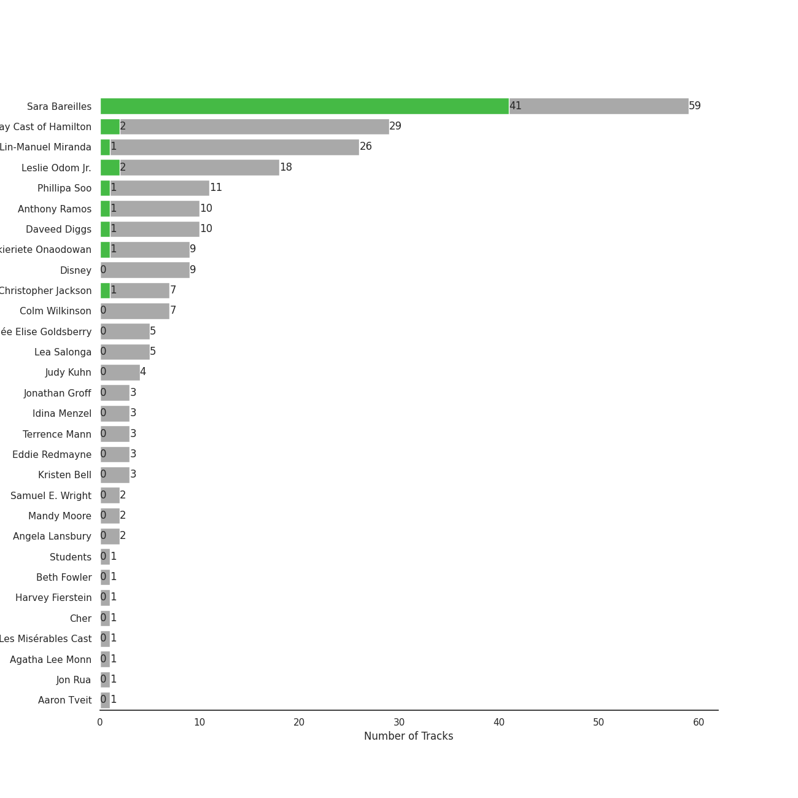
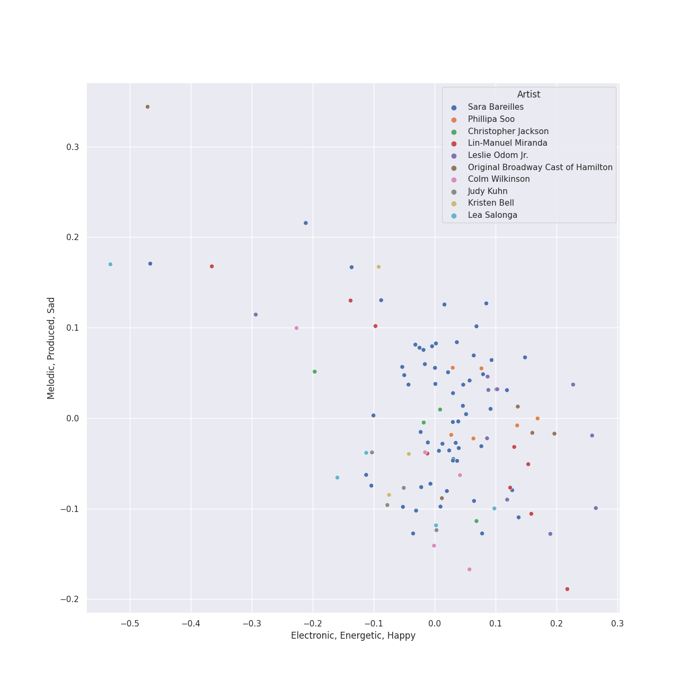
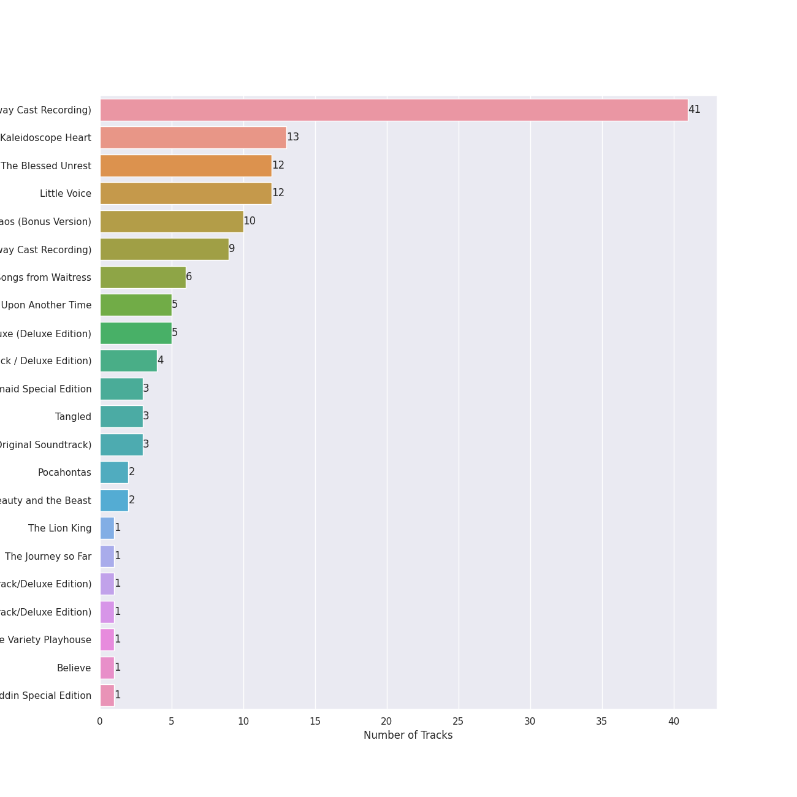
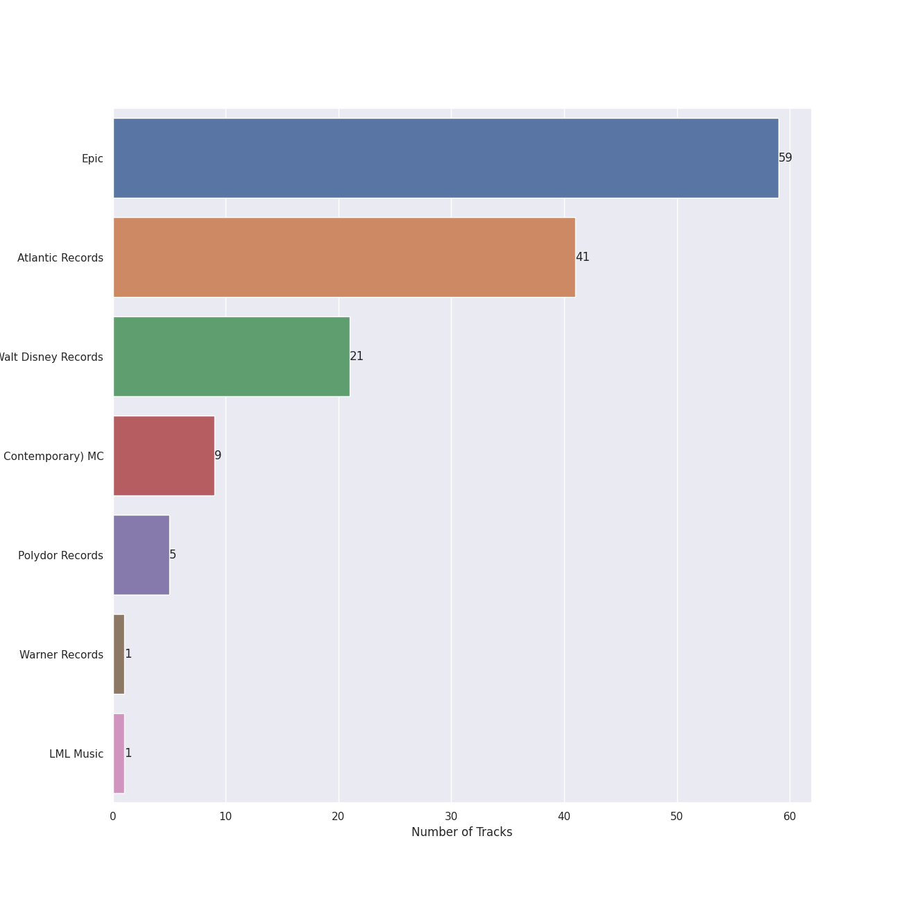

# hollywood

[136 songs](hollywood_tracks.md)

## Top Artists

See all 61 artists

| Number of Tracks | Art | Artist | 🔗 |
|---:|:---|:---|:---|
| 59 |  | [Sara Bareilles](../artists/sara_bareilles.md) | [🔗](https://open.spotify.com/artist/2Sqr0DXoaYABbjBo9HaMkM) |
| 29 |  | [Original Broadway Cast of Hamilton](../artists/original_broadway_cast_of_hamilton.md) | [🔗](https://open.spotify.com/artist/3UUJfRbrA2nTbcg4i0MOwu) |
| 26 |  | [Lin-Manuel Miranda](../artists/lin_manuel_miranda.md) | [🔗](https://open.spotify.com/artist/4aXXDj9aZnlshx7mzj3W1N) |
| 18 |  | [Leslie Odom Jr.](../artists/leslie_odom_jr_.md) | [🔗](https://open.spotify.com/artist/3cR4rhS2hBWqI7rJEBacvN) |
| 11 |  | [Phillipa Soo](../artists/phillipa_soo.md) | [🔗](https://open.spotify.com/artist/2OEGI2wrCVmvavKEOMlccy) |
| 10 |  | [Anthony Ramos](../artists/anthony_ramos.md) | [🔗](https://open.spotify.com/artist/660YptcR0hNHJ8iEr1qcse) |
| 10 |  | [Daveed Diggs](../artists/daveed_diggs.md) | [🔗](https://open.spotify.com/artist/3twuAojvYNrlWZpMkxLm3P) |
| 9 |  | [Okieriete Onaodowan](../artists/okieriete_onaodowan.md) | [🔗](https://open.spotify.com/artist/6G3sPhnj4JBCsBVBGvZnkk) |
| 9 |  | [Disney](../artists/disney.md) | [🔗](https://open.spotify.com/artist/3xvaSlT4xsyk6lY1ESOspO) |
| 7 |  | Christopher Jackson | [🔗](https://open.spotify.com/artist/6sLwRSXSUF5JTUnQaFenyj) |
| 7 |  | Colm Wilkinson | [🔗](https://open.spotify.com/artist/4hKV8PcRBaHZqBJjSn8OJE) |
| 5 |  | Renée Elise Goldsberry | [🔗](https://open.spotify.com/artist/5VJN4jB6PqqEg4kJiAj6Eu) |
| 5 |  | Lea Salonga | [🔗](https://open.spotify.com/artist/1GlMjIezcLwV3OFlX0uXOv) |
| 4 |  | Judy Kuhn | [🔗](https://open.spotify.com/artist/7tHd518aPjJYUgyv9bidBz) |
| 3 |  | Jonathan Groff | [🔗](https://open.spotify.com/artist/7KkqUt65v6LMtR369OQ6FB) |
| 3 |  | Idina Menzel | [🔗](https://open.spotify.com/artist/73Np75Wv2tju61Eo9Zw4IR) |
| 3 |  | Terrence Mann | [🔗](https://open.spotify.com/artist/5uBIsYz9WatgoViLG6pVj2) |
| 3 |  | Eddie Redmayne | [🔗](https://open.spotify.com/artist/4EJP6Qhk6l18LumCcpEfLw) |
| 3 |  | Kristen Bell | [🔗](https://open.spotify.com/artist/2kHxkdiKCSnHMkhIgFBZaI) |
| 2 |  | Samuel E. Wright | [🔗](https://open.spotify.com/artist/6Id8rcDNyBXPcgKQVfQ8rX) |
| 2 |  | Mandy Moore | [🔗](https://open.spotify.com/artist/2LJxr7Pt3JnP60eLxwbDOu) |
| 2 |  | Angela Lansbury | [🔗](https://open.spotify.com/artist/0LtVJXnPR8msCJiE2DjHxy) |
| 1 |  | Students | [🔗](https://open.spotify.com/artist/7oaoEBdRqHXfoiGYa55Atp) |
| 1 |  | Beth Fowler | [🔗](https://open.spotify.com/artist/7KNW6OwcA260MsaEtnvhxV) |
| 1 |  | Harvey Fierstein | [🔗](https://open.spotify.com/artist/7G6zawIBBtDX1WvuT97Ei9) |
| 1 |  | Cher | [🔗](https://open.spotify.com/artist/72OaDtakiy6yFqkt4TsiFt) |
| 1 |  | Les Misérables Cast | [🔗](https://open.spotify.com/artist/71wy5iisVKXLZgoPxdFi8A) |
| 1 |  | Agatha Lee Monn | [🔗](https://open.spotify.com/artist/6kHu5ICQRBZdsAHjAjQlmp) |
| 1 |  | Jon Rua | [🔗](https://open.spotify.com/artist/69NsP4MC1JbfvKMwpx2oy8) |
| 1 |  | Aaron Tveit | [🔗](https://open.spotify.com/artist/68h2f0WXn4zEctSgNYozXx) |
| 1 |  | Joseph Williams | [🔗](https://open.spotify.com/artist/5xk0kRuXn1zToTHpHAqpui) |
| 1 |  | Frances Ruffelle | [🔗](https://open.spotify.com/artist/5uSeMCBhe3DiROdFrwaXkw) |
| 1 |  | Auli'i Cravalho | [🔗](https://open.spotify.com/artist/5mnS9jJdKQQcRSqFu5YPVe) |
| 1 |  | Jerry Orbach | [🔗](https://open.spotify.com/artist/5i2OpmeVKsmViqoETxuOvO) |
| 1 |  | Jason Weaver | [🔗](https://open.spotify.com/artist/5UdPkKWd8YNR5xGcmqH9QJ) |
| 1 |  | Amanda Seyfried | [🔗](https://open.spotify.com/artist/5RZjpmuD14JKXvB8Ry1G1u) |
| 1 |  | Katie Lopez | [🔗](https://open.spotify.com/artist/5Kkhk21siwbW3BfZUwpykJ) |
| 1 |  | Hugh Jackman | [🔗](https://open.spotify.com/artist/5F1aoppMtU3OMiltO8ymJ2) |
| 1 |  | Donna Murphy | [🔗](https://open.spotify.com/artist/5BuTOT6mPoNZ5EmaPheBI9) |
| 1 |  | Jason Mraz | [🔗](https://open.spotify.com/artist/4phGZZrJZRo4ElhRtViYdl) |
| 1 |  | Jodi Benson | [🔗](https://open.spotify.com/artist/4mmMtabvFCKA6HfmVmitNH) |
| 1 |  | Samantha Barks | [🔗](https://open.spotify.com/artist/4gOl5m9dY7IGAipqpul7GZ) |
| 1 |  | Chorus - Mulan | [🔗](https://open.spotify.com/artist/4KpdqBDU2C5gB3vhdojuqA) |
| 1 |  | Jasmine Cephas-Jones | [🔗](https://open.spotify.com/artist/4H3e5t5utgPvj6Nsuda5QF) |
| 1 |  | Santino Fontana | [🔗](https://open.spotify.com/artist/47NluEnhJda2gsnjuvcoob) |
| 1 |  | Jerry Tondo | [🔗](https://open.spotify.com/artist/3wUpOiaLjwAZNregbC7CxO) |
| 1 |  | Chorus - Beauty And the Beast | [🔗](https://open.spotify.com/artist/3kWWBtNzJFtKA222gZz39d) |
| 1 |  | Brad Kane | [🔗](https://open.spotify.com/artist/3dAzSJ9lQnJSq5Z0OgDBep) |
| 1 |  | Ephraim Sykes | [🔗](https://open.spotify.com/artist/3brilvMAN6ILRUMvaqJWdG) |
| 1 |  | Matthew Wilder | [🔗](https://open.spotify.com/artist/3bmFPbLMiLxtR9tFrTcKcP) |
| 1 |  | Zachary Levi | [🔗](https://open.spotify.com/artist/3XSyTI9ct70ZheMESAv2st) |
| 1 |  | David Bryant | [🔗](https://open.spotify.com/artist/2yPfp367ZwywK1lbGg00b8) |
| 1 |  | Randy Graff | [🔗](https://open.spotify.com/artist/2iRiwwxcJb6fXCxO5jt1cz) |
| 1 |  | Marni Nixon | [🔗](https://open.spotify.com/artist/2Npf96k0QoY8YYwqnELDmQ) |
| 1 |  | AURORA | [🔗](https://open.spotify.com/artist/1WgXqy2Dd70QQOU7Ay074N) |
| 1 |  | Ariana DeBose | [🔗](https://open.spotify.com/artist/1Np9GsrPO7dlczjvdehBxs) |
| 1 |  | Anne Hathaway | [🔗](https://open.spotify.com/artist/0nIyPY7J7G68WgQEOLHn0x) |
| 1 |  | Ernie Sabella | [🔗](https://open.spotify.com/artist/0RH6EMxqfzCEB7QCSKQ4xr) |
| 1 |  | Sasha Hutchings | [🔗](https://open.spotify.com/artist/0Pg2rEmiZEnmxw4eQwtvsR) |
| 1 |  | Nathan Lane | [🔗](https://open.spotify.com/artist/0P0do9GwiSgweSF6Ui3mrv) |
| 1 |  | James Hong | [🔗](https://open.spotify.com/artist/00erTY7OuCOdNTN36srPNN) |

## Top Albums

See all 22 albums

| Number of Tracks | Art | Album | Release Date | 🔗 |
|---:|:---|:---|:---|:---|
| 41 |  | Hamilton (Original Broadway Cast Recording) | 2015-09-25 | [🔗](https://open.spotify.com/album/1kCHru7uhxBUdzkm4gzRQc) |
| 13 |  | Kaleidoscope Heart | 2010-09-07 | [🔗](https://open.spotify.com/album/627ukPRwYxyBREHxBq0vGJ) |
| 12 |  | The Blessed Unrest | 2013-07-16 | [🔗](https://open.spotify.com/album/7lpbyGc4fHsQkBTsfWVBhp) |
| 12 |  | Little Voice | 2007-07-03 | [🔗](https://open.spotify.com/album/2Z9WUERfMjOgQ6ze9TcGbF) |
| 10 |  | Amidst the Chaos (Bonus Version) | 2019-05-10 | [🔗](https://open.spotify.com/album/5x2sDapUIdq0qk1ezff3gm) |
| 9 |  | Les Misérables (Original Broadway Cast Recording) | 1987-05-11 | [🔗](https://open.spotify.com/album/3jbKDx0zB1QoJQTw8i1AvD) |
| 6 |  | What's Inside: Songs from Waitress | 2015-11-06 | [🔗](https://open.spotify.com/album/1s6codM2ZAB008t9GTyaEk) |
| 5 |  | Once Upon Another Time | 2012-05-22 | [🔗](https://open.spotify.com/album/1PrqYZJRzGNf8AsSOraxnZ) |
| 4 |  | Les Misérables: The Motion Picture Soundtrack Deluxe (Deluxe Edition) | 2013-01-01 | [🔗](https://open.spotify.com/album/0I6Bl1dVB1hQsSoQF6KuTg) |
| 4 |  | Frozen (Original Motion Picture Soundtrack / Deluxe Edition) | 2013-01-01 | [🔗](https://open.spotify.com/album/7lZs5r4oQV2nutddffLrg0) |
| 3 |  | The Little Mermaid Special Edition | 2006-01-01 | [🔗](https://open.spotify.com/album/4aAwvCRNJIqiUGVEjieWv6) |
| 3 |  | Tangled | 2010-01-01 | [🔗](https://open.spotify.com/album/1l0aFrH24oPrQSqGtfeFyE) |
| 3 |  | Mulan (Original Soundtrack) | 1998-01-01 | [🔗](https://open.spotify.com/album/3Ohs7Jo6GM6mydUOL0m5aC) |
| 2 |  | Pocahontas | 1995-01-01 | [🔗](https://open.spotify.com/album/7L6kEZVkWh7OEI71b1JHZd) |
| 2 |  | Beauty and the Beast | 1991-01-01 | [🔗](https://open.spotify.com/album/3O5p9VNddbwvqWTdYKEqV5) |
| 1 |  | The Lion King | 1994-01-01 | [🔗](https://open.spotify.com/album/3YA5DdB3wSz4pdfEXoMyRd) |
| 1 |  | The Journey so Far | 2011-08-09 | [🔗](https://open.spotify.com/album/3zr8JDmixklHY1sOURyfoK) |
| 1 |  | Moana (Original Motion Picture Soundtrack/Deluxe Edition) | 2016-11-18 | [🔗](https://open.spotify.com/album/6pZj4nvx6lV3ulIK3BSjvs) |
| 1 |  | Frozen 2 (Original Motion Picture Soundtrack/Deluxe Edition) | 2019-11-15 | [🔗](https://open.spotify.com/album/4M07HWIlZr7zoXoxDHR5mz) |
| 1 |  | Brave Enough: Live at the Variety Playhouse | 2013-10-22 | [🔗](https://open.spotify.com/album/7L4ZgnQqEhCEsV9GnMeXtE) |
| 1 |  | Believe | 1998 | [🔗](https://open.spotify.com/album/0jZfbz0dNfDjPSg0hYJNth) |
| 1 |  | Aladdin Special Edition | 2004-01-01 | [🔗](https://open.spotify.com/album/7bt2aty3lUo6Q1Ud8pthRz) |

## Top Record Labels

See all 7 labels

| Number of Tracks | Label |
|---:|:---|
| 59 | [Epic](../labels/epic.md) |
| 41 | [Atlantic Records](../labels/atlantic_records.md) |
| 21 | [Walt Disney Records](../labels/walt_disney_records.md) |
| 9 | [Verve (Adult Contemporary) MC](../labels/verve__adult_contemporary__mc.md) |
| 4 | [Polydor Records](../labels/polydor_records.md) |
| 1 | [Warner Records](../labels/warner_records.md) |
| 1 | LML Music |

## Audio Features

| 10 most Danceable tracks | 10 least Danceable tracks |
|:---|:---|
| Ten Duel Commandments (0.887) | Bring Him Home (0.237) |
| Washington on Your Side (0.884) | Beauty and the Beast - From "Beauty and the Beast" / Soundtrack Version (0.241) |
| A Winter's Ball (0.854) | Come To Me (Fantine's Death) (0.252) |
| Blow Us All Away (0.82) | Reflection (0.255) |
| The Adams Administration (0.8) | I Dreamed A Dream - From "Les Misérables" (0.256) |
| Little Black Dress (0.787) | A Heart Full Of Love (0.258) |
| Eden (0.776) | Stay (0.262) |
| Non-Stop (0.77) | Gravity (0.27) |
| Yorktown (The World Turned Upside Down) (0.76) | Colors of the Wind - From "Pocahontas" / Soundtrack Version (0.272) |
| Cabinet Battle #2 (0.753) | Part of Your World (0.274) |

| 10 most Energetic tracks | 10 least Energetic tracks |
|:---|:---|
| Believe (0.917) | Kaleidoscope Heart (0.0516) |
| Bad Idea (feat. Jason Mraz) (0.889) | Bring Him Home (0.0586) |
| Yorktown (The World Turned Upside Down) (0.883) | In My Life (0.0594) |
| Morningside (0.88) | Empty Chairs At Empty Tables (0.0688) |
| Let The Rain (0.873) | Come To Me (Fantine's Death) (0.0698) |
| Fairytale (0.857) | I Dreamed A Dream - From "Les Misérables" (0.0739) |
| Brave (0.836) | In My Life (0.091) |
| Love On the Rocks (0.819) | Goodbye Yellow Brick Road - Live at the Variety Playhouse, Atlanta, GA - May 2013 (0.114) |
| Come Round Soon (0.819) | Best of Wives and Best of Women (0.115) |
| One Sweet Love (0.812) | Do You Want to Build a Snowman? - From "Frozen"/Soundtrack Version (0.121) |

| 10 most Speechy tracks | 10 least Speechy tracks |
|:---|:---|
| Aaron Burr, Sir (0.818) | Satellite Call (0.0241) |
| Ten Duel Commandments (0.658) | Machine Gun (0.0268) |
| The World Was Wide Enough (0.648) | Orpheus (0.0269) |
| The Adams Administration (0.544) | Sweet As Whole (0.0275) |
| Cabinet Battle #2 (0.537) | Breathe Again (0.0278) |
| We Know (0.523) | Islands (0.0284) |
| A Winter's Ball (0.507) | History Has Its Eyes on You (0.0291) |
| Your Obedient Servant (0.502) | If I Can't Have You (0.0297) |
| Right Hand Man (0.492) | The Light (0.0297) |
| Meet Me Inside (0.474) | Gonna Get Over You (0.0301) |

| 10 most Acoustic tracks | 10 least Acoustic tracks |
|:---|:---|
| Bring Him Home (0.981) | Brave (0.00502) |
| Bright Lights and Cityscapes (0.977) | Many the Miles (0.00796) |
| Manhattan (0.972) | Believe (0.0082) |
| A Heart Full Of Love (0.968) | Vegas (0.00881) |
| In My Life (0.96) | Bad Idea (feat. Jason Mraz) (0.0168) |
| Goodbye Yellow Brick Road - Live at the Variety Playhouse, Atlanta, GA - May 2013 (0.959) | Wicked Love (0.0178) |
| Come To Me (Fantine's Death) (0.953) | Gonna Get Over You (0.0199) |
| Empty Chairs At Empty Tables (0.944) | Love Song (0.0208) |
| I Dreamed A Dream - From "Les Misérables" (0.937) | Let The Rain (0.023) |
| In My Life (0.935) | Say You're Sorry (0.0253) |

| 10 most Instrumental tracks | 10 least Instrumental tracks |
|:---|:---|
| Satellite Call (0.0318) | Say You're Sorry (0.0) |
| Islands (0.0261) | When Will My Life Begin? - From "Tangled" / Soundtrack Version (0.0) |
| Armor (0.0145) | Sweet As Whole (0.0) |
| Bring Him Home (0.00993) | Schuyler Defeated (0.0) |
| Reflection (0.00911) | One Last Time (0.0) |
| Breathe Again (0.00655) | The Story of Tonight (0.0) |
| Miss Simone (0.00407) | The World Was Wide Enough (0.0) |
| The Light (0.00375) | Do You Hear The People Sing? (0.0) |
| No Such Thing (0.00175) | Come Round Soon (0.0) |
| Fire (0.00165) | Let It Go - From "Frozen"/Soundtrack Version (0.0) |

| 10 most Live tracks | 10 least Live tracks |
|:---|:---|
| Goodbye Yellow Brick Road - Live at the Variety Playhouse, Atlanta, GA - May 2013 (0.781) | Uncharted (0.0343) |
| Yorktown (The World Turned Upside Down) (0.727) | Your Obedient Servant (0.042) |
| I Know Him (0.722) | Brave (0.0425) |
| Reflection (0.722) | Mother Knows Best - From "Tangled"/Soundtrack Version (0.0451) |
| Stars (0.681) | Eden (0.0456) |
| The Room Where It Happens (0.664) | Chasing The Sun (0.0497) |
| The Story of Tonight (0.648) | Believe (0.0509) |
| The Schuyler Sisters (0.627) | King of Anything (0.0574) |
| Ten Duel Commandments (0.617) | Bring Him Home (0.069) |
| Blow Us All Away (0.563) | The Light (0.0691) |

| 10 most Happy tracks | 10 least Happy tracks |
|:---|:---|
| I Choose You (0.947) | Once Upon Another Time (0.0551) |
| A Girl Worth Fighting For (0.849) | Bring Him Home (0.0685) |
| Say You're Sorry (0.846) | A Heart Full Of Love (0.079) |
| Schuyler Defeated (0.842) | Reflection (0.0829) |
| Ten Duel Commandments (0.828) | Islands (0.0863) |
| Under the Sea (0.819) | Everything Changes (0.0983) |
| King of Anything (0.81) | How Far I'll Go (0.108) |
| Lie To Me (0.795) | Empty Chairs At Empty Tables (0.115) |
| The Schuyler Sisters (0.792) | A Whole New World (0.128) |
| The Adams Administration (0.792) | In My Life (0.141) |
