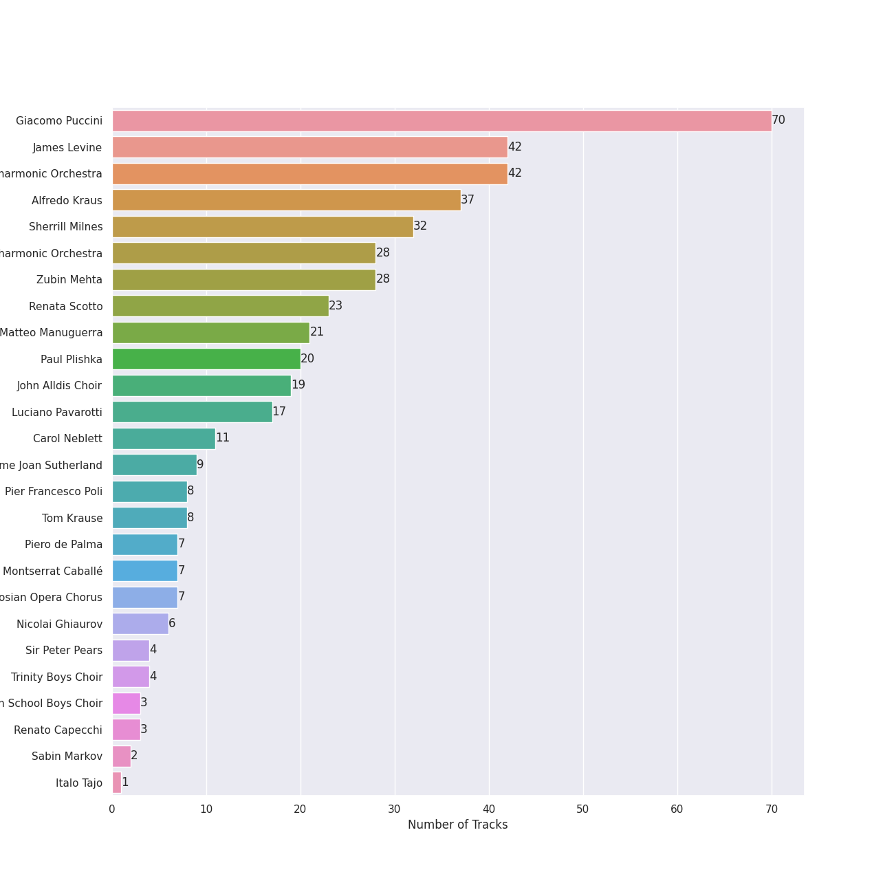
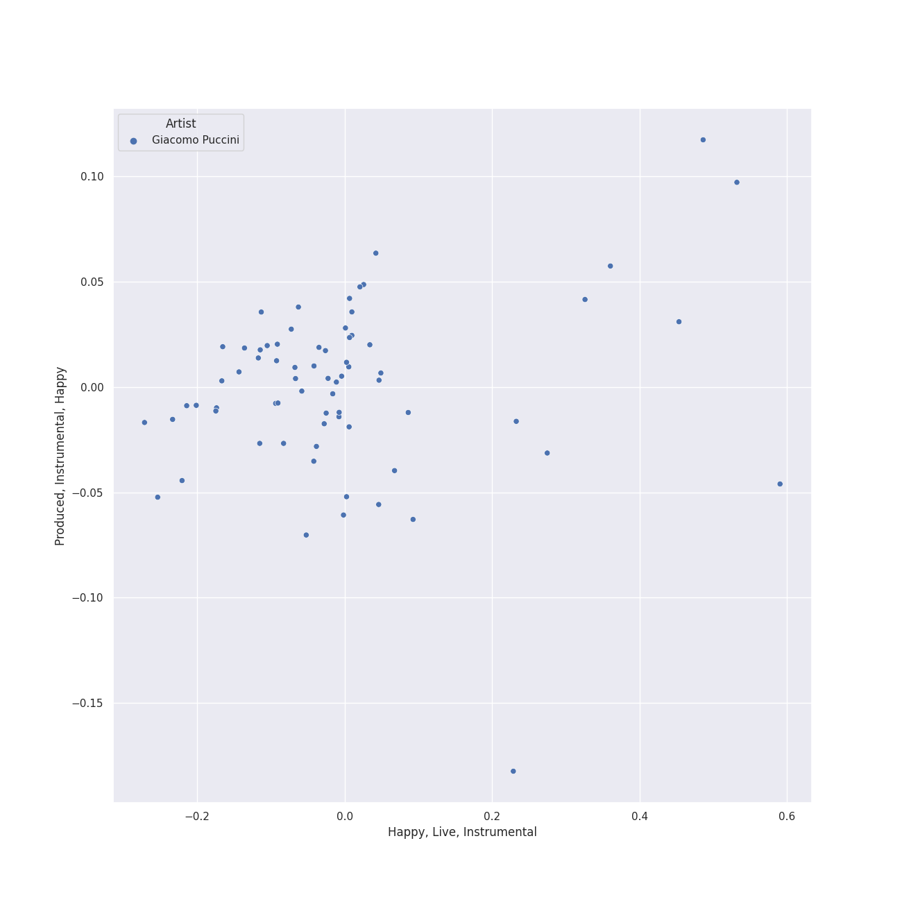
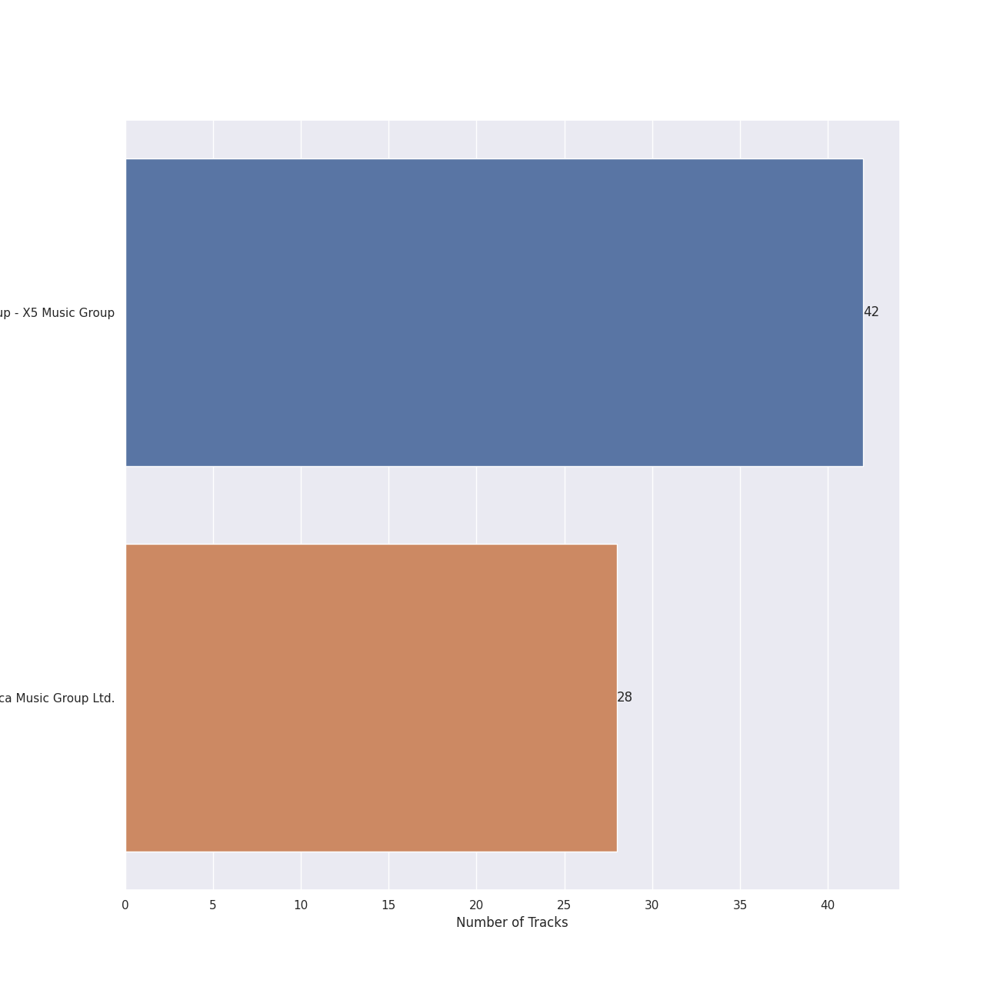

# italian opera

[70 songs](italian_opera_tracks.md)

## Top Artists

See all 26 artists

|   Number of Tracks | Art                                                                                              | Artist                                                                           | 🔗                                                           |
|-------------------:|:-------------------------------------------------------------------------------------------------|:---------------------------------------------------------------------------------|:------------------------------------------------------------|
|                 70 |  | [Giacomo Puccini](../artists/giacomo_puccini.md)                                 | [🔗](https://open.spotify.com/artist/0OzxPXyowUEQ532c9AmHUR) |
|                 42 |  | [James Levine](../artists/james_levine.md)                                       | [🔗](https://open.spotify.com/artist/4qFQgEF1rg6a9WvJM0MQIa) |
|                 42 |  | [National Philharmonic Orchestra](../artists/national_philharmonic_orchestra.md) | [🔗](https://open.spotify.com/artist/2Ek1WGW7WeyDoxsZiu0AAd) |
|                 37 |  | [Alfredo Kraus](../artists/alfredo_kraus.md)                                     | [🔗](https://open.spotify.com/artist/72G0MODfMxM5TGaoQtGbdP) |
|                 32 |  | [Sherrill Milnes](../artists/sherrill_milnes.md)                                 | [🔗](https://open.spotify.com/artist/4zTQCQMH3wRdBorYb0xGCa) |
|                 28 |  | [London Philharmonic Orchestra](../artists/london_philharmonic_orchestra.md)     | [🔗](https://open.spotify.com/artist/3PfJE6ebCbCHeuqO4BfNeA) |
|                 28 |  | [Zubin Mehta](../artists/zubin_mehta.md)                                         | [🔗](https://open.spotify.com/artist/3FEd0qHPFOgcpfw7bCXB4x) |
|                 23 |  | [Renata Scotto](../artists/renata_scotto.md)                                     | [🔗](https://open.spotify.com/artist/5W7pOtn53qBRrQo00IvHTj) |
|                 21 |  | [Matteo Manuguerra](../artists/matteo_manuguerra.md)                             | [🔗](https://open.spotify.com/artist/0lh6dQTetUL7cGQTn6Xa0Q) |
|                 20 |  | [Paul Plishka](../artists/paul_plishka.md)                                       | [🔗](https://open.spotify.com/artist/6jYWpBt9bOCoredrRjnD14) |
|                 19 |  | [John Alldis Choir](../artists/john_alldis_choir.md)                             | [🔗](https://open.spotify.com/artist/1c0LUqvKTiWVsdrIn4LTZz) |
|                 17 |  | [Luciano Pavarotti](../artists/luciano_pavarotti.md)                             | [🔗](https://open.spotify.com/artist/0Y8KmFkKOgJybpVobn1onU) |
|                 11 |  | [Carol Neblett](../artists/carol_neblett.md)                                     | [🔗](https://open.spotify.com/artist/05NUdXE48hL64rngUr5bqM) |
|                  9 |  | Dame Joan Sutherland                                                             | [🔗](https://open.spotify.com/artist/57ut70dPEUxC1dk83YY3hY) |
|                  8 |  | Pier Francesco Poli                                                              | [🔗](https://open.spotify.com/artist/3vpeRxIsXSOyTk0qagP7R8) |
|                  8 |  | Tom Krause                                                                       | [🔗](https://open.spotify.com/artist/0uRyoGMnJfoX8u1vDScXkk) |
|                  7 |  | Piero de Palma                                                                   | [🔗](https://open.spotify.com/artist/7gxxE0IbP9hFZeJVwdWCSc) |
|                  7 |  | Montserrat Caballé                                                               | [🔗](https://open.spotify.com/artist/6oGu0NZWy8gJ18wggybFqH) |
|                  7 |  | Ambrosian Opera Chorus                                                           | [🔗](https://open.spotify.com/artist/5qBpXwutwmD9MBTNXkT4JZ) |
|                  6 |  | Nicolai Ghiaurov                                                                 | [🔗](https://open.spotify.com/artist/0gHar4003EyqU81XGv1Bka) |
|                  4 |  | Sir Peter Pears                                                                  | [🔗](https://open.spotify.com/artist/2B4N612xGjNj2cAAYsP4MO) |
|                  4 |  | Trinity Boys Choir                                                               | [🔗](https://open.spotify.com/artist/23EzhBs30RXxidoFWTytAR) |
|                  3 |  | Wandsworth School Boys Choir                                                     | [🔗](https://open.spotify.com/artist/3Al8lu5X4j3QY40s4OIawp) |
|                  3 |  | Renato Capecchi                                                                  | [🔗](https://open.spotify.com/artist/16LkUonMXYtr6O6b1Cru9d) |
|                  2 |  | Sabin Markov                                                                     | [🔗](https://open.spotify.com/artist/6hXKUW4SdmIRr6f9SOXD7N) |
|                  1 |  | Italo Tajo                                                                       | [🔗](https://open.spotify.com/artist/7vqx8IiSqPIFjFBzstDQmn) |

## Top Albums

See all 2 albums

|   Number of Tracks | Art                                                                                              | Album             | 🔗                                                          |
|-------------------:|:-------------------------------------------------------------------------------------------------|:------------------|:-----------------------------------------------------------|
|                 42 |  | La Bohème         | [🔗](https://open.spotify.com/album/4FqWqqnsUS8gKpLEYnuICl) |
|                 28 |  | Puccini: Turandot | [🔗](https://open.spotify.com/album/4MgEjX6gD7TJcgr47E4RTZ) |

## Top Record Labels

See all 2 labels

|   Number of Tracks | Label                                                                                   |
|-------------------:|:----------------------------------------------------------------------------------------|
|                 42 | [Warner Music Group - X5 Music Group](../labels/warner_music_group___x5_music_group.md) |
|                 28 | [Decca Music Group Ltd.](../labels/decca_music_group_ltd_.md)                           |

## Audio Features

| 10 most Danceable tracks                                                                                                         | 10 least Danceable tracks                                                                 |
|:---------------------------------------------------------------------------------------------------------------------------------|:------------------------------------------------------------------------------------------|
| La Bohème, Act II: Caro! (Colline, Rodolfo, Schaunard, Children, Townspeople, Musetta)                                           | La Bohème, Act III: Pittore da bottega! Vipera! Rospo! (Musetta, Marcello, Mimì, Rodolfo) |
| La Bohème, Act II: Presto, sommate quello (Musetta, Mothers, Children, Rodolfo, Marcello, Schaunard, Colline, Mimì, Townspeople) | Turandot / Act 3: "So il tuo nome!"                                                       |
| La Bohème, Act I: Legna! Sigari! Bordo! (Rodolfo, Marcello, Colline, Schaunard)                                                  | La Bohème, Act I: O soave fanciulla (Rodolfo, Marcello, Mimì)                             |
| La Bohème, Act III: Act III: Mimì?!...Speravo di trovarvi qui (Marcello, Mimì)                                                   | La Bohème, Act I: Sì. Mi chiamano Mimì (Mimì, Rodolfo)                                    |
| La Bohème, Act I: Ah! Ah! Ah! Ho pagato il trimestre (Marcello, Schaunard, Colline, Rodolfo)                                     | Turandot / Act 2: Tre enigmi m'hai proposto                                               |
| Turandot / Act 2: Introduzione (Scene 2)                                                                                         | Turandot / Act 2: Ho una casa nell'Honan                                                  |
| La Bohème, Act IV: Che ora sia? (Rodolfo/Marcello, Schaunard, Colline)                                                           | Turandot / Act 1: "Gira la cote!"                                                         |
| La Bohème, Act III: Marcello. Finalmente (Rodolfo, Marcello, Mimì)                                                               | La Bohème, Act I: Che gelida manina (Rodolfo)                                             |
| La Bohème, Act I: Questo Mar Rosso mi ammollisce (Marcello, Rodolfo)                                                             | Turandot / Act 3: Introduzione - Così comanda Turandot                                    |
| La Bohème, Act II: Oh! Musetta! (Schaunard, Colline, Rodolfo, Marcello, Shopwomen, Alcindoro, Musetta)                           | Turandot / Act 1: O giovinetto! Grazia, grazia!                                           |

| 10 most Energetic tracks                                                                                                         | 10 least Energetic tracks                                                                                                                         |
|:---------------------------------------------------------------------------------------------------------------------------------|:--------------------------------------------------------------------------------------------------------------------------------------------------|
| La Bohème, Act II: Presto, sommate quello (Musetta, Mothers, Children, Rodolfo, Marcello, Schaunard, Colline, Mimì, Townspeople) | Turandot / Act 1: "Signore, ascolta"                                                                                                              |
| Turandot / Act 1: Non piangere Liù                                                                                               | La Bohème, Act I: Sì. Mi chiamano Mimì (Mimì, Rodolfo)                                                                                            |
| Turandot / Act 3: "Diecimile anni al nostro Imperatore...Padre augusto"                                                          | La Bohème, Act III: Addio. Che! Vai? (Mimì, Rodolfo)                                                                                              |
| La Bohème, Act IV: Gavotta. Minuetto (Colline, Marcello, Rodolfo, Schaunard)                                                     | La Bohème, Act IV: Sono andati?                                                                                                                   |
| Turandot / Act 3: "Principessa di morte!"                                                                                        | La Bohème, Act III: Pittore da bottega! Vipera! Rospo! (Musetta, Marcello, Mimì, Rodolfo)                                                         |
| Turandot / Act 1: Figlio, che fai?                                                                                               | La Bohème, Act I: Ehi! Rodolfo! (Schaunard, Colline, Marcello, Rodolfo)                                                                           |
| Turandot / Act 3: "So il tuo nome!"                                                                                              | La Bohème, Act III: Ohé, là, le guardie! (Sweepers, Customs Officer, Voices from the tavern, Voice of Musetta, Milkmaids, Peasant Women, Carters) |
| La Bohème, Act III: Che! Mimì! Tu qui? (Rodolfo, Marcello, Mimì)                                                                 | La Bohème, Act I: Non sono in vena. Chi è là! (Rodolfo, Mimi)                                                                                     |
| Turandot / Act 3: Nessun dorma!                                                                                                  | La Bohème, Act IV: Che avvien? (Schaunard, Mimì, Rodolfo, Musetta, Marcello)                                                                      |
| La Bohème, Act I: Legna! Sigari! Bordo! (Rodolfo, Marcello, Colline, Schaunard)                                                  | La Bohème, Act III: Sa dirmi, scusi (Mimì, Sergeant, Customs Officer)                                                                             |

| 10 most Speechy tracks                                                                                                           | 10 least Speechy tracks                                                                                                                           |
|:---------------------------------------------------------------------------------------------------------------------------------|:--------------------------------------------------------------------------------------------------------------------------------------------------|
| La Bohème, Act II: Oh! Musetta! (Schaunard, Colline, Rodolfo, Marcello, Shopwomen, Alcindoro, Musetta)                           | Turandot / Act 3: "So il tuo nome!"                                                                                                               |
| La Bohème, Act IV: Gavotta. Minuetto (Colline, Marcello, Rodolfo, Schaunard)                                                     | Turandot / Act 3: "Diecimile anni al nostro Imperatore...Padre augusto"                                                                           |
| La Bohème, Act I: Ah! Ah! Ah! Ho pagato il trimestre (Marcello, Schaunard, Colline, Rodolfo)                                     | Turandot / Act 2: Tre enigmi m'hai proposto                                                                                                       |
| La Bohème, Act II: Presto, sommate quello (Musetta, Mothers, Children, Rodolfo, Marcello, Schaunard, Colline, Mimì, Townspeople) | La Bohème, Act IV: Come va? (Colline, Rodolfo, Marcello)                                                                                          |
| La Bohème, Act II: Caro! (Colline, Rodolfo, Schaunard, Children, Townspeople, Musetta)                                           | Turandot / Act 3: Introduzione - Così comanda Turandot                                                                                            |
| La Bohème, Act I: Io resto per terminar l'articolo (Rodolfo, Marcello, Colline, Schaunard)                                       | La Bohème, Act III: Ohé, là, le guardie! (Sweepers, Customs Officer, Voices from the tavern, Voice of Musetta, Milkmaids, Peasant Women, Carters) |
| Turandot / Act 2: Straniero, ascolta                                                                                             | La Bohème, Act III: Sa dirmi, scusi (Mimì, Sergeant, Customs Officer)                                                                             |
| La Bohème, Act I: Ho ghiacciate le dita (Marcello, Rodolfo, Colline)                                                             | La Bohème, Act III: Che! Mimì! Tu qui? (Rodolfo, Marcello, Mimì)                                                                                  |
| La Bohème, Act III: Act III: Mimì?!...Speravo di trovarvi qui (Marcello, Mimì)                                                   | Turandot / Act 2: "Gravi, enormi ed impotenti"                                                                                                    |
| La Bohème, Act I: Questo Mar Rosso mi ammollisce (Marcello, Rodolfo)                                                             | Turandot / Act 2: Introduzione (Scene 2)                                                                                                          |

| 10 most Acoustic tracks                                                                           | 10 least Acoustic tracks                                                                                                                          |
|:--------------------------------------------------------------------------------------------------|:--------------------------------------------------------------------------------------------------------------------------------------------------|
| La Bohème, Act I: Legna! Sigari! Bordo! (Rodolfo, Marcello, Colline, Schaunard)                   | Turandot / Act 3: "Diecimile anni al nostro Imperatore...Padre augusto"                                                                           |
| Turandot / Act 3: "Che è mai di me?"                                                              | Turandot / Act 1: O giovinetto! Grazia, grazia!                                                                                                   |
| La Bohème, Act I: Or vi dirò: quest'oro (Schaunard, Rodolfo, Colline, Marcello)                   | Turandot / Act 3: Introduzione - Così comanda Turandot                                                                                            |
| Turandot / Act 1: "Signore, ascolta"                                                              | Turandot / Act 3: "So il tuo nome!"                                                                                                               |
| La Bohème, Act II: Caro! (Colline, Rodolfo, Schaunard, Children, Townspeople, Musetta)            | La Bohème, Act III: Ohé, là, le guardie! (Sweepers, Customs Officer, Voices from the tavern, Voice of Musetta, Milkmaids, Peasant Women, Carters) |
| La Bohème, Act III: Mimi è una civetta (Rodolfo, Marcello)                                        | La Bohème, Act I: Non sono in vena. Chi è là! (Rodolfo, Mimi)                                                                                     |
| Turandot / Act 2: Ho una casa nell'Honan                                                          | Turandot / Act 2: Tre enigmi m'hai proposto                                                                                                       |
| La Bohème, Act I: Sì. Mi chiamano Mimì (Mimì, Rodolfo)                                            | La Bohème, Act III: Sa dirmi, scusi (Mimì, Sergeant, Customs Officer)                                                                             |
| La Bohème, Act II: Chi guardi? (Rodolfo, Colline, Mimì, Schaunard, Marcello, Students, Parpignol) | Turandot / Act 2: "Gravi, enormi ed impotenti"                                                                                                    |
| La Bohème, Act I: Si poù? Chi è là? (Benoît, Marcello, Schaunard, Colline, Rodolfo)               | Turandot / Act 2: Introduzione (Scene 2)                                                                                                          |

| 10 most Instrumental tracks                                                                                                      | 10 least Instrumental tracks                                                               |
|:---------------------------------------------------------------------------------------------------------------------------------|:-------------------------------------------------------------------------------------------|
| La Bohème, Act III: Che! Mimì! Tu qui? (Rodolfo, Marcello, Mimì)                                                                 | Turandot / Act 3: "Del primo pianto...Più grande vittoria non voler"                       |
| Turandot / Act 2: "Gravi, enormi ed impotenti"                                                                                   | La Bohème, Act IV: Che avvien? (Schaunard, Mimì, Rodolfo, Musetta, Marcello)               |
| La Bohème, Act I: Legna! Sigari! Bordo! (Rodolfo, Marcello, Colline, Schaunard)                                                  | Turandot / Act 2: "In questa reggia"                                                       |
| La Bohème, Act II: Caro! (Colline, Rodolfo, Schaunard, Children, Townspeople, Musetta)                                           | La Bohème, Act III: Pittore da bottega! Vipera! Rospo! (Musetta, Marcello, Mimì, Rodolfo)  |
| La Bohème, Act II: Aranci, datteri! (Hawkers, Townspeople, Schaunard, Colline, Rodolfo, Mimì, Marcello)                          | Turandot / Act 2: Straniero, ascolta                                                       |
| Turandot / Act 2: Introduzione (Scene 2)                                                                                         | La Bohème, Act I: Io resto per terminar l'articolo (Rodolfo, Marcello, Colline, Schaunard) |
| La Bohème, Act II: Presto, sommate quello (Musetta, Mothers, Children, Rodolfo, Marcello, Schaunard, Colline, Mimì, Townspeople) | Turandot / Act 2: "Un giuramento atroce mi costringe"                                      |
| Turandot / Act 3: Liù! Liù! Sorgi! Sorgi!                                                                                        | La Bohème, Act I: Non sono in vena. Chi è là! (Rodolfo, Mimi)                              |
| La Bohème, Act IV: Vecchia zimarra (Colline, Schaunard)                                                                          | La Bohème, Act III: Sa dirmi, scusi (Mimì, Sergeant, Customs Officer)                      |
| Turandot / Act 3: Introduzione - Così comanda Turandot                                                                           | La Bohème, Act I: Ehi! Rodolfo! (Schaunard, Colline, Marcello, Rodolfo)                    |

| 10 most Live tracks                                                                                          | 10 least Live tracks                                                                                                             |
|:-------------------------------------------------------------------------------------------------------------|:---------------------------------------------------------------------------------------------------------------------------------|
| La Bohème, Act II: Viva Parpignol! (Children, Marcello, Mimì, Schaunard, Colline, Rodolfo)                   | La Bohème, Act IV: Come va? (Colline, Rodolfo, Marcello)                                                                         |
| Turandot / Act 2: Introduzione (Scene 2)                                                                     | La Bohème, Act III: Sa dirmi, scusi (Mimì, Sergeant, Customs Officer)                                                            |
| La Bohème, Act II: Questa è Mimì (Rodolfo, Marcello, Colline, Schaunard, Parpignol, Children, Mothers, Mimì) | La Bohème, Act I: Sì. Mi chiamano Mimì (Mimì, Rodolfo)                                                                           |
| La Bohème, Act I: Or vi dirò: quest'oro (Schaunard, Rodolfo, Colline, Marcello)                              | Turandot / Act 2: Popolo di Pekino                                                                                               |
| Turandot / Act 3: "Del primo pianto...Più grande vittoria non voler"                                         | Turandot / Act 2: "In questa reggia"                                                                                             |
| La Bohème, Act II: Caro! (Colline, Rodolfo, Schaunard, Children, Townspeople, Musetta)                       | Turandot / Act 1: "Signore, ascolta"                                                                                             |
| Turandot / Act 1: Figlio, che fai?                                                                           | La Bohème, Act I: Che gelida manina (Rodolfo)                                                                                    |
| La Bohème, Act IV: Sono andati?                                                                              | Turandot / Act 1: Non piangere Liù                                                                                               |
| La Bohème, Act IV: Gavotta. Minuetto (Colline, Marcello, Rodolfo, Schaunard)                                 | La Bohème, Act II: Presto, sommate quello (Musetta, Mothers, Children, Rodolfo, Marcello, Schaunard, Colline, Mimì, Townspeople) |
| La Bohème, Act I: Questo Mar Rosso mi ammollisce (Marcello, Rodolfo)                                         | La Bohème, Act III: Pittore da bottega! Vipera! Rospo! (Musetta, Marcello, Mimì, Rodolfo)                                        |

| 10 most Happy tracks                                                                                                             | 10 least Happy tracks                                                                     |
|:---------------------------------------------------------------------------------------------------------------------------------|:------------------------------------------------------------------------------------------|
| La Bohème, Act I: Legna! Sigari! Bordo! (Rodolfo, Marcello, Colline, Schaunard)                                                  | La Bohème, Act III: Sa dirmi, scusi (Mimì, Sergeant, Customs Officer)                     |
| Turandot / Act 2: Introduzione (Scene 2)                                                                                         | La Bohème, Act I: Sì. Mi chiamano Mimì (Mimì, Rodolfo)                                    |
| La Bohème, Act II: Caro! (Colline, Rodolfo, Schaunard, Children, Townspeople, Musetta)                                           | La Bohème, Act III: Pittore da bottega! Vipera! Rospo! (Musetta, Marcello, Mimì, Rodolfo) |
| La Bohème, Act I: Ah! Ah! Ah! Ho pagato il trimestre (Marcello, Schaunard, Colline, Rodolfo)                                     | La Bohème, Act I: O soave fanciulla (Rodolfo, Marcello, Mimì)                             |
| La Bohème, Act III: Marcello. Finalmente (Rodolfo, Marcello, Mimì)                                                               | La Bohème, Act III: Addio. Che! Vai? (Mimì, Rodolfo)                                      |
| La Bohème, Act IV: Che ora sia? (Rodolfo/Marcello, Schaunard, Colline)                                                           | Turandot / Act 1: O giovinetto! Grazia, grazia!                                           |
| La Bohème, Act II: Oh! Musetta! (Schaunard, Colline, Rodolfo, Marcello, Shopwomen, Alcindoro, Musetta)                           | Turandot / Act 2: Straniero, ascolta                                                      |
| La Bohème, Act II: Chi guardi? (Rodolfo, Colline, Mimì, Schaunard, Marcello, Students, Parpignol)                                | Turandot / Act 2: "Un giuramento atroce mi costringe"                                     |
| La Bohème, Act II: Presto, sommate quello (Musetta, Mothers, Children, Rodolfo, Marcello, Schaunard, Colline, Mimì, Townspeople) | Turandot / Act 3: "So il tuo nome!"                                                       |
| La Bohème, Act II: Aranci, datteri! (Hawkers, Townspeople, Schaunard, Colline, Rodolfo, Mimì, Marcello)                          | La Bohème, Act IV: Che avvien? (Schaunard, Mimì, Rodolfo, Musetta, Marcello)              |
