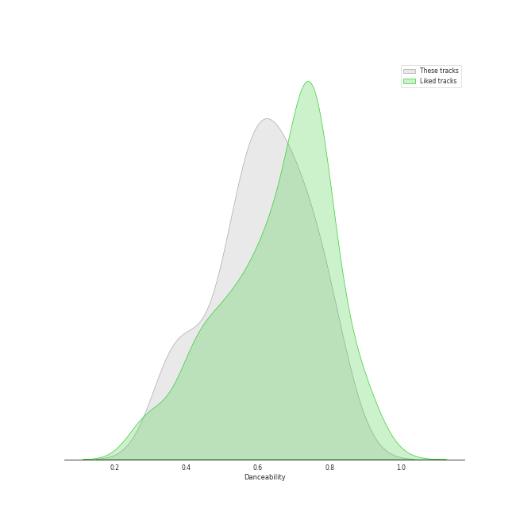
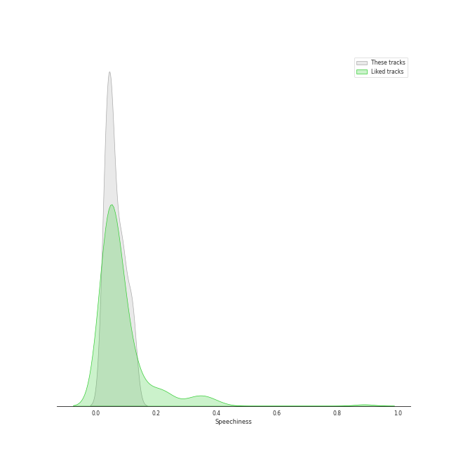
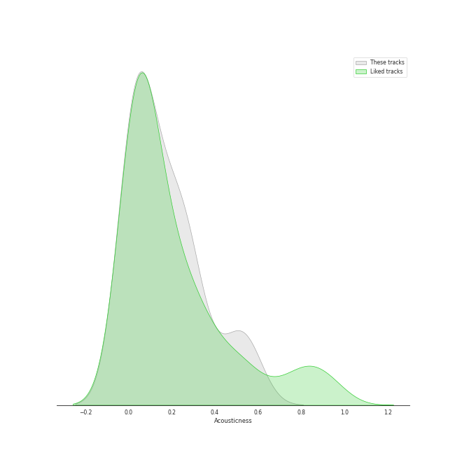
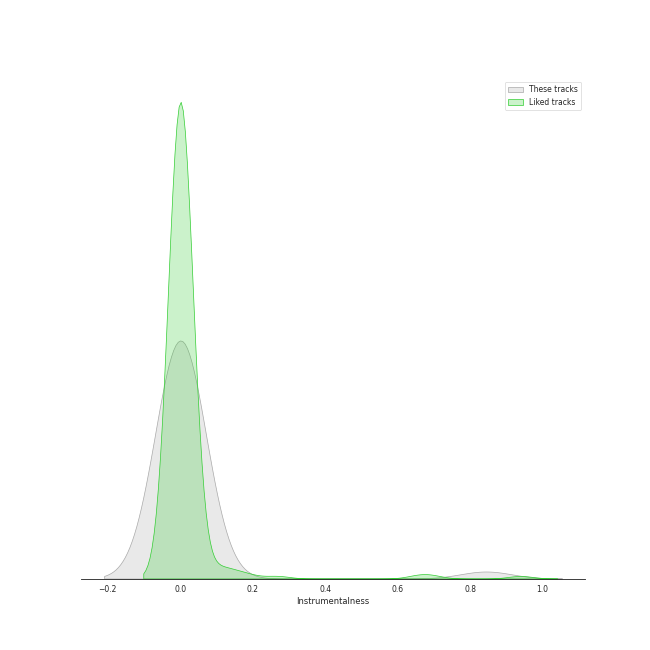
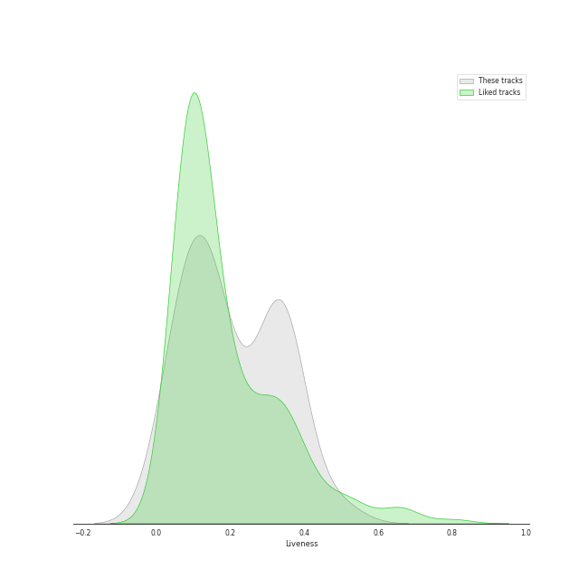
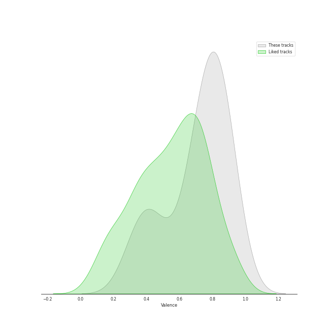
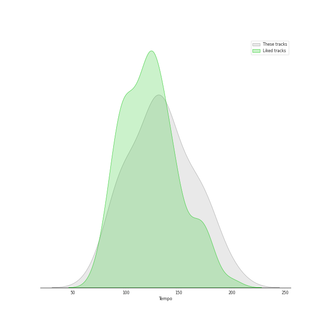

# Track Features for j-pop

## Danceability

| ​ | 10 most Danceable tracks | ​​ | 10 least Danceable tracks |
|:---|:---|:---|:---|
|  | manimani (0.838) |  | Cry Baby (0.346) |
|  | 海のまにまに (0.818) |  | ビリミリオン (0.364) |
|  | Loving You (0.785) |  | ベテルギウス (0.367) |
|  | Make you happy (0.78) |  | Wherever you are (0.379) |
|  | Adventure (0.776) |  | We Are (0.41) |
|  | Habit (0.749) |  | ドライフラワー (0.463) |
|  | モノトーン (0.738) |  | 砂の惑星 ( + 初音ミク ) (0.507) |
|  | 脳裏上のクラッカー (0.729) |  | On the Stage (0.524) |
|  | 群青 (0.725) |  | Pretender (0.538) |
|  | セブンティーン (0.71) |  | I Love... (0.546) |

## Energy

| ​ | 10 most Energetic tracks | ​​ | 10 least Energetic tracks |
|:---|:---|:---|:---|
|  | チョコレイト・ディスコ (0.99) |  | 海のまにまに (0.456) |
|  | Boys & Girls (0.985) |  | 恋人じゃなくなった日 (0.516) |
|  | UNDEAD (0.984) |  | PINK BLOOD (0.534) |
|  | だいじょばない (0.982) |  | manimani (0.559) |
|  | 恋をすると馬鹿を見る(Team B) (0.955) |  | ドライフラワー (0.603) |
|  | 砂の惑星 ( + 初音ミク ) (0.94) |  | ビリミリオン (0.628) |
|  | 恋するフォーチュンクッキー (0.936) |  | I Love... (0.663) |
|  | アイドル (0.935) |  | ベテルギウス (0.671) |
|  | On the Stage (0.933) |  | Wherever you are (0.69) |
|  | Loving You (0.932) |  | W / X / Y (0.775) |

## Speechiness

| ​ | 10 most Speechy tracks | ​​ | 10 least Speechy tracks |
|:---|:---|:---|:---|
|  | Habit (0.126) |  | Pretender (0.0275) |
|  | Make you happy (0.122) |  | ドライフラワー (0.0276) |
|  | Cry Baby (0.12) |  | 夜に駆ける (0.03) |
|  | 怪物 (0.118) |  | ビリミリオン (0.0319) |
|  | 白日 (0.116) |  | チョコレイト・ディスコ (0.0351) |
|  | 砂の惑星 ( + 初音ミク ) (0.0927) |  | Adventure (0.0354) |
|  | アイドル (0.0926) |  | Loving You (0.0354) |
|  | Koi (0.0911) |  | 恋人じゃなくなった日 (0.0355) |
|  | Seventeen (0.091) |  | モノトーン (0.0389) |
|  | PINK BLOOD (0.0893) |  | 海のまにまに (0.0448) |

## Acousticness

| ​ | 10 most Acoustic tracks | ​​ | 10 least Acoustic tracks |
|:---|:---|:---|:---|
|  | 白日 (0.562) |  | Boys & Girls (0.000388) |
|  | 恋人じゃなくなった日 (0.549) |  | Koi (0.00081) |
|  | 恋をすると馬鹿を見る(Team B) (0.507) |  | 夜に駆ける (0.00299) |
|  | ドライフラワー (0.495) |  | I Love... (0.00938) |
|  | 海のまにまに (0.385) |  | Cry Baby (0.0103) |
|  | 群青 (0.305) |  | On the Stage (0.0133) |
|  | manimani (0.281) |  | UNDEAD (0.019) |
|  | PINK BLOOD (0.277) |  | 砂の惑星 ( + 初音ミク ) (0.0252) |
|  | モノトーン (0.26) |  | Wherever you are (0.0286) |
|  | 恋するフォーチュンクッキー (0.259) |  | だいじょばない (0.0386) |

## Instrumentalness

| ​ | 10 most Instrumental tracks | ​​ | 10 least Instrumental tracks |
|:---|:---|:---|:---|
|  | だいじょばない (0.844) |  | Wherever you are (0.0) |
|  | Boys & Girls (0.0145) |  | Pretender (0.0) |
|  | チョコレイト・ディスコ (0.0079) |  | 白日 (0.0) |
|  | 怪物 (6.57e-05) |  | Adventure (0.0) |
|  | PINK BLOOD (3.57e-05) |  | 群青 (0.0) |
|  | 海のまにまに (3.49e-05) |  | 恋をすると馬鹿を見る(Team B) (0.0) |
|  | モノトーン (3.29e-05) |  | I Love... (0.0) |
|  | UNDEAD (2.8e-05) |  | Habit (0.0) |
|  | Make you happy (2.8e-05) |  | Seventeen (0.0) |
|  | 脳裏上のクラッカー (1.93e-05) |  | 砂の惑星 ( + 初音ミク ) (0.0) |

## Liveness

| ​ | 10 most Live tracks | ​​ | 10 least Live tracks |
|:---|:---|:---|:---|
|  | ベテルギウス (0.494) |  | セブンティーン (0.0183) |
|  | 脳裏上のクラッカー (0.384) |  | Seventeen (0.0189) |
|  | アイドル (0.367) |  | チョコレイト・ディスコ (0.0519) |
|  | Loving You (0.362) |  | モノトーン (0.057) |
|  | Cry Baby (0.358) |  | 海のまにまに (0.0655) |
|  | 夜に駆ける (0.337) |  | manimani (0.0694) |
|  | Wherever you are (0.335) |  | 恋人じゃなくなった日 (0.0825) |
|  | W / X / Y (0.33) |  | ビリミリオン (0.0931) |
|  | UNDEAD (0.328) |  | Make you happy (0.105) |
|  | 白日 (0.322) |  | On the Stage (0.109) |

## Valence

| ​ | 10 most Happy tracks | ​​ | 10 least Happy tracks |
|:---|:---|:---|:---|
|  | チョコレイト・ディスコ (0.963) |  | Wherever you are (0.288) |
|  | 恋するフォーチュンクッキー (0.924) |  | We Are (0.333) |
|  | 砂の惑星 ( + 初音ミク ) (0.917) |  | Pretender (0.369) |
|  | Habit (0.912) |  | Boys & Girls (0.393) |
|  | Koi (0.878) |  | I Love... (0.407) |
|  | だいじょばない (0.868) |  | Cry Baby (0.434) |
|  | manimani (0.861) |  | ドライフラワー (0.477) |
|  | 恋をすると馬鹿を見る(Team B) (0.839) |  | 恋人じゃなくなった日 (0.487) |
|  | アイドル (0.836) |  | ビリミリオン (0.612) |
|  | Seventeen (0.834) |  | PINK BLOOD (0.617) |

## Tempo

| ​ | 10 most Fast tracks | ​​ | 10 least Fast tracks |
|:---|:---|:---|:---|
|  | Cry Baby (199.934) |  | 恋人じゃなくなった日 (74.996) |
|  | On the Stage (182.025) |  | Pretender (91.972) |
|  | ベテルギウス (179.833) |  | 白日 (93.029) |
|  | Wherever you are (173.716) |  | ビリミリオン (93.792) |
|  | I Love... (171.698) |  | 砂の惑星 ( + 初音ミク ) (94.874) |
|  | 怪物 (169.935) |  | 海のまにまに (97.947) |
|  | アイドル (166.008) |  | manimani (98.011) |
|  | Make you happy (160.087) |  | PINK BLOOD (100.0) |
|  | Koi (158.115) |  | W / X / Y (106.382) |
|  | ドライフラワー (148.089) |  | Habit (117.968) |
