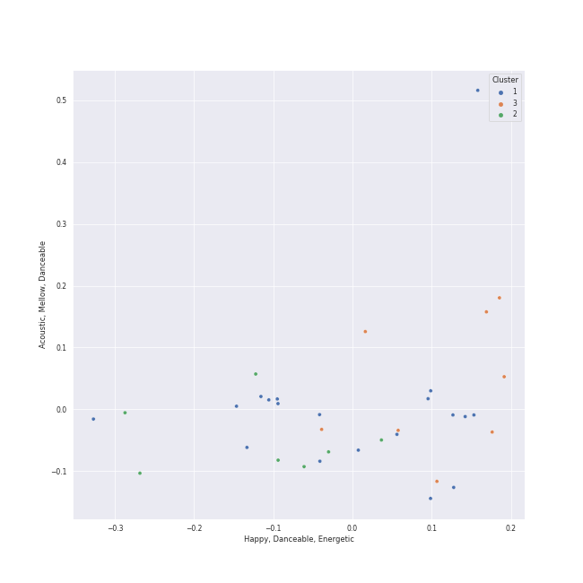

# Clusters in j-pop

## Cluster #1

19 tracks

| Art | Track | Album | Artists | Label | Rank | 💚 | 🔗 |
|:---|:---|:---|:---|:---|---:|:---|:---|
|  | 怪物 | 怪物 | [YOASOBI](../../../../artists/yoasobi/overview.md) | [YOASOBI](../../../../labels/yoasobi) | 684 | 💚 | [🔗](https://open.spotify.com/track/06XQvnJb53SUYmlWIhUXUi) |
|  | Seventeen | E-SIDE 3 | [YOASOBI](../../../../artists/yoasobi/overview.md) | [YOASOBI](../../../../labels/yoasobi) | nan | | [🔗](https://open.spotify.com/track/2yAB3u40MOFRNuUzdl0but) |
|  | Loving You | E-SIDE 3 | [YOASOBI](../../../../artists/yoasobi/overview.md) | [YOASOBI](../../../../labels/yoasobi) | nan | | [🔗](https://open.spotify.com/track/7nN7TkxDGH8DeXs2Vy67nv) |
|  | 夜に駆ける | THE BOOK | [YOASOBI](../../../../artists/yoasobi/overview.md) | [YOASOBI](../../../../labels/yoasobi) | nan | | [🔗](https://open.spotify.com/track/6MCjmGYlw6mQVWRFVgBRvB) |
|  | Make you happy | Make you happy | NiziU | [Sony Music Labels Inc.](../../../../labels/sony_music_labels_inc_) | nan | | [🔗](https://open.spotify.com/track/1LnJVIG1BaHTRznuOgR0yc) |
|  | 恋するフォーチュンクッキー | 次の足跡 Type A <初回限定盤> | AKB48 | KING RECORDS | nan | | [🔗](https://open.spotify.com/track/37yHxMij3cpN8SdO915LUI) |
|  | Habit | Habit | SEKAI NO OWARI | [Universal Music LLC](../../../../labels/universal_music_llc) | nan | | [🔗](https://open.spotify.com/track/2uMNMcjjUz8oNIxjIu20qE) |
|  | 脳裏上のクラッカー | 潜潜話 | ZUTOMAYO | [Universal Music LLC](../../../../labels/universal_music_llc) | nan | 💚 | [🔗](https://open.spotify.com/track/3FRU8JI3EK9G7hXSP3P4R8) |
|  | 砂の惑星 ( + 初音ミク ) | BOOTLEG | Kenshi Yonezu, Hatsune Miku | [Sony Music Labels Inc.](../../../../labels/sony_music_labels_inc_) | nan | | [🔗](https://open.spotify.com/track/3aYz5EBaRTWLpsfyUIsQyX) |
|  | Koi | POP VIRUS | Gen Hoshino | Speedstar | nan | 💚 | [🔗](https://open.spotify.com/track/4nmjL1mUKOAfAbo9QG9tSE) |
## Cluster #2

7 tracks

| Art | Track | Album | Artists | Label | Rank | 💚 | 🔗 |
|:---|:---|:---|:---|:---|---:|:---|:---|
|  | The Brave | E-SIDE 3 | [YOASOBI](../../../../artists/yoasobi/overview.md) | [YOASOBI](../../../../labels/yoasobi) | nan | | [🔗](https://open.spotify.com/track/4idatWI87uECptpg5EYMPp) |
|  | Boys & Girls | A BEST | Ayumi Hamasaki | [avex trax](../../../../labels/avex_trax) | nan | | [🔗](https://open.spotify.com/track/0QcVKhVp9iHGZ1pj04yTbO) |
|  | Wherever you are | Niche Syndrome | ONE OK ROCK | Aer-born | nan | | [🔗](https://open.spotify.com/track/0YAMQSmHk6BSUGTYpaoqTJ) |
|  | We Are | Ambitions | ONE OK ROCK | [Fueled By Ramen](../../../../labels/fueled_by_ramen) | nan | 💚 | [🔗](https://open.spotify.com/track/57sk9X1fPLXRfkw74XNrmK) |
|  | Pretender | Traveler | OFFICIAL HIGE DANDISM | PONY CANYON INC. | nan | | [🔗](https://open.spotify.com/track/15HNdxGKNCIO9pgaY4n7FU) |
|  | I Love... | Editorial | OFFICIAL HIGE DANDISM | IRORI Records | nan | | [🔗](https://open.spotify.com/track/2hwcYq85TVuj6GhBBTuWdg) |
|  | Cry Baby | Editorial | OFFICIAL HIGE DANDISM | IRORI Records | nan | | [🔗](https://open.spotify.com/track/7nF9c1EmRF3BNAtKDCwUAK) |
## Cluster #3

8 tracks

| Art | Track | Album | Artists | Label | Rank | 💚 | 🔗 |
|:---|:---|:---|:---|:---|---:|:---|:---|
|  | manimani | E-SIDE 3 | [YOASOBI](../../../../artists/yoasobi/overview.md) | [YOASOBI](../../../../labels/yoasobi) | nan | | [🔗](https://open.spotify.com/track/0JXxrmM7bHmpwHczGTjCUm) |
|  | 海のまにまに | 海のまにまに | [YOASOBI](../../../../artists/yoasobi/overview.md) | [YOASOBI](../../../../labels/yoasobi) | 430 | 💚 | [🔗](https://open.spotify.com/track/0loZ1KfQSLJxYR0Y7dImKN) |
|  | 群青 | THE BOOK | [YOASOBI](../../../../artists/yoasobi/overview.md) | [YOASOBI](../../../../labels/yoasobi) | 582 | | [🔗](https://open.spotify.com/track/1zd35Y44Blc1CwwVbW3Qnk) |
|  | 白日 | CEREMONY | King Gnu | [Sony Music Labels Inc.](../../../../labels/sony_music_labels_inc_) | nan | | [🔗](https://open.spotify.com/track/172fMG26G2OoEzzg0wn26r) |
|  | PINK BLOOD | PINK BLOOD | Hikaru Utada | [Sony Music Labels Inc.](../../../../labels/sony_music_labels_inc_) | nan | | [🔗](https://open.spotify.com/track/39lq5gU4lPc0rYVaRo0stH) |
|  | ドライフラワー | 壱 | Yuuri | [Sony Music Labels Inc.](../../../../labels/sony_music_labels_inc_) | 550 | 💚 | [🔗](https://open.spotify.com/track/4kPlQKwtPrnqLgrmmKFSlA) |
|  | ビリミリオン | 弐 | Yuuri | [Sony Music Labels Inc.](../../../../labels/sony_music_labels_inc_) | nan | 💚 | [🔗](https://open.spotify.com/track/7M0dIdZWN1FDcveRdoOzbZ) |
|  | 恋人じゃなくなった日 | 恋人じゃなくなった日 | Yuuri | [Sony Music Labels Inc.](../../../../labels/sony_music_labels_inc_) | nan | | [🔗](https://open.spotify.com/track/7fQYRdNX6y8BpfmHvWVPm8) |