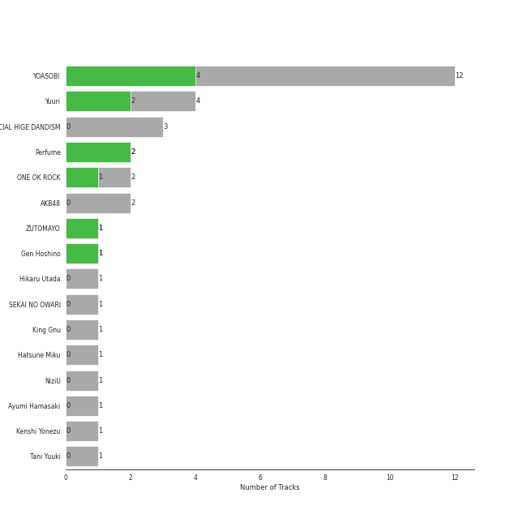
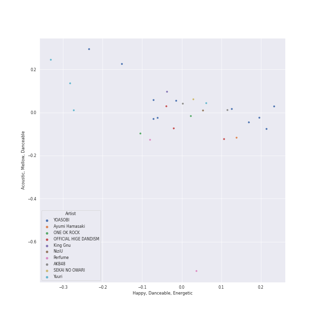
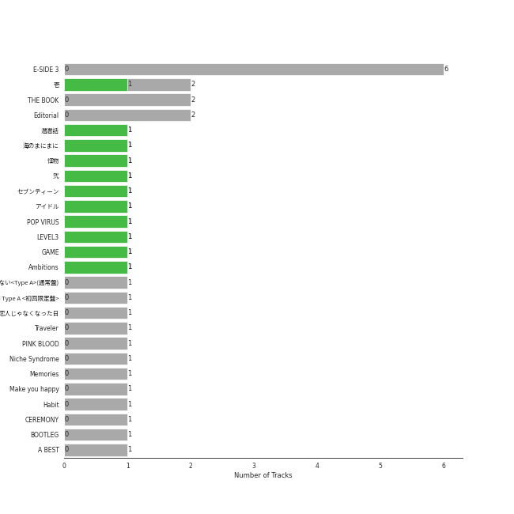
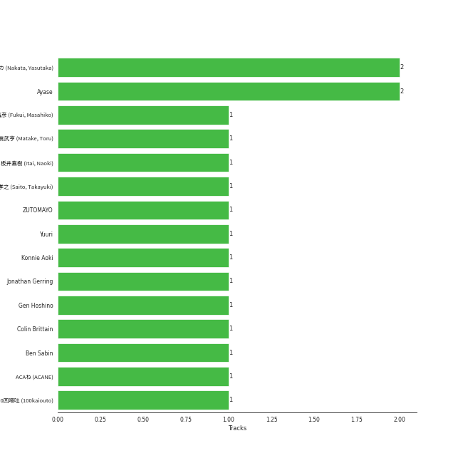
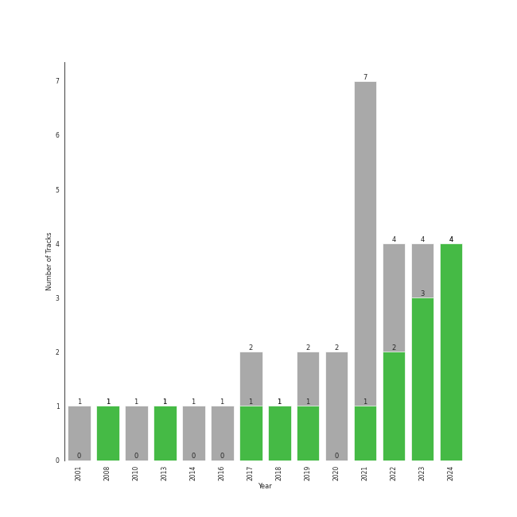

# j-pop

32 songs

[See Track Features](audio_features.md)

[See Clusters](clusters/overview.md)

## Top Artists

| Art | Tracks | 💚 | Artist | 🔗 |
|:---|---:|---:|:---|:---|
|  | 10 | 8 | [YOASOBI](../../artists/yoasobi/overview.md) | [🔗](https://open.spotify.com/artist/64tJ2EAv1R6UaZqc4iOCyj) |
|  | 4 | 2 | Yuuri | [🔗](https://open.spotify.com/artist/0ixzjrK1wkN2zWBXt3VW3W) |
|  | 2 | 2 | Perfume | [🔗](https://open.spotify.com/artist/2XMxWKPKCxoLkSdpCViCnr) |
|  | 2 | 1 | ONE OK ROCK | [🔗](https://open.spotify.com/artist/7k73EtZwoPs516ZxE72KsO) |
|  | 1 | 1 | ZUTOMAYO | [🔗](https://open.spotify.com/artist/38WbKH6oKAZskBhqDFA8Uj) |
|  | 1 | 1 | Gen Hoshino | [🔗](https://open.spotify.com/artist/1S2S00lgLYLGHWA44qGEUs) |
|  | 3 | 0 | OFFICIAL HIGE DANDISM | [🔗](https://open.spotify.com/artist/5Vo1hnCRmCM6M4thZCInCj) |
|  | 2 | 0 | AKB48 | [🔗](https://open.spotify.com/artist/01wau5CL3Z1vfJJWkzBkqg) |
|  | 1 | 0 | Hikaru Utada | [🔗](https://open.spotify.com/artist/7lbSsjYACZHn1MSDXPxNF2) |
|  | 1 | 0 | SEKAI NO OWARI | [🔗](https://open.spotify.com/artist/7HwzlRPa9Ad0I8rK0FPzzK) |

See all 16 artists

| Art | Tracks | 💚 | Artist | 🔗 |
|:---|---:|---:|:---|:---|
|  | 1 | 0 | King Gnu | [🔗](https://open.spotify.com/artist/6wxfx1yhyqjCPYwwxJktR2) |
|  | 1 | 0 | Hatsune Miku | [🔗](https://open.spotify.com/artist/6pNgnvzBa6Bthsv8SrZJYl) |
|  | 1 | 0 | NiziU | [🔗](https://open.spotify.com/artist/3z8diLlUCkN1j9N9ZdnfBJ) |
|  | 1 | 0 | Ayumi Hamasaki | [🔗](https://open.spotify.com/artist/3Mvc8kRgr8LRYYgvFmlZqn) |
|  | 1 | 0 | Kenshi Yonezu | [🔗](https://open.spotify.com/artist/1snhtMLeb2DYoMOcVbb8iB) |
|  | 1 | 0 | Tani Yuuki | [🔗](https://open.spotify.com/artist/0B1ce3uNrzkdm76NXI4mhX) |

## Most and least listened tracks
| ​ | Most listened tracks | Rank | ​​ | Least listened tracks | Rank |
|:---|:---|---:|:---|:---|---:|
|  | [アイドル](../../artists/yoasobi/overview.md) | 296 |  | [manimani](../../artists/yoasobi/overview.md) | nan |
|  | [海のまにまに](../../artists/yoasobi/overview.md) | 445 |  | Boys & Girls | nan |
|  | [Seventeen](../../artists/yoasobi/overview.md) | 504 |  | Wherever you are | nan |
|  | ドライフラワー | 573 |  | Pretender | nan |
|  | [群青](../../artists/yoasobi/overview.md) | 610 |  | 白日 | nan |
|  | [セブンティーン](../../artists/yoasobi/overview.md) | 641 |  | [Adventure](../../artists/yoasobi/overview.md) | nan |
|  | [怪物](../../artists/yoasobi/overview.md) | 710 |  | Make you happy | nan |
|  | [Loving You](../../artists/yoasobi/overview.md) | nan |  | だいじょばない | nan |
|  | Cry Baby | nan |  | 恋をすると馬鹿を見る(Team B) | nan |
|  | 恋人じゃなくなった日 | nan |  | I Love... | nan |

## Top Albums

| Art | Tracks | 💚 | Album | Release Date | 🔗 |
|:---|---:|---:|:---|:---|:---|
|  | 4 | 4 | E-SIDE 3 | 2024-04-12 | [🔗](https://open.spotify.com/album/2HBkR5qNDKoo1EDrCaSy0U) |
|  | 2 | 1 | 壱 | 2022-01-12 | [🔗](https://open.spotify.com/album/1YWoHzj5wHnG7m6gLlwBQd) |
|  | 2 | 0 | THE BOOK | 2021-01-06 | [🔗](https://open.spotify.com/album/1xhO0GSoezdPJcSuNe1ySv) |
|  | 2 | 0 | Editorial | 2021-08-18 | [🔗](https://open.spotify.com/album/22nXr9DqkTAp1Y0GT1ialu) |
|  | 1 | 1 | 潜潜話 | 2019-10-29 | [🔗](https://open.spotify.com/album/4myzXA54fPm89hpW41YkOS) |
|  | 1 | 1 | 海のまにまに | 2022-11-18 | [🔗](https://open.spotify.com/album/6M4p4S5t8PuRZiq7zvMEPB) |
|  | 1 | 1 | 怪物 | 2021-01-06 | [🔗](https://open.spotify.com/album/41HUxKwnbrg8IdelmMibj9) |
|  | 1 | 1 | 弐 | 2023-03-29 | [🔗](https://open.spotify.com/album/6ClMd4vNeZ6cmrRNmOqAoY) |
|  | 1 | 1 | セブンティーン | 2023-03-27 | [🔗](https://open.spotify.com/album/2XGJwl5zpqPTmtLAPy2rr6) |
|  | 1 | 1 | アイドル | 2023-04-12 | [🔗](https://open.spotify.com/album/7yMkS4NCpG0FH6NoaH3F0a) |

See all 26 albums

| Art | Tracks | 💚 | Album | Release Date | 🔗 |
|:---|---:|---:|:---|:---|:---|
|  | 1 | 1 | POP VIRUS | 2018-12-19 | [🔗](https://open.spotify.com/album/7oFLY1YL5bBI32UHsmQO6q) |
|  | 1 | 1 | LEVEL3 | 2013-10-16 | [🔗](https://open.spotify.com/album/2DdXcewGp8Akqutak3yLDg) |
|  | 1 | 1 | GAME | 2008 | [🔗](https://open.spotify.com/album/6kzdxF5o6XpDNTLVVdjoMj) |
|  | 1 | 1 | Ambitions | 2017-01-13 | [🔗](https://open.spotify.com/album/0p1YL9nzIuKTonZH6Gq58i) |
|  | 1 | 0 | 翼はいらない<Type A>(通常盤) | 2016-06-01 | [🔗](https://open.spotify.com/album/5fTeBDOk2HaA6MwHSspPIx) |
|  | 1 | 0 | 次の足跡 Type A <初回限定盤> | 2014-01-22 | [🔗](https://open.spotify.com/album/4Mz79lV4qxaywmthkarIf7) |
|  | 1 | 0 | 恋人じゃなくなった日 | 2023-02-14 | [🔗](https://open.spotify.com/album/0E6KtMRFXw2LDyV38I3nNQ) |
|  | 1 | 0 | Traveler | 2019-08-31 | [🔗](https://open.spotify.com/album/17gzvH2FPpVhpuqalLFi9j) |
|  | 1 | 0 | PINK BLOOD | 2021-06-02 | [🔗](https://open.spotify.com/album/4eQs3mcSejRAVTWmaYXNYl) |
|  | 1 | 0 | Niche Syndrome | 2010-06-09 | [🔗](https://open.spotify.com/album/4OKBuE9F8MTCV7nnsBRcsK) |
|  | 1 | 0 | Memories | 2021-12-08 | [🔗](https://open.spotify.com/album/4tp4dyeVhcG7kM2jUi3Yj5) |
|  | 1 | 0 | Make you happy | 2020-06-30 | [🔗](https://open.spotify.com/album/1wIIu2i7A56TlMD99CVNQD) |
|  | 1 | 0 | Habit | 2022-04-28 | [🔗](https://open.spotify.com/album/690rpRAbQW5LNPrbP27M9U) |
|  | 1 | 0 | CEREMONY | 2020-01-15 | [🔗](https://open.spotify.com/album/1IYJeRjWNruxAKls5cBtqm) |
|  | 1 | 0 | BOOTLEG | 2017-11-01 | [🔗](https://open.spotify.com/album/1mvoieMR8Dwiy7S052ihoC) |
|  | 1 | 0 | A BEST | 2001-03-28 | [🔗](https://open.spotify.com/album/2B7L6R25vI22f1sIgV9k2F) |

## Top Record Labels

| Tracks | 💚 | Label |
|---:|---:|:---|
| 10 | 8 | [YOASOBI](../../labels/yoasobi/overview.md) |
| 4 | 3 | [Universal Music LLC](../../labels/universal_music_llc/overview.md) |
| 8 | 2 | [Sony Music Labels Inc.](../../labels/sony_music_labels_inc_/overview.md) |
| 1 | 1 | Speedstar |
| 1 | 1 | [Fueled By Ramen](../../labels/fueled_by_ramen/overview.md) |
| 2 | 0 | KING RECORDS |
| 2 | 0 | IRORI Records |
| 1 | 0 | [avex trax](../../labels/avex_trax/overview.md) |
| 1 | 0 | Valley Records |
| 1 | 0 | PONY CANYON INC. |

See all 11 labels

| Tracks | 💚 | Label |
|---:|---:|:---|
| 1 | 0 | Aer-born |

## Top Producers

| Art | Producer | Tracks | Credit Types |
|:---|:---|---:|:---|
| | Ayase | 2 | Lyricist, Songwriter |
| | 中田ヤスタカ (Nakata, Yasutaka) | 2 | Arranger, Lyricist, Songwriter |
|  | ZUTOMAYO | 1 | Producer |
|  | Gen Hoshino | 1 | Lyricist, Songwriter |
| | 斎藤孝之 (Saito, Takayuki) | 1 | Producer |
| | Colin Brittain | 1 | Producer |
| | Konnie Aoki | 1 | Lyricist |
|  | Yuuri | 1 | Lyricist, Songwriter |
| | 眞武亨 (Matake, Toru) | 1 | Producer |
| | 板井直樹 (Itai, Naoki) | 1 | Arranger |

View all

| Art | Producer | Tracks | Credit Types |
|:---|:---|---:|:---|
| | Ben Sabin | 1 | Producer |
| | ACAね (ACANE) | 1 | Lyricist, Songwriter |
| | Jonathan Gerring | 1 | Producer |
| | 100回嘔吐 (100kaiouto) | 1 | Arranger |
| | 福井昌彦 (Fukui, Masahiko) | 1 | Producer |

## Years

| ​ | 10 newest albums | ​​ | 10 oldest albums |
|:---|:---|:---|:---|
|  | E-SIDE 3 (2024-04-12) |  | A BEST (2001-03-28) |
|  | アイドル (2023-04-12) |  | GAME (2008) |
|  | 弐 (2023-03-29) |  | Niche Syndrome (2010-06-09) |
|  | セブンティーン (2023-03-27) |  | LEVEL3 (2013-10-16) |
|  | 恋人じゃなくなった日 (2023-02-14) |  | 次の足跡 Type A <初回限定盤> (2014-01-22) |
|  | 海のまにまに (2022-11-18) |  | 翼はいらない<Type A>(通常盤) (2016-06-01) |
|  | Habit (2022-04-28) |  | Ambitions (2017-01-13) |
|  | 壱 (2022-01-12) |  | BOOTLEG (2017-11-01) |
|  | Memories (2021-12-08) |  | POP VIRUS (2018-12-19) |
|  | Editorial (2021-08-18) |  | Traveler (2019-08-31) |

