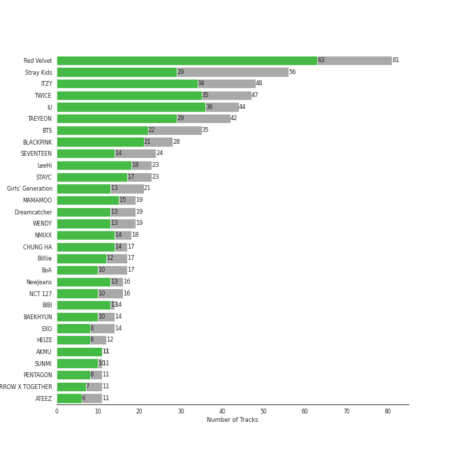
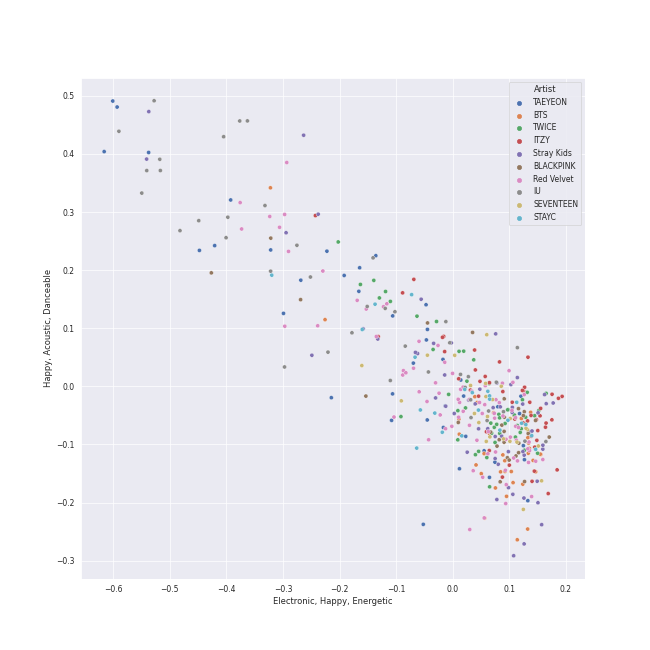
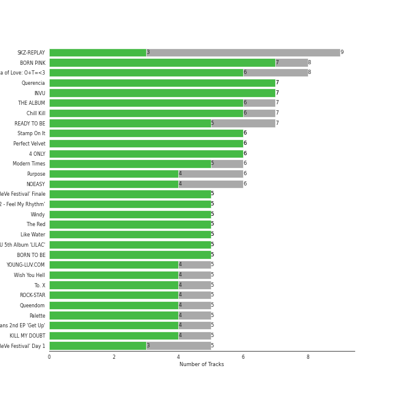
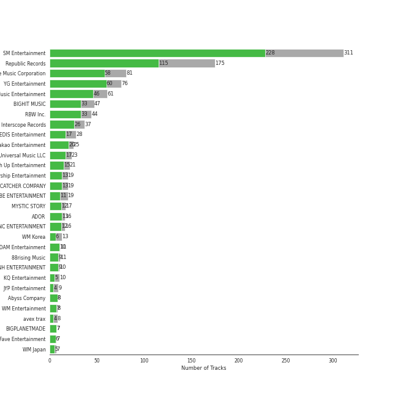
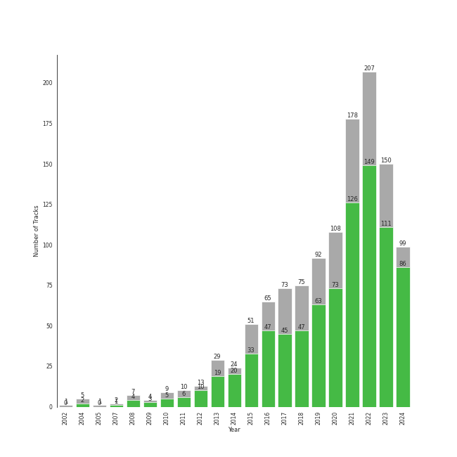

# k-pop

1186 songs

[See Track Features](audio_features.md)

[See Clusters](clusters/overview.md)

## Top Artists

| Art | Rank | Tracks | 💚 | Artist | 🔗 |
|:---|---:|---:|---:|:---|:---|
|  | 2 | 81 | 64 | [Red Velvet](../../artists/red_velvet/overview.md) | [🔗](https://open.spotify.com/artist/1z4g3DjTBBZKhvAroFlhOM) |
|  | 4 | 44 | 36 | [IU](../../artists/iu/overview.md) | [🔗](https://open.spotify.com/artist/3HqSLMAZ3g3d5poNaI7GOU) |
|  | 9 | 47 | 35 | [TWICE](../../artists/twice/overview.md) | [🔗](https://open.spotify.com/artist/7n2Ycct7Beij7Dj7meI4X0) |
|  | 5 | 44 | 30 | [ITZY](../../artists/itzy/overview.md) | [🔗](https://open.spotify.com/artist/2KC9Qb60EaY0kW4eH68vr3) |
|  | 10 | 56 | 29 | [Stray Kids](../../artists/stray_kids/overview.md) | [🔗](https://open.spotify.com/artist/2dIgFjalVxs4ThymZ67YCE) |
|  | 8 | 42 | 29 | [TAEYEON](../../artists/taeyeon/overview.md) | [🔗](https://open.spotify.com/artist/3qNVuliS40BLgXGxhdBdqu) |
|  | 27 | 35 | 22 | [BTS](../../artists/bts/overview.md) | [🔗](https://open.spotify.com/artist/3Nrfpe0tUJi4K4DXYWgMUX) |
|  | 3 | 28 | 21 | [BLACKPINK](../../artists/blackpink/overview.md) | [🔗](https://open.spotify.com/artist/41MozSoPIsD1dJM0CLPjZF) |
|  | 11 | 22 | 18 | [LeeHi](../../artists/leehi/overview.md) | [🔗](https://open.spotify.com/artist/7cVZApDoQZpS447nHTsNqu) |
|  | 16 | 22 | 16 | [STAYC](../../artists/stayc/overview.md) | [🔗](https://open.spotify.com/artist/01XYiBYaoMJcNhPokrg0l0) |

See top 100 artists

| Art | Rank | Tracks | 💚 | Artist | 🔗 |
|:---|---:|---:|---:|:---|:---|
|  | 13 | 19 | 15 | [MAMAMOO](../../artists/mamamoo/overview.md) | [🔗](https://open.spotify.com/artist/0XATRDCYuuGhk0oE7C0o5G) |
|  | 12 | 24 | 14 | [SEVENTEEN](../../artists/seventeen/overview.md) | [🔗](https://open.spotify.com/artist/7nqOGRxlXj7N2JYbgNEjYH) |
|  | 14 | 17 | 14 | [CHUNG HA](../../artists/chung_ha/overview.md) | [🔗](https://open.spotify.com/artist/2PSJ6YriU7JsFucxACpU7Y) |
|  | 18 | 21 | 13 | [Girls' Generation](../../artists/girls__generation/overview.md) | [🔗](https://open.spotify.com/artist/0Sadg1vgvaPqGTOjxu0N6c) |
|  | 29 | 18 | 13 | [Dreamcatcher](../../artists/dreamcatcher/overview.md) | [🔗](https://open.spotify.com/artist/5V1qsQHdXNm4ZEZHWvFnqQ) |
|  | 28 | 18 | 13 | [WENDY](../../artists/wendy/overview.md) | [🔗](https://open.spotify.com/artist/0FRUZvZNPzM3YJMABJxf2K) |
|  | 22 | 16 | 13 | [NewJeans](../../artists/newjeans/overview.md) | [🔗](https://open.spotify.com/artist/6HvZYsbFfjnjFrWF950C9d) |
|  | 70 | 14 | 13 | [BIBI](../../artists/bibi/overview.md) | [🔗](https://open.spotify.com/artist/6UbmqUEgjLA6jAcXwbM1Z9) |
|  | 21 | 15 | 11 | [Billlie](../../artists/billlie/overview.md) | [🔗](https://open.spotify.com/artist/2GQxKDojobwBjZMPf7aoh0) |
|  | 66 | 11 | 11 | [AKMU](../../artists/akmu/overview.md) | [🔗](https://open.spotify.com/artist/6OwKE9Ez6ALxpTaKcT5ayv) |
|  | 32 | 17 | 10 | [BoA](../../artists/boa/overview.md) | [🔗](https://open.spotify.com/artist/4muJrGMndyYWqZtfk8OWy4) |
|  | 30 | 16 | 10 | [NCT 127](../../artists/nct_127/overview.md) | [🔗](https://open.spotify.com/artist/7f4ignuCJhLXfZ9giKT7rH) |
|  | 24 | 14 | 10 | [NCT DREAM](../../artists/nct_dream/overview.md) | [🔗](https://open.spotify.com/artist/1gBUSTR3TyDdTVFIaQnc02) |
|  | 52 | 13 | 10 | [BAEKHYUN](../../artists/baekhyun/overview.md) | [🔗](https://open.spotify.com/artist/4ufh0WuMZh6y4Dmdnklvdl) |
|  | 23 | 13 | 10 | [NMIXX](../../artists/nmixx/overview.md) | [🔗](https://open.spotify.com/artist/28ot3wh4oNmoFOdVajibBl) |
|  | 40 | 11 | 10 | [SUNMI](../../artists/sunmi/overview.md) | [🔗](https://open.spotify.com/artist/6MoXcK2GyGg7FIyxPU5yW6) |
|  | 36 | 10 | 10 | [EVERGLOW](../../artists/everglow/overview.md) | [🔗](https://open.spotify.com/artist/3ZZzT0naD25RhY2uZvIKkJ) |
|  | 25 | 10 | 9 | [JEON SOYEON](../../artists/jeon_soyeon/overview.md) | [🔗](https://open.spotify.com/artist/6Xg22wJOAcnvPUfk5WvODH) |
|  | 20 | 14 | 8 | [EXO](../../artists/exo/overview.md) | [🔗](https://open.spotify.com/artist/3cjEqqelV9zb4BYE3qDQ4O) |
|  | 37 | 12 | 8 | [HEIZE](../../artists/heize/overview.md) | [🔗](https://open.spotify.com/artist/5dCvSnVduaFleCnyy98JMo) |
|  | 67 | 11 | 8 | [PENTAGON](../../artists/pentagon/overview.md) | [🔗](https://open.spotify.com/artist/1wKpMkucynaTfG8lyPprYV) |
|  | 58 | 10 | 8 | [PURPLE KISS](../../artists/purple_kiss/overview.md) | [🔗](https://open.spotify.com/artist/62T5PGHWJ9sxP2SJq20IHq) |
|  | 239 | 10 | 8 | [NCT U](../../artists/nct_u/overview.md) | [🔗](https://open.spotify.com/artist/3paGCCtX1Xr4Gx53mSeZuQ) |
|  | 147 | 11 | 7 | [TOMORROW X TOGETHER](../../artists/tomorrow_x_together/overview.md) | [🔗](https://open.spotify.com/artist/0ghlgldX5Dd6720Q3qFyQB) |
|  | 31 | 7 | 7 | [GOT the beat](../../artists/got_the_beat/overview.md) | [🔗](https://open.spotify.com/artist/6uNxlIP5lzPFf0BHuELOuX) |
|  | 41 | 11 | 6 | [ATEEZ](../../artists/ateez/overview.md) | [🔗](https://open.spotify.com/artist/68KmkJeZGfwe1OUaivBa2L) |
|  | 44 | 9 | 6 | [HWASA](../../artists/hwasa/overview.md) | [🔗](https://open.spotify.com/artist/7bmYpVgQub656uNTu6qGNQ) |
|  | 99 | 9 | 6 | [SHINee](../../artists/shinee/overview.md) | [🔗](https://open.spotify.com/artist/2hRQKC0gqlZGPrmUKbcchR) |
|  | 154 | 8 | 6 | [TVXQ!](../../artists/tvxq!/overview.md) | [🔗](https://open.spotify.com/artist/6nVMMEywS5Y4tsHPKx1nIo) |
|  | 65 | 8 | 6 | [Solar](../../artists/solar/overview.md) | [🔗](https://open.spotify.com/artist/5cYcI546S8Lf97m4mNdYLD) |
|  | 111 | 8 | 6 | [P1Harmony](../../artists/p1harmony/overview.md) | [🔗](https://open.spotify.com/artist/3JjvsPeGMbDJqsphe2z8xU) |
|  | 83 | 7 | 6 | [SUPER JUNIOR](../../artists/super_junior/overview.md) | [🔗](https://open.spotify.com/artist/6gzXCdfYfFe5XKhPKkYqxV) |
|  | 91 | 7 | 6 | [OH MY GIRL](../../artists/oh_my_girl/overview.md) | [🔗](https://open.spotify.com/artist/2019zR22qK2RBvCqtudBaI) |
|  | 244 | 6 | 6 | [WJSN](../../artists/wjsn/overview.md) | [🔗](https://open.spotify.com/artist/6hhqsQZhtp9hfaZhSd0VSD) |
|  | 164 | 6 | 6 | [f(x)](../../artists/f(x)/overview.md) | [🔗](https://open.spotify.com/artist/3wRA5UYoo08BBKJnzyKkpF) |
|  | 411 | 6 | 6 | [j-hope](../../artists/j-hope/overview.md) | [🔗](https://open.spotify.com/artist/0b1sIQumIAsNbqAoIClSpy) |
|  | 60 | 8 | 5 | [CLC](../../artists/clc/overview.md) | [🔗](https://open.spotify.com/artist/6QyO41KctzGc70mVaVnXQO) |
|  | 96 | 7 | 5 | [LOONA](../../artists/loona/overview.md) | [🔗](https://open.spotify.com/artist/52zMTJCKluDlFwMQWmccY7) |
|  | 73 | 7 | 5 | [Jackson Wang](../../artists/jackson_wang/overview.md) | [🔗](https://open.spotify.com/artist/1kfWoWgCugPkyxQP8lkRlY) |
|  | 175 | 6 | 5 | [Crush](../../artists/crush/overview.md) | [🔗](https://open.spotify.com/artist/6aLdhHUqgdKE86xbtNmY8g) |
|  | 411 | 6 | 5 | [The Rose](../../artists/the_rose/overview.md) | [🔗](https://open.spotify.com/artist/5na1LmEmK2VzNLje9snJYW) |
|  | 273 | 6 | 5 | [MOMOLAND](../../artists/momoland/overview.md) | [🔗](https://open.spotify.com/artist/5RR0MLwcjc87wjSw2JYdwx) |
|  | 135 | 6 | 5 | [Gain](../../artists/gain/overview.md) | [🔗](https://open.spotify.com/artist/4R60A85t9mTZzCqJlVswuo) |
|  | 45 | 6 | 5 | [TEN](../../artists/ten/overview.md) | [🔗](https://open.spotify.com/artist/3Q5Qep7ytrjVleNnMnntgQ) |
|  | 185 | 5 | 5 | [VIVIZ](../../artists/viviz/overview.md) | [🔗](https://open.spotify.com/artist/7Lq3yAtwi0Z7zpxEwbQQNZ) |
|  | 35 | 10 | 4 | [SEULGI](../../artists/seulgi/overview.md) | [🔗](https://open.spotify.com/artist/2QM5S4yO6xHgnNvF0nbZZq) |
|  | 74 | 9 | 4 | TAEMIN | [🔗](https://open.spotify.com/artist/13rF01aOogvnkuQXOlgTW8) |
|  | 280 | 8 | 4 | EXID | [🔗](https://open.spotify.com/artist/1xs6WFotNQSXweo0GXrS0O) |
|  | 345 | 6 | 4 | DEAN | [🔗](https://open.spotify.com/artist/3eCd0TZrBPm2n9cDG6yWfF) |
|  | 136 | 5 | 4 | Jung Kook | [🔗](https://open.spotify.com/artist/6HaGTQPmzraVmaVxvz6EUc) |
|  | 172 | 5 | 4 | BIGBANG | [🔗](https://open.spotify.com/artist/4Kxlr1PRlDKEB0ekOCyHgX) |
|  | 101 | 5 | 4 | SURAN | [🔗](https://open.spotify.com/artist/1mORehSVEd7lcaT2d7Sl2K) |
|  | 148 | 5 | 4 | NAYEON | [🔗](https://open.spotify.com/artist/1VwDG9aBflQupaFNjUru9A) |
|  | 121 | 10 | 3 | [THE BOYZ](../../artists/the_boyz/overview.md) | [🔗](https://open.spotify.com/artist/0CmvFWTX9zmMNCUi6fHtAx) |
|  | 411 | 6 | 3 | GOT7 | [🔗](https://open.spotify.com/artist/6nfDaffa50mKtEOwR8g4df) |
|  | 399 | 6 | 3 | Kep1er | [🔗](https://open.spotify.com/artist/5R7AMwDeroq6Ls0COQYpS4) |
|  | 55 | 6 | 3 | HYO | [🔗](https://open.spotify.com/artist/3U7bOaJLuFkrmDQ1C1OqKl) |
|  | 275 | 6 | 3 | SISTAR | [🔗](https://open.spotify.com/artist/2wTLheTmMcFCA4hdY8hZJP) |
|  | 168 | 6 | 3 | Moon Byul | [🔗](https://open.spotify.com/artist/1eTft3tXynrKdo6XD7QHLL) |
|  | 57 | 5 | 3 | TAEYANG | [🔗](https://open.spotify.com/artist/6udveWUgX4vu75FF0DTrXV) |
|  | 411 | 5 | 3 | AOA | [🔗](https://open.spotify.com/artist/54gWVQFHf8IIqbjxAoOarN) |
|  | 82 | 5 | 3 | Wonder Girls | [🔗](https://open.spotify.com/artist/3Cv2vi3WTl8VZOTdrBkKdM) |
|  | 68 | 4 | 3 | JEON SOMI | [🔗](https://open.spotify.com/artist/7zYj9S9SdIunYCfSm7vzAR) |
|  | 109 | 4 | 3 | KAI | [🔗](https://open.spotify.com/artist/6iVo62B0bdTknRcrktCmak) |
|  | 144 | 4 | 3 | TAEYONG | [🔗](https://open.spotify.com/artist/6SKusTjOAPsTZ6kareKQdm) |
|  | 353 | 4 | 3 | IZ*ONE | [🔗](https://open.spotify.com/artist/5r1tUTxVSgvBHnoDuDODPH) |
|  | 365 | 4 | 3 | Jay Park | [🔗](https://open.spotify.com/artist/4XDi67ZENZcbfKnvMnTYsI) |
|  | 79 | 4 | 3 | AILEE | [🔗](https://open.spotify.com/artist/3uGFTJ7JMllvhgGpumieHF) |
|  | 62 | 4 | 3 | 2NE1 | [🔗](https://open.spotify.com/artist/1l0mKo96Jh9HVYONcRl3Yp) |
|  | 94 | 3 | 3 | MAX CHANGMIN | [🔗](https://open.spotify.com/artist/7FiAkNWMb6ZBYI8tbQLuIS) |
|  | 137 | 3 | 3 | U-KNOW | [🔗](https://open.spotify.com/artist/4lqxrwkJ16gYkKNumLA3SL) |
|  | 186 | 3 | 3 | MONSTA X | [🔗](https://open.spotify.com/artist/4TnGh5PKbSjpYqpIdlW5nz) |
|  | 344 | 3 | 3 | NCT | [🔗](https://open.spotify.com/artist/48eO052eSDcn8aTxiv6QaG) |
|  | 69 | 3 | 3 | [WINTER](../../artists/winter/overview.md) | [🔗](https://open.spotify.com/artist/3mPquBmMu97Iq9TpzQ6ayI) |
|  | 110 | 3 | 3 | JENNIE | [🔗](https://open.spotify.com/artist/250b0Wlc5Vk0CoUsaCY84M) |
|  | 181 | 3 | 3 | Jimin | [🔗](https://open.spotify.com/artist/1oSPZhvZMIrWW5I41kPkkY) |
|  | 394 | 3 | 3 | B.I | [🔗](https://open.spotify.com/artist/0UntV1Bw2hk3fbRrm9eMP6) |
|  | 400 | 3 | 3 | Whee In | [🔗](https://open.spotify.com/artist/0BqRGrwqndrtNkojXiqIzL) |
|  | 411 | 4 | 2 | WOODZ | [🔗](https://open.spotify.com/artist/6y9nlaoynxSvoTGY09Vdcy) |
|  | 355 | 4 | 2 | iKON | [🔗](https://open.spotify.com/artist/5qRSs6mvI17zrkJpOHkCoM) |
|  | 127 | 4 | 2 | ZICO | [🔗](https://open.spotify.com/artist/4XpUIb8uuNlIWVKmgKZXC0) |
|  | 246 | 3 | 2 | MARK | [🔗](https://open.spotify.com/artist/70DFixYAFPv4Pf9kgSfR9O) |
|  | 411 | 3 | 2 | Jessi | [🔗](https://open.spotify.com/artist/64k5e9kV9MdukXjFrR5R37) |
|  | 294 | 3 | 2 | Cherry Bullet | [🔗](https://open.spotify.com/artist/3IJCdgkBZbieocLZ4e94GZ) |
|  | 59 | 3 | 2 | G-DRAGON | [🔗](https://open.spotify.com/artist/30b9WulBM8sFuBo17nNq9c) |
|  | 221 | 3 | 2 | Loco | [🔗](https://open.spotify.com/artist/2e4G04F77jxVuDYo44TCSm) |
|  | 350 | 3 | 2 | GFRIEND | [🔗](https://open.spotify.com/artist/0qlWcS66ohOIi0M8JZwPft) |
|  | 292 | 2 | 2 | HYOLYN | [🔗](https://open.spotify.com/artist/78sJswwVn4P8aEhkF4K6fQ) |
|  | 122 | 2 | 2 | 4Minute | [🔗](https://open.spotify.com/artist/6cdC1cwqh3eJAXaxXJt2jv) |
|  | 97 | 2 | 2 | Red Velvet - IRENE & SEULGI | [🔗](https://open.spotify.com/artist/6bwp9ObI8FWvMPCIWVBmhl) |

## Most and least listened tracks
| Rank | ​ | Most listened tracks | Rank | ​​ | Least listened tracks |
|---:|:---|:---|---:|:---|:---|
| 2 |  | [HIP](../../artists/mamamoo/overview.md) | 911 |  | [Sorry](../../artists/the_rose/overview.md) |
| 4 |  | [LOCO](../../artists/itzy/overview.md) | 911 |  | DIE 4 YOU |
| 5 |  | [Pretty Savage](../../artists/blackpink/overview.md) | 911 |  | [ROAR](../../artists/the_boyz/overview.md) |
| 6 |  | [Maria](../../artists/hwasa/overview.md) | 911 |  | [Lucifer](../../artists/shinee/overview.md) |
| 7 |  | [Kill This Love](../../artists/blackpink/overview.md) | 911 |  | [New Jeans](../../artists/newjeans/overview.md) |
| 9 |  | [HOLO](../../artists/leehi/overview.md) | 911 |  | [Anywhere But Home](../../artists/seulgi/overview.md) |
| 11 |  | [Left & Right](../../artists/seventeen/overview.md) | 911 |  | LALISA |
| 13 |  | [Crazy Over You](../../artists/blackpink/overview.md) | 911 |  | [Electric Shock](../../artists/f(x)/overview.md) |
| 14 |  | [How You Like That](../../artists/blackpink/overview.md) | 911 |  | Badster |
| 15 |  | [Gotta Go](../../artists/chung_ha/overview.md) | 911 |  | [The First Snow - Chinese Version](../../artists/exo/overview.md) |

## Top Albums

| Art | Rank | Tracks | 💚 | Album | Release Date | 🔗 |
|:---|---:|---:|---:|:---|:---|:---|
|  | 149 | 9 | 3 | SKZ-REPLAY | 2022-12-21 | [🔗](https://open.spotify.com/album/3UXrliH0JUQvcaLnBD8Txz) |
|  | 39 | 8 | 7 | BORN PINK | 2022-09-16 | [🔗](https://open.spotify.com/album/7jaSNQUBJbvfbZHLNFrV7P) |
|  | 123 | 8 | 6 | Formula of Love: O+T=<3 | 2021-11-12 | [🔗](https://open.spotify.com/album/5052Ip89wdW8EGdpjEpNeq) |
|  | 170 | 7 | 7 | Querencia | 2021-02-15 | [🔗](https://open.spotify.com/album/1p2OBhqq0d1N8awjHV9xA3) |
|  | 40 | 7 | 7 | INVU - The 3rd Album | 2022-02-14 | [🔗](https://open.spotify.com/album/7i2YLTVQ0dyngRuUqtGmr9) |
|  | 1 | 7 | 6 | THE ALBUM | 2020-10-02 | [🔗](https://open.spotify.com/album/71O60S5gIJSIAhdnrDIh3N) |
|  | 5 | 7 | 6 | Chill Kill - The 3rd Album | 2023-11-13 | [🔗](https://open.spotify.com/album/4UUICitfodUVCNhzmDFbrO) |
|  | 63 | 7 | 5 | READY TO BE | 2023-03-10 | [🔗](https://open.spotify.com/album/7hzP5i7StxYG4StECA0rrJ) |
|  | 27 | 6 | 6 | Stamp On It - The 1st Mini Album | 2023-01-16 | [🔗](https://open.spotify.com/album/2Gxd1fr4RFHVNx6IxGr9I7) |
|  | 181 | 6 | 6 | Perfect Velvet - The 2nd Album | 2017-11-17 | [🔗](https://open.spotify.com/album/0rvrbZvaDX5S9ZBhwOwFfH) |

See top 100 albums

| Art | Rank | Tracks | 💚 | Album | Release Date | 🔗 |
|:---|---:|---:|---:|:---|:---|:---|
|  | 60 | 6 | 6 | 4 ONLY | 2021-09-09 | [🔗](https://open.spotify.com/album/1DKgZeAYrjslAPZVMe6EFt) |
|  | 65 | 6 | 5 | Modern Times | 2013-10-08 | [🔗](https://open.spotify.com/album/2QcuXvQBWv1ZKyQtEhLbFe) |
|  | 151 | 6 | 4 | Purpose - The 2nd Album | 2019-10-28 | [🔗](https://open.spotify.com/album/0h6wCpdgpSOAbYDDYJVuwr) |
|  | 31 | 6 | 4 | NOEASY | 2021-08-23 | [🔗](https://open.spotify.com/album/558tpdCejjVQNFAumRAeQj) |
|  | 144 | 5 | 5 | ‘The ReVe Festival’ Finale | 2019-12-23 | [🔗](https://open.spotify.com/album/3rVtm00UfbuzWOewdm4iYM) |
|  | 79 | 5 | 5 | ‘The ReVe Festival 2022 - Feel My Rhythm’ | 2022-03-21 | [🔗](https://open.spotify.com/album/3HgoCO9wWuPcNhz8Ip4C46) |
|  | 19 | 5 | 5 | Windy | 2021-07-05 | [🔗](https://open.spotify.com/album/1lv92CIVZbB2BsHmIx7qJf) |
|  | 37 | 5 | 5 | The Red - The 1st Album | 2015-09-09 | [🔗](https://open.spotify.com/album/6YL9J0E6PGtYzkhyMxnmXd) |
|  | 20 | 5 | 5 | Like Water - The 1st Mini Album | 2021-04-05 | [🔗](https://open.spotify.com/album/1Ao5vWPO13f4l0ldwxOKL7) |
|  | 4 | 5 | 5 | IU 5th Album 'LILAC' | 2021-03-25 | [🔗](https://open.spotify.com/album/01dPJcwyht77brL4JQiR8R) |
|  | 7 | 5 | 5 | BORN TO BE | 2024-01-08 | [🔗](https://open.spotify.com/album/3cm3EkNQLpKu58btSJT7fz) |
|  | 242 | 5 | 4 | YOUNG-LUV.COM | 2022-02-21 | [🔗](https://open.spotify.com/album/2xPdgNkM4yIQmP7axJ1T1o) |
|  | 114 | 5 | 4 | Wish You Hell - The 2nd Mini Album | 2024-03-12 | [🔗](https://open.spotify.com/album/3f8n88uX0tNvA8HTROgSkr) |
|  | 25 | 5 | 4 | To. X - The 5th Mini Album | 2023-11-27 | [🔗](https://open.spotify.com/album/0VciVDVU6NoqtQ0WAIlTmD) |
|  | 52 | 5 | 4 | ROCK-STAR | 2023-11-10 | [🔗](https://open.spotify.com/album/0aJnGEZWIc1VCYlZOXv05a) |
|  | 470 | 5 | 4 | Queendom - The 6th Mini Album | 2021-08-16 | [🔗](https://open.spotify.com/album/6Pe5LGQgU3mmvuRjFMsACV) |
|  | 77 | 5 | 4 | Palette | 2017-04-21 | [🔗](https://open.spotify.com/album/5V8n6fqyAPxvFTibPhQVcp) |
|  | 135 | 5 | 4 | NewJeans 2nd EP 'Get Up' | 2023-07-21 | [🔗](https://open.spotify.com/album/4N1fROq2oeyLGAlQ1C1j18) |
|  | 73 | 5 | 4 | KILL MY DOUBT | 2023-07-31 | [🔗](https://open.spotify.com/album/6P01cKb7sdwfnNpuMLNEik) |
|  | 119 | 5 | 3 | ‘The ReVe Festival’ Day 1 | 2019-06-19 | [🔗](https://open.spotify.com/album/2nLEiP268mSFZHW5dajM4R) |
|  | 102 | 5 | 3 | expérgo | 2023-03-20 | [🔗](https://open.spotify.com/album/6GbCvETnCVvkpvK6qCqTYS) |
|  | 75 | 5 | 3 | TEENFRESH | 2023-08-16 | [🔗](https://open.spotify.com/album/4P5wnRQTBnnjNbjt7A6S6x) |
|  | 99 | 5 | 3 | RBB - The 5th Mini Album | 2018-11-30 | [🔗](https://open.spotify.com/album/7rNIvLwIpB2mwOzk20iqIl) |
|  | 340 | 5 | 3 | ODDINARY | 2022-03-18 | [🔗](https://open.spotify.com/album/0Gmf4pfe0POEQq2FgGAj2q) |
|  | 186 | 5 | 3 | GUESS WHO | 2021-04-30 | [🔗](https://open.spotify.com/album/4lS8nhX8cplsYPzKjvhw6G) |
|  | 606 | 5 | 3 | FOREVER 1 - The 7th Album | 2022-08-05 | [🔗](https://open.spotify.com/album/3CcgnUkTrUaPTt4Ms1MkoP) |
|  | 10 | 5 | 3 | CRAZY IN LOVE | 2021-09-24 | [🔗](https://open.spotify.com/album/4U7rGOkJgtxs27H9L93Xli) |
|  | 573 | 5 | 3 | CHECKMATE | 2022-07-15 | [🔗](https://open.spotify.com/album/64EGnoCD5NuC41OqQ3E7UK) |
|  | 68 | 5 | 3 | 28 Reasons - The 1st Mini Album | 2022-10-04 | [🔗](https://open.spotify.com/album/1t5a29WYbJj83iy3RNICHw) |
|  | 32 | 4 | 4 | ‘The ReVe Festival 2022 - Birthday’ | 2022-11-28 | [🔗](https://open.spotify.com/album/58OR7UoaJkJzqeQGClHzh1) |
|  | 18 | 4 | 4 | Russian Roulette - The 3rd Mini Album | 2016-09-07 | [🔗](https://open.spotify.com/album/6MNlcai3skKLKv5syzFwC3) |
|  | 293 | 4 | 4 | Love poem | 2019-11-18 | [🔗](https://open.spotify.com/album/2xEH7SRzJq7LgA0fCtTlxH) |
|  | 109 | 4 | 4 | Cosmic | 2024-06-24 | [🔗](https://open.spotify.com/album/5E8apoFsaUFhZxGGSju6aW) |
|  | 66 | 4 | 3 | the Billage of perception: chapter three | 2023-03-28 | [🔗](https://open.spotify.com/album/5bt0sTLia4il2rIlpqUo5g) |
|  | 81 | 4 | 3 | the Billage of perception : chapter one | 2021-11-10 | [🔗](https://open.spotify.com/album/1kp4txZsSpDNR4EoDFi2LD) |
|  | 30 | 4 | 3 | The Winning | 2024-02-20 | [🔗](https://open.spotify.com/album/08CvAj58nVMpq1Nw7T6maj) |
|  | 58 | 4 | 3 | TEN - The 1st Mini Album | 2024-02-13 | [🔗](https://open.spotify.com/album/50Zo1vf3YCQtXLUZr2oBiQ) |
|  | 105 | 4 | 3 | NewJeans 1st EP 'New Jeans' | 2022-08-01 | [🔗](https://open.spotify.com/album/1HMLpmZAnNyl9pxvOnTovV) |
|  | 199 | 4 | 3 | Metamorphic | 2024-07-01 | [🔗](https://open.spotify.com/album/6eTCq3XOz0rVJnelXro3Vk) |
|  | 606 | 4 | 3 | MAP OF THE SOUL : 7 | 2020-02-21 | [🔗](https://open.spotify.com/album/5W1XY5ucNATjTULERvXx9j) |
|  | 606 | 4 | 3 | Love Yourself 轉 'Tear' | 2018-05-18 | [🔗](https://open.spotify.com/album/4NIqCxqP9o8Tp6tGLBqd8O) |
|  | 407 | 4 | 3 | GOLDEN | 2023-11-03 | [🔗](https://open.spotify.com/album/5pSk3c3wVwnb2arb6ohCPU) |
|  | 160 | 4 | 3 | COLOURS | 2024-04-30 | [🔗](https://open.spotify.com/album/5Q1cKPuB4vPk8bIdfZH7Fm) |
|  | 279 | 4 | 3 | 24℃ | 2019-05-30 | [🔗](https://open.spotify.com/album/5u9CP1NknadV33hZepVEy5) |
|  | 70 | 4 | 3 | 2022 Winter SMTOWN : SMCU PALACE | 2022-12-26 | [🔗](https://open.spotify.com/album/1HwnXJfZx8N8qDfzwUbxcw) |
|  | 127 | 4 | 3 | 2 Baddies - The 4th Album | 2022-09-16 | [🔗](https://open.spotify.com/album/6p80QT3z7kOHpYdnsItQTQ) |
|  | 606 | 4 | 2 | Summer Magic - Summer Mini Album | 2018-08-06 | [🔗](https://open.spotify.com/album/5zWa1ZEUBctbKqvwXbFawo) |
|  | 69 | 4 | 2 | SQUARE UP | 2018-06-15 | [🔗](https://open.spotify.com/album/0wOiWrujRbxlKEGWRQpKYc) |
|  | 530 | 4 | 2 | SEVENTEEN 4th Album 'Face the Sun' | 2022-05-27 | [🔗](https://open.spotify.com/album/4lfFgz2rD1irxf7dZhNJht) |
|  | 432 | 4 | 2 | SEVENTEEN 11th Mini Album 'SEVENTEENTH HEAVEN' | 2023-10-23 | [🔗](https://open.spotify.com/album/1rE0Gy69MFUh4GuXafWd0f) |
|  | 247 | 4 | 2 | MAXIDENT | 2022-10-07 | [🔗](https://open.spotify.com/album/0T6hYH0UyDjNraWZk2mZWi) |
|  | 80 | 4 | 2 | Lion Heart - The 5th Album | 2015-08-19 | [🔗](https://open.spotify.com/album/4eKdn0skJCidO2wqIJyCgB) |
|  | 12 | 4 | 2 | KILL THIS LOVE | 2019-04-05 | [🔗](https://open.spotify.com/album/3PNxZ3BELbUXJ1XLktXiHz) |
|  | 180 | 4 | 1 | Christmas EveL | 2021-11-29 | [🔗](https://open.spotify.com/album/1qVuQI0WRn2Mczbdxx54Ih) |
|  | 445 | 4 | 0 | This Christmas – Winter is Coming | 2017-12-12 | [🔗](https://open.spotify.com/album/1U3KyC9Key12NSi9ETVExx) |
|  | 606 | 4 | 0 | Not Shy (English Ver.) | 2021-01-22 | [🔗](https://open.spotify.com/album/0hoNwSKuuOeT9eAxopgMdm) |
|  | 497 | 3 | 3 | the collective soul and unconscious: chapter one | 2022-02-23 | [🔗](https://open.spotify.com/album/4ophrgcnwWi1I5nWYImyhw) |
|  | 108 | 3 | 3 | With YOU-th | 2024-02-23 | [🔗](https://open.spotify.com/album/575TQDOQqc0MAheeEeKWUR) |
|  | 294 | 3 | 3 | Taste of Love | 2021-06-11 | [🔗](https://open.spotify.com/album/00vb6sViDbJLmLLchfbRh4) |
|  | 124 | 3 | 3 | SEOULITE | 2016-03-09 | [🔗](https://open.spotify.com/album/2c41Flo2HQgy0A9P3xuSFf) |
|  | 268 | 3 | 3 | SAILING | 2019-09-25 | [🔗](https://open.spotify.com/album/7C0Ci0alKWwwXPIFYEdVcn) |
|  | 352 | 3 | 3 | Reality Show - The 3rd Mini Album | 2023-08-07 | [🔗](https://open.spotify.com/album/1sNNtYLrWGMmPIGElMW42b) |
|  | 477 | 3 | 3 | NCT 2018 EMPATHY | 2018-03-14 | [🔗](https://open.spotify.com/album/3KAJvo62RNQEtXwIyB5rzX) |
|  | 224 | 3 | 3 | MAGIC MAN | 2022-09-09 | [🔗](https://open.spotify.com/album/2VZ4og2ZbwyTQ3X1rbgCe1) |
|  | 228 | 3 | 3 | MADE | 2016-12-13 | [🔗](https://open.spotify.com/album/2SPrl8C8pgSM5gXbAiyJHY) |
|  | 98 | 3 | 3 | Lowlife Princess: Noir | 2022-11-18 | [🔗](https://open.spotify.com/album/0AwCgoJKJUOgLp1imhnxuH) |
|  | 606 | 3 | 3 | LOVE or TAKE | 2021-03-15 | [🔗](https://open.spotify.com/album/5iu1d69dqEo9UaKpZDYoIV) |
|  | 606 | 3 | 3 | Jack In The Box | 2022-07-15 | [🔗](https://open.spotify.com/album/0FrC9lzgVhziJenigsrXdl) |
|  | 462 | 3 | 3 | IN:VITE U | 2022-01-24 | [🔗](https://open.spotify.com/album/5vxZM8rFJiNvjtAThYnwek) |
|  | 132 | 3 | 3 | Forgive Me - The 3rd Mini Album | 2022-11-22 | [🔗](https://open.spotify.com/album/0vufEpmNpfB9NUPLkbIBN7) |
|  | 49 | 3 | 3 | Fe3O4: BREAK | 2024-01-15 | [🔗](https://open.spotify.com/album/5CCxLQgcI7cVwmgFDlicbP) |
|  | 28 | 3 | 3 | Eyes Wide Open | 2020-10-26 | [🔗](https://open.spotify.com/album/33jypnU7WULxPaVrjj4RXH) |
|  | 593 | 3 | 3 | CHAT-SHIRE | 2015-10-23 | [🔗](https://open.spotify.com/album/3rMvAe0zU0pJRnRa7Rfc1U) |
|  | 606 | 3 | 3 | BE | 2020-11-20 | [🔗](https://open.spotify.com/album/6nYfHQnvkvOTNHnOhDT3sr) |
|  | 251 | 3 | 3 | 1st Album [Dystopia : The Tree of Language] | 2020-02-18 | [🔗](https://open.spotify.com/album/6m5pDOafdvIKxNRxx5hVbr) |
|  | 153 | 3 | 2 | the Billage of perception: chapter two | 2022-08-31 | [🔗](https://open.spotify.com/album/0NuM7kwh6u6fIRjn7Zh7Ss) |
|  | 606 | 3 | 2 | [Apocalypse : Save us] | 2022-04-12 | [🔗](https://open.spotify.com/album/42mMFBIWT599FmtWK5op4a) |
|  | 606 | 3 | 2 | The Most Beautiful Moment in Life: Young Forever | 2016-05-02 | [🔗](https://open.spotify.com/album/1k5bJ8l5oL5xxVBVHjil09) |
|  | 606 | 3 | 2 | The Chaos Chapter: FREEZE | 2021-05-31 | [🔗](https://open.spotify.com/album/5Zdr9vactwnJH4Vpe9Mid9) |
|  | 221 | 3 | 2 | Raid of Dream | 2019-09-18 | [🔗](https://open.spotify.com/album/7jvAjSM0NOSwJYsLzHQ9KZ) |
|  | 508 | 3 | 2 | Love Yourself 結 'Answer' | 2018-08-24 | [🔗](https://open.spotify.com/album/43wFM1HquliY3iwKWzPN4y) |
|  | 350 | 3 | 2 | Love Yourself 承 'Her' | 2017-09-18 | [🔗](https://open.spotify.com/album/07Rq17GzCnIdWJcyVHb57G) |
|  | 129 | 3 | 2 | Last Winter | 2023-12-07 | [🔗](https://open.spotify.com/album/41vj1sO4NJFriquGszDSh5) |
|  | 606 | 3 | 2 | IM NAYEON | 2022-06-24 | [🔗](https://open.spotify.com/album/0wqjfojWuTcbEvwaizvTMw) |
|  | 606 | 3 | 2 | HARMONY : SET IN | 2022-11-30 | [🔗](https://open.spotify.com/album/1JDHisMjuJ1QkhcXiiLnnX) |
|  | 606 | 3 | 2 | Delight - The 2nd Mini Album | 2020-05-25 | [🔗](https://open.spotify.com/album/75sPv82oaDKYjtuuS4l3Vc) |
|  | 67 | 3 | 2 | CHESHIRE | 2022-11-30 | [🔗](https://open.spotify.com/album/2a1ezg7hE6Dyuymv1aCnkm) |
|  | 339 | 3 | 2 | Bloom | 2022-04-06 | [🔗](https://open.spotify.com/album/4ualu7nMAcmoAqp47YaA95) |
|  | 606 | 3 | 2 | Bare&Rare, Pt. 1 | 2022-07-11 | [🔗](https://open.spotify.com/album/0fgLDYoqdQw5bhzPFWvclR) |
|  | 606 | 3 | 2 | Bambi - The 3rd Mini Album | 2021-03-30 | [🔗](https://open.spotify.com/album/5xOx4mWABbTj0qWyZC4q1p) |

## Top Record Labels

| Tracks | 💚 | Label |
|---:|---:|:---|
| 322 | 237 | [SM Entertainment](../../labels/sm_entertainment/overview.md) |
| 167 | 108 | [Republic Records](../../labels/republic_records/overview.md) |
| 76 | 61 | [YG Entertainment](../../labels/yg_entertainment/overview.md) |
| 81 | 58 | [Genie Music Corporation](../../labels/genie_music_corporation/overview.md) |
| 61 | 46 | [Stone Music Entertainment](../../labels/stone_music_entertainment/overview.md) |
| 46 | 33 | [BIGHIT MUSIC](../../labels/bighit_music/overview.md) |
| 44 | 33 | [RBW Inc.](../../labels/rbw_inc_/overview.md) |
| 37 | 27 | [Interscope Records](../../labels/interscope_records/overview.md) |
| 25 | 20 | [Kakao Entertainment](../../labels/kakao_entertainment/overview.md) |
| 27 | 16 | [PLEDIS Entertainment](../../labels/pledis_entertainment/overview.md) |

See top 100 labels

| Tracks | 💚 | Label |
|---:|---:|:---|
| 22 | 16 | [Universal Music LLC](../../labels/universal_music_llc/overview.md) |
| 21 | 15 | [High Up Entertainment](../../labels/high_up_entertainment/overview.md) |
| 19 | 13 | [Starship Entertainment](../../labels/starship_entertainment/overview.md) |
| 18 | 13 | [DREAMCATCHER COMPANY](../../labels/dreamcatcher_company/overview.md) |
| 16 | 13 | [ADOR](../../labels/ador/overview.md) |
| 19 | 11 | [CUBE ENTERTAINMENT](../../labels/cube_entertainment/overview.md) |
| 15 | 11 | [MYSTIC STORY](../../labels/mystic_story/overview.md) |
| 15 | 11 | [FNC ENTERTAINMENT](../../labels/fnc_entertainment/overview.md) |
| 11 | 10 | [EDAM Entertainment](../../labels/edam_entertainment/overview.md) |
| 11 | 9 | [88rising Music](../../labels/88rising_music/overview.md) |
| 10 | 9 | [MNH ENTERTAINMENT](../../labels/mnh_entertainment/overview.md) |
| 7 | 7 | Abyss Company |
| 13 | 6 | [WM Korea](../../labels/wm_korea/overview.md) |
| 7 | 6 | [WM Entertainment](../../labels/wm_entertainment/overview.md) |
| 7 | 6 | Fave Entertainment |
| 10 | 5 | [KQ Entertainment](../../labels/kq_entertainment/overview.md) |
| 7 | 5 | [WM Japan](../../labels/wm_japan/overview.md) |
| 9 | 4 | [avex trax](../../labels/avex_trax/overview.md) |
| 9 | 4 | [JYP Entertainment](../../labels/jyp_entertainment/overview.md) |
| 6 | 4 | [Warner Records](../../labels/warner_records/overview.md) |
| 5 | 4 | TEAM WANG records |
| 5 | 4 | Republic Records – NAYEON (TWICE) |
| 5 | 4 | BlockBerryCreative |
| 4 | 4 | THE BLACK LABEL |
| 4 | 4 | SWING ENTERTAINMENT |
| 4 | 4 | MYSTIC Entertainment |
| 4 | 4 | FeelGhoodMusic |
| 4 | 4 | Feel Ghood Music |
| 4 | 4 | BIGPLANETMADE |
| 5 | 3 | P NATION |
| 4 | 3 | Kakao M Corp. |
| 3 | 3 | RADCOMM |
| 3 | 3 | MORE VISION |
| 3 | 3 | MLD ENTERTAINMENT |
| 3 | 3 | APOP Entertainment |
| 5 | 2 | IST Entertainment |
| 3 | 2 | [SOURCE MUSIC](../../labels/source_music/overview.md) |
| 3 | 2 | PLAY M ENTERTAINMENT CORP. |
| 3 | 2 | Million Market |
| 3 | 2 | Makeus Entertainment |
| 3 | 2 | Klap |
| 3 | 2 | CJ E&M MUSIC |
| 2 | 2 | 스튜디오앤뉴 |
| 2 | 2 | 뮤직앤뉴 |
| 2 | 2 | Yedang Entertainment |
| 2 | 2 | Transparent Arts |
| 2 | 2 | Studio MaumC |
| 2 | 2 | [Sony Music Labels Inc.](../../labels/sony_music_labels_inc_/overview.md) |
| 2 | 2 | OFF THE RECORD Entertainment |
| 2 | 2 | Hwa&Dam pictures |
| 2 | 2 | [Capitol Records](../../labels/capitol_records/overview.md) |
| 5 | 1 | BANANA CULTURE |
| 4 | 1 | THEBLACKLABEL |
| 4 | 1 | Cre.ker Entertainment |
| 4 | 1 | Beyond Music |
| 3 | 1 | LABEL V |
| 3 | 1 | JELLYFISH ENTERTAINMENT |
| 2 | 1 | 해피페이스 엔터테인먼트 |
| 2 | 1 | HYBE |
| 2 | 1 | Fantagio |
| 2 | 1 | AOMG |
| 1 | 1 | 피네이션 |
| 1 | 1 | 폴라리스엔터테인먼트 |
| 1 | 1 | 에이스토리 |
| 1 | 1 | 모스트콘텐츠 |
| 1 | 1 | 더라이브레이블 |
| 1 | 1 | msmedia |
| 1 | 1 | YUEHUA ENTERTAINMENT KOREA |
| 1 | 1 | YMC Ent. |
| 1 | 1 | YGEX |
| 1 | 1 | WAKEONE |
| 1 | 1 | Studio Beyond |
| 1 | 1 | Starship Ent. |
| 1 | 1 | STAR EMPIRE |
| 1 | 1 | KOZ Entertainment |
| 1 | 1 | KONNECT Ent. |
| 1 | 1 | JTBC Studios |
| 1 | 1 | JS MUSIC |
| 1 | 1 | IOK x Transparent Arts |
| 1 | 1 | GU Music |
| 1 | 1 | Fontana South |
| 1 | 1 | FLEX M |
| 1 | 1 | DUBLEKICK COMPANY |
| 1 | 1 | DSPmedia |
| 1 | 1 | DCTOM |
| 1 | 1 | [Columbia](../../labels/columbia/overview.md) |
| 1 | 1 | ChoongangICS |
| 1 | 1 | Capitol Records (CAP) |
| 1 | 1 | C9 Entertainment |
| 1 | 1 | BlockBerry Creative |

## Top Producers

| Art | Producer | Tracks | Credit Types |
|:---|:---|---:|:---|
| | [정은경 (Jung, Eun-Kyung)](../../producers/정은경_(jung,_eun-kyung)/overview.md) | 38 | Producer, Arranger |
| | [TEDDY](../../producers/teddy/overview.md) | 31 | Lyricist, Producer, Songwriter, Arranger |
| | [구종필 (Koo, Jong-Pil)](../../producers/구종필_(koo,_jong-pil)/overview.md) | 19 | Producer |
| | [엄세희 (Um, Se-Hee)](../../producers/엄세희_(um,_se-hee)/overview.md) | 18 | Producer |
| | [구혜진 (Gu, Hye-jin)](../../producers/구혜진_(gu,_hye-jin)/overview.md) | 17 | Producer |
| | [24](../../producers/24/overview.md) | 17 | Arranger, Producer, Songwriter |
| | [블랙아이드필승 (Black Eyed Pilseung)](../../producers/블랙아이드필승_(black_eyed_pilseung)/overview.md) | 15 | Lyricist, Songwriter, Arranger, Producer |
| | [LEEZ](../../producers/leez/overview.md) | 15 | Arranger, Lyricist, Songwriter, Producer |
| | [Ollounder](../../producers/ollounder/overview.md) | 15 | Arranger, Lyricist, Producer, Songwriter |
| | [R.Tee](../../producers/r_tee/overview.md) | 14 | Producer, Arranger, Songwriter |

View all

| Art | Producer | Tracks | Credit Types |
|:---|:---|---:|:---|
| | [Kenzie](../../producers/kenzie/overview.md) | 14 | Songwriter, Arranger, Lyricist, Producer |
| | [라도 (Rado)](../../producers/라도_(rado)/overview.md) | 14 | Arranger, Lyricist, Songwriter, Producer |
| | [Ryan S. Jhun](../../producers/ryan_s__jhun/overview.md) | 13 | Arranger, Lyricist, Songwriter |
| | [김이나 (Kim, Eana)](../../producers/김이나_(kim,_eana)/overview.md) | 13 | Lyricist |
| | [이태섭 (Lee, Tae-Sub)](../../producers/이태섭_(lee,_tae-sub)/overview.md) | 13 | Producer |
| | [김도훈 (Kim, Do-hoon)](../../producers/김도훈_(kim,_do-hoon)/overview.md) | 12 | Arranger, Lyricist, Songwriter |
| | [유영진 (Yoo, Young-jin)](../../producers/유영진_(yoo,_young-jin)/overview.md) | 12 | Arranger, Lyricist, Producer, Songwriter |
| | [Pdogg](../../producers/pdogg/overview.md) | 12 | Producer, Songwriter, Arranger |
|  | RM | 12 | Songwriter, Arranger, Producer, Lyricist |
| | [서지음 (Seo, Ji Eum)](../../producers/서지음_(seo,_ji_eum)/overview.md) | 12 | Lyricist |
| | 이상엽 (Lee, Sang-yeob) | 10 | Producer |
| | [정의석 (Jung, Euisuk)](../../producers/정의석_(jung,_euisuk)/overview.md) | 10 | Producer |
| | [이수만 (Lee, Soo-Man)](../../producers/이수만_(lee,_soo-man)/overview.md) | 10 | Producer |
| | [전군 (Jeon Goon)](../../producers/전군_(jeon_goon)/overview.md) | 10 | Lyricist, Songwriter, Producer |
|  | Bekuh Boom | 10 | Lyricist, Songwriter |
| | 김석민 (Kim Seog-min) | 9 | Producer |
| | [방시혁 (Bang, Si-Hyuk)](../../producers/방시혁_(bang,_si-hyuk)/overview.md) | 9 | Songwriter |
| | [Fuxxy](../../producers/fuxxy/overview.md) | 9 | Lyricist, Songwriter, Arranger |
| | 윤원권 (Yoon, Won-kwon) | 9 | Producer |
| | [Josh Gudwin](../../producers/josh_gudwin/overview.md) | 8 | Producer |
| | [Tony Maserati](../../producers/tony_maserati/overview.md) | 8 | Producer |
| | [심은지 (Sim, Eunjee)](../../producers/심은지_(sim,_eunjee)/overview.md) | 8 | Arranger, Lyricist, Producer, Songwriter |
| | Danny Chung | 8 | Lyricist |
| | [조윤경 (Jo, Yoon Kyung)](../../producers/조윤경_(jo,_yoon_kyung)/overview.md) | 8 | Lyricist |
| | 남궁진 (Nam Goong, Jin) | 8 | Producer |
| | Jason Roberts | 8 | Producer |
| | 신지영 (Shin, Ji-young) | 8 | Producer |
| | [LDN Noise](../../producers/ldn_noise/overview.md) | 7 | Arranger, Songwriter, Producer |
| | 유키 (Yuki) | 7 | Lyricist |
|  | SUGA | 7 | Producer, Songwriter |
| | DRK | 7 | Producer |
| | [이민수 (이민수)](../../producers/이민수_(이민수)/overview.md) | 7 | Arranger, Songwriter |
| | Melanie Joy Fontana | 7 | Lyricist, Songwriter |
| | YOUNGJU BANG | 7 | Producer |
| | 이지홍 (Lee, Ji-hong) | 6 | Producer |
| | [FLYT](../../producers/flyt/overview.md) | 6 | Arranger, Songwriter, Producer |
| | 이민규 (Lee, Min-kyu) | 6 | Producer |
| | 최혜진 (Cho, Hye-jin) | 6 | Producer |
| | [강지원 (Kang, Jiwon)](../../producers/강지원_(kang,_jiwon)/overview.md) | 6 | Producer, Arranger, Lyricist, Songwriter |
| | Anna Timgren | 6 | Lyricist, Songwriter |
| | 김영현 (Kim, Young-hyun) | 6 | Producer |
| | Jason Robert | 6 | Producer |
| | 임찬미 (Kim, Chan-mi) | 6 | Producer |
| | 이스란 (Lee, Seran) | 6 | Lyricist |
| | [Arschtritt Lindgren](../../producers/arschtritt_lindgren/overview.md) | 6 | Arranger, Songwriter, Producer |
| | [VINCENZO](../../producers/vincenzo/overview.md) | 6 | Arranger, Lyricist, Songwriter |
| | Sophia Pae | 6 | Arranger, Lyricist, Songwriter |
|  | [IU](../../artists/iu/overview.md) | 6 | Lyricist, Songwriter |
| | 정창현 (Jung, Chang-hyun) | 6 | Producer |
|  | [CHUNG HA](../../artists/chung_ha/overview.md) | 5 | Lyricist |
| | Gigi | 5 | Lyricist |
| | [earattack](../../producers/earattack/overview.md) | 5 | Arranger, Producer, Songwriter, Lyricist |
| | 임홍진 (Im, Hong-Jin) | 5 | Producer |
| | 손명갑 (Son, Myung-gap) | 5 | Producer |
| | Pyungwook Lee | 5 | Producer |
| | 고현정 (Go, Hyeon-Jeong) | 5 | Producer |
| | Bokyeong Wang | 5 | Producer |
| | 김홍중 (Kim, Hong Joong) | 5 | Songwriter, Lyricist |
| | Dr.JO | 5 | Lyricist, Songwriter, Arranger |
| | Ylva Dimberg | 5 | Lyricist, Songwriter, Arranger |
|  | [SUNMI](../../artists/sunmi/overview.md) | 5 | Lyricist, Songwriter |
|  | [j-hope](../../artists/j-hope/overview.md) | 5 | Songwriter |
|  | [BIBI](../../artists/bibi/overview.md) | 5 | Lyricist, Songwriter |
| | Vince | 4 | Arranger, Lyricist, Songwriter |
|  | [BoA](../../artists/boa/overview.md) | 4 | Lyricist, Songwriter, Arranger |
| | [Supreme Boi](../../producers/supreme_boi/overview.md) | 4 | Songwriter |
| | FUTURE BOUNCE | 4 | Arranger, Songwriter |
| | [용배 (Seo, Yong-bae)](../../producers/용배_(seo,_yong-bae)/overview.md) | 4 | Arranger, Lyricist, Songwriter |
| | Brian Lee | 4 | Songwriter, Lyricist, Producer |
| | 김수정 (김수정) | 4 | Producer |
| | Cazzi Opeia | 4 | Songwriter, Lyricist |
| | Lauritz Emil Christiansen | 4 | Arranger, Songwriter |
| | 홍장미 (Hong, Jangmi) | 4 | Producer |
| | Erika de Casier | 4 | Lyricist, Songwriter |
| | 이경원 (Lee, Kyung-won) | 4 | Producer |
| | 한 (Han) | 4 | Songwriter, Lyricist |
| | [양영은 (Yang, Young-eun)](../../producers/양영은_(yang,_young-eun)/overview.md) | 4 | Producer |
| | 최용인 (Choi, Yon-gin) | 4 | Producer |
| | [Phil Tan](../../producers/phil_tan/overview.md) | 4 | Producer |
| | Hayley Aitken | 4 | Arranger, Songwriter |
|  | J.Y. Park | 4 | Lyricist, Arranger, Songwriter |
| | 조씨아저씨 (Mr. Cho) | 4 | Producer |
|  | [HWASA](../../artists/hwasa/overview.md) | 4 | Lyricist, Songwriter |
| | 나고은 (Na, Go-eun) | 4 | Lyricist, Songwriter |
| | EDEN | 3 | Arranger, Songwriter, Lyricist |
| | Dem Jointz | 3 | Arranger, Songwriter |
| | Hayden Chapman | 3 | Songwriter |
| | 이해솔 (Lee, Hae Sol) | 3 | Arranger, Songwriter, Producer, Lyricist |
| | Celine Svanbäck (Svanbäck, Celine) | 3 | Arranger, Songwriter |
| | KayOne | 3 | Producer |

## Years

| ​ | 10 newest albums | ​​ | 10 oldest albums |
|:---|:---|:---|:---|
|  | ATE (2024-07-19) |  | No.1 - The 2nd Album (2002-01-04) |
|  | [VirtuouS] (2024-07-10) |  | Hug (2004-01-14) |
|  | Heaven (2024-07-08) |  | TRI-ANGLE - 1st Album (2004-10-01) |
|  | Metamorphic (2024-07-01) |  | My Name - The 4th Album (2004-11-06) |
|  | Rockstar (2024-06-27) |  | Merry-Chri (2004-12-01) |
|  | Cosmic (2024-06-24) |  | メリクリ (2004-12-01) |
|  | Supernatural (2024-06-21) |  | Girls On Top (2005-06-24) |
|  | NA (2024-06-14) |  | The Wonder Years (2007-09-12) |
|  | Balloon in Love (2024-06-13) |  | Girls' Generation (2007-11-01) |
|  | ZOMBIE (2024-06-10) |  | Hong Gil Dong OST (2008-01-23) |

