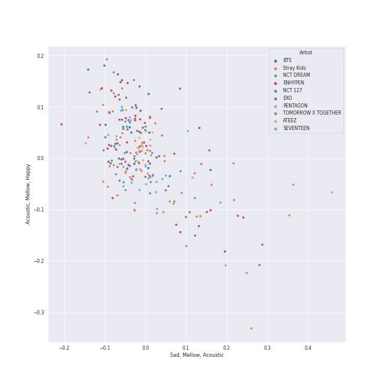
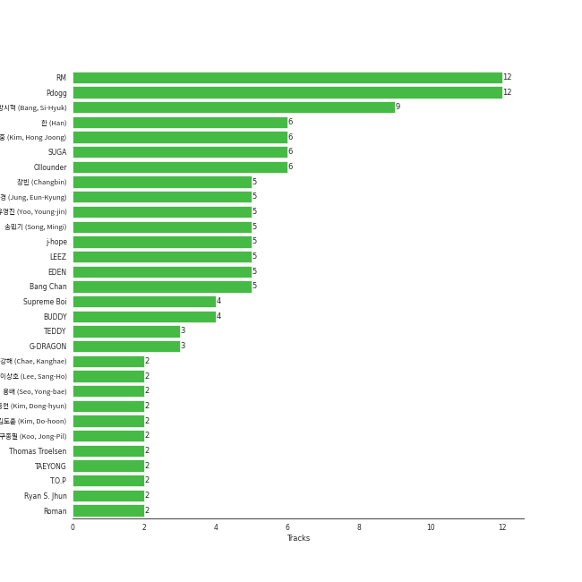
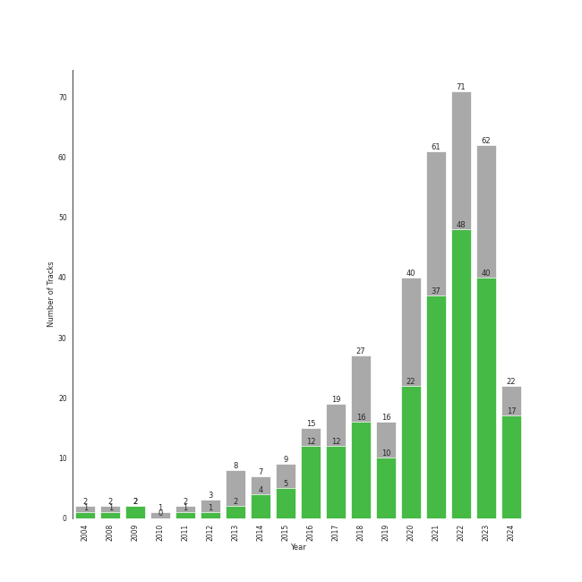

# k-pop boy group

343 songs

[See Track Features](audio_features.md)

[See Clusters](clusters/overview.md)

## Top Artists

| Art | Tracks | 💚 | Artist | 🔗 |
|:---|---:|---:|:---|:---|
|  | 38 | 28 | [ENHYPEN](../../artists/enhypen/overview.md) | [🔗](https://open.spotify.com/artist/5t5FqBwTcgKTaWmfEbwQY9) |
|  | 52 | 26 | [Stray Kids](../../artists/stray_kids/overview.md) | [🔗](https://open.spotify.com/artist/2dIgFjalVxs4ThymZ67YCE) |
|  | 36 | 22 | [BTS](../../artists/bts/overview.md) | [🔗](https://open.spotify.com/artist/3Nrfpe0tUJi4K4DXYWgMUX) |
|  | 21 | 12 | [SEVENTEEN](../../artists/seventeen/overview.md) | [🔗](https://open.spotify.com/artist/7nqOGRxlXj7N2JYbgNEjYH) |
|  | 15 | 8 | [EXO](../../artists/exo/overview.md) | [🔗](https://open.spotify.com/artist/3cjEqqelV9zb4BYE3qDQ4O) |
|  | 12 | 8 | [NCT DREAM](../../artists/nct_dream/overview.md) | [🔗](https://open.spotify.com/artist/1gBUSTR3TyDdTVFIaQnc02) |
|  | 10 | 8 | [NCT U](../../artists/nct_u/overview.md) | [🔗](https://open.spotify.com/artist/3paGCCtX1Xr4Gx53mSeZuQ) |
|  | 14 | 7 | [NCT 127](../../artists/nct_127/overview.md) | [🔗](https://open.spotify.com/artist/7f4ignuCJhLXfZ9giKT7rH) |
|  | 11 | 7 | [ATEEZ](../../artists/ateez/overview.md) | [🔗](https://open.spotify.com/artist/68KmkJeZGfwe1OUaivBa2L) |
|  | 11 | 7 | [TOMORROW X TOGETHER](../../artists/tomorrow_x_together/overview.md) | [🔗](https://open.spotify.com/artist/0ghlgldX5Dd6720Q3qFyQB) |

See all 65 artists

| Art | Tracks | 💚 | Artist | 🔗 |
|:---|---:|---:|:---|:---|
|  | 10 | 7 | [PENTAGON](../../artists/pentagon/overview.md) | [🔗](https://open.spotify.com/artist/1wKpMkucynaTfG8lyPprYV) |
|  | 8 | 6 | [TVXQ!](../../artists/tvxq!/overview.md) | [🔗](https://open.spotify.com/artist/6nVMMEywS5Y4tsHPKx1nIo) |
|  | 8 | 6 | [TREASURE](../../artists/treasure/overview.md) | [🔗](https://open.spotify.com/artist/3KonOYiLsU53m4yT7gNotP) |
|  | 8 | 6 | [P1Harmony](../../artists/p1harmony/overview.md) | [🔗](https://open.spotify.com/artist/3JjvsPeGMbDJqsphe2z8xU) |
|  | 7 | 6 | [SUPER JUNIOR](../../artists/super_junior/overview.md) | [🔗](https://open.spotify.com/artist/6gzXCdfYfFe5XKhPKkYqxV) |
|  | 8 | 5 | [SHINee](../../artists/shinee/overview.md) | [🔗](https://open.spotify.com/artist/2hRQKC0gqlZGPrmUKbcchR) |
|  | 6 | 5 | [The Rose](../../artists/the_rose/overview.md) | [🔗](https://open.spotify.com/artist/5na1LmEmK2VzNLje9snJYW) |
|  | 5 | 4 | BIGBANG | [🔗](https://open.spotify.com/artist/4Kxlr1PRlDKEB0ekOCyHgX) |
|  | 6 | 3 | GOT7 | [🔗](https://open.spotify.com/artist/6nfDaffa50mKtEOwR8g4df) |
|  | 3 | 3 | MONSTA X | [🔗](https://open.spotify.com/artist/4TnGh5PKbSjpYqpIdlW5nz) |
|  | 3 | 3 | NCT | [🔗](https://open.spotify.com/artist/48eO052eSDcn8aTxiv6QaG) |
|  | 3 | 3 | BLITZERS | [🔗](https://open.spotify.com/artist/3Exoh42YMeqnUvYahAGgUE) |
|  | 9 | 2 | THE BOYZ | [🔗](https://open.spotify.com/artist/0CmvFWTX9zmMNCUi6fHtAx) |
|  | 4 | 2 | iKON | [🔗](https://open.spotify.com/artist/5qRSs6mvI17zrkJpOHkCoM) |
|  | 2 | 2 | ONEUS | [🔗](https://open.spotify.com/artist/3CVYSpM7nfHFG5qCTW7Ht9) |
|  | 2 | 1 | WINNER | [🔗](https://open.spotify.com/artist/5DuzBeOgFwViFcv00Q5PFb) |
|  | 2 | 1 | VIXX | [🔗](https://open.spotify.com/artist/5BkB3rXc0qIdUtuEnhbK0A) |
|  | 2 | 1 | AB6IX | [🔗](https://open.spotify.com/artist/4y0wFJ5jmCUNRLZfsw1I7g) |
|  | 2 | 1 | EPEX | [🔗](https://open.spotify.com/artist/4e2umhzNHTSeQnSCWPN0uT) |
|  | 2 | 1 | Block B | [🔗](https://open.spotify.com/artist/4RnezwRV7VBJUCI1S0AE5u) |
|  | 2 | 1 | Xdinary Heroes | [🔗](https://open.spotify.com/artist/1khChLj7REGqjM043PlYyn) |
|  | 2 | 1 | VERIVERY | [🔗](https://open.spotify.com/artist/1fWUcRSok57yRm8gPKj1Fc) |
|  | 1 | 1 | 8TURN | [🔗](https://open.spotify.com/artist/7tCg9aiVKZ5Cmhbfb7UoqM) |
|  | 1 | 1 | Play-N-Skillz | [🔗](https://open.spotify.com/artist/7MP4jhYmFEgb0AtiOkw55s) |
|  | 1 | 1 | Leslie Grace | [🔗](https://open.spotify.com/artist/6BeO1KuAWBqFriL1mLHtNc) |
|  | 1 | 1 | DAY6 | [🔗](https://open.spotify.com/artist/5TnQc2N1iKlFjYD7CPGvFc) |
| | 1 | 1 | Bang Chan | [🔗](https://open.spotify.com/artist/4qy7HANJDOZRObts4Z0KSV) |
|  | 1 | 1 | Changbin (Stray Kids) | [🔗](https://open.spotify.com/artist/3XSid6KaiKoMAVZs2ug3yw) |
| | 1 | 1 | En Butter | [🔗](https://open.spotify.com/artist/3X6XIt8zNXvrNzxb1R8TW5) |
|  | 1 | 1 | TAN | [🔗](https://open.spotify.com/artist/34Ecdzh8yGKt2YvPG37PKu) |
| | 1 | 1 | Overdose | [🔗](https://open.spotify.com/artist/32jdgEsyvdXqUoReMyR0gl) |
|  | 1 | 1 | DKZ | [🔗](https://open.spotify.com/artist/31eyTcfjAke5hFX3az3nRE) |
|  | 1 | 1 | Seori | [🔗](https://open.spotify.com/artist/2bWTIIQP9zaVc55RaMGu7e) |
|  | 1 | 1 | Wanna One | [🔗](https://open.spotify.com/artist/2CvaqAMMsX576VBehaJ0Wx) |
|  | 1 | 1 | LiSA | [🔗](https://open.spotify.com/artist/0blbVefuxOGltDBa00dspv) |
|  | 1 | 1 | NCT DOJAEJUNG | [🔗](https://open.spotify.com/artist/0W0w607z3JEA1vXLz9FVGw) |
|  | 3 | 0 | BTOB | [🔗](https://open.spotify.com/artist/2hcsKca6hCfFMwwdbFvenJ) |
|  | 2 | 0 | Steve Aoki | [🔗](https://open.spotify.com/artist/77AiFEVeAVj2ORpC85QVJs) |
|  | 1 | 0 | Pinkfong | [🔗](https://open.spotify.com/artist/7cTXfwpe9peK0UE1bZyIWZ) |
| | 1 | 0 | NINTYSIX | [🔗](https://open.spotify.com/artist/6PR5lyCpN2aFKgHUvY9B3O) |
|  | 1 | 0 | 2PM | [🔗](https://open.spotify.com/artist/5iRPbkcPmqAFFwDUj6ywVS) |
|  | 1 | 0 | ASTRO | [🔗](https://open.spotify.com/artist/4pz4uzOMpJQyV8UTsDy4H8) |
|  | 1 | 0 | [BoA](../../artists/boa/overview.md) | [🔗](https://open.spotify.com/artist/4muJrGMndyYWqZtfk8OWy4) |
|  | 1 | 0 | DKB | [🔗](https://open.spotify.com/artist/4DoedGw38ubJdAT1edFsIx) |
|  | 1 | 0 | BOYS PLANET | [🔗](https://open.spotify.com/artist/49pGKUCSjzaCfv8gdTWG98) |
|  | 1 | 0 | The Cast of Baby Shark's Big Movie | [🔗](https://open.spotify.com/artist/2qlOwH6ICaEw63LMC3bBVR) |
|  | 1 | 0 | JUST B | [🔗](https://open.spotify.com/artist/2f0bPttugNpkg34HIxBIWe) |
|  | 1 | 0 | Halsey | [🔗](https://open.spotify.com/artist/26VFTg2z8YR0cCuwLzESi2) |
|  | 1 | 0 | Beast | [🔗](https://open.spotify.com/artist/1Pr9gT0veB2tgcisQeIGoC) |
|  | 1 | 0 | Ciipher | [🔗](https://open.spotify.com/artist/18VvNIaKQgZXhSBnu7p5z7) |
|  | 1 | 0 | Tiger JK | [🔗](https://open.spotify.com/artist/11S00dFcvNvJahis8MTGMD) |
|  | 1 | 0 | KINGDOM | [🔗](https://open.spotify.com/artist/0p5Ot7c8cFHtS82hd1WBN3) |
|  | 1 | 0 | E'LAST | [🔗](https://open.spotify.com/artist/0NztgA9b1KEJLjLVqMwd9y) |
|  | 1 | 0 | THE NEW SIX | [🔗](https://open.spotify.com/artist/0DRiXmEOc6dJ6Rug3xi4HZ) |
|  | 1 | 0 | TRAX | [🔗](https://open.spotify.com/artist/05IXIcHMbO6RMnJ6uQPrmP) |

## Most and least listened tracks
| ​ | Most listened tracks | Score | ​​ | Least listened tracks | Score |
|:---|:---|---:|:---|:---|---:|
|  | [Left & Right](../../artists/seventeen/overview.md) | 53775 |  | [MIC Drop (Steve Aoki Remix) - Full Length Edition](../../artists/bts/overview.md) | 0 |
|  | [ParadoXXX Invasion](../../artists/enhypen/overview.md) | 40932 |  | [SUPER BOARD](../../artists/stray_kids/overview.md) | 0 |
|  | [BOOM](../../artists/nct_dream/overview.md) | 33600 |  | [Beatbox](../../artists/nct_dream/overview.md) | 0 |
|  | [Love Shot](../../artists/exo/overview.md) | 32832 |  | [Ridin'](../../artists/nct_dream/overview.md) | 0 |
|  | [Thunderous](../../artists/stray_kids/overview.md) | 22317 |  | PHOTO | 0 |
|  | [HOME;RUN](../../artists/seventeen/overview.md) | 11740 |  | [Gold Dust](../../artists/nct_127/overview.md) | 0 |
|  | [Sacrifice (Eat Me Up)](../../artists/enhypen/overview.md) | 8670 |  | [Paradise](../../artists/exo/overview.md) | 0 |
|  | [HALAZIA](../../artists/ateez/overview.md) | 7194 |  | BLACK MIRROR | 0 |
|  | [Bills](../../artists/enhypen/overview.md) | 7125 |  | [Red Lights (Bang Chan, Hyunjin)](../../artists/stray_kids/overview.md) | 0 |
|  | [CRIMINAL LOVE](../../artists/enhypen/overview.md) | 6661 |  | [Mixtape : Time Out](../../artists/stray_kids/overview.md) | 0 |

## Top Albums

| Art | Tracks | 💚 | Album | Release Date | 🔗 |
|:---|---:|---:|:---|:---|:---|
|  | 9 | 3 | SKZ-REPLAY | 2022-12-21 | [🔗](https://open.spotify.com/album/3UXrliH0JUQvcaLnBD8Txz) |
|  | 6 | 4 | NOEASY | 2021-08-23 | [🔗](https://open.spotify.com/album/558tpdCejjVQNFAumRAeQj) |
|  | 5 | 5 | DIMENSION : DILEMMA | 2021-10-12 | [🔗](https://open.spotify.com/album/5jGRqioNCSWZGBl3QmyuFI) |
|  | 5 | 3 | ODDINARY | 2022-03-18 | [🔗](https://open.spotify.com/album/0Gmf4pfe0POEQq2FgGAj2q) |
|  | 4 | 4 | MANIFESTO : DAY 1 | 2022-07-04 | [🔗](https://open.spotify.com/album/5J8MNLLViH5zqM6VoGErz8) |
|  | 4 | 4 | DARK BLOOD | 2023-05-22 | [🔗](https://open.spotify.com/album/7q65W5gVANjh1j1KXLeU0f) |
|  | 4 | 3 | ROCK-STAR | 2023-11-10 | [🔗](https://open.spotify.com/album/0aJnGEZWIc1VCYlZOXv05a) |
|  | 4 | 3 | ORANGE BLOOD | 2023-11-17 | [🔗](https://open.spotify.com/album/7dsAlxH9cMgyREm8OLdWWT) |
|  | 4 | 3 | MAP OF THE SOUL : 7 | 2020-02-21 | [🔗](https://open.spotify.com/album/5W1XY5ucNATjTULERvXx9j) |
|  | 4 | 3 | Love Yourself 轉 'Tear' | 2018-05-18 | [🔗](https://open.spotify.com/album/4NIqCxqP9o8Tp6tGLBqd8O) |

See top 100 albums

| Art | Tracks | 💚 | Album | Release Date | 🔗 |
|:---|---:|---:|:---|:---|:---|
|  | 4 | 3 | BORDER : DAY ONE | 2020-11-30 | [🔗](https://open.spotify.com/album/3YxF7jTnpdNepWbO42f8lH) |
|  | 4 | 3 | BORDER : CARNIVAL | 2021-04-26 | [🔗](https://open.spotify.com/album/4LGYBcRsteiXjcPD4QQvxv) |
|  | 4 | 2 | SEVENTEEN 4th Album 'Face the Sun' | 2022-05-27 | [🔗](https://open.spotify.com/album/4lfFgz2rD1irxf7dZhNJht) |
|  | 4 | 2 | MAXIDENT | 2022-10-07 | [🔗](https://open.spotify.com/album/0T6hYH0UyDjNraWZk2mZWi) |
|  | 4 | 2 | DIMENSION : ANSWER | 2022-01-10 | [🔗](https://open.spotify.com/album/3nOj9hsnptBEDt9ie2lra5) |
|  | 4 | 1 | Christmas EveL | 2021-11-29 | [🔗](https://open.spotify.com/album/1qVuQI0WRn2Mczbdxx54Ih) |
|  | 3 | 3 | NCT 2018 EMPATHY | 2018-03-14 | [🔗](https://open.spotify.com/album/3KAJvo62RNQEtXwIyB5rzX) |
|  | 3 | 3 | MADE | 2016-12-13 | [🔗](https://open.spotify.com/album/2SPrl8C8pgSM5gXbAiyJHY) |
|  | 3 | 3 | IN:VITE U | 2022-01-24 | [🔗](https://open.spotify.com/album/5vxZM8rFJiNvjtAThYnwek) |
|  | 3 | 3 | BE | 2020-11-20 | [🔗](https://open.spotify.com/album/6nYfHQnvkvOTNHnOhDT3sr) |
|  | 3 | 2 | The Most Beautiful Moment in Life: Young Forever | 2016-05-02 | [🔗](https://open.spotify.com/album/1k5bJ8l5oL5xxVBVHjil09) |
|  | 3 | 2 | The Chaos Chapter: FREEZE | 2021-05-31 | [🔗](https://open.spotify.com/album/5Zdr9vactwnJH4Vpe9Mid9) |
|  | 3 | 2 | THE SECOND STEP : CHAPTER ONE | 2022-02-15 | [🔗](https://open.spotify.com/album/17l09k7ZDb4GYwmsIVGcRZ) |
|  | 3 | 2 | SEVENTEEN 11th Mini Album 'SEVENTEENTH HEAVEN' | 2023-10-23 | [🔗](https://open.spotify.com/album/1rE0Gy69MFUh4GuXafWd0f) |
|  | 3 | 2 | Love Yourself 結 'Answer' | 2018-08-24 | [🔗](https://open.spotify.com/album/43wFM1HquliY3iwKWzPN4y) |
|  | 3 | 2 | Love Yourself 承 'Her' | 2017-09-18 | [🔗](https://open.spotify.com/album/2FTS6a6DLXMNp8flyA0HGO) |
|  | 3 | 2 | HARMONY : SET IN | 2022-11-30 | [🔗](https://open.spotify.com/album/1JDHisMjuJ1QkhcXiiLnnX) |
|  | 3 | 2 | BOYS PLANET - ARTIST BATTLE | 2023-04-06 | [🔗](https://open.spotify.com/album/1rIIbjGYbj2sRxAWZUfeoC) |
|  | 3 | 2 | 5-STAR | 2023-06-02 | [🔗](https://open.spotify.com/album/3Pel3gWsPxVpZVrciU0Fm6) |
|  | 3 | 2 | 2 Baddies - The 4th Album | 2022-09-16 | [🔗](https://open.spotify.com/album/6p80QT3z7kOHpYdnsItQTQ) |
|  | 3 | 1 | NCT RESONANCE Pt. 1 - The 2nd Album | 2020-10-12 | [🔗](https://open.spotify.com/album/6kudlOyCqSQfsBVSdPZEu4) |
|  | 3 | 1 | MAP OF THE SOUL : PERSONA | 2019-04-12 | [🔗](https://open.spotify.com/album/2KqlAl1Kl5fZvbFgJ0qFB6) |
|  | 3 | 1 | GO LIVE | 2020-06-17 | [🔗](https://open.spotify.com/album/6DWLIzvmiLPAuDWYZqrLQo) |
|  | 3 | 0 | DON'T FIGHT THE FEELING - Special Album | 2021-06-07 | [🔗](https://open.spotify.com/album/7Jw48lPmYuYftfQv5LmAzI) |
|  | 2 | 2 | Wings | 2016-10-10 | [🔗](https://open.spotify.com/album/1vhNGBTFoaSTLbHjPGFIlF) |
|  | 2 | 2 | Void | 2018-04-16 | [🔗](https://open.spotify.com/album/6kdRAzt9oU3X9eUdeTB0Yk) |
|  | 2 | 2 | The Name Chapter: TEMPTATION | 2023-01-27 | [🔗](https://open.spotify.com/album/7gkb4MxKe9rnoR3wxbJXJg) |
|  | 2 | 2 | THE WAR - The 4th Album | 2017-07-18 | [🔗](https://open.spotify.com/album/53pJcIJBdlm5rhVhjSnvHn) |
|  | 2 | 2 | Sticker - The 3rd Album | 2021-09-17 | [🔗](https://open.spotify.com/album/6nYbIKGcTmKM5BAlJPPcad) |
|  | 2 | 2 | SEVENTEEN 8th Mini Album 'Your Choice' | 2021-06-18 | [🔗](https://open.spotify.com/album/79VvXTQNeLr8KmvcdxN0Pc) |
|  | 2 | 2 | LOVE or TAKE | 2021-03-15 | [🔗](https://open.spotify.com/album/5iu1d69dqEo9UaKpZDYoIV) |
|  | 2 | 2 | IN LIFE | 2020-09-14 | [🔗](https://open.spotify.com/album/0aERWcI2KYSCM4biUihB9X) |
|  | 2 | 2 | Golden Age - The 4th Album | 2023-08-28 | [🔗](https://open.spotify.com/album/5mUo2e4QpUA7NJl2t51uFu) |
|  | 2 | 2 | 2ND FULL ALBUM 'REBOOT' | 2023-07-28 | [🔗](https://open.spotify.com/album/4gQx8IC4zESV506dgNs0vR) |
|  | 2 | 2 | 20&2 - The 9th Album | 2023-12-26 | [🔗](https://open.spotify.com/album/4I6px53lYqErgJcsJkUNlu) |
|  | 2 | 1 | THE WORLD EP.1 : MOVEMENT | 2022-07-29 | [🔗](https://open.spotify.com/album/3fgDrbflffzvV3H3plG9e6) |
|  | 2 | 1 | THE FIRST STEP : TREASURE EFFECT | 2021-01-11 | [🔗](https://open.spotify.com/album/5tQDFmW8QrZdTsICpLQBTL) |
|  | 2 | 1 | SEVENTEEN 10th Mini Album 'FML' | 2023-04-24 | [🔗](https://open.spotify.com/album/1JBzeeCJ3axQMVkqWbKh0I) |
|  | 2 | 1 | Return | 2018-01-25 | [🔗](https://open.spotify.com/album/7th9VLudqM04TpG8hNE1pb) |
|  | 2 | 1 | LOVE SHOT– The 5th Album Repackage | 2018-12-13 | [🔗](https://open.spotify.com/album/3r5m8utqRZYJnpep7xxVyq) |
|  | 2 | 1 | ISTJ - The 3rd Album | 2023-07-17 | [🔗](https://open.spotify.com/album/6RJlrKu60DPF6BMXVdotY7) |
|  | 2 | 1 | Heng:garæ | 2020-06-22 | [🔗](https://open.spotify.com/album/3q6lN3kfsDgGaQUC7kVASH) |
|  | 2 | 1 | Glitch Mode - The 2nd Album | 2022-03-28 | [🔗](https://open.spotify.com/album/4cAcTMGFjTBufC7Eu0FizU) |
|  | 2 | 0 | SKZ2020 | 2020-03-18 | [🔗](https://open.spotify.com/album/6QIWJVJPPgAA5c4aIb1zCA) |
|  | 2 | 0 | Dark & Wild | 2014-08-20 | [🔗](https://open.spotify.com/album/7FxxU3EP37uMsZf8FilkDR) |
|  | 2 | 0 | 2 Cool 4 Skool | 2013-06-12 | [🔗](https://open.spotify.com/album/26z5WolFltYgVMuuJ3c0Am) |
|  | 1 | 1 | 쏘리 쏘리 Sorry, Sorry - The 3rd Album | 2009-03-11 | [🔗](https://open.spotify.com/album/3v5XUoZzxbmJbxs7vWTua3) |
|  | 1 | 1 | minisode 2: Thursday's Child | 2022-05-09 | [🔗](https://open.spotify.com/album/1o8jYrnyZueTPIdhlHuTc8) |
|  | 1 | 1 | ZERO : FEVER Part.3 | 2021-09-13 | [🔗](https://open.spotify.com/album/5ozaWoYQScjFzGODcJmy3G) |
|  | 1 | 1 | You Never Walk Alone | 2017-02-13 | [🔗](https://open.spotify.com/album/6THpewjqJ15ORBJkh5CEYb) |
|  | 1 | 1 | We Boom - The 3rd Mini Album | 2019-07-26 | [🔗](https://open.spotify.com/album/31ln9LpD1WyhFlOvDp9YJc) |
|  | 1 | 1 | WIN-DOW | 2022-07-20 | [🔗](https://open.spotify.com/album/4dcwVvd7l0sAGBg0pSmKK2) |
|  | 1 | 1 | WE:TH | 2020-10-12 | [🔗](https://open.spotify.com/album/1ASYbBYBwV6Rcfc2ycqmlK) |
|  | 1 | 1 | Universe (Let's Play Ball) | 2021-12-10 | [🔗](https://open.spotify.com/album/31BJasH9nLradtMdJEIDXk) |
|  | 1 | 1 | There | 2023-02-15 | [🔗](https://open.spotify.com/album/2j8BoKqZrMUYTARDIs9XDk) |
|  | 1 | 1 | The Dream Chapter: MAGIC | 2019-10-21 | [🔗](https://open.spotify.com/album/5KoR6s906nbO21C9ZPdwTv) |
|  | 1 | 1 | The Chaos Chapter: FIGHT OR ESCAPE | 2021-08-17 | [🔗](https://open.spotify.com/album/2CjIfWoFITACUOlWGB7os5) |
|  | 1 | 1 | The 1st Album 'XOXO' (Repackage) | 2013-08-05 | [🔗](https://open.spotify.com/album/4qduCvpyBL5hGYdBvCvcDA) |
|  | 1 | 1 | TREASURE EPILOGUE : Action To Answer | 2020-01-06 | [🔗](https://open.spotify.com/album/3TTkDOcSzRQCvGMT7VmmPE) |
|  | 1 | 1 | TREASURE EP.FIN: All To Action | 2019-10-08 | [🔗](https://open.spotify.com/album/4HGhzqQEY1X6WWZw6MhjlO) |
|  | 1 | 1 | THE SECOND STEP : CHAPTER TWO | 2022-10-04 | [🔗](https://open.spotify.com/album/4l5YvRcmno5RMKZCZp1j0g) |
|  | 1 | 1 | THE CODE | 2017-11-07 | [🔗](https://open.spotify.com/album/4NJpBKY4XJbRLAsbbeIzyJ) |
|  | 1 | 1 | THE BOYZ 6TH MINI ALBUM [THRILL-ING] | 2021-08-09 | [🔗](https://open.spotify.com/album/0lh0pZ8GjZGrAhzIG4Jn0E) |
|  | 1 | 1 | THE BOYZ 2ND ALBUM [PHANTASY] Pt.1 Christmas In August | 2023-08-07 | [🔗](https://open.spotify.com/album/6j0bF8s6Kptbr4y8tuIhOY) |
|  | 1 | 1 | Street Man Fighter Original Vol.4 (Crew Songs) | 2022-09-20 | [🔗](https://open.spotify.com/album/7dwRGP1A80POqE3O9At5Vw) |
|  | 1 | 1 | Still Life | 2022-04-05 | [🔗](https://open.spotify.com/album/2oCAY48bhZvQte0l7apmYC) |
|  | 1 | 1 | Sorry | 2017-08-03 | [🔗](https://open.spotify.com/album/6D48tHXsa6LzoViDIACdkt) |
|  | 1 | 1 | Skool Luv Affair | 2014-02-12 | [🔗](https://open.spotify.com/album/5r35iS0uSSoQBKzQj0IeI3) |
|  | 1 | 1 | Season Songs | 2021-08-16 | [🔗](https://open.spotify.com/album/7o5jeWeyGW3Nb77WhmVPwJ) |
|  | 1 | 1 | SUNRISE | 2017-06-07 | [🔗](https://open.spotify.com/album/4B2Ijqpz9hRDqWraaDxLSS) |
|  | 1 | 1 | SPIN OFF : FROM THE WITNESS | 2022-12-30 | [🔗](https://open.spotify.com/album/0NQQk6vo9LOOwKjZc2iUwm) |
|  | 1 | 1 | SHINee The 3rd Album 'The Misconceptions Of Us' | 2013-08-08 | [🔗](https://open.spotify.com/album/0f0brenHcU2NmUANeix9rN) |
|  | 1 | 1 | SEVENTEEN 9th Mini Album 'Attacca' | 2021-10-22 | [🔗](https://open.spotify.com/album/2PIReru2w5i4JXOzeZnamd) |
|  | 1 | 1 | SEVENTEEN 4th Mini Album ‘Al1’ | 2017-05-22 | [🔗](https://open.spotify.com/album/2BNimvLLlD89e4Sb7ZVX6I) |
|  | 1 | 1 | SEVENTEEN 1ST ALBUM [FIRST ‘LOVE&LETTER’] | 2016-04-25 | [🔗](https://open.spotify.com/album/50BrkBakrLWufmTLjCVBwn) |
|  | 1 | 1 | Reload | 2020-04-29 | [🔗](https://open.spotify.com/album/1V5ilz8ghPl1PZJA1hbw3r) |
|  | 1 | 1 | REPLAY - The 8th Repackage Album | 2018-04-12 | [🔗](https://open.spotify.com/album/5uxH9so2Yrmi6nLClUZJkv) |
|  | 1 | 1 | RED | 2019-08-13 | [🔗](https://open.spotify.com/album/5CrMZwZuJcDpzFmMO35vxN) |
|  | 1 | 1 | REASON | 2023-01-09 | [🔗](https://open.spotify.com/album/5evr2BAxQmxyF8dZyaezzS) |
|  | 1 | 1 | Proof | 2022-06-10 | [🔗](https://open.spotify.com/album/6al2VdKbb6FIz9d7lU7WRB) |
|  | 1 | 1 | Positive | 2018-04-02 | [🔗](https://open.spotify.com/album/1ZRmLzZWvOkSqWePzFeekO) |
|  | 1 | 1 | Perfume - The 1st Mini Album | 2023-04-17 | [🔗](https://open.spotify.com/album/3sVBVr420an61GAwib9AYk) |
|  | 1 | 1 | PLAY - The 8th Album | 2017-11-06 | [🔗](https://open.spotify.com/album/1F7DAPXJpLVKfyZFSFsrCw) |
|  | 1 | 1 | One of a Kind | 2021-06-01 | [🔗](https://open.spotify.com/album/2Zuovdo5g1RhfbHniwZ8yI) |
|  | 1 | 1 | One and Only | 2023-07-11 | [🔗](https://open.spotify.com/album/5LGe47qZJTNwtM8gUfT7Mx) |
|  | 1 | 1 | One In A Billion | 2022-09-06 | [🔗](https://open.spotify.com/album/19Jm8Jk0zQYs6zMaxhYJFd) |
|  | 1 | 1 | Odd - The 4th Album | 2015-05-18 | [🔗](https://open.spotify.com/album/47zSQLQWjPLmiEbCpOOEJa) |
|  | 1 | 1 | New Chapter #1: The Chance of Love - The 8th Album | 2018-03-28 | [🔗](https://open.spotify.com/album/0ipyHYAE0cMf4aDJNIDIU1) |
|  | 1 | 1 | NEW KIDS REPACKAGE : THE NEW KIDS | 2019-01-07 | [🔗](https://open.spotify.com/album/6RZYa7F18bu7mmeT8qxWqh) |
|  | 1 | 1 | NCT RESONANCE Pt. 2 - The 2nd Album | 2020-11-23 | [🔗](https://open.spotify.com/album/5Dq6jkYO5H7KzxXSazhLxs) |

## Top Record Labels

| Tracks | 💚 | Label |
|---:|---:|:---|
| 73 | 49 | [SM Entertainment](../../labels/sm_entertainment/overview.md) |
| 60 | 29 | [Republic Records](../../labels/republic_records/overview.md) |
| 31 | 26 | [BELIFT LAB](../../labels/belift_lab/overview.md) |
| 35 | 22 | [BIGHIT MUSIC](../../labels/bighit_music/overview.md) |
| 19 | 13 | [YG Entertainment](../../labels/yg_entertainment/overview.md) |
| 21 | 12 | [PLEDIS Entertainment](../../labels/pledis_entertainment/overview.md) |
| 17 | 9 | [Genie Music Corporation](../../labels/genie_music_corporation/overview.md) |
| 12 | 6 | [Stone Music Entertainment](../../labels/stone_music_entertainment/overview.md) |
| 10 | 6 | [KQ Entertainment](../../labels/kq_entertainment/overview.md) |
| 7 | 6 | [FNC ENTERTAINMENT](../../labels/fnc_entertainment/overview.md) |

See all 42 labels

| Tracks | 💚 | Label |
|---:|---:|:---|
| 9 | 5 | [Universal Music LLC](../../labels/universal_music_llc/overview.md) |
| 8 | 4 | [JYP Entertainment](../../labels/jyp_entertainment/overview.md) |
| 7 | 4 | [CUBE ENTERTAINMENT](../../labels/cube_entertainment/overview.md) |
| 9 | 3 | [HYBE](../../labels/hybe/overview.md) |
| 3 | 3 | 우조엔터테인먼트 |
| 3 | 3 | [Starship Entertainment](../../labels/starship_entertainment/overview.md) |
| 5 | 2 | [WM Korea](../../labels/wm_korea/overview.md) |
| 2 | 2 | [Sony Music Labels Inc.](../../labels/sony_music_labels_inc_/overview.md) |
| 2 | 2 | [RBW Inc.](../../labels/rbw_inc_/overview.md) |
| 2 | 2 | RADCOMM |
| 2 | 2 | [Columbia](../../labels/columbia/overview.md) |
| 4 | 1 | Cre.ker Entertainment |
| 3 | 1 | JELLYFISH ENTERTAINMENT |
| 3 | 1 | IST Entertainment |
| 1 | 1 | ㈜ 동요엔터테인먼트 |
| 1 | 1 | Transparent Arts |
| 1 | 1 | Think Ent. |
| 1 | 1 | TURBO JK Company |
| 1 | 1 | Imperial Distribution |
| 1 | 1 | CJ E&M MUSIC |
| 1 | 1 | C9 Entertainment |
| 2 | 0 | [avex trax](../../labels/avex_trax/overview.md) |
| 2 | 0 | ICONIX CO. |
| 1 | 0 | 블루닷엔터테인먼트 |
| 1 | 0 | 브레이브 엔터테인먼트 |
| 1 | 0 | RAIN COMPANY Co. |
| 1 | 0 | Quarter Music |
| 1 | 0 | Pinkfong |
| 1 | 0 | Klap |
| 1 | 0 | ICONIX |
| 1 | 0 | Fantagio |
| 1 | 0 | ADA Korea |

## Top Producers

| Art | Producer | Tracks | Credit Types |
|:---|:---|---:|:---|
| | Pdogg | 11 | Producer, Songwriter, Arranger |
|  | RM | 11 | Songwriter, Arranger, Producer, Lyricist |
| | 방시혁 (Bang, Si-Hyuk) | 8 | Songwriter |
|  | SUGA | 6 | Songwriter |
| | 김홍중 (Kim, Hong Joong) | 4 | Songwriter, Lyricist |
| | 정은경 (Jung, Eun-Kyung) | 4 | Producer, Arranger |
| | Ollounder | 4 | Arranger, Songwriter, Lyricist |
|  | [j-hope](../../artists/j-hope/overview.md) | 4 | Songwriter |
|  | G-DRAGON | 3 | Lyricist, Songwriter |
| | EDEN | 3 | Arranger, Songwriter, Lyricist |

View all

| Art | Producer | Tracks | Credit Types |
|:---|:---|---:|:---|
| | LEEZ | 3 | Arranger, Songwriter, Lyricist |
| | 송민기 (Song, Mingi) | 3 | Songwriter, Lyricist |
| | TEDDY | 3 | Arranger, Lyricist, Songwriter |
| | Supreme Boi | 3 | Songwriter |
| | 한 (Han) | 2 | Songwriter, Lyricist |
| | Jacob Richards | 2 | Producer |
| | BUDDY | 2 | Arranger, Songwriter, Lyricist |
| | Ali Tamposi | 2 | Songwriter |
| | Bang Chan | 2 | Arranger, Songwriter, Lyricist |
| | Melanie Joy Fontana | 2 | Songwriter |
| | 구종필 (Koo, Jong-Pil) | 2 | Producer |
| | T.O.P | 2 | Lyricist |
| | DJ Riggins | 2 | Producer |
| | Jang Yi-jeong | 2 | Producer |
| | Max Seaberg | 2 | Producer |
| | Jaycen Joshua | 2 | Producer |
| | Arschtritt Lindgren | 2 | Songwriter |
|  | ADORA | 2 | Producer |
| | Roman | 2 | Songwriter |
| | 창빈 (Changbin) | 2 | Songwriter, Lyricist |
|  | TAEYONG | 2 | Lyricist, Songwriter |
| | August Rigo | 2 | Songwriter |
|  | MARK | 2 | Lyricist, Songwriter |
| | Chizzy | 1 | Songwriter |
| | Tom Norris | 1 | Producer |
| | 조진주 (Jo, Jinju) | 1 | Songwriter |
| | Hiss noise | 1 | Producer |
| | Erik Reichers | 1 | Producer |
| | Arcades | 1 | Producer |
| | DJ Swivel | 1 | Producer, Songwriter |
| | Steven Battey | 1 | Songwriter |
| | Camilla Anne Stewart | 1 | Songwriter |
| | Marcus McCoan | 1 | Producer, Songwriter |
| | 春虎 (Watanabe, Haruto) | 1 | Lyricist |
| | Krysta Youngs | 1 | Songwriter |
| | Mike Jay | 1 | Songwriter |
| | Tay Jasper | 1 | Songwriter |
| | MZMC | 1 | Songwriter |
| | Julia Ross | 1 | Songwriter |
| | Charlie J. Perry | 1 | Producer, Songwriter |
|  | Jimin | 1 | Songwriter |
|  | TAEYANG | 1 | Songwriter |
| | かねもと よしのり (Kanemoto Yoshinori) | 1 | Lyricist |
| | Antonina Armato | 1 | Songwriter |
| | Peperoni | 1 | Arranger, Songwriter |
| | DOCSKIM | 1 | Songwriter |
| | 정소리 (Jeong, So-ri) | 1 | Arranger |
| | Kass | 1 | Songwriter |
| | dae Jung | 1 | Songwriter |
| | Matt Thomson | 1 | Songwriter |
| | Clyde Kelly | 1 | Songwriter |
| | Phil Tan | 1 | Producer |
| | Frants | 1 | Producer |
| | 정의석 (Jung, Euisuk) | 1 | Producer |
| | Lutra | 1 | Songwriter |
| | Gavin Jones | 1 | Songwriter |
| | Ryan Lawrie | 1 | Songwriter |
| | Oliv | 1 | Arranger, Songwriter |
|  | SUMIN | 1 | Songwriter |
| | Hilda Stenmalm | 1 | Songwriter |
| | Max Graham | 1 | Songwriter |
| | C. Minor | 1 | Songwriter |
|  | [YENA](../../artists/yena/overview.md) | 1 | Arranger |
| | Sebastian Garcia | 1 | Songwriter |
| | Liza Owen | 1 | Songwriter |
| | Carlos Battey | 1 | Songwriter |
| | Neon Boy | 1 | Songwriter |
| | 현석 (Hyunsuk) | 1 | Lyricist |
| | 김도훈 (Kim, Do-hoon) | 1 | Songwriter |
| | Jay Dmuchowski | 1 | Songwriter |
| | Vince Nantes | 1 | Songwriter |
| | Fallin' Dild | 1 | Songwriter |
| | David Stewart | 1 | Songwriter |
| | BUMZU | 1 | Arranger |
| | Candace Sosa | 1 | Songwriter |
| | Alex Williams | 1 | Producer |
| | danke | 1 | Songwriter |
| | Maddox | 1 | Arranger, Lyricist, Songwriter |
| | Jessica Agombar | 1 | Songwriter |
| | Jenna Andrews | 1 | Songwriter |
| | HotSauce | 1 | Arranger, Songwriter |
| | R.Tee | 1 | Arranger, Lyricist, Songwriter |
| | Stephen Kirk | 1 | Songwriter |
| | 김수정 (김수정) | 1 | Producer |
| | 1월 8일 (1월 8일) | 1 | Songwriter |
| | Rob Grimaldi | 1 | Songwriter |
| | Ron Perry | 1 | Songwriter |
| | Bill Zimmerman | 1 | Producer |
| | Tom Wiklund | 1 | Producer, Songwriter |
| | 김동현 (Kim, Dong-hyun) | 1 | Songwriter |

## Years

| ​ | 10 newest albums | ​​ | 10 oldest albums |
|:---|:---|:---|:---|
|  | What Makes You Beautiful [THE SEASONS: Red Carpet with Lee Hyo Ri] (2024-02-23) |  | Hug (2004-01-14) |
|  | Killin' It (2024-02-05) |  | TRI-ANGLE - 1st Album (2004-10-01) |
|  | 20&2 - The 9th Album (2023-12-26) |  | The SHINee World - The First Album (2008-08-28) |
|  | ORANGE BLOOD (2023-11-17) |  | MIROTIC - The 4th Album (2008-09-26) |
|  | ROCK-STAR (2023-11-10) |  | 쏘리 쏘리 Sorry, Sorry - The 3rd Album (2009-03-11) |
|  | Keep Swimmin' Through (2023-11-03) |  | 2009, Year Of Us - The Third Mini Album (2009-10-19) |
|  | SEVENTEEN 11th Mini Album 'SEVENTEENTH HEAVEN' (2023-10-23) |  | Lucifer - The 2nd Album (2010-07-19) |
|  | Livelock (2023-10-11) |  | Fiction And Fact (2011-05-17) |
|  | ÷ (NANUGI) (2023-10-09) |  | Mr. Simple - The 5th Album (2011-08-02) |
|  | Fact Check - The 5th Album (2023-10-06) |  | ALIVE (2012-02-29) |

