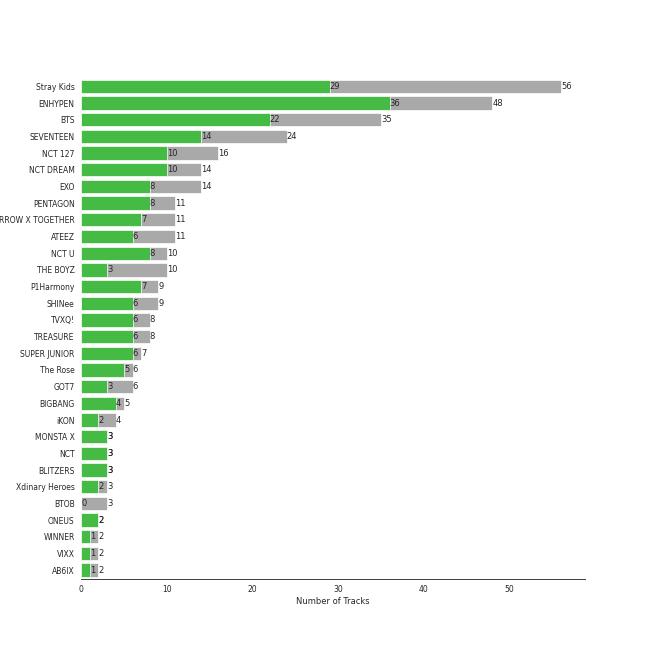
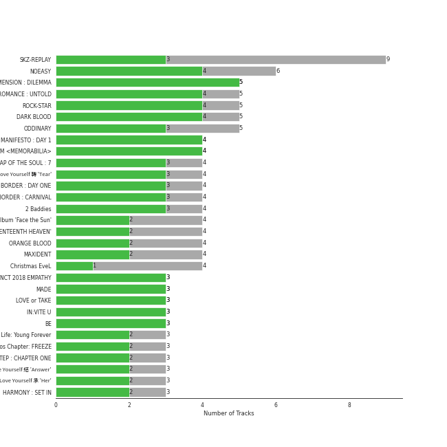
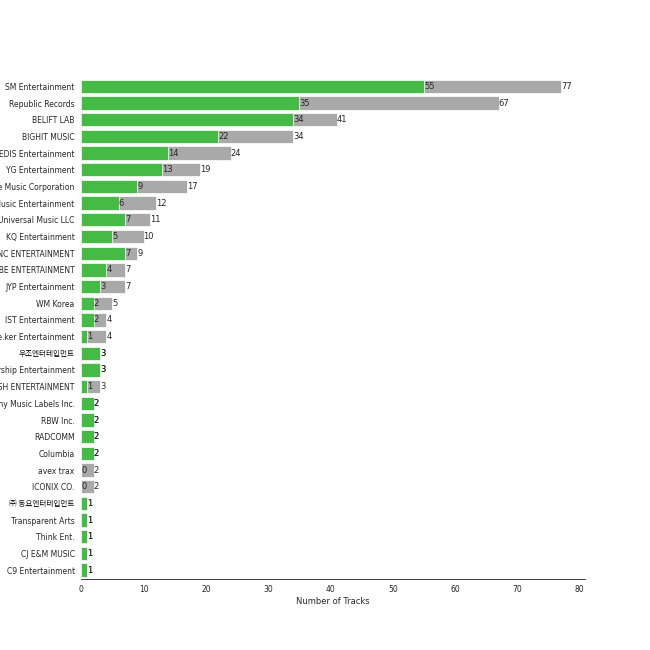

# k-pop boy group

367 songs

[See Track Features](audio_features.md)

[See Clusters](clusters/overview.md)

## Top Artists

| Art | Rank | Tracks | 💚 | Artist | 🔗 |
|:---|---:|---:|---:|:---|:---|
|  | 7 | 47 | 36 | [ENHYPEN](../../artists/enhypen/overview.md) | [🔗](https://open.spotify.com/artist/5t5FqBwTcgKTaWmfEbwQY9) |
|  | 10 | 56 | 29 | [Stray Kids](../../artists/stray_kids/overview.md) | [🔗](https://open.spotify.com/artist/2dIgFjalVxs4ThymZ67YCE) |
|  | 27 | 35 | 22 | [BTS](../../artists/bts/overview.md) | [🔗](https://open.spotify.com/artist/3Nrfpe0tUJi4K4DXYWgMUX) |
|  | 12 | 24 | 14 | [SEVENTEEN](../../artists/seventeen/overview.md) | [🔗](https://open.spotify.com/artist/7nqOGRxlXj7N2JYbgNEjYH) |
|  | 30 | 16 | 10 | [NCT 127](../../artists/nct_127/overview.md) | [🔗](https://open.spotify.com/artist/7f4ignuCJhLXfZ9giKT7rH) |
|  | 25 | 14 | 10 | [NCT DREAM](../../artists/nct_dream/overview.md) | [🔗](https://open.spotify.com/artist/1gBUSTR3TyDdTVFIaQnc02) |
|  | 21 | 14 | 8 | [EXO](../../artists/exo/overview.md) | [🔗](https://open.spotify.com/artist/3cjEqqelV9zb4BYE3qDQ4O) |
|  | 68 | 11 | 8 | [PENTAGON](../../artists/pentagon/overview.md) | [🔗](https://open.spotify.com/artist/1wKpMkucynaTfG8lyPprYV) |
|  | 243 | 10 | 8 | [NCT U](../../artists/nct_u/overview.md) | [🔗](https://open.spotify.com/artist/3paGCCtX1Xr4Gx53mSeZuQ) |
|  | 148 | 11 | 7 | [TOMORROW X TOGETHER](../../artists/tomorrow_x_together/overview.md) | [🔗](https://open.spotify.com/artist/0ghlgldX5Dd6720Q3qFyQB) |

See all 67 artists

| Art | Rank | Tracks | 💚 | Artist | 🔗 |
|:---|---:|---:|---:|:---|:---|
|  | 46 | 11 | 6 | [ATEEZ](../../artists/ateez/overview.md) | [🔗](https://open.spotify.com/artist/68KmkJeZGfwe1OUaivBa2L) |
|  | 100 | 9 | 6 | [SHINee](../../artists/shinee/overview.md) | [🔗](https://open.spotify.com/artist/2hRQKC0gqlZGPrmUKbcchR) |
|  | 156 | 8 | 6 | [TVXQ!](../../artists/tvxq!/overview.md) | [🔗](https://open.spotify.com/artist/6nVMMEywS5Y4tsHPKx1nIo) |
|  | 73 | 8 | 6 | [TREASURE](../../artists/treasure/overview.md) | [🔗](https://open.spotify.com/artist/3KonOYiLsU53m4yT7gNotP) |
|  | 114 | 8 | 6 | [P1Harmony](../../artists/p1harmony/overview.md) | [🔗](https://open.spotify.com/artist/3JjvsPeGMbDJqsphe2z8xU) |
|  | 85 | 7 | 6 | [SUPER JUNIOR](../../artists/super_junior/overview.md) | [🔗](https://open.spotify.com/artist/6gzXCdfYfFe5XKhPKkYqxV) |
|  | 421 | 6 | 5 | [The Rose](../../artists/the_rose/overview.md) | [🔗](https://open.spotify.com/artist/5na1LmEmK2VzNLje9snJYW) |
|  | 172 | 5 | 4 | BIGBANG | [🔗](https://open.spotify.com/artist/4Kxlr1PRlDKEB0ekOCyHgX) |
|  | 123 | 10 | 3 | [THE BOYZ](../../artists/the_boyz/overview.md) | [🔗](https://open.spotify.com/artist/0CmvFWTX9zmMNCUi6fHtAx) |
|  | 421 | 6 | 3 | GOT7 | [🔗](https://open.spotify.com/artist/6nfDaffa50mKtEOwR8g4df) |
|  | 187 | 3 | 3 | MONSTA X | [🔗](https://open.spotify.com/artist/4TnGh5PKbSjpYqpIdlW5nz) |
|  | 350 | 3 | 3 | NCT | [🔗](https://open.spotify.com/artist/48eO052eSDcn8aTxiv6QaG) |
|  | 175 | 3 | 3 | BLITZERS | [🔗](https://open.spotify.com/artist/3Exoh42YMeqnUvYahAGgUE) |
|  | 347 | 4 | 2 | iKON | [🔗](https://open.spotify.com/artist/5qRSs6mvI17zrkJpOHkCoM) |
|  | 386 | 3 | 2 | Xdinary Heroes | [🔗](https://open.spotify.com/artist/1khChLj7REGqjM043PlYyn) |
|  | 240 | 2 | 2 | ONEUS | [🔗](https://open.spotify.com/artist/3CVYSpM7nfHFG5qCTW7Ht9) |
|  | 421 | 2 | 1 | WINNER | [🔗](https://open.spotify.com/artist/5DuzBeOgFwViFcv00Q5PFb) |
|  | 421 | 2 | 1 | VIXX | [🔗](https://open.spotify.com/artist/5BkB3rXc0qIdUtuEnhbK0A) |
|  | 421 | 2 | 1 | AB6IX | [🔗](https://open.spotify.com/artist/4y0wFJ5jmCUNRLZfsw1I7g) |
|  | 133 | 2 | 1 | EPEX | [🔗](https://open.spotify.com/artist/4e2umhzNHTSeQnSCWPN0uT) |
|  | 421 | 2 | 1 | Block B | [🔗](https://open.spotify.com/artist/4RnezwRV7VBJUCI1S0AE5u) |
|  | 421 | 2 | 1 | VERIVERY | [🔗](https://open.spotify.com/artist/1fWUcRSok57yRm8gPKj1Fc) |
|  | 421 | 1 | 1 | 8TURN | [🔗](https://open.spotify.com/artist/7tCg9aiVKZ5Cmhbfb7UoqM) |
|  | 421 | 1 | 1 | Play-N-Skillz | [🔗](https://open.spotify.com/artist/7MP4jhYmFEgb0AtiOkw55s) |
|  | 421 | 1 | 1 | Leslie Grace | [🔗](https://open.spotify.com/artist/6BeO1KuAWBqFriL1mLHtNc) |
|  | 421 | 1 | 1 | DAY6 | [🔗](https://open.spotify.com/artist/5TnQc2N1iKlFjYD7CPGvFc) |
| | 373 | 1 | 1 | Bang Chan | [🔗](https://open.spotify.com/artist/4qy7HANJDOZRObts4Z0KSV) |
|  | 371 | 1 | 1 | Changbin (Stray Kids) | [🔗](https://open.spotify.com/artist/3XSid6KaiKoMAVZs2ug3yw) |
| | 308 | 1 | 1 | En Butter | [🔗](https://open.spotify.com/artist/3X6XIt8zNXvrNzxb1R8TW5) |
|  | 421 | 1 | 1 | TAN | [🔗](https://open.spotify.com/artist/34Ecdzh8yGKt2YvPG37PKu) |
| | 421 | 1 | 1 | Overdose | [🔗](https://open.spotify.com/artist/32jdgEsyvdXqUoReMyR0gl) |
|  | 421 | 1 | 1 | DKZ | [🔗](https://open.spotify.com/artist/31eyTcfjAke5hFX3az3nRE) |
|  | 404 | 1 | 1 | Seori | [🔗](https://open.spotify.com/artist/2bWTIIQP9zaVc55RaMGu7e) |
|  | 421 | 1 | 1 | Wanna One | [🔗](https://open.spotify.com/artist/2CvaqAMMsX576VBehaJ0Wx) |
|  | 127 | 1 | 1 | LiSA | [🔗](https://open.spotify.com/artist/0blbVefuxOGltDBa00dspv) |
|  | 150 | 1 | 1 | NCT DOJAEJUNG | [🔗](https://open.spotify.com/artist/0W0w607z3JEA1vXLz9FVGw) |
|  | 421 | 1 | 1 | ToppDogg | [🔗](https://open.spotify.com/artist/03Ejz4OkKzGnTRKZE3KwRN) |
|  | 421 | 3 | 0 | BTOB | [🔗](https://open.spotify.com/artist/2hcsKca6hCfFMwwdbFvenJ) |
|  | 421 | 2 | 0 | Steve Aoki | [🔗](https://open.spotify.com/artist/77AiFEVeAVj2ORpC85QVJs) |
|  | 421 | 1 | 0 | Pinkfong | [🔗](https://open.spotify.com/artist/7cTXfwpe9peK0UE1bZyIWZ) |
|  | 421 | 1 | 0 | SF9 | [🔗](https://open.spotify.com/artist/7LOmc7gyMVMOWF8qwEdn2X) |
| | 421 | 1 | 0 | NINTYSIX | [🔗](https://open.spotify.com/artist/6PR5lyCpN2aFKgHUvY9B3O) |
|  | 421 | 1 | 0 | 2PM | [🔗](https://open.spotify.com/artist/5iRPbkcPmqAFFwDUj6ywVS) |
|  | 421 | 1 | 0 | ASTRO | [🔗](https://open.spotify.com/artist/4pz4uzOMpJQyV8UTsDy4H8) |
|  | 32 | 1 | 0 | [BoA](../../artists/boa/overview.md) | [🔗](https://open.spotify.com/artist/4muJrGMndyYWqZtfk8OWy4) |
|  | 421 | 1 | 0 | DKB | [🔗](https://open.spotify.com/artist/4DoedGw38ubJdAT1edFsIx) |
|  | 421 | 1 | 0 | BOYS PLANET | [🔗](https://open.spotify.com/artist/49pGKUCSjzaCfv8gdTWG98) |
|  | 421 | 1 | 0 | The Cast of Baby Shark's Big Movie | [🔗](https://open.spotify.com/artist/2qlOwH6ICaEw63LMC3bBVR) |
|  | 421 | 1 | 0 | JUST B | [🔗](https://open.spotify.com/artist/2f0bPttugNpkg34HIxBIWe) |
|  | 327 | 1 | 0 | Halsey | [🔗](https://open.spotify.com/artist/26VFTg2z8YR0cCuwLzESi2) |
|  | 421 | 1 | 0 | Beast | [🔗](https://open.spotify.com/artist/1Pr9gT0veB2tgcisQeIGoC) |
|  | 421 | 1 | 0 | Ciipher | [🔗](https://open.spotify.com/artist/18VvNIaKQgZXhSBnu7p5z7) |
|  | 269 | 1 | 0 | Tiger JK | [🔗](https://open.spotify.com/artist/11S00dFcvNvJahis8MTGMD) |
|  | 421 | 1 | 0 | The KingDom | [🔗](https://open.spotify.com/artist/0p5Ot7c8cFHtS82hd1WBN3) |
|  | 421 | 1 | 0 | E'LAST | [🔗](https://open.spotify.com/artist/0NztgA9b1KEJLjLVqMwd9y) |
|  | 421 | 1 | 0 | THE NEW SIX | [🔗](https://open.spotify.com/artist/0DRiXmEOc6dJ6Rug3xi4HZ) |
|  | 421 | 1 | 0 | TRAX | [🔗](https://open.spotify.com/artist/05IXIcHMbO6RMnJ6uQPrmP) |

## Most and least listened tracks
| Rank | ​ | Most listened tracks | Rank | ​​ | Least listened tracks |
|---:|:---|:---|---:|:---|:---|
| 12 |  | [Left & Right](../../artists/seventeen/overview.md) | 938 |  | [Sorry](../../artists/the_rose/overview.md) |
| 21 |  | [ParadoXXX Invasion](../../artists/enhypen/overview.md) | 938 |  | [ROAR](../../artists/the_boyz/overview.md) |
| 30 |  | [Thunderous](../../artists/stray_kids/overview.md) | 938 |  | [Lucifer](../../artists/shinee/overview.md) |
| 41 |  | [BOOM](../../artists/nct_dream/overview.md) | 938 |  | [The First Snow - Chinese Version](../../artists/exo/overview.md) |
| 43 |  | [Sweet Venom](../../artists/enhypen/overview.md) | 938 |  | [CHEESE](../../artists/stray_kids/overview.md) |
| 45 |  | [Love Shot](../../artists/exo/overview.md) | 938 |  | [Shine](../../artists/pentagon/overview.md) |
| 57 |  | [MEGAVERSE](../../artists/stray_kids/overview.md) | 938 |  | [PADO](../../artists/nct_u/overview.md) |
| 64 |  | [Sacrifice (Eat Me Up)](../../artists/enhypen/overview.md) | 938 |  | [Hellevator](../../artists/stray_kids/overview.md) |
| 93 |  | [Bills](../../artists/enhypen/overview.md) | 938 |  | [Blessed-Cursed](../../artists/enhypen/overview.md) |
| 103 |  | [HOME;RUN](../../artists/seventeen/overview.md) | 938 |  | [Save Me](../../artists/bts/overview.md) |

## Top Albums

| Art | Rank | Tracks | 💚 | Album | Release Date | 🔗 |
|:---|---:|---:|---:|:---|:---|:---|
|  | 151 | 9 | 3 | SKZ-REPLAY | 2022-12-21 | [🔗](https://open.spotify.com/album/3UXrliH0JUQvcaLnBD8Txz) |
|  | 158 | 6 | 5 | ROMANCE : UNTOLD | 2024-07-12 | [🔗](https://open.spotify.com/album/05I8FltCMnGa3kE38mpOkL) |
|  | 33 | 6 | 4 | NOEASY | 2021-08-23 | [🔗](https://open.spotify.com/album/558tpdCejjVQNFAumRAeQj) |
|  | 113 | 5 | 5 | DIMENSION : DILEMMA | 2021-10-12 | [🔗](https://open.spotify.com/album/5jGRqioNCSWZGBl3QmyuFI) |
|  | 51 | 5 | 4 | ROCK-STAR | 2023-11-10 | [🔗](https://open.spotify.com/album/0aJnGEZWIc1VCYlZOXv05a) |
|  | 22 | 5 | 4 | DARK BLOOD | 2023-05-22 | [🔗](https://open.spotify.com/album/7q65W5gVANjh1j1KXLeU0f) |
|  | 349 | 5 | 3 | ODDINARY | 2022-03-18 | [🔗](https://open.spotify.com/album/0Gmf4pfe0POEQq2FgGAj2q) |
|  | 26 | 4 | 4 | MANIFESTO : DAY 1 | 2022-07-04 | [🔗](https://open.spotify.com/album/5J8MNLLViH5zqM6VoGErz8) |
|  | 117 | 4 | 4 | DARK MOON SPECIAL ALBUM <MEMORABILIA> | 2024-05-13 | [🔗](https://open.spotify.com/album/0OhJwEzXbK9Km6GQSPdmPU) |
|  | 621 | 4 | 3 | MAP OF THE SOUL : 7 | 2020-02-21 | [🔗](https://open.spotify.com/album/5W1XY5ucNATjTULERvXx9j) |

See top 100 albums

| Art | Rank | Tracks | 💚 | Album | Release Date | 🔗 |
|:---|---:|---:|---:|:---|:---|:---|
|  | 621 | 4 | 3 | Love Yourself 轉 'Tear' | 2018-05-18 | [🔗](https://open.spotify.com/album/4NIqCxqP9o8Tp6tGLBqd8O) |
|  | 453 | 4 | 3 | BORDER : DAY ONE | 2020-11-30 | [🔗](https://open.spotify.com/album/3YxF7jTnpdNepWbO42f8lH) |
|  | 164 | 4 | 3 | BORDER : CARNIVAL | 2021-04-26 | [🔗](https://open.spotify.com/album/4LGYBcRsteiXjcPD4QQvxv) |
|  | 131 | 4 | 3 | 2 Baddies - The 4th Album | 2022-09-16 | [🔗](https://open.spotify.com/album/6p80QT3z7kOHpYdnsItQTQ) |
|  | 544 | 4 | 2 | SEVENTEEN 4th Album 'Face the Sun' | 2022-05-27 | [🔗](https://open.spotify.com/album/4lfFgz2rD1irxf7dZhNJht) |
|  | 445 | 4 | 2 | SEVENTEEN 11th Mini Album 'SEVENTEENTH HEAVEN' | 2023-10-23 | [🔗](https://open.spotify.com/album/1rE0Gy69MFUh4GuXafWd0f) |
|  | 44 | 4 | 2 | ORANGE BLOOD | 2023-11-17 | [🔗](https://open.spotify.com/album/7dsAlxH9cMgyREm8OLdWWT) |
|  | 253 | 4 | 2 | MAXIDENT | 2022-10-07 | [🔗](https://open.spotify.com/album/0T6hYH0UyDjNraWZk2mZWi) |
|  | 186 | 4 | 1 | Christmas EveL | 2021-11-29 | [🔗](https://open.spotify.com/album/1qVuQI0WRn2Mczbdxx54Ih) |
|  | 490 | 3 | 3 | NCT 2018 EMPATHY | 2018-03-14 | [🔗](https://open.spotify.com/album/3KAJvo62RNQEtXwIyB5rzX) |
|  | 232 | 3 | 3 | MADE | 2016-12-13 | [🔗](https://open.spotify.com/album/2SPrl8C8pgSM5gXbAiyJHY) |
|  | 621 | 3 | 3 | LOVE or TAKE | 2021-03-15 | [🔗](https://open.spotify.com/album/5iu1d69dqEo9UaKpZDYoIV) |
|  | 403 | 3 | 3 | IN:VITE U | 2022-01-24 | [🔗](https://open.spotify.com/album/5vxZM8rFJiNvjtAThYnwek) |
|  | 621 | 3 | 3 | BE | 2020-11-20 | [🔗](https://open.spotify.com/album/6nYfHQnvkvOTNHnOhDT3sr) |
|  | 621 | 3 | 2 | The Most Beautiful Moment in Life: Young Forever | 2016-05-02 | [🔗](https://open.spotify.com/album/1k5bJ8l5oL5xxVBVHjil09) |
|  | 621 | 3 | 2 | The Chaos Chapter: FREEZE | 2021-05-31 | [🔗](https://open.spotify.com/album/5Zdr9vactwnJH4Vpe9Mid9) |
|  | 344 | 3 | 2 | THE SECOND STEP : CHAPTER ONE | 2022-02-15 | [🔗](https://open.spotify.com/album/17l09k7ZDb4GYwmsIVGcRZ) |
|  | 527 | 3 | 2 | Love Yourself 結 'Answer' | 2018-08-24 | [🔗](https://open.spotify.com/album/43wFM1HquliY3iwKWzPN4y) |
|  | 359 | 3 | 2 | Love Yourself 承 'Her' | 2017-09-18 | [🔗](https://open.spotify.com/album/07Rq17GzCnIdWJcyVHb57G) |
|  | 621 | 3 | 2 | HARMONY : SET IN | 2022-11-30 | [🔗](https://open.spotify.com/album/1JDHisMjuJ1QkhcXiiLnnX) |
|  | 397 | 3 | 2 | BOYS PLANET - ARTIST BATTLE | 2023-04-06 | [🔗](https://open.spotify.com/album/1rIIbjGYbj2sRxAWZUfeoC) |
|  | 282 | 3 | 2 | ATE | 2024-07-19 | [🔗](https://open.spotify.com/album/3WdsoMKRqtw5Sgg67YrpnY) |
|  | 196 | 3 | 2 | 5-STAR | 2023-06-02 | [🔗](https://open.spotify.com/album/3Pel3gWsPxVpZVrciU0Fm6) |
|  | 343 | 3 | 1 | NCT RESONANCE Pt. 1 - The 2nd Album | 2020-10-12 | [🔗](https://open.spotify.com/album/6kudlOyCqSQfsBVSdPZEu4) |
|  | 621 | 3 | 1 | MAP OF THE SOUL : PERSONA | 2019-04-12 | [🔗](https://open.spotify.com/album/2KqlAl1Kl5fZvbFgJ0qFB6) |
|  | 621 | 3 | 1 | GO LIVE | 2020-06-17 | [🔗](https://open.spotify.com/album/6DWLIzvmiLPAuDWYZqrLQo) |
|  | 621 | 3 | 0 | DON'T FIGHT THE FEELING - Special Album | 2021-06-07 | [🔗](https://open.spotify.com/album/7Jw48lPmYuYftfQv5LmAzI) |
|  | 621 | 2 | 2 | Wings | 2016-10-10 | [🔗](https://open.spotify.com/album/1vhNGBTFoaSTLbHjPGFIlF) |
|  | 621 | 2 | 2 | Void | 2018-04-16 | [🔗](https://open.spotify.com/album/6kdRAzt9oU3X9eUdeTB0Yk) |
|  | 351 | 2 | 2 | The Name Chapter: TEMPTATION | 2023-01-27 | [🔗](https://open.spotify.com/album/7gkb4MxKe9rnoR3wxbJXJg) |
|  | 116 | 2 | 2 | THE WAR - The 4th Album | 2017-07-18 | [🔗](https://open.spotify.com/album/53pJcIJBdlm5rhVhjSnvHn) |
|  | 252 | 2 | 2 | THE BOYZ 2ND ALBUM [PHANTASY] Pt.1 Christmas In August | 2023-08-07 | [🔗](https://open.spotify.com/album/6j0bF8s6Kptbr4y8tuIhOY) |
|  | 181 | 2 | 2 | Sticker - The 3rd Album | 2021-09-17 | [🔗](https://open.spotify.com/album/6nYbIKGcTmKM5BAlJPPcad) |
|  | 237 | 2 | 2 | SEVENTEEN BEST ALBUM '17 IS RIGHT HERE' | 2024-04-29 | [🔗](https://open.spotify.com/album/2Jrp37x38qZqtyrIrfxN4H) |
|  | 592 | 2 | 2 | SEVENTEEN 8th Mini Album 'Your Choice' | 2021-06-18 | [🔗](https://open.spotify.com/album/79VvXTQNeLr8KmvcdxN0Pc) |
|  | 483 | 2 | 2 | Proof | 2022-06-10 | [🔗](https://open.spotify.com/album/6al2VdKbb6FIz9d7lU7WRB) |
|  | 132 | 2 | 2 | IN LIFE | 2020-09-14 | [🔗](https://open.spotify.com/album/0aERWcI2KYSCM4biUihB9X) |
|  | 409 | 2 | 2 | HARD - The 8th Album | 2023-06-26 | [🔗](https://open.spotify.com/album/3JZJEeWr3LShx36FYbMc5E) |
|  | 621 | 2 | 2 | Golden Age - The 4th Album | 2023-08-28 | [🔗](https://open.spotify.com/album/5mUo2e4QpUA7NJl2t51uFu) |
|  | 621 | 2 | 2 | Glitch Mode - The 2nd Album | 2022-03-28 | [🔗](https://open.spotify.com/album/4cAcTMGFjTBufC7Eu0FizU) |
|  | 123 | 2 | 2 | DIMENSION : ANSWER | 2022-01-10 | [🔗](https://open.spotify.com/album/3nOj9hsnptBEDt9ie2lra5) |
|  | 284 | 2 | 2 | 2ND FULL ALBUM 'REBOOT' | 2023-07-28 | [🔗](https://open.spotify.com/album/4gQx8IC4zESV506dgNs0vR) |
|  | 621 | 2 | 2 | 20&2 - The 9th Album | 2023-12-26 | [🔗](https://open.spotify.com/album/4I6px53lYqErgJcsJkUNlu) |
|  | 621 | 2 | 1 | THE WORLD EP.1 : MOVEMENT | 2022-07-29 | [🔗](https://open.spotify.com/album/3fgDrbflffzvV3H3plG9e6) |
|  | 621 | 2 | 1 | THE FIRST STEP : TREASURE EFFECT | 2021-01-11 | [🔗](https://open.spotify.com/album/5tQDFmW8QrZdTsICpLQBTL) |
|  | 177 | 2 | 1 | SEVENTEEN 10th Mini Album 'FML' | 2023-04-24 | [🔗](https://open.spotify.com/album/1JBzeeCJ3axQMVkqWbKh0I) |
|  | 621 | 2 | 1 | Return | 2018-01-25 | [🔗](https://open.spotify.com/album/7th9VLudqM04TpG8hNE1pb) |
|  | 46 | 2 | 1 | LOVE SHOT– The 5th Album Repackage | 2018-12-13 | [🔗](https://open.spotify.com/album/3r5m8utqRZYJnpep7xxVyq) |
|  | 555 | 2 | 1 | ISTJ - The 3rd Album | 2023-07-17 | [🔗](https://open.spotify.com/album/6RJlrKu60DPF6BMXVdotY7) |
|  | 15 | 2 | 1 | Heng:garæ | 2020-06-22 | [🔗](https://open.spotify.com/album/3q6lN3kfsDgGaQUC7kVASH) |
|  | 211 | 2 | 1 | DREAM( )SCAPE | 2024-03-25 | [🔗](https://open.spotify.com/album/2urIpiAu1CySTyyNuQQxcz) |
|  | 621 | 2 | 0 | SKZ2020 | 2020-03-18 | [🔗](https://open.spotify.com/album/6QIWJVJPPgAA5c4aIb1zCA) |
|  | 381 | 2 | 0 | Fact Check - The 5th Album | 2023-10-06 | [🔗](https://open.spotify.com/album/0BJU07UQiBbB2bLLJg2ktr) |
|  | 621 | 2 | 0 | Dark & Wild | 2014-08-20 | [🔗](https://open.spotify.com/album/35voVqYGkotyJ945O9egDY) |
|  | 621 | 1 | 1 | 쏘리 쏘리 Sorry, Sorry - The 3rd Album | 2009-03-11 | [🔗](https://open.spotify.com/album/3v5XUoZzxbmJbxs7vWTua3) |
|  | 621 | 1 | 1 | minisode 2: Thursday's Child | 2022-05-09 | [🔗](https://open.spotify.com/album/1o8jYrnyZueTPIdhlHuTc8) |
|  | 320 | 1 | 1 | ZERO : FEVER Part.3 | 2021-09-13 | [🔗](https://open.spotify.com/album/5ozaWoYQScjFzGODcJmy3G) |
|  | 621 | 1 | 1 | You Never Walk Alone | 2017-02-13 | [🔗](https://open.spotify.com/album/6THpewjqJ15ORBJkh5CEYb) |
|  | 43 | 1 | 1 | We Boom - The 3rd Mini Album | 2019-07-26 | [🔗](https://open.spotify.com/album/31ln9LpD1WyhFlOvDp9YJc) |
|  | 412 | 1 | 1 | WIN-DOW | 2022-07-20 | [🔗](https://open.spotify.com/album/4dcwVvd7l0sAGBg0pSmKK2) |
|  | 140 | 1 | 1 | WE:TH | 2020-10-12 | [🔗](https://open.spotify.com/album/1ASYbBYBwV6Rcfc2ycqmlK) |
|  | 621 | 1 | 1 | Universe (Let's Play Ball) | 2021-12-10 | [🔗](https://open.spotify.com/album/31BJasH9nLradtMdJEIDXk) |
|  | 561 | 1 | 1 | Troubleshooting | 2024-04-30 | [🔗](https://open.spotify.com/album/26ogXm7X0kUSidtoaQVBei) |
|  | 621 | 1 | 1 | There | 2023-02-15 | [🔗](https://open.spotify.com/album/2j8BoKqZrMUYTARDIs9XDk) |
|  | 621 | 1 | 1 | The Dream Chapter: MAGIC | 2019-10-21 | [🔗](https://open.spotify.com/album/7yDyRk7Wvvw7JM1kqV4tJf) |
|  | 621 | 1 | 1 | The Chaos Chapter: FIGHT OR ESCAPE | 2021-08-17 | [🔗](https://open.spotify.com/album/2CjIfWoFITACUOlWGB7os5) |
|  | 621 | 1 | 1 | The 1st Album 'XOXO' (Repackage) | 2013-08-05 | [🔗](https://open.spotify.com/album/4qduCvpyBL5hGYdBvCvcDA) |
|  | 534 | 1 | 1 | TREASURE EPILOGUE : Action To Answer | 2020-01-06 | [🔗](https://open.spotify.com/album/3TTkDOcSzRQCvGMT7VmmPE) |
|  | 586 | 1 | 1 | TREASURE EP.FIN : All To Action | 2019-10-08 | [🔗](https://open.spotify.com/album/4HGhzqQEY1X6WWZw6MhjlO) |
|  | 114 | 1 | 1 | THE SECOND STEP : CHAPTER TWO | 2022-10-04 | [🔗](https://open.spotify.com/album/4l5YvRcmno5RMKZCZp1j0g) |
|  | 621 | 1 | 1 | THE CODE | 2017-11-07 | [🔗](https://open.spotify.com/album/4NJpBKY4XJbRLAsbbeIzyJ) |
|  | 535 | 1 | 1 | THE BOYZ 6TH MINI ALBUM [THRILL-ING] | 2021-08-09 | [🔗](https://open.spotify.com/album/0lh0pZ8GjZGrAhzIG4Jn0E) |
|  | 621 | 1 | 1 | Street Man Fighter Original Vol.4 (Crew Songs) | 2022-09-20 | [🔗](https://open.spotify.com/album/7dwRGP1A80POqE3O9At5Vw) |
|  | 515 | 1 | 1 | Still Life | 2022-04-05 | [🔗](https://open.spotify.com/album/2oCAY48bhZvQte0l7apmYC) |
|  | 621 | 1 | 1 | Sorry | 2017-08-03 | [🔗](https://open.spotify.com/album/6D48tHXsa6LzoViDIACdkt) |
|  | 621 | 1 | 1 | Skool Luv Affair | 2014-02-12 | [🔗](https://open.spotify.com/album/5r35iS0uSSoQBKzQj0IeI3) |
|  | 621 | 1 | 1 | SUNRISE | 2017-06-07 | [🔗](https://open.spotify.com/album/4B2Ijqpz9hRDqWraaDxLSS) |
|  | 106 | 1 | 1 | SPIN OFF : FROM THE WITNESS | 2022-12-30 | [🔗](https://open.spotify.com/album/0NQQk6vo9LOOwKjZc2iUwm) |
|  | 305 | 1 | 1 | SHINee The 3rd Album 'The Misconceptions Of Us' | 2013-08-08 | [🔗](https://open.spotify.com/album/0f0brenHcU2NmUANeix9rN) |
|  | 621 | 1 | 1 | SEVENTEEN 9th Mini Album 'Attacca' | 2021-10-22 | [🔗](https://open.spotify.com/album/2PIReru2w5i4JXOzeZnamd) |
|  | 621 | 1 | 1 | SEVENTEEN 4th Mini Album ‘Al1’ | 2017-05-22 | [🔗](https://open.spotify.com/album/2BNimvLLlD89e4Sb7ZVX6I) |
|  | 167 | 1 | 1 | SEVENTEEN 1ST ALBUM [FIRST ‘LOVE&LETTER’] | 2016-04-25 | [🔗](https://open.spotify.com/album/50BrkBakrLWufmTLjCVBwn) |
|  | 621 | 1 | 1 | Reload | 2020-04-29 | [🔗](https://open.spotify.com/album/1V5ilz8ghPl1PZJA1hbw3r) |
|  | 621 | 1 | 1 | REPLAY - The 8th Repackage Album | 2018-04-12 | [🔗](https://open.spotify.com/album/5uxH9so2Yrmi6nLClUZJkv) |
|  | 621 | 1 | 1 | RED | 2019-08-13 | [🔗](https://open.spotify.com/album/5CrMZwZuJcDpzFmMO35vxN) |
|  | 454 | 1 | 1 | REASON | 2023-01-09 | [🔗](https://open.spotify.com/album/5evr2BAxQmxyF8dZyaezzS) |
|  | 621 | 1 | 1 | Positive | 2018-04-02 | [🔗](https://open.spotify.com/album/1ZRmLzZWvOkSqWePzFeekO) |
|  | 180 | 1 | 1 | Perfume - The 1st Mini Album | 2023-04-17 | [🔗](https://open.spotify.com/album/3sVBVr420an61GAwib9AYk) |
|  | 621 | 1 | 1 | PLAY - The 8th Album | 2017-11-06 | [🔗](https://open.spotify.com/album/1F7DAPXJpLVKfyZFSFsrCw) |
|  | 621 | 1 | 1 | One of a Kind | 2021-06-01 | [🔗](https://open.spotify.com/album/2Zuovdo5g1RhfbHniwZ8yI) |

## Top Record Labels

| Tracks | 💚 | Label |
|---:|---:|:---|
| 77 | 55 | [SM Entertainment](../../labels/sm_entertainment/overview.md) |
| 67 | 35 | [Republic Records](../../labels/republic_records/overview.md) |
| 40 | 34 | [BELIFT LAB](../../labels/belift_lab/overview.md) |
| 34 | 22 | [BIGHIT MUSIC](../../labels/bighit_music/overview.md) |
| 24 | 14 | [PLEDIS Entertainment](../../labels/pledis_entertainment/overview.md) |
| 19 | 13 | [YG Entertainment](../../labels/yg_entertainment/overview.md) |
| 17 | 9 | [Genie Music Corporation](../../labels/genie_music_corporation/overview.md) |
| 11 | 7 | [Universal Music LLC](../../labels/universal_music_llc/overview.md) |
| 12 | 6 | [Stone Music Entertainment](../../labels/stone_music_entertainment/overview.md) |
| 8 | 6 | [FNC ENTERTAINMENT](../../labels/fnc_entertainment/overview.md) |

See all 41 labels

| Tracks | 💚 | Label |
|---:|---:|:---|
| 10 | 5 | [KQ Entertainment](../../labels/kq_entertainment/overview.md) |
| 7 | 4 | [CUBE ENTERTAINMENT](../../labels/cube_entertainment/overview.md) |
| 7 | 3 | [JYP Entertainment](../../labels/jyp_entertainment/overview.md) |
| 3 | 3 | 우조엔터테인먼트 |
| 3 | 3 | [Starship Entertainment](../../labels/starship_entertainment/overview.md) |
| 5 | 2 | [WM Korea](../../labels/wm_korea/overview.md) |
| 4 | 2 | IST Entertainment |
| 2 | 2 | [Sony Music Labels Inc.](../../labels/sony_music_labels_inc_/overview.md) |
| 2 | 2 | [RBW Inc.](../../labels/rbw_inc_/overview.md) |
| 2 | 2 | RADCOMM |
| 2 | 2 | [Columbia](../../labels/columbia/overview.md) |
| 4 | 1 | Cre.ker Entertainment |
| 3 | 1 | JELLYFISH ENTERTAINMENT |
| 1 | 1 | ㈜ 동요엔터테인먼트 |
| 1 | 1 | Transparent Arts |
| 1 | 1 | Think Ent. |
| 1 | 1 | CJ E&M MUSIC |
| 1 | 1 | C9 Entertainment |
| 2 | 0 | [avex trax](../../labels/avex_trax/overview.md) |
| 2 | 0 | ICONIX CO. |
| 1 | 0 | 블루닷엔터테인먼트 |
| 1 | 0 | 브레이브 엔터테인먼트 |
| 1 | 0 | TURBO JK Company |
| 1 | 0 | RAIN COMPANY Co. |
| 1 | 0 | Quarter Music |
| 1 | 0 | Pinkfong |
| 1 | 0 | Klap |
| 1 | 0 | ICONIX |
| 1 | 0 | HYBE |
| 1 | 0 | Fantagio |
| 1 | 0 | ADA Korea |

## Top Producers

| Art | Producer | Tracks | Credit Types |
|:---|:---|---:|:---|
|  | RM | 12 | Songwriter, Arranger, Producer, Lyricist |
| | [Pdogg](../../producers/pdogg/overview.md) | 12 | Producer, Songwriter, Arranger |
| | [방시혁 (Bang, Si-Hyuk)](../../producers/방시혁_(bang,_si-hyuk)/overview.md) | 9 | Songwriter |
|  | SUGA | 6 | Songwriter |
|  | [j-hope](../../artists/j-hope/overview.md) | 5 | Songwriter |
| | [Ollounder](../../producers/ollounder/overview.md) | 4 | Arranger, Songwriter, Lyricist |
| | 김홍중 (Kim, Hong Joong) | 4 | Songwriter, Lyricist |
| | [정은경 (Jung, Eun-Kyung)](../../producers/정은경_(jung,_eun-kyung)/overview.md) | 4 | Producer, Arranger |
| | 한 (Han) | 4 | Songwriter, Lyricist |
| | [Supreme Boi](../../producers/supreme_boi/overview.md) | 4 | Songwriter |

View all

| Art | Producer | Tracks | Credit Types |
|:---|:---|---:|:---|
| | 창빈 (Changbin) | 3 | Songwriter, Lyricist |
| | [유영진 (Yoo, Young-jin)](../../producers/유영진_(yoo,_young-jin)/overview.md) | 3 | Lyricist, Songwriter, Producer, Arranger |
| | Bang Chan | 3 | Arranger, Songwriter, Lyricist |
| | 송민기 (Song, Mingi) | 3 | Songwriter, Lyricist |
| | [TEDDY](../../producers/teddy/overview.md) | 3 | Arranger, Lyricist, Songwriter |
| | [LEEZ](../../producers/leez/overview.md) | 3 | Arranger, Songwriter, Lyricist |
|  | G-DRAGON | 3 | Lyricist, Songwriter |
| | EDEN | 3 | Arranger, Songwriter, Lyricist |
| | [Arschtritt Lindgren](../../producers/arschtritt_lindgren/overview.md) | 2 | Songwriter |
| | T.O.P | 2 | Lyricist |
| | Jaycen Joshua | 2 | Producer |
| | Thomas Troelsen | 2 | Songwriter, Arranger |
| | Melanie Joy Fontana | 2 | Songwriter |
| | [구종필 (Koo, Jong-Pil)](../../producers/구종필_(koo,_jong-pil)/overview.md) | 2 | Producer |
| | BUMZU | 2 | Arranger, Lyricist, Songwriter |
| | August Rigo | 2 | Songwriter |
| | BUDDY | 2 | Arranger, Songwriter, Lyricist |
| | [김도훈 (Kim, Do-hoon)](../../producers/김도훈_(kim,_do-hoon)/overview.md) | 2 | Lyricist, Songwriter |
| | Jacob Richards | 2 | Producer |
| | Ali Tamposi | 2 | Songwriter |
|  | ADORA | 2 | Producer |
| | Inner Child | 2 | Lyricist, Songwriter |
| | Roman | 2 | Songwriter |
|  | TAEYONG | 2 | Lyricist, Songwriter |
| | [용배 (Seo, Yong-bae)](../../producers/용배_(seo,_yong-bae)/overview.md) | 2 | Arranger, Lyricist, Songwriter |
| | RAVN | 2 | Lyricist |
| | 이상호 (Lee, Sang-Ho) | 2 | Arranger, Lyricist, Songwriter |
| | Max Seaberg | 2 | Producer |
| | Jang Yi-jeong | 2 | Producer |
| | DJ Riggins | 2 | Producer |
|  | MARK | 2 | Lyricist, Songwriter |
|  | VERNON | 1 | Lyricist |
| | Kass | 1 | Songwriter |
| | 정소리 (Jeong, So-ri) | 1 | Arranger |
| | Max Graham | 1 | Songwriter |
| | DOCSKIM | 1 | Songwriter |
|  | [YENA](../../artists/yena/overview.md) | 1 | Arranger |
| | Alex Bilowitz | 1 | Songwriter |
| | Rob Grimaldi | 1 | Songwriter |
| | Ryan Lawrie | 1 | Songwriter |
| | Nmore | 1 | Arranger, Songwriter |
| | Ron Perry | 1 | Songwriter |
| | Bill Zimmerman | 1 | Producer |
| | 승관 (SEUNGKWAN) | 1 | Lyricist |
| | 김동현 (Kim, Dong-hyun) | 1 | Songwriter |
| | [정의석 (Jung, Euisuk)](../../producers/정의석_(jung,_euisuk)/overview.md) | 1 | Producer |
| | Oliv | 1 | Arranger, Songwriter |
| | dae Jung | 1 | Songwriter |
| | DJ Swivel | 1 | Producer, Songwriter |
|  | Jimin | 1 | Songwriter |
| | Hiss noise | 1 | Producer |
| | Erik Reichers | 1 | Producer |
| | 조진주 (Jo, Jinju) | 1 | Songwriter |
| | 1월 8일 (1월 8일) | 1 | Songwriter |
| | 이경남 (Lee, Kyung Nam) | 1 | Lyricist |
| | Matt Thomson | 1 | Songwriter |
| | Tay Jasper | 1 | Songwriter |
| | 이슬비 (Lee, Seul Bi) | 1 | Lyricist |
| | Julia Ross | 1 | Songwriter |
| | Clyde Kelly | 1 | Songwriter |
| | Mike Jay | 1 | Songwriter |
| | Charlie J. Perry | 1 | Producer, Songwriter |
| | Tom Norris | 1 | Producer |
| | かねもと よしのり (Kanemoto Yoshinori) | 1 | Lyricist |
|  | TAEYANG | 1 | Songwriter |
| | Marcus McCoan | 1 | Producer, Songwriter |
| | Hilda Stenmalm | 1 | Songwriter |
| | Steven Battey | 1 | Songwriter |
| | Antonina Armato | 1 | Songwriter |
| | WOOZI | 1 | Lyricist, Songwriter |
| | 채강해 (Chae, Kanghae) | 1 | Songwriter |
| | Krysta Youngs | 1 | Songwriter |
| | BB ELLIOT | 1 | Songwriter |
| | 현석 (Hyunsuk) | 1 | Lyricist |
| | 김수정 (김수정) | 1 | Producer |
| | 홍현걸 (Hong, Hyeon-Geol) | 1 | Lyricist |
| | [Kenzie](../../producers/kenzie/overview.md) | 1 | Lyricist |
| | Jinbo | 1 | Songwriter |
| | Tom Wiklund | 1 | Producer, Songwriter |
| | Frants | 1 | Producer |
| | Dallas Koehike | 1 | Songwriter |
| | Chizzy | 1 | Songwriter |
| | MZMC | 1 | Songwriter |
| | 春虎 (Watanabe, Haruto) | 1 | Lyricist |
| | Fallin' Dild | 1 | Songwriter |
| | Camilla Anne Stewart | 1 | Songwriter |
| | Arcades | 1 | Producer |
|  | SUMIN | 1 | Songwriter |
| | Gavin Jones | 1 | Songwriter |
| | Lutra | 1 | Songwriter |

## Years

| ​ | 10 newest albums | ​​ | 10 oldest albums |
|:---|:---|:---|:---|
|  | ATE (2024-07-19) |  | Hug (2004-01-14) |
|  | ROMANCE : UNTOLD (2024-07-12) |  | TRI-ANGLE - 1st Album (2004-10-01) |
|  | DARK MOON SPECIAL ALBUM <MEMORABILIA> (2024-05-13) |  | The SHINee World - The First Album (2008-08-28) |
|  | Troubleshooting (2024-04-30) |  | MIROTIC - The 4th Album (2008-09-26) |
|  | SEVENTEEN BEST ALBUM '17 IS RIGHT HERE' (2024-04-29) |  | 쏘리 쏘리 Sorry, Sorry - The 3rd Album (2009-03-11) |
|  | DREAM( )SCAPE (2024-03-25) |  | 2009, Year Of Us - The Third Mini Album (2009-10-19) |
|  | What Makes You Beautiful [THE SEASONS: Red Carpet with Lee Hyo Ri] (2024-02-23) |  | Lucifer - The 2nd Album (2010-07-19) |
|  | Killin' It (2024-02-05) |  | Fiction And Fact (2011-05-17) |
|  | 20&2 - The 9th Album (2023-12-26) |  | Mr. Simple - The 5th Album (2011-08-02) |
|  | ORANGE BLOOD (2023-11-17) |  | ALIVE (2012-02-29) |

