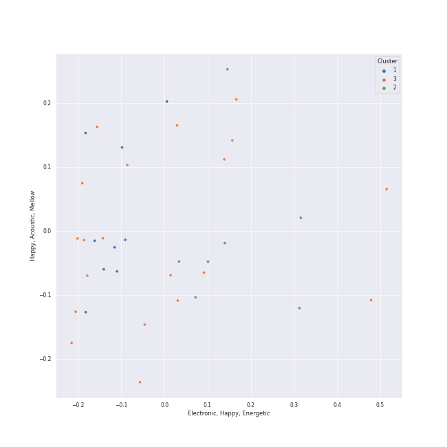

# Clusters in k-rap

## Cluster #1

9 tracks

| Art | Track | Album | Artists | Label | 💚 | 🔗 |
|:---|:---|:---|:---|:---|:---|:---|
|  | Limousine (Feat. MINO) (Prod. GRAY) | Show Me The Money 10 Episode 3 | BE'O, MINO | [Genie Music Corporation](../../../../labels/genie_music_corporation) | | [🔗](https://open.spotify.com/track/5g2Ik0WJG9rqu97nCLcQhV) |
|  | Three Dopeboyz (Feat. Zion.T) | LUCKYNUMBERS | Dynamicduo, Zion.T | [Stone Music Entertainment](../../../../labels/stone_music_entertainment) | | [🔗](https://open.spotify.com/track/74Q5gW006ZD5iIaVYB1EhO) |
|  | Smoke (Prod. Dynamicduo, Padi) | Street Woman Fighter2 (SWF2) Class Mission | Dynamicduo, Lee Young Ji | [Genie Music Corporation](../../../../labels/genie_music_corporation) | 💚 | [🔗](https://open.spotify.com/track/1qRfAvzRIJQodWKBNFAb6C) |
|  | CROOKED | COUP D'ETAT | G-DRAGON | [YG Entertainment](../../../../labels/yg_entertainment) | 💚 | [🔗](https://open.spotify.com/track/4EwNWRBWdZ6bgvxRHlZ8OO) |
|  | Gangnam Style (강남스타일) | Gangnam Style (강남스타일) | PSY | Silent Records/Universal Republic Records | 💚 | [🔗](https://open.spotify.com/track/03UrZgTINDqvnUMbbIMhql) |
|  | DADDY | PSY 7TH ALBUM | PSY, CL | [YG Entertainment](../../../../labels/yg_entertainment) | | [🔗](https://open.spotify.com/track/1eMVXXpNPEUdFRy5ZH7FpM) |
|  | Gentleman | Tik Tock Hits 2020 | PSY | [UME - Global Clearing House](../../../../labels/ume_-_global_clearing_house) | | [🔗](https://open.spotify.com/track/26spalP6x2gUAab8rwB8dQ) |
|  | That That (prod. & feat. SUGA of BTS) | PSY 9th | PSY, SUGA | P NATION | 💚 | [🔗](https://open.spotify.com/track/5oH4DQAuu1J1800RzUsBWa) |
|  | = (Equal Sign) | Jack In The Box | [j-hope](../../../../artists/j-hope/overview.md) | [BIGHIT MUSIC](../../../../labels/bighit_music) | 💚 | [🔗](https://open.spotify.com/track/70XnKsO3UnIT4FnEwChQXx) |
## Cluster #2

7 tracks

| Art | Track | Album | Artists | Label | 💚 | 🔗 |
|:---|:---|:---|:---|:---|:---|:---|
|  | Moonlight | D-2 | [Agust D](../../../../artists/agust_d/overview.md) | [BIGHIT MUSIC](../../../../labels/bighit_music) | | [🔗](https://open.spotify.com/track/057xGYST5exVyNevufrioZ) |
|  | Haegeum | D-DAY | [Agust D](../../../../artists/agust_d/overview.md) | [BIGHIT MUSIC](../../../../labels/bighit_music) | | [🔗](https://open.spotify.com/track/4bjN59DRXFRxBE1g5ne6B1) |
|  | Sex Trip | MOMMAE | Jay Park | [Genie Music Corporation](../../../../labels/genie_music_corporation), [Stone Music Entertainment](../../../../labels/stone_music_entertainment) | 💚 | [🔗](https://open.spotify.com/track/6dJ4jLQMM8SXGYrM0eRCNm) |
|  | MOMMAE (Feat. Ugly Duck) | WORLDWIDE | Jay Park, Ugly Duck | [Genie Music Corporation](../../../../labels/genie_music_corporation), [Stone Music Entertainment](../../../../labels/stone_music_entertainment) | | [🔗](https://open.spotify.com/track/1LNlfvPQmB0cqYJQQskZ8x) |
|  | Don’t | The Hyena on the Keyboard Pt. 4 | Loco, [HWASA](../../../../artists/hwasa/overview.md) | [Genie Music Corporation](../../../../labels/genie_music_corporation), [Stone Music Entertainment](../../../../labels/stone_music_entertainment) | 💚 | [🔗](https://open.spotify.com/track/6KyafpXji3NKMmlmSokT9Y) |
|  | Somebody! | Somebody | Loco, [HWASA](../../../../artists/hwasa/overview.md) | AOMG, ㈜RBW | | [🔗](https://open.spotify.com/track/2FA4veLVh3jf7O8q5VhNh5) |
|  | on the street (with J. Cole) | on the street (with J. Cole) | [j-hope](../../../../artists/j-hope/overview.md), J. Cole | [BIGHIT MUSIC](../../../../labels/bighit_music) | 💚 | [🔗](https://open.spotify.com/track/5wxYxygyHpbgv0EXZuqb9V) |
## Cluster #3

20 tracks

| Art | Track | Album | Artists | Label | 💚 | 🔗 |
|:---|:---|:---|:---|:---|:---|:---|
|  | Burn It (feat. MAX) | D-2 | [Agust D](../../../../artists/agust_d/overview.md), MAX | [BIGHIT MUSIC](../../../../labels/bighit_music) | 💚 | [🔗](https://open.spotify.com/track/38iufYNK4hUzS649Oe2kZy) |
|  | People | D-2 | [Agust D](../../../../artists/agust_d/overview.md) | [BIGHIT MUSIC](../../../../labels/bighit_music) | 💚 | [🔗](https://open.spotify.com/track/4wDSEE082RPcnhXzPzFhCp) |
|  | Snooze (feat. Ryuichi Sakamoto, WOOSUNG of The Rose) | D-DAY | [Agust D](../../../../artists/agust_d/overview.md), Ryuichi Sakamoto, WOOSUNG | [BIGHIT MUSIC](../../../../labels/bighit_music) | 💚 | [🔗](https://open.spotify.com/track/4j3M8NrbGSXdMPwEVsnfHE) |
|  | All I Wanna Do | EVERYTHING YOU WANTED | Jay Park | [Genie Music Corporation](../../../../labels/genie_music_corporation), [Stone Music Entertainment](../../../../labels/stone_music_entertainment) | 💚 | [🔗](https://open.spotify.com/track/2PcJoVkfjcbvoqBxV1Nj7y) |
|  | GANADARA (Feat. IU) | GANADARA | Jay Park, [IU](../../../../artists/iu/overview.md) | MORE VISION | 💚 | [🔗](https://open.spotify.com/track/5quFr5s5PXYfUX5jV2EBZ1) |
|  | Say Yes | Moonlovers - Scarlet Heart Ryeo (Original Television Soundtrack), Pt. 2 | Loco, Punch | [Genie Music Corporation](../../../../labels/genie_music_corporation) | 💚 | [🔗](https://open.spotify.com/track/27zrFrtUtWl2urlvjOn5xc) |
|  | Happier (feat. Crush) | PSY 9th | PSY, [Crush](../../../../artists/crush/overview.md) | P NATION | | [🔗](https://open.spotify.com/track/6idH1Qz9jcXzKcZeNIa9uU) |
|  | Still Life (with Anderson .Paak) | Indigo | RM, Anderson .Paak | [BIGHIT MUSIC](../../../../labels/bighit_music) | 💚 | [🔗](https://open.spotify.com/track/3p4N6mBFv42M8dI8SUoPre) |
|  | MORE | Jack In The Box | [j-hope](../../../../artists/j-hope/overview.md) | [BIGHIT MUSIC](../../../../labels/bighit_music) | 💚 | [🔗](https://open.spotify.com/track/7GARzfC1mwhDuk4t9WOACq) |
|  | Pandora's Box | Jack In The Box | [j-hope](../../../../artists/j-hope/overview.md) | [BIGHIT MUSIC](../../../../labels/bighit_music) | 💚 | [🔗](https://open.spotify.com/track/2On611HXKQAbaYkuc4NQAm) |