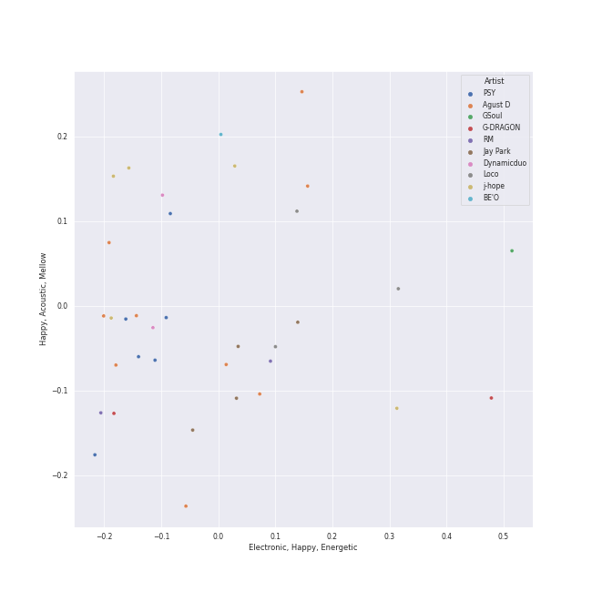
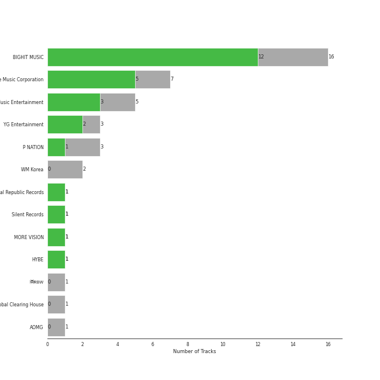
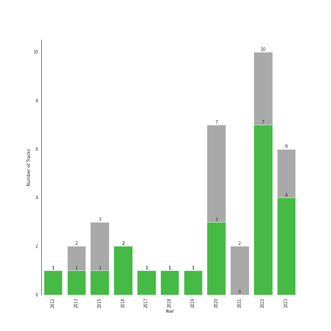

# k-rap

36 songs

[See Track Features](audio_features.md)

[See Clusters](clusters/overview.md)

## Top Artists

| Art | Tracks | 💚 | Artist | 🔗 |
|:---|---:|---:|:---|:---|
|  | 9 | 5 | [Agust D](../../artists/agust_d/overview.md) | [🔗](https://open.spotify.com/artist/5RmQ8k4l3HZ8JoPb4mNsML) |
|  | 5 | 5 | [j-hope](../../artists/j-hope/overview.md) | [🔗](https://open.spotify.com/artist/0b1sIQumIAsNbqAoIClSpy) |
|  | 6 | 3 | PSY | [🔗](https://open.spotify.com/artist/2dd5mrQZvg6SmahdgVKDzh) |
|  | 4 | 3 | Jay Park | [🔗](https://open.spotify.com/artist/4XDi67ZENZcbfKnvMnTYsI) |
|  | 3 | 2 | [HWASA](../../artists/hwasa/overview.md) | [🔗](https://open.spotify.com/artist/7bmYpVgQub656uNTu6qGNQ) |
|  | 3 | 2 | Loco | [🔗](https://open.spotify.com/artist/2e4G04F77jxVuDYo44TCSm) |
|  | 3 | 2 | RM | [🔗](https://open.spotify.com/artist/2auC28zjQyVTsiZKNgPRGs) |
|  | 2 | 2 | [IU](../../artists/iu/overview.md) | [🔗](https://open.spotify.com/artist/3HqSLMAZ3g3d5poNaI7GOU) |
|  | 2 | 2 | G-DRAGON | [🔗](https://open.spotify.com/artist/30b9WulBM8sFuBo17nNq9c) |
|  | 2 | 1 | Dynamicduo | [🔗](https://open.spotify.com/artist/4nvFFLtv7ZqoTr83387uK4) |

See all 29 artists

| Art | Tracks | 💚 | Artist | 🔗 |
|:---|---:|---:|:---|:---|
|  | 1 | 1 | J. Cole | [🔗](https://open.spotify.com/artist/6l3HvQ5sa6mXTsMTB19rO5) |
|  | 1 | 1 | WOOSUNG | [🔗](https://open.spotify.com/artist/5LHu1iF8m0XtRBEJbbwSoo) |
|  | 1 | 1 | Youjeen | [🔗](https://open.spotify.com/artist/4wVcCedmr7FHtUlFnIeJIG) |
|  | 1 | 1 | Becky G | [🔗](https://open.spotify.com/artist/4obzFoKoKRHIphyHzJ35G3) |
|  | 1 | 1 | Anderson .Paak | [🔗](https://open.spotify.com/artist/3jK9MiCrA42lLAdMGUZpwa) |
|  | 1 | 1 | Punch | [🔗](https://open.spotify.com/artist/2FgZrgTMX6Sk0VNcOsEPmm) |
|  | 1 | 1 | Ryuichi Sakamoto | [🔗](https://open.spotify.com/artist/1tcgfoMTT1szjUeaikxRjA) |
|  | 1 | 1 | MAX | [🔗](https://open.spotify.com/artist/1bqxdqvUtPWZri43cKHac8) |
|  | 1 | 1 | SUGA | [🔗](https://open.spotify.com/artist/0ebNdVaOfp6N0oZ1guIxM8) |
|  | 1 | 1 | Lee Young Ji | [🔗](https://open.spotify.com/artist/0Y2AcMPMpeuPXtPQGVvRBq) |
|  | 1 | 0 | Basick | [🔗](https://open.spotify.com/artist/7pXKdkQsYFCMG2omRxheJ2) |
|  | 1 | 0 | [Crush](../../artists/crush/overview.md) | [🔗](https://open.spotify.com/artist/6aLdhHUqgdKE86xbtNmY8g) |
|  | 1 | 0 | BE'O | [🔗](https://open.spotify.com/artist/5NUVwRESNqYBUTRbiATjy7) |
|  | 1 | 0 | Zion.T | [🔗](https://open.spotify.com/artist/5HenzRvMtSrgtvU16XAoby) |
|  | 1 | 0 | GSoul | [🔗](https://open.spotify.com/artist/4oEXworvhegyK83rZwVyWL) |
|  | 1 | 0 | MINO | [🔗](https://open.spotify.com/artist/3ytV7vc4ZuwGgwaOuWvkk8) |
|  | 1 | 0 | CL | [🔗](https://open.spotify.com/artist/0tzSBCPJZmHTdOA3ZV2mN3) |
|  | 1 | 0 | Ugly Duck | [🔗](https://open.spotify.com/artist/0Qr4St9aCOLu41Nt5QZIz1) |
|  | 1 | 0 | Whee In | [🔗](https://open.spotify.com/artist/0BqRGrwqndrtNkojXiqIzL) |

## Most and least listened tracks
| ​ | Most listened tracks | Score | ​​ | Least listened tracks | Score |
|:---|:---|---:|:---|:---|---:|
|  | 무제(無題) (Untitled, 2014) | 38469 |  | Gangnam Style (강남스타일) | 0 |
|  | Say Yes | 333 |  | [Moonlight](../../artists/agust_d/overview.md) | 0 |
|  | [AMYGDALA](../../artists/agust_d/overview.md) | 228 |  | Natural | 0 |
|  | [People Pt.2 (feat. IU)](../../artists/agust_d/overview.md) | 47 |  | Wild Flower (with youjeen) | 0 |
|  | [Snooze (feat. Ryuichi Sakamoto, WOOSUNG of The Rose)](../../artists/agust_d/overview.md) | 29 |  | MOMMAE (Feat. Ugly Duck) | 0 |
|  | When It Snows mmm (feat. Wheein) | 3 |  | [Daechwita](../../artists/agust_d/overview.md) | 0 |
|  | [MORE](../../artists/j-hope/overview.md) | 0 |  | DADDY | 0 |
|  | Three Dopeboyz (Feat. Zion.T) | 0 |  | Smoke (Prod. Dynamicduo, Padi) | 0 |
|  | [= (Equal Sign)](../../artists/j-hope/overview.md) | 0 |  | Gentleman | 0 |
|  | [Strange (feat. RM)](../../artists/agust_d/overview.md) | 0 |  | Somebody! | 0 |

## Top Albums

| Art | Tracks | 💚 | Album | Release Date | 🔗 |
|:---|---:|---:|:---|:---|:---|
|  | 5 | 3 | D-2 | 2020-05-22 | [🔗](https://open.spotify.com/album/1Pp8t7yn2E3rz3R7ZqPn1O) |
|  | 4 | 2 | D-DAY | 2023-04-21 | [🔗](https://open.spotify.com/album/446ROKmKfpEwkbi2SjELVX) |
|  | 3 | 3 | Jack In The Box | 2022-07-15 | [🔗](https://open.spotify.com/album/0FrC9lzgVhziJenigsrXdl) |
|  | 3 | 2 | PSY 9th | 2022-04-29 | [🔗](https://open.spotify.com/album/0v4swbfO7N9WyJkUo465C4) |
|  | 2 | 2 | Indigo | 2022-12-02 | [🔗](https://open.spotify.com/album/2wGinO7YWLHN2sULIr4a7v) |
|  | 1 | 1 | on the street (with J. Cole) | 2023-03-03 | [🔗](https://open.spotify.com/album/70xdtgH5XuYTqBNdNbUwGO) |
|  | 1 | 1 | The Hyena on the Keyboard Pt. 4 | 2018-04-21 | [🔗](https://open.spotify.com/album/2fMMk4DD96UcAmSczUQ0kq) |
|  | 1 | 1 | Street Woman Fighter2 (SWF2) Class Mission | 2023-09-05 | [🔗](https://open.spotify.com/album/3fifgTm6PcVhHE9v72nlCb) |
|  | 1 | 1 | Moonlovers - Scarlet Heart Ryeo (Original Television Soundtrack), Pt. 2 | 2016-08-29 | [🔗](https://open.spotify.com/album/68xTLBWjoRADRf86WYmTmy) |
|  | 1 | 1 | MOMMAE | 2015-05-22 | [🔗](https://open.spotify.com/album/1kgzGqeJbY7gwiheabVk1L) |

See all 24 albums

| Art | Tracks | 💚 | Album | Release Date | 🔗 |
|:---|---:|---:|:---|:---|:---|
|  | 1 | 1 | KWON JI YONG | 2017-06-08 | [🔗](https://open.spotify.com/album/2koSNfchdUxqw1rPJO87aH) |
|  | 1 | 1 | Gangnam Style (강남스타일) | 2012-01-01 | [🔗](https://open.spotify.com/album/0ZjxizLeMyFEjR27JIvD99) |
|  | 1 | 1 | GANADARA | 2022-03-11 | [🔗](https://open.spotify.com/album/4cwyl5ynvYVojZRbZ3dSFH) |
|  | 1 | 1 | EVERYTHING YOU WANTED | 2016-10-20 | [🔗](https://open.spotify.com/album/0c4LKBzh0ufU36AyuzZRc2) |
|  | 1 | 1 | Chicken Noodle Soup (feat. Becky G) | 2019-09-27 | [🔗](https://open.spotify.com/album/76IRLp7YzBVLKsat6Ro9ae) |
|  | 1 | 1 | COUP D'ETAT | 2013-09-05 | [🔗](https://open.spotify.com/album/4msI9bSfKohOPFic15aLR4) |
|  | 1 | 0 | When It Snows mmm (feat. Wheein) | 2020-12-23 | [🔗](https://open.spotify.com/album/5z8FBqt7BCXR6MB5fzy7L3) |
|  | 1 | 0 | WORLDWIDE | 2015-11-05 | [🔗](https://open.spotify.com/album/5vESroqrGYDxDPAwUceQxf) |
|  | 1 | 0 | Tik Tock Hits 2020 | 2020-06-12 | [🔗](https://open.spotify.com/album/4Da9F5PAFILkjmNmm81NZ3) |
|  | 1 | 0 | Somebody | 2022-07-25 | [🔗](https://open.spotify.com/album/40XK96MKBOb5BjAU8QAIfN) |
|  | 1 | 0 | Show Me The Money 10 Episode 3 | 2021-11-20 | [🔗](https://open.spotify.com/album/5W1NIlh0lKO1nABgocreql) |
|  | 1 | 0 | PSY 7TH ALBUM | 2015-12-01 | [🔗](https://open.spotify.com/album/1aHmoh8Iog2xqwVk9A77yc) |
|  | 1 | 0 | Natural | 2021-12-02 | [🔗](https://open.spotify.com/album/2yOqQbBoXX0nNPBqts1dmZ) |
|  | 1 | 0 | LUCKYNUMBERS | 2013-07-01 | [🔗](https://open.spotify.com/album/4I0RE0MF6b3Hw4Z0iWosxF) |

## Top Record Labels

| Tracks | 💚 | Label |
|---:|---:|:---|
| 16 | 12 | [BIGHIT MUSIC](../../labels/bighit_music/overview.md) |
| 7 | 5 | [Genie Music Corporation](../../labels/genie_music_corporation/overview.md) |
| 5 | 3 | [Stone Music Entertainment](../../labels/stone_music_entertainment/overview.md) |
| 3 | 2 | [YG Entertainment](../../labels/yg_entertainment/overview.md) |
| 3 | 2 | P NATION |
| 1 | 1 | Universal Republic Records |
| 1 | 1 | Silent Records |
| 1 | 1 | MORE VISION |
| 1 | 1 | [HYBE](../../labels/hybe/overview.md) |
| 2 | 0 | [WM Korea](../../labels/wm_korea/overview.md) |

See all 13 labels

| Tracks | 💚 | Label |
|---:|---:|:---|
| 1 | 0 | ㈜RBW |
| 1 | 0 | [UME - Global Clearing House](../../labels/ume_-_global_clearing_house/overview.md) |
| 1 | 0 | AOMG |

## Top Producers

| Art | Producer | Tracks | Credit Types |
|:---|:---|---:|:---|
| | 이기호 (Lee, Ki-ho) | 2 | Producer |
| | 유건형 (Yoo, Keon-Hyung) | 2 | Arranger, Songwriter |
| | [구종필 (Koo, Jong-Pil)](../../producers/구종필_(koo,_jong-pil)/overview.md) | 2 | Producer |
|  | PSY | 2 | Lyricist, Songwriter |
| | 홍수연 (홍수연) | 1 | Producer |
| | Peggy March | 1 | Songwriter |
| | 오동식 (Oh Dong-sik) | 1 | Lyricist |
| | 박우상 (Park, Woo-sang) | 1 | Producer |
| | [Tony Maserati](../../producers/tony_maserati/overview.md) | 1 | Producer |
|  | SUGA | 1 | Arranger, Lyricist, Producer, Songwriter |

View all

| Art | Producer | Tracks | Credit Types |
|:---|:---|---:|:---|
| | Steve Wittmack | 1 | Songwriter |
| | Jang Yi-jeong | 1 | Arranger, Songwriter |
| | Michael Bradley | 1 | Songwriter |

## Years

| ​ | 10 newest albums | ​​ | 10 oldest albums |
|:---|:---|:---|:---|
|  | Street Woman Fighter2 (SWF2) Class Mission (2023-09-05) |  | Gangnam Style (강남스타일) (2012-01-01) |
|  | D-DAY (2023-04-21) |  | LUCKYNUMBERS (2013-07-01) |
|  | on the street (with J. Cole) (2023-03-03) |  | COUP D'ETAT (2013-09-05) |
|  | Indigo (2022-12-02) |  | MOMMAE (2015-05-22) |
|  | Somebody (2022-07-25) |  | WORLDWIDE (2015-11-05) |
|  | Jack In The Box (2022-07-15) |  | PSY 7TH ALBUM (2015-12-01) |
|  | PSY 9th (2022-04-29) |  | Moonlovers - Scarlet Heart Ryeo (Original Television Soundtrack), Pt. 2 (2016-08-29) |
|  | GANADARA (2022-03-11) |  | EVERYTHING YOU WANTED (2016-10-20) |
|  | Natural (2021-12-02) |  | KWON JI YONG (2017-06-08) |
|  | Show Me The Money 10 Episode 3 (2021-11-20) |  | The Hyena on the Keyboard Pt. 4 (2018-04-21) |

