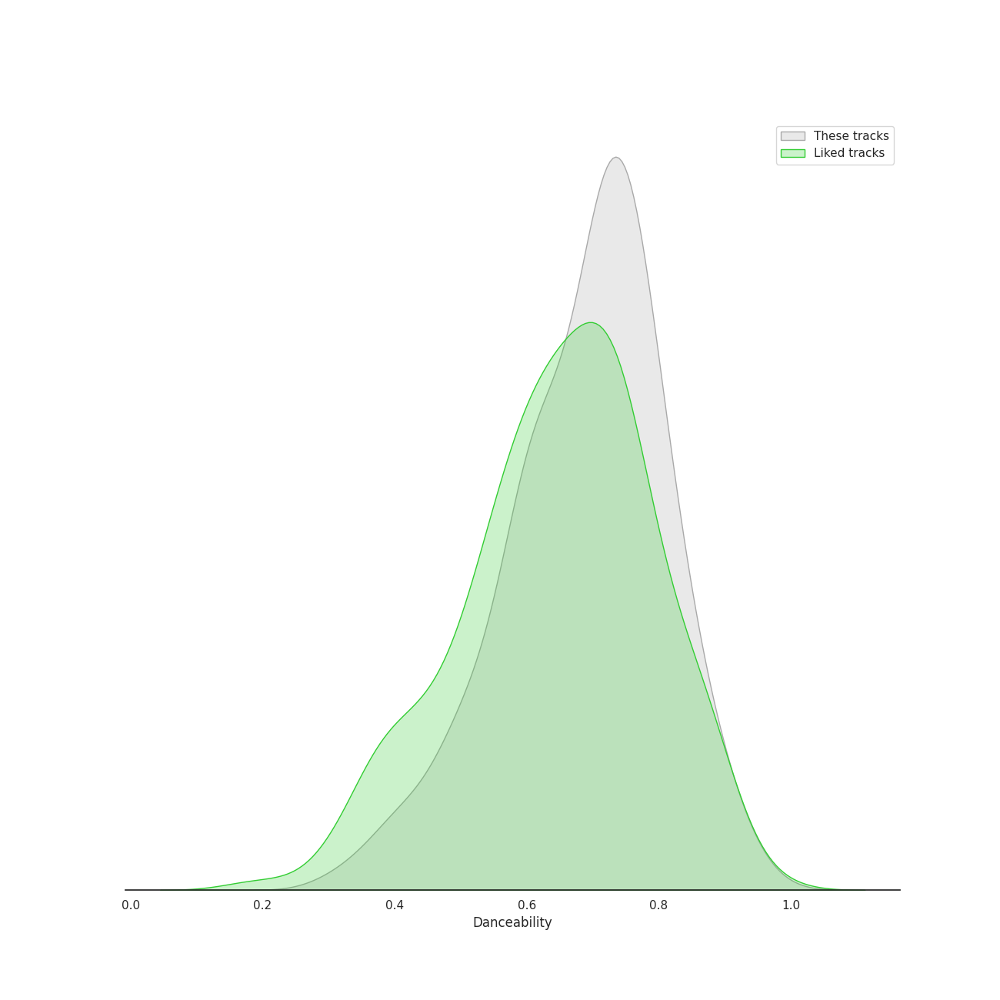
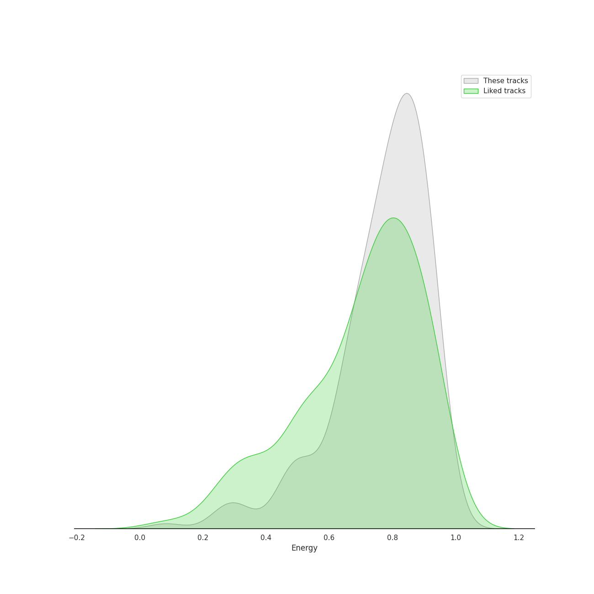
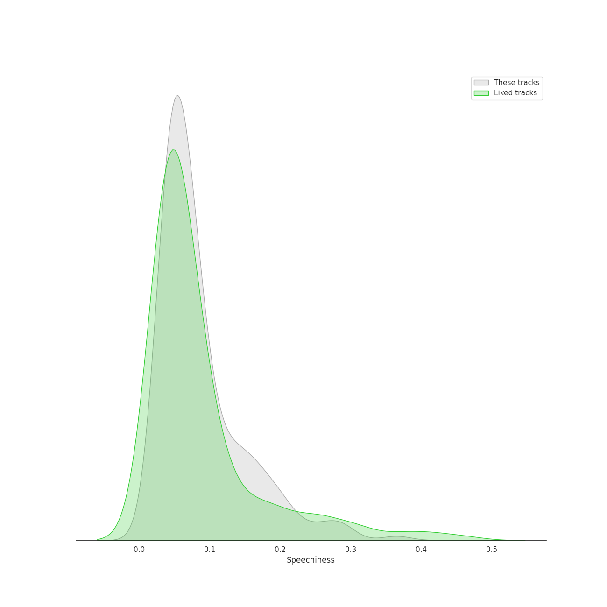
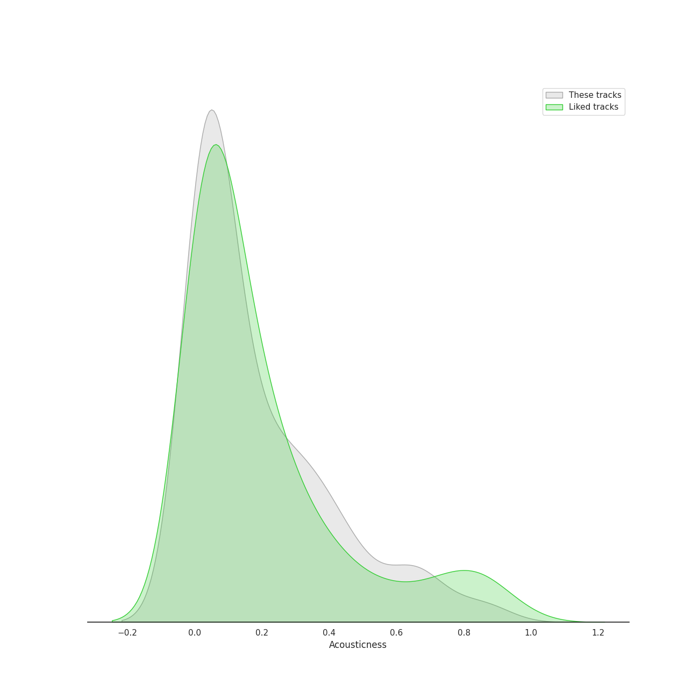
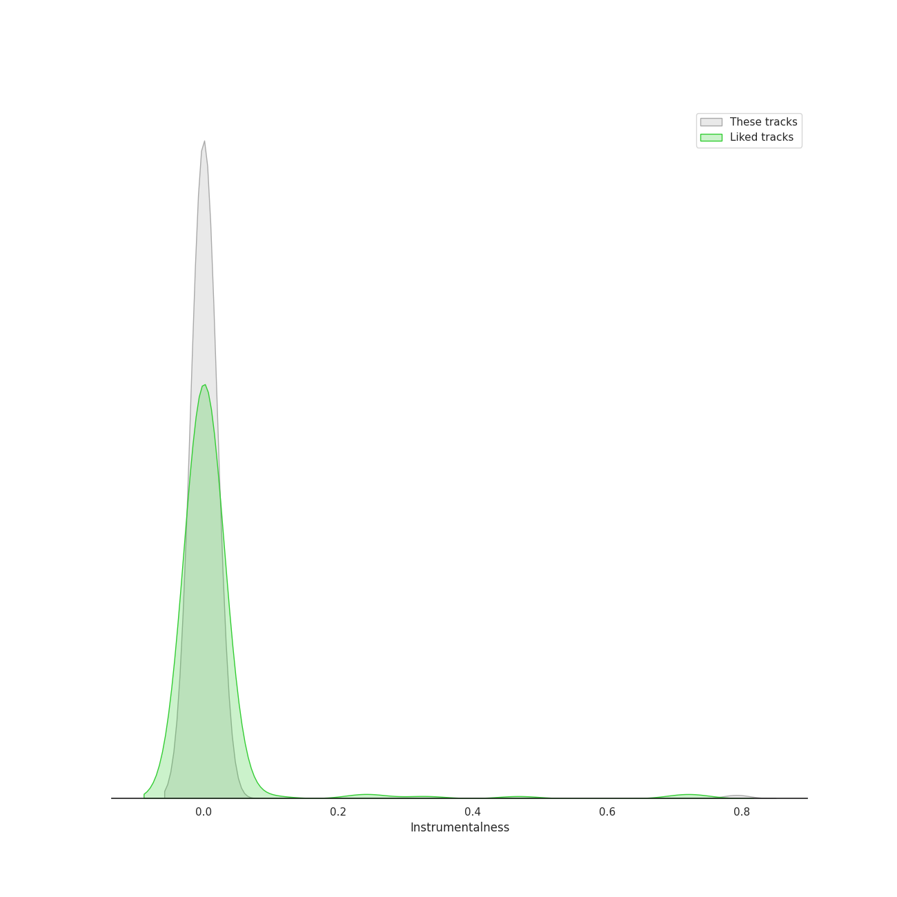
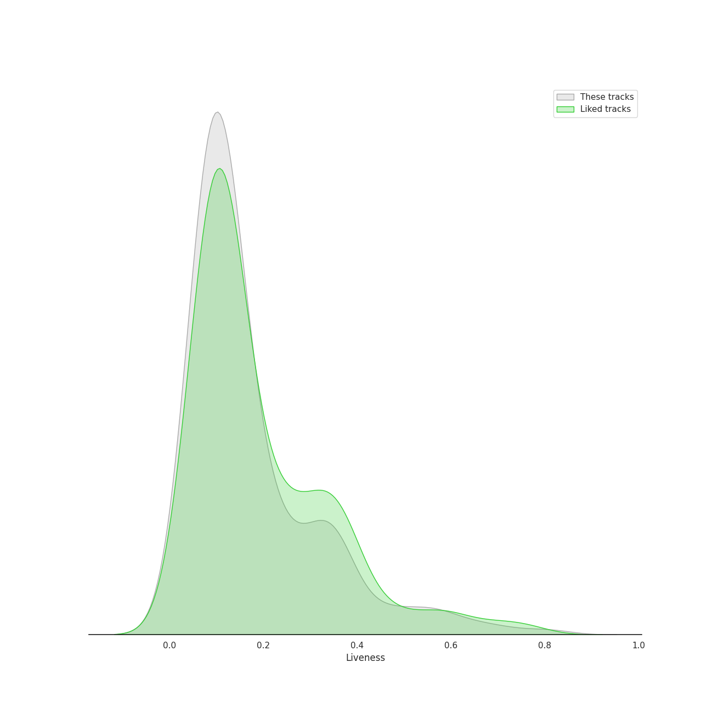
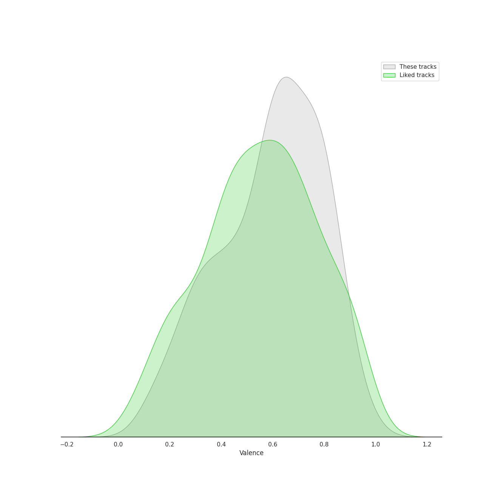
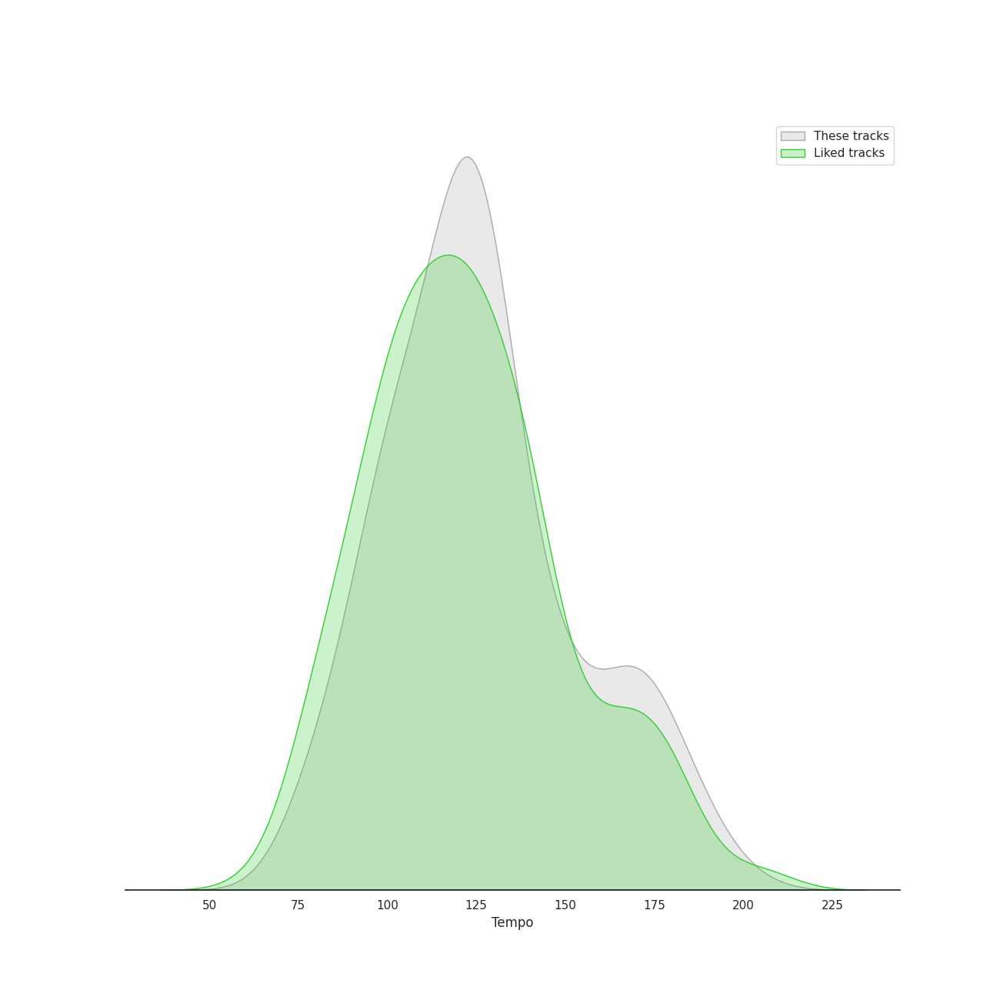

# Track Features for k-pop

## Danceability

| ​ | 10 most Danceable tracks | ​​ | 10 least Danceable tracks |
|:---|:---|:---|:---|
|  | Cold Blooded (0.961) |  | Here I Am (0.3) |
|  | #Twenty (0.956) |  | U (0.301) |
|  | FACE (0.954) |  | Miracle (0.302) |
|  | Ah puh (0.954) |  | On The Ground (0.311) |
|  | SNEAKERS (0.935) |  | Silent Night (0.333) |
|  | ASAP (0.934) |  | My sea (0.353) |
|  | Idle song (0.933) |  | Fine (0.36) |
|  | RUN (HAN) (0.929) |  | Like Water (0.365) |
|  | Jelly (0.921) |  | Epilogue (0.366) |
|  | SNEAKERS (English Ver.) (0.92) |  | Clockwork (0.37) |

## Energy

| ​ | 10 most Energetic tracks | ​​ | 10 least Energetic tracks |
|:---|:---|:---|:---|
|  | War of Hormone (0.993) |  | Silent Night (0.0831) |
|  | RING X RING (0.987) |  | 내 맘을 볼 수 있나요 (0.166) |
|  | Hit That Drum (0.984) |  | i hate to admit (Bang Chan) (0.217) |
|  | Misfit (0.984) |  | miss you (Hyunjin) (0.226) |
|  | MIROH (0.979) |  | Winter Sleep (0.237) |
|  | Side Effects (0.977) |  | THE CHRISTMAS SONG (0.242) |
|  | 소방차 Fire Truck (0.976) |  | How can I love the heartbreak, you're the one I love (0.248) |
|  | Abracadabra (0.973) |  | BREATHE (0.251) |
|  | 쏘리 쏘리 Sorry, Sorry (0.972) |  | Boy in time - HUI Solo (0.255) |
|  | Heart Attack (0.97) |  | Solo Christmas (0.259) |

## Speechiness

| ​ | 10 most Speechy tracks | ​​ | 10 least Speechy tracks |
|:---|:---|:---|:---|
|  | No More Dream (0.472) |  | Scary Fairy Tale (0.0263) |
|  | MANIAC (0.411) |  | Very, Slowly (0.0264) |
|  | Freedom (0.388) |  | She′s In The Rain (0.0264) |
|  | Free Fall (0.376) |  | Moonlight Melody (0.0269) |
|  | I GOT IT (HAN) (0.365) |  | Winter Sleep (0.0273) |
|  | Ice Cream (with Selena Gomez) (0.365) |  | 세가지 소원 Wish Tree (0.0273) |
|  | Feelin' Like (0.353) |  | The Magic of Christmas Time (0.0274) |
|  | JACKPOT (0.345) |  | Hope Not (0.0274) |
|  | VENOM (0.339) |  | Gee (0.0277) |
|  | Signal (0.334) |  | NANANA (0.0277) |

## Acousticness

| ​ | 10 most Acoustic tracks | ​​ | 10 least Acoustic tracks |
|:---|:---|:---|:---|
|  | Silent Night (0.92) |  | Easy (0.000219) |
|  | 그대라는 시 (0.914) |  | Mr. Simple (0.000219) |
|  | How can I love the heartbreak, you're the one I love (0.91) |  | Cyberpunk (0.000265) |
|  | The Magic of Christmas Time (0.898) |  | Oh Sorry Ya (0.000315) |
|  | ONLY (0.892) |  | I Love You (0.000371) |
|  | 내 맘을 볼 수 있나요 (0.884) |  | Red Light (0.000457) |
|  | Boy in time - HUI Solo (0.876) |  | Adios (0.000588) |
|  | THE CHRISTMAS SONG (0.874) |  | HALAZIA (0.000677) |
|  | Goodbye (0.861) |  | Cherry Bomb (0.000759) |
|  | MY LOVE (0.859) |  | Favorite (Vampire) (0.000831) |

## Instrumentalness

| ​ | 10 most Instrumental tracks | ​​ | 10 least Instrumental tracks |
|:---|:---|:---|:---|
|  | Tarantino (0.792) |  | Miracle (0.0) |
|  | THE CHRISTMAS SONG (0.155) |  | To the moon (0.0) |
|  | You and I (Park Bom) (0.0837) |  | SUPER BOARD (0.0) |
|  | Adios (0.0794) |  | Clockwork (0.0) |
|  | pporappippam (0.0652) |  | Shut Down (0.0) |
|  | Blue (0.0588) |  | SCIENTIST (0.0) |
|  | Badster (0.0444) |  | Winter Falls (0.0) |
|  | Cherry Blossom (0.0171) |  | Why Can't You Love Me? (0.0) |
|  | So Hot (0.00976) |  | BOSS (0.0) |
|  | GingaMingaYo (the strange world) (0.00955) |  | Best Friend (with SEULGI) (0.0) |

## Liveness

| ​ | 10 most Live tracks | ​​ | 10 least Live tracks |
|:---|:---|:---|:---|
|  | Heart Attack (0.887) |  | PING PONG (0.0202) |
|  | Jopping (0.857) |  | Funky Glitter Christmas (0.0221) |
|  | Piano Man (0.807) |  | CASE 143 (0.0222) |
|  | You Better Run (0.803) |  | SNEAKERS (0.0223) |
|  | Red Lipstick (feat. Yoonmirae) (0.792) |  | SNEAKERS (English Ver.) (0.0242) |
|  | 미행 (그림자 : Shadow) (0.782) |  | Black Out (0.0243) |
|  | Sticker (0.742) |  | memeM (0.0287) |
|  | I Like That (0.737) |  | Holiday Party (0.0294) |
|  | 행복 (Happiness) (0.725) |  | Ice Cream (with Selena Gomez) (0.0311) |
|  | SHAKE IT (0.715) |  | POP! (0.0321) |

## Valence

| ​ | 10 most Happy tracks | ​​ | 10 least Happy tracks |
|:---|:---|:---|:---|
|  | Sour candy (0.98) |  | The Road (0.073) |
|  | Twenty-three (0.968) |  | Grey Suit (0.0955) |
|  | Devil (0.968) |  | 7월 7일 One Of These Nights (0.11) |
|  | Tell Me (0.968) |  | Good Night My Princess (0.112) |
|  | Pepe (0.966) |  | Side Effects (0.118) |
|  | So Hot (0.963) |  | In The Fall (0.12) |
|  | Miniskirt (0.963) |  | Wet Nightmare (0.121) |
|  | Humph! (0.963) |  | Wet Nightmare (0.121) |
|  | Twinkle (0.962) |  | My sea (0.122) |
|  | 쏘리 쏘리 Sorry, Sorry (0.962) |  | Time After Time (0.123) |

## Tempo

| ​ | 10 most Fast tracks | ​​ | 10 least Fast tracks |
|:---|:---|:---|:---|
|  | Signal (207.819) |  | Dream (48.973) |
|  | Freedom (203.833) |  | Bambi (61.45) |
|  | Adore U (203.802) |  | Naked Gold (Prod. Czaer) (62.107) |
|  | Every night (203.639) |  | STRANGER (62.644) |
|  | 11:11 (203.155) |  | Run Devil Run (64.927) |
|  | PAXXWORD (200.646) |  | Clockwork (68.045) |
|  | O.O (200.263) |  | Winter Sleep (68.045) |
|  | Awkward Silence (199.981) |  | Brunch (69.581) |
|  | Modern Times (199.923) |  | MISSING U (71.967) |
|  | Merry Christmas (197.918) |  | Hello, Sunset (71.999) |
