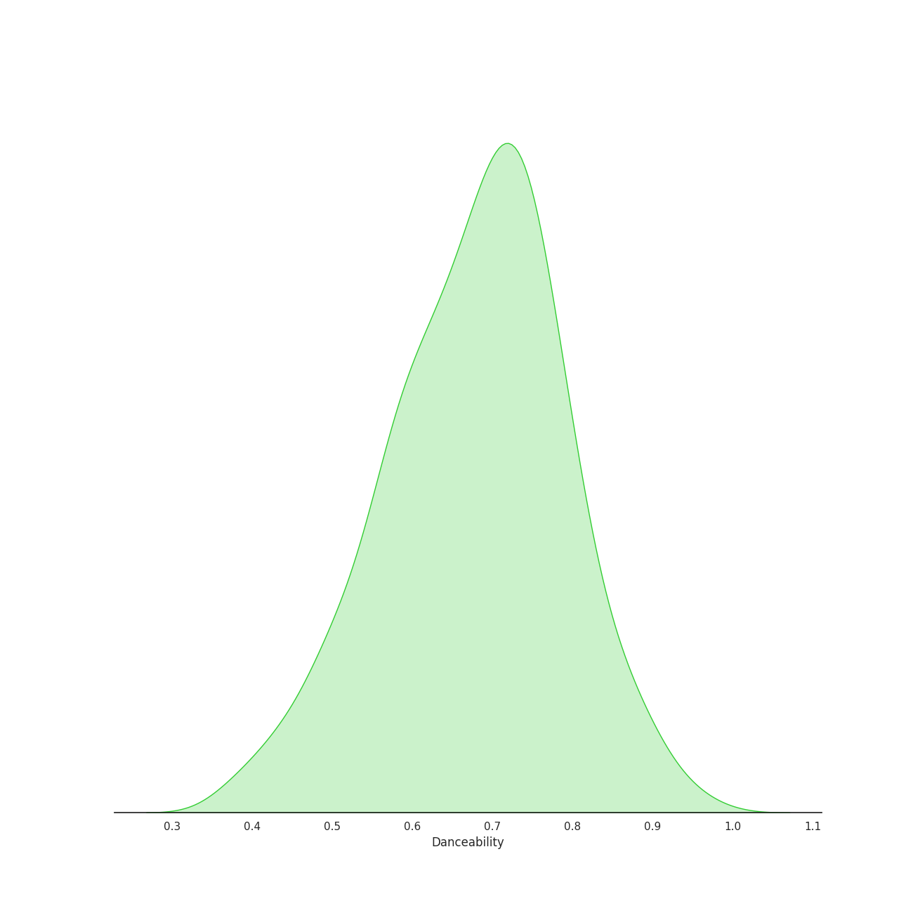
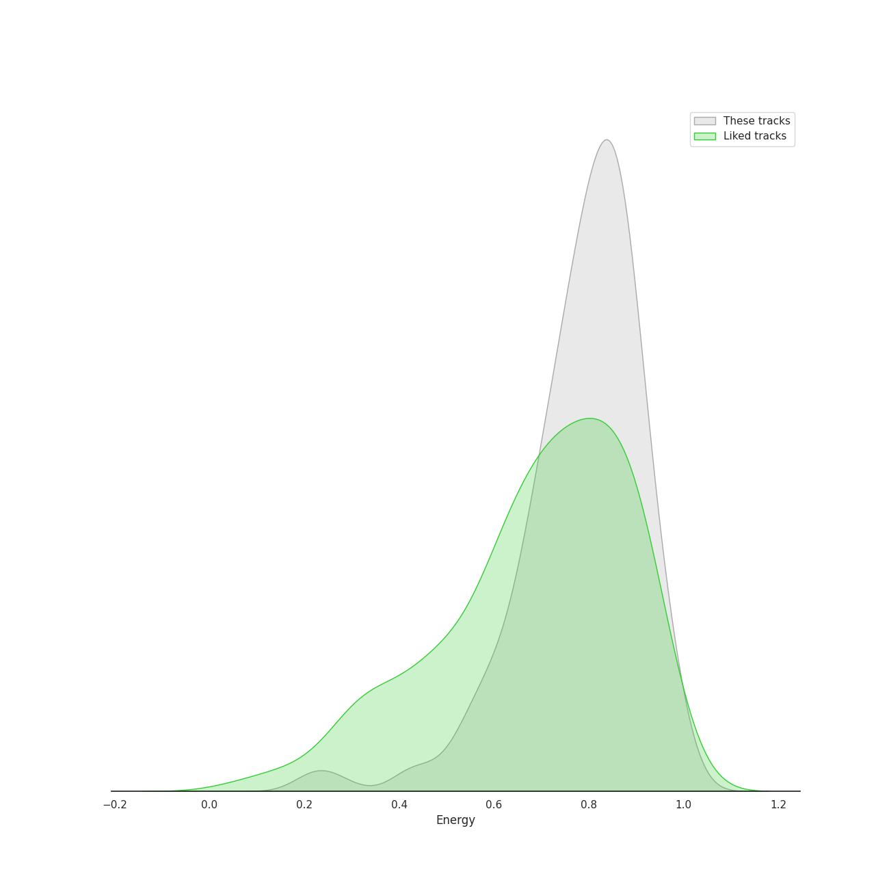
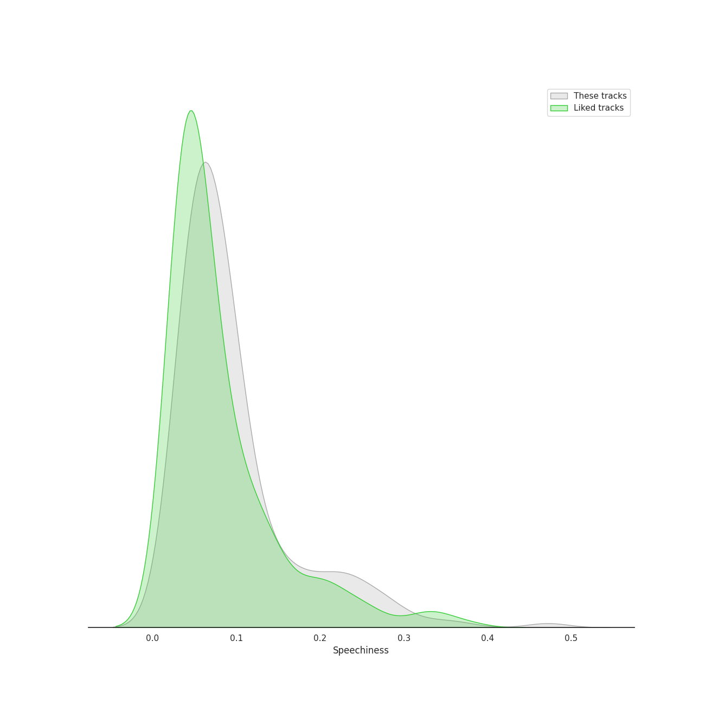
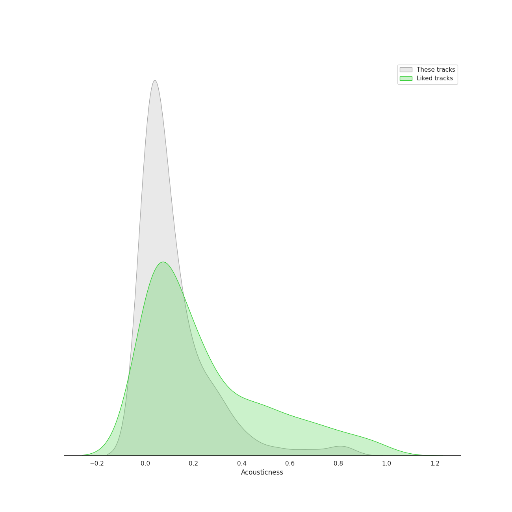
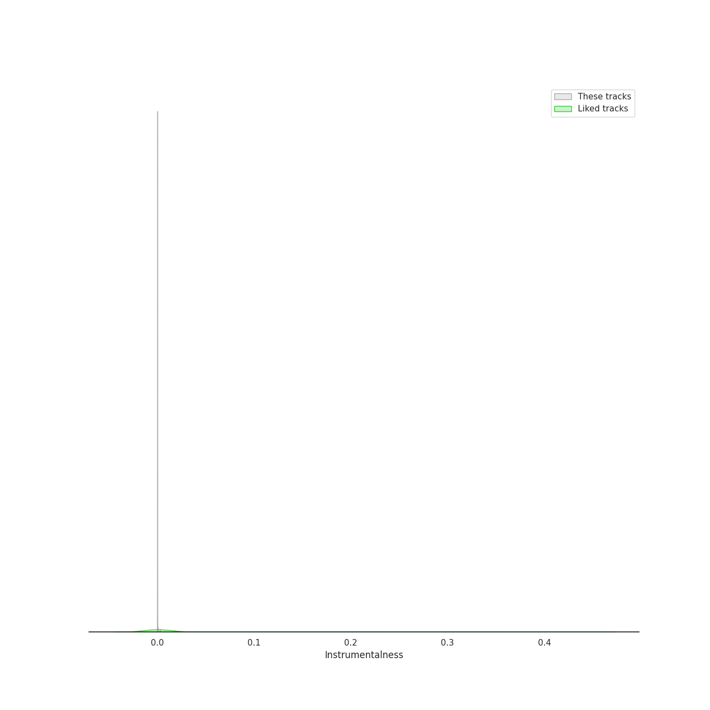
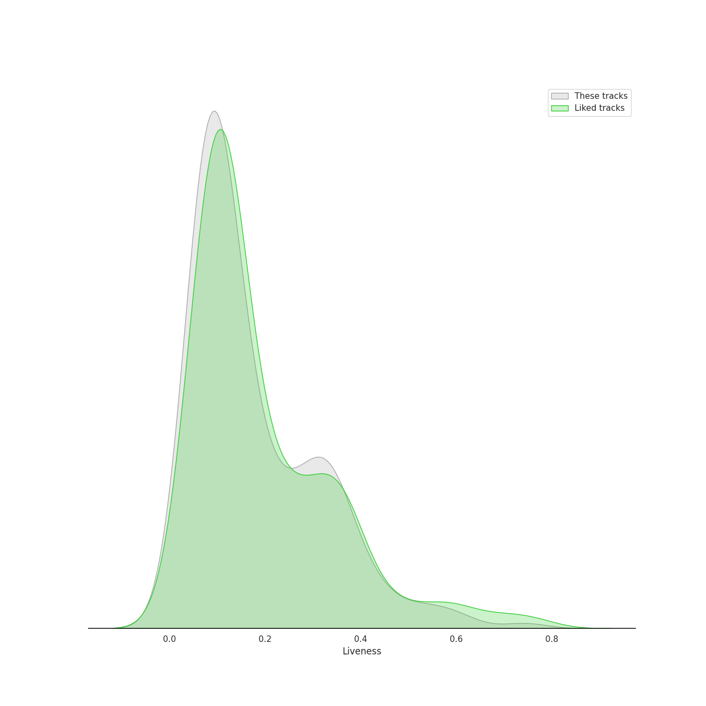
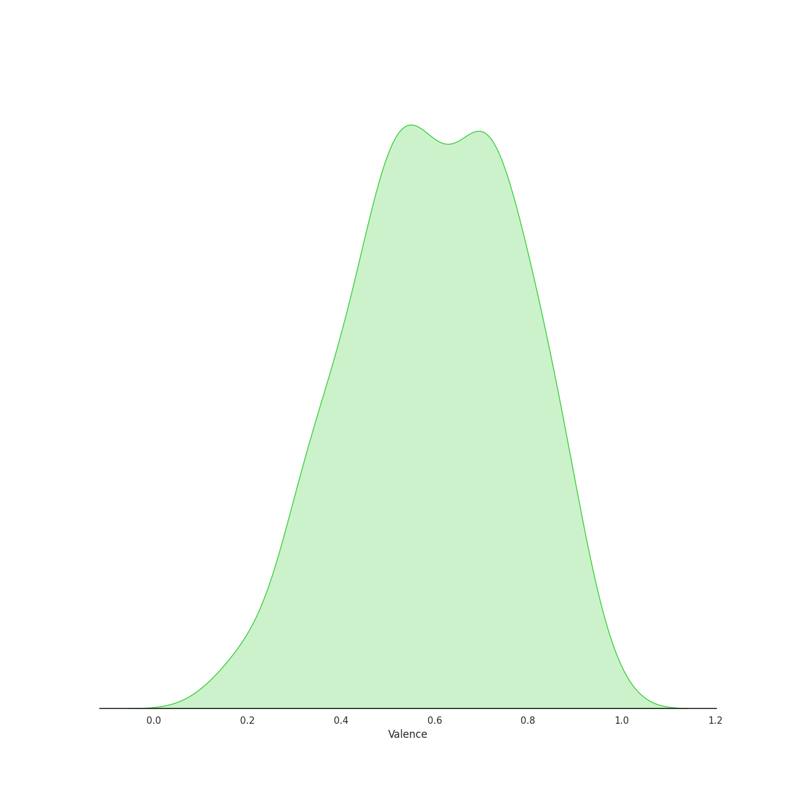
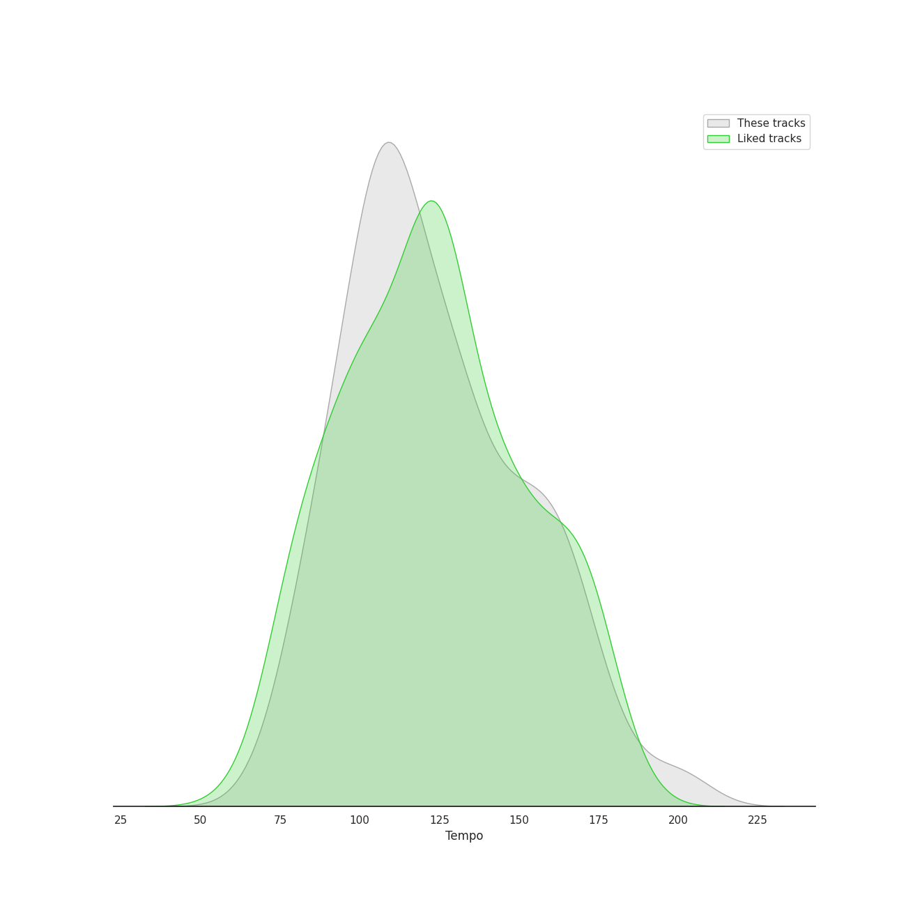

# Audio Features for k-pop boy group

## Danceability

| ​ | 10 most Danceable tracks | ​​ | 10 least Danceable tracks |
|:---|:---|:---|:---|
|  | RUN (HAN) (0.929) |  | CHEESE (0.376) |
|  | BOOM (0.914) |  | Boy in time - HUI Solo (0.385) |
|  | Mr. Simple (0.913) |  | Sorry (0.388) |
|  | HEYDAY (Prod. Czaer) (0.892) |  | Sparkling Night (0.422) |
|  | Any (0.879) |  | Runaway (0.425) |
|  | Christmas EveL (0.878) |  | No More Dream (0.436) |
|  | Love is New Gravity (0.878) |  | Just A Little Bit (0.441) |
|  | 10 Months (0.876) |  | Side Effects (0.444) |
|  | U (0.873) |  | Tap Tap (0.445) |
|  | BFF (Best Friends Forever) (0.872) |  | Butterfly (0.448) |

## Energy

| ​ | 10 most Energetic tracks | ​​ | 10 least Energetic tracks |
|:---|:---|:---|:---|
|  | War of Hormone (0.993) |  | i hate to admit (Bang Chan) (0.217) |
|  | Misfit (0.984) |  | Deep end (Felix) (0.223) |
|  | MIROH (0.979) |  | miss you (Hyunjin) (0.226) |
|  | Side Effects (0.977) |  | Boy in time - HUI Solo (0.255) |
|  | 소방차 Fire Truck (0.976) |  | Singularity (0.272) |
|  | 쏘리 쏘리 Sorry, Sorry (0.972) |  | Candles (0.413) |
|  | WONDERLAND (0.964) |  | The Truth Untold (feat. Steve Aoki) (0.422) |
|  | Candy (0.964) |  | 24 to 25 (0.455) |
|  | District 9 (0.956) |  | Butter (0.459) |
|  | One In A Billion (0.952) |  | Anti-Romantic (0.489) |

## Speechiness

| ​ | 10 most Speechy tracks | ​​ | 10 least Speechy tracks |
|:---|:---|:---|:---|
|  | No More Dream (0.472) |  | She′s In The Rain (0.0264) |
|  | MANIAC (0.411) |  | NANANA (0.0277) |
|  | I GOT IT (HAN) (0.365) |  | 24 to 25 (0.0288) |
|  | Feelin' Like (0.353) |  | Candles (0.0292) |
|  | VENOM (0.339) |  | Man in a movie (0.03) |
|  | Tap Tap (0.311) |  | LOVE SCENARIO (0.0307) |
|  | Boy in Luv (0.306) |  | Drive (Bang Chan, Lee Know) (0.0314) |
|  | 3RACHA (Bang Chan, Changbin, HAN) (0.301) |  | Don't Wanna Cry (0.0325) |
|  | Sparkling Night (0.299) |  | Stars and Raindrops (Seungmin) (0.0329) |
|  | Cherry Bomb (0.287) |  | Lie (0.033) |

## Acousticness

| ​ | 10 most Acoustic tracks | ​​ | 10 least Acoustic tracks |
|:---|:---|:---|:---|
|  | Deep end (Felix) (0.879) |  | Easy (0.000219) |
|  | Boy in time - HUI Solo (0.876) |  | Mr. Simple (0.000219) |
|  | miss you (Hyunjin) (0.826) |  | Tamed-Dashed (0.000253) |
|  | Candles (0.822) |  | Cyberpunk (0.000265) |
|  | i hate to admit (Bang Chan) (0.794) |  | Attention, please! (0.000483) |
|  | Gold Dust (0.704) |  | HALAZIA (0.000677) |
|  | RUN (HAN) (0.703) |  | Drunk-Dazed (0.000707) |
|  | Missing You (0.65) |  | Cherry Bomb (0.000759) |
|  | Singularity (0.56) |  | Favorite (Vampire) (0.000831) |
|  | Back 2 U (AM 01:27) (0.548) |  | Danger (0.000907) |

## Instrumentalness

| ​ | 10 most Instrumental tracks | ​​ | 10 least Instrumental tracks |
|:---|:---|:---|:---|
|  | Fairy of Shampoo (0.00673) |  | SUPER BOARD (0.0) |
|  | Singularity (0.00278) |  | Winter Falls (0.0) |
|  | Mr. Simple (0.00208) |  | Beatbox (0.0) |
|  | HALAZIA (0.000575) |  | Ridin' (0.0) |
|  | Lemonade (0.000522) |  | BOSS (0.0) |
|  | Ring Ding Dong (0.000501) |  | PHOTO (0.0) |
|  | Danger (0.000215) |  | Gold Dust (0.0) |
|  | Airplane pt.2 (0.000103) |  | Paradise (0.0) |
|  | Sour (8.35e-05) |  | BLACK MIRROR (0.0) |
|  | Doom Du Doom (4.82e-05) |  | Red Lights (Bang Chan, Hyunjin) (0.0) |

## Liveness

| ​ | 10 most Live tracks | ​​ | 10 least Live tracks |
|:---|:---|:---|:---|
|  | Sticker (0.742) |  | CASE 143 (0.0222) |
|  | I like you (0.699) |  | Beatbox (0.0334) |
|  | Red Lights (Bang Chan, Hyunjin) (0.612) |  | Domino (0.0346) |
|  | Blessed-Cursed (0.596) |  | CIRCUS (0.0353) |
|  | Growl (0.556) |  | Run BTS (0.0358) |
|  | Levanter - English Ver. (0.544) |  | Vitamin (0.0359) |
|  | God’s Menu (0.521) |  | HEYDAY (Prod. Czaer) (0.0363) |
|  | No More Dream (0.494) |  | Maknae On Top (I.N) (0.0374) |
|  | Easy (0.471) |  | Saturday Drip (0.0379) |
|  | SHOUT OUT (0.459) |  | Universe (Let's Play Ball) (0.0402) |

## Valence

| ​ | 10 most Happy tracks | ​​ | 10 least Happy tracks |
|:---|:---|:---|:---|
|  | Devil (0.968) |  | Side Effects (0.118) |
|  | 쏘리 쏘리 Sorry, Sorry (0.962) |  | The Truth Untold (feat. Steve Aoki) (0.169) |
|  | THE POYZ BANANA CHACHA (Korean Ver.) (0.955) |  | Favorite (Vampire) (0.178) |
|  | Left & Right (0.95) |  | Singularity (0.198) |
|  | Up All Night (Bang Chan, Changbin, Felix, Seungmin) (0.916) |  | Anti-Romantic (0.206) |
|  | 운명 The Chance of Love (0.915) |  | The 7th Sense (0.218) |
|  | Candy Sugar Pop (0.902) |  | Still Life (0.239) |
|  | TFW (That Feeling When) (0.902) |  | Deep end (Felix) (0.257) |
|  | BLACK MIRROR (0.896) |  | Hellevator (0.288) |
|  | Muddy Water (Changbin, Hyunjin, HAN, Felix) (0.888) |  | HALA HALA (Hearts Awakened, Live Alive) (0.294) |

## Tempo

| ​ | 10 most Fast tracks | ​​ | 10 least Fast tracks |
|:---|:---|:---|:---|
|  | Adore U (203.802) |  | miss you (Hyunjin) (72.96) |
|  | Awkward Silence (199.981) |  | FEVER (72.999) |
|  | Strawberry Cake (199.943) |  | I GOT IT (HAN) (75.698) |
|  | Not For Sale (192.13) |  | Run BTS (77.004) |
|  | Guerrilla (181.963) |  | FAKE LOVE (77.502) |
|  | District 9 (179.987) |  | Cherry Bomb (78.027) |
|  | Universe (Let's Play Ball) (179.975) |  | Hellevator (78.17) |
|  | Runaway (179.848) |  | I like you (79.969) |
|  | 우리집 My House (176.021) |  | MMM (79.976) |
|  | Mikrokosmos (174.043) |  | There (79.984) |
