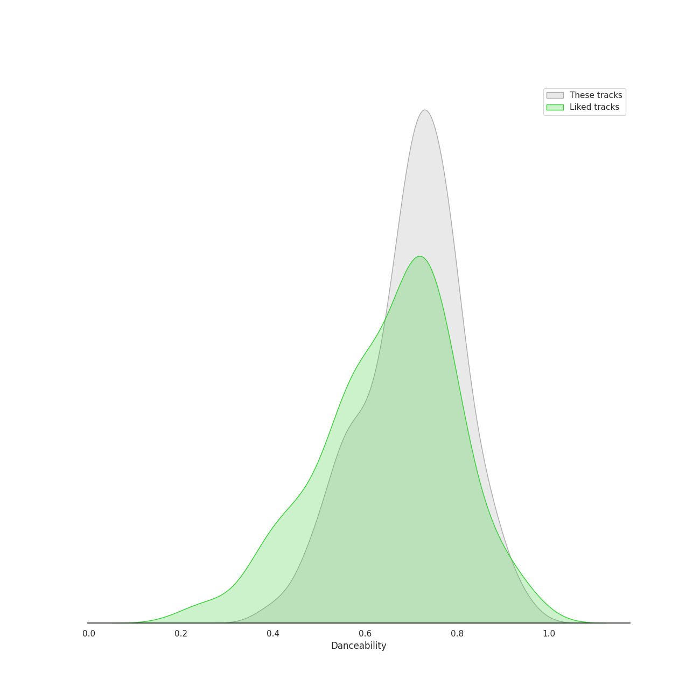
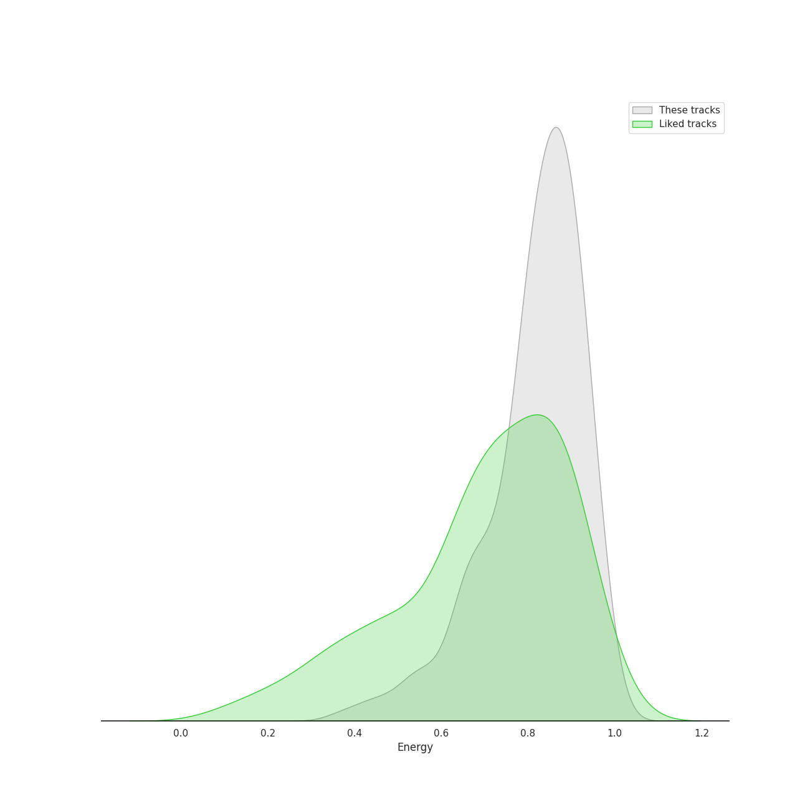
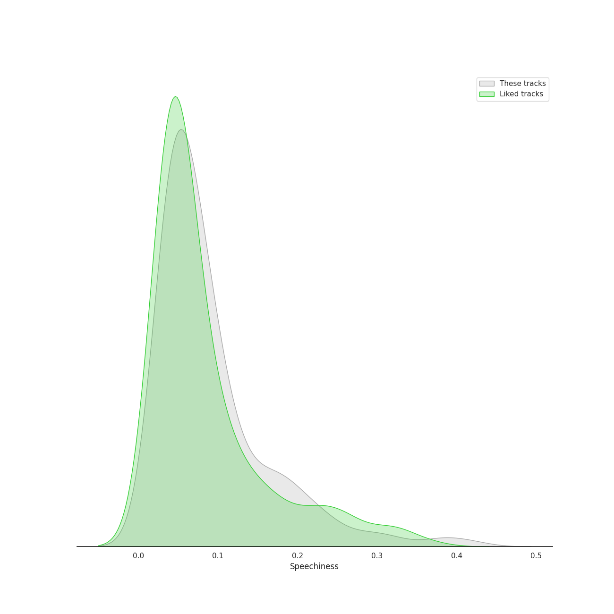
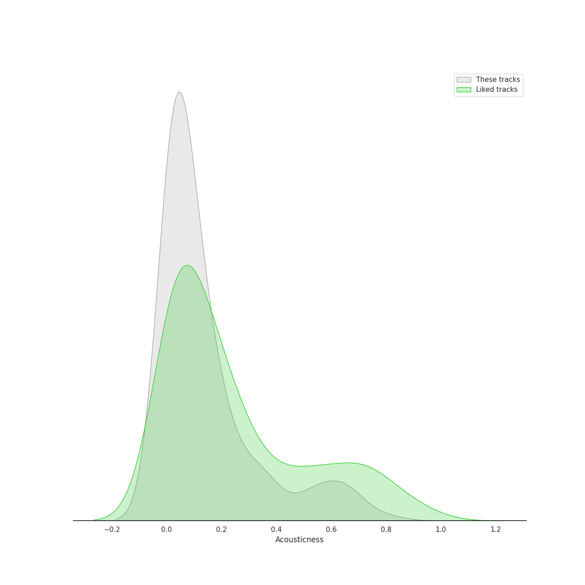
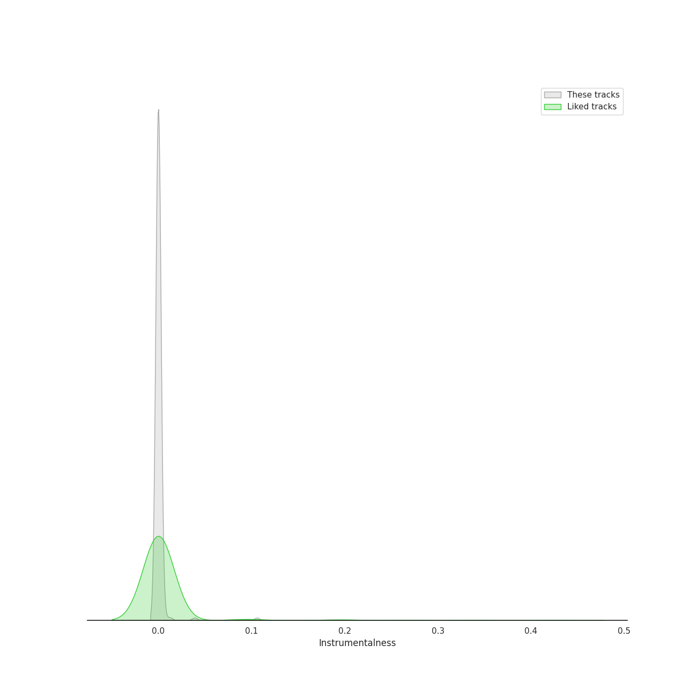
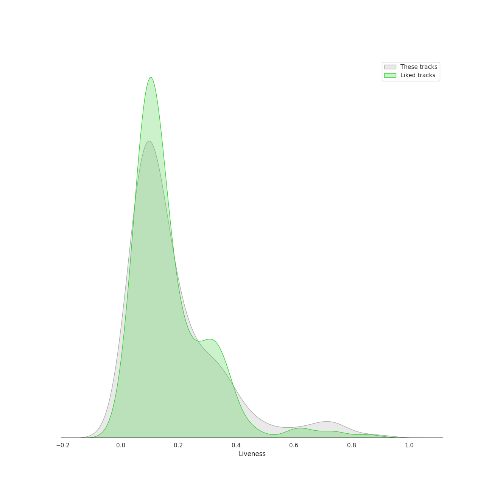
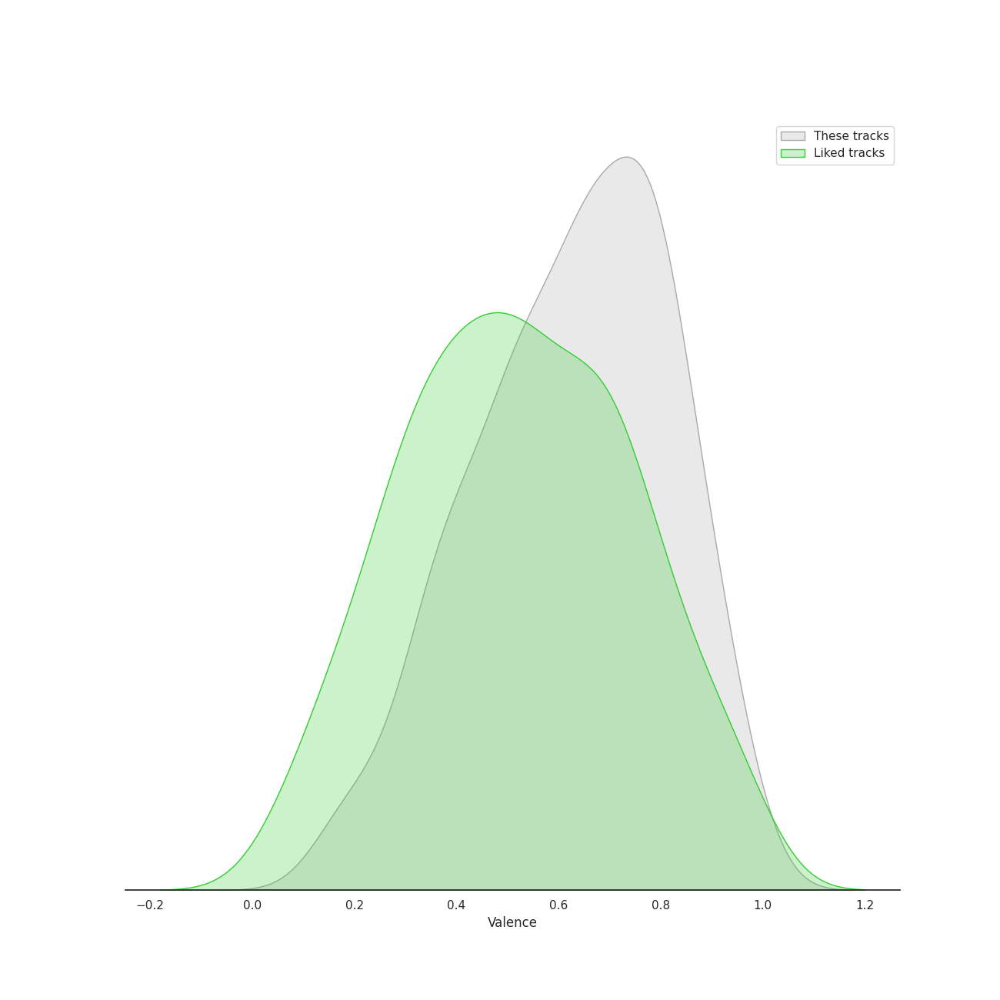
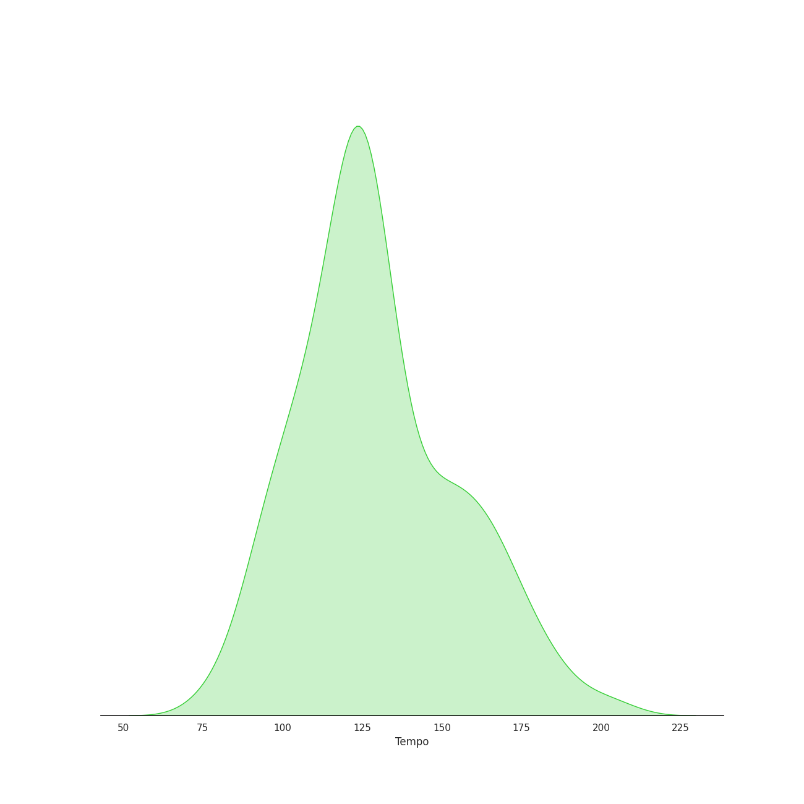

# Audio Features for k-pop girl group

## Danceability

| ​ | 10 most Danceable tracks | ​​ | 10 least Danceable tracks |
|:---|:---|:---|:---|
|  | #Twenty (0.956) |  | HWAA (0.384) |
|  | SNEAKERS (0.935) |  | O.O (0.39) |
|  | SNEAKERS (English Ver.) (0.92) |  | Where Are We Now (0.407) |
|  | Typa Girl (0.915) |  | Feel My Rhythm (0.412) |
|  | Tippy Toes (0.913) |  | 7월 7일 One Of These Nights (0.436) |
|  | Scandal (0.898) |  | You Better Run (0.436) |
|  | Time Slip (0.897) |  | Poison (0.442) |
|  | Louder (0.886) |  | Addicted (0.463) |
|  | The Boys (0.885) |  | Merry Christmas (0.466) |
|  | Nobody (0.882) |  | Life's Too Short (English Version) (0.472) |

## Energy

| ​ | 10 most Energetic tracks | ​​ | 10 least Energetic tracks |
|:---|:---|:---|:---|
|  | Hit That Drum (0.984) |  | The Happiest Girl (0.374) |
|  | Girls (0.974) |  | Hope Not (0.423) |
|  | Abracadabra (0.973) |  | HANN (Alone in winter) (0.429) |
|  | OOPSIE (My Bad) (0.971) |  | STAY (0.432) |
|  | Heart Attack (0.97) |  | You Never Know (0.435) |
|  | Secret (0.969) |  | Hurt (0.446) |
|  | Oh! (0.966) |  | Moonlight Melody (0.482) |
|  | Mr.Mr. (0.964) |  | Where Are We Now (0.494) |
|  | Panorama (0.963) |  | 7월 7일 One Of These Nights (0.509) |
|  | Very Very Very (0.963) |  | Hello, Sunset (0.531) |

## Speechiness

| ​ | 10 most Speechy tracks | ​​ | 10 least Speechy tracks |
|:---|:---|:---|:---|
|  | Addicted (0.419) |  | Moonlight Melody (0.0269) |
|  | Freedom (0.388) |  | 세가지 소원 Wish Tree (0.0273) |
|  | Free Fall (0.376) |  | Gee (0.0274) |
|  | Ice Cream (with Selena Gomez) (0.365) |  | Hope Not (0.0274) |
|  | Signal (0.334) |  | YOUNG LUV (0.0277) |
|  | You Better Run (0.326) |  | LOVE FOOL (0.0281) |
|  | Girls (0.325) |  | In My Dreams (0.0283) |
|  | Be Natural (0.316) |  | Something (0.0285) |
|  | Love So Sweet (0.308) |  | I Love You (0.0288) |
|  | O.O (0.293) |  | Merry Christmas (0.0292) |

## Acousticness

| ​ | 10 most Acoustic tracks | ​​ | 10 least Acoustic tracks |
|:---|:---|:---|:---|
|  | HANN (Alone in winter) (0.814) |  | Poison (9.27e-05) |
|  | Rainy Season (0.806) |  | I Love You (0.000371) |
|  | Where Are We Now (0.744) |  | Red Light (0.000457) |
|  | Hurt (0.731) |  | Adios (0.000588) |
|  | Jazz Bar (0.704) |  | RUN2U (0.000835) |
|  | ZOOM (0.696) |  | DALLA DALLA - English Ver. (0.00102) |
|  | Cupid (0.662) |  | LA DI DA (0.00108) |
|  | Starry Night (0.656) |  | DALLA DALLA (0.00116) |
|  | Wind flower (0.656) |  | SWIPE (0.00151) |
|  | Moonlight Melody (0.654) |  | Up & Down (0.00189) |

## Instrumentalness

| ​ | 10 most Instrumental tracks | ​​ | 10 least Instrumental tracks |
|:---|:---|:---|:---|
|  | Tippy Toes (0.106) |  | Fire in the belly (0.0) |
|  | You and I (Park Bom) (0.0837) |  | Shut Down (0.0) |
|  | Adios (0.0794) |  | SCIENTIST (0.0) |
|  | YEPPI YEPPI (0.0391) |  | LIMBO! (0.0) |
|  | So Hot (0.00976) |  | TOMBOY (0.0) |
|  | I Am The Best (0.00834) |  | Hush (0.0) |
|  | Power Up (0.00745) |  | Typa Girl (0.0) |
|  | BBoom BBoom (0.00666) |  | Paradise (0.0) |
|  | In My Dreams (0.0066) |  | Talk that Talk (0.0) |
|  | FIRE (0.00643) |  | Pirate (0.0) |

## Liveness

| ​ | 10 most Live tracks | ​​ | 10 least Live tracks |
|:---|:---|:---|:---|
|  | Heart Attack (0.887) |  | SNEAKERS (0.0223) |
|  | Piano Man (0.807) |  | SNEAKERS (English Ver.) (0.0242) |
|  | You Better Run (0.803) |  | Fire in the belly (0.0266) |
|  | 미행 (그림자 : Shadow) (0.782) |  | YEPPI YEPPI (0.029) |
|  | Generation (0.777) |  | OOPSIE (My Bad) (0.0293) |
|  | I Like That (0.737) |  | Ice Cream (with Selena Gomez) (0.0311) |
|  | 행복 (Happiness) (0.725) |  | DARK (X-file) (0.0372) |
|  | 행복 (Happiness) (0.725) |  | BLACK DRESS (0.0386) |
|  | LP (0.714) |  | Red Light (0.0414) |
|  | Genie (0.714) |  | Wings (0.0428) |

## Valence

| ​ | 10 most Happy tracks | ​​ | 10 least Happy tracks |
|:---|:---|:---|:---|
|  | Pepe (0.966) |  | 7월 7일 One Of These Nights (0.11) |
|  | So Hot (0.963) |  | Lucid Dream (0.146) |
|  | Miniskirt (0.963) |  | Body Talk (0.158) |
|  | Twinkle (0.962) |  | Hope Not (0.179) |
|  | Cupid (0.961) |  | In My Dreams (0.179) |
|  | Lion Heart (0.961) |  | Ditto (0.183) |
|  | Give it to me (0.961) |  | Ditto (0.183) |
|  | 러시안 룰렛 Russian Roulette (0.958) |  | LION (0.187) |
|  | Sleep-walking (0.954) |  | POSE (0.195) |
|  | Nobody (0.95) |  | MORE (0.199) |

## Tempo

| ​ | 10 most Fast tracks | ​​ | 10 least Fast tracks |
|:---|:---|:---|:---|
|  | Signal (207.819) |  | Run Devil Run (64.927) |
|  | Freedom (203.833) |  | Hello, Sunset (71.999) |
|  | Every night (203.639) |  | Life's Too Short (English Version) (72.203) |
|  | O.O (200.263) |  | SAME SAME (76.011) |
|  | Merry Christmas (197.918) |  | VILLAIN DIES (77.008) |
|  | About Love (191.908) |  | Thirsty (77.513) |
|  | Young, Dumb, Stupid (187.985) |  | Red Sun (79.454) |
|  | Good Luck (187.936) |  | Eyes Locked, Hands Locked (79.986) |
|  | Body Talk (185.946) |  | I'm Unhappy (81.947) |
|  | I’ll BE THERE (185.657) |  | BEAUTIFUL MONSTER (82.321) |
