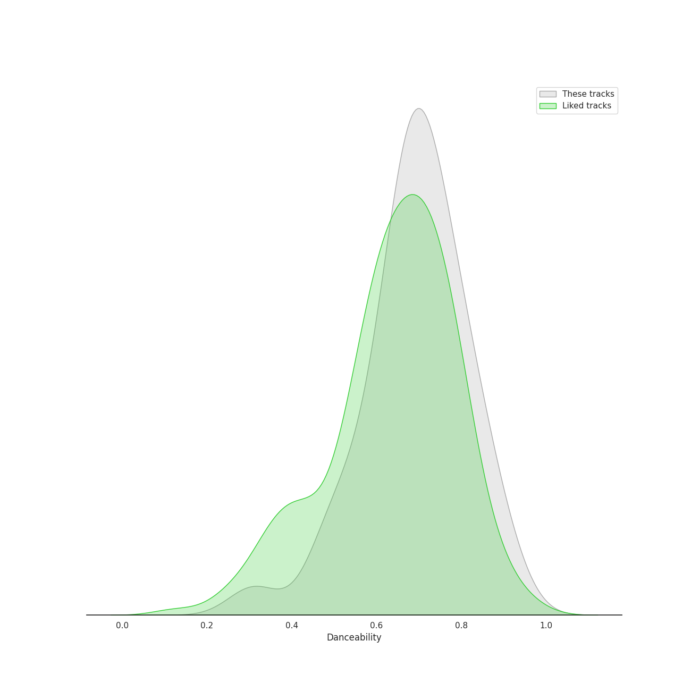
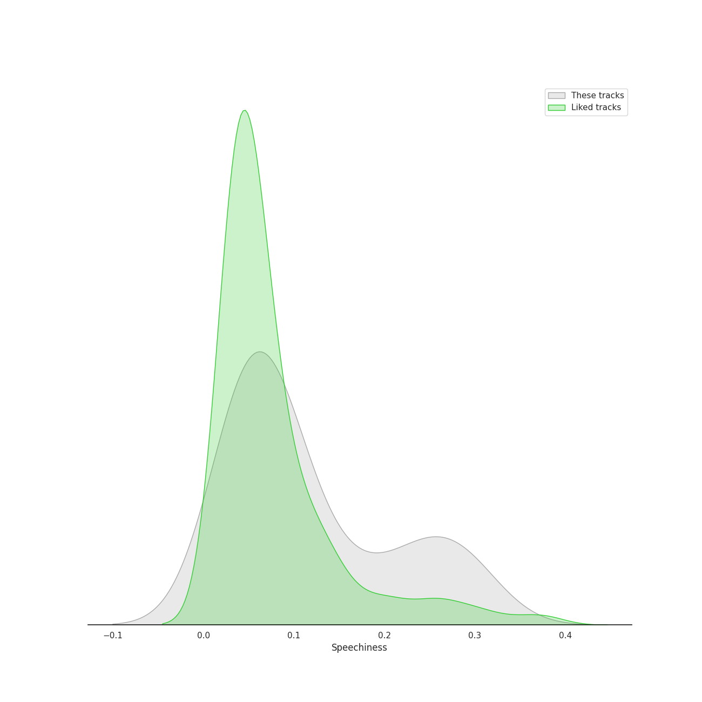
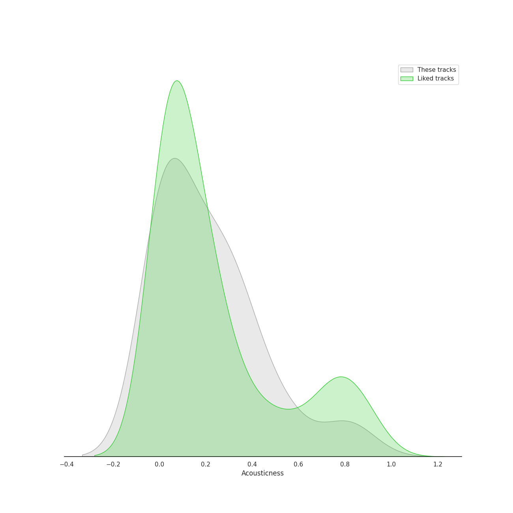
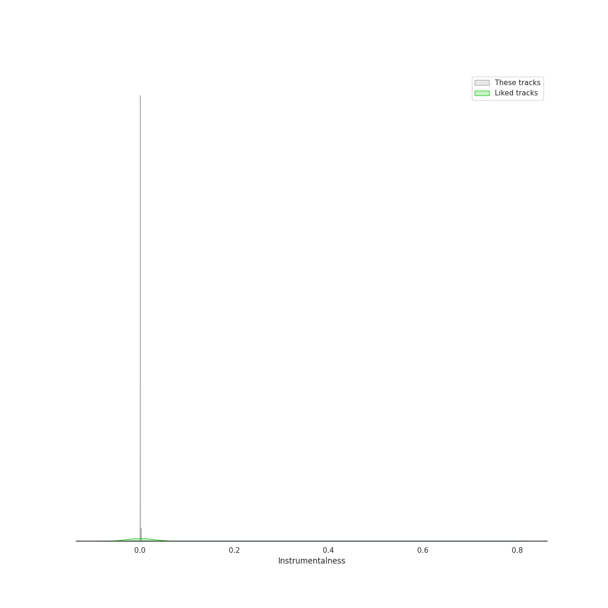
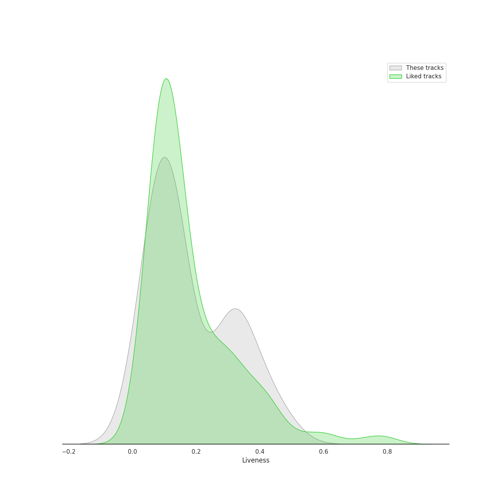
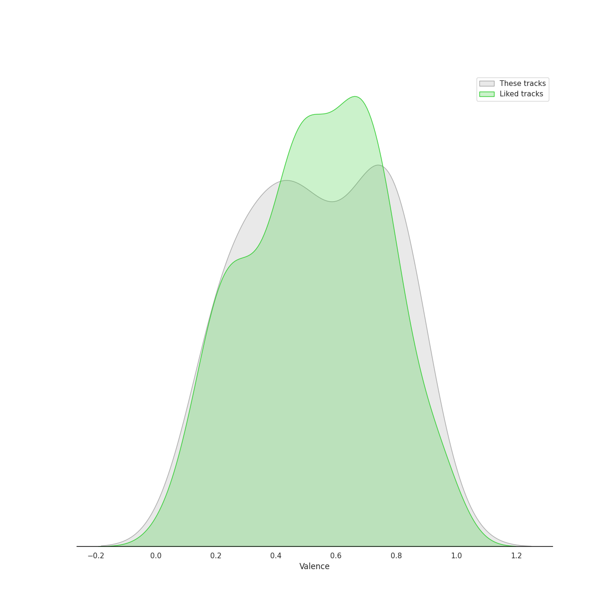
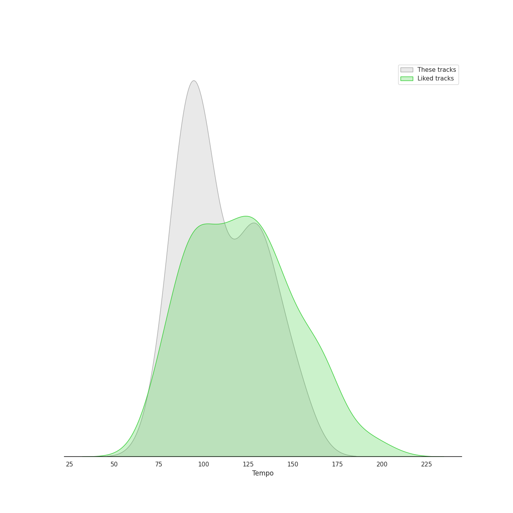

# Track Features for k-rap

## Danceability

| ​ | 10 most Danceable tracks | ​​ | 10 least Danceable tracks |
|:---|:---|:---|:---|
|  | That That (prod. & feat. SUGA of BTS) (0.905) |  | AMYGDALA (0.311) |
|  | Gentleman (0.882) |  | GANADARA (Feat. IU) (0.492) |
|  | Don’t (0.85) |  | Now (feat. Hwa Sa) (0.575) |
|  | Chicken Noodle Soup (feat. Becky G) (0.826) |  | 무제(無題) (Untitled, 2014) (0.583) |
|  | Love Love Love (0.788) |  | Happier (feat. Crush) (0.61) |
|  | Sex Trip (0.788) |  | All I Wanna Do (0.613) |
|  | Pandora's Box (0.785) |  | Strange (feat. RM) (0.627) |
|  | MORE (0.783) |  | Daechwita (0.65) |
|  | DADDY (0.762) |  | Burn It (feat. MAX) (0.658) |
|  | People (0.76) |  | CROOKED (0.665) |

## Energy

| ​ | 10 most Energetic tracks | ​​ | 10 least Energetic tracks |
|:---|:---|:---|:---|
|  | That That (prod. & feat. SUGA of BTS) (0.962) |  | 무제(無題) (Untitled, 2014) (0.461) |
|  | Gangnam Style (강남스타일) (0.937) |  | Don’t (0.488) |
|  | CROOKED (0.919) |  | People Pt.2 (feat. IU) (0.574) |
|  | Love Love Love (0.881) |  | Sex Trip (0.579) |
|  | DADDY (0.869) |  | GANADARA (Feat. IU) (0.615) |
|  | Haegeum (0.837) |  | Happier (feat. Crush) (0.627) |
|  | Now (feat. Hwa Sa) (0.83) |  | Strange (feat. RM) (0.662) |
|  | Daechwita (0.827) |  | All I Wanna Do (0.668) |
|  | on the street (with J. Cole) (0.821) |  | People (0.682) |
|  | Chicken Noodle Soup (feat. Becky G) (0.817) |  | Somebody! (0.683) |

## Speechiness

| ​ | 10 most Speechy tracks | ​​ | 10 least Speechy tracks |
|:---|:---|:---|:---|
|  | Haegeum (0.304) |  | 무제(無題) (Untitled, 2014) (0.0321) |
|  | MOMMAE (0.287) |  | Somebody! (0.0328) |
|  | Gangnam Style (강남스타일) (0.286) |  | MORE (0.0357) |
|  | All I Wanna Do (0.267) |  | People (0.0371) |
|  | Three Dopeboyz (Feat. Zion.T) (0.257) |  | Limousine (Feat. MINO) (Prod. GRAY) (0.0378) |
|  | GANADARA (Feat. IU) (0.244) |  | Now (feat. Hwa Sa) (0.0421) |
|  | Moonlight (0.225) |  | Burn It (feat. MAX) (0.0493) |
|  | Strange (feat. RM) (0.203) |  | Happier (feat. Crush) (0.0503) |
|  | Pandora's Box (0.178) |  | Sex Trip (0.0522) |
|  | on the street (with J. Cole) (0.131) |  | AMYGDALA (0.0553) |

## Acousticness

| ​ | 10 most Acoustic tracks | ​​ | 10 least Acoustic tracks |
|:---|:---|:---|:---|
|  | 무제(無題) (Untitled, 2014) (0.785) |  | CROOKED (0.00191) |
|  | Don’t (0.552) |  | Gentleman (0.00222) |
|  | on the street (with J. Cole) (0.532) |  | Strange (feat. RM) (0.00236) |
|  | People Pt.2 (feat. IU) (0.391) |  | Now (feat. Hwa Sa) (0.00317) |
|  | When It Snows mmm (feat. Wheein) (0.389) |  | Gangnam Style (강남스타일) (0.00417) |
|  | Sex Trip (0.368) |  | Chicken Noodle Soup (feat. Becky G) (0.00502) |
|  | Say Yes (0.352) |  | MORE (0.00537) |
|  | Somebody! (0.329) |  | Burn It (feat. MAX) (0.012) |
|  | Haegeum (0.313) |  | = (Equal Sign) (0.0155) |
|  | Moonlight (0.273) |  | Daechwita (0.0229) |

## Instrumentalness

| ​ | 10 most Instrumental tracks | ​​ | 10 least Instrumental tracks |
|:---|:---|:---|:---|
|  | MORE (0.00209) |  | Gangnam Style (강남스타일) (0.0) |
|  | on the street (with J. Cole) (0.00111) |  | Moonlight (0.0) |
|  | When It Snows mmm (feat. Wheein) (2.88e-05) |  | MOMMAE (0.0) |
|  | 무제(無題) (Untitled, 2014) (1.7e-05) |  | Daechwita (0.0) |
|  | Chicken Noodle Soup (feat. Becky G) (1.09e-05) |  | DADDY (0.0) |
|  | = (Equal Sign) (5.44e-06) |  | Gentleman (0.0) |
|  | Burn It (feat. MAX) (2.1e-06) |  | Say Yes (0.0) |
|  | Love Love Love (0.0) |  | Somebody! (0.0) |
|  | Three Dopeboyz (Feat. Zion.T) (0.0) |  | Pandora's Box (0.0) |
|  | Strange (feat. RM) (0.0) |  | All I Wanna Do (0.0) |

## Liveness

| ​ | 10 most Live tracks | ​​ | 10 least Live tracks |
|:---|:---|:---|:---|
|  | Haegeum (0.471) |  | That That (prod. & feat. SUGA of BTS) (0.0272) |
|  | When It Snows mmm (feat. Wheein) (0.425) |  | Now (feat. Hwa Sa) (0.0381) |
|  | Limousine (Feat. MINO) (Prod. GRAY) (0.396) |  | Gentleman (0.0515) |
|  | = (Equal Sign) (0.348) |  | CROOKED (0.0588) |
|  | Say Yes (0.329) |  | Moonlight (0.059) |
|  | Pandora's Box (0.326) |  | All I Wanna Do (0.0735) |
|  | People Pt.2 (feat. IU) (0.319) |  | GANADARA (Feat. IU) (0.0772) |
|  | Happier (feat. Crush) (0.317) |  | Gangnam Style (강남스타일) (0.091) |
|  | Three Dopeboyz (Feat. Zion.T) (0.311) |  | on the street (with J. Cole) (0.0921) |
|  | Chicken Noodle Soup (feat. Becky G) (0.294) |  | MOMMAE (0.104) |

## Valence

| ​ | 10 most Happy tracks | ​​ | 10 least Happy tracks |
|:---|:---|:---|:---|
|  | That That (prod. & feat. SUGA of BTS) (0.906) |  | AMYGDALA (0.16) |
|  | Limousine (Feat. MINO) (Prod. GRAY) (0.837) |  | Chicken Noodle Soup (feat. Becky G) (0.168) |
|  | Haegeum (0.831) |  | Strange (feat. RM) (0.207) |
|  | on the street (with J. Cole) (0.813) |  | Daechwita (0.223) |
|  | Love Love Love (0.785) |  | Pandora's Box (0.228) |
|  | CROOKED (0.782) |  | 무제(無題) (Untitled, 2014) (0.263) |
|  | Moonlight (0.773) |  | MORE (0.306) |
|  | Somebody! (0.768) |  | Burn It (feat. MAX) (0.336) |
|  | Gangnam Style (강남스타일) (0.749) |  | People (0.372) |
|  | DADDY (0.747) |  | When It Snows mmm (feat. Wheein) (0.384) |

## Tempo

| ​ | 10 most Fast tracks | ​​ | 10 least Fast tracks |
|:---|:---|:---|:---|
|  | Now (feat. Hwa Sa) (151.966) |  | AMYGDALA (78.265) |
|  | Daechwita (144.995) |  | 무제(無題) (Untitled, 2014) (79.826) |
|  | Happier (feat. Crush) (140.159) |  | Haegeum (85.097) |
|  | Limousine (Feat. MINO) (Prod. GRAY) (132.166) |  | When It Snows mmm (feat. Wheein) (87.971) |
|  | Gangnam Style (강남스타일) (132.067) |  | People Pt.2 (feat. IU) (88.94) |
|  | DADDY (132.05) |  | Strange (feat. RM) (90.008) |
|  | That That (prod. & feat. SUGA of BTS) (129.969) |  | GANADARA (Feat. IU) (90.081) |
|  | CROOKED (129.962) |  | Don’t (92.023) |
|  | Love Love Love (127.976) |  | MOMMAE (93.91) |
|  | Gentleman (125.995) |  | on the street (with J. Cole) (94.074) |
