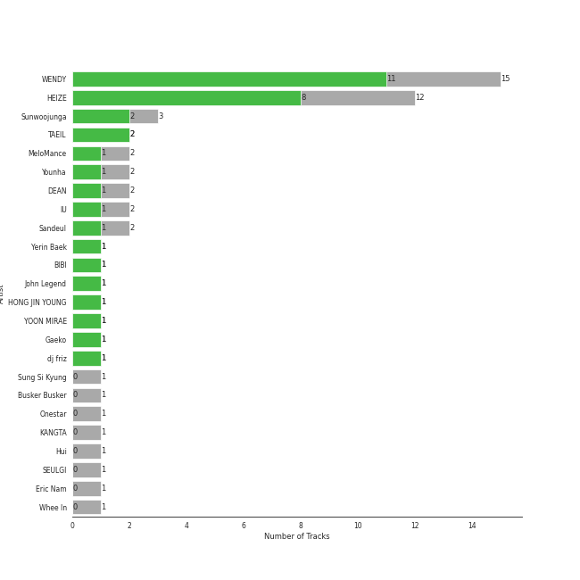
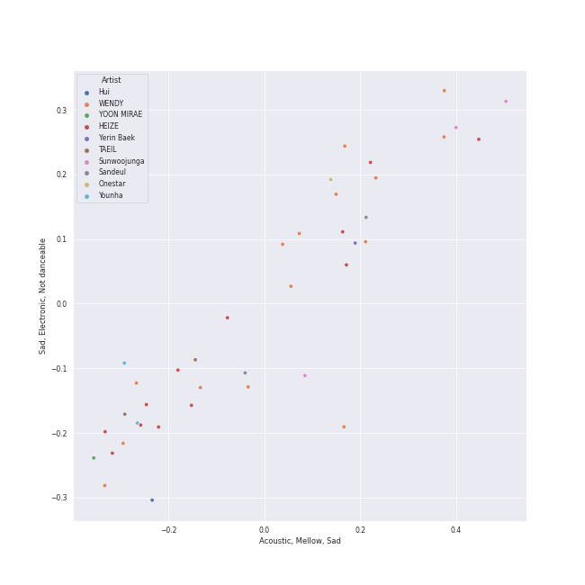
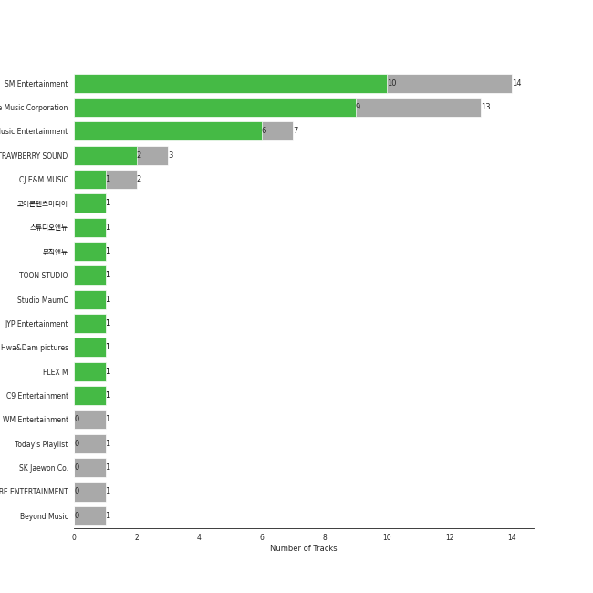

# korean pop

[45 songs](korean_pop_tracks.md)

## Top Artists

See all 32 artists

| Number of Tracks | Art | Artist | 🔗 |
|---:|:---|:---|:---|
| 8 |  | WENDY | [🔗](https://open.spotify.com/artist/0FRUZvZNPzM3YJMABJxf2K) |
| 7 |  | AKMU | [🔗](https://open.spotify.com/artist/6OwKE9Ez6ALxpTaKcT5ayv) |
| 7 |  | HEIZE | [🔗](https://open.spotify.com/artist/5dCvSnVduaFleCnyy98JMo) |
| 4 |  | Lee Mujin | [🔗](https://open.spotify.com/artist/4Xj0peBt3EZHbdF20JmdWC) |
| 3 |  | AILEE | [🔗](https://open.spotify.com/artist/3uGFTJ7JMllvhgGpumieHF) |
| 2 |  | MeloMance | [🔗](https://open.spotify.com/artist/6k4r73Wq8nhkCDoUsECL1e) |
| 2 |  | [IU](../artists/iu.md) | [🔗](https://open.spotify.com/artist/3HqSLMAZ3g3d5poNaI7GOU) |
| 2 |  | Sandeul | [🔗](https://open.spotify.com/artist/2QeJBmgBdpH4i3uJns5Rdx) |
| 2 |  | Sunwoojunga | [🔗](https://open.spotify.com/artist/04L3elxyr0XFua2Ek3domW) |
| 1 |  | Junggigo | [🔗](https://open.spotify.com/artist/6zTIxEXFWjoNu2VXauDITb) |
| 1 |  | Yerin Baek | [🔗](https://open.spotify.com/artist/6dhfy4ByARPJdPtMyrUYJK) |
| 1 |  | BIBI | [🔗](https://open.spotify.com/artist/6UbmqUEgjLA6jAcXwbM1Z9) |
| 1 |  | Younha | [🔗](https://open.spotify.com/artist/6GwM5CHqhWXzG3l5kzRSAS) |
| 1 |  | Onestar | [🔗](https://open.spotify.com/artist/6EmgTIhhXGtfAmYYTfdtlz) |
| 1 |  | John Legend | [🔗](https://open.spotify.com/artist/5y2Xq6xcjJb2jVM54GHK3t) |
| 1 |  | Hong Jin Young | [🔗](https://open.spotify.com/artist/5LwiBgLTllBUiqQGNiQ7jY) |
| 1 |  | Zion.T | [🔗](https://open.spotify.com/artist/5HenzRvMtSrgtvU16XAoby) |
| 1 |  | [BAEKHYUN](../artists/baekhyun.md) | [🔗](https://open.spotify.com/artist/4ufh0WuMZh6y4Dmdnklvdl) |
| 1 |  | Dynamicduo | [🔗](https://open.spotify.com/artist/4nvFFLtv7ZqoTr83387uK4) |
| 1 |  | YESUNG | [🔗](https://open.spotify.com/artist/4hyF8Vtc73RYJr3RgTE2Zf) |
| 1 |  | Suzy | [🔗](https://open.spotify.com/artist/4U80LJd8sG6U9YTFP5izka) |
| 1 |  | WINTER | [🔗](https://open.spotify.com/artist/3mPquBmMu97Iq9TpzQ6ayI) |
| 1 |  | DEAN | [🔗](https://open.spotify.com/artist/3eCd0TZrBPm2n9cDG6yWfF) |
| 1 |  | SOYOU | [🔗](https://open.spotify.com/artist/3b4kLCI0ZJW47TFsNRqgCb) |
| 1 |  | Punch | [🔗](https://open.spotify.com/artist/2FgZrgTMX6Sk0VNcOsEPmm) |
| 1 |  | lIlBOI | [🔗](https://open.spotify.com/artist/25wMXkplvEHJpJHX8A6Ved) |
| 1 |  | TAEIL | [🔗](https://open.spotify.com/artist/1z0Hi3myYw4x32xCq0H3aq) |
| 1 |  | KIMSEJEONG | [🔗](https://open.spotify.com/artist/1lFLniFTaPjYCtQZvDXpqu) |
| 1 |  | Yoon Mirae | [🔗](https://open.spotify.com/artist/1Do4bSzfUl0KWL9r1fITu0) |
| 1 |  | Gaeko | [🔗](https://open.spotify.com/artist/0tkHE1pQ5ZCgQb8WZ0ba79) |
| 1 |  | dj friz | [🔗](https://open.spotify.com/artist/0js3wKXyi7RL11sfOykRt1) |
| 1 |  | Whee In | [🔗](https://open.spotify.com/artist/0BqRGrwqndrtNkojXiqIzL) |

## Top Albums

See all 38 albums

| Number of Tracks | Art | Album | Release Date | 🔗 |
|---:|:---|:---|:---|:---|
| 5 |  | Like Water - The 1st Mini Album | 2021-04-05 | [🔗](https://open.spotify.com/album/1Ao5vWPO13f4l0ldwxOKL7) |
| 3 |  | SAILING | 2019-09-25 | [🔗](https://open.spotify.com/album/7C0Ci0alKWwwXPIFYEdVcn) |
| 2 |  | SPRING | 2016-05-04 | [🔗](https://open.spotify.com/album/0HtbFp1B1WrbUr9mcBrAhN) |
| 1 |  | butterFLY | 2019-07-02 | [🔗](https://open.spotify.com/album/7klpmNtYwM5Q0fCRIdC21I) |
| 1 |  | YOUNHA 6th Album Repackage 'END THEORY : Final Edition' | 2022-03-30 | [🔗](https://open.spotify.com/album/63mur6I6yCG9cOxOst3i7c) |
| 1 |  | Written In The Stars | 2018-10-11 | [🔗](https://open.spotify.com/album/08z3DsL7P6RpBR3FgNMSvN) |
| 1 |  | Wish & Wind | 2018-03-08 | [🔗](https://open.spotify.com/album/5Fs2dlwUz1zkNcUPu6KaKF) |
| 1 |  | When it snows(Feat.Heize) | 2021-12-03 | [🔗](https://open.spotify.com/album/1d2YKQ02RQA97EyrB55ZcK) |
| 1 |  | Undo | 2022-06-30 | [🔗](https://open.spotify.com/album/2xR7YEyRweqClzs50bbW3J) |
| 1 |  | Twenty-Five Twenty-One OST | 2022-04-03 | [🔗](https://open.spotify.com/album/77NPr874WU941XZhjO43dR) |
| 1 |  | Traffic light | 2021-05-14 | [🔗](https://open.spotify.com/album/4lHGpxL8peLQSZRgl1Lssm) |
| 1 |  | The Beauty Inside Pt. 6 (Original Television Soundtrack) | 2018-11-06 | [🔗](https://open.spotify.com/album/6w3jg4xGMI5LLr5DEL3zWY) |
| 1 |  | Sweet (A Business Proposal OST Part.1) | 2022-02-28 | [🔗](https://open.spotify.com/album/2bB29MkoBHc7vm2fr2EdiZ) |
| 1 |  | Street Man Fighter Original Vol.3 (Mission by Rank) | 2022-09-06 | [🔗](https://open.spotify.com/album/54UUQN3j32n8TA2OJxTcHP) |
| 1 |  | Stay As You Are | 2016-10-04 | [🔗](https://open.spotify.com/album/6DKfXf0BVP9R5BcOuD1mfo) |
| 1 |  | Some | 2014-02-07 | [🔗](https://open.spotify.com/album/2r1oAmMSnUasXigJ2fTwk6) |
| 1 |  | Slightly Tipsy (She is My Type♡ X SANDEUL) | 2020-07-20 | [🔗](https://open.spotify.com/album/2bal48tjyi26OAxY2KxwFL) |
| 1 |  | Serenade | 2019-12-12 | [🔗](https://open.spotify.com/album/2McJE8dHLru3MgR1bcxdyF) |
| 1 |  | PLAY | 2014-04-07 | [🔗](https://open.spotify.com/album/1eu07xRE0vQfN5et0Y3DAy) |
| 1 |  | NEXT EPISODE | 2021-07-26 | [🔗](https://open.spotify.com/album/0Pt0eGpyNO5dDN8PORypSy) |
| 1 |  | Miracle - SM STATION | 2023-01-26 | [🔗](https://open.spotify.com/album/54O0kItm5ej0HThVMIv5hF) |
| 1 |  | Lyricist | 2020-06-10 | [🔗](https://open.spotify.com/album/6igUyuDlRCyjoTtPXui6bT) |
| 1 |  | Love, Maybe (A Business Proposal OST Special Track) | 2022-02-18 | [🔗](https://open.spotify.com/album/5lKdnY9bGYUyfaJhcRnHgk) |
| 1 |  | Love's Battery | 2009-06-19 | [🔗](https://open.spotify.com/album/03IVWQyi8lzS4t2WQKu5iI) |
| 1 |  | LUCKYNUMBERS | 2013-07-01 | [🔗](https://open.spotify.com/album/4I0RE0MF6b3Hw4Z0iWosxF) |
| 1 |  | Jelly box Flower Way SEJEONG | 2016-11-23 | [🔗](https://open.spotify.com/album/32dL7nyPowMbiu8QFrAkIM) |
| 1 |  | Invitation | 2012-10-16 | [🔗](https://open.spotify.com/album/61scVtZ044GUBV4rIvOcPQ) |
| 1 |  | I'M LOVIN' AMY | 2022-03-07 | [🔗](https://open.spotify.com/album/3AL0qHWE5sF8SYY273nFXX) |
| 1 |  | Hotel del Luna (Original Television Soundtrack) Pt.12 | 2019-08-18 | [🔗](https://open.spotify.com/album/6iNbnT79OJu9C5j5ZZLQvZ) |
| 1 |  | HOSPITAL PLAYLIST Season2 (Original Television Soundtrack), Pt. 1 | 2021-06-18 | [🔗](https://open.spotify.com/album/2pJhtrlZZvxFi818EMvKAY) |
| 1 |  | HAPPEN | 2021-05-20 | [🔗](https://open.spotify.com/album/4xOOB79WcZuOoVwK06No1s) |
| 1 |  | Get Ready To Leave | 2022-10-18 | [🔗](https://open.spotify.com/album/0UY2l5txL7IjXCB9LnBZ6R) |
| 1 |  | Floral Sense - The 1st Album (Special Version) | 2023-02-27 | [🔗](https://open.spotify.com/album/3GiIDO4BTLwJuZWQszk4Tg) |
| 1 |  | First Sight | 2018-12-14 | [🔗](https://open.spotify.com/album/5M9f9Tze7sspUDrIAjdCgV) |
| 1 |  | Dream | 2016-01-07 | [🔗](https://open.spotify.com/album/7ciJtZ2tYXhKsndQ7bf7Vw) |
| 1 |  | Cat | 2017-12-28 | [🔗](https://open.spotify.com/album/3b8iQhtbLD0Vn4EqQzMC3N) |
| 1 |  | Bye bye my blue | 2016-06-20 | [🔗](https://open.spotify.com/album/22qM69DGAvUsSyQfVh8Lgm) |
| 1 |  | And July | 2016-07-18 | [🔗](https://open.spotify.com/album/3xUWeFeLn6m3NXKr0FlT3E) |

## Top Record Labels

See all 26 labels

| Number of Tracks | Label |
|---:|:---|
| 9 | [SM Entertainment](../labels/sm_entertainment.md) |
| 7 | [YG Entertainment](../labels/yg_entertainment.md) |
| 7 | [Genie Music Corporation](../labels/genie_music_corporation.md) |
| 4 | [Stone Music Entertainment](../labels/stone_music_entertainment.md) |
| 2 | ShowPLAY ENTERTAINMENT |
| 2 | MAGIC STRAWBERRY SOUND |
| 2 | [JYP Entertainment](../labels/jyp_entertainment.md) |
| 2 | FLEX M |
| 1 | 코어콘텐츠미디어 |
| 1 | 스튜디오앤뉴 |
| 1 | 뮤직앤뉴 |
| 1 | 더라이브레이블 |
| 1 | YMC Ent. |
| 1 | [WM Entertainment](../labels/wm_entertainment.md) |
| 1 | Today's Playlist |
| 1 | TOON STUDIO |
| 1 | Studio MaumC |
| 1 | Starship Ent. |
| 1 | MYSTIC ENTERTAINMENT |
| 1 | JS MUSIC |
| 1 | JELLYFISH ENTERTAINMENT |
| 1 | Hwa&Dam pictures |
| 1 | FNC인베스트먼트 |
| 1 | ChoongangICS |
| 1 | CJ E&M MUSIC |
| 1 | C9 Entertainment |

## Audio Features

| 10 most Danceable tracks | 10 least Danceable tracks |
|:---|:---|
| Cat (Feat. IU) (0.882) | Miracle (0.302) |
| NAKKA (with IU) (0.816) | Sweet (0.302) |
| How People Move (0.813) | Like Water (0.365) |
| RE-BYE (0.799) | Melted (0.384) |
| Whale (0.788) | Get Ready To Leave (0.402) |
| Undo (0.784) | Love, Maybe (0.402) |
| LAW (Prod. Czaer) (0.756) | Floral Sense (0.411) |
| Some (feat. Lil Boi) (0.738) | Run With Me (0.425) |
| And July (0.734) | Flower Way (Prod. By ZICO) (0.433) |
| Ya! (feat. Whee In) (0.727) | Goodbye (0.46) |

| 10 most Energetic tracks | 10 least Energetic tracks |
|:---|:---|
| Love's Battery (0.928) | How can I love the heartbreak, you're the one I love (0.248) |
| LAW (Prod. Czaer) (0.9) | Rain and You (0.275) |
| Why Can't You Love Me? (0.879) | Flower Way (Prod. By ZICO) (0.282) |
| I will show you (0.872) | Run With Me (0.295) |
| Event Horizon (0.861) | Goodbye (0.316) |
| And July (0.852) | Melted (0.361) |
| How People Move (0.836) | Miracle (0.385) |
| Three Dopeboyz (Feat. Zion.T) (0.757) | Cat (Feat. IU) (0.392) |
| Starlight (0.735) | Slightly Tipsy (She is My Type♡ X SANDEUL) (0.447) |
| Love, Maybe (0.731) | Whale (0.447) |

| 10 most Speechy tracks | 10 least Speechy tracks |
|:---|:---|
| Three Dopeboyz (Feat. Zion.T) (0.257) | Slightly Tipsy (She is My Type♡ X SANDEUL) (0.0264) |
| Whale (0.181) | Rain and You (0.027) |
| Dream (0.139) | Love's Battery (0.0297) |
| Bye bye my blue (0.114) | Starlight (0.0302) |
| NAKKA (with IU) (0.101) | The Road (0.0307) |
| And July (0.0916) | Melted (0.0311) |
| LAW (Prod. Czaer) (0.0843) | When it snows(Feat.Heize) (0.0316) |
| How People Move (0.0823) | Goodbye (0.0317) |
| HAPPEN (0.0799) | Miracle (0.0319) |
| Cat (Feat. IU) (0.0751) | Get Ready To Leave (0.0332) |

| 10 most Acoustic tracks | 10 least Acoustic tracks |
|:---|:---|
| How can I love the heartbreak, you're the one I love (0.91) | Headlock (0.000953) |
| Run With Me (0.868) | LAW (Prod. Czaer) (0.00857) |
| Goodbye (0.861) | And July (0.0401) |
| Miracle (0.846) | NAKKA (with IU) (0.0732) |
| Melted (0.832) | Event Horizon (0.0758) |
| Flower Way (Prod. By ZICO) (0.831) | Three Dopeboyz (Feat. Zion.T) (0.078) |
| When This Rain Stops (0.805) | Starlight (0.0786) |
| Rain and You (0.777) | Traffic light (0.0965) |
| Slightly Tipsy (She is My Type♡ X SANDEUL) (0.769) | Why Can't You Love Me? (0.136) |
| Lyricist (0.721) | Love's Battery (0.143) |

| 10 most Instrumental tracks | 10 least Instrumental tracks |
|:---|:---|
| Whale (0.00351) | Miracle (0.0) |
| FREEDOM (0.000966) | Traffic light (0.0) |
| Floral Sense (0.000598) | Why Can't You Love Me? (0.0) |
| LAW (Prod. Czaer) (0.000111) | Best Friend (with SEULGI) (0.0) |
| Rain and You (7.31e-05) | Done For Me (0.0) |
| NAKKA (with IU) (2.81e-05) | And July (0.0) |
| First Sight (1.88e-05) | How People Move (0.0) |
| Lyricist (1.14e-05) | Some (feat. Lil Boi) (0.0) |
| Like Water (6.06e-06) | HAPPEN (0.0) |
| Headlock (3.44e-06) | Flower Way (Prod. By ZICO) (0.0) |

| 10 most Live tracks | 10 least Live tracks |
|:---|:---|
| Headlock (0.507) | How People Move (0.0511) |
| Lyricist (0.352) | Traffic light (0.0694) |
| HAPPEN (0.341) | First Sight (0.0735) |
| Floral Sense (0.335) | Miracle (0.0808) |
| Three Dopeboyz (Feat. Zion.T) (0.311) | Dream (0.0876) |
| When it snows(Feat.Heize) (0.289) | Undo (0.0903) |
| Murder On The Dance Floor (0.253) | Starlight (0.101) |
| Some (feat. Lil Boi) (0.253) | Melted (0.103) |
| LAW (Prod. Czaer) (0.237) | Cat (Feat. IU) (0.107) |
| Best Friend (with SEULGI) (0.203) | Jenga (feat. Gaeko) (0.109) |

| 10 most Happy tracks | 10 least Happy tracks |
|:---|:---|
| Some (feat. Lil Boi) (0.961) | The Road (0.073) |
| Love's Battery (0.941) | FREEDOM (0.152) |
| RE-BYE (0.924) | Run With Me (0.156) |
| How People Move (0.848) | Melted (0.169) |
| Ya! (feat. Whee In) (0.795) | When it snows(Feat.Heize) (0.176) |
| And July (0.787) | Get Ready To Leave (0.208) |
| Undo (0.734) | I will show you (0.226) |
| Cat (Feat. IU) (0.702) | How can I love the heartbreak, you're the one I love (0.228) |
| Whale (0.684) | First Sight (0.239) |
| Headlock (0.672) | Done For Me (0.241) |
