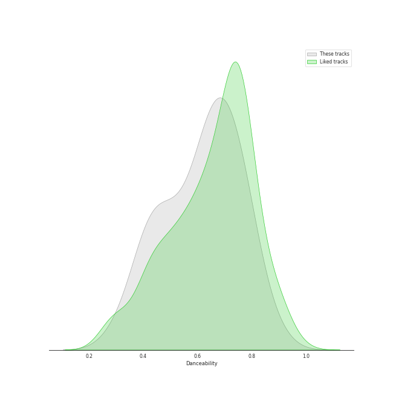
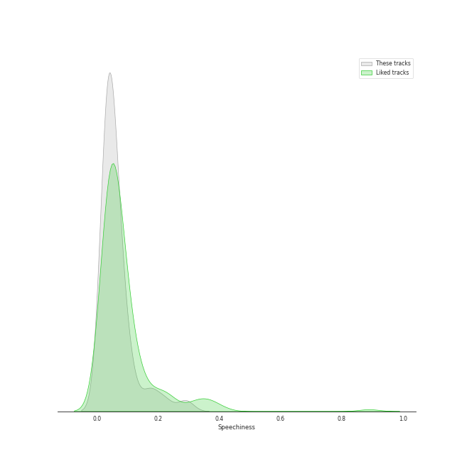
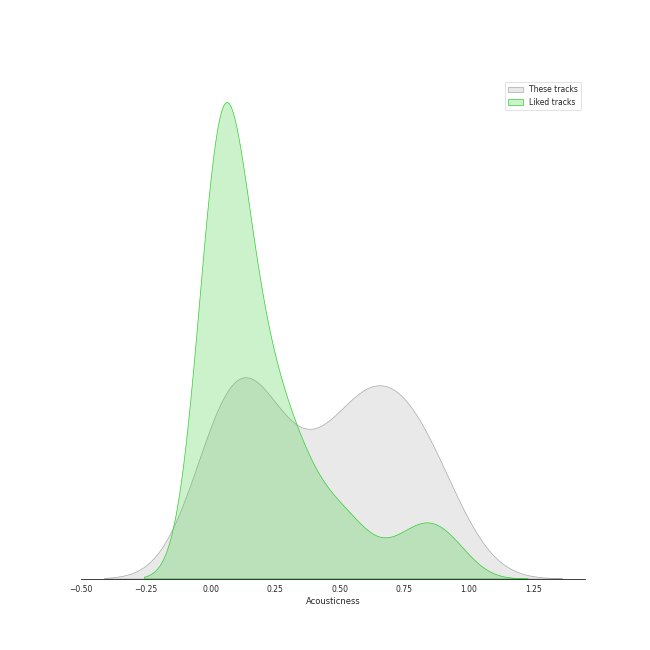
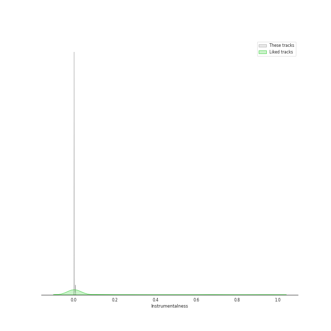
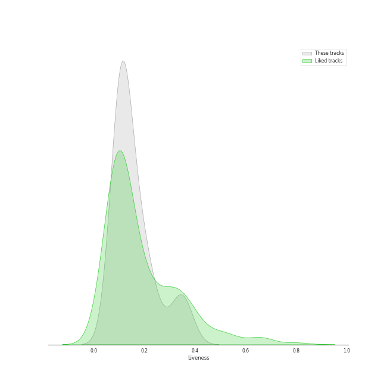
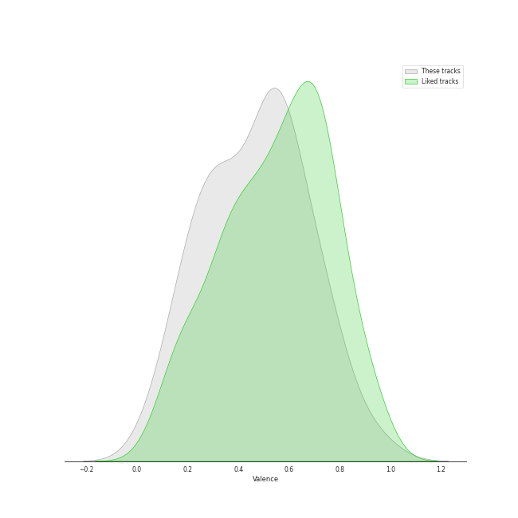

# Track Features for korean pop

## Danceability

| ​ | 10 most Danceable tracks | ​​ | 10 least Danceable tracks |
|:---|:---|:---|:---|
|  | Cat (Feat. IU) (0.882) |  | Miracle (0.302) |
|  | Queen Of The Party (0.818) |  | Like Water (0.365) |
|  | His Car Isn't Yours (0.795) |  | 내 맘을 볼 수 있나요 (0.397) |
|  | Perhaps, Happy Ending (0.786) |  | Get Ready To Leave (0.402) |
|  | VingleVingle (Prod. R.Tee) (0.785) |  | Love, Maybe (0.402) |
|  | Undo (0.784) |  | Run With Me (0.425) |
|  | LAW (Prod. Czaer) (0.756) |  | Doll (0.429) |
|  | Wish You Hell (0.754) |  | Goodbye (0.46) |
|  | Hmm BOP (0.735) |  | Best Friend (with SEULGI) (0.48) |
|  | And July (0.734) |  | Bye Bye My Blue (0.511) |

## Energy

| ​ | 10 most Energetic tracks | ​​ | 10 least Energetic tracks |
|:---|:---|:---|:---|
|  | Run (0.933) |  | 내 맘을 볼 수 있나요 (0.166) |
|  | Love's Battery (0.928) |  | Run With Me (0.295) |
|  | LAW (Prod. Czaer) (0.9) |  | Goodbye (0.316) |
|  | Hmm BOP (0.881) |  | Miracle (0.385) |
|  | Why Can't You Love Me? (0.879) |  | 봄인가 봐 Spring Love (0.391) |
|  | Event Horizon (0.861) |  | Cat (Feat. IU) (0.392) |
|  | And July (0.852) |  | Slightly Tipsy (She is My Type♡ X SANDEUL) (0.447) |
|  | Perhaps, Happy Ending (0.828) |  | Better Judgement (0.448) |
|  | Queen Of The Party (0.764) |  | Written In The Stars (0.519) |
|  | Starlight (0.735) |  | When This Rain Stops (0.521) |

## Speechiness

| ​ | 10 most Speechy tracks | ​​ | 10 least Speechy tracks |
|:---|:---|:---|:---|
|  | His Car Isn't Yours (0.29) |  | Slightly Tipsy (She is My Type♡ X SANDEUL) (0.0264) |
|  | Hmm BOP (0.222) |  | Love's Battery (0.0297) |
|  | FM 89.1 (0.182) |  | Starlight (0.0302) |
|  | Run (0.165) |  | Doll (0.0304) |
|  | Best Ever (0.131) |  | The Road (0.0307) |
|  | Bye Bye My Blue (0.114) |  | Cherry Blossom Ending (0.0312) |
|  | Vermilion (0.108) |  | Goodbye (0.0317) |
|  | And July (0.0916) |  | Miracle (0.0319) |
|  | LAW (Prod. Czaer) (0.0843) |  | Get Ready To Leave (0.0332) |
|  | HAPPEN (0.0799) |  | 내 맘을 볼 수 있나요 (0.0349) |

## Acousticness

| ​ | 10 most Acoustic tracks | ​​ | 10 least Acoustic tracks |
|:---|:---|:---|:---|
|  | 내 맘을 볼 수 있나요 (0.884) |  | Hmm BOP (0.00727) |
|  | Run With Me (0.868) |  | LAW (Prod. Czaer) (0.00857) |
|  | Goodbye (0.861) |  | Run (0.0328) |
|  | Miracle (0.846) |  | And July (0.0401) |
|  | When This Rain Stops (0.805) |  | Wish You Hell (0.0514) |
|  | Slightly Tipsy (She is My Type♡ X SANDEUL) (0.769) |  | Queen Of The Party (0.0641) |
|  | Cherry Blossom Ending (0.739) |  | Event Horizon (0.0758) |
|  | 봄인가 봐 Spring Love (0.723) |  | Starlight (0.0786) |
|  | Lyricist (0.721) |  | Shut Up & Groove (0.0859) |
|  | Last Winter (0.705) |  | Perhaps, Happy Ending (0.112) |

## Instrumentalness

| ​ | 10 most Instrumental tracks | ​​ | 10 least Instrumental tracks |
|:---|:---|:---|:---|
|  | VingleVingle (Prod. R.Tee) (0.00676) |  | Hmm BOP (0.0) |
|  | Perhaps, Happy Ending (0.00583) |  | Miracle (0.0) |
|  | FM 89.1 (0.00335) |  | Better Judgement (0.0) |
|  | Last Winter (0.00159) |  | Why Can't You Love Me? (0.0) |
|  | LAW (Prod. Czaer) (0.000111) |  | Best Friend (with SEULGI) (0.0) |
|  | Best Ever (7.14e-05) |  | And July (0.0) |
|  | First Sight (1.88e-05) |  | HAPPEN (0.0) |
|  | Wish You Hell (1.49e-05) |  | Shut Up & Groove (0.0) |
|  | Lyricist (1.14e-05) |  | Run With Me (0.0) |
|  | Like Water (6.06e-06) |  | Slightly Tipsy (She is My Type♡ X SANDEUL) (0.0) |

## Liveness

| ​ | 10 most Live tracks | ​​ | 10 least Live tracks |
|:---|:---|:---|:---|
|  | Lyricist (0.352) |  | Vermilion (0.0687) |
|  | Hmm BOP (0.345) |  | Queen Of The Party (0.0705) |
|  | HAPPEN (0.341) |  | First Sight (0.0735) |
|  | VingleVingle (Prod. R.Tee) (0.325) |  | Miracle (0.0808) |
|  | Wish You Hell (0.268) |  | Undo (0.0903) |
|  | LAW (Prod. Czaer) (0.237) |  | His Car Isn't Yours (0.094) |
|  | FM 89.1 (0.224) |  | 내 맘을 볼 수 있나요 (0.1) |
|  | Best Ever (0.205) |  | Starlight (0.101) |
|  | Doll (0.204) |  | Last Winter (0.103) |
|  | Best Friend (with SEULGI) (0.203) |  | Bandit (0.106) |

## Valence

| ​ | 10 most Happy tracks | ​​ | 10 least Happy tracks |
|:---|:---|:---|:---|
|  | Love's Battery (0.941) |  | The Road (0.073) |
|  | Best Ever (0.809) |  | 내 맘을 볼 수 있나요 (0.131) |
|  | Ya! (feat. Whee In) (0.795) |  | Run With Me (0.156) |
|  | And July (0.787) |  | Get Ready To Leave (0.208) |
|  | Hmm BOP (0.759) |  | First Sight (0.239) |
|  | Undo (0.734) |  | Like Water (0.249) |
|  | Cat (Feat. IU) (0.702) |  | Doll (0.259) |
|  | Wish You Hell (0.694) |  | Event Horizon (0.286) |
|  | Cherry Blossom Ending (0.663) |  | Bye Bye My Blue (0.297) |
|  | Why Can't You Love Me? (0.658) |  | Run (0.317) |

## Tempo

| ​ | 10 most Fast tracks | ​​ | 10 least Fast tracks |
|:---|:---|:---|:---|
|  | Love, Maybe (171.594) |  | Bandit (80.017) |
|  | Miracle (168.222) |  | Written In The Stars (80.882) |
|  | FM 89.1 (151.872) |  | Why Can't You Love Me? (81.025) |
|  | When This Rain Stops (151.759) |  | 봄인가 봐 Spring Love (82.861) |
|  | Better Judgement (149.563) |  | Like Water (83.823) |
|  | His Car Isn't Yours (139.997) |  | Bye Bye My Blue (87.702) |
|  | Doll (139.664) |  | Ya! (feat. Whee In) (88.015) |
|  | Lyricist (139.569) |  | Best Ever (89.931) |
|  | Perhaps, Happy Ending (134.992) |  | Last Winter (91.735) |
|  | 내 맘을 볼 수 있나요 (134.708) |  | Jenga (feat. Gaeko) (93.015) |
