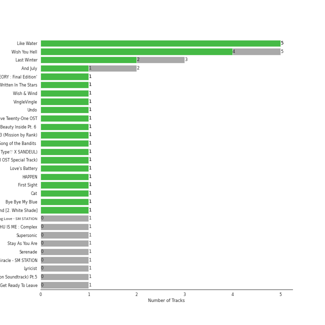

# korean pop

[53 songs](tracks.md)

## Top Artists

See all 37 artists

| Art | Tracks | 💚 | Artist | 🔗 |
|:---|---:|---:|:---|:---|
|  | 11 | 7 | [WENDY](../../artists/wendy) | [🔗](https://open.spotify.com/artist/0FRUZvZNPzM3YJMABJxf2K) |
|  | 9 | 7 | HEIZE | [🔗](https://open.spotify.com/artist/5dCvSnVduaFleCnyy98JMo) |
|  | 7 | 7 | AKMU | [🔗](https://open.spotify.com/artist/6OwKE9Ez6ALxpTaKcT5ayv) |
|  | 5 | 3 | AILEE | [🔗](https://open.spotify.com/artist/3uGFTJ7JMllvhgGpumieHF) |
|  | 4 | 3 | Lee Mujin | [🔗](https://open.spotify.com/artist/4Xj0peBt3EZHbdF20JmdWC) |
|  | 2 | 2 | [IU](../../artists/iu) | [🔗](https://open.spotify.com/artist/3HqSLMAZ3g3d5poNaI7GOU) |
|  | 2 | 2 | Sunwoojunga | [🔗](https://open.spotify.com/artist/04L3elxyr0XFua2Ek3domW) |
|  | 2 | 1 | MeloMance | [🔗](https://open.spotify.com/artist/6k4r73Wq8nhkCDoUsECL1e) |
|  | 2 | 1 | Sandeul | [🔗](https://open.spotify.com/artist/2QeJBmgBdpH4i3uJns5Rdx) |
|  | 2 | 0 | KIMSEJEONG | [🔗](https://open.spotify.com/artist/1lFLniFTaPjYCtQZvDXpqu) |
|  | 2 | 0 | Whee In | [🔗](https://open.spotify.com/artist/0BqRGrwqndrtNkojXiqIzL) |
|  | 1 | 1 | Junggigo | [🔗](https://open.spotify.com/artist/6zTIxEXFWjoNu2VXauDITb) |
|  | 1 | 1 | Yerin Baek | [🔗](https://open.spotify.com/artist/6dhfy4ByARPJdPtMyrUYJK) |
|  | 1 | 1 | [BIBI](../../artists/bibi) | [🔗](https://open.spotify.com/artist/6UbmqUEgjLA6jAcXwbM1Z9) |
|  | 1 | 1 | Younha | [🔗](https://open.spotify.com/artist/6GwM5CHqhWXzG3l5kzRSAS) |
|  | 1 | 1 | John Legend | [🔗](https://open.spotify.com/artist/5y2Xq6xcjJb2jVM54GHK3t) |
|  | 1 | 1 | Hong Jin Young | [🔗](https://open.spotify.com/artist/5LwiBgLTllBUiqQGNiQ7jY) |
|  | 1 | 1 | [BAEKHYUN](../../artists/baekhyun) | [🔗](https://open.spotify.com/artist/4ufh0WuMZh6y4Dmdnklvdl) |
|  | 1 | 1 | YESUNG | [🔗](https://open.spotify.com/artist/4hyF8Vtc73RYJr3RgTE2Zf) |
|  | 1 | 1 | Suzy | [🔗](https://open.spotify.com/artist/4U80LJd8sG6U9YTFP5izka) |
|  | 1 | 1 | WINTER | [🔗](https://open.spotify.com/artist/3mPquBmMu97Iq9TpzQ6ayI) |
|  | 1 | 1 | DEAN | [🔗](https://open.spotify.com/artist/3eCd0TZrBPm2n9cDG6yWfF) |
|  | 1 | 1 | SOYOU | [🔗](https://open.spotify.com/artist/3b4kLCI0ZJW47TFsNRqgCb) |
|  | 1 | 1 | lIlBOI | [🔗](https://open.spotify.com/artist/25wMXkplvEHJpJHX8A6Ved) |
|  | 1 | 1 | TAEIL | [🔗](https://open.spotify.com/artist/1z0Hi3myYw4x32xCq0H3aq) |
|  | 1 | 1 | Yoon Mirae | [🔗](https://open.spotify.com/artist/1Do4bSzfUl0KWL9r1fITu0) |
|  | 1 | 1 | Gaeko | [🔗](https://open.spotify.com/artist/0tkHE1pQ5ZCgQb8WZ0ba79) |
|  | 1 | 1 | dj friz | [🔗](https://open.spotify.com/artist/0js3wKXyi7RL11sfOykRt1) |
|  | 1 | 0 | Onestar | [🔗](https://open.spotify.com/artist/6EmgTIhhXGtfAmYYTfdtlz) |
|  | 1 | 0 | Zion.T | [🔗](https://open.spotify.com/artist/5HenzRvMtSrgtvU16XAoby) |
|  | 1 | 0 | KANGTA | [🔗](https://open.spotify.com/artist/5Bm6d9Fbsmln3CpXv8VrMG) |
|  | 1 | 0 | Nile Lee | [🔗](https://open.spotify.com/artist/52FvIIUS7sLLUn2mZEjWa8) |
|  | 1 | 0 | Dynamicduo | [🔗](https://open.spotify.com/artist/4nvFFLtv7ZqoTr83387uK4) |
|  | 1 | 0 | [SEULGI](../../artists/seulgi) | [🔗](https://open.spotify.com/artist/2QM5S4yO6xHgnNvF0nbZZq) |
|  | 1 | 0 | Punch | [🔗](https://open.spotify.com/artist/2FgZrgTMX6Sk0VNcOsEPmm) |
|  | 1 | 0 | Eric Nam | [🔗](https://open.spotify.com/artist/2FLqlgckDKdmpBrvLAT5BM) |
|  | 1 | 0 | Jay JungJae Moon | [🔗](https://open.spotify.com/artist/1j4rZondz64yRVHSGllqL6) |

## Top Albums

See all 46 albums

| Art | Tracks | 💚 | Album | Release Date | 🔗 |
|:---|---:|---:|:---|:---|:---|
|  | 5 | 5 | Like Water - The 1st Mini Album | 2021-04-05 | [🔗](https://open.spotify.com/album/1Ao5vWPO13f4l0ldwxOKL7) |
|  | 3 | 3 | SAILING | 2019-09-25 | [🔗](https://open.spotify.com/album/7C0Ci0alKWwwXPIFYEdVcn) |
|  | 2 | 2 | SPRING | 2016-05-04 | [🔗](https://open.spotify.com/album/0HtbFp1B1WrbUr9mcBrAhN) |
|  | 1 | 1 | butterFLY | 2019-07-02 | [🔗](https://open.spotify.com/album/7klpmNtYwM5Q0fCRIdC21I) |
|  | 1 | 1 | YOUNHA 6th Album Repackage 'END THEORY : Final Edition' | 2022-03-30 | [🔗](https://open.spotify.com/album/63mur6I6yCG9cOxOst3i7c) |
|  | 1 | 1 | Written In The Stars | 2018-10-11 | [🔗](https://open.spotify.com/album/08z3DsL7P6RpBR3FgNMSvN) |
|  | 1 | 1 | Wish & Wind | 2018-03-08 | [🔗](https://open.spotify.com/album/5Fs2dlwUz1zkNcUPu6KaKF) |
|  | 1 | 1 | When it snows(Feat.Heize) | 2021-12-03 | [🔗](https://open.spotify.com/album/1d2YKQ02RQA97EyrB55ZcK) |
|  | 1 | 1 | VingleVingle | 2023-04-05 | [🔗](https://open.spotify.com/album/10Ldh1KXu0ySjpfiX6qLXQ) |
|  | 1 | 1 | Undo | 2022-06-30 | [🔗](https://open.spotify.com/album/2xR7YEyRweqClzs50bbW3J) |
|  | 1 | 1 | Twenty-Five Twenty-One OST | 2022-04-03 | [🔗](https://open.spotify.com/album/77NPr874WU941XZhjO43dR) |
|  | 1 | 1 | Traffic light | 2021-05-14 | [🔗](https://open.spotify.com/album/4lHGpxL8peLQSZRgl1Lssm) |
|  | 1 | 1 | The Beauty Inside Pt. 6 (Original Television Soundtrack) | 2018-11-06 | [🔗](https://open.spotify.com/album/6w3jg4xGMI5LLr5DEL3zWY) |
|  | 1 | 1 | Sweet (A Business Proposal OST Part.1) | 2022-02-28 | [🔗](https://open.spotify.com/album/2bB29MkoBHc7vm2fr2EdiZ) |
|  | 1 | 1 | Street Man Fighter Original Vol.3 (Mission by Rank) | 2022-09-06 | [🔗](https://open.spotify.com/album/54UUQN3j32n8TA2OJxTcHP) |
|  | 1 | 1 | Some | 2014-02-07 | [🔗](https://open.spotify.com/album/2r1oAmMSnUasXigJ2fTwk6) |
|  | 1 | 1 | Slightly Tipsy (She is My Type♡ X SANDEUL) | 2020-07-20 | [🔗](https://open.spotify.com/album/2bal48tjyi26OAxY2KxwFL) |
|  | 1 | 1 | Serenade | 2019-12-12 | [🔗](https://open.spotify.com/album/2McJE8dHLru3MgR1bcxdyF) |
|  | 1 | 1 | PLAY | 2014-04-07 | [🔗](https://open.spotify.com/album/1eu07xRE0vQfN5et0Y3DAy) |
|  | 1 | 1 | NEXT EPISODE | 2021-07-26 | [🔗](https://open.spotify.com/album/0Pt0eGpyNO5dDN8PORypSy) |
|  | 1 | 1 | Love, Maybe (A Business Proposal OST Special Track) | 2022-02-18 | [🔗](https://open.spotify.com/album/5lKdnY9bGYUyfaJhcRnHgk) |
|  | 1 | 1 | Love's Battery | 2009-06-19 | [🔗](https://open.spotify.com/album/03IVWQyi8lzS4t2WQKu5iI) |
|  | 1 | 1 | Invitation | 2012-10-16 | [🔗](https://open.spotify.com/album/61scVtZ044GUBV4rIvOcPQ) |
|  | 1 | 1 | I'M LOVIN' AMY | 2022-03-07 | [🔗](https://open.spotify.com/album/3AL0qHWE5sF8SYY273nFXX) |
|  | 1 | 1 | HAPPEN | 2021-05-20 | [🔗](https://open.spotify.com/album/4xOOB79WcZuOoVwK06No1s) |
|  | 1 | 1 | Floral Sense - The 1st Album (Special Version) | 2023-02-27 | [🔗](https://open.spotify.com/album/3GiIDO4BTLwJuZWQszk4Tg) |
|  | 1 | 1 | First Sight | 2018-12-14 | [🔗](https://open.spotify.com/album/5M9f9Tze7sspUDrIAjdCgV) |
|  | 1 | 1 | Dream | 2016-01-07 | [🔗](https://open.spotify.com/album/7ciJtZ2tYXhKsndQ7bf7Vw) |
|  | 1 | 1 | Cat | 2017-12-28 | [🔗](https://open.spotify.com/album/3b8iQhtbLD0Vn4EqQzMC3N) |
|  | 1 | 1 | Bye bye my blue | 2016-06-20 | [🔗](https://open.spotify.com/album/22qM69DGAvUsSyQfVh8Lgm) |
|  | 1 | 1 | And July | 2016-07-18 | [🔗](https://open.spotify.com/album/3xUWeFeLn6m3NXKr0FlT3E) |
|  | 1 | 0 | 봄인가 봐 Spring Love - SM STATION | 2016-03-04 | [🔗](https://open.spotify.com/album/1DzMyEZcFmD72jdkp4O73D) |
|  | 1 | 0 | Stay As You Are | 2016-10-04 | [🔗](https://open.spotify.com/album/6DKfXf0BVP9R5BcOuD1mfo) |
|  | 1 | 0 | Solo Christmas | 2021-12-11 | [🔗](https://open.spotify.com/album/3GnhJ2bDR3nR95f0y4UV5h) |
|  | 1 | 0 | Silent Night | 2020-12-04 | [🔗](https://open.spotify.com/album/2PE8nbVNmtWgs8jzgxuRJI) |
|  | 1 | 0 | Miracle - SM STATION | 2023-01-26 | [🔗](https://open.spotify.com/album/54O0kItm5ej0HThVMIv5hF) |
|  | 1 | 0 | Lyricist | 2020-06-10 | [🔗](https://open.spotify.com/album/6igUyuDlRCyjoTtPXui6bT) |
|  | 1 | 0 | Love, Maybe (A Business Proposal OST Bonus Track) | 2022-04-05 | [🔗](https://open.spotify.com/album/7I3EMy3n72e6ABSq4Ubhoz) |
|  | 1 | 0 | LUCKYNUMBERS | 2013-07-01 | [🔗](https://open.spotify.com/album/4I0RE0MF6b3Hw4Z0iWosxF) |
|  | 1 | 0 | Jelly box Flower Way SEJEONG | 2016-11-23 | [🔗](https://open.spotify.com/album/32dL7nyPowMbiu8QFrAkIM) |
|  | 1 | 0 | Hotel del Luna (Original Television Soundtrack) Pt.5 | 2019-07-28 | [🔗](https://open.spotify.com/album/2PdRNAz6mDmy9OR7hDCrH5) |
|  | 1 | 0 | Hotel del Luna (Original Television Soundtrack) Pt.12 | 2019-08-18 | [🔗](https://open.spotify.com/album/6iNbnT79OJu9C5j5ZZLQvZ) |
|  | 1 | 0 | Have Yourself A Merry Little Christmas | 2016-12-23 | [🔗](https://open.spotify.com/album/65iTqWmb0hH7TTiZ0gAbvp) |
|  | 1 | 0 | HOSPITAL PLAYLIST Season2 (Original Television Soundtrack), Pt. 1 | 2021-06-18 | [🔗](https://open.spotify.com/album/2pJhtrlZZvxFi818EMvKAY) |
|  | 1 | 0 | Get Ready To Leave | 2022-10-18 | [🔗](https://open.spotify.com/album/0UY2l5txL7IjXCB9LnBZ6R) |
|  | 1 | 0 | Doll - SM STATION | 2017-10-27 | [🔗](https://open.spotify.com/album/6YHteiOLrZ7gfQEqq2TeRM) |

## Top Record Labels

See all 28 labels

| Tracks | 💚 | Label |
|---:|---:|:---|
| 12 | 8 | [SM Entertainment](../../labels/sm_entertainment) |
| 8 | 6 | [Genie Music Corporation](../../labels/genie_music_corporation) |
| 7 | 7 | [YG Entertainment](../../labels/yg_entertainment) |
| 5 | 3 | [Stone Music Entertainment](../../labels/stone_music_entertainment) |
| 3 | 2 | FLEX M |
| 2 | 2 | ShowPLAY ENTERTAINMENT |
| 2 | 2 | MAGIC STRAWBERRY SOUND |
| 2 | 2 | [JYP Entertainment](../../labels/jyp_entertainment) |
| 2 | 0 | FNC인베스트먼트 |
| 1 | 1 | 코어콘텐츠미디어 |
| 1 | 1 | 스튜디오앤뉴 |
| 1 | 1 | 뮤직앤뉴 |
| 1 | 1 | 더라이브레이블 |
| 1 | 1 | YMC Ent. |
| 1 | 1 | TOON STUDIO |
| 1 | 1 | Studio MaumC |
| 1 | 1 | Starship Ent. |
| 1 | 1 | MYSTIC ENTERTAINMENT |
| 1 | 1 | JS MUSIC |
| 1 | 1 | Hwa&Dam pictures |
| 1 | 1 | ChoongangICS |
| 1 | 1 | CJ E&M MUSIC |
| 1 | 1 | C9 Entertainment |
| 1 | 0 | [WM Korea](../../labels/wm_korea) |
| 1 | 0 | [WM Entertainment](../../labels/wm_entertainment) |
| 1 | 0 | Today's Playlist |
| 1 | 0 | Sun and Sky Records |
| 1 | 0 | JELLYFISH ENTERTAINMENT |

## Years

| 10 newest albums | 10 oldest albums |
|:---|:---|
| 
 VingleVingle (2023-04-05)
 | 
 Love's Battery (2009-06-19)
 |
| 
 Floral Sense - The 1st Album (Special Version) (2023-02-27)
 | 
 Invitation (2012-10-16)
 |
| 
 Miracle - SM STATION (2023-01-26)
 | 
 LUCKYNUMBERS (2013-07-01)
 |
| 
 Get Ready To Leave (2022-10-18)
 | 
 Some (2014-02-07)
 |
| 
 Street Man Fighter Original Vol.3 (Mission by Rank) (2022-09-06)
 | 
 PLAY (2014-04-07)
 |
| 
 Undo (2022-06-30)
 | 
 Dream (2016-01-07)
 |
| 
 Love, Maybe (A Business Proposal OST Bonus Track) (2022-04-05)
 | 
 봄인가 봐 Spring Love - SM STATION (2016-03-04)
 |
| 
 Twenty-Five Twenty-One OST (2022-04-03)
 | 
 SPRING (2016-05-04)
 |
| 
 YOUNHA 6th Album Repackage 'END THEORY : Final Edition' (2022-03-30)
 | 
 Bye bye my blue (2016-06-20)
 |
| 
 I'M LOVIN' AMY (2022-03-07)
 | 
 And July (2016-07-18)
 |
## Audio Features

| 10 most Danceable tracks | 10 least Danceable tracks |
|:---|:---|
| Cat (Feat. IU) (0.882) | Miracle (0.302) |
| NAKKA (with IU) (0.816) | Sweet (0.302) |
| How People Move (0.813) | Silent Night (0.333) |
| RE-BYE (0.799) | Like Water (0.365) |
| Whale (0.788) | Melted (0.384) |
| VingleVingle (Prod. R.Tee) (0.785) | 내 맘을 볼 수 있나요 (0.397) |
| Undo (0.784) | Get Ready To Leave (0.402) |
| LAW (Prod. Czaer) (0.756) | Love, Maybe (0.402) |
| Some (feat. Lil Boi) (0.738) | Have Yourself A Merry Little Christmas (0.408) |
| And July (0.734) | Floral Sense (0.411) |

| 10 most Energetic tracks | 10 least Energetic tracks |
|:---|:---|
| Love's Battery (0.928) | Silent Night (0.0831) |
| LAW (Prod. Czaer) (0.9) | 내 맘을 볼 수 있나요 (0.166) |
| Why Can't You Love Me? (0.879) | How can I love the heartbreak, you're the one I love (0.248) |
| I will show you (0.872) | Solo Christmas (0.259) |
| Event Horizon (0.861) | Rain and You (0.275) |
| And July (0.852) | Flower Way (Prod. By ZICO) (0.282) |
| How People Move (0.836) | Have Yourself A Merry Little Christmas (0.292) |
| Three Dopeboyz (Feat. Zion.T) (0.757) | Run With Me (0.295) |
| Starlight (0.735) | Goodbye (0.316) |
| Love, Maybe (0.731) | Melted (0.361) |

| 10 most Speechy tracks | 10 least Speechy tracks |
|:---|:---|
| Three Dopeboyz (Feat. Zion.T) (0.257) | Slightly Tipsy (She is My Type♡ X SANDEUL) (0.0264) |
| Whale (0.181) | Rain and You (0.027) |
| Dream (0.139) | Love, Maybe (Acoustic Ver.) (0.0291) |
| Bye bye my blue (0.114) | Love's Battery (0.0297) |
| NAKKA (with IU) (0.101) | Starlight (0.0302) |
| And July (0.0916) | Doll (0.0304) |
| LAW (Prod. Czaer) (0.0843) | The Road (0.0307) |
| How People Move (0.0823) | Silent Night (0.0309) |
| HAPPEN (0.0799) | Melted (0.0311) |
| Cat (Feat. IU) (0.0751) | When it snows(Feat.Heize) (0.0316) |

| 10 most Acoustic tracks | 10 least Acoustic tracks |
|:---|:---|
| Silent Night (0.92) | Headlock (0.000953) |
| How can I love the heartbreak, you're the one I love (0.91) | LAW (Prod. Czaer) (0.00857) |
| 내 맘을 볼 수 있나요 (0.884) | And July (0.0401) |
| Run With Me (0.868) | NAKKA (with IU) (0.0732) |
| Goodbye (0.861) | Event Horizon (0.0758) |
| Solo Christmas (0.858) | Three Dopeboyz (Feat. Zion.T) (0.078) |
| Miracle (0.846) | Starlight (0.0786) |
| Melted (0.832) | Traffic light (0.0965) |
| Flower Way (Prod. By ZICO) (0.831) | Why Can't You Love Me? (0.136) |
| When This Rain Stops (0.805) | Love's Battery (0.143) |

| 10 most Instrumental tracks | 10 least Instrumental tracks |
|:---|:---|
| VingleVingle (Prod. R.Tee) (0.00676) | Miracle (0.0) |
| Whale (0.00351) | Traffic light (0.0) |
| FREEDOM (0.000966) | Why Can't You Love Me? (0.0) |
| Floral Sense (0.000598) | Best Friend (with SEULGI) (0.0) |
| LAW (Prod. Czaer) (0.000111) | Done For Me (0.0) |
| Rain and You (7.31e-05) | And July (0.0) |
| NAKKA (with IU) (2.81e-05) | How People Move (0.0) |
| Silent Night (2.47e-05) | Some (feat. Lil Boi) (0.0) |
| First Sight (1.88e-05) | HAPPEN (0.0) |
| Lyricist (1.14e-05) | Flower Way (Prod. By ZICO) (0.0) |

| 10 most Live tracks | 10 least Live tracks |
|:---|:---|
| Headlock (0.507) | How People Move (0.0511) |
| Lyricist (0.352) | Traffic light (0.0694) |
| HAPPEN (0.341) | Silent Night (0.0735) |
| Floral Sense (0.335) | First Sight (0.0735) |
| VingleVingle (Prod. R.Tee) (0.325) | Miracle (0.0808) |
| Three Dopeboyz (Feat. Zion.T) (0.311) | Dream (0.0876) |
| When it snows(Feat.Heize) (0.289) | Undo (0.0903) |
| Murder On The Dance Floor (0.253) | 내 맘을 볼 수 있나요 (0.1) |
| Some (feat. Lil Boi) (0.253) | Starlight (0.101) |
| LAW (Prod. Czaer) (0.237) | Melted (0.103) |

| 10 most Happy tracks | 10 least Happy tracks |
|:---|:---|
| Some (feat. Lil Boi) (0.961) | The Road (0.073) |
| Love's Battery (0.941) | 내 맘을 볼 수 있나요 (0.131) |
| RE-BYE (0.924) | FREEDOM (0.152) |
| How People Move (0.848) | Run With Me (0.156) |
| Ya! (feat. Whee In) (0.795) | Silent Night (0.16) |
| And July (0.787) | Melted (0.169) |
| Undo (0.734) | When it snows(Feat.Heize) (0.176) |
| Cat (Feat. IU) (0.702) | Get Ready To Leave (0.208) |
| Whale (0.684) | I will show you (0.226) |
| Headlock (0.672) | How can I love the heartbreak, you're the one I love (0.228) |
