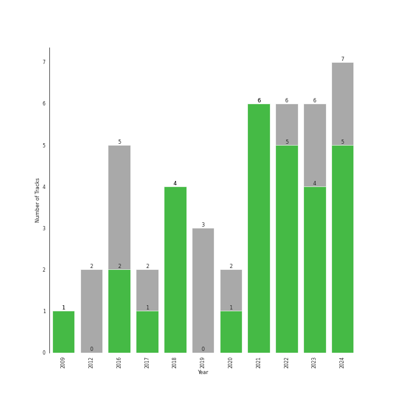

# korean pop

42 songs

[See Track Features](audio_features.md)

[See Clusters](clusters/overview.md)

## Top Artists

| Art | Rank | Tracks | 💚 | Artist | 🔗 |
|:---|---:|---:|---:|:---|:---|
|  | 28 | 15 | 11 | [WENDY](../../artists/wendy/overview.md) | [🔗](https://open.spotify.com/artist/0FRUZvZNPzM3YJMABJxf2K) |
|  | 36 | 12 | 8 | [HEIZE](../../artists/heize/overview.md) | [🔗](https://open.spotify.com/artist/5dCvSnVduaFleCnyy98JMo) |
|  | 282 | 2 | 2 | TAEIL | [🔗](https://open.spotify.com/artist/1z0Hi3myYw4x32xCq0H3aq) |
|  | 414 | 2 | 1 | MeloMance | [🔗](https://open.spotify.com/artist/6k4r73Wq8nhkCDoUsECL1e) |
|  | 166 | 2 | 1 | Younha | [🔗](https://open.spotify.com/artist/6GwM5CHqhWXzG3l5kzRSAS) |
|  | 345 | 2 | 1 | DEAN | [🔗](https://open.spotify.com/artist/3eCd0TZrBPm2n9cDG6yWfF) |
|  | 291 | 2 | 1 | Sandeul | [🔗](https://open.spotify.com/artist/2QeJBmgBdpH4i3uJns5Rdx) |
|  | 414 | 2 | 1 | Sunwoojunga | [🔗](https://open.spotify.com/artist/04L3elxyr0XFua2Ek3domW) |
|  | 414 | 1 | 1 | Yerin Baek | [🔗](https://open.spotify.com/artist/6dhfy4ByARPJdPtMyrUYJK) |
|  | 70 | 1 | 1 | [BIBI](../../artists/bibi/overview.md) | [🔗](https://open.spotify.com/artist/6UbmqUEgjLA6jAcXwbM1Z9) |

See all 23 artists

| Art | Rank | Tracks | 💚 | Artist | 🔗 |
|:---|---:|---:|---:|:---|:---|
|  | 414 | 1 | 1 | John Legend | [🔗](https://open.spotify.com/artist/5y2Xq6xcjJb2jVM54GHK3t) |
|  | 311 | 1 | 1 | HONG JIN YOUNG | [🔗](https://open.spotify.com/artist/5LwiBgLTllBUiqQGNiQ7jY) |
|  | 4 | 1 | 1 | [IU](../../artists/iu/overview.md) | [🔗](https://open.spotify.com/artist/3HqSLMAZ3g3d5poNaI7GOU) |
|  | 214 | 1 | 1 | YOON MIRAE | [🔗](https://open.spotify.com/artist/1Do4bSzfUl0KWL9r1fITu0) |
|  | 346 | 1 | 1 | Gaeko | [🔗](https://open.spotify.com/artist/0tkHE1pQ5ZCgQb8WZ0ba79) |
|  | 414 | 1 | 1 | dj friz | [🔗](https://open.spotify.com/artist/0js3wKXyi7RL11sfOykRt1) |
|  | 414 | 1 | 0 | Busker Busker | [🔗](https://open.spotify.com/artist/6jgrgDBt1SbtNbc25sLaTH) |
|  | 414 | 1 | 0 | Onestar | [🔗](https://open.spotify.com/artist/6EmgTIhhXGtfAmYYTfdtlz) |
|  | 414 | 1 | 0 | KANGTA | [🔗](https://open.spotify.com/artist/5Bm6d9Fbsmln3CpXv8VrMG) |
|  | 376 | 1 | 0 | Hui | [🔗](https://open.spotify.com/artist/4R0tSGcVRQ8ZXPzttU8mHy) |
|  | 35 | 1 | 0 | [SEULGI](../../artists/seulgi/overview.md) | [🔗](https://open.spotify.com/artist/2QM5S4yO6xHgnNvF0nbZZq) |
|  | 414 | 1 | 0 | Eric Nam | [🔗](https://open.spotify.com/artist/2FLqlgckDKdmpBrvLAT5BM) |
|  | 403 | 1 | 0 | Whee In | [🔗](https://open.spotify.com/artist/0BqRGrwqndrtNkojXiqIzL) |

## Most and least listened tracks
| Rank | ​ | Most listened tracks | Rank | ​​ | Least listened tracks |
|---:|:---|:---|---:|:---|:---|
| 27 |  | [When This Rain Stops](../../artists/wendy/overview.md) | 921 |  | [The Road](../../artists/wendy/overview.md) |
| 115 |  | [Like Water](../../artists/wendy/overview.md) | 921 |  | Starlight |
| 151 |  | [Better Judgement](../../artists/wendy/overview.md) | 921 |  | [봄인가 봐 Spring Love](../../artists/wendy/overview.md) |
| 185 |  | [FM 89.1](../../artists/heize/overview.md) | 921 |  | [Written In The Stars](../../artists/wendy/overview.md) |
| 234 |  | [Undo](../../artists/heize/overview.md) | 921 |  | [His Car Isn't Yours](../../artists/wendy/overview.md) |
| 237 |  | [Perhaps, Happy Ending](../../artists/heize/overview.md) | 921 |  | [Doll](../../artists/wendy/overview.md) |
| 244 |  | [Wish You Hell](../../artists/wendy/overview.md) | 921 |  | Run |
| 285 |  | [VingleVingle (Prod. R.Tee)](../../artists/heize/overview.md) | 921 |  | Cherry Blossom Ending |
| 362 |  | LAW (Prod. Czaer) | 921 |  | [Vermilion](../../artists/wendy/overview.md) |
| 398 |  | [Queen Of The Party](../../artists/wendy/overview.md) | 921 |  | Cat (Feat. IU) |

## Top Albums

| Art | Rank | Tracks | 💚 | Album | Release Date | 🔗 |
|:---|---:|---:|---:|:---|:---|:---|
|  | 20 | 5 | 5 | Like Water - The 1st Mini Album | 2021-04-05 | [🔗](https://open.spotify.com/album/1Ao5vWPO13f4l0ldwxOKL7) |
|  | 111 | 5 | 4 | Wish You Hell - The 2nd Mini Album | 2024-03-12 | [🔗](https://open.spotify.com/album/3f8n88uX0tNvA8HTROgSkr) |
|  | 129 | 3 | 2 | Last Winter | 2023-12-07 | [🔗](https://open.spotify.com/album/41vj1sO4NJFriquGszDSh5) |
|  | 612 | 2 | 1 | And July | 2016-07-18 | [🔗](https://open.spotify.com/album/3xUWeFeLn6m3NXKr0FlT3E) |
|  | 378 | 1 | 1 | YOUNHA 6th Album Repackage 'END THEORY : Final Edition' | 2022-03-30 | [🔗](https://open.spotify.com/album/63mur6I6yCG9cOxOst3i7c) |
|  | 612 | 1 | 1 | Written In The Stars | 2018-10-11 | [🔗](https://open.spotify.com/album/08z3DsL7P6RpBR3FgNMSvN) |
|  | 612 | 1 | 1 | Wish & Wind | 2018-03-08 | [🔗](https://open.spotify.com/album/5Fs2dlwUz1zkNcUPu6KaKF) |
|  | 210 | 1 | 1 | VingleVingle | 2023-04-05 | [🔗](https://open.spotify.com/album/10Ldh1KXu0ySjpfiX6qLXQ) |
|  | 168 | 1 | 1 | Undo | 2022-06-30 | [🔗](https://open.spotify.com/album/2xR7YEyRweqClzs50bbW3J) |
|  | 362 | 1 | 1 | Twenty-Five Twenty-One OST | 2022-04-03 | [🔗](https://open.spotify.com/album/77NPr874WU941XZhjO43dR) |

See all 31 albums

| Art | Rank | Tracks | 💚 | Album | Release Date | 🔗 |
|:---|---:|---:|---:|:---|:---|:---|
|  | 612 | 1 | 1 | The Beauty Inside Pt. 6 (Original Television Soundtrack) | 2018-11-06 | [🔗](https://open.spotify.com/album/6w3jg4xGMI5LLr5DEL3zWY) |
|  | 261 | 1 | 1 | Street Man Fighter Original Vol.3 (Mission by Rank) | 2022-09-06 | [🔗](https://open.spotify.com/album/54UUQN3j32n8TA2OJxTcHP) |
|  | 211 | 1 | 1 | Song of the Bandits (Original Soundtrack from the Netflix Series) | 2023-09-22 | [🔗](https://open.spotify.com/album/1TXOVlZGrd3KbphTcXN8vw) |
|  | 367 | 1 | 1 | Slightly Tipsy (She is My Type♡ X SANDEUL) | 2020-07-20 | [🔗](https://open.spotify.com/album/2bal48tjyi26OAxY2KxwFL) |
|  | 612 | 1 | 1 | Love, Maybe (A Business Proposal OST Special Track) | 2022-02-18 | [🔗](https://open.spotify.com/album/5lKdnY9bGYUyfaJhcRnHgk) |
|  | 398 | 1 | 1 | Love's Battery | 2009-06-19 | [🔗](https://open.spotify.com/album/03IVWQyi8lzS4t2WQKu5iI) |
|  | 612 | 1 | 1 | HAPPEN | 2021-05-20 | [🔗](https://open.spotify.com/album/4xOOB79WcZuOoVwK06No1s) |
|  | 612 | 1 | 1 | First Sight | 2018-12-14 | [🔗](https://open.spotify.com/album/5M9f9Tze7sspUDrIAjdCgV) |
|  | 612 | 1 | 1 | Cat | 2017-12-28 | [🔗](https://open.spotify.com/album/3b8iQhtbLD0Vn4EqQzMC3N) |
|  | 612 | 1 | 1 | Bye Bye My Blue | 2016-06-20 | [🔗](https://open.spotify.com/album/22qM69DGAvUsSyQfVh8Lgm) |
|  | 612 | 1 | 0 | 봄인가 봐 Spring Love - SM STATION | 2016-03-04 | [🔗](https://open.spotify.com/album/1DzMyEZcFmD72jdkp4O73D) |
|  | 545 | 1 | 0 | WHU IS ME : Complex | 2024-01-16 | [🔗](https://open.spotify.com/album/3wyyezKZopI2uO3hDZP9So) |
|  | 612 | 1 | 0 | Supersonic | 2012-07-03 | [🔗](https://open.spotify.com/album/1n4Qyjro1E8gbqKlaZxhyM) |
|  | 612 | 1 | 0 | Stay As You Are | 2016-10-04 | [🔗](https://open.spotify.com/album/6DKfXf0BVP9R5BcOuD1mfo) |
|  | 612 | 1 | 0 | Serenade | 2019-12-12 | [🔗](https://open.spotify.com/album/2McJE8dHLru3MgR1bcxdyF) |
|  | 612 | 1 | 0 | Miracle - SM STATION | 2023-01-26 | [🔗](https://open.spotify.com/album/54O0kItm5ej0HThVMIv5hF) |
|  | 612 | 1 | 0 | Lyricist | 2020-06-10 | [🔗](https://open.spotify.com/album/6igUyuDlRCyjoTtPXui6bT) |
|  | 456 | 1 | 0 | Hotel del Luna (Original Television Soundtrack) Pt.5 | 2019-07-28 | [🔗](https://open.spotify.com/album/2PdRNAz6mDmy9OR7hDCrH5) |
|  | 612 | 1 | 0 | Get Ready To Leave | 2022-10-18 | [🔗](https://open.spotify.com/album/0UY2l5txL7IjXCB9LnBZ6R) |
|  | 612 | 1 | 0 | Doll - SM STATION | 2017-10-27 | [🔗](https://open.spotify.com/album/6YHteiOLrZ7gfQEqq2TeRM) |
|  | 612 | 1 | 0 | Busker Busker 1st | 2012-03-29 | [🔗](https://open.spotify.com/album/56XzxNKUGySZcu1nByxo3y) |

## Top Record Labels

| Tracks | 💚 | Label |
|---:|---:|:---|
| 14 | 10 | [SM Entertainment](../../labels/sm_entertainment/overview.md) |
| 13 | 9 | [Genie Music Corporation](../../labels/genie_music_corporation/overview.md) |
| 7 | 6 | [Stone Music Entertainment](../../labels/stone_music_entertainment/overview.md) |
| 2 | 1 | MAGIC STRAWBERRY SOUND |
| 2 | 1 | CJ E&M MUSIC |
| 1 | 1 | 코어콘텐츠미디어 |
| 1 | 1 | 스튜디오앤뉴 |
| 1 | 1 | 뮤직앤뉴 |
| 1 | 1 | TOON STUDIO |
| 1 | 1 | Studio MaumC |

See all 18 labels

| Tracks | 💚 | Label |
|---:|---:|:---|
| 1 | 1 | [JYP Entertainment](../../labels/jyp_entertainment/overview.md) |
| 1 | 1 | Hwa&Dam pictures |
| 1 | 1 | FLEX M |
| 1 | 1 | C9 Entertainment |
| 1 | 0 | [WM Entertainment](../../labels/wm_entertainment/overview.md) |
| 1 | 0 | Today's Playlist |
| 1 | 0 | [CUBE ENTERTAINMENT](../../labels/cube_entertainment/overview.md) |
| 1 | 0 | Beyond Music |

## Top Producers

| Art | Producer | Tracks | Credit Types |
|:---|:---|---:|:---|
| | [R.Tee](../../producers/r_tee/overview.md) | 1 | Producer |
## Years

| ​ | 10 newest albums | ​​ | 10 oldest albums |
|:---|:---|:---|:---|
|  | Wish You Hell - The 2nd Mini Album (2024-03-12) |  | Love's Battery (2009-06-19) |
|  | WHU IS ME : Complex (2024-01-16) |  | Busker Busker 1st (2012-03-29) |
|  | Last Winter (2023-12-07) |  | Supersonic (2012-07-03) |
|  | Song of the Bandits (Original Soundtrack from the Netflix Series) (2023-09-22) |  | 봄인가 봐 Spring Love - SM STATION (2016-03-04) |
|  | VingleVingle (2023-04-05) |  | Bye Bye My Blue (2016-06-20) |
|  | Miracle - SM STATION (2023-01-26) |  | And July (2016-07-18) |
|  | Get Ready To Leave (2022-10-18) |  | Stay As You Are (2016-10-04) |
|  | Street Man Fighter Original Vol.3 (Mission by Rank) (2022-09-06) |  | Doll - SM STATION (2017-10-27) |
|  | Undo (2022-06-30) |  | Cat (2017-12-28) |
|  | Twenty-Five Twenty-One OST (2022-04-03) |  | Wish & Wind (2018-03-08) |

