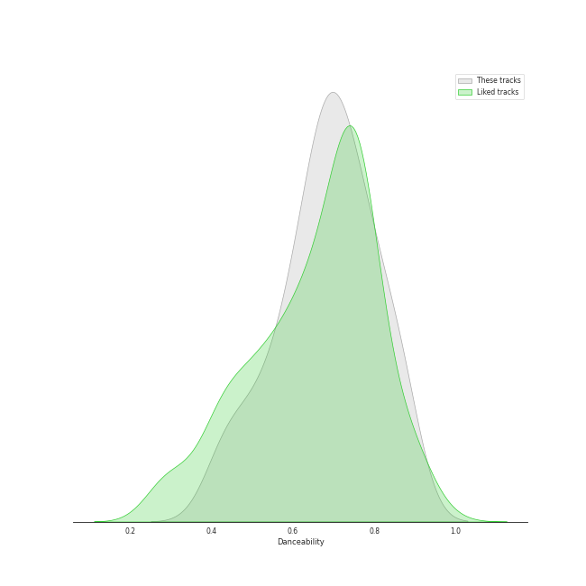
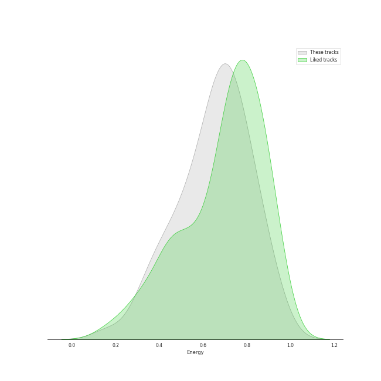

# Audio Features for korean r&b

## Danceability

| ​ | 10 most Danceable tracks | ​​ | 10 least Danceable tracks |
|:---|:---|:---|:---|
|  | Sour candy (0.871) |  | Seed (0.395) |
|  | Don’t (0.85) |  | 내 맘을 볼 수 있나요 (0.397) |
|  | VIBE (feat. Jimin of BTS) (0.787) |  | BIBI Vengeance (0.442) |
|  | VingleVingle (Prod. R.Tee) (0.785) |  | GANADARA (Feat. IU) (0.492) |
|  | Undo (0.784) |  | D (Half Moon) (0.512) |
|  | VIBE (feat. Jimin of BTS) (0.78) |  | Very, Slowly (0.528) |
|  | New thing (Prod. ZICO) (Feat. Homies) (0.775) |  | My Day Is Full Of You (0.557) |
|  | Shoong! (feat. LISA of BLACKPINK) (0.763) |  | Lyricist (0.566) |
|  | LAW (Prod. Czaer) (0.756) |  | WAITING (0.586) |
|  | Rush Hour (Feat. j-hope of BTS) (0.738) |  | Nightfall (feat. Bryan Chase) (0.593) |

## Energy

| ​ | 10 most Energetic tracks | ​​ | 10 least Energetic tracks |
|:---|:---|:---|:---|
|  | LAW (Prod. Czaer) (0.9) |  | 내 맘을 볼 수 있나요 (0.166) |
|  | WAITING (0.871) |  | Wicked (0.32) |
|  | New thing (Prod. ZICO) (Feat. Homies) (0.865) |  | Seed (0.33) |
|  | And July (0.852) |  | Can't Stop This Party (0.409) |
|  | Sour candy (0.843) |  | Very, Slowly (0.423) |
|  | One way love (0.817) |  | POOL(Feat. Sumin) (0.453) |
|  | Into You (0.805) |  | Don’t (0.488) |
|  | Say Yes (0.778) |  | Make Up (Feat. Crush) (0.497) |
|  | Inspiration (feat. Beenzino) (0.766) |  | 눈,코,입 (Eyes, Nose, Lips) (0.516) |
|  | D (Half Moon) (0.765) |  | Running Through The Night (0.532) |

## Speechiness

| ​ | 10 most Speechy tracks | ​​ | 10 least Speechy tracks |
|:---|:---|:---|:---|
|  | New thing (Prod. ZICO) (Feat. Homies) (0.307) |  | Very, Slowly (0.0264) |
|  | MOMMAE (0.287) |  | Wicked (0.0273) |
|  | All I Wanna Do (0.267) |  | One way love (0.0306) |
|  | Three Dopeboyz (Feat. Zion.T) (0.257) |  | Animal Farm (0.0315) |
|  | Rush Hour (Feat. j-hope of BTS) (0.249) |  | Somebody! (0.0328) |
|  | GANADARA (Feat. IU) (0.244) |  | Heartbeat (0.0332) |
|  | Can't Stop This Party (0.137) |  | Only Look At Me (나만 바라봐) (0.0336) |
|  | D (Half Moon) (0.136) |  | My Day Is Full Of You (0.034) |
|  | LULLABY (0.128) |  | 내 맘을 볼 수 있나요 (0.0349) |
|  | And July (0.0916) |  | Seed (0.0358) |

## Acousticness

| ​ | 10 most Acoustic tracks | ​​ | 10 least Acoustic tracks |
|:---|:---|:---|:---|
|  | 내 맘을 볼 수 있나요 (0.884) |  | WAITING (0.00213) |
|  | 눈,코,입 (Eyes, Nose, Lips) (0.736) |  | Nightfall (feat. Bryan Chase) (0.00677) |
|  | Wicked (0.728) |  | Shoong! (feat. LISA of BLACKPINK) (0.00789) |
|  | Lyricist (0.721) |  | LAW (Prod. Czaer) (0.00857) |
|  | Very, Slowly (0.678) |  | Animal Farm (0.0201) |
|  | Heartbeat (0.662) |  | BIBI Vengeance (0.0272) |
|  | Can't Stop This Party (0.608) |  | Inspiration (feat. Beenzino) (0.0277) |
|  | Don’t (0.552) |  | And July (0.0401) |
|  | My Day Is Full Of You (0.532) |  | New thing (Prod. ZICO) (Feat. Homies) (0.0453) |
|  | Make Up (Feat. Crush) (0.502) |  | One way love (0.0577) |

## Instrumentalness

| ​ | 10 most Instrumental tracks | ​​ | 10 least Instrumental tracks |
|:---|:---|:---|:---|
|  | VingleVingle (Prod. R.Tee) (0.00676) |  | Nightfall (feat. Bryan Chase) (0.0) |
|  | Very, Slowly (0.00148) |  | And July (0.0) |
|  | Can't Stop This Party (0.00125) |  | 눈,코,입 (Eyes, Nose, Lips) (0.0) |
|  | BIBI Vengeance (0.000128) |  | Make Up (Feat. Crush) (0.0) |
|  | LAW (Prod. Czaer) (0.000111) |  | MOMMAE (0.0) |
|  | First Sight (1.88e-05) |  | HAPPEN (0.0) |
|  | Wicked (1.2e-05) |  | Only Look At Me (나만 바라봐) (0.0) |
|  | Lyricist (1.14e-05) |  | KAZINO (0.0) |
|  | POOL(Feat. Sumin) (7.6e-06) |  | Say Yes (0.0) |
|  | WAITING (7.02e-06) |  | Somebody! (0.0) |

## Liveness

| ​ | 10 most Live tracks | ​​ | 10 least Live tracks |
|:---|:---|:---|:---|
|  | Animal Farm (0.579) |  | D (Half Moon) (0.0573) |
|  | Shoong! (feat. LISA of BLACKPINK) (0.409) |  | One way love (0.0622) |
|  | Lyricist (0.352) |  | BIBI Vengeance (0.0642) |
|  | HAPPEN (0.341) |  | All I Wanna Do (0.0735) |
|  | Heartbeat (0.338) |  | First Sight (0.0735) |
|  | Only Look At Me (나만 바라봐) (0.332) |  | GANADARA (Feat. IU) (0.0772) |
|  | Into You (0.329) |  | Sour candy (0.0812) |
|  | Say Yes (0.329) |  | POOL(Feat. Sumin) (0.0834) |
|  | VingleVingle (Prod. R.Tee) (0.325) |  | Undo (0.0903) |
|  | Three Dopeboyz (Feat. Zion.T) (0.311) |  | Love Story (Feat. CRUSH) (0.0907) |

## Valence

| ​ | 10 most Happy tracks | ​​ | 10 least Happy tracks |
|:---|:---|:---|:---|
|  | Sour candy (0.98) |  | 내 맘을 볼 수 있나요 (0.131) |
|  | One way love (0.891) |  | Nightfall (feat. Bryan Chase) (0.168) |
|  | Only Look At Me (나만 바라봐) (0.859) |  | Seed (0.215) |
|  | WAITING (0.839) |  | First Sight (0.239) |
|  | And July (0.787) |  | Very, Slowly (0.249) |
|  | Somebody! (0.768) |  | 눈,코,입 (Eyes, Nose, Lips) (0.254) |
|  | Rush Hour (Feat. j-hope of BTS) (0.74) |  | Shoong! (feat. LISA of BLACKPINK) (0.255) |
|  | Undo (0.734) |  | KAZINO (0.263) |
|  | Into You (0.689) |  | Heartbeat (0.28) |
|  | MOMMAE (0.678) |  | LULLABY (0.308) |

## Tempo

| ​ | 10 most Fast tracks | ​​ | 10 least Fast tracks |
|:---|:---|:---|:---|
|  | New thing (Prod. ZICO) (Feat. Homies) (175.12) |  | My Day Is Full Of You (77.815) |
|  | D (Half Moon) (169.709) |  | Can't Stop This Party (87.975) |
|  | LULLABY (168.068) |  | Seed (89.851) |
|  | WAITING (158.179) |  | Love Story (Feat. CRUSH) (90.041) |
|  | WINE (Feat.Changmo) (Prod. SUGA) (145.87) |  | GANADARA (Feat. IU) (90.081) |
|  | 눈,코,입 (Eyes, Nose, Lips) (143.786) |  | Don’t (92.023) |
|  | Only Look At Me (나만 바라봐) (140.048) |  | Running Through The Night (92.039) |
|  | Into The Abyss (139.955) |  | Jenga (feat. Gaeko) (93.015) |
|  | Lyricist (139.569) |  | MOMMAE (93.91) |
|  | Very, Slowly (135.917) |  | Into You (93.94) |
