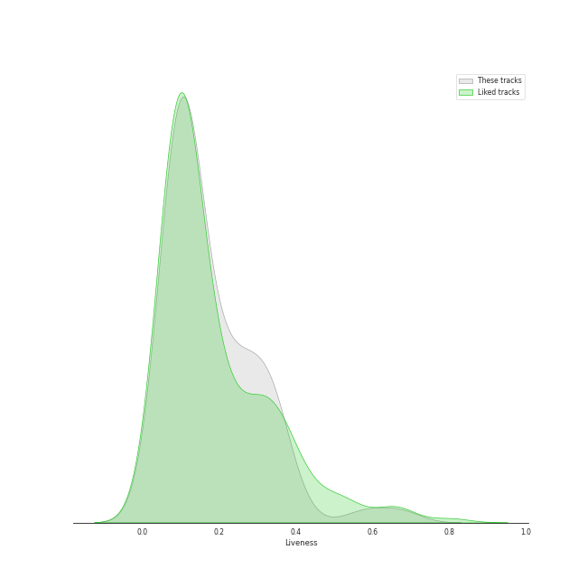

# Audio Features for korean r&b

## Danceability

| 10 most Danceable tracks | 10 least Danceable tracks |
|:---|:---|
| Sour candy (0.871) | Seed (0.395) |
| Don’t (0.85) | 내 맘을 볼 수 있나요 (0.397) |
| VIBE (feat. Jimin of BTS) (0.787) | BIBI Vengeance (0.442) |
| VingleVingle (Prod. R.Tee) (0.785) | GANADARA (Feat. IU) (0.492) |
| Undo (0.784) | D (Half Moon) (0.512) |
| VIBE (feat. Jimin of BTS) (0.78) | Very, Slowly (0.528) |
| New thing (Prod. ZICO) (Feat. Homies) (0.775) | My Day Is Full Of You (0.557) |
| Shoong! (feat. LISA of BLACKPINK) (0.763) | Lyricist (0.566) |
| LAW (Prod. Czaer) (0.756) | WAITING (0.586) |
| Rush Hour (Feat. j-hope of BTS) (0.738) | Nightfall (feat. Bryan Chase) (0.593) |

## Energy

| 10 most Energetic tracks | 10 least Energetic tracks |
|:---|:---|
| LAW (Prod. Czaer) (0.9) | 내 맘을 볼 수 있나요 (0.166) |
| WAITING (0.871) | Wicked (0.32) |
| New thing (Prod. ZICO) (Feat. Homies) (0.865) | Seed (0.33) |
| And July (0.852) | Can't Stop This Party (0.409) |
| Sour candy (0.843) | Very, Slowly (0.423) |
| One way love (0.817) | POOL(Feat. Sumin) (0.453) |
| Into You (0.805) | Don’t (0.488) |
| Say Yes (0.778) | Make Up (Feat. Crush) (0.497) |
| Inspiration (feat. Beenzino) (0.766) | 눈,코,입 (Eyes, Nose, Lips) (0.516) |
| D (Half Moon) (0.765) | Running Through The Night (0.532) |

## Speechiness

| 10 most Speechy tracks | 10 least Speechy tracks |
|:---|:---|
| New thing (Prod. ZICO) (Feat. Homies) (0.307) | Very, Slowly (0.0264) |
| MOMMAE (0.287) | Wicked (0.0273) |
| All I Wanna Do (0.267) | One way love (0.0306) |
| Three Dopeboyz (Feat. Zion.T) (0.257) | Animal Farm (0.0315) |
| Rush Hour (Feat. j-hope of BTS) (0.249) | Somebody! (0.0328) |
| GANADARA (Feat. IU) (0.244) | Heartbeat (0.0332) |
| Can't Stop This Party (0.137) | Only Look At Me (나만 바라봐) (0.0336) |
| D (Half Moon) (0.136) | My Day Is Full Of You (0.034) |
| LULLABY (0.128) | 내 맘을 볼 수 있나요 (0.0349) |
| And July (0.0916) | Seed (0.0358) |

## Acousticness

| 10 most Acoustic tracks | 10 least Acoustic tracks |
|:---|:---|
| 내 맘을 볼 수 있나요 (0.884) | WAITING (0.00213) |
| 눈,코,입 (Eyes, Nose, Lips) (0.736) | Nightfall (feat. Bryan Chase) (0.00677) |
| Wicked (0.728) | Shoong! (feat. LISA of BLACKPINK) (0.00789) |
| Lyricist (0.721) | LAW (Prod. Czaer) (0.00857) |
| Very, Slowly (0.678) | Animal Farm (0.0201) |
| Heartbeat (0.662) | BIBI Vengeance (0.0272) |
| Can't Stop This Party (0.608) | Inspiration (feat. Beenzino) (0.0277) |
| Don’t (0.552) | And July (0.0401) |
| My Day Is Full Of You (0.532) | New thing (Prod. ZICO) (Feat. Homies) (0.0453) |
| Make Up (Feat. Crush) (0.502) | One way love (0.0577) |

## Instrumentalness

| 10 most Instrumental tracks | 10 least Instrumental tracks |
|:---|:---|
| VingleVingle (Prod. R.Tee) (0.00676) | Nightfall (feat. Bryan Chase) (0.0) |
| Very, Slowly (0.00148) | And July (0.0) |
| Can't Stop This Party (0.00125) | 눈,코,입 (Eyes, Nose, Lips) (0.0) |
| BIBI Vengeance (0.000128) | Make Up (Feat. Crush) (0.0) |
| LAW (Prod. Czaer) (0.000111) | MOMMAE (0.0) |
| First Sight (1.88e-05) | HAPPEN (0.0) |
| Wicked (1.2e-05) | Only Look At Me (나만 바라봐) (0.0) |
| Lyricist (1.14e-05) | KAZINO (0.0) |
| POOL(Feat. Sumin) (7.6e-06) | Say Yes (0.0) |
| WAITING (7.02e-06) | Somebody! (0.0) |

## Liveness

| 10 most Live tracks | 10 least Live tracks |
|:---|:---|
| Animal Farm (0.579) | D (Half Moon) (0.0573) |
| Shoong! (feat. LISA of BLACKPINK) (0.409) | One way love (0.0622) |
| Lyricist (0.352) | BIBI Vengeance (0.0642) |
| HAPPEN (0.341) | All I Wanna Do (0.0735) |
| Heartbeat (0.338) | First Sight (0.0735) |
| Only Look At Me (나만 바라봐) (0.332) | GANADARA (Feat. IU) (0.0772) |
| Into You (0.329) | Sour candy (0.0812) |
| Say Yes (0.329) | POOL(Feat. Sumin) (0.0834) |
| VingleVingle (Prod. R.Tee) (0.325) | Undo (0.0903) |
| Three Dopeboyz (Feat. Zion.T) (0.311) | Love Story (Feat. CRUSH) (0.0907) |

## Valence

| 10 most Happy tracks | 10 least Happy tracks |
|:---|:---|
| Sour candy (0.98) | 내 맘을 볼 수 있나요 (0.131) |
| One way love (0.891) | Nightfall (feat. Bryan Chase) (0.168) |
| Only Look At Me (나만 바라봐) (0.859) | Seed (0.215) |
| WAITING (0.839) | First Sight (0.239) |
| And July (0.787) | Very, Slowly (0.249) |
| Somebody! (0.768) | 눈,코,입 (Eyes, Nose, Lips) (0.254) |
| Rush Hour (Feat. j-hope of BTS) (0.74) | Shoong! (feat. LISA of BLACKPINK) (0.255) |
| Undo (0.734) | KAZINO (0.263) |
| Into You (0.689) | Heartbeat (0.28) |
| MOMMAE (0.678) | LULLABY (0.308) |

## Tempo

| 10 most Fast tracks | 10 least Fast tracks |
|:---|:---|
| New thing (Prod. ZICO) (Feat. Homies) (175.12) | My Day Is Full Of You (77.815) |
| D (Half Moon) (169.709) | Can't Stop This Party (87.975) |
| LULLABY (168.068) | Seed (89.851) |
| WAITING (158.179) | Love Story (Feat. CRUSH) (90.041) |
| WINE (Feat.Changmo) (Prod. SUGA) (145.87) | GANADARA (Feat. IU) (90.081) |
| 눈,코,입 (Eyes, Nose, Lips) (143.786) | Don’t (92.023) |
| Only Look At Me (나만 바라봐) (140.048) | Running Through The Night (92.039) |
| Into The Abyss (139.955) | Jenga (feat. Gaeko) (93.015) |
| Lyricist (139.569) | MOMMAE (93.91) |
| Very, Slowly (135.917) | Into You (93.94) |
