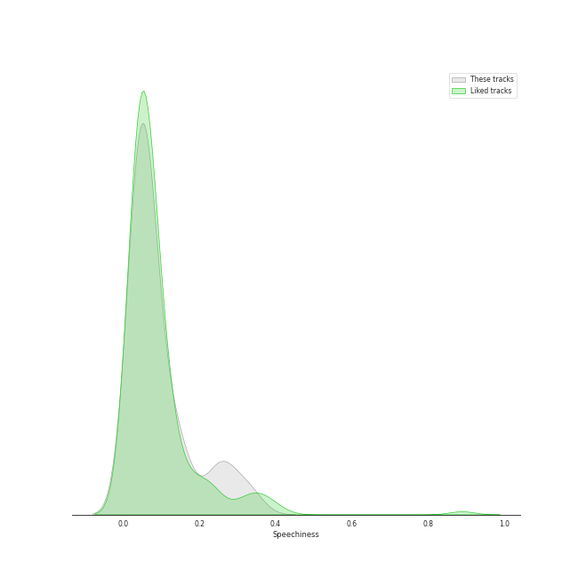
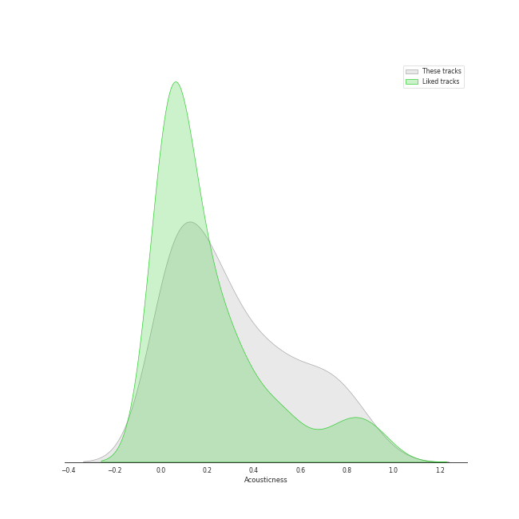
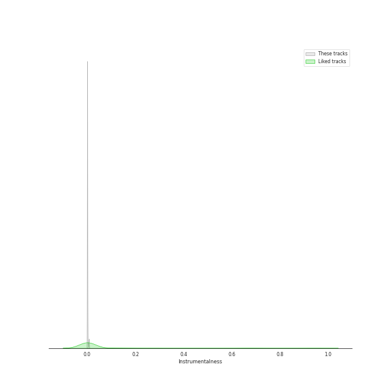

# Track Features for korean r&b

## Danceability

| ​ | 10 most Danceable tracks | ​​ | 10 least Danceable tracks |
|:---|:---|:---|:---|
|  | Sour candy (0.871) |  | Seed (0.395) |
|  | Don’t (0.85) |  | 내 맘을 볼 수 있나요 (0.397) |
|  | 1+1=0 (Feat. DEAN) (0.841) |  | DIE 4 YOU (0.411) |
|  | Amigos (with Becky G) (0.821) |  | BIBI Vengeance (0.442) |
|  | Hongdae R&B (0.81) |  | GANADARA (Feat. IU) (0.492) |
|  | Chemistry (Prod. Czaer) (0.806) |  | D (Half Moon) (0.512) |
|  | Sex Trip (0.788) |  | Natural (0.515) |
|  | VIBE (feat. Jimin of BTS) (0.787) |  | Very, Slowly (0.528) |
|  | Perhaps, Happy Ending (0.786) |  | Full Moon (0.55) |
|  | VingleVingle (Prod. R.Tee) (0.785) |  | My Day Is Full Of You (0.557) |

## Energy

| ​ | 10 most Energetic tracks | ​​ | 10 least Energetic tracks |
|:---|:---|:---|:---|
|  | JACKPOT (0.952) |  | 내 맘을 볼 수 있나요 (0.166) |
|  | Hmm-cheat (0.925) |  | Wicked (0.32) |
|  | Very Good (0.911) |  | Natural (0.321) |
|  | LAW (Prod. Czaer) (0.9) |  | Seed (0.33) |
|  | WAITING (0.871) |  | DIE 4 YOU (0.359) |
|  | New thing (Prod. ZICO) (Feat. Homies) (0.865) |  | Can't Stop This Party (0.409) |
|  | And July (0.852) |  | Full Moon (0.423) |
|  | Sour candy (0.843) |  | Very, Slowly (0.423) |
|  | Perhaps, Happy Ending (0.828) |  | Hongdae R&B (0.44) |
|  | Smoke (Prod. Dynamicduo, Padi) (0.818) |  | POOL(Feat. Sumin) (0.453) |

## Speechiness

| ​ | 10 most Speechy tracks | ​​ | 10 least Speechy tracks |
|:---|:---|:---|:---|
|  | JACKPOT (0.345) |  | Very, Slowly (0.0264) |
|  | Smoke (Prod. Dynamicduo, Padi) (0.328) |  | Wicked (0.0273) |
|  | New thing (Prod. ZICO) (Feat. Homies) (0.307) |  | One way love (0.0306) |
|  | MOMMAE (Feat. Ugly Duck) (0.287) |  | Animal Farm (0.0315) |
|  | All I Wanna Do (0.267) |  | Somebody! (0.0328) |
|  | Three Dopeboyz (Feat. Zion.T) (0.257) |  | Heartbeat (0.0332) |
|  | Rush Hour (Feat. j-hope of BTS) (0.249) |  | Only Look At Me (나만 바라봐) (0.0336) |
|  | GANADARA (Feat. IU) (0.244) |  | My Day Is Full Of You (0.034) |
|  | FM 89.1 (0.182) |  | 내 맘을 볼 수 있나요 (0.0349) |
|  | Amigos (with Becky G) (0.163) |  | Seed (0.0358) |

## Acousticness

| ​ | 10 most Acoustic tracks | ​​ | 10 least Acoustic tracks |
|:---|:---|:---|:---|
|  | Full Moon (0.902) |  | WAITING (0.00213) |
|  | 내 맘을 볼 수 있나요 (0.884) |  | Shoong! (feat. LISA of BLACKPINK) (0.00789) |
|  | Natural (0.841) |  | LAW (Prod. Czaer) (0.00857) |
|  | DIE 4 YOU (0.802) |  | Very Good (0.0111) |
|  | 눈,코,입 (Eyes, Nose, Lips) (0.736) |  | Animal Farm (0.0201) |
|  | Wicked (0.728) |  | BIBI Vengeance (0.0272) |
|  | Lyricist (0.721) |  | Smoke (Prod. Dynamicduo, Padi) (0.0317) |
|  | Last Winter (0.705) |  | Wet Nightmare (0.0359) |
|  | Very, Slowly (0.678) |  | And July (0.0401) |
|  | Heartbeat (0.662) |  | New thing (Prod. ZICO) (Feat. Homies) (0.0453) |

## Instrumentalness

| ​ | 10 most Instrumental tracks | ​​ | 10 least Instrumental tracks |
|:---|:---|:---|:---|
|  | Wet Nightmare (0.00736) |  | And July (0.0) |
|  | VingleVingle (Prod. R.Tee) (0.00676) |  | 눈,코,입 (Eyes, Nose, Lips) (0.0) |
|  | Perhaps, Happy Ending (0.00583) |  | Make Up (Feat. Crush) (0.0) |
|  | FM 89.1 (0.00335) |  | MOMMAE (Feat. Ugly Duck) (0.0) |
|  | Last Winter (0.00159) |  | HAPPEN (0.0) |
|  | Very, Slowly (0.00148) |  | JACKPOT (0.0) |
|  | Can't Stop This Party (0.00125) |  | Shut Up & Groove (0.0) |
|  | BIBI Vengeance (0.000128) |  | Only Look At Me (나만 바라봐) (0.0) |
|  | LAW (Prod. Czaer) (0.000111) |  | KAZINO (0.0) |
|  | Natural (5.75e-05) |  | Say Yes (0.0) |

## Liveness

| ​ | 10 most Live tracks | ​​ | 10 least Live tracks |
|:---|:---|:---|:---|
|  | Animal Farm (0.579) |  | 1+1=0 (Feat. DEAN) (0.0372) |
|  | Shoong! (feat. LISA of BLACKPINK) (0.409) |  | JACKPOT (0.0538) |
|  | Lyricist (0.352) |  | D (Half Moon) (0.0573) |
|  | HAPPEN (0.341) |  | One way love (0.0622) |
|  | Heartbeat (0.338) |  | BIBI Vengeance (0.0642) |
|  | Natural (0.338) |  | All I Wanna Do (0.0735) |
|  | Only Look At Me (나만 바라봐) (0.332) |  | First Sight (0.0735) |
|  | Into You (0.329) |  | GANADARA (Feat. IU) (0.0772) |
|  | Say Yes (0.329) |  | Sour candy (0.0812) |
|  | VingleVingle (Prod. R.Tee) (0.325) |  | POOL(Feat. Sumin) (0.0834) |

## Valence

| ​ | 10 most Happy tracks | ​​ | 10 least Happy tracks |
|:---|:---|:---|:---|
|  | Sour candy (0.98) |  | Wet Nightmare (0.121) |
|  | One way love (0.891) |  | 내 맘을 볼 수 있나요 (0.131) |
|  | Only Look At Me (나만 바라봐) (0.859) |  | Full Moon (0.205) |
|  | WAITING (0.839) |  | Seed (0.215) |
|  | Hmm-cheat (0.82) |  | First Sight (0.239) |
|  | Very Good (0.788) |  | Natural (0.242) |
|  | And July (0.787) |  | Very, Slowly (0.249) |
|  | Smoke (Prod. Dynamicduo, Padi) (0.769) |  | 눈,코,입 (Eyes, Nose, Lips) (0.254) |
|  | Somebody! (0.768) |  | Shoong! (feat. LISA of BLACKPINK) (0.255) |
|  | Rush Hour (Feat. j-hope of BTS) (0.74) |  | KAZINO (0.263) |

## Tempo

| ​ | 10 most Fast tracks | ​​ | 10 least Fast tracks |
|:---|:---|:---|:---|
|  | New thing (Prod. ZICO) (Feat. Homies) (175.12) |  | Full Moon (63.073) |
|  | D (Half Moon) (169.709) |  | My Day Is Full Of You (77.815) |
|  | LULLABY (168.068) |  | DIE 4 YOU (82.631) |
|  | WAITING (158.179) |  | Can't Stop This Party (87.975) |
|  | Natural (153.024) |  | Seed (89.851) |
|  | FM 89.1 (151.872) |  | Love Story (Feat. CRUSH) (90.041) |
|  | WINE (Feat.Changmo) (Prod. SUGA) (145.87) |  | GANADARA (Feat. IU) (90.081) |
|  | Click Like (Prod. Crush) (Feat. Paul Blanco) (145.817) |  | Last Winter (91.735) |
|  | Wet Nightmare (144.225) |  | Don’t (92.023) |
|  | 눈,코,입 (Eyes, Nose, Lips) (143.786) |  | Running Through The Night (92.039) |
