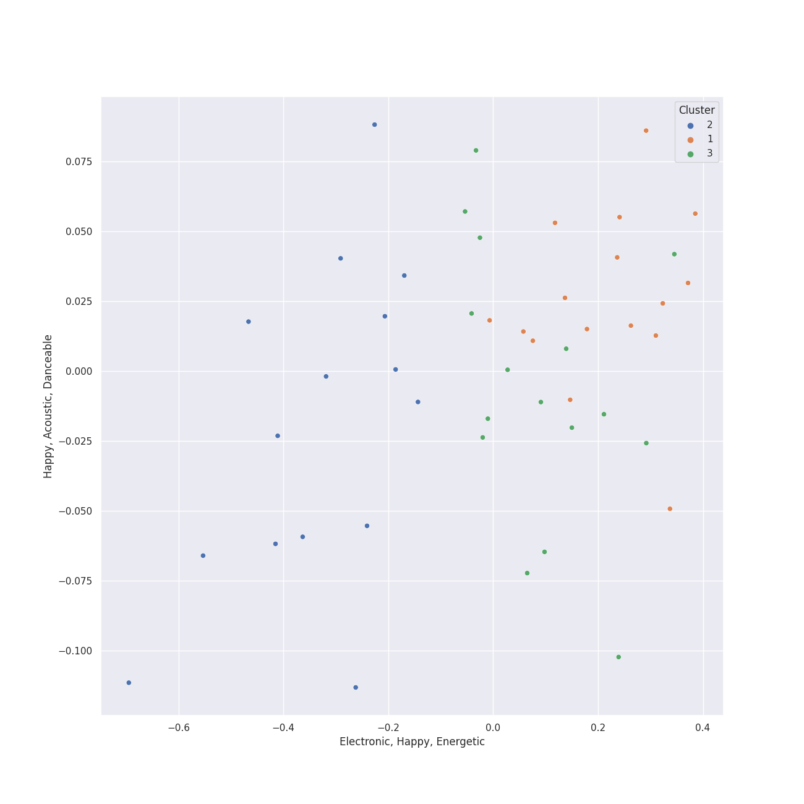

# Clusters in korean r&b

## Cluster #1

29 tracks

| Art | Track | Album | Artists | Label | Rank | 💚 | 🔗 |
|:---|:---|:---|:---|:---|---:|:---|:---|
|  | LAW (Prod. Czaer) | Street Man Fighter Original Vol.3 (Mission by Rank) | YOON MIRAE, [BIBI](../../../../artists/bibi/overview.md) | [Genie Music Corporation](../../../../labels/genie_music_corporation) | 285 | 💚 | [🔗](https://open.spotify.com/track/0VES0jpNQEdRpD31gYDIMe) |
|  | New thing (Prod. ZICO) (Feat. Homies) | Street Man Fighter Original Vol.3 (Mission by Rank) | ZICO, HOMIES | [Genie Music Corporation](../../../../labels/genie_music_corporation) | nan | 💚 | [🔗](https://open.spotify.com/track/5mdWIwsJAzR97ShGkt8gcR) |
|  | And July | And July | [HEIZE](../../../../artists/heize/overview.md), DEAN, dj friz | [Genie Music Corporation](../../../../labels/genie_music_corporation) | nan | 💚 | [🔗](https://open.spotify.com/track/0Yz3F0UGDibDe8uU69zmjn) |
|  | Shut Up & Groove | And July | [HEIZE](../../../../artists/heize/overview.md), DEAN | [Genie Music Corporation](../../../../labels/genie_music_corporation) | nan | | [🔗](https://open.spotify.com/track/1WT5I6vlWjYW2cnhR1UkVA) |
|  | Perhaps, Happy Ending | Last Winter | [HEIZE](../../../../artists/heize/overview.md) | [Genie Music Corporation](../../../../labels/genie_music_corporation), [Stone Music Entertainment](../../../../labels/stone_music_entertainment) | 414 | 💚 | [🔗](https://open.spotify.com/track/5VRjJvpk6xL9cxkkWhfWkY) |
|  | VIBE (feat. Jimin of BTS) | Down to Earth | TAEYANG, Jimin | [THEBLACKLABEL/Interscope Records](../../../../labels/interscope_records) | nan | 💚 | [🔗](https://open.spotify.com/track/4NIe9Is7bN5JWyTeCW2ahK) |
|  | MOMMAE (Feat. Ugly Duck) | WORLDWIDE | Jay Park, Ugly Duck | [Genie Music Corporation](../../../../labels/genie_music_corporation), [Stone Music Entertainment](../../../../labels/stone_music_entertainment) | nan | | [🔗](https://open.spotify.com/track/1LNlfvPQmB0cqYJQQskZ8x) |
|  | Three Dopeboyz (Feat. Zion.T) | LUCKYNUMBERS | Dynamicduo, Zion.T | [Stone Music Entertainment](../../../../labels/stone_music_entertainment) | nan | | [🔗](https://open.spotify.com/track/74Q5gW006ZD5iIaVYB1EhO) |
|  | Rush Hour (Feat. j-hope of BTS) | Rush Hour | [Crush](../../../../artists/crush/overview.md), [j-hope](../../../../artists/j-hope/overview.md) | 피네이션 | nan | 💚 | [🔗](https://open.spotify.com/track/5aucVLKiumD89mxVCB4zvS) |
|  | Into You | The First Scene - The 1st Mini Album | YURI | [SM Entertainment](../../../../labels/sm_entertainment) | nan | 💚 | [🔗](https://open.spotify.com/track/6L8wVNs6kuQ7sRjHowbrLp) |
## Cluster #2

15 tracks

| Art | Track | Album | Artists | Label | Rank | 💚 | 🔗 |
|:---|:---|:---|:---|:---|---:|:---|:---|
|  | Natural | Natural | GSoul | [WM Korea](../../../../labels/wm_korea) | nan | | [🔗](https://open.spotify.com/track/0ACt3PP22HyKfpFIV6AQUW) |
|  | Can't Stop This Party | Can't Stop This Party | Seori | [ATISPAUS/88rising Music](../../../../labels/88rising_music) | nan | 💚 | [🔗](https://open.spotify.com/track/1FP2jE6moLiHoNUaWTUyJc) |
|  | Wicked | Remarriage and Desires (Original Soundtrack from The Netflix Series) | Seori | [Genie Music Corporation](../../../../labels/genie_music_corporation), [Stone Music Entertainment](../../../../labels/stone_music_entertainment) | nan | 💚 | [🔗](https://open.spotify.com/track/3B4u3uZGm7PCfhc18oTi1J) |
|  | My Day Is Full Of You | The King : Eternal Monarch, Pt. 10 (Original Television Soundtrack) | ZICO, [WENDY](../../../../artists/wendy/overview.md) | [Genie Music Corporation](../../../../labels/genie_music_corporation), [Stone Music Entertainment](../../../../labels/stone_music_entertainment) | nan | | [🔗](https://open.spotify.com/track/2QWa5RjnIGFwraHDPqlhFh) |
|  | Last Winter | Last Winter | [HEIZE](../../../../artists/heize/overview.md) | [Genie Music Corporation](../../../../labels/genie_music_corporation), [Stone Music Entertainment](../../../../labels/stone_music_entertainment) | 719 | | [🔗](https://open.spotify.com/track/0neVuSeb4wkhi1tLNc0t47) |
|  | Lyricist | Lyricist | [HEIZE](../../../../artists/heize/overview.md) | [Genie Music Corporation](../../../../labels/genie_music_corporation) | nan | | [🔗](https://open.spotify.com/track/1eEHOnrNLP46aGKLb1LtMI) |
|  | 눈,코,입 (Eyes, Nose, Lips) | RISE | TAEYANG | [YG Entertainment](../../../../labels/yg_entertainment) | 44 | 💚 | [🔗](https://open.spotify.com/track/0lYtIvI7bO51PZSeK22Mbz) |
|  | Very, Slowly | Twenty-Five Twenty-One OST | [BIBI](../../../../artists/bibi/overview.md) | Studio MaumC, Hwa&Dam pictures | nan | 💚 | [🔗](https://open.spotify.com/track/1dpLjawAb5PhlDr1w1diEe) |
|  | Heartbeat | Strong Woman Do Bong Soon, Pt. 2 (Original Television Soundtrack) | SURAN | JTBC Studios | nan | 💚 | [🔗](https://open.spotify.com/track/3Mz7i60GsWWLRyDeAIuCZA) |
|  | DIE 4 YOU | DIE 4 YOU | DEAN | [Universal Music Ltd.](../../../../labels/universal_music_llc) | nan | 💚 | [🔗](https://open.spotify.com/track/7yZD4AVfQtAZD4cG8eRnPk) |
## Cluster #3

20 tracks

| Art | Track | Album | Artists | Label | Rank | 💚 | 🔗 |
|:---|:---|:---|:---|:---|---:|:---|:---|
|  | Running Through The Night | ?depacse ohw | Seori | [WM Korea](../../../../labels/wm_korea) | nan | | [🔗](https://open.spotify.com/track/3UZ46DvXvB2R7sBUZornlv) |
|  | Jenga (feat. Gaeko) | Wish & Wind | [HEIZE](../../../../artists/heize/overview.md), Gaeko | CJ E&M MUSIC | nan | 💚 | [🔗](https://open.spotify.com/track/1dA1tlzwcJ3YDYsSul1m06) |
|  | VingleVingle (Prod. R.Tee) | VingleVingle | [HEIZE](../../../../artists/heize/overview.md) | [Genie Music Corporation](../../../../labels/genie_music_corporation), [Stone Music Entertainment](../../../../labels/stone_music_entertainment) | 220 | 💚 | [🔗](https://open.spotify.com/track/4mSb6RA9eJnXuMWChHLpgn) |
|  | All I Wanna Do | EVERYTHING YOU WANTED | Jay Park | [Genie Music Corporation](../../../../labels/genie_music_corporation), [Stone Music Entertainment](../../../../labels/stone_music_entertainment) | nan | 💚 | [🔗](https://open.spotify.com/track/2PcJoVkfjcbvoqBxV1Nj7y) |
|  | Sex Trip | MOMMAE | Jay Park | [Genie Music Corporation](../../../../labels/genie_music_corporation), [Stone Music Entertainment](../../../../labels/stone_music_entertainment) | nan | 💚 | [🔗](https://open.spotify.com/track/6dJ4jLQMM8SXGYrM0eRCNm) |
|  | Say Yes | Moonlovers - Scarlet Heart Ryeo (Original Television Soundtrack), Pt. 2 | Loco, Punch | [Genie Music Corporation](../../../../labels/genie_music_corporation) | 266 | 💚 | [🔗](https://open.spotify.com/track/27zrFrtUtWl2urlvjOn5xc) |
|  | LULLABY | LULLABY | WOODZ | [Genie Music Corporation](../../../../labels/genie_music_corporation), [Stone Music Entertainment](../../../../labels/stone_music_entertainment) | nan | | [🔗](https://open.spotify.com/track/4XqyWlYiTFZ627CuUzMOJP) |
|  | Into The Abyss | Abyss (Original Television Soundtrack), Pt. 1 | SURAN, Coogie | [Genie Music Corporation](../../../../labels/genie_music_corporation) | nan | 💚 | [🔗](https://open.spotify.com/track/3aBbunGtgB2Ng5rIG7QtCj) |
|  | WINE (Feat.Changmo) (Prod. SUGA) | WINE | SURAN, CHANGMO | Million Market,Inc | 117 | 💚 | [🔗](https://open.spotify.com/track/3eHkFA3StDR9BU7EVrUFLs) |
|  | Love Story (Feat. CRUSH) | Love Story | SURAN, [Crush](../../../../artists/crush/overview.md) | Million Market,Inc | nan | 💚 | [🔗](https://open.spotify.com/track/5rUZeNNC4R65U6UeElMoss) |