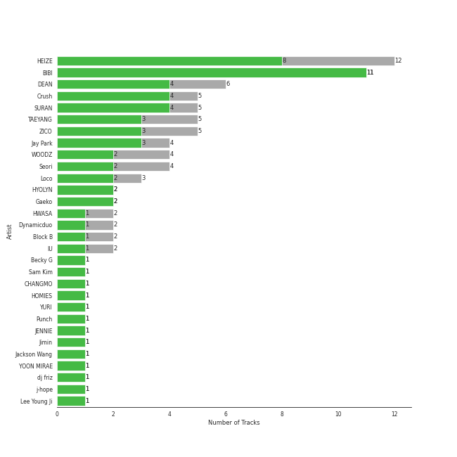
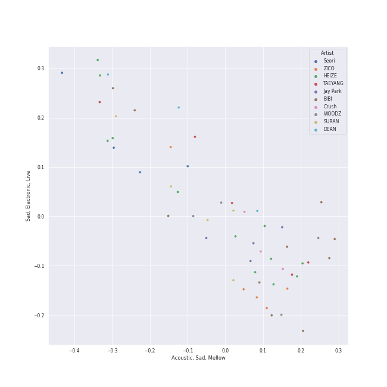
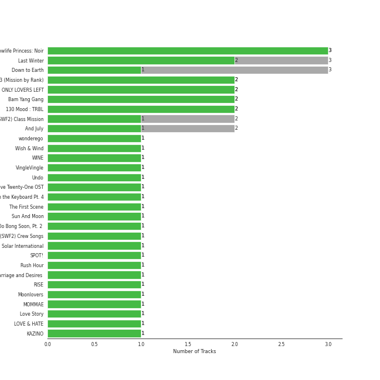
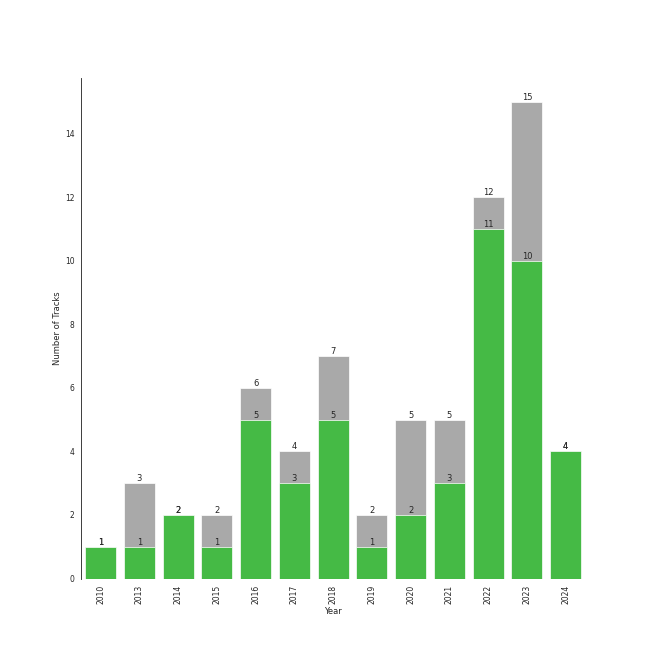

# korean r&b

[41 songs](tracks.md)

## Top Artists

| Art | Tracks | 💚 | Artist | 🔗 |
|:---|---:|---:|:---|:---|
|  | 8 | 6 | HEIZE | [🔗](https://open.spotify.com/artist/5dCvSnVduaFleCnyy98JMo) |
|  | 5 | 5 | [BIBI](../../artists/bibi/overview.md) | [🔗](https://open.spotify.com/artist/6UbmqUEgjLA6jAcXwbM1Z9) |
|  | 4 | 4 | SURAN | [🔗](https://open.spotify.com/artist/1mORehSVEd7lcaT2d7Sl2K) |
|  | 3 | 3 | TAEYANG | [🔗](https://open.spotify.com/artist/6udveWUgX4vu75FF0DTrXV) |
|  | 4 | 2 | WOODZ | [🔗](https://open.spotify.com/artist/6y9nlaoynxSvoTGY09Vdcy) |
|  | 3 | 2 | Crush | [🔗](https://open.spotify.com/artist/6aLdhHUqgdKE86xbtNmY8g) |
|  | 3 | 2 | Jay Park | [🔗](https://open.spotify.com/artist/4XDi67ZENZcbfKnvMnTYsI) |
|  | 3 | 2 | Loco | [🔗](https://open.spotify.com/artist/2e4G04F77jxVuDYo44TCSm) |
|  | 3 | 2 | Seori | [🔗](https://open.spotify.com/artist/2bWTIIQP9zaVc55RaMGu7e) |
|  | 2 | 2 | DEAN | [🔗](https://open.spotify.com/artist/3eCd0TZrBPm2n9cDG6yWfF) |

See all 30 artists

| Art | Tracks | 💚 | Artist | 🔗 |
|:---|---:|---:|:---|:---|
|  | 2 | 2 | Gaeko | [🔗](https://open.spotify.com/artist/0tkHE1pQ5ZCgQb8WZ0ba79) |
|  | 2 | 1 | Hwa Sa | [🔗](https://open.spotify.com/artist/7bmYpVgQub656uNTu6qGNQ) |
|  | 2 | 1 | ZICO | [🔗](https://open.spotify.com/artist/4XpUIb8uuNlIWVKmgKZXC0) |
|  | 1 | 1 | HYOLYN | [🔗](https://open.spotify.com/artist/78sJswwVn4P8aEhkF4K6fQ) |
|  | 1 | 1 | CHANGMO | [🔗](https://open.spotify.com/artist/3hvinNZRzTLoREmqFiKr1b) |
|  | 1 | 1 | HOMIES | [🔗](https://open.spotify.com/artist/3PpfvyyncoZ79IgYe0Uls0) |
|  | 1 | 1 | [IU](../../artists/iu/overview.md) | [🔗](https://open.spotify.com/artist/3HqSLMAZ3g3d5poNaI7GOU) |
|  | 1 | 1 | YURI | [🔗](https://open.spotify.com/artist/2TMRvcwsmvVhvuEbKVEbZe) |
|  | 1 | 1 | Punch | [🔗](https://open.spotify.com/artist/2FgZrgTMX6Sk0VNcOsEPmm) |
|  | 1 | 1 | Jimin | [🔗](https://open.spotify.com/artist/1oSPZhvZMIrWW5I41kPkkY) |
|  | 1 | 1 | Yoon Mirae | [🔗](https://open.spotify.com/artist/1Do4bSzfUl0KWL9r1fITu0) |
|  | 1 | 1 | dj friz | [🔗](https://open.spotify.com/artist/0js3wKXyi7RL11sfOykRt1) |
|  | 1 | 1 | j-hope | [🔗](https://open.spotify.com/artist/0b1sIQumIAsNbqAoIClSpy) |
|  | 1 | 1 | Coogie | [🔗](https://open.spotify.com/artist/0IznZPMUyaPGdqfP4oqBja) |
|  | 1 | 0 | Zion.T | [🔗](https://open.spotify.com/artist/5HenzRvMtSrgtvU16XAoby) |
|  | 1 | 0 | Dynamicduo | [🔗](https://open.spotify.com/artist/4nvFFLtv7ZqoTr83387uK4) |
|  | 1 | 0 | Sam Kim | [🔗](https://open.spotify.com/artist/4BBN286rBKyCWsSPq2cxYO) |
|  | 1 | 0 | Ugly Duck | [🔗](https://open.spotify.com/artist/0Qr4St9aCOLu41Nt5QZIz1) |
|  | 1 | 0 | SUMIN | [🔗](https://open.spotify.com/artist/0K4MGKGmjtdIE0W3GkGmyU) |
|  | 1 | 0 | [WENDY](../../artists/wendy/overview.md) | [🔗](https://open.spotify.com/artist/0FRUZvZNPzM3YJMABJxf2K) |

## Top Albums

| Art | Tracks | 💚 | Album | Release Date | 🔗 |
|:---|---:|---:|:---|:---|:---|
|  | 2 | 2 | Street Man Fighter Original Vol.3 (Mission by Rank) | 2022-09-06 | [🔗](https://open.spotify.com/album/54UUQN3j32n8TA2OJxTcHP) |
|  | 2 | 2 | ONLY LOVERS LEFT | 2021-10-05 | [🔗](https://open.spotify.com/album/1u9nYBB0Qw5jyjkexe9Xk6) |
|  | 2 | 2 | Lowlife Princess: Noir | 2022-11-18 | [🔗](https://open.spotify.com/album/0AwCgoJKJUOgLp1imhnxuH) |
|  | 1 | 1 | Wish & Wind | 2018-03-08 | [🔗](https://open.spotify.com/album/5Fs2dlwUz1zkNcUPu6KaKF) |
|  | 1 | 1 | WINE | 2017-04-27 | [🔗](https://open.spotify.com/album/26adxLsliyYcCfVTF6xA75) |
|  | 1 | 1 | VingleVingle | 2023-04-05 | [🔗](https://open.spotify.com/album/10Ldh1KXu0ySjpfiX6qLXQ) |
|  | 1 | 1 | VIBE (feat. Jimin of BTS) | 2023-01-13 | [🔗](https://open.spotify.com/album/3qUOk1Se3Oopu5pUlHTjVJ) |
|  | 1 | 1 | Undo | 2022-06-30 | [🔗](https://open.spotify.com/album/2xR7YEyRweqClzs50bbW3J) |
|  | 1 | 1 | Twenty-Five Twenty-One OST | 2022-04-03 | [🔗](https://open.spotify.com/album/77NPr874WU941XZhjO43dR) |
|  | 1 | 1 | The Hyena on the Keyboard Pt. 4 | 2018-04-21 | [🔗](https://open.spotify.com/album/2fMMk4DD96UcAmSczUQ0kq) |

See all 38 albums

| Art | Tracks | 💚 | Album | Release Date | 🔗 |
|:---|---:|---:|:---|:---|:---|
|  | 1 | 1 | The First Scene - The 1st Mini Album | 2018-10-04 | [🔗](https://open.spotify.com/album/1vRQP001rGl7zI3W6ghGSR) |
|  | 1 | 1 | Strong Woman Do Bong Soon, Pt. 2 (Original Television Soundtrack) | 2017-03-04 | [🔗](https://open.spotify.com/album/21jYCYSrxo7IEO67xH6XeN) |
|  | 1 | 1 | Solar International | 2010-08-19 | [🔗](https://open.spotify.com/album/42BVvYE1FLO8mQH0ZJn4de) |
|  | 1 | 1 | Rush Hour | 2022-09-22 | [🔗](https://open.spotify.com/album/7egcy2gtlyoUUl1OlQrY3R) |
|  | 1 | 1 | Remarriage and Desires (Original Soundtrack from The Netflix Series) | 2022-07-15 | [🔗](https://open.spotify.com/album/2YM9Oahck5kVuWGiFQK1dg) |
|  | 1 | 1 | RISE | 2014-06-03 | [🔗](https://open.spotify.com/album/1Y9so4jq4t4taAHu0VdKX3) |
|  | 1 | 1 | Moonlovers - Scarlet Heart Ryeo (Original Television Soundtrack), Pt. 2 | 2016-08-29 | [🔗](https://open.spotify.com/album/68xTLBWjoRADRf86WYmTmy) |
|  | 1 | 1 | Love Story | 2017-11-10 | [🔗](https://open.spotify.com/album/0H9qbHCWJRmKAhERqM5X9G) |
|  | 1 | 1 | LOVE & HATE | 2013-11-26 | [🔗](https://open.spotify.com/album/26FsnZOVOJDjKeWUbXuDVG) |
|  | 1 | 1 | KAZINO | 2020-04-29 | [🔗](https://open.spotify.com/album/1f9cws6SZ0iKoHrcmn39ZY) |
|  | 1 | 1 | HAPPEN | 2021-05-20 | [🔗](https://open.spotify.com/album/4xOOB79WcZuOoVwK06No1s) |
|  | 1 | 1 | GANADARA | 2022-03-11 | [🔗](https://open.spotify.com/album/4cwyl5ynvYVojZRbZ3dSFH) |
|  | 1 | 1 | First Sight | 2018-12-14 | [🔗](https://open.spotify.com/album/5M9f9Tze7sspUDrIAjdCgV) |
|  | 1 | 1 | EVERYTHING YOU WANTED | 2016-10-20 | [🔗](https://open.spotify.com/album/0c4LKBzh0ufU36AyuzZRc2) |
|  | 1 | 1 | Can't Stop This Party | 2022-03-22 | [🔗](https://open.spotify.com/album/6nG0PLR5YgP7tHYKfwhiOI) |
|  | 1 | 1 | And July | 2016-07-18 | [🔗](https://open.spotify.com/album/3xUWeFeLn6m3NXKr0FlT3E) |
|  | 1 | 1 | Abyss (Original Television Soundtrack), Pt. 1 | 2019-05-14 | [🔗](https://open.spotify.com/album/0OLyahO2nuY0qQKoykd7Vy) |
|  | 1 | 1 | 130 Mood : TRBL | 2016-03-25 | [🔗](https://open.spotify.com/album/1MW3txTS49ZGvyLi0fziLU) |
|  | 1 | 0 | Worldwide | 2015-11-05 | [🔗](https://open.spotify.com/album/5vESroqrGYDxDPAwUceQxf) |
|  | 1 | 0 | The King: Eternal Monarch (Original Television Soundtrack), Pt. 10 | 2020-05-16 | [🔗](https://open.spotify.com/album/02zl7wdcgbI0URRfMbzmF5) |
|  | 1 | 0 | Sun And Moon | 2018-11-22 | [🔗](https://open.spotify.com/album/0AsQlY5YENtlvd8SLnrSxX) |
|  | 1 | 0 | Somebody | 2022-07-25 | [🔗](https://open.spotify.com/album/40XK96MKBOb5BjAU8QAIfN) |
|  | 1 | 0 | POOL[pu:l] | 2018-05-12 | [🔗](https://open.spotify.com/album/4qIn1bOjIOsvHOs7WGPloF) |
|  | 1 | 0 | Lyricist | 2020-06-10 | [🔗](https://open.spotify.com/album/6igUyuDlRCyjoTtPXui6bT) |
|  | 1 | 0 | LULLABY | 2021-08-27 | [🔗](https://open.spotify.com/album/7knAHnDVbgtX05qgU0ZcgT) |
|  | 1 | 0 | LUCKYNUMBERS | 2013-07-01 | [🔗](https://open.spotify.com/album/4I0RE0MF6b3Hw4Z0iWosxF) |
|  | 1 | 0 | Hotel del Luna (Original Television Soundtrack) Pt.5 | 2019-07-28 | [🔗](https://open.spotify.com/album/2PdRNAz6mDmy9OR7hDCrH5) |
|  | 1 | 0 | ?depacse ohw | 2020-05-12 | [🔗](https://open.spotify.com/album/0srUbfZOMUBwUitQGQeUca) |

## Top Record Labels

| Tracks | 💚 | Label |
|---:|---:|:---|
| 17 | 13 | [Genie Music Corporation](../../labels/genie_music_corporation/overview.md) |
| 13 | 9 | [Stone Music Entertainment](../../labels/stone_music_entertainment/overview.md) |
| 3 | 3 | 88rising Music |
| 2 | 2 | [YG Entertainment](../../labels/yg_entertainment/overview.md) |
| 2 | 2 | Million Market |
| 2 | 2 | Feel Ghood Music |
| 1 | 1 | 피네이션 |
| 1 | 1 | [Universal Music LLC](../../labels/universal_music_llc/overview.md) |
| 1 | 1 | THEBLACKLABEL |
| 1 | 1 | Studio MaumC |

See all 25 labels

| Tracks | 💚 | Label |
|---:|---:|:---|
| 1 | 1 | [Starship Entertainment](../../labels/starship_entertainment/overview.md) |
| 1 | 1 | [SM Entertainment](../../labels/sm_entertainment/overview.md) |
| 1 | 1 | MORE VISION |
| 1 | 1 | JTBC Studios |
| 1 | 1 | [Interscope Records](../../labels/interscope_records/overview.md) |
| 1 | 1 | Hwa&Dam pictures |
| 1 | 1 | FeelGhoodMusic |
| 1 | 1 | CJ E&M MUSIC |
| 1 | 1 | ATISPAUS |
| 1 | 0 | ㈜RBW |
| 1 | 0 | YUEHUA Entertainment |
| 1 | 0 | [WM Korea](../../labels/wm_korea/overview.md) |
| 1 | 0 | FNC인베스트먼트 |
| 1 | 0 | Antenna |
| 1 | 0 | AOMG |

## Years

| 10 newest albums | 10 oldest albums |
|:---|:---|
| 
 VingleVingle (2023-04-05)
 | 
 Solar International (2010-08-19)
 |
| 
 VIBE (feat. Jimin of BTS) (2023-01-13)
 | 
 LUCKYNUMBERS (2013-07-01)
 |
| 
 Lowlife Princess: Noir (2022-11-18)
 | 
 LOVE & HATE (2013-11-26)
 |
| 
 Rush Hour (2022-09-22)
 | 
 RISE (2014-06-03)
 |
| 
 Street Man Fighter Original Vol.3 (Mission by Rank) (2022-09-06)
 | 
 Worldwide (2015-11-05)
 |
| 
 Somebody (2022-07-25)
 | 
 130 Mood : TRBL (2016-03-25)
 |
| 
 Remarriage and Desires (Original Soundtrack from The Netflix Series) (2022-07-15)
 | 
 And July (2016-07-18)
 |
| 
 Undo (2022-06-30)
 | 
 Moonlovers - Scarlet Heart Ryeo (Original Television Soundtrack), Pt. 2 (2016-08-29)
 |
| 
 Twenty-Five Twenty-One OST (2022-04-03)
 | 
 EVERYTHING YOU WANTED (2016-10-20)
 |
| 
 Can't Stop This Party (2022-03-22)
 | 
 Strong Woman Do Bong Soon, Pt. 2 (Original Television Soundtrack) (2017-03-04)
 |
## Audio Features

| 10 most Danceable tracks | 10 least Danceable tracks |
|:---|:---|
| Sour candy (0.871) | 내 맘을 볼 수 있나요 (0.397) |
| Don’t (0.85) | BIBI Vengeance (0.442) |
| VingleVingle (Prod. R.Tee) (0.785) | GANADARA (Feat. IU) (0.492) |
| Undo (0.784) | D (Half Moon) (0.512) |
| VIBE (feat. Jimin of BTS) (0.78) | Very, Slowly (0.528) |
| New thing (Prod. ZICO) (Feat. Homies) (0.775) | My Day Is Full Of You (0.557) |
| LAW (Prod. Czaer) (0.756) | Lyricist (0.566) |
| Rush Hour (Feat. j-hope of BTS) (0.738) | WAITING (0.586) |
| And July (0.734) | Animal Farm (0.608) |
| Can't Stop This Party (0.729) | All I Wanna Do (0.613) |

| 10 most Energetic tracks | 10 least Energetic tracks |
|:---|:---|
| LAW (Prod. Czaer) (0.9) | 내 맘을 볼 수 있나요 (0.166) |
| WAITING (0.871) | Wicked (0.32) |
| New thing (Prod. ZICO) (Feat. Homies) (0.865) | Can't Stop This Party (0.409) |
| And July (0.852) | Very, Slowly (0.423) |
| Sour candy (0.843) | POOL(Feat. Sumin) (0.453) |
| One way love (0.817) | Don’t (0.488) |
| Into You (0.805) | Make Up (Feat. Crush) (0.497) |
| Say Yes (0.778) | 눈,코,입 (Eyes, Nose, Lips) (0.516) |
| D (Half Moon) (0.765) | Running Through The Night (0.532) |
| Three Dopeboyz (Feat. Zion.T) (0.757) | Heartbeat (0.541) |

| 10 most Speechy tracks | 10 least Speechy tracks |
|:---|:---|
| New thing (Prod. ZICO) (Feat. Homies) (0.307) | Very, Slowly (0.0264) |
| MOMMAE (0.287) | Wicked (0.0273) |
| All I Wanna Do (0.267) | One way love (0.0306) |
| Three Dopeboyz (Feat. Zion.T) (0.257) | Animal Farm (0.0315) |
| Rush Hour (Feat. j-hope of BTS) (0.249) | Somebody! (0.0328) |
| GANADARA (Feat. IU) (0.244) | Heartbeat (0.0332) |
| Can't Stop This Party (0.137) | Only Look At Me (나만 바라봐) (0.0336) |
| D (Half Moon) (0.136) | My Day Is Full Of You (0.034) |
| LULLABY (0.128) | 내 맘을 볼 수 있나요 (0.0349) |
| And July (0.0916) | VingleVingle (Prod. R.Tee) (0.0361) |

| 10 most Acoustic tracks | 10 least Acoustic tracks |
|:---|:---|
| 내 맘을 볼 수 있나요 (0.884) | WAITING (0.00213) |
| 눈,코,입 (Eyes, Nose, Lips) (0.736) | LAW (Prod. Czaer) (0.00857) |
| Wicked (0.728) | Animal Farm (0.0201) |
| Lyricist (0.721) | BIBI Vengeance (0.0272) |
| Very, Slowly (0.678) | And July (0.0401) |
| Heartbeat (0.662) | New thing (Prod. ZICO) (Feat. Homies) (0.0453) |
| Can't Stop This Party (0.608) | One way love (0.0577) |
| Don’t (0.552) | Sour candy (0.0681) |
| My Day Is Full Of You (0.532) | Three Dopeboyz (Feat. Zion.T) (0.078) |
| Make Up (Feat. Crush) (0.502) | VIBE (feat. Jimin of BTS) (0.0801) |

| 10 most Instrumental tracks | 10 least Instrumental tracks |
|:---|:---|
| VingleVingle (Prod. R.Tee) (0.00676) | And July (0.0) |
| Very, Slowly (0.00148) | 눈,코,입 (Eyes, Nose, Lips) (0.0) |
| Can't Stop This Party (0.00125) | Make Up (Feat. Crush) (0.0) |
| BIBI Vengeance (0.000128) | MOMMAE (0.0) |
| LAW (Prod. Czaer) (0.000111) | HAPPEN (0.0) |
| First Sight (1.88e-05) | Only Look At Me (나만 바라봐) (0.0) |
| Wicked (1.2e-05) | KAZINO (0.0) |
| Lyricist (1.14e-05) | Say Yes (0.0) |
| POOL(Feat. Sumin) (7.6e-06) | Somebody! (0.0) |
| WAITING (7.02e-06) | All I Wanna Do (0.0) |

| 10 most Live tracks | 10 least Live tracks |
|:---|:---|
| Animal Farm (0.579) | D (Half Moon) (0.0573) |
| Lyricist (0.352) | One way love (0.0622) |
| HAPPEN (0.341) | BIBI Vengeance (0.0642) |
| Heartbeat (0.338) | All I Wanna Do (0.0735) |
| Only Look At Me (나만 바라봐) (0.332) | First Sight (0.0735) |
| Into You (0.329) | GANADARA (Feat. IU) (0.0772) |
| Say Yes (0.329) | Sour candy (0.0812) |
| VingleVingle (Prod. R.Tee) (0.325) | POOL(Feat. Sumin) (0.0834) |
| Three Dopeboyz (Feat. Zion.T) (0.311) | Undo (0.0903) |
| Rush Hour (Feat. j-hope of BTS) (0.31) | Love Story (Feat. CRUSH) (0.0907) |

| 10 most Happy tracks | 10 least Happy tracks |
|:---|:---|
| Sour candy (0.98) | 내 맘을 볼 수 있나요 (0.131) |
| One way love (0.891) | First Sight (0.239) |
| Only Look At Me (나만 바라봐) (0.859) | Very, Slowly (0.249) |
| WAITING (0.839) | 눈,코,입 (Eyes, Nose, Lips) (0.254) |
| And July (0.787) | KAZINO (0.263) |
| Somebody! (0.768) | Heartbeat (0.28) |
| Rush Hour (Feat. j-hope of BTS) (0.74) | LULLABY (0.308) |
| Undo (0.734) | Into The Abyss (0.346) |
| Into You (0.689) | Can't Stop This Party (0.37) |
| MOMMAE (0.678) | My Day Is Full Of You (0.39) |
