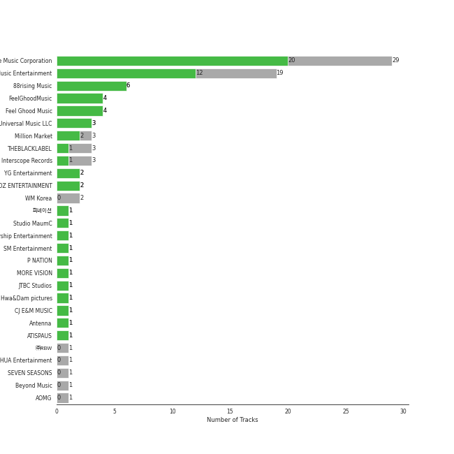
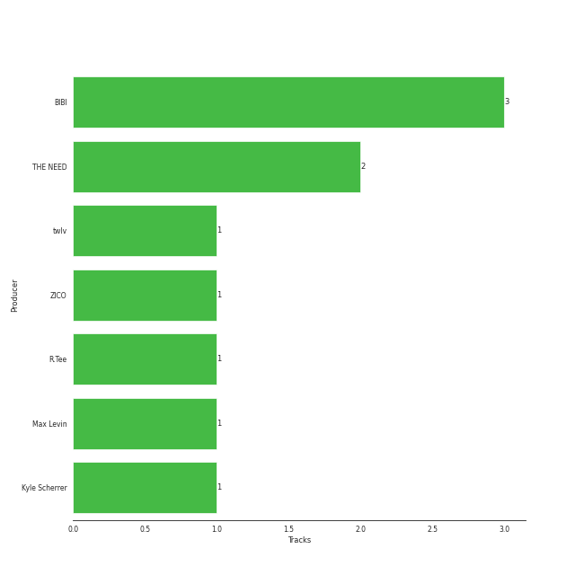

# korean r&b

64 songs

[See Track Features](audio_features.md)

[See Clusters](clusters/overview.md)

## Top Artists

| Art | Tracks | 💚 | Artist | 🔗 |
|:---|---:|---:|:---|:---|
|  | 10 | 10 | [BIBI](../../artists/bibi/overview.md) | [🔗](https://open.spotify.com/artist/6UbmqUEgjLA6jAcXwbM1Z9) |
|  | 12 | 8 | [HEIZE](../../artists/heize/overview.md) | [🔗](https://open.spotify.com/artist/5dCvSnVduaFleCnyy98JMo) |
|  | 6 | 4 | DEAN | [🔗](https://open.spotify.com/artist/3eCd0TZrBPm2n9cDG6yWfF) |
|  | 5 | 4 | [Crush](../../artists/crush/overview.md) | [🔗](https://open.spotify.com/artist/6aLdhHUqgdKE86xbtNmY8g) |
|  | 5 | 4 | SURAN | [🔗](https://open.spotify.com/artist/1mORehSVEd7lcaT2d7Sl2K) |
|  | 5 | 3 | TAEYANG | [🔗](https://open.spotify.com/artist/6udveWUgX4vu75FF0DTrXV) |
|  | 4 | 3 | Jay Park | [🔗](https://open.spotify.com/artist/4XDi67ZENZcbfKnvMnTYsI) |
|  | 4 | 2 | WOODZ | [🔗](https://open.spotify.com/artist/6y9nlaoynxSvoTGY09Vdcy) |
|  | 4 | 2 | Seori | [🔗](https://open.spotify.com/artist/2bWTIIQP9zaVc55RaMGu7e) |
|  | 3 | 2 | Loco | [🔗](https://open.spotify.com/artist/2e4G04F77jxVuDYo44TCSm) |

See all 36 artists

| Art | Tracks | 💚 | Artist | 🔗 |
|:---|---:|---:|:---|:---|
|  | 2 | 2 | HYOLYN | [🔗](https://open.spotify.com/artist/78sJswwVn4P8aEhkF4K6fQ) |
|  | 2 | 2 | Gaeko | [🔗](https://open.spotify.com/artist/0tkHE1pQ5ZCgQb8WZ0ba79) |
|  | 2 | 1 | [HWASA](../../artists/hwasa/overview.md) | [🔗](https://open.spotify.com/artist/7bmYpVgQub656uNTu6qGNQ) |
|  | 2 | 1 | Dynamicduo | [🔗](https://open.spotify.com/artist/4nvFFLtv7ZqoTr83387uK4) |
|  | 2 | 1 | ZICO | [🔗](https://open.spotify.com/artist/4XpUIb8uuNlIWVKmgKZXC0) |
|  | 2 | 1 | Block B | [🔗](https://open.spotify.com/artist/4RnezwRV7VBJUCI1S0AE5u) |
|  | 1 | 1 | Becky G | [🔗](https://open.spotify.com/artist/4obzFoKoKRHIphyHzJ35G3) |
|  | 1 | 1 | Sam Kim | [🔗](https://open.spotify.com/artist/4BBN286rBKyCWsSPq2cxYO) |
|  | 1 | 1 | CHANGMO | [🔗](https://open.spotify.com/artist/3hvinNZRzTLoREmqFiKr1b) |
|  | 1 | 1 | HOMIES | [🔗](https://open.spotify.com/artist/3PpfvyyncoZ79IgYe0Uls0) |
|  | 1 | 1 | [IU](../../artists/iu/overview.md) | [🔗](https://open.spotify.com/artist/3HqSLMAZ3g3d5poNaI7GOU) |
|  | 1 | 1 | YURI | [🔗](https://open.spotify.com/artist/2TMRvcwsmvVhvuEbKVEbZe) |
|  | 1 | 1 | Punch | [🔗](https://open.spotify.com/artist/2FgZrgTMX6Sk0VNcOsEPmm) |
|  | 1 | 1 | Jimin | [🔗](https://open.spotify.com/artist/1oSPZhvZMIrWW5I41kPkkY) |
|  | 1 | 1 | YOON MIRAE | [🔗](https://open.spotify.com/artist/1Do4bSzfUl0KWL9r1fITu0) |
|  | 1 | 1 | dj friz | [🔗](https://open.spotify.com/artist/0js3wKXyi7RL11sfOykRt1) |
|  | 1 | 1 | [j-hope](../../artists/j-hope/overview.md) | [🔗](https://open.spotify.com/artist/0b1sIQumIAsNbqAoIClSpy) |
|  | 1 | 1 | Lee Young Ji | [🔗](https://open.spotify.com/artist/0Y2AcMPMpeuPXtPQGVvRBq) |
|  | 1 | 1 | Coogie | [🔗](https://open.spotify.com/artist/0IznZPMUyaPGdqfP4oqBja) |
|  | 1 | 0 | LISA | [🔗](https://open.spotify.com/artist/5L1lO4eRHmJ7a0Q6csE5cT) |
|  | 1 | 0 | Zion.T | [🔗](https://open.spotify.com/artist/5HenzRvMtSrgtvU16XAoby) |
|  | 1 | 0 | GSoul | [🔗](https://open.spotify.com/artist/4oEXworvhegyK83rZwVyWL) |
|  | 1 | 0 | Paul Blanco | [🔗](https://open.spotify.com/artist/2fiGm496AG7ePURQiSSJIw) |
|  | 1 | 0 | Ugly Duck | [🔗](https://open.spotify.com/artist/0Qr4St9aCOLu41Nt5QZIz1) |
|  | 1 | 0 | SUMIN | [🔗](https://open.spotify.com/artist/0K4MGKGmjtdIE0W3GkGmyU) |
|  | 1 | 0 | [WENDY](../../artists/wendy/overview.md) | [🔗](https://open.spotify.com/artist/0FRUZvZNPzM3YJMABJxf2K) |

## Most and least listened tracks
| ​ | Most listened tracks | Rank | ​​ | Least listened tracks | Rank |
|:---|:---|---:|:---|:---|---:|
|  | 눈,코,입 (Eyes, Nose, Lips) | 47 |  | Natural | nan |
|  | [Animal Farm](../../artists/bibi/overview.md) | 94 |  | Full Moon | nan |
|  | WINE (Feat.Changmo) (Prod. SUGA) | 122 |  | [And July](../../artists/heize/overview.md) | nan |
|  | [FM 89.1](../../artists/heize/overview.md) | 196 |  | Make Up (Feat. Crush) | nan |
|  | [Undo](../../artists/heize/overview.md) | 198 |  | Can't Stop This Party | nan |
|  | [VingleVingle (Prod. R.Tee)](../../artists/heize/overview.md) | 234 |  | MOMMAE (Feat. Ugly Duck) | nan |
|  | [Perhaps, Happy Ending](../../artists/heize/overview.md) | 270 |  | [Wet Nightmare](../../artists/bibi/overview.md) | nan |
|  | Say Yes | 277 |  | [HAPPEN](../../artists/heize/overview.md) | nan |
|  | LAW (Prod. Czaer) | 285 |  | JACKPOT | nan |
|  | [Hmm-cheat](../../artists/crush/overview.md) | 298 |  | [Shut Up & Groove](../../artists/heize/overview.md) | nan |

## Top Albums

| Art | Tracks | 💚 | Album | Release Date | 🔗 |
|:---|---:|---:|:---|:---|:---|
|  | 3 | 3 | Lowlife Princess: Noir | 2022-11-18 | [🔗](https://open.spotify.com/album/0AwCgoJKJUOgLp1imhnxuH) |
|  | 3 | 2 | Last Winter | 2023-12-07 | [🔗](https://open.spotify.com/album/41vj1sO4NJFriquGszDSh5) |
|  | 3 | 1 | Down to Earth | 2023-04-25 | [🔗](https://open.spotify.com/album/6uMu4poce5OdMd1HYglZux) |
|  | 2 | 2 | Street Man Fighter Original Vol.3 (Mission by Rank) | 2022-09-06 | [🔗](https://open.spotify.com/album/54UUQN3j32n8TA2OJxTcHP) |
|  | 2 | 2 | ONLY LOVERS LEFT | 2021-10-05 | [🔗](https://open.spotify.com/album/1u9nYBB0Qw5jyjkexe9Xk6) |
|  | 2 | 2 | Bam Yang Gang | 2024-02-13 | [🔗](https://open.spotify.com/album/4QJZzFdGz2YlPZEHAlAJ6O) |
|  | 2 | 2 | 130 Mood : TRBL | 2016-03-25 | [🔗](https://open.spotify.com/album/1MW3txTS49ZGvyLi0fziLU) |
|  | 2 | 1 | Street Woman Fighter2 (SWF2) Class Mission | 2023-09-05 | [🔗](https://open.spotify.com/album/3fifgTm6PcVhHE9v72nlCb) |
|  | 2 | 1 | And July | 2016-07-18 | [🔗](https://open.spotify.com/album/3xUWeFeLn6m3NXKr0FlT3E) |
|  | 1 | 1 | wonderego | 2023-11-14 | [🔗](https://open.spotify.com/album/7ikvq6MB2VhB2IPCDO6RnP) |

See all 52 albums

| Art | Tracks | 💚 | Album | Release Date | 🔗 |
|:---|---:|---:|:---|:---|:---|
|  | 1 | 1 | Wish & Wind | 2018-03-08 | [🔗](https://open.spotify.com/album/5Fs2dlwUz1zkNcUPu6KaKF) |
|  | 1 | 1 | WINE | 2017-04-27 | [🔗](https://open.spotify.com/album/26adxLsliyYcCfVTF6xA75) |
|  | 1 | 1 | VingleVingle | 2023-04-05 | [🔗](https://open.spotify.com/album/10Ldh1KXu0ySjpfiX6qLXQ) |
|  | 1 | 1 | Undo | 2022-06-30 | [🔗](https://open.spotify.com/album/2xR7YEyRweqClzs50bbW3J) |
|  | 1 | 1 | Twenty-Five Twenty-One OST | 2022-04-03 | [🔗](https://open.spotify.com/album/77NPr874WU941XZhjO43dR) |
|  | 1 | 1 | The Hyena on the Keyboard Pt. 4 | 2018-04-21 | [🔗](https://open.spotify.com/album/2fMMk4DD96UcAmSczUQ0kq) |
|  | 1 | 1 | The First Scene - The 1st Mini Album | 2018-10-04 | [🔗](https://open.spotify.com/album/1vRQP001rGl7zI3W6ghGSR) |
|  | 1 | 1 | Sun And Moon | 2018-11-22 | [🔗](https://open.spotify.com/album/0AsQlY5YENtlvd8SLnrSxX) |
|  | 1 | 1 | Strong Woman Do Bong Soon, Pt. 2 (Original Television Soundtrack) | 2017-03-04 | [🔗](https://open.spotify.com/album/21jYCYSrxo7IEO67xH6XeN) |
|  | 1 | 1 | Street Woman Fighter2 (SWF2) Crew Songs | 2023-08-22 | [🔗](https://open.spotify.com/album/5oXPwd7Cn2q3bJ3pdmtiWY) |
|  | 1 | 1 | Solar International | 2010-08-19 | [🔗](https://open.spotify.com/album/42BVvYE1FLO8mQH0ZJn4de) |
|  | 1 | 1 | Rush Hour | 2022-09-22 | [🔗](https://open.spotify.com/album/7egcy2gtlyoUUl1OlQrY3R) |
|  | 1 | 1 | Remarriage and Desires (Original Soundtrack from The Netflix Series) | 2022-07-15 | [🔗](https://open.spotify.com/album/2YM9Oahck5kVuWGiFQK1dg) |
|  | 1 | 1 | RISE | 2014-06-03 | [🔗](https://open.spotify.com/album/1Y9so4jq4t4taAHu0VdKX3) |
|  | 1 | 1 | Moonlovers - Scarlet Heart Ryeo (Original Television Soundtrack), Pt. 2 | 2016-08-29 | [🔗](https://open.spotify.com/album/68xTLBWjoRADRf86WYmTmy) |
|  | 1 | 1 | MOMMAE | 2015-05-22 | [🔗](https://open.spotify.com/album/1kgzGqeJbY7gwiheabVk1L) |
|  | 1 | 1 | Love Story | 2017-11-10 | [🔗](https://open.spotify.com/album/0H9qbHCWJRmKAhERqM5X9G) |
|  | 1 | 1 | LOVE & HATE | 2013-11-26 | [🔗](https://open.spotify.com/album/26FsnZOVOJDjKeWUbXuDVG) |
|  | 1 | 1 | KAZINO | 2020-04-29 | [🔗](https://open.spotify.com/album/1f9cws6SZ0iKoHrcmn39ZY) |
|  | 1 | 1 | Hongdae R&B | 2023-08-31 | [🔗](https://open.spotify.com/album/7v7uC2wkD1Jh95G9Y5gbJb) |
|  | 1 | 1 | HER | 2014-07-24 | [🔗](https://open.spotify.com/album/5wHs7NGuapCYtY4wWsYMi3) |
|  | 1 | 1 | HAPPEN | 2021-05-20 | [🔗](https://open.spotify.com/album/4xOOB79WcZuOoVwK06No1s) |
|  | 1 | 1 | GANADARA | 2022-03-11 | [🔗](https://open.spotify.com/album/4cwyl5ynvYVojZRbZ3dSFH) |
|  | 1 | 1 | First Sight | 2018-12-14 | [🔗](https://open.spotify.com/album/5M9f9Tze7sspUDrIAjdCgV) |
|  | 1 | 1 | EVERYTHING YOU WANTED | 2016-10-20 | [🔗](https://open.spotify.com/album/0c4LKBzh0ufU36AyuzZRc2) |
|  | 1 | 1 | DIE 4 YOU | 2023-11-18 | [🔗](https://open.spotify.com/album/0FMkdX3YNx7Ez7pv3XRGzr) |
|  | 1 | 1 | Can't Stop This Party | 2022-03-22 | [🔗](https://open.spotify.com/album/6nG0PLR5YgP7tHYKfwhiOI) |
|  | 1 | 1 | Amigos (with Becky G) | 2023-11-17 | [🔗](https://open.spotify.com/album/3HtYZEKcsbFqEzKX8xntam) |
|  | 1 | 1 | Abyss (Original Television Soundtrack), Pt. 1 | 2019-05-14 | [🔗](https://open.spotify.com/album/0OLyahO2nuY0qQKoykd7Vy) |
|  | 1 | 0 | Walkin' | 2017-06-02 | [🔗](https://open.spotify.com/album/2T09zKIYfKNHMOAkwHpEwp) |
|  | 1 | 0 | WORLDWIDE | 2015-11-05 | [🔗](https://open.spotify.com/album/5vESroqrGYDxDPAwUceQxf) |
|  | 1 | 0 | Very Good | 2013-10-02 | [🔗](https://open.spotify.com/album/5AujjoJ3gAth9YnrIXa7Ww) |
|  | 1 | 0 | The King : Eternal Monarch, Pt. 10 (Original Television Soundtrack) | 2020-05-16 | [🔗](https://open.spotify.com/album/02zl7wdcgbI0URRfMbzmF5) |
|  | 1 | 0 | Somebody | 2022-07-25 | [🔗](https://open.spotify.com/album/40XK96MKBOb5BjAU8QAIfN) |
|  | 1 | 0 | POOL[pu:l] | 2018-05-12 | [🔗](https://open.spotify.com/album/4qIn1bOjIOsvHOs7WGPloF) |
|  | 1 | 0 | Natural | 2021-12-02 | [🔗](https://open.spotify.com/album/2yOqQbBoXX0nNPBqts1dmZ) |
|  | 1 | 0 | Lyricist | 2020-06-10 | [🔗](https://open.spotify.com/album/6igUyuDlRCyjoTtPXui6bT) |
|  | 1 | 0 | LULLABY | 2021-08-27 | [🔗](https://open.spotify.com/album/7knAHnDVbgtX05qgU0ZcgT) |
|  | 1 | 0 | LUCKYNUMBERS | 2013-07-01 | [🔗](https://open.spotify.com/album/4I0RE0MF6b3Hw4Z0iWosxF) |
|  | 1 | 0 | Hotel del Luna (Original Television Soundtrack) Pt.5 | 2019-07-28 | [🔗](https://open.spotify.com/album/2PdRNAz6mDmy9OR7hDCrH5) |
|  | 1 | 0 | Doona! (Music from The Netflix Series) | 2023-10-20 | [🔗](https://open.spotify.com/album/351LvQJsNt4fvYdnvhzF9D) |
|  | 1 | 0 | ?depacse ohw | 2020-05-12 | [🔗](https://open.spotify.com/album/0srUbfZOMUBwUitQGQeUca) |

## Top Record Labels

| Tracks | 💚 | Label |
|---:|---:|:---|
| 29 | 20 | [Genie Music Corporation](../../labels/genie_music_corporation/overview.md) |
| 19 | 12 | [Stone Music Entertainment](../../labels/stone_music_entertainment/overview.md) |
| 5 | 5 | [88rising Music](../../labels/88rising_music/overview.md) |
| 4 | 4 | FeelGhoodMusic |
| 4 | 4 | Feel Ghood Music |
| 3 | 3 | [Universal Music LLC](../../labels/universal_music_llc/overview.md) |
| 3 | 2 | Million Market |
| 2 | 2 | [YG Entertainment](../../labels/yg_entertainment/overview.md) |
| 3 | 1 | THEBLACKLABEL |
| 3 | 1 | [Interscope Records](../../labels/interscope_records/overview.md) |

See all 26 labels

| Tracks | 💚 | Label |
|---:|---:|:---|
| 1 | 1 | 피네이션 |
| 1 | 1 | Studio MaumC |
| 1 | 1 | [Starship Entertainment](../../labels/starship_entertainment/overview.md) |
| 1 | 1 | [SM Entertainment](../../labels/sm_entertainment/overview.md) |
| 1 | 1 | P NATION |
| 1 | 1 | MORE VISION |
| 1 | 1 | JTBC Studios |
| 1 | 1 | Hwa&Dam pictures |
| 1 | 1 | CJ E&M MUSIC |
| 1 | 1 | Antenna |
| 1 | 1 | ATISPAUS |
| 2 | 0 | [WM Korea](../../labels/wm_korea/overview.md) |
| 1 | 0 | ㈜RBW |
| 1 | 0 | YUEHUA Entertainment |
| 1 | 0 | Beyond Music |
| 1 | 0 | AOMG |

## Top Producers

| Art | Producer | Tracks | Credit Types |
|:---|:---|---:|:---|
|  | [BIBI](../../artists/bibi/overview.md) | 3 | Lyricist, Songwriter |
| | THE NEED | 2 | Arranger, Songwriter |
| | Kyle Scherrer | 1 | Arranger, Songwriter |
| | Max Levin | 1 | Arranger, Songwriter |
| | [R.Tee](../../producers/r_tee/overview.md) | 1 | Producer |
| | twlv | 1 | Songwriter |
## Years

| ​ | 10 newest albums | ​​ | 10 oldest albums |
|:---|:---|:---|:---|
|  | Bam Yang Gang (2024-02-13) |  | Solar International (2010-08-19) |
|  | Last Winter (2023-12-07) |  | LUCKYNUMBERS (2013-07-01) |
|  | DIE 4 YOU (2023-11-18) |  | Very Good (2013-10-02) |
|  | Amigos (with Becky G) (2023-11-17) |  | LOVE & HATE (2013-11-26) |
|  | wonderego (2023-11-14) |  | RISE (2014-06-03) |
|  | Doona! (Music from The Netflix Series) (2023-10-20) |  | HER (2014-07-24) |
|  | Street Woman Fighter2 (SWF2) Class Mission (2023-09-05) |  | MOMMAE (2015-05-22) |
|  | Hongdae R&B (2023-08-31) |  | WORLDWIDE (2015-11-05) |
|  | Street Woman Fighter2 (SWF2) Crew Songs (2023-08-22) |  | 130 Mood : TRBL (2016-03-25) |
|  | Down to Earth (2023-04-25) |  | And July (2016-07-18) |

