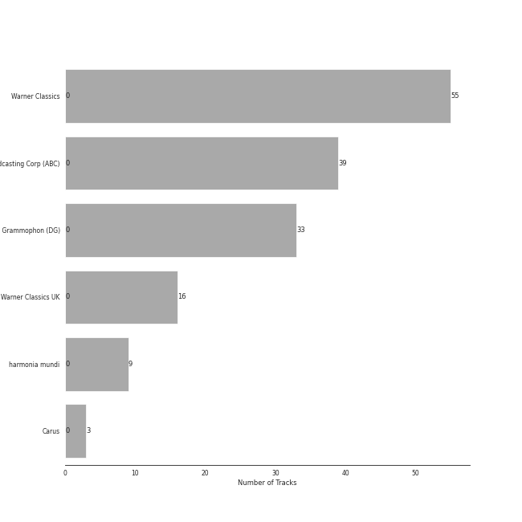

# late romantic era

[158 songs](late_romantic_era_tracks.md)

## Top Artists

See all 27 artists

|   Number of Tracks | Art                                                                                              | Artist                                                                                   | 🔗                                                           |
|-------------------:|:-------------------------------------------------------------------------------------------------|:-----------------------------------------------------------------------------------------|:------------------------------------------------------------|
|                 60 |  | [Pyotr Ilyich Tchaikovsky](../artists/pyotr_ilyich_tchaikovsky.md)                       | [🔗](https://open.spotify.com/artist/3MKCzCnpzw3TjUYs2v7vDA) |
|                 40 |  | [Berliner Philharmoniker](../artists/berliner_philharmoniker.md)                         | [🔗](https://open.spotify.com/artist/6uRJnvQ3f8whVnmeoecv5Z) |
|                 40 |  | [Sir Simon Rattle](../artists/sir_simon_rattle.md)                                       | [🔗](https://open.spotify.com/artist/4GQwgdcDQwqtcHICjUNndp) |
|                 39 |  | [Barry Wordsworth](../artists/barry_wordsworth.md)                                       | [🔗](https://open.spotify.com/artist/5sjJnaI3YhaO8KylpJk3gN) |
|                 39 |  | [Orchestra Victoria](../artists/orchestra_victoria.md)                                   | [🔗](https://open.spotify.com/artist/1bnC6eJzCumTgAB7tG1118) |
|                 39 |  | [Léo Delibes](../artists/l_o_delibes.md)                                                 | [🔗](https://open.spotify.com/artist/1M9AXZkNPdOd1IPEsQsXnT) |
|                 32 |  | [Johannes Brahms](../artists/johannes_brahms.md)                                         | [🔗](https://open.spotify.com/artist/5wTAi7QkpP6kp8a54lmTOq) |
|                 31 |  | [London Symphony Orchestra](../artists/london_symphony_orchestra.md)                     | [🔗](https://open.spotify.com/artist/5yxyJsFanEAuwSM5kOuZKc) |
|                 31 |  | [André Previn](../artists/andr__previn.md)                                               | [🔗](https://open.spotify.com/artist/2tfWguHr2nj4e8KXLKciVq) |
|                 17 |  | [Gustavo Dudamel](../artists/gustavo_dudamel.md)                                         | [🔗](https://open.spotify.com/artist/0cxXnDhpgxcMMkKddhORHY) |
|                 17 |  | [Wiener Philharmoniker](../artists/wiener_philharmoniker.md)                             | [🔗](https://open.spotify.com/artist/003f4bk13c6Q3gAUXv7dGJ) |
|                 16 |  | [Emerson String Quartet](../artists/emerson_string_quartet.md)                           | [🔗](https://open.spotify.com/artist/4IBl8k6ZsBagsI5zRjyXH7) |
|                 16 |  | [Modest Mussorgsky](../artists/modest_mussorgsky.md)                                     | [🔗](https://open.spotify.com/artist/284mnx33IWcymQEpMxyfHl) |
|                  8 |  | [Jerusalem Quartet](../artists/jerusalem_quartet.md)                                     | [🔗](https://open.spotify.com/artist/7AnE8Jpu1vxLeXcs6OKYHE) |
|                  8 |  | Antonín Dvořák                                                                           | [🔗](https://open.spotify.com/artist/6n7nd5iceYpXVwcx8VPpxF) |
|                  8 |  | Veronika Hagen                                                                           | [🔗](https://open.spotify.com/artist/3ijxXTal6hr7byhqZDdHsP) |
|                  4 |  | Leon Fleisher                                                                            | [🔗](https://open.spotify.com/artist/6ncNdxBc8zVWMOF7nJ5Pgy) |
|                  3 |  | Gary Hoffman                                                                             | [🔗](https://open.spotify.com/artist/7qcRbaIYVuOERS3KmB71GH) |
|                  3 |  | NDR Chor                                                                                 | [🔗](https://open.spotify.com/artist/7hMAA1N5j1Ynb49NIWO7HV) |
|                  3 |  | [Academy of St. Martin in the Fields](../artists/academy_of_st__martin_in_the_fields.md) | [🔗](https://open.spotify.com/artist/77CaCn32H4mOMQA7UElzfF) |
|                  3 |  | [Sir Neville Marriner](../artists/sir_neville_marriner.md)                               | [🔗](https://open.spotify.com/artist/6NUhQz7eAEsZvjEHTKHux9) |
|                  3 |  | Philipp Ahmann                                                                           | [🔗](https://open.spotify.com/artist/309coOGhdzqXdIRwJH1xUo) |
|                  2 |  | Edvard Grieg                                                                             | [🔗](https://open.spotify.com/artist/5ihY290YPGc3aY2xTyx7Gy) |
|                  1 |  | Philippe Herreweghe                                                                      | [🔗](https://open.spotify.com/artist/2ozcTa5tl8qhSbhJKM60I5) |
|                  1 |  | Anton Bruckner                                                                           | [🔗](https://open.spotify.com/artist/2bM3j1JQWBkmzuoZKu4zj2) |
|                  1 |  | Libera                                                                                   | [🔗](https://open.spotify.com/artist/235C4ktJ2aGIyqaBlXyg7e) |
|                  1 |  | Collegium Vocale Gent                                                                    | [🔗](https://open.spotify.com/artist/17BdLN9q8RRQQqyklLwac1) |

## Top Albums

See all 10 albums

|   Number of Tracks | Art                                                                                              | Album                                                  | 🔗                                                          |
|-------------------:|:-------------------------------------------------------------------------------------------------|:-------------------------------------------------------|:-----------------------------------------------------------|
|                 39 |  | Coppélia                                               | [🔗](https://open.spotify.com/album/7jKT8NC2XfAs9RFKsrGz2p) |
|                 31 |  | Tchaikovsky: Swan Lake                                 | [🔗](https://open.spotify.com/album/7dVA06E7AP7P7VzPyNxQVO) |
|                 24 |  | Tchaikovsky: The Nutcracker                            | [🔗](https://open.spotify.com/album/54Awn36ryf55PkZyOR4iwQ) |
|                 17 |  | Mussorgsky: Pictures At An Exhibition                  | [🔗](https://open.spotify.com/album/1b2aoeaYZZBWmJoavOQhnd) |
|                 16 |  | Brahms: The Symphonies                                 | [🔗](https://open.spotify.com/album/2dL2qDsg6teV1cueLxCRa1) |
|                 16 |  | Brahms: String Quartets & Piano Quintet                | [🔗](https://open.spotify.com/album/5nZ5ePGoQZGt1MbGphwqph) |
|                  8 |  | Dvorak: String Quintet, Op. 97 & String Sextet, Op. 48 | [🔗](https://open.spotify.com/album/02nUFvsdTaekp2QQalnE3N) |
|                  3 |  | Tchaikovsky: Sacred Choral Music                       | [🔗](https://open.spotify.com/album/4udN7bCLaa8zCnaIvoxzOB) |
|                  3 |  | Mozart: Eine Kleine Nachtmusik etc.                    | [🔗](https://open.spotify.com/album/5YCuibCDJrkVcS3UOAYqr9) |
|                  1 |  | Bruckner: Mass in E Minor & Motets                     | [🔗](https://open.spotify.com/album/13eAUvw0Ga3BBFsf6oxF46) |

## Top Record Labels

See all 6 labels

|   Number of Tracks | Label                                                                                 |
|-------------------:|:--------------------------------------------------------------------------------------|
|                 58 | [Warner Classics](../labels/warner_classics.md)                                       |
|                 39 | [Australian Broadcasting Corp (ABC)](../labels/australian_broadcasting_corp__abc_.md) |
|                 33 | [Deutsche Grammophon (DG)](../labels/deutsche_grammophon__dg_.md)                     |
|                 16 | [Warner Classics UK](../labels/warner_classics_uk.md)                                 |
|                  9 | [harmonia mundi](../labels/harmonia_mundi.md)                                         |
|                  3 | [Carus](../labels/carus.md)                                                           |

## Audio Features

| 10 most Danceable tracks                                                                           | 10 least Danceable tracks                                                                                  |
|:---------------------------------------------------------------------------------------------------|:-----------------------------------------------------------------------------------------------------------|
| Coppélia / Tableau 2: No. 16 Boléro - Alternative Version                                          | String Quintet No. 3, Op. 97: III. Larghetto                                                               |
| Coppélia / Tableau 2: No. 11a Musique des automates                                                | Brahms: Symphony No. 1 in C Minor, Op. 68: III. Un poco allegretto e grazioso                              |
| Coppélia / Tableau 2: No. 17 Gigue                                                                 | Brahms: Symphony No. 3 in F Major, Op. 90: III. Poco allegretto                                            |
| Pictures at an Exhibition (Orch. Ravel): V. Ballet of the Unhatched Chicks                         | Tchaikovsky: Swan Lake, Op. 20, Act II: No. 14, Scene. Moderato                                            |
| Coppélia / Tableau 3: No. 20 Fête de la cloche: IV. Le travail (La fileuse)                        | Coppélia / Tableau 3: No. 20 Fête de la cloche: VII. La paix                                               |
| Coppélia / Tableau 3: No. 20 Fête de la cloche: V. L'hymen (Noce villageoise)                      | Brahms: Symphony No. 1 in C Minor, Op. 68: II. Andante sostenuto                                           |
| Coppélia / Tableau 3: No. 20 Fête de la cloche: VI. La discorde et la guerre - Alternative Version | Grieg: 2 Elegiac Melodies, Op. 34: No. 2, Last Spring (Orchestral Version)                                 |
| Pictures at an Exhibition (Orch. Ravel): Promenade III                                             | Brahms: Symphony No. 2 in D Major, Op. 73: II. Adagio non troppo                                           |
| Coppélia / Tableau 3: No. 20 Fête de la cloche: VIII. Danse de fête                                | Pictures at an Exhibition (Orch. Ravel): II. The Old Castle                                                |
| Coppélia / Tableau 3: No. 20 Fête de la cloche: VIII. Danse de fête - Alternative Version          | Tchaikovsky: String Quartet No. 1 in D Major, Op. 11: II. Andante cantabile (Version for String Orchestra) |

| 10 most Energetic tracks                                                                            | 10 least Energetic tracks                                                                   |
|:----------------------------------------------------------------------------------------------------|:--------------------------------------------------------------------------------------------|
| Tchaikovsky: The Nutcracker, Op. 71, Act II: No. 12d, Divertissement. Trepak, Russian Dance         | Pictures at an Exhibition (Orch. Ravel): VIIIb. Cum mortuis in lingua mortua                |
| Tchaikovsky: Swan Lake, Op. 20, Act III: No. 15, Scene. March - Allegro giusto                      | Pictures at an Exhibition (Orch. Ravel): II. The Old Castle                                 |
| Tchaikovsky: Swan Lake, Op. 20, Act I: No. 8, Dance with Goblets                                    | Coppélia / Tableau 2: No. 14a Scène                                                         |
| Tchaikovsky: The Nutcracker, Op. 71, Act I, Scene 1: No. 7, The Battle                              | Coppélia / Tableau 1: No. 5 Ballade                                                         |
| Tchaikovsky: Swan Lake, Op. 20, Act IV: No. 29, Finale                                              | Tchaikovsky: Swan Lake, Op. 20, Act IV: No. 25, Entr'acte                                   |
| Tchaikovsky: The Nutcracker, Op. 71, Act II: No. 12f, Divertissement. Mother Gigogne and the Clowns | Tchaikovsky: The Nutcracker, Op. 71, Act II: No. 12b, Divertissement. Coffee, Arabian Dance |
| Pictures at an Exhibition (Orch. Ravel): VII. The Market at Limoges                                 | Coppélia / Tableau 3: No. 20 Fête de la cloche: VII. La paix                                |
| Tchaikovsky: Swan Lake, Op. 20, Act III: No. 23, Mazurka                                            | Pictures at an Exhibition (Orch. Ravel): Promenade II                                       |
| Tchaikovsky: Swan Lake, Op. 20, Act I: Introduction - No. 1, Scene. Allegro giusto                  | Coppélia / Tableau 2: No. 9 Scène                                                           |
| Tchaikovsky: The Nutcracker, Op. 71, Act II: No. 12a, Divertissement. Chocolate, Spanish Dance      | Pictures at an Exhibition (Orch. Ravel): VIIIa. Catacombae (Sepulchrum Romanum)             |

| 10 most Speechy tracks                                                                    | 10 least Speechy tracks                                                                     |
|:------------------------------------------------------------------------------------------|:--------------------------------------------------------------------------------------------|
| Coppélia / Tableau 3: No. 20 Fête de la cloche: VIII. Danse de fête                       | Pictures at an Exhibition (Orch. Ravel): Promenade III                                      |
| Coppélia / Tableau 1: No. 4 Scène                                                         | Tchaikovsky: Swan Lake, Op. 20, Act III: No. 21, Spanish Dance                              |
| Coppélia / Tableau 3: No. 20 Fête de la cloche: VIII. Danse de fête - Alternative Version | Tchaikovsky: Swan Lake, Op. 20, Act I: No. 7, Sujet                                         |
| Tchaikovsky: Swan Lake, Op. 20, Act III: No. 22, Neapolitan Dance                         | Brahms: Symphony No. 1 in C Minor, Op. 68: I. Un poco sostenuto - Allegro                   |
| Tchaikovsky: The Nutcracker, Op. 71, Act I, Scene 1: No. 7, The Battle                    | Coppélia / Tableau 3: No. 20 Fête de la cloche: IV. Le travail (La fileuse)                 |
| Coppélia / Tableau 2: No. 16 Boléro - Alternative Version                                 | Tchaikovsky: Swan Lake, Op. 20, Act III: No. 18, Scene. Allegro - Allegro giusto            |
| Tchaikovsky: Swan Lake, Op. 20, Act I: No. 3, Scene. Allegro moderato                     | Tchaikovsky: The Nutcracker, Op. 71, Act II: No. 12c, Divertissement. Tea, Chinese Dance    |
| Pictures at an Exhibition (Orch. Ravel): I. Gnomus                                        | Tchaikovsky: The Nutcracker, Op. 71, Act II: No. 14b, Pas de deux. Variation I "Tarantella" |
| Tchaikovsky: Swan Lake, Op. 20, Act I: No. 5, Pas de deux for Two Merry-Makers            | Brahms: Symphony No. 2 in D Major, Op. 73: IV. Allegro con spirito                          |
| Pictures at an Exhibition (Orch. Ravel): V. Ballet of the Unhatched Chicks                | Pictures at an Exhibition (Orch. Ravel): IV. Bydlo                                          |

| 10 most Acoustic tracks                                                       | 10 least Acoustic tracks                                                                            |
|:------------------------------------------------------------------------------|:----------------------------------------------------------------------------------------------------|
| 9 Sacred Pieces, TH 78: No. 3, Cherubic Hymn No. 3                            | Coppélia / Tableau 3: No. 20 Fête de la cloche: VIII. Danse de fête - Alternative Version           |
| Pictures at an Exhibition (Orch. Ravel): Promenade II                         | Tchaikovsky: The Nutcracker, Op. 71, Act II: No. 12f, Divertissement. Mother Gigogne and the Clowns |
| 9 Sacred Pieces, TH 78: No. 2, Cherubic Hymn No. 2                            | Tchaikovsky: The Nutcracker, Op. 71, Act II: No. 14d, Pas de deux. Coda                             |
| 9 Sacred Pieces, TH 78: No. 1, Cherubic Hymn No. 1                            | String Sextet, Op. 48: III. Furiant. Presto - Trio                                                  |
| Pictures at an Exhibition (Orch. Ravel): III. Tuileries Gardens               | Tchaikovsky: Swan Lake, Op. 20, Act III: No. 23, Mazurka                                            |
| Coppélia / Tableau 3: No. 20 Fête de la cloche: IV. Le travail (La fileuse)   | String Sextet, Op. 48: IV. Finale. Tema con variazioni - Allegretto grazioso, quasi andantino       |
| Brahms: Symphony No. 3 in F Major, Op. 90: III. Poco allegretto               | Coppélia / Tableau 2: No. 11a Musique des automates                                                 |
| Tchaikovsky: Swan Lake, Op. 20, Act IV: No. 27, Dance of the Little Swans     | Tchaikovsky: Swan Lake, Op. 20, Act I: No. 8, Dance with Goblets                                    |
| Coppélia / Tableau 3: No. 20 Fête de la cloche: V. L'hymen (Noce villageoise) | String Sextet, Op. 48: II. Dumka (Elegie). Poco allegretto                                          |
| Coppélia / Tableau 2: Entr'acte                                               | Tchaikovsky: The Nutcracker, Op. 71, Act II: No. 12a, Divertissement. Chocolate, Spanish Dance      |

| 10 most Instrumental tracks                                                                    | 10 least Instrumental tracks                                                              |
|:-----------------------------------------------------------------------------------------------|:------------------------------------------------------------------------------------------|
| Pictures at an Exhibition (Orch. Ravel): IV. Bydlo                                             | Coppélia / Tableau 3: No. 20 Fête de la cloche: VII. La paix                              |
| Tchaikovsky: Swan Lake, Op. 20, Act IV: No. 26, Scene. Allegro ma non troppo                   | Coppélia / Tableau 3: No. 20 Fête de la cloche: VIII. Danse de fête                       |
| Pictures at an Exhibition (Orch. Ravel): Promenade I                                           | 9 Sacred Pieces, TH 78: No. 3, Cherubic Hymn No. 3                                        |
| Tchaikovsky: The Nutcracker, Op. 71, Act II: No. 14a, Pas de deux. Andante maestoso            | Coppélia / Tableau 3: No. 20 Fête de la cloche: VIII. Danse de fête - Alternative Version |
| Pictures at an Exhibition (Orch. Ravel): VIIIb. Cum mortuis in lingua mortua                   | Coppélia / Tableau 2: No. 17 Gigue                                                        |
| Pictures at an Exhibition (Orch. Ravel): VII. The Market at Limoges                            | Coppélia / Tableau 3: No. 20 Fête de la cloche: II. L'aurore                              |
| Tchaikovsky: The Nutcracker, Op. 71, Act II: No. 15, Final Waltz and Apotheosis                | 9 Sacred Pieces, TH 78: No. 2, Cherubic Hymn No. 2                                        |
| Coppélia / Tableau 1: No. 7a Sortie                                                            | Coppélia / Tableau 2: No. 14a Scène                                                       |
| Tchaikovsky: The Nutcracker, Op. 71, Act II: No. 12e, Divertissement. Dance of the Reed-Flutes | 9 Sacred Pieces, TH 78: No. 1, Cherubic Hymn No. 1                                        |
| Coppélia / Tableau 3: No. 20 Fête de la cloche: V. L'hymen (Noce villageoise)                  | Ave María, WAB 6                                                                          |

| 10 most Live tracks                                                                                   | 10 least Live tracks                                                                      |
|:------------------------------------------------------------------------------------------------------|:------------------------------------------------------------------------------------------|
| Pictures at an Exhibition (Orch. Ravel): VIIIb. Cum mortuis in lingua mortua                          | Coppélia / Tableau 3: No. 19 Marche de la cloche                                          |
| Pictures at an Exhibition (Orch. Ravel): IX. The Hut on Chicken's Legs                                | Pictures at an Exhibition (Orch. Ravel): Promenade IV                                     |
| Pictures at an Exhibition (Orch. Ravel): VII. The Market at Limoges                                   | Coppélia / Tableau 1: No. 5 Ballade                                                       |
| Pictures at an Exhibition (Orch. Ravel): I. Gnomus                                                    | Tchaikovsky: Swan Lake, Op. 20, Act I: No. 4, Pas de trois                                |
| Night on Bald Mountain                                                                                | 9 Sacred Pieces, TH 78: No. 2, Cherubic Hymn No. 2                                        |
| Tchaikovsky: The Nutcracker, Op. 71, Act I, Scene 1: No. 3, Children's Galop and Entry of the Parents | Piano Quintet in F minor, Op. 34: 4. Finale (poco sostenuto - Allegro non troppo)         |
| Tchaikovsky: Swan Lake, Op. 20, Act III: No. 18, Scene. Allegro - Allegro giusto                      | Ave María, WAB 6                                                                          |
| Tchaikovsky: Swan Lake, Op. 20, Act II: No. 11, Scene. Allegro moderato - Moderato - Allegro vivo     | Tchaikovsky: The Nutcracker, Op. 71: Miniature Overture                                   |
| Tchaikovsky: Swan Lake, Op. 20, Act III, Appendix II: No. 20a, Russian Dance                          | Coppélia / Tableau 2: No. 14a Scène                                                       |
| Pictures at an Exhibition (Orch. Ravel): VI. Samuel Goldenberg und Schmuÿle                           | String Quartet No. 2 In A Minor, Op. 51 No. 2: 4. Finale (Allegro non assai - Più vivace) |

| 10 most Happy tracks                                                                                  | 10 least Happy tracks                                                                       |
|:------------------------------------------------------------------------------------------------------|:--------------------------------------------------------------------------------------------|
| Tchaikovsky: The Nutcracker, Op. 71, Act II: No. 12a, Divertissement. Chocolate, Spanish Dance        | 9 Sacred Pieces, TH 78: No. 2, Cherubic Hymn No. 2                                          |
| Pictures at an Exhibition (Orch. Ravel): V. Ballet of the Unhatched Chicks                            | 9 Sacred Pieces, TH 78: No. 3, Cherubic Hymn No. 3                                          |
| Tchaikovsky: The Nutcracker, Op. 71, Act II: No. 12d, Divertissement. Trepak, Russian Dance           | Tchaikovsky: The Nutcracker, Op. 71, Act II: No. 12b, Divertissement. Coffee, Arabian Dance |
| Tchaikovsky: The Nutcracker, Op. 71, Act II: No. 12c, Divertissement. Tea, Chinese Dance              | Brahms: Symphony No. 1 in C Minor, Op. 68: II. Andante sostenuto                            |
| Coppélia / Tableau 2: No. 11a Musique des automates                                                   | Brahms: Symphony No. 2 in D Major, Op. 73: II. Adagio non troppo                            |
| Tchaikovsky: Swan Lake, Op. 20, Act III: No. 22, Neapolitan Dance                                     | Grieg: 2 Elegiac Melodies, Op. 34: No. 2, Last Spring (Orchestral Version)                  |
| Tchaikovsky: The Nutcracker, Op. 71, Act I, Scene 1: No. 3, Children's Galop and Entry of the Parents | Brahms: Symphony No. 3 in F Major, Op. 90: II. Andante                                      |
| Coppélia / Tableau 2: No. 16 Boléro - Alternative Version                                             | Pictures at an Exhibition (Orch. Ravel): II. The Old Castle                                 |
| Coppélia / Tableau 3: No. 20 Fête de la cloche: V. L'hymen (Noce villageoise)                         | Ave María, WAB 6                                                                            |
| Coppélia / Tableau 2: No. 17 Gigue                                                                    | Grieg: 2 Elegiac Melodies, Op. 34: No. 1, The Wounded Heart (Orchestral Version)            |
