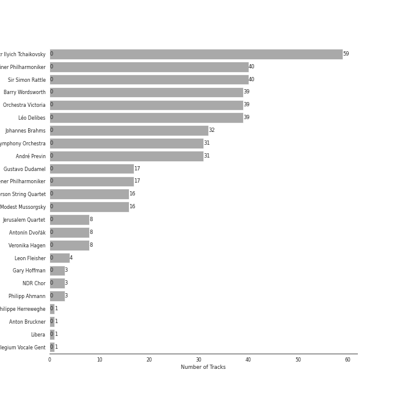
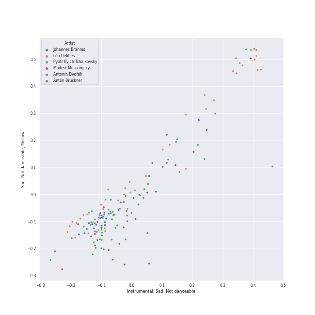

# late romantic era

[155 songs](late_romantic_era_tracks.md)

## Top Artists

See all 24 artists

| Number of Tracks | Art | Artist | 🔗 |
|---:|:---|:---|:---|
| 59 |  | [Pyotr Ilyich Tchaikovsky](../artists/pyotr_ilyich_tchaikovsky.md) | [🔗](https://open.spotify.com/artist/3MKCzCnpzw3TjUYs2v7vDA) |
| 40 |  | [Berliner Philharmoniker](../artists/berliner_philharmoniker.md) | [🔗](https://open.spotify.com/artist/6uRJnvQ3f8whVnmeoecv5Z) |
| 40 |  | [Sir Simon Rattle](../artists/sir_simon_rattle.md) | [🔗](https://open.spotify.com/artist/4GQwgdcDQwqtcHICjUNndp) |
| 39 |  | [Barry Wordsworth](../artists/barry_wordsworth.md) | [🔗](https://open.spotify.com/artist/5sjJnaI3YhaO8KylpJk3gN) |
| 39 |  | [Orchestra Victoria](../artists/orchestra_victoria.md) | [🔗](https://open.spotify.com/artist/1bnC6eJzCumTgAB7tG1118) |
| 39 |  | [Léo Delibes](../artists/l_o_delibes.md) | [🔗](https://open.spotify.com/artist/1M9AXZkNPdOd1IPEsQsXnT) |
| 32 |  | [Johannes Brahms](../artists/johannes_brahms.md) | [🔗](https://open.spotify.com/artist/5wTAi7QkpP6kp8a54lmTOq) |
| 31 |  | [London Symphony Orchestra](../artists/london_symphony_orchestra.md) | [🔗](https://open.spotify.com/artist/5yxyJsFanEAuwSM5kOuZKc) |
| 31 |  | [André Previn](../artists/andr__previn.md) | [🔗](https://open.spotify.com/artist/2tfWguHr2nj4e8KXLKciVq) |
| 17 |  | [Gustavo Dudamel](../artists/gustavo_dudamel.md) | [🔗](https://open.spotify.com/artist/0cxXnDhpgxcMMkKddhORHY) |
| 17 |  | [Wiener Philharmoniker](../artists/wiener_philharmoniker.md) | [🔗](https://open.spotify.com/artist/003f4bk13c6Q3gAUXv7dGJ) |
| 16 |  | [Emerson String Quartet](../artists/emerson_string_quartet.md) | [🔗](https://open.spotify.com/artist/4IBl8k6ZsBagsI5zRjyXH7) |
| 16 |  | [Modest Mussorgsky](../artists/modest_mussorgsky.md) | [🔗](https://open.spotify.com/artist/284mnx33IWcymQEpMxyfHl) |
| 8 |  | [Jerusalem Quartet](../artists/jerusalem_quartet.md) | [🔗](https://open.spotify.com/artist/7AnE8Jpu1vxLeXcs6OKYHE) |
| 8 |  | Antonín Dvořák | [🔗](https://open.spotify.com/artist/6n7nd5iceYpXVwcx8VPpxF) |
| 8 |  | Veronika Hagen | [🔗](https://open.spotify.com/artist/3ijxXTal6hr7byhqZDdHsP) |
| 4 |  | Leon Fleisher | [🔗](https://open.spotify.com/artist/6ncNdxBc8zVWMOF7nJ5Pgy) |
| 3 |  | Gary Hoffman | [🔗](https://open.spotify.com/artist/7qcRbaIYVuOERS3KmB71GH) |
| 3 |  | NDR Chor | [🔗](https://open.spotify.com/artist/7hMAA1N5j1Ynb49NIWO7HV) |
| 3 |  | Philipp Ahmann | [🔗](https://open.spotify.com/artist/309coOGhdzqXdIRwJH1xUo) |
| 1 |  | Philippe Herreweghe | [🔗](https://open.spotify.com/artist/2ozcTa5tl8qhSbhJKM60I5) |
| 1 |  | Anton Bruckner | [🔗](https://open.spotify.com/artist/2bM3j1JQWBkmzuoZKu4zj2) |
| 1 |  | Libera | [🔗](https://open.spotify.com/artist/235C4ktJ2aGIyqaBlXyg7e) |
| 1 |  | Collegium Vocale Gent | [🔗](https://open.spotify.com/artist/17BdLN9q8RRQQqyklLwac1) |

## Top Albums

See all 9 albums

| Number of Tracks | Art | Album | Release Date | 🔗 |
|---:|:---|:---|:---|:---|
| 39 |  | Coppélia | 2018-07-06 | [🔗](https://open.spotify.com/album/7jKT8NC2XfAs9RFKsrGz2p) |
| 31 |  | Tchaikovsky: Swan Lake | 1976 | [🔗](https://open.spotify.com/album/7dVA06E7AP7P7VzPyNxQVO) |
| 24 |  | Tchaikovsky: The Nutcracker | 2010-10-11 | [🔗](https://open.spotify.com/album/54Awn36ryf55PkZyOR4iwQ) |
| 17 |  | Mussorgsky: Pictures At An Exhibition | 2016-12-02 | [🔗](https://open.spotify.com/album/1b2aoeaYZZBWmJoavOQhnd) |
| 16 |  | Brahms: The Symphonies | 2009-09-07 | [🔗](https://open.spotify.com/album/2dL2qDsg6teV1cueLxCRa1) |
| 16 |  | Brahms: String Quartets & Piano Quintet | 2007-01-01 | [🔗](https://open.spotify.com/album/5nZ5ePGoQZGt1MbGphwqph) |
| 8 |  | Dvorak: String Quintet, Op. 97 & String Sextet, Op. 48 | 2018-01-19 | [🔗](https://open.spotify.com/album/02nUFvsdTaekp2QQalnE3N) |
| 3 |  | Tchaikovsky: Sacred Choral Music | 2016-07-01 | [🔗](https://open.spotify.com/album/4udN7bCLaa8zCnaIvoxzOB) |
| 1 |  | Bruckner: Mass in E Minor & Motets | 2002 | [🔗](https://open.spotify.com/album/13eAUvw0Ga3BBFsf6oxF46) |

## Top Record Labels

See all 6 labels

| Number of Tracks | Label |
|---:|:---|
| 55 | [Warner Classics](../labels/warner_classics.md) |
| 39 | [Australian Broadcasting Corp (ABC)](../labels/australian_broadcasting_corp__abc_.md) |
| 33 | [Deutsche Grammophon (DG)](../labels/deutsche_grammophon__dg_.md) |
| 16 | [Warner Classics UK](../labels/warner_classics_uk.md) |
| 9 | [harmonia mundi](../labels/harmonia_mundi.md) |
| 3 | Carus |

## Audio Features

| 10 most Danceable tracks | 10 least Danceable tracks |
|:---|:---|
| Coppélia / Tableau 2: No. 16 Boléro - Alternative Version (0.661) | Pictures at an Exhibition (Orch. Ravel): II. The Old Castle (0.0799) |
| Coppélia / Tableau 2: No. 11a Musique des automates (0.648) | Brahms: Symphony No. 2 in D Major, Op. 73: II. Adagio non troppo (0.0817) |
| Coppélia / Tableau 2: No. 17 Gigue (0.604) | Brahms: Symphony No. 1 in C Minor, Op. 68: II. Andante sostenuto (0.0853) |
| Pictures at an Exhibition (Orch. Ravel): V. Ballet of the Unhatched Chicks (0.571) | Coppélia / Tableau 3: No. 20 Fête de la cloche: VII. La paix (0.0877) |
| Coppélia / Tableau 3: No. 20 Fête de la cloche: IV. Le travail (La fileuse) (0.568) | Tchaikovsky: Swan Lake, Op. 20, Act II: No. 14, Scene. Moderato (0.0958) |
| Coppélia / Tableau 3: No. 20 Fête de la cloche: V. L'hymen (Noce villageoise) (0.551) | Brahms: Symphony No. 3 in F Major, Op. 90: III. Poco allegretto (0.105) |
| Coppélia / Tableau 3: No. 20 Fête de la cloche: VI. La discorde et la guerre - Alternative Version (0.55) | Brahms: Symphony No. 1 in C Minor, Op. 68: III. Un poco allegretto e grazioso (0.11) |
| Pictures at an Exhibition (Orch. Ravel): Promenade III (0.543) | String Quintet No. 3, Op. 97: III. Larghetto (0.122) |
| Coppélia / Tableau 3: No. 20 Fête de la cloche: VIII. Danse de fête (0.542) | Brahms: Symphony No. 4 in E Minor, Op. 98: II. Andante moderato (0.124) |
| Coppélia / Tableau 3: No. 20 Fête de la cloche: VIII. Danse de fête - Alternative Version (0.537) | Tchaikovsky: The Nutcracker, Op. 71, Act II: No. 10, The Enchanted Palace of Confiturembourg, the Kingdom of Sweets (0.124) |

| 10 most Energetic tracks | 10 least Energetic tracks |
|:---|:---|
| Tchaikovsky: The Nutcracker, Op. 71, Act II: No. 12d, Divertissement. Trepak, Russian Dance (0.5) | Pictures at an Exhibition (Orch. Ravel): VIIIa. Catacombae (Sepulchrum Romanum) (0.000845) |
| Tchaikovsky: Swan Lake, Op. 20, Act III: No. 15, Scene. March - Allegro giusto (0.474) | Coppélia / Tableau 2: No. 9 Scène (0.00262) |
| Tchaikovsky: Swan Lake, Op. 20, Act I: No. 8, Dance with Goblets (0.391) | Pictures at an Exhibition (Orch. Ravel): Promenade II (0.00371) |
| Tchaikovsky: The Nutcracker, Op. 71, Act I, Scene 1: No. 7, The Battle (0.386) | Coppélia / Tableau 3: No. 20 Fête de la cloche: VII. La paix (0.0039) |
| Tchaikovsky: Swan Lake, Op. 20, Act IV: No. 29, Finale (0.35) | Tchaikovsky: The Nutcracker, Op. 71, Act II: No. 12b, Divertissement. Coffee, Arabian Dance (0.00478) |
| Tchaikovsky: The Nutcracker, Op. 71, Act II: No. 12f, Divertissement. Mother Gigogne and the Clowns (0.348) | Tchaikovsky: Swan Lake, Op. 20, Act IV: No. 25, Entr'acte (0.00606) |
| Pictures at an Exhibition (Orch. Ravel): VII. The Market at Limoges (0.322) | Coppélia / Tableau 1: No. 5 Ballade (0.00661) |
| Tchaikovsky: Swan Lake, Op. 20, Act III: No. 23, Mazurka (0.315) | Coppélia / Tableau 2: No. 14a Scène (0.00699) |
| Tchaikovsky: Swan Lake, Op. 20, Act I: Introduction - No. 1, Scene. Allegro giusto (0.298) | Pictures at an Exhibition (Orch. Ravel): II. The Old Castle (0.00788) |
| Tchaikovsky: The Nutcracker, Op. 71, Act II: No. 12a, Divertissement. Chocolate, Spanish Dance (0.294) | Pictures at an Exhibition (Orch. Ravel): VIIIb. Cum mortuis in lingua mortua (0.00794) |

| 10 most Speechy tracks | 10 least Speechy tracks |
|:---|:---|
| Coppélia / Tableau 3: No. 20 Fête de la cloche: VIII. Danse de fête (0.0818) | Pictures at an Exhibition (Orch. Ravel): IV. Bydlo (0.0311) |
| Coppélia / Tableau 1: No. 4 Scène (0.0766) | Brahms: Symphony No. 2 in D Major, Op. 73: IV. Allegro con spirito (0.0325) |
| Coppélia / Tableau 3: No. 20 Fête de la cloche: VIII. Danse de fête - Alternative Version (0.0716) | Tchaikovsky: The Nutcracker, Op. 71, Act II: No. 14b, Pas de deux. Variation I "Tarantella" (0.0332) |
| Tchaikovsky: Swan Lake, Op. 20, Act III: No. 22, Neapolitan Dance (0.0675) | Tchaikovsky: The Nutcracker, Op. 71, Act II: No. 12c, Divertissement. Tea, Chinese Dance (0.0338) |
| Tchaikovsky: The Nutcracker, Op. 71, Act I, Scene 1: No. 7, The Battle (0.0664) | Tchaikovsky: Swan Lake, Op. 20, Act III: No. 18, Scene. Allegro - Allegro giusto (0.034) |
| Coppélia / Tableau 2: No. 16 Boléro - Alternative Version (0.0579) | Coppélia / Tableau 3: No. 20 Fête de la cloche: IV. Le travail (La fileuse) (0.0342) |
| Tchaikovsky: Swan Lake, Op. 20, Act I: No. 3, Scene. Allegro moderato (0.0573) | Brahms: Symphony No. 1 in C Minor, Op. 68: I. Un poco sostenuto - Allegro (0.0343) |
| Pictures at an Exhibition (Orch. Ravel): I. Gnomus (0.0571) | Tchaikovsky: Swan Lake, Op. 20, Act I: No. 7, Sujet (0.0343) |
| Tchaikovsky: Swan Lake, Op. 20, Act I: No. 5, Pas de deux for Two Merry-Makers (0.0555) | Pictures at an Exhibition (Orch. Ravel): Promenade III (0.0345) |
| Pictures at an Exhibition (Orch. Ravel): V. Ballet of the Unhatched Chicks (0.0532) | Tchaikovsky: Swan Lake, Op. 20, Act III: No. 21, Spanish Dance (0.0345) |

| 10 most Acoustic tracks | 10 least Acoustic tracks |
|:---|:---|
| 9 Sacred Pieces, TH 78: No. 3, Cherubic Hymn No. 3 (0.995) | Tchaikovsky: The Nutcracker, Op. 71, Act II: No. 12a, Divertissement. Chocolate, Spanish Dance (0.583) |
| Pictures at an Exhibition (Orch. Ravel): Promenade II (0.994) | String Sextet, Op. 48: II. Dumka (Elegie). Poco allegretto (0.735) |
| 9 Sacred Pieces, TH 78: No. 2, Cherubic Hymn No. 2 (0.993) | Tchaikovsky: Swan Lake, Op. 20, Act I: No. 8, Dance with Goblets (0.813) |
| 9 Sacred Pieces, TH 78: No. 1, Cherubic Hymn No. 1 (0.992) | Coppélia / Tableau 2: No. 11a Musique des automates (0.817) |
| Pictures at an Exhibition (Orch. Ravel): III. Tuileries Gardens (0.991) | String Sextet, Op. 48: IV. Finale. Tema con variazioni - Allegretto grazioso, quasi andantino (0.821) |
| Coppélia / Tableau 3: No. 20 Fête de la cloche: IV. Le travail (La fileuse) (0.99) | Tchaikovsky: Swan Lake, Op. 20, Act III: No. 23, Mazurka (0.834) |
| Coppélia / Tableau 3: No. 20 Fête de la cloche: V. L'hymen (Noce villageoise) (0.987) | String Sextet, Op. 48: III. Furiant. Presto - Trio (0.852) |
| Tchaikovsky: Swan Lake, Op. 20, Act IV: No. 27, Dance of the Little Swans (0.987) | Tchaikovsky: The Nutcracker, Op. 71, Act II: No. 14d, Pas de deux. Coda (0.864) |
| Brahms: Symphony No. 3 in F Major, Op. 90: III. Poco allegretto (0.987) | Tchaikovsky: The Nutcracker, Op. 71, Act II: No. 12f, Divertissement. Mother Gigogne and the Clowns (0.869) |
| Coppélia / Tableau 2: Entr'acte (0.986) | Coppélia / Tableau 3: No. 20 Fête de la cloche: VIII. Danse de fête - Alternative Version (0.874) |

| 10 most Instrumental tracks | 10 least Instrumental tracks |
|:---|:---|
| Pictures at an Exhibition (Orch. Ravel): IV. Bydlo (0.983) | Ave María, WAB 6 (0.00317) |
| Tchaikovsky: Swan Lake, Op. 20, Act IV: No. 26, Scene. Allegro ma non troppo (0.978) | 9 Sacred Pieces, TH 78: No. 1, Cherubic Hymn No. 1 (0.00449) |
| Pictures at an Exhibition (Orch. Ravel): Promenade I (0.962) | Coppélia / Tableau 2: No. 14a Scène (0.00519) |
| Tchaikovsky: The Nutcracker, Op. 71, Act II: No. 14a, Pas de deux. Andante maestoso (0.954) | 9 Sacred Pieces, TH 78: No. 2, Cherubic Hymn No. 2 (0.00769) |
| Pictures at an Exhibition (Orch. Ravel): VIIIb. Cum mortuis in lingua mortua (0.95) | Coppélia / Tableau 3: No. 20 Fête de la cloche: II. L'aurore (0.0197) |
| Pictures at an Exhibition (Orch. Ravel): VII. The Market at Limoges (0.948) | Coppélia / Tableau 2: No. 17 Gigue (0.0246) |
| Tchaikovsky: The Nutcracker, Op. 71, Act II: No. 15, Final Waltz and Apotheosis (0.944) | Coppélia / Tableau 3: No. 20 Fête de la cloche: VIII. Danse de fête - Alternative Version (0.039) |
| Coppélia / Tableau 1: No. 7a Sortie (0.942) | 9 Sacred Pieces, TH 78: No. 3, Cherubic Hymn No. 3 (0.0469) |
| Tchaikovsky: The Nutcracker, Op. 71, Act II: No. 12e, Divertissement. Dance of the Reed-Flutes (0.94) | Coppélia / Tableau 3: No. 20 Fête de la cloche: VIII. Danse de fête (0.0474) |
| Coppélia / Tableau 3: No. 20 Fête de la cloche: V. L'hymen (Noce villageoise) (0.937) | Coppélia / Tableau 3: No. 20 Fête de la cloche: VII. La paix (0.0544) |

| 10 most Live tracks | 10 least Live tracks |
|:---|:---|
| Pictures at an Exhibition (Orch. Ravel): VIIIb. Cum mortuis in lingua mortua (0.767) | String Quartet No. 2 In A Minor, Op. 51 No. 2: 4. Finale (Allegro non assai - Più vivace) (0.0439) |
| Pictures at an Exhibition (Orch. Ravel): IX. The Hut on Chicken's Legs (0.689) | Coppélia / Tableau 2: No. 14a Scène (0.0555) |
| Pictures at an Exhibition (Orch. Ravel): VII. The Market at Limoges (0.65) | Tchaikovsky: The Nutcracker, Op. 71: Miniature Overture (0.0557) |
| Pictures at an Exhibition (Orch. Ravel): I. Gnomus (0.648) | Ave María, WAB 6 (0.0571) |
| Night on Bald Mountain (0.628) | Piano Quintet in F minor, Op. 34: 4. Finale (poco sostenuto - Allegro non troppo) (0.0572) |
| Tchaikovsky: The Nutcracker, Op. 71, Act I, Scene 1: No. 3, Children's Galop and Entry of the Parents (0.578) | 9 Sacred Pieces, TH 78: No. 2, Cherubic Hymn No. 2 (0.0575) |
| Tchaikovsky: Swan Lake, Op. 20, Act III: No. 18, Scene. Allegro - Allegro giusto (0.565) | Tchaikovsky: Swan Lake, Op. 20, Act I: No. 4, Pas de trois (0.0595) |
| Tchaikovsky: Swan Lake, Op. 20, Act II: No. 11, Scene. Allegro moderato - Moderato - Allegro vivo (0.486) | Coppélia / Tableau 1: No. 5 Ballade (0.0601) |
| Tchaikovsky: Swan Lake, Op. 20, Act III, Appendix II: No. 20a, Russian Dance (0.421) | Pictures at an Exhibition (Orch. Ravel): Promenade IV (0.0644) |
| Pictures at an Exhibition (Orch. Ravel): VI. Samuel Goldenberg und Schmuÿle (0.386) | Coppélia / Tableau 3: No. 19 Marche de la cloche (0.0678) |

| 10 most Happy tracks | 10 least Happy tracks |
|:---|:---|
| Tchaikovsky: The Nutcracker, Op. 71, Act II: No. 12a, Divertissement. Chocolate, Spanish Dance (0.879) | Ave María, WAB 6 (0.0332) |
| Pictures at an Exhibition (Orch. Ravel): V. Ballet of the Unhatched Chicks (0.869) | Brahms: Symphony No. 3 in F Major, Op. 90: II. Andante (0.0345) |
| Tchaikovsky: The Nutcracker, Op. 71, Act II: No. 12d, Divertissement. Trepak, Russian Dance (0.851) | Pictures at an Exhibition (Orch. Ravel): II. The Old Castle (0.0345) |
| Tchaikovsky: The Nutcracker, Op. 71, Act II: No. 12c, Divertissement. Tea, Chinese Dance (0.832) | Brahms: Symphony No. 2 in D Major, Op. 73: II. Adagio non troppo (0.0353) |
| Coppélia / Tableau 2: No. 11a Musique des automates (0.728) | Brahms: Symphony No. 1 in C Minor, Op. 68: II. Andante sostenuto (0.0358) |
| Tchaikovsky: Swan Lake, Op. 20, Act III: No. 22, Neapolitan Dance (0.641) | Tchaikovsky: The Nutcracker, Op. 71, Act II: No. 12b, Divertissement. Coffee, Arabian Dance (0.037) |
| Tchaikovsky: The Nutcracker, Op. 71, Act I, Scene 1: No. 3, Children's Galop and Entry of the Parents (0.639) | 9 Sacred Pieces, TH 78: No. 3, Cherubic Hymn No. 3 (0.0372) |
| Coppélia / Tableau 2: No. 16 Boléro - Alternative Version (0.615) | 9 Sacred Pieces, TH 78: No. 2, Cherubic Hymn No. 2 (0.0373) |
| Coppélia / Tableau 3: No. 20 Fête de la cloche: V. L'hymen (Noce villageoise) (0.598) | Brahms: Symphony No. 4 in E Minor, Op. 98: II. Andante moderato (0.0377) |
| Tchaikovsky: The Nutcracker, Op. 71, Act II: No. 12f, Divertissement. Mother Gigogne and the Clowns (0.597) | Pictures at an Exhibition (Orch. Ravel): VIIIb. Cum mortuis in lingua mortua (0.038) |
