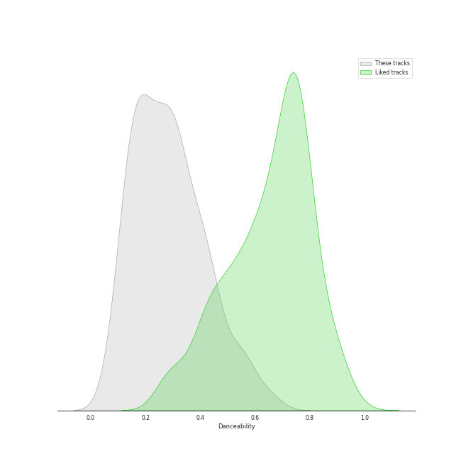
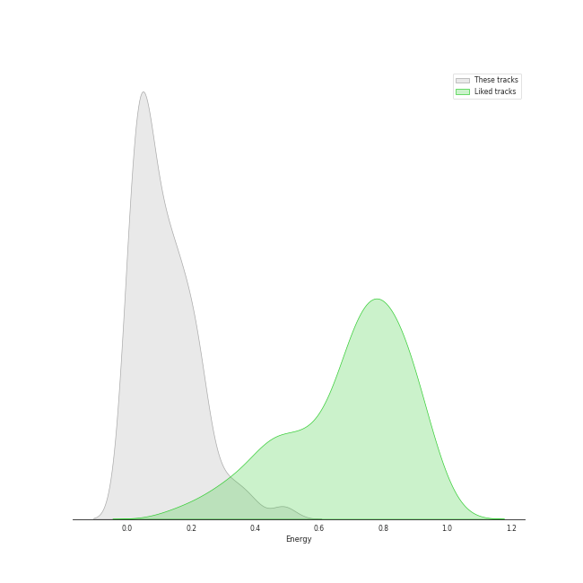
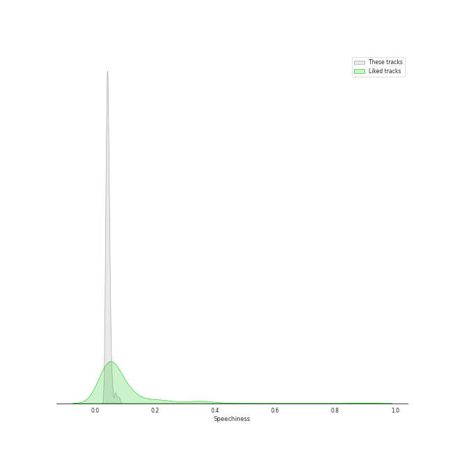
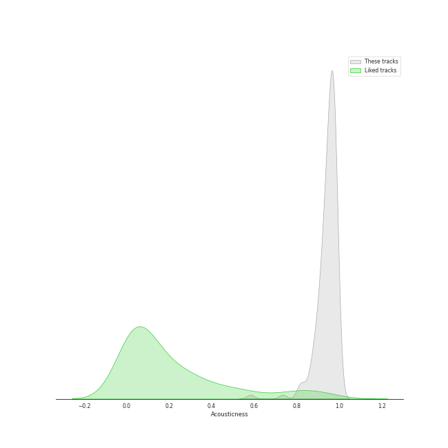
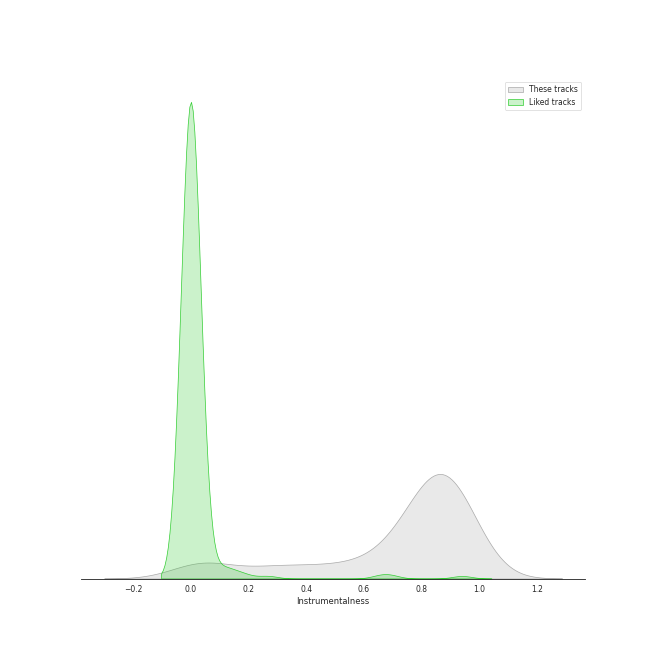
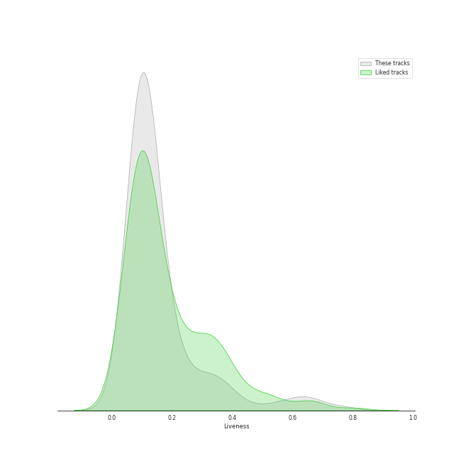
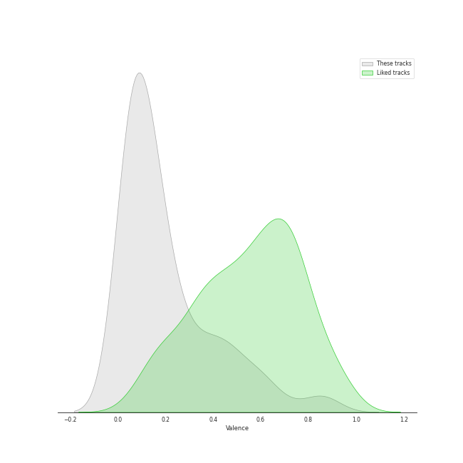
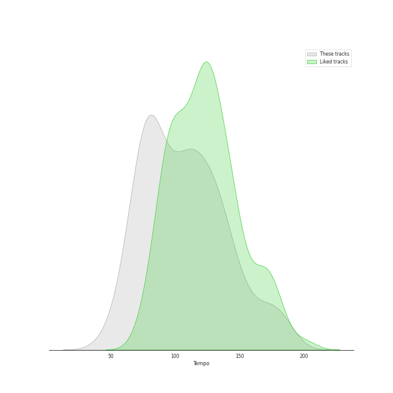

# Track Features for late romantic era

## Danceability

| ​ | 10 most Danceable tracks | ​​ | 10 least Danceable tracks |
|:---|:---|:---|:---|
|  | Coppélia / Tableau 2: No. 16 Boléro - Alternative Version (0.661) |  | Pictures at an Exhibition (Orch. Ravel): II. The Old Castle (0.0799) |
|  | Coppélia / Tableau 2: No. 11a Musique des automates (0.648) |  | Brahms: Symphony No. 2 in D Major, Op. 73: II. Adagio non troppo (0.0817) |
|  | Coppélia / Tableau 2: No. 17 Gigue (0.604) |  | Brahms: Symphony No. 1 in C Minor, Op. 68: II. Andante sostenuto (0.0853) |
|  | Pictures at an Exhibition (Orch. Ravel): V. Ballet of the Unhatched Chicks (0.571) |  | Coppélia / Tableau 3: No. 20 Fête de la cloche: VII. La paix (0.0877) |
|  | Coppélia / Tableau 3: No. 20 Fête de la cloche: IV. Le travail (La fileuse) (0.568) |  | Tchaikovsky: Swan Lake, Op. 20, Act 2: No. 14, Scene. Moderato (0.0958) |
|  | Coppélia / Tableau 3: No. 20 Fête de la cloche: V. L'hymen (Noce villageoise) (0.551) |  | Brahms: Symphony No. 3 in F Major, Op. 90: III. Poco allegretto (0.105) |
|  | Coppélia / Tableau 3: No. 20 Fête de la cloche: VI. La discorde et la guerre - Alternative Version (0.55) |  | Brahms: Symphony No. 1 in C Minor, Op. 68: III. Un poco allegretto e grazioso (0.11) |
|  | Pictures at an Exhibition (Orch. Ravel): Promenade III (0.543) |  | String Quintet No. 3, Op. 97: III. Larghetto (0.122) |
|  | Coppélia / Tableau 3: No. 20 Fête de la cloche: VIII. Danse de fête (0.542) |  | Brahms: Symphony No. 4 in E Minor, Op. 98: II. Andante moderato (0.124) |
|  | Coppélia / Tableau 3: No. 20 Fête de la cloche: VIII. Danse de fête - Alternative Version (0.537) |  | Tchaikovsky: The Nutcracker, Op. 71, Act II: No. 10, The Enchanted Palace of Confiturembourg, the Kingdom of Sweets (0.124) |

## Energy

| ​ | 10 most Energetic tracks | ​​ | 10 least Energetic tracks |
|:---|:---|:---|:---|
|  | Tchaikovsky: The Nutcracker, Op. 71, Act II: No. 12d, Divertissement. Trepak, Russian Dance (0.5) |  | Pictures at an Exhibition (Orch. Ravel): VIIIa. Catacombae (Sepulchrum Romanum) (0.000845) |
|  | Tchaikovsky: Swan Lake, Op. 20, Act 3: No. 15, Scene. March - Allegro giusto (0.474) |  | Coppélia / Tableau 2: No. 9 Scène (0.00262) |
|  | Tchaikovsky: Swan Lake, Op. 20, Act 1: No. 8, Dance with Goblets (0.391) |  | Pictures at an Exhibition (Orch. Ravel): Promenade II (0.00371) |
|  | Tchaikovsky: The Nutcracker, Op. 71, Act I, Scene 1: No. 7, The Battle (0.386) |  | Coppélia / Tableau 3: No. 20 Fête de la cloche: VII. La paix (0.0039) |
|  | Tchaikovsky: Swan Lake, Op. 20, Act 4: No. 29, Finale (0.35) |  | Tchaikovsky: The Nutcracker, Op. 71, Act II: No. 12b, Divertissement. Coffee, Arabian Dance (0.00478) |
|  | Tchaikovsky: The Nutcracker, Op. 71, Act II: No. 12f, Divertissement. Mother Gigogne and the Clowns (0.348) |  | Tchaikovsky: Swan Lake, Op. 20, Act 4: No. 25, Entr'acte (0.00606) |
|  | Pictures at an Exhibition (Orch. Ravel): VII. The Market at Limoges (0.322) |  | Coppélia / Tableau 1: No. 5 Ballade (0.00661) |
|  | Tchaikovsky: Swan Lake, Op. 20, Act 3: No. 23, Mazurka (0.315) |  | Coppélia / Tableau 2: No. 14a Scène (0.00699) |
|  | Tchaikovsky: Swan Lake, Op. 20, Act 1: Introduction - No. 1, Scene. Allegro giusto (0.298) |  | Pictures at an Exhibition (Orch. Ravel): II. The Old Castle (0.00788) |
|  | Tchaikovsky: The Nutcracker, Op. 71, Act II: No. 12a, Divertissement. Chocolate, Spanish Dance (0.294) |  | Pictures at an Exhibition (Orch. Ravel): VIIIb. Cum mortuis in lingua mortua (0.00794) |

## Speechiness

| ​ | 10 most Speechy tracks | ​​ | 10 least Speechy tracks |
|:---|:---|:---|:---|
|  | Coppélia / Tableau 3: No. 20 Fête de la cloche: VIII. Danse de fête (0.0818) |  | Pictures at an Exhibition (Orch. Ravel): IV. Bydlo (0.0311) |
|  | Coppélia / Tableau 1: No. 4 Scène (0.0766) |  | Brahms: Symphony No. 2 in D Major, Op. 73: IV. Allegro con spirito (0.0325) |
|  | Coppélia / Tableau 3: No. 20 Fête de la cloche: VIII. Danse de fête - Alternative Version (0.0716) |  | Tchaikovsky: The Nutcracker, Op. 71, Act II: No. 14b, Pas de deux. Variation I "Tarantella" (0.0332) |
|  | Tchaikovsky: Swan Lake, Op. 20, Act 3: No. 22, Neapolitan Dance (0.0675) |  | Tchaikovsky: The Nutcracker, Op. 71, Act II: No. 12c, Divertissement. Tea, Chinese Dance (0.0338) |
|  | Tchaikovsky: The Nutcracker, Op. 71, Act I, Scene 1: No. 7, The Battle (0.0664) |  | Tchaikovsky: Swan Lake, Op. 20, Act 3: No. 18, Scene. Allegro - Allegro giusto (0.034) |
|  | Coppélia / Tableau 2: No. 16 Boléro - Alternative Version (0.0579) |  | Coppélia / Tableau 3: No. 20 Fête de la cloche: IV. Le travail (La fileuse) (0.0342) |
|  | Tchaikovsky: Swan Lake, Op. 20, Act 1: No. 3, Scene. Allegro moderato (0.0573) |  | Brahms: Symphony No. 1 in C Minor, Op. 68: I. Un poco sostenuto - Allegro (0.0343) |
|  | Pictures at an Exhibition (Orch. Ravel): I. Gnomus (0.0571) |  | Tchaikovsky: Swan Lake, Op. 20, Act 1: No. 7, Sujet (0.0343) |
|  | Tchaikovsky: Swan Lake, Op. 20, Act 1: No. 5, Pas de deux for Two Merry-Makers (0.0555) |  | Pictures at an Exhibition (Orch. Ravel): Promenade III (0.0345) |
|  | Pictures at an Exhibition (Orch. Ravel): V. Ballet of the Unhatched Chicks (0.0532) |  | Tchaikovsky: Swan Lake, Op. 20, Act 3: No. 21, Spanish Dance (0.0345) |

## Acousticness

| ​ | 10 most Acoustic tracks | ​​ | 10 least Acoustic tracks |
|:---|:---|:---|:---|
|  | 9 Sacred Pieces, TH 78: No. 3, Cherubic Hymn No. 3 (0.995) |  | Tchaikovsky: The Nutcracker, Op. 71, Act II: No. 12a, Divertissement. Chocolate, Spanish Dance (0.583) |
|  | Pictures at an Exhibition (Orch. Ravel): Promenade II (0.994) |  | String Sextet, Op. 48: II. Dumka (Elegie). Poco allegretto (0.735) |
|  | 9 Sacred Pieces, TH 78: No. 2, Cherubic Hymn No. 2 (0.993) |  | Tchaikovsky: Swan Lake, Op. 20, Act 1: No. 8, Dance with Goblets (0.813) |
|  | 9 Sacred Pieces, TH 78: No. 1, Cherubic Hymn No. 1 (0.992) |  | Coppélia / Tableau 2: No. 11a Musique des automates (0.817) |
|  | Pictures at an Exhibition (Orch. Ravel): III. Tuileries Gardens (0.991) |  | String Sextet, Op. 48: IV. Finale. Tema con variazioni - Allegretto grazioso, quasi andantino (0.821) |
|  | Coppélia / Tableau 3: No. 20 Fête de la cloche: IV. Le travail (La fileuse) (0.99) |  | Tchaikovsky: Swan Lake, Op. 20, Act 3: No. 23, Mazurka (0.834) |
|  | Coppélia / Tableau 3: No. 20 Fête de la cloche: V. L'hymen (Noce villageoise) (0.987) |  | String Sextet, Op. 48: III. Furiant. Presto - Trio (0.852) |
|  | Tchaikovsky: Swan Lake, Op. 20, Act 4: No. 27, Dance of the Little Swans (0.987) |  | Tchaikovsky: The Nutcracker, Op. 71, Act II: No. 14d, Pas de deux. Coda (0.864) |
|  | Brahms: Symphony No. 3 in F Major, Op. 90: III. Poco allegretto (0.987) |  | Tchaikovsky: The Nutcracker, Op. 71, Act II: No. 12f, Divertissement. Mother Gigogne and the Clowns (0.869) |
|  | Coppélia / Tableau 2: Entr'acte (0.986) |  | Coppélia / Tableau 3: No. 20 Fête de la cloche: VIII. Danse de fête - Alternative Version (0.874) |

## Instrumentalness

| ​ | 10 most Instrumental tracks | ​​ | 10 least Instrumental tracks |
|:---|:---|:---|:---|
|  | Pictures at an Exhibition (Orch. Ravel): IV. Bydlo (0.983) |  | Ave María, WAB 6 (0.00317) |
|  | Tchaikovsky: Swan Lake, Op. 20, Act 4: No. 26, Scene. Allegro ma non troppo (0.978) |  | 9 Sacred Pieces, TH 78: No. 1, Cherubic Hymn No. 1 (0.00449) |
|  | Pictures at an Exhibition (Orch. Ravel): Promenade I (0.962) |  | Coppélia / Tableau 2: No. 14a Scène (0.00519) |
|  | Tchaikovsky: The Nutcracker, Op. 71, Act II: No. 14a, Pas de deux. Andante maestoso (0.954) |  | 9 Sacred Pieces, TH 78: No. 2, Cherubic Hymn No. 2 (0.00769) |
|  | Pictures at an Exhibition (Orch. Ravel): VIIIb. Cum mortuis in lingua mortua (0.95) |  | Coppélia / Tableau 3: No. 20 Fête de la cloche: II. L'aurore (0.0197) |
|  | Pictures at an Exhibition (Orch. Ravel): VII. The Market at Limoges (0.948) |  | Coppélia / Tableau 2: No. 17 Gigue (0.0246) |
|  | Tchaikovsky: The Nutcracker, Op. 71, Act II: No. 15, Final Waltz and Apotheosis (0.944) |  | Coppélia / Tableau 3: No. 20 Fête de la cloche: VIII. Danse de fête - Alternative Version (0.039) |
|  | Coppélia / Tableau 1: No. 7a Sortie (0.942) |  | 9 Sacred Pieces, TH 78: No. 3, Cherubic Hymn No. 3 (0.0469) |
|  | Tchaikovsky: The Nutcracker, Op. 71, Act 2: No. 12e, Divertissement. Dance of the Reed-Flutes (0.94) |  | Coppélia / Tableau 3: No. 20 Fête de la cloche: VIII. Danse de fête (0.0474) |
|  | Coppélia / Tableau 3: No. 20 Fête de la cloche: V. L'hymen (Noce villageoise) (0.937) |  | Coppélia / Tableau 3: No. 20 Fête de la cloche: VII. La paix (0.0544) |

## Liveness

| ​ | 10 most Live tracks | ​​ | 10 least Live tracks |
|:---|:---|:---|:---|
|  | Pictures at an Exhibition (Orch. Ravel): VIIIb. Cum mortuis in lingua mortua (0.767) |  | String Quartet No. 2 In A Minor, Op. 51 No. 2: 4. Finale (Allegro non assai - Più vivace) (0.0439) |
|  | Pictures at an Exhibition (Orch. Ravel): IX. The Hut on Chicken's Legs (0.689) |  | Coppélia / Tableau 2: No. 14a Scène (0.0555) |
|  | Pictures at an Exhibition (Orch. Ravel): VII. The Market at Limoges (0.65) |  | Tchaikovsky: The Nutcracker, Op. 71: Miniature Overture (0.0557) |
|  | Pictures at an Exhibition (Orch. Ravel): I. Gnomus (0.648) |  | Ave María, WAB 6 (0.0571) |
|  | Night on Bald Mountain (0.628) |  | Piano Quintet in F minor, Op. 34: 4. Finale (poco sostenuto - Allegro non troppo) (0.0572) |
|  | Tchaikovsky: The Nutcracker, Op. 71, Act I, Scene 1: No. 3, Children's Galop and Entry of the Parents (0.578) |  | 9 Sacred Pieces, TH 78: No. 2, Cherubic Hymn No. 2 (0.0575) |
|  | Tchaikovsky: Swan Lake, Op. 20, Act 3: No. 18, Scene. Allegro - Allegro giusto (0.565) |  | Tchaikovsky: Swan Lake, Op. 20, Act 1: No. 4, Pas de trois (0.0595) |
|  | Tchaikovsky: Swan Lake, Op. 20, Act 2: No. 11, Scene. Allegro moderato - Moderato - Allegro vivo (0.486) |  | Coppélia / Tableau 1: No. 5 Ballade (0.0601) |
|  | Tchaikovsky: Swan Lake, Op. 20, Act 3, Appendix II: No. 20a, Russian Dance (0.421) |  | Pictures at an Exhibition (Orch. Ravel): Promenade IV (0.0644) |
|  | Pictures at an Exhibition (Orch. Ravel): VI. Samuel Goldenberg und Schmuÿle (0.386) |  | Coppélia / Tableau 3: No. 19 Marche de la cloche (0.0678) |

## Valence

| ​ | 10 most Happy tracks | ​​ | 10 least Happy tracks |
|:---|:---|:---|:---|
|  | Tchaikovsky: The Nutcracker, Op. 71, Act II: No. 12a, Divertissement. Chocolate, Spanish Dance (0.879) |  | Ave María, WAB 6 (0.0332) |
|  | Pictures at an Exhibition (Orch. Ravel): V. Ballet of the Unhatched Chicks (0.869) |  | Brahms: Symphony No. 3 in F Major, Op. 90: II. Andante (0.0345) |
|  | Tchaikovsky: The Nutcracker, Op. 71, Act II: No. 12d, Divertissement. Trepak, Russian Dance (0.851) |  | Pictures at an Exhibition (Orch. Ravel): II. The Old Castle (0.0345) |
|  | Tchaikovsky: The Nutcracker, Op. 71, Act II: No. 12c, Divertissement. Tea, Chinese Dance (0.832) |  | Brahms: Symphony No. 2 in D Major, Op. 73: II. Adagio non troppo (0.0353) |
|  | Coppélia / Tableau 2: No. 11a Musique des automates (0.728) |  | Brahms: Symphony No. 1 in C Minor, Op. 68: II. Andante sostenuto (0.0358) |
|  | Tchaikovsky: Swan Lake, Op. 20, Act 3: No. 22, Neapolitan Dance (0.641) |  | Tchaikovsky: The Nutcracker, Op. 71, Act II: No. 12b, Divertissement. Coffee, Arabian Dance (0.037) |
|  | Tchaikovsky: The Nutcracker, Op. 71, Act I, Scene 1: No. 3, Children's Galop and Entry of the Parents (0.639) |  | 9 Sacred Pieces, TH 78: No. 3, Cherubic Hymn No. 3 (0.0372) |
|  | Coppélia / Tableau 2: No. 16 Boléro - Alternative Version (0.615) |  | 9 Sacred Pieces, TH 78: No. 2, Cherubic Hymn No. 2 (0.0373) |
|  | Coppélia / Tableau 3: No. 20 Fête de la cloche: V. L'hymen (Noce villageoise) (0.598) |  | Brahms: Symphony No. 4 in E Minor, Op. 98: II. Andante moderato (0.0377) |
|  | Tchaikovsky: The Nutcracker, Op. 71, Act II: No. 12f, Divertissement. Mother Gigogne and the Clowns (0.597) |  | Pictures at an Exhibition (Orch. Ravel): VIIIb. Cum mortuis in lingua mortua (0.038) |

## Tempo

| ​ | 10 most Fast tracks | ​​ | 10 least Fast tracks |
|:---|:---|:---|:---|
|  | Tchaikovsky: Swan Lake, Op. 20, Act 3: No. 23, Mazurka (184.562) |  | Tchaikovsky: The Nutcracker, Op. 71, Act 2: No. 13, Waltz of the Flowers (47.362) |
|  | Coppélia / Tableau 1: Prélude - Mazurka (184.094) |  | Coppélia / Tableau 2: No. 9 Scène (49.526) |
|  | Coppélia / Tableau 3: No. 20 Fête de la cloche: II. L'aurore (182.171) |  | Tchaikovsky: Swan Lake, Op. 20, Act 2: No. 10, Scene. Moderato (58.303) |
|  | Tchaikovsky: Swan Lake, Op. 20, Act 1: No. 7, Sujet (181.794) |  | Pictures at an Exhibition (Orch. Ravel): I. Gnomus (60.214) |
|  | Coppélia / Tableau 2: No. 16 Boléro (179.617) |  | Brahms: Symphony No. 3 in F Major, Op. 90: II. Andante (60.218) |
|  | Coppélia / Tableau 1: No. 7a Sortie (175.841) |  | Tchaikovsky: The Nutcracker, Op. 71, Act I, Scene 1: No. 3, Children's Galop and Entry of the Parents (62.102) |
|  | Coppélia / Tableau 1: No. 4 Scène (173.625) |  | Tchaikovsky: Swan Lake, Op. 20, Act 1: No. 6, Pas d'action. Andantino, quasi moderato - Allegro (62.261) |
|  | String Quintet No. 3, Op. 97: IV. Finale. Allegro giusto (173.181) |  | Tchaikovsky: Swan Lake, Op. 20, Act 1: No. 3, Scene. Allegro moderato (65.136) |
|  | Coppélia / Tableau 1: No. 1 Valse (167.485) |  | Coppélia / Tableau 2: Entr'acte (65.728) |
|  | Pictures at an Exhibition (Orch. Ravel): IX. The Hut on Chicken's Legs (165.944) |  | Tchaikovsky: Swan Lake, Op. 20, Act 2: No. 11, Scene. Allegro moderato - Moderato - Allegro vivo (68.297) |
