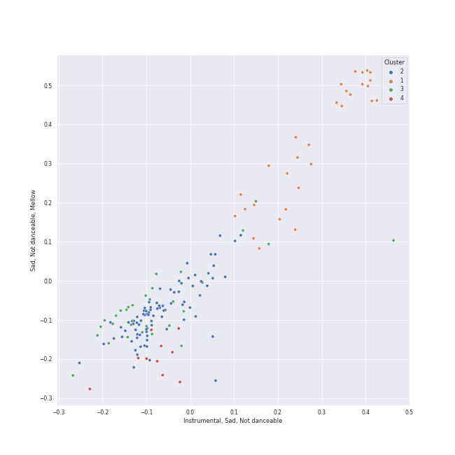

# Clusters in late romantic era

## Cluster #1

30 tracks

| Art | Track | Album | Artists | Label | Score | 💚 | 🔗 |
|:---|:---|:---|:---|:---|---:|:---|:---|
|  | String Quartet No. 1 In C Minor, Op. 51 No. 1: 2. Romanze (Poco adagio) - 2007 Recording | Brahms: String Quartets & Piano Quintet | Johannes Brahms, Emerson String Quartet | [Deutsche Grammophon (DG)](../../../../labels/deutsche_grammophon_(dg)) | 0 | | [🔗](https://open.spotify.com/track/1OpzuiZWIrKjNaqQ3efTUL) |
|  | String Quartet No. 1 In C Minor, Op. 51 No. 1: 4. Allegro - 2007 Recording | Brahms: String Quartets & Piano Quintet | Johannes Brahms, Emerson String Quartet | [Deutsche Grammophon (DG)](../../../../labels/deutsche_grammophon_(dg)) | 0 | | [🔗](https://open.spotify.com/track/3w1g36ou0iVyxgddtFZOuY) |
|  | Coppélia / Tableau 2: No. 9 Scène | Coppélia | Léo Delibes, Orchestra Victoria, Barry Wordsworth | [Australian Broadcasting Corp (ABC)](../../../../labels/australian_broadcasting_corp_(abc)) | 0 | | [🔗](https://open.spotify.com/track/0HOEqW7pRiickxkOcC3Djm) |
|  | Coppélia / Tableau 2: No. 14a Scène | Coppélia | Léo Delibes, Orchestra Victoria, Barry Wordsworth | [Australian Broadcasting Corp (ABC)](../../../../labels/australian_broadcasting_corp_(abc)) | 0 | | [🔗](https://open.spotify.com/track/1Kheqw70aaDOJQdLHXrrlq) |
|  | Coppélia / Tableau 1: No. 6 Thème slave varié | Coppélia | Léo Delibes, Orchestra Victoria, Barry Wordsworth | [Australian Broadcasting Corp (ABC)](../../../../labels/australian_broadcasting_corp_(abc)) | 0 | | [🔗](https://open.spotify.com/track/4fyXVlaZ0k834i95iZs04H) |
|  | Coppélia / Tableau 2: No. 11b Scène | Coppélia | Léo Delibes, Orchestra Victoria, Barry Wordsworth | [Australian Broadcasting Corp (ABC)](../../../../labels/australian_broadcasting_corp_(abc)) | 0 | | [🔗](https://open.spotify.com/track/5B822sKaYS1KRlY6tcO1Pn) |
|  | Coppélia / Tableau 1: No. 5 Ballade | Coppélia | Léo Delibes, Orchestra Victoria, Barry Wordsworth | [Australian Broadcasting Corp (ABC)](../../../../labels/australian_broadcasting_corp_(abc)) | 0 | | [🔗](https://open.spotify.com/track/5S1Jq4LxCPZKa0q0Tx6TIf) |
|  | Coppélia / Tableau 3: No. 20 Fête de la cloche: II. L'aurore | Coppélia | Léo Delibes, Orchestra Victoria, Barry Wordsworth | [Australian Broadcasting Corp (ABC)](../../../../labels/australian_broadcasting_corp_(abc)) | 0 | | [🔗](https://open.spotify.com/track/5gpJqY5TNtvkeZuguksKwg) |
|  | Coppélia / Tableau 2: No. 10 Scène | Coppélia | Léo Delibes, Orchestra Victoria, Barry Wordsworth | [Australian Broadcasting Corp (ABC)](../../../../labels/australian_broadcasting_corp_(abc)) | 0 | | [🔗](https://open.spotify.com/track/6EkMmjc72kp8fGLLF4mfJk) |
|  | Coppélia / Tableau 2: No. 12 Scène | Coppélia | Léo Delibes, Orchestra Victoria, Barry Wordsworth | [Australian Broadcasting Corp (ABC)](../../../../labels/australian_broadcasting_corp_(abc)) | 0 | | [🔗](https://open.spotify.com/track/7drtcpK45RJzJpxZ5CfxUr) |
## Cluster #2

85 tracks

| Art | Track | Album | Artists | Label | Score | 💚 | 🔗 |
|:---|:---|:---|:---|:---|---:|:---|:---|
|  | Brahms: Symphony No. 2 in D Major, Op. 73: I. Allegro non troppo | Brahms: The Symphonies | Johannes Brahms, Sir Simon Rattle, [Berliner Philharmoniker](../../../../artists/berliner_philharmoniker/overview.md) | [Warner Classics UK](../../../../labels/warner_classics_uk) | 0 | | [🔗](https://open.spotify.com/track/43cLCzOqxYJOZMgpxdTcRt) |
|  | Tchaikovsky: The Nutcracker, Op. 71, Act I, Scene 2: No. 9, Waltz of the Snowflakes | Tchaikovsky: The Nutcracker | [Pyotr Ilyich Tchaikovsky](../../../../artists/pyotr_ilyich_tchaikovsky/overview.md), Sir Simon Rattle, [Berliner Philharmoniker](../../../../artists/berliner_philharmoniker/overview.md), Libera | [Warner Classics](../../../../labels/warner_classics) | 0 | | [🔗](https://open.spotify.com/track/5jXB4p8pQu9Ahv10ibU8fG) |
|  | Tchaikovsky: The Nutcracker, Op. 71, Act I, Scene 1: No. 5, Scene and Grandfather Dance | Tchaikovsky: The Nutcracker | [Pyotr Ilyich Tchaikovsky](../../../../artists/pyotr_ilyich_tchaikovsky/overview.md), Sir Simon Rattle, [Berliner Philharmoniker](../../../../artists/berliner_philharmoniker/overview.md) | [Warner Classics](../../../../labels/warner_classics) | 0 | | [🔗](https://open.spotify.com/track/7JUbQkbvdPnNqS8RdcfCtO) |
|  | Swan Lake Suite, Op. 20a: II. Waltz | Mussorgsky: Pictures At An Exhibition | [Pyotr Ilyich Tchaikovsky](../../../../artists/pyotr_ilyich_tchaikovsky/overview.md), Wiener Philharmoniker, Gustavo Dudamel | [Deutsche Grammophon (DG)](../../../../labels/deutsche_grammophon_(dg)) | 0 | | [🔗](https://open.spotify.com/track/0NOiSayyUFYnLllkTdFa1k) |
|  | Tchaikovsky: Swan Lake, Op. 20, Act 4: No. 27, Dance of the Little Swans | Tchaikovsky: Swan Lake | [Pyotr Ilyich Tchaikovsky](../../../../artists/pyotr_ilyich_tchaikovsky/overview.md), André Previn, [London Symphony Orchestra](../../../../artists/london_symphony_orchestra/overview.md) | [Warner Classics](../../../../labels/warner_classics) | 0 | | [🔗](https://open.spotify.com/track/4Qu4tyMIENrOgUSGGbJhb4) |
|  | Tchaikovsky: Swan Lake, Op. 20, Act 1: No. 7, Sujet | Tchaikovsky: Swan Lake | [Pyotr Ilyich Tchaikovsky](../../../../artists/pyotr_ilyich_tchaikovsky/overview.md), André Previn, [London Symphony Orchestra](../../../../artists/london_symphony_orchestra/overview.md) | [Warner Classics](../../../../labels/warner_classics) | 0 | | [🔗](https://open.spotify.com/track/5vQefc73LyaFwEPPcVspar) |
|  | Tchaikovsky: Swan Lake, Op. 20, Act 1: No. 2, Waltz | Tchaikovsky: Swan Lake | [Pyotr Ilyich Tchaikovsky](../../../../artists/pyotr_ilyich_tchaikovsky/overview.md), André Previn, [London Symphony Orchestra](../../../../artists/london_symphony_orchestra/overview.md) | [Warner Classics](../../../../labels/warner_classics) | 0 | | [🔗](https://open.spotify.com/track/7gwqbiFgNU1VddAK2XO5Wr) |
|  | Tchaikovsky: Swan Lake, Op. 20, Act 3, Appendix I: Pas de deux | Tchaikovsky: Swan Lake | [Pyotr Ilyich Tchaikovsky](../../../../artists/pyotr_ilyich_tchaikovsky/overview.md), André Previn, [London Symphony Orchestra](../../../../artists/london_symphony_orchestra/overview.md) | [Warner Classics](../../../../labels/warner_classics) | 0 | | [🔗](https://open.spotify.com/track/7hh18ES59TNeJnBSVJKtmV) |
|  | String Quintet No. 3, Op. 97: I. Allegro non tanto | Dvorak: String Quintet, Op. 97 & String Sextet, Op. 48 | Antonín Dvořák, [Jerusalem Quartet](../../../../artists/jerusalem_quartet/overview.md), Veronika Hagen | [harmonia mundi](../../../../labels/harmonia_mundi) | 0 | | [🔗](https://open.spotify.com/track/3SwpQeSrLjp6mgUee0HYwG) |
|  | String Sextet, Op. 48: I. Allegro moderato | Dvorak: String Quintet, Op. 97 & String Sextet, Op. 48 | Antonín Dvořák, [Jerusalem Quartet](../../../../artists/jerusalem_quartet/overview.md), Veronika Hagen, Gary Hoffman | [harmonia mundi](../../../../labels/harmonia_mundi) | 0 | | [🔗](https://open.spotify.com/track/5Bn7rXQJDCOkR50kqlkkfv) |
## Cluster #3

30 tracks

| Art | Track | Album | Artists | Label | Score | 💚 | 🔗 |
|:---|:---|:---|:---|:---|---:|:---|:---|
|  | Piano Quintet in F minor, Op. 34: 3. Scherzo (Allegro) | Brahms: String Quartets & Piano Quintet | Johannes Brahms, Emerson String Quartet, Leon Fleisher | [Deutsche Grammophon (DG)](../../../../labels/deutsche_grammophon_(dg)) | 0 | | [🔗](https://open.spotify.com/track/2MyRikj06G0oWicSQdpEXm) |
|  | Coppélia / Tableau 3: No. 20 Fête de la cloche: IX. Galop final | Coppélia | Léo Delibes, Orchestra Victoria, Barry Wordsworth | [Australian Broadcasting Corp (ABC)](../../../../labels/australian_broadcasting_corp_(abc)) | 0 | | [🔗](https://open.spotify.com/track/20UXWmEsvrpI1z0lwcZBcB) |
|  | La Source / Act 2: No. 22 Mazurka | Coppélia | Léo Delibes, Orchestra Victoria, Barry Wordsworth | [Australian Broadcasting Corp (ABC)](../../../../labels/australian_broadcasting_corp_(abc)) | 0 | | [🔗](https://open.spotify.com/track/5At5yLByyzyylVctmoejzj) |
|  | Coppélia / Tableau 1: No. 7 Czárdás | Coppélia | Léo Delibes, Orchestra Victoria, Barry Wordsworth | [Australian Broadcasting Corp (ABC)](../../../../labels/australian_broadcasting_corp_(abc)) | 0 | | [🔗](https://open.spotify.com/track/6vLPBxUABNX1kYP3Eb6uNV) |
|  | Coppélia / Tableau 3: No. 20 Fête de la cloche: IX. Galop final - Alternative Version | Coppélia | Léo Delibes, Orchestra Victoria, Barry Wordsworth | [Australian Broadcasting Corp (ABC)](../../../../labels/australian_broadcasting_corp_(abc)) | 0 | | [🔗](https://open.spotify.com/track/7DStwi0QEkCKh1cZ58x4pC) |
|  | Tchaikovsky: The Nutcracker, Op. 71, Act I, Scene 1: No. 2, March | Tchaikovsky: The Nutcracker | [Pyotr Ilyich Tchaikovsky](../../../../artists/pyotr_ilyich_tchaikovsky/overview.md), Sir Simon Rattle, [Berliner Philharmoniker](../../../../artists/berliner_philharmoniker/overview.md) | [Warner Classics](../../../../labels/warner_classics) | 0 | | [🔗](https://open.spotify.com/track/06am46cX3Z6YlSsg0TyVHA) |
|  | Tchaikovsky: The Nutcracker, Op. 71, Act II: No. 14b, Pas de deux. Variation I "Tarantella" | Tchaikovsky: The Nutcracker | [Pyotr Ilyich Tchaikovsky](../../../../artists/pyotr_ilyich_tchaikovsky/overview.md), Sir Simon Rattle, [Berliner Philharmoniker](../../../../artists/berliner_philharmoniker/overview.md) | [Warner Classics](../../../../labels/warner_classics) | 0 | | [🔗](https://open.spotify.com/track/0HbpdVxJlwPDRqsY3TmkTQ) |
|  | Tchaikovsky: The Nutcracker, Op. 71, Act II: No. 14d, Pas de deux. Coda | Tchaikovsky: The Nutcracker | [Pyotr Ilyich Tchaikovsky](../../../../artists/pyotr_ilyich_tchaikovsky/overview.md), Sir Simon Rattle, [Berliner Philharmoniker](../../../../artists/berliner_philharmoniker/overview.md) | [Warner Classics](../../../../labels/warner_classics) | 0 | | [🔗](https://open.spotify.com/track/3aBr1vgaFH9QlMIXQBx9f5) |
|  | Tchaikovsky: Swan Lake, Op. 20, Act 3: No. 22, Neapolitan Dance | Tchaikovsky: Swan Lake | [Pyotr Ilyich Tchaikovsky](../../../../artists/pyotr_ilyich_tchaikovsky/overview.md), André Previn, [London Symphony Orchestra](../../../../artists/london_symphony_orchestra/overview.md) | [Warner Classics](../../../../labels/warner_classics) | 0 | | [🔗](https://open.spotify.com/track/4nj7bhtLH0R1xW0mybToZx) |
|  | Tchaikovsky: Swan Lake, Op. 20, Act 1: No. 8, Dance with Goblets | Tchaikovsky: Swan Lake | [Pyotr Ilyich Tchaikovsky](../../../../artists/pyotr_ilyich_tchaikovsky/overview.md), André Previn, [London Symphony Orchestra](../../../../artists/london_symphony_orchestra/overview.md) | [Warner Classics](../../../../labels/warner_classics) | 0 | | [🔗](https://open.spotify.com/track/5k4h8TjWUws1995o3eOW0X) |
## Cluster #4

10 tracks

| Art | Track | Album | Artists | Label | Score | 💚 | 🔗 |
|:---|:---|:---|:---|:---|---:|:---|:---|
|  | Coppélia / Tableau 2: No. 18 Scène (Final) | Coppélia | Léo Delibes, Orchestra Victoria, Barry Wordsworth | [Australian Broadcasting Corp (ABC)](../../../../labels/australian_broadcasting_corp_(abc)) | 0 | | [🔗](https://open.spotify.com/track/7ejaR6mxKlc6Yh8tzUKWRn) |
|  | Tchaikovsky: Swan Lake, Op. 20, Act 3: No. 18, Scene. Allegro - Allegro giusto | Tchaikovsky: Swan Lake | [Pyotr Ilyich Tchaikovsky](../../../../artists/pyotr_ilyich_tchaikovsky/overview.md), André Previn, [London Symphony Orchestra](../../../../artists/london_symphony_orchestra/overview.md) | [Warner Classics](../../../../labels/warner_classics) | 0 | | [🔗](https://open.spotify.com/track/2YzKk2NMadveUJ5gSMmo5W) |
|  | Tchaikovsky: Swan Lake, Op. 20, Act 2: No. 11, Scene. Allegro moderato - Moderato - Allegro vivo | Tchaikovsky: Swan Lake | [Pyotr Ilyich Tchaikovsky](../../../../artists/pyotr_ilyich_tchaikovsky/overview.md), André Previn, [London Symphony Orchestra](../../../../artists/london_symphony_orchestra/overview.md) | [Warner Classics](../../../../labels/warner_classics) | 0 | | [🔗](https://open.spotify.com/track/5ItPxeVnRy31PwbheRAZyw) |
|  | Tchaikovsky: Swan Lake, Op. 20, Act 4: No. 28, Scene. Allegro agitato | Tchaikovsky: Swan Lake | [Pyotr Ilyich Tchaikovsky](../../../../artists/pyotr_ilyich_tchaikovsky/overview.md), André Previn, [London Symphony Orchestra](../../../../artists/london_symphony_orchestra/overview.md) | [Warner Classics](../../../../labels/warner_classics) | 0 | | [🔗](https://open.spotify.com/track/5jg3xtvH1ZkLO2XtaefaSF) |
|  | Pictures at an Exhibition (Orch. Ravel): VI. Samuel Goldenberg und Schmuÿle | Mussorgsky: Pictures At An Exhibition | Modest Mussorgsky, Wiener Philharmoniker, Gustavo Dudamel | [Deutsche Grammophon (DG)](../../../../labels/deutsche_grammophon_(dg)) | 0 | | [🔗](https://open.spotify.com/track/0z8qN0Tn05N5wzFjDaHmMJ) |
|  | Pictures at an Exhibition (Orch. Ravel): VIIIb. Cum mortuis in lingua mortua | Mussorgsky: Pictures At An Exhibition | Modest Mussorgsky, Wiener Philharmoniker, Gustavo Dudamel | [Deutsche Grammophon (DG)](../../../../labels/deutsche_grammophon_(dg)) | 0 | | [🔗](https://open.spotify.com/track/3vUKiu1KUSA0a790dw8l2o) |
|  | Pictures at an Exhibition (Orch. Ravel): IX. The Hut on Chicken's Legs | Mussorgsky: Pictures At An Exhibition | Modest Mussorgsky, Wiener Philharmoniker, Gustavo Dudamel | [Deutsche Grammophon (DG)](../../../../labels/deutsche_grammophon_(dg)) | 0 | | [🔗](https://open.spotify.com/track/4Eev1NK5U0fm4ZADOu9KKq) |
|  | Pictures at an Exhibition (Orch. Ravel): I. Gnomus | Mussorgsky: Pictures At An Exhibition | Modest Mussorgsky, Wiener Philharmoniker, Gustavo Dudamel | [Deutsche Grammophon (DG)](../../../../labels/deutsche_grammophon_(dg)) | 0 | | [🔗](https://open.spotify.com/track/4gKrD45pSLOwGndDsmtisn) |
|  | Pictures at an Exhibition (Orch. Ravel): VII. The Market at Limoges | Mussorgsky: Pictures At An Exhibition | Modest Mussorgsky, Wiener Philharmoniker, Gustavo Dudamel | [Deutsche Grammophon (DG)](../../../../labels/deutsche_grammophon_(dg)) | 0 | | [🔗](https://open.spotify.com/track/5mWkqRpS1V5DHMW9VGJ4Dr) |
|  | Night on Bald Mountain | Mussorgsky: Pictures At An Exhibition | Modest Mussorgsky, Wiener Philharmoniker, Gustavo Dudamel | [Deutsche Grammophon (DG)](../../../../labels/deutsche_grammophon_(dg)) | 0 | | [🔗](https://open.spotify.com/track/6ejFaLGH7F4J5tnaYirs2G) |