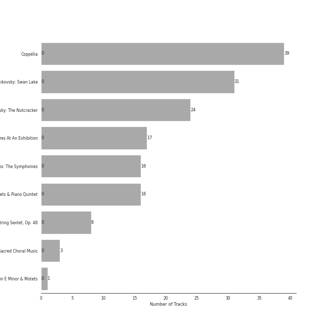

# late romantic era

155 songs

[See Track Features](audio_features.md)

[See Clusters](clusters/overview.md)

## Top Artists

| Art | Rank | Tracks | 💚 | Artist | 🔗 |
|:---|---:|---:|---:|:---|:---|
|  | 429 | 59 | 0 | [Pyotr Ilyich Tchaikovsky](../../artists/pyotr_ilyich_tchaikovsky/overview.md) | [🔗](https://open.spotify.com/artist/3MKCzCnpzw3TjUYs2v7vDA) |
|  | 429 | 40 | 0 | [Berliner Philharmoniker](../../artists/berliner_philharmoniker/overview.md) | [🔗](https://open.spotify.com/artist/6uRJnvQ3f8whVnmeoecv5Z) |
|  | 429 | 40 | 0 | Sir Simon Rattle | [🔗](https://open.spotify.com/artist/4GQwgdcDQwqtcHICjUNndp) |
|  | 429 | 39 | 0 | Barry Wordsworth | [🔗](https://open.spotify.com/artist/5sjJnaI3YhaO8KylpJk3gN) |
|  | 429 | 39 | 0 | Orchestra Victoria | [🔗](https://open.spotify.com/artist/1bnC6eJzCumTgAB7tG1118) |
|  | 429 | 39 | 0 | Léo Delibes | [🔗](https://open.spotify.com/artist/1M9AXZkNPdOd1IPEsQsXnT) |
|  | 429 | 32 | 0 | Johannes Brahms | [🔗](https://open.spotify.com/artist/5wTAi7QkpP6kp8a54lmTOq) |
|  | 429 | 31 | 0 | [London Symphony Orchestra](../../artists/london_symphony_orchestra/overview.md) | [🔗](https://open.spotify.com/artist/5yxyJsFanEAuwSM5kOuZKc) |
|  | 429 | 31 | 0 | André Previn | [🔗](https://open.spotify.com/artist/2tfWguHr2nj4e8KXLKciVq) |
|  | 429 | 17 | 0 | Gustavo Dudamel | [🔗](https://open.spotify.com/artist/0cxXnDhpgxcMMkKddhORHY) |

See all 24 artists

| Art | Rank | Tracks | 💚 | Artist | 🔗 |
|:---|---:|---:|---:|:---|:---|
|  | 429 | 17 | 0 | Wiener Philharmoniker | [🔗](https://open.spotify.com/artist/003f4bk13c6Q3gAUXv7dGJ) |
|  | 429 | 16 | 0 | Emerson String Quartet | [🔗](https://open.spotify.com/artist/4IBl8k6ZsBagsI5zRjyXH7) |
|  | 429 | 16 | 0 | Modest Mussorgsky | [🔗](https://open.spotify.com/artist/284mnx33IWcymQEpMxyfHl) |
|  | 144 | 8 | 0 | [Jerusalem Quartet](../../artists/jerusalem_quartet/overview.md) | [🔗](https://open.spotify.com/artist/7AnE8Jpu1vxLeXcs6OKYHE) |
|  | 429 | 8 | 0 | Antonín Dvořák | [🔗](https://open.spotify.com/artist/6n7nd5iceYpXVwcx8VPpxF) |
|  | 429 | 8 | 0 | Veronika Hagen | [🔗](https://open.spotify.com/artist/3ijxXTal6hr7byhqZDdHsP) |
|  | 429 | 4 | 0 | Leon Fleisher | [🔗](https://open.spotify.com/artist/6ncNdxBc8zVWMOF7nJ5Pgy) |
|  | 429 | 3 | 0 | Gary Hoffman | [🔗](https://open.spotify.com/artist/7qcRbaIYVuOERS3KmB71GH) |
|  | 429 | 3 | 0 | NDR Chor | [🔗](https://open.spotify.com/artist/7hMAA1N5j1Ynb49NIWO7HV) |
|  | 429 | 3 | 0 | Philipp Ahmann | [🔗](https://open.spotify.com/artist/309coOGhdzqXdIRwJH1xUo) |
|  | 429 | 1 | 0 | Philippe Herreweghe | [🔗](https://open.spotify.com/artist/2ozcTa5tl8qhSbhJKM60I5) |
|  | 429 | 1 | 0 | Anton Bruckner | [🔗](https://open.spotify.com/artist/2bM3j1JQWBkmzuoZKu4zj2) |
|  | 429 | 1 | 0 | Libera | [🔗](https://open.spotify.com/artist/235C4ktJ2aGIyqaBlXyg7e) |
|  | 429 | 1 | 0 | Collegium Vocale Gent | [🔗](https://open.spotify.com/artist/17BdLN9q8RRQQqyklLwac1) |

## Most and least listened tracks
| Rank | ​ | Most listened tracks | Rank | ​​ | Least listened tracks |
|---:|:---|:---|---:|:---|:---|
| 964 |  | Brahms: Symphony No. 3 in F Major, Op. 90: III. Poco allegretto | 964 |  | String Quartet No. 3 In B Flat, Op. 67: 2. Andante |
| 964 |  | Coppélia / Tableau 1: No. 4 Scène | 964 |  | Brahms: Symphony No. 4 in E Minor, Op. 98: III. Allegro giocoso |
| 964 |  | [Tchaikovsky: The Nutcracker, Op. 71, Act I: No. 2, March](../../artists/pyotr_ilyich_tchaikovsky/overview.md) | 964 |  | Coppélia / Tableau 3: No. 20 Fête de la cloche: V. L'hymen (Noce villageoise) |
| 964 |  | Coppélia / Tableau 3: No. 20 Fête de la cloche: IV. Le travail (La fileuse) | 964 |  | [Tchaikovsky: The Nutcracker, Op. 71, Act II: No. 12c, Divertissement. Tea, Chinese Dance](../../artists/pyotr_ilyich_tchaikovsky/overview.md) |
| 964 |  | Pictures at an Exhibition (Orch. Ravel): Promenade III | 964 |  | [Tchaikovsky: Swan Lake, Op. 20, Act 3, Appendix I: Pas de deux](../../artists/pyotr_ilyich_tchaikovsky/overview.md) |
| 964 |  | [Tchaikovsky: The Nutcracker, Op. 71, Act 2: No. 13, Waltz of the Flowers](../../artists/pyotr_ilyich_tchaikovsky/overview.md) | 964 |  | [Tchaikovsky: The Nutcracker, Op. 71, Act I, Scene 1: No. 1, Decoration of the Christmas Tree](../../artists/pyotr_ilyich_tchaikovsky/overview.md) |
| 964 |  | [Tchaikovsky: Swan Lake, Op. 20, Act 3, Appendix II: No. 20a, Russian Dance](../../artists/pyotr_ilyich_tchaikovsky/overview.md) | 964 |  | [Tchaikovsky: Swan Lake, Op. 20, Act 1: No. 2, Waltz](../../artists/pyotr_ilyich_tchaikovsky/overview.md) |
| 964 |  | Coppélia / Tableau 2: No. 9 Scène | 964 |  | Pictures at an Exhibition (Orch. Ravel): Promenade II |
| 964 |  | [Tchaikovsky: The Nutcracker, Op. 71, Act II: No. 14b, Pas de deux. Variation I "Tarantella"](../../artists/pyotr_ilyich_tchaikovsky/overview.md) | 964 |  | Coppélia / Tableau 2: No. 18 Scène (Final) |
| 964 |  | Pictures at an Exhibition (Orch. Ravel): X. The Great Gate of Kiev | 964 |  | Coppélia / Tableau 2: No. 12 Scène |

## Top Albums

| Art | Rank | Tracks | 💚 | Album | Release Date | 🔗 |
|:---|---:|---:|---:|:---|:---|:---|
|  | 637 | 39 | 0 | Coppélia | 2018-07-06 | [🔗](https://open.spotify.com/album/7jKT8NC2XfAs9RFKsrGz2p) |
|  | 637 | 31 | 0 | Tchaikovsky: Swan Lake | 1976-01-01 | [🔗](https://open.spotify.com/album/7dVA06E7AP7P7VzPyNxQVO) |
|  | 637 | 24 | 0 | Tchaikovsky: The Nutcracker | 2010-10-11 | [🔗](https://open.spotify.com/album/54Awn36ryf55PkZyOR4iwQ) |
|  | 637 | 17 | 0 | Mussorgsky: Pictures At An Exhibition | 2016-12-02 | [🔗](https://open.spotify.com/album/1b2aoeaYZZBWmJoavOQhnd) |
|  | 637 | 16 | 0 | Brahms: The Symphonies | 2009-09-07 | [🔗](https://open.spotify.com/album/2dL2qDsg6teV1cueLxCRa1) |
|  | 637 | 16 | 0 | Brahms: String Quartets & Piano Quintet | 2007-01-01 | [🔗](https://open.spotify.com/album/5nZ5ePGoQZGt1MbGphwqph) |
|  | 637 | 8 | 0 | Dvorak: String Quintet, Op. 97 & String Sextet, Op. 48 | 2018-01-19 | [🔗](https://open.spotify.com/album/02nUFvsdTaekp2QQalnE3N) |
|  | 637 | 3 | 0 | Tchaikovsky: Sacred Choral Music | 2016-07-01 | [🔗](https://open.spotify.com/album/4udN7bCLaa8zCnaIvoxzOB) |
|  | 637 | 1 | 0 | Bruckner: Mass in E Minor & Motets | 2002 | [🔗](https://open.spotify.com/album/13eAUvw0Ga3BBFsf6oxF46) |

## Top Record Labels

| Tracks | 💚 | Label |
|---:|---:|:---|
| 55 | 0 | [Warner Classics](../../labels/warner_classics/overview.md) |
| 39 | 0 | [Australian Broadcasting Corp (ABC)](../../labels/australian_broadcasting_corp_(abc)/overview.md) |
| 33 | 0 | [Deutsche Grammophon (DG)](../../labels/deutsche_grammophon_(dg)/overview.md) |
| 16 | 0 | [Warner Classics UK](../../labels/warner_classics_uk/overview.md) |
| 9 | 0 | [harmonia mundi](../../labels/harmonia_mundi/overview.md) |
| 3 | 0 | Carus |

## Years

| ​ | 10 newest albums | ​​ | 10 oldest albums |
|:---|:---|:---|:---|
|  | Coppélia (2018-07-06) |  | Tchaikovsky: Swan Lake (1976-01-01) |
|  | Dvorak: String Quintet, Op. 97 & String Sextet, Op. 48 (2018-01-19) |  | Bruckner: Mass in E Minor & Motets (2002) |
|  | Mussorgsky: Pictures At An Exhibition (2016-12-02) |  | Brahms: String Quartets & Piano Quintet (2007-01-01) |
|  | Tchaikovsky: Sacred Choral Music (2016-07-01) |  | Brahms: The Symphonies (2009-09-07) |
|  | Tchaikovsky: The Nutcracker (2010-10-11) |  | Tchaikovsky: The Nutcracker (2010-10-11) |
|  | Brahms: The Symphonies (2009-09-07) |  | Tchaikovsky: Sacred Choral Music (2016-07-01) |
|  | Brahms: String Quartets & Piano Quintet (2007-01-01) |  | Mussorgsky: Pictures At An Exhibition (2016-12-02) |
|  | Bruckner: Mass in E Minor & Motets (2002) |  | Dvorak: String Quintet, Op. 97 & String Sextet, Op. 48 (2018-01-19) |
|  | Tchaikovsky: Swan Lake (1976-01-01) |  | Coppélia (2018-07-06) |

