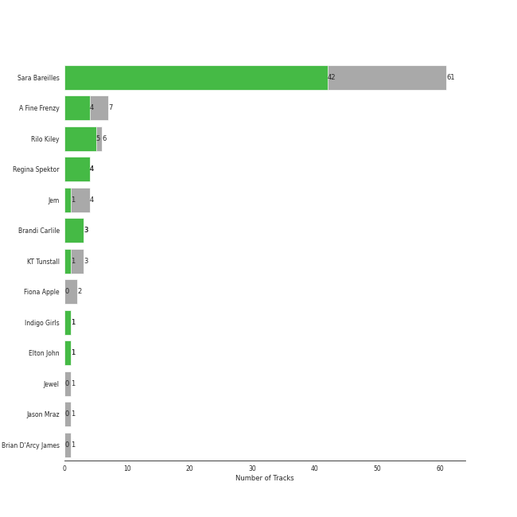
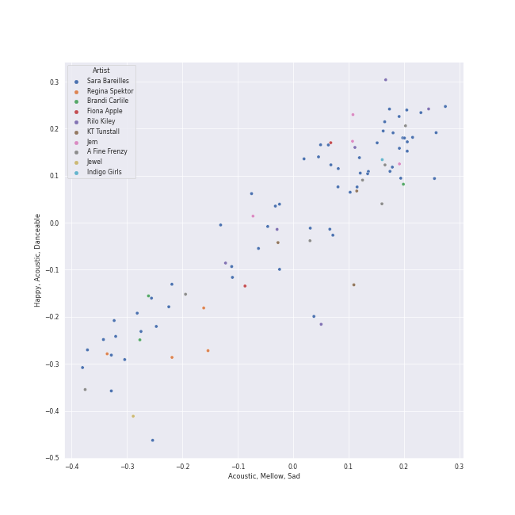

# lilith

[89 songs](lilith_tracks.md)

## Top Artists

See all 10 artists

|   Number of Tracks | Art                                                                                              | Artist                                         | 🔗                                                           |
|-------------------:|:-------------------------------------------------------------------------------------------------|:-----------------------------------------------|:------------------------------------------------------------|
|                 59 |  | [Sara Bareilles](../artists/sara_bareilles.md) | [🔗](https://open.spotify.com/artist/2Sqr0DXoaYABbjBo9HaMkM) |
|                  7 |  | Erin McCarley                                  | [🔗](https://open.spotify.com/artist/6Y4bCmUNPDKqc7dHkVvgim) |
|                  7 |  | A Fine Frenzy                                  | [🔗](https://open.spotify.com/artist/5dTYaRzOn4rXGBLH052EeQ) |
|                  6 |  | Rilo Kiley                                     | [🔗](https://open.spotify.com/artist/2cevwbv7ISD92VMNLYLHZA) |
|                  4 |  | Regina Spektor                                 | [🔗](https://open.spotify.com/artist/3z6Gk257P9jNcZbBXJNX5i) |
|                  3 |  | KT Tunstall                                    | [🔗](https://open.spotify.com/artist/5zzrJD2jXrE9dZ1AklRFcL) |
|                  1 |  | Jason Mraz                                     | [🔗](https://open.spotify.com/artist/4phGZZrJZRo4ElhRtViYdl) |
|                  1 |  | Bonnie Raitt                                   | [🔗](https://open.spotify.com/artist/4KDyYWR7IpxZ7xrdYbKrqY) |
|                  1 |  | Fiona Apple                                    | [🔗](https://open.spotify.com/artist/3g2kUQ6tHLLbmkV7T4GPtL) |
|                  1 |  | Brandi Carlile                                 | [🔗](https://open.spotify.com/artist/2sG4zTOLvjKG1PSoOyf5Ej) |

## Top Albums

See all 20 albums

|   Number of Tracks | Art                                                                                              | Album                                       | Release Date   | 🔗                                                          |
|-------------------:|:-------------------------------------------------------------------------------------------------|:--------------------------------------------|:---------------|:-----------------------------------------------------------|
|                 13 |  | Kaleidoscope Heart                          | 2010-09-07     | [🔗](https://open.spotify.com/album/627ukPRwYxyBREHxBq0vGJ) |
|                 12 |  | The Blessed Unrest                          | 2013-07-16     | [🔗](https://open.spotify.com/album/7lpbyGc4fHsQkBTsfWVBhp) |
|                 12 |  | Little Voice                                | 2007-07-03     | [🔗](https://open.spotify.com/album/2Z9WUERfMjOgQ6ze9TcGbF) |
|                 10 |  | Amidst the Chaos (Bonus Version)            | 2019-05-10     | [🔗](https://open.spotify.com/album/5x2sDapUIdq0qk1ezff3gm) |
|                  7 |  | Love, Save The Empty                        | 2009           | [🔗](https://open.spotify.com/album/1tF7625TFqvfzMbappj1pQ) |
|                  6 |  | What's Inside: Songs from Waitress          | 2015-11-06     | [🔗](https://open.spotify.com/album/1s6codM2ZAB008t9GTyaEk) |
|                  5 |  | Once Upon Another Time                      | 2012-05-22     | [🔗](https://open.spotify.com/album/1PrqYZJRzGNf8AsSOraxnZ) |
|                  3 |  | One Cell In The Sea                         | 2007           | [🔗](https://open.spotify.com/album/0Ot7MEgreG2R93aN42M9iK) |
|                  3 |  | More Adventurous (U.S. Release)             | 2004-07-27     | [🔗](https://open.spotify.com/album/4n36X2GMJ84BKh9D9zMRVI) |
|                  3 |  | Eye To The Telescope                        | 2005-01-01     | [🔗](https://open.spotify.com/album/3j70PDKieTWQAwas3bPHRZ) |
|                  3 |  | Bomb In A Birdcage                          | 2009-01-01     | [🔗](https://open.spotify.com/album/07IV5RxLvAUeZbcPm4zOzn) |
|                  3 |  | Begin to Hope                               | 2006-06-13     | [🔗](https://open.spotify.com/album/4L4tcx3itXbtx5kuchKhFE) |
|                  2 |  | The Execution Of All Things                 | 2002-10-01     | [🔗](https://open.spotify.com/album/23EqcK0ZR1ravQaEsGpQyH) |
|                  1 |  | Under The Blacklight (Standard Version)     | 2007-08-20     | [🔗](https://open.spotify.com/album/2f9RsTZpsYMLRVZBtW7En8) |
|                  1 |  | Tidal                                       | 1996-07-23     | [🔗](https://open.spotify.com/album/5gVBXH8MT6zfdRkjp7qT18) |
|                  1 |  | PINES                                       | 2012-01-01     | [🔗](https://open.spotify.com/album/1876e9QcHkJ3Hgo4NqKXBN) |
|                  1 |  | Luck Of The Draw                            | 1991-01-01     | [🔗](https://open.spotify.com/album/6blrkOZ0VmkhYPjfoD7eqf) |
|                  1 |  | Far                                         | 2009-06-09     | [🔗](https://open.spotify.com/album/5t0lQDPLF22wmWCtSZkIVv) |
|                  1 |  | Brave Enough: Live at the Variety Playhouse | 2013-10-22     | [🔗](https://open.spotify.com/album/7L4ZgnQqEhCEsV9GnMeXtE) |
|                  1 |  | Bear Creek                                  | 2012-06-01     | [🔗](https://open.spotify.com/album/5b8YTIrc88vdnfRguZqvVE) |

## Top Record Labels

See all 13 labels

|   Number of Tracks | Label                                           |
|-------------------:|:------------------------------------------------|
|                 59 | [Epic](../labels/epic.md)                       |
|                 10 | [Virgin Records](../labels/virgin_records.md)   |
|                  7 | Universal (MT)                                  |
|                  4 | [Warner Records](../labels/warner_records.md)   |
|                  4 | Sire                                            |
|                  3 | Relentless                                      |
|                  3 | Brute                                           |
|                  3 | Beaute                                          |
|                  2 | Saddle Creek                                    |
|                  1 | Work                                            |
|                  1 | [Columbia](../labels/columbia.md)               |
|                  1 | Clean Slate                                     |
|                  1 | [Capitol Records](../labels/capitol_records.md) |

## Audio Features

| 10 most Danceable tracks        | 10 least Danceable tracks    |
|:--------------------------------|:-----------------------------|
| Fidelity                        | Stay                         |
| On the Radio                    | Gravity                      |
| Little Black Dress              | Once Upon Another Time       |
| Eden                            | Shadowboxer                  |
| Electric Twist                  | Does He Love You?            |
| Black Horse And The Cherry Tree | City                         |
| Blow Away                       | Come Round Soon              |
| I Choose You                    | Bluebird                     |
| Silver Lining                   | Bright Lights and Cityscapes |
| I Didn't Plan It                | Everything Changes           |

| 10 most Energetic tracks    | 10 least Energetic tracks                                                         |
|:----------------------------|:----------------------------------------------------------------------------------|
| Hello/Goodbye               | Kaleidoscope Heart                                                                |
| Bad Idea (feat. Jason Mraz) | Goodbye Yellow Brick Road - Live at the Variety Playhouse, Atlanta, GA - May 2013 |
| Morningside                 | I Can't Make You Love Me                                                          |
| SleepWalking                | Manhattan                                                                         |
| Let The Rain                | Bright Lights and Cityscapes                                                      |
| Love, Save The Empty        | Samson                                                                            |
| Accidntel Deth              | Bluebird                                                                          |
| Bobble Head                 | Once Upon Another Time                                                            |
| Fairytale                   | Almost Lover                                                                      |
| Brave                       | What's Inside                                                                     |

| 10 most Speechy tracks          | 10 least Speechy tracks   |
|:--------------------------------|:--------------------------|
| Electric Twist                  | Satellite Call            |
| Accidntel Deth                  | Whisper                   |
| Opening Up                      | Pitter-Pat                |
| Kaleidoscope Heart              | Machine Gun               |
| Come Round Soon                 | Orpheus                   |
| Bad Idea (feat. Jason Mraz)     | Sweet As Whole            |
| Black Horse And The Cherry Tree | Breathe Again             |
| Fire                            | Islands                   |
| Eden                            | Silver Lining             |
| Little Black Dress              | The Light                 |

| 10 most Acoustic tracks                                                           | 10 least Acoustic tracks    |
|:----------------------------------------------------------------------------------|:----------------------------|
| Bright Lights and Cityscapes                                                      | Portions for Foxes          |
| Manhattan                                                                         | Now Is The Start            |
| Goodbye Yellow Brick Road - Live at the Variety Playhouse, Atlanta, GA - May 2013 | Brave                       |
| Almost Lover                                                                      | The Execution Of All Things |
| Bluebird                                                                          | Many the Miles              |
| What's Inside                                                                     | Vegas                       |
| Once Upon Another Time                                                            | Bad Idea (feat. Jason Mraz) |
| Samson                                                                            | Wicked Love                 |
| Miss Simone                                                                       | Gonna Get Over You          |
| I Can't Make You Love Me                                                          | Love Song                   |

| 10 most Instrumental tracks   | 10 least Instrumental tracks   |
|:------------------------------|:-------------------------------|
| A Better Son/Daughter         | Say You're Sorry               |
| The Execution Of All Things   | Gravity                        |
| Now Is The Start              | Sweet As Whole                 |
| Satellite Call                | Once Upon Another Time         |
| Islands                       | Hercules                       |
| Armor                         | Little Black Dress             |
| Portions for Foxes            | If I Can't Have You            |
| Breathe Again                 | Everything Changes             |
| Miss Simone                   | Bad Idea (feat. Jason Mraz)    |
| The Light                     | Opening Up                     |

| 10 most Live tracks                                                               | 10 least Live tracks        |
|:----------------------------------------------------------------------------------|:----------------------------|
| Goodbye Yellow Brick Road - Live at the Variety Playhouse, Atlanta, GA - May 2013 | Uncharted                   |
| Ashes And Wine                                                                    | Brave                       |
| Fire                                                                              | Eden                        |
| Black Horse And The Cherry Tree                                                   | Chasing The Sun             |
| Let The Rain                                                                      | King of Anything            |
| It's Not That Easy                                                                | The Execution Of All Things |
| Pitter-Pat                                                                        | The Light                   |
| SleepWalking                                                                      | On the Radio                |
| Not Alone                                                                         | Islands                     |
| If I Can't Have You                                                               | Blow Away                   |

| 10 most Happy tracks            | 10 least Happy tracks                                                             |
|:--------------------------------|:----------------------------------------------------------------------------------|
| I Choose You                    | A Better Son/Daughter                                                             |
| Black Horse And The Cherry Tree | Once Upon Another Time                                                            |
| Blow Away                       | Islands                                                                           |
| Electric Twist                  | Everything Changes                                                                |
| Say You're Sorry                | I Can't Make You Love Me                                                          |
| King of Anything                | Bluebird                                                                          |
| Lie To Me                       | What's Inside                                                                     |
| I Didn't Plan It                | Almost Lover                                                                      |
| Bad Idea (feat. Jason Mraz)     | Goodbye Yellow Brick Road - Live at the Variety Playhouse, Atlanta, GA - May 2013 |
| Morningside                     | She Used To Be Mine                                                               |
