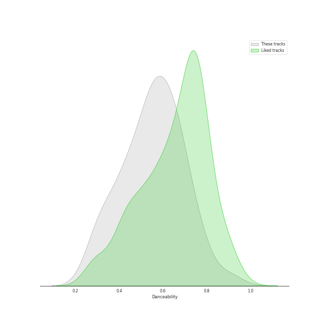
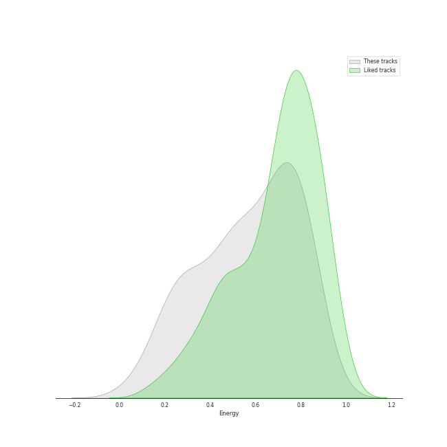
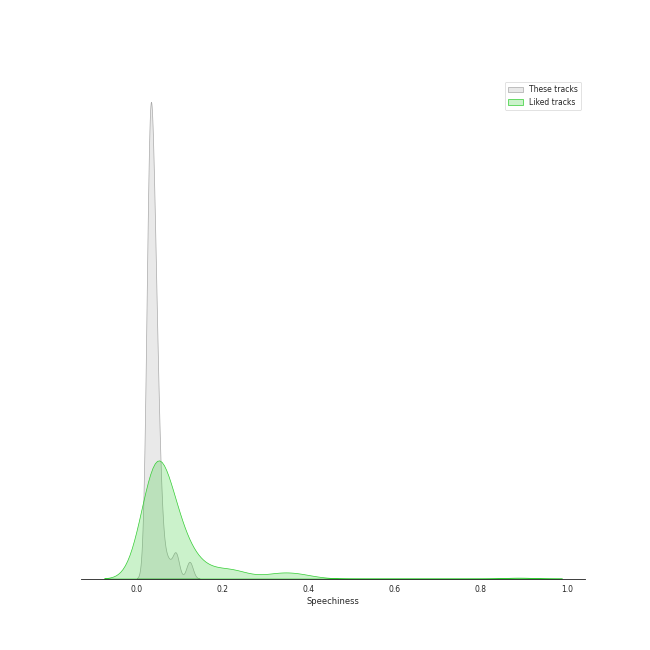
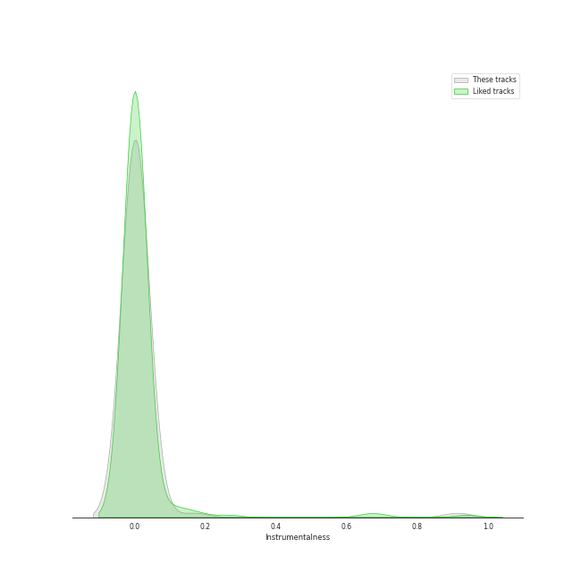
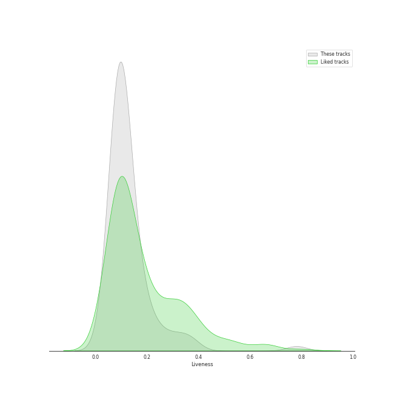
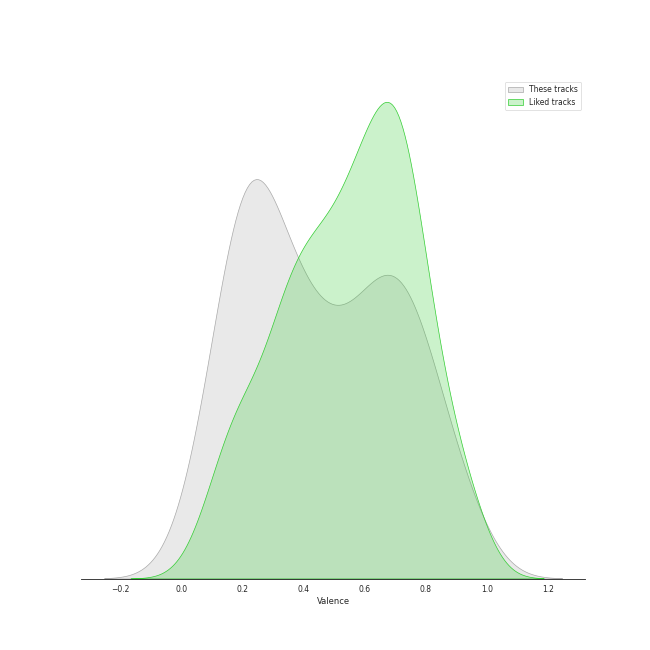
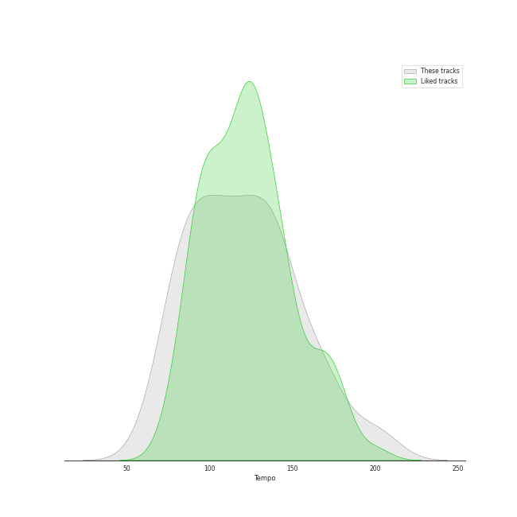

# Audio Features for lilith

## Danceability

| 10 most Danceable tracks | 10 least Danceable tracks |
|:---|:---|
| Fidelity (0.923) | Stay (0.262) |
| On the Radio (0.88) | Gravity (0.27) |
| Little Black Dress (0.787) | Once Upon Another Time (0.275) |
| Eden (0.776) | Shadowboxer (0.298) |
| Electric Twist (0.773) | Does He Love You? (0.317) |
| Black Horse And The Cherry Tree (0.748) | City (0.319) |
| Blow Away (0.747) | Come Round Soon (0.338) |
| I Choose You (0.731) | Bluebird (0.34) |
| They (0.728) | Bright Lights and Cityscapes (0.343) |
| Silver Lining (0.709) | Everything Changes (0.348) |

## Energy

| 10 most Energetic tracks | 10 least Energetic tracks |
|:---|:---|
| Bad Idea (feat. Jason Mraz) (0.889) | Kaleidoscope Heart (0.0516) |
| Morningside (0.88) | Goodbye Yellow Brick Road - Live at the Variety Playhouse, Atlanta, GA - May 2013 (0.114) |
| Let The Rain (0.873) | Manhattan (0.168) |
| Accidntel Deth (0.863) | Bright Lights and Cityscapes (0.184) |
| Fairytale (0.857) | Samson (0.193) |
| Brave (0.836) | Bluebird (0.203) |
| You Oughta Know (0.831) | Once Upon Another Time (0.216) |
| Love On the Rocks (0.819) | Almost Lover (0.24) |
| Come Round Soon (0.819) | What's Inside (0.242) |
| They (0.817) | Basket Case (0.273) |

## Speechiness

| 10 most Speechy tracks | 10 least Speechy tracks |
|:---|:---|
| Electric Twist (0.125) | Satellite Call (0.0241) |
| Accidntel Deth (0.123) | Come On Closer (0.025) |
| Opening Up (0.0936) | Whisper (0.0252) |
| Kaleidoscope Heart (0.0927) | Machine Gun (0.0268) |
| Come Round Soon (0.0776) | Orpheus (0.0269) |
| Bad Idea (feat. Jason Mraz) (0.0704) | Sweet As Whole (0.0275) |
| Black Horse And The Cherry Tree (0.0641) | Breathe Again (0.0278) |
| Fire (0.057) | Stay Now (0.0281) |
| Eden (0.0562) | Islands (0.0284) |
| You Oughta Know (0.0557) | Missing You (0.0285) |

## Acousticness

| 10 most Acoustic tracks | 10 least Acoustic tracks |
|:---|:---|
| Bright Lights and Cityscapes (0.977) | Portions for Foxes (0.000938) |
| Manhattan (0.972) | Now Is The Start (0.00124) |
| Goodbye Yellow Brick Road - Live at the Variety Playhouse, Atlanta, GA - May 2013 (0.959) | Brave (0.00502) |
| Almost Lover (0.947) | The Execution Of All Things (0.00556) |
| Bluebird (0.933) | Many the Miles (0.00796) |
| What's Inside (0.919) | Missing You (0.00859) |
| Once Upon Another Time (0.896) | Vegas (0.00881) |
| Samson (0.862) | Come On Closer (0.0144) |
| Miss Simone (0.859) | Bad Idea (feat. Jason Mraz) (0.0168) |
| Gravity (0.834) | Wicked Love (0.0178) |

## Instrumentalness

| 10 most Instrumental tracks | 10 least Instrumental tracks |
|:---|:---|
| A Better Son/Daughter (0.91) | Say You're Sorry (0.0) |
| The Execution Of All Things (0.158) | Sweet As Whole (0.0) |
| Now Is The Start (0.0353) | You Oughta Know (0.0) |
| Satellite Call (0.0318) | Shadowboxer (0.0) |
| Islands (0.0261) | Come Round Soon (0.0) |
| Armor (0.0145) | Black Horse And The Cherry Tree (0.0) |
| Portions for Foxes (0.0121) | Kaleidoscope Heart (0.0) |
| Breathe Again (0.00655) | Everything Changes (0.0) |
| Miss Simone (0.00407) | Vegas (0.0) |
| The Light (0.00375) | Hercules (0.0) |

## Liveness

| 10 most Live tracks | 10 least Live tracks |
|:---|:---|
| Goodbye Yellow Brick Road - Live at the Variety Playhouse, Atlanta, GA - May 2013 (0.781) | Uncharted (0.0343) |
| You Oughta Know (0.736) | Brave (0.0425) |
| Ashes And Wine (0.379) | Eden (0.0456) |
| Fire (0.363) | Chasing The Sun (0.0497) |
| Black Horse And The Cherry Tree (0.34) | King of Anything (0.0574) |
| Let The Rain (0.297) | Be Be Your Love (0.0667) |
| Not Alone (0.256) | The Execution Of All Things (0.0686) |
| If I Can't Have You (0.254) | The Light (0.0691) |
| Once Upon Another Time (0.231) | On the Radio (0.0693) |
| Say You're Sorry (0.212) | Islands (0.0699) |

## Valence

| 10 most Happy tracks | 10 least Happy tracks |
|:---|:---|
| I Choose You (0.947) | A Better Son/Daughter (0.0473) |
| Come On Closer (0.928) | Once Upon Another Time (0.0551) |
| Black Horse And The Cherry Tree (0.917) | Islands (0.0863) |
| Blow Away (0.891) | Everything Changes (0.0983) |
| Electric Twist (0.858) | Missing You (0.108) |
| Say You're Sorry (0.846) | Bluebird (0.161) |
| King of Anything (0.81) | What's Inside (0.162) |
| Lie To Me (0.795) | Almost Lover (0.167) |
| I Didn't Plan It (0.787) | Goodbye Yellow Brick Road - Live at the Variety Playhouse, Atlanta, GA - May 2013 (0.168) |
| Bad Idea (feat. Jason Mraz) (0.787) | Eet (0.172) |

## Tempo

| 10 most Fast tracks | 10 least Fast tracks |
|:---|:---|
| Uncharted (203.962) | What's Inside (63.218) |
| Brave (185.063) | Bright Lights and Cityscapes (66.509) |
| Wicked Love (179.894) | Shadowboxer (74.131) |
| Say You're Sorry (170.016) | Come Round Soon (74.751) |
| Breathe Again (169.677) | Basket Case (76.196) |
| Gravity (168.964) | Armor (78.784) |
| Bad Idea (feat. Jason Mraz) (167.936) | Does He Love You? (78.983) |
| Eyes on You (165.97) | Vegas (79.999) |
| Chasing The Sun (164.989) | Islands (80.023) |
| Opening Up (161.071) | Other Side Of The World (80.039) |
