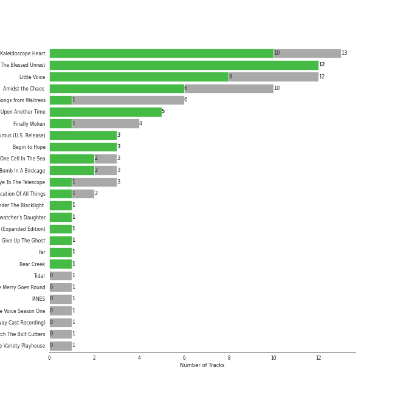
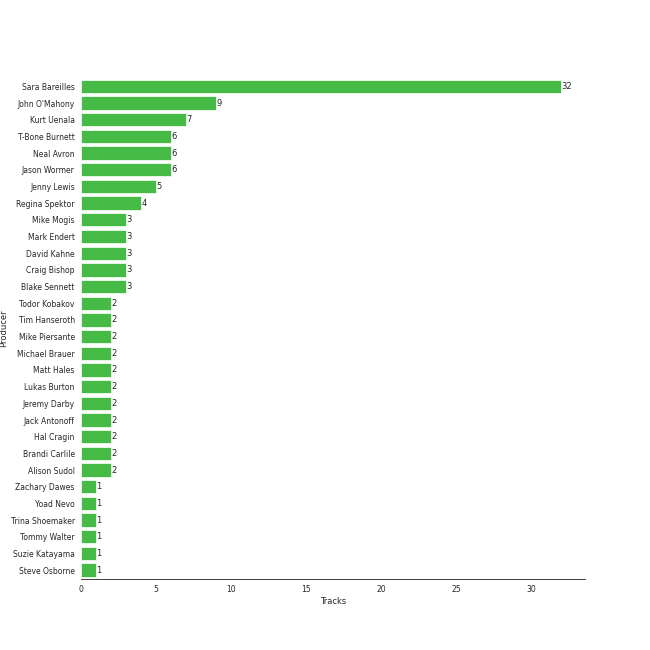
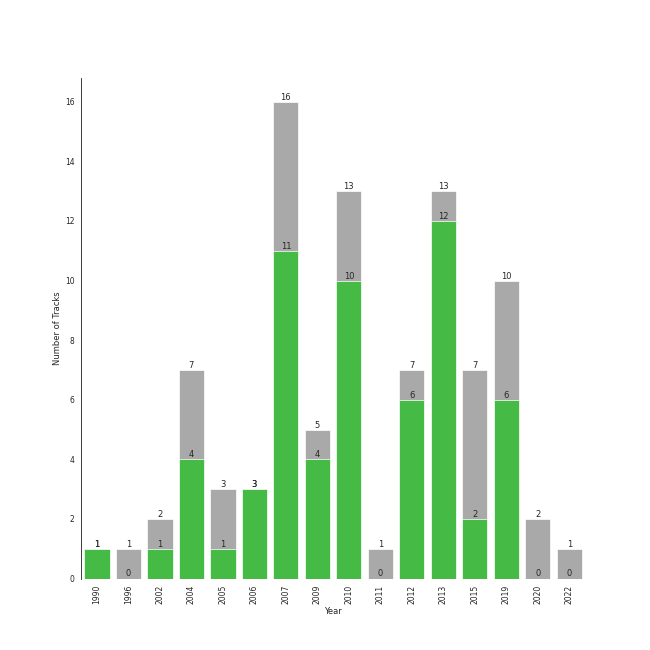

# lilith

91 songs

[See Track Features](audio_features.md)

[See Clusters](clusters/overview.md)

## Top Artists

| Art | Rank | Tracks | 💚 | Artist | 🔗 |
|:---|---:|---:|---:|:---|:---|
|  | 24 | 61 | 42 | [Sara Bareilles](../../artists/sara_bareilles/overview.md) | [🔗](https://open.spotify.com/artist/2Sqr0DXoaYABbjBo9HaMkM) |
|  | 198 | 6 | 5 | [Rilo Kiley](../../artists/rilo_kiley/overview.md) | [🔗](https://open.spotify.com/artist/2cevwbv7ISD92VMNLYLHZA) |
|  | 309 | 7 | 4 | A Fine Frenzy | [🔗](https://open.spotify.com/artist/5dTYaRzOn4rXGBLH052EeQ) |
|  | 429 | 4 | 4 | Regina Spektor | [🔗](https://open.spotify.com/artist/3z6Gk257P9jNcZbBXJNX5i) |
|  | 429 | 3 | 3 | Brandi Carlile | [🔗](https://open.spotify.com/artist/2sG4zTOLvjKG1PSoOyf5Ej) |
|  | 314 | 4 | 1 | Jem | [🔗](https://open.spotify.com/artist/4v4xuH9VypORYabMnhPLt1) |
|  | 429 | 3 | 1 | KT Tunstall | [🔗](https://open.spotify.com/artist/5zzrJD2jXrE9dZ1AklRFcL) |
|  | 429 | 1 | 1 | Indigo Girls | [🔗](https://open.spotify.com/artist/4wM29TDTr3HI0qFY3KoSFG) |
|  | 208 | 1 | 1 | Elton John | [🔗](https://open.spotify.com/artist/3PhoLpVuITZKcymswpck5b) |
|  | 367 | 2 | 0 | Fiona Apple | [🔗](https://open.spotify.com/artist/3g2kUQ6tHLLbmkV7T4GPtL) |

See all 12 artists

| Art | Rank | Tracks | 💚 | Artist | 🔗 |
|:---|---:|---:|---:|:---|:---|
|  | 377 | 1 | 0 | Jason Mraz | [🔗](https://open.spotify.com/artist/4phGZZrJZRo4ElhRtViYdl) |
|  | 429 | 1 | 0 | Brian D'Arcy James | [🔗](https://open.spotify.com/artist/3oYQrBzEQNpxnjWXP54B4n) |

## Most and least listened tracks
| Rank | ​ | Most listened tracks | Rank | ​​ | Least listened tracks |
|---:|:---|:---|---:|:---|:---|
| 271 |  | [Machine Gun](../../artists/sara_bareilles/overview.md) | 971 |  | [Uncharted](../../artists/sara_bareilles/overview.md) |
| 338 |  | [Silver Lining](../../artists/rilo_kiley/overview.md) | 971 |  | [Accidntel Deth](../../artists/rilo_kiley/overview.md) |
| 352 |  | [Between the Lines](../../artists/sara_bareilles/overview.md) | 971 |  | [Once Upon Another Time](../../artists/sara_bareilles/overview.md) |
| 362 |  | [Many the Miles](../../artists/sara_bareilles/overview.md) | 971 |  | [City](../../artists/sara_bareilles/overview.md) |
| 398 |  | [Fairytale](../../artists/sara_bareilles/overview.md) | 971 |  | [Bright Lights and Cityscapes](../../artists/sara_bareilles/overview.md) |
| 462 |  | [Lie To Me](../../artists/sara_bareilles/overview.md) | 971 |  | [Basket Case](../../artists/sara_bareilles/overview.md) |
| 520 |  | [I Choose You](../../artists/sara_bareilles/overview.md) | 971 |  | I Want You To Love Me |
| 603 |  | [Manhattan](../../artists/sara_bareilles/overview.md) | 971 |  | Stay Now |
| 605 |  | Electric Twist | 971 |  | [Chasing The Sun](../../artists/sara_bareilles/overview.md) |
| 608 |  | They | 971 |  | That Wasn't Me |

## Top Albums

| Art | Rank | Tracks | 💚 | Album | Release Date | 🔗 |
|:---|---:|---:|---:|:---|:---|:---|
|  | 190 | 13 | 10 | Kaleidoscope Heart | 2010-09-07 | [🔗](https://open.spotify.com/album/627ukPRwYxyBREHxBq0vGJ) |
|  | 262 | 12 | 12 | The Blessed Unrest | 2013-07-16 | [🔗](https://open.spotify.com/album/7lpbyGc4fHsQkBTsfWVBhp) |
|  | 176 | 12 | 8 | Little Voice | 2007-07-03 | [🔗](https://open.spotify.com/album/2Z9WUERfMjOgQ6ze9TcGbF) |
|  | 485 | 10 | 6 | Amidst the Chaos (Bonus Version) | 2019-05-10 | [🔗](https://open.spotify.com/album/5x2sDapUIdq0qk1ezff3gm) |
|  | 642 | 6 | 1 | What's Inside: Songs from Waitress | 2015-11-06 | [🔗](https://open.spotify.com/album/1s6codM2ZAB008t9GTyaEk) |
|  | 326 | 5 | 5 | Once Upon Another Time | 2012-05-22 | [🔗](https://open.spotify.com/album/1PrqYZJRzGNf8AsSOraxnZ) |
|  | 408 | 4 | 1 | Finally Woken | 2004-03-23 | [🔗](https://open.spotify.com/album/3RkjNfqqlhWyLrRp0ZCARU) |
|  | 642 | 3 | 3 | More Adventurous (U.S. Release) | 2004-07-27 | [🔗](https://open.spotify.com/album/4n36X2GMJ84BKh9D9zMRVI) |
|  | 642 | 3 | 3 | Begin to Hope | 2006-06-13 | [🔗](https://open.spotify.com/album/4L4tcx3itXbtx5kuchKhFE) |
|  | 631 | 3 | 2 | One Cell In The Sea | 2007 | [🔗](https://open.spotify.com/album/0Ot7MEgreG2R93aN42M9iK) |

See all 25 albums

| Art | Rank | Tracks | 💚 | Album | Release Date | 🔗 |
|:---|---:|---:|---:|:---|:---|:---|
|  | 403 | 3 | 2 | Bomb In A Birdcage | 2009-01-01 | [🔗](https://open.spotify.com/album/07IV5RxLvAUeZbcPm4zOzn) |
|  | 642 | 3 | 1 | Eye To The Telescope | 2005-01-01 | [🔗](https://open.spotify.com/album/3j70PDKieTWQAwas3bPHRZ) |
|  | 642 | 2 | 1 | The Execution Of All Things | 2002-10-01 | [🔗](https://open.spotify.com/album/1aFyAtSRxLNzSTGwHMRvWj) |
|  | 239 | 1 | 1 | Under The Blacklight (Standard Version) | 2007-08-20 | [🔗](https://open.spotify.com/album/2f9RsTZpsYMLRVZBtW7En8) |
|  | 642 | 1 | 1 | The Firewatcher's Daughter | 2015-03-06 | [🔗](https://open.spotify.com/album/5ZpxRLVRkCZ2BXXW1KYbTB) |
|  | 642 | 1 | 1 | Nomads · Indians · Saints (Expanded Edition) | 1990-09-21 | [🔗](https://open.spotify.com/album/1KpKdn4HLsD9OAN6GEYAIb) |
|  | 642 | 1 | 1 | Give Up The Ghost | 2009-10-05 | [🔗](https://open.spotify.com/album/1NhFksWs1Nsz6wQI8ysTkv) |
|  | 642 | 1 | 1 | Far | 2009-06-19 | [🔗](https://open.spotify.com/album/5t0lQDPLF22wmWCtSZkIVv) |
|  | 642 | 1 | 1 | Bear Creek | 2012-06-04 | [🔗](https://open.spotify.com/album/5b8YTIrc88vdnfRguZqvVE) |
|  | 642 | 1 | 0 | Tidal | 1996-07-23 | [🔗](https://open.spotify.com/album/5gVBXH8MT6zfdRkjp7qT18) |
|  | 642 | 1 | 0 | PINES | 2012-01-01 | [🔗](https://open.spotify.com/album/1876e9QcHkJ3Hgo4NqKXBN) |
|  | 642 | 1 | 0 | More Love - Songs from Little Voice Season One | 2020-09-04 | [🔗](https://open.spotify.com/album/52fzvqGSm991mT6pBgAS6g) |
|  | 278 | 1 | 0 | Into The Woods - 2022 Broadway Cast Recording | 2022-09-30 | [🔗](https://open.spotify.com/album/5z6BFXI711HbSAXDjgOAHE) |
|  | 642 | 1 | 0 | Fetch The Bolt Cutters | 2020-04-17 | [🔗](https://open.spotify.com/album/0fO1KemWL2uCCQmM22iKlj) |
|  | 642 | 1 | 0 | Brave Enough: Live at the Variety Playhouse | 2013-10-22 | [🔗](https://open.spotify.com/album/7L4ZgnQqEhCEsV9GnMeXtE) |

## Top Record Labels

| Tracks | 💚 | Label |
|---:|---:|:---|
| 62 | 43 | [Epic](../../labels/epic/overview.md) |
| 10 | 5 | [Virgin Records](../../labels/virgin_records/overview.md) |
| 4 | 4 | [Warner Records](../../labels/warner_records/overview.md) |
| 4 | 4 | Sire |
| 3 | 3 | Brute |
| 3 | 3 | Beaute |
| 5 | 2 | ATO Records |
| 2 | 2 | [Columbia](../../labels/columbia/overview.md) |
| 3 | 1 | Relentless |
| 2 | 1 | Saddle Creek |

See all 13 labels

| Tracks | 💚 | Label |
|---:|---:|:---|
| 1 | 0 | Work |
| 1 | 0 | [Craft Recordings](../../labels/craft_recordings/overview.md) |
| 1 | 0 | Clean Slate |

## Top Producers

| Art | Producer | Tracks | Credit Types |
|:---|:---|---:|:---|
|  | [Sara Bareilles](../../artists/sara_bareilles/overview.md) | 32 | Lyricist, Songwriter, Producer |
| | John O'Mahony | 9 | Producer |
| | Kurt Uenala | 7 | Producer |
| | Neal Avron | 6 | Arranger, Producer |
| | Jason Wormer | 6 | Producer |
| | T-Bone Burnett | 6 | Producer |
| | Jenny Lewis | 5 | Lyricist, Songwriter |
|  | Regina Spektor | 4 | Lyricist, Producer, Songwriter |
| | Mark Endert | 3 | Producer |
| | Blake Sennett | 3 | Songwriter |

View all

| Art | Producer | Tracks | Credit Types |
|:---|:---|---:|:---|
| | Craig Bishop | 3 | Producer |
| | David Kahne | 3 | Producer |
| | Mike Mogis | 3 | Producer |
| | Hal Cragin | 2 | Producer, Songwriter |
| | Michael Brauer | 2 | Producer |
| | Todor Kobakov | 2 | Arranger |
| | [Jack Antonoff](../../producers/jack_antonoff/overview.md) | 2 | Songwriter |
| | Lukas Burton | 2 | Producer, Songwriter |
|  | Brandi Carlile | 2 | Songwriter, Lyricist, Producer |
| | Tim Hanseroth | 2 | Songwriter, Producer |
| | Alison Sudol | 2 | Lyricist, Songwriter |
| | Matt Hales | 2 | Songwriter |
| | Mike Piersante | 2 | Producer |
| | Jeremy Darby | 2 | Producer |
|  | [Johann Sebastian Bach](../../artists/johann_sebastian_bach/overview.md) | 1 | Songwriter |
| | Javier Dunn | 1 | Songwriter |
| | Joseph Lorge | 1 | Producer |
| | Jason Lader | 1 | Producer |
| | Jimmy Tamborello | 1 | Producer |
| | Jason Hall | 1 | Producer |
|  | Jem | 1 | Producer, Songwriter |
| | Eric Rosse | 1 | Producer |
| | Tommy Walter | 1 | Producer |
| | Pete Harper | 1 | Songwriter |
| | Aaron Sterling | 1 | Songwriter |
| | Steve Osborne | 1 | Producer |
|  | Emily King | 1 | Songwriter |
| | Ben Boyer | 1 | Songwriter |
|  | [Rilo Kiley](../../artists/rilo_kiley/overview.md) | 1 | Producer |
| | Jason Blynn | 1 | Songwriter |
| | Nate Walcott | 1 | Arranger |
| | Ren Swan | 1 | Producer |
| | Phil Hanseroth | 1 | Producer |
| | Patrick Benson | 1 | Producer |
| | Adam Hawkins | 1 | Producer |
| | Justin Tranter | 1 | Songwriter |
| | Trina Shoemaker | 1 | Producer |
| | Mike Elizondo | 1 | Producer |
| | Yoad Nevo | 1 | Producer |
| | Carl Lieberman, RPT | 1 | Producer |
| | Jon Ervie | 1 | Producer |
| | Lori McKenna | 1 | Songwriter |
| | Mark Trombino | 1 | Producer |
| | Hal Y. Burton | 1 | Producer |
|  | KT Tunstall | 1 | Lyricist, Songwriter |
| | Andy Green | 1 | Producer |
| | Jay Joyce | 1 | Producer |
| | Zachary Dawes | 1 | Producer |
| | Scott Litt | 1 | Producer |
| | Suzie Katayama | 1 | Arranger |
| | GE-OLOGY | 1 | Producer, Songwriter |
| | Bruno Ellingham | 1 | Producer |
| | Mike Anderson | 1 | Songwriter |
| | Emily Saliers | 1 | Lyricist, Songwriter |
| | Sam Farrar | 1 | Songwriter |

## Years

| ​ | 10 newest albums | ​​ | 10 oldest albums |
|:---|:---|:---|:---|
|  | Into The Woods - 2022 Broadway Cast Recording (2022-09-30) |  | Nomads · Indians · Saints (Expanded Edition) (1990-09-21) |
|  | More Love - Songs from Little Voice Season One (2020-09-04) |  | Tidal (1996-07-23) |
|  | Fetch The Bolt Cutters (2020-04-17) |  | The Execution Of All Things (2002-10-01) |
|  | Amidst the Chaos (Bonus Version) (2019-05-10) |  | Finally Woken (2004-03-23) |
|  | What's Inside: Songs from Waitress (2015-11-06) |  | More Adventurous (U.S. Release) (2004-07-27) |
|  | The Firewatcher's Daughter (2015-03-06) |  | Eye To The Telescope (2005-01-01) |
|  | Brave Enough: Live at the Variety Playhouse (2013-10-22) |  | Begin to Hope (2006-06-13) |
|  | The Blessed Unrest (2013-07-16) |  | One Cell In The Sea (2007) |
|  | Bear Creek (2012-06-04) |  | Little Voice (2007-07-03) |
|  | Once Upon Another Time (2012-05-22) |  | Under The Blacklight (Standard Version) (2007-08-20) |

