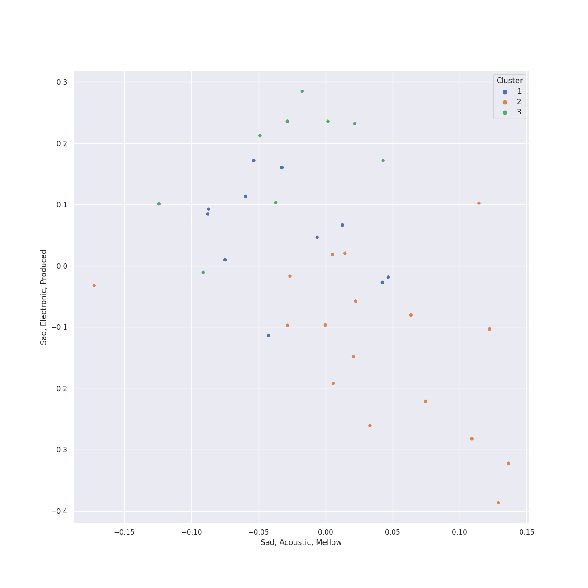

# Clusters in lounge

## Cluster #1

11 tracks

| Art | Track | Album | Artists | Label | Rank | 💚 | 🔗 |
|:---|:---|:---|:---|:---|---:|:---|:---|
|  | The Way You Look Tonight | Days Of Wine And Roses, Moon River And Other Academy Award Winners | [Frank Sinatra](../../../../artists/frank_sinatra/overview.md) | FRANK SINATRA DIGITAL REPRISE | nan | 💚 | [🔗](https://open.spotify.com/track/0elmUoU7eMPwZX1Mw1MnQo) |
|  | Come Fly With Me - Remastered 1998 | Come Fly With Me (Expanded Edition) | [Frank Sinatra](../../../../artists/frank_sinatra/overview.md) | [Capitol Records](../../../../labels/capitol_records) | nan | | [🔗](https://open.spotify.com/track/4hHbeIIKO5Y5uLyIEbY9Gn) |
|  | Let It Snow! Let It Snow! Let It Snow! (with The B. Swanson Quartet) | Christmas Songs by Sinatra | [Frank Sinatra](../../../../artists/frank_sinatra/overview.md), B. Swanson Quartet | [Columbia](../../../../labels/columbia), [Legacy](../../../../labels/legacy) | nan | | [🔗](https://open.spotify.com/track/4kKdvXD0ez7jp1296JmAts) |
|  | Frosty the Snowman (feat. The Puppini Sisters) | Christmas (Deluxe Special Edition) | [Michael Bublé](../../../../artists/michael_bublé/overview.md), The Puppini Sisters | [143](../../../../labels/143), [Reprise](../../../../labels/reprise) | 573 | | [🔗](https://open.spotify.com/track/27TJMHguLnuW3y2UPqXeC2) |
|  | I Wan'na Be Like You (The Monkey Song) | The Jungle Book | Louis Prima, Phil Harris, Bruce Reitherman | [Walt Disney Records](../../../../labels/walt_disney_records) | nan | | [🔗](https://open.spotify.com/track/2EeVPGHq2I7fjeDfT6LEYX) |
|  | Rockin' Around The Christmas Tree | Merry Christmas From Brenda Lee | Brenda Lee | MCA Nashville | 645 | | [🔗](https://open.spotify.com/track/2EjXfH91m7f8HiJN1yQg97) |
|  | L-O-V-E - 2000 Remaster | Romance | Nat King Cole | [UME - Global Clearing House](../../../../labels/ume_-_global_clearing_house) | nan | | [🔗](https://open.spotify.com/track/6OHPdG4tYiHRPUHwf68nRU) |
|  | Let It Snow! Let It Snow! Let It Snow! | A Winter Romance | Dean Martin | [Capitol Records](../../../../labels/capitol_records) | 712 | | [🔗](https://open.spotify.com/track/2uFaJJtFpPDc5Pa95XzTvg) |
|  | Baby, It's Cold Outside | A Winter Romance | Dean Martin | [Capitol Records](../../../../labels/capitol_records) | nan | | [🔗](https://open.spotify.com/track/4MrfQL4TYQXJBlZYpAHTuE) |
|  | It's Beginning To Look Like Christmas | White Christmas | Bing Crosby | [Geffen](../../../../labels/geffen) | 674 | | [🔗](https://open.spotify.com/track/44mYhOVgerj2qPjkGDVA6n) |
## Cluster #2

17 tracks

| Art | Track | Album | Artists | Label | Rank | 💚 | 🔗 |
|:---|:---|:---|:---|:---|---:|:---|:---|
|  | I've Got You Under My Skin - Remastered 1998 | Songs For Swingin' Lovers! (Remastered) | [Frank Sinatra](../../../../artists/frank_sinatra/overview.md) | [Capitol Records](../../../../labels/capitol_records) | nan | | [🔗](https://open.spotify.com/track/3aEJMh1cXKEjgh52claxQp) |
|  | That's Life | That's Life | [Frank Sinatra](../../../../artists/frank_sinatra/overview.md) | FRANK SINATRA DIGITAL REPRISE | nan | | [🔗](https://open.spotify.com/track/4FmCUATNIarCQh72JYdvnm) |
|  | Fly Me To The Moon - 2008 Remastered | Nothing But The Best (2008 Remastered) | [Frank Sinatra](../../../../artists/frank_sinatra/overview.md), Count Basie | FRANK SINATRA DIGITAL REPRISE | nan | | [🔗](https://open.spotify.com/track/7FXj7Qg3YorUxdrzvrcY25) |
|  | Call Me Irresponsible | Call Me Irresponsible | [Michael Bublé](../../../../artists/michael_bublé/overview.md) | [143](../../../../labels/143), [Reprise](../../../../labels/reprise) | nan | | [🔗](https://open.spotify.com/track/25RxZw46RfYpVWMIrIeZDS) |
|  | Everything | Call Me Irresponsible | [Michael Bublé](../../../../artists/michael_bublé/overview.md) | [143](../../../../labels/143), [Reprise](../../../../labels/reprise) | nan | 💚 | [🔗](https://open.spotify.com/track/4T6HLdP6OcAtqC6tGnQelG) |
|  | The Best Is yet to Come | Call Me Irresponsible | [Michael Bublé](../../../../artists/michael_bublé/overview.md) | [143](../../../../labels/143), [Reprise](../../../../labels/reprise) | nan | | [🔗](https://open.spotify.com/track/56t3m0lqE6zU1EfgFOPqst) |
|  | The Way You Look Tonight | Michael Bublé | [Michael Bublé](../../../../artists/michael_bublé/overview.md) | [143](../../../../labels/143), [Reprise](../../../../labels/reprise) | nan | | [🔗](https://open.spotify.com/track/4YGlRLe6TeBRiXFByBqldf) |
|  | Feeling Good | It's Time | [Michael Bublé](../../../../artists/michael_bublé/overview.md) | [143](../../../../labels/143), [Reprise](../../../../labels/reprise) | 631 | 💚 | [🔗](https://open.spotify.com/track/72PwtNhRrZXNnYeRg5xQ46) |
|  | Cry Me a River | Crazy Love | [Michael Bublé](../../../../artists/michael_bublé/overview.md) | [143](../../../../labels/143), [Reprise](../../../../labels/reprise) | nan | | [🔗](https://open.spotify.com/track/5i04Jy87RLxoZszJqY3QAN) |
|  | Can't Take My Eyes off You | The Very Best of Frankie Valli & The 4 Seasons | Frankie Valli | [Rhino](../../../../labels/rhino) | nan | 💚 | [🔗](https://open.spotify.com/track/6ft9PAgNOjmZ2kFVP7LGqb) |
## Cluster #3

9 tracks

| Art | Track | Album | Artists | Label | Rank | 💚 | 🔗 |
|:---|:---|:---|:---|:---|---:|:---|:---|
|  | La vie en rose (feat. Cécile McLorin Salvant) | love (Deluxe Edition) | [Michael Bublé](../../../../artists/michael_bublé/overview.md), Cécile McLorin Salvant | [Reprise](../../../../labels/reprise) | nan | | [🔗](https://open.spotify.com/track/1QELw50Dl95LusF6uOkDqk) |
|  | Santa Baby | Christmas (Deluxe Special Edition) | [Michael Bublé](../../../../artists/michael_bublé/overview.md) | [143](../../../../labels/143), [Reprise](../../../../labels/reprise) | nan | | [🔗](https://open.spotify.com/track/3m2gfwcxl77ojJTWH3wZkb) |
|  | The Christmas Song | Christmas (Deluxe Special Edition) | [Michael Bublé](../../../../artists/michael_bublé/overview.md) | [143](../../../../labels/143), [Reprise](../../../../labels/reprise) | nan | | [🔗](https://open.spotify.com/track/4SWAozNLRfZXF25ghKqm2q) |
|  | It's Beginning to Look a Lot like Christmas | Christmas (Deluxe Special Edition) | [Michael Bublé](../../../../artists/michael_bublé/overview.md) | [143](../../../../labels/143), [Reprise](../../../../labels/reprise) | 716 | | [🔗](https://open.spotify.com/track/5a1iz510sv2W9Dt1MvFd5R) |
|  | Home | It's Time | [Michael Bublé](../../../../artists/michael_bublé/overview.md) | [143](../../../../labels/143), [Reprise](../../../../labels/reprise) | nan | 💚 | [🔗](https://open.spotify.com/track/3ISaSNZCxIzTGwQuBq6Xrr) |
|  | Can't Help Falling in Love | Come Fly with Me | [Michael Bublé](../../../../artists/michael_bublé/overview.md) | [143](../../../../labels/143), [Reprise](../../../../labels/reprise) | nan | | [🔗](https://open.spotify.com/track/7igk58Vs9uM2B0aaTUwv6F) |
|  | Nature Boy | The Nat King Cole Story | Nat King Cole | [Capitol Records](../../../../labels/capitol_records) | nan | 💚 | [🔗](https://open.spotify.com/track/2WMyu5IYgxEuCd6xgFgJrl) |
|  | The Christmas Song (Merry Christmas To You) | The Christmas Song (Expanded Edition) | Nat King Cole | CAPITOL CATALOG MKT (C92) | 293 | | [🔗](https://open.spotify.com/track/4PS1e8f2LvuTFgUs1Cn3ON) |
|  | Unforgettable | Unforgettable | Nat King Cole | CAPITOL CATALOG MKT (C92) | nan | | [🔗](https://open.spotify.com/track/648TTtYB0bH0P8Hfy0FmkL) |