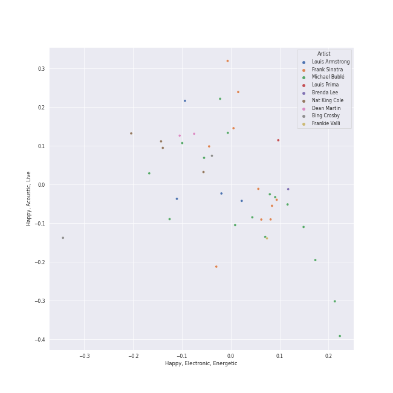
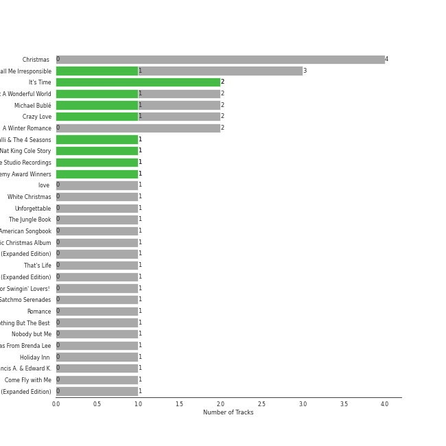
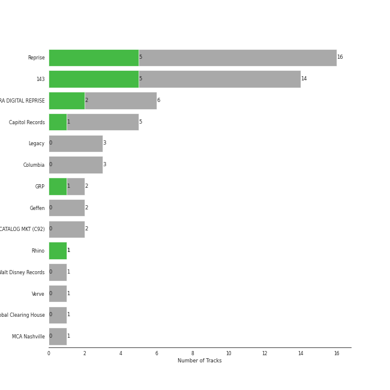
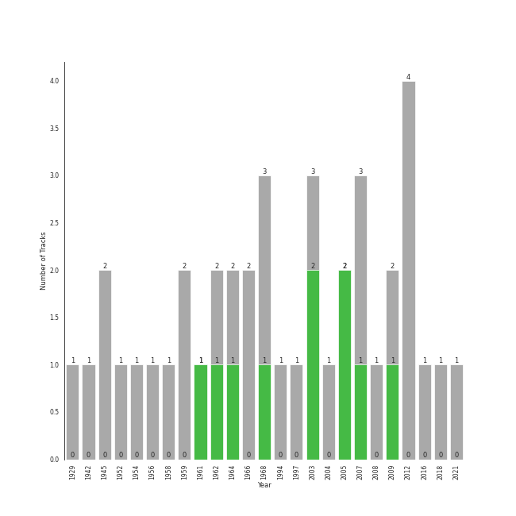

# lounge

[52 songs](tracks.md)

## Top Artists

See all 29 artists

| Art | Tracks | 💚 | Artist | 🔗 |
|:---|---:|---:|:---|:---|
|  | 16 | 5 | [Michael Bublé](../../artists/michael_bubl_) | [🔗](https://open.spotify.com/artist/1GxkXlMwML1oSg5eLPiAz3) |
|  | 10 | 2 | [Frank Sinatra](../../artists/frank_sinatra) | [🔗](https://open.spotify.com/artist/1Mxqyy3pSjf8kZZL4QVxS0) |
|  | 5 | 2 | The Jackson 5 | [🔗](https://open.spotify.com/artist/2iE18Oxc8YSumAU232n4rW) |
|  | 5 | 0 | Sophie Milman | [🔗](https://open.spotify.com/artist/19GI8I4UhSpBl8Y9XpKyT4) |
|  | 2 | 1 | Seth MacFarlane | [🔗](https://open.spotify.com/artist/79D4dipwR6scV8AN3dm7gW) |
|  | 2 | 1 | Count Basie | [🔗](https://open.spotify.com/artist/2jFZlvIea42ZvcCw4OeEdA) |
|  | 2 | 1 | [Sara Bareilles](../../artists/sara_bareilles) | [🔗](https://open.spotify.com/artist/2Sqr0DXoaYABbjBo9HaMkM) |
|  | 2 | 0 | Bing Crosby | [🔗](https://open.spotify.com/artist/6ZjFtWeHP9XN7FeKSUe80S) |
|  | 2 | 0 | Natalie Cole | [🔗](https://open.spotify.com/artist/5tTsrGPwQRWUsHR2Xf7Ke9) |
|  | 2 | 0 | Ella Fitzgerald | [🔗](https://open.spotify.com/artist/5V0MlUE1Bft0mbLlND7FJz) |
|  | 2 | 0 | Dean Martin | [🔗](https://open.spotify.com/artist/49e4v89VmlDcFCMyDv9wQ9) |
|  | 1 | 1 | Stacey Kent | [🔗](https://open.spotify.com/artist/03EYBMnqSchCMp5D9qmFXi) |
|  | 1 | 0 | Nat King Cole | [🔗](https://open.spotify.com/artist/7v4imS0moSyGdXyLgVTIV7) |
|  | 1 | 0 | The Ronettes | [🔗](https://open.spotify.com/artist/7CyeXFnOrfC1N6z4naIpgo) |
|  | 1 | 0 | John Scott Trotter & His Orchestra | [🔗](https://open.spotify.com/artist/735L650pvygCZZlPMyHqsN) |
|  | 1 | 0 | Cécile McLorin Salvant | [🔗](https://open.spotify.com/artist/6PkSULcbxFKkxdgrmPGAvn) |
|  | 1 | 0 | Meghan Trainor | [🔗](https://open.spotify.com/artist/6JL8zeS1NmiOftqZTRgdTz) |
|  | 1 | 0 | Ken Darby Singers | [🔗](https://open.spotify.com/artist/69UfPJgUmFFAVT740qGVZi) |
|  | 1 | 0 | Louis Jordan & His Tympany Five | [🔗](https://open.spotify.com/artist/62FPyLpIhmk27hBw6RHlhh) |
|  | 1 | 0 | Gene Autry | [🔗](https://open.spotify.com/artist/5ixB75BQR3ADoWQkcHQJTs) |
|  | 1 | 0 | Louis Prima | [🔗](https://open.spotify.com/artist/52lBOxCxbJg0ttXEW9CQpW) |
|  | 1 | 0 | Brenda Lee | [🔗](https://open.spotify.com/artist/4cPHsZM98sKzmV26wlwD2W) |
|  | 1 | 0 | Duke Ellington | [🔗](https://open.spotify.com/artist/4F7Q5NV6h5TSwCainz8S5A) |
|  | 1 | 0 | Bruce Reitherman | [🔗](https://open.spotify.com/artist/43HPW60tz4BMYMRnmXMagJ) |
|  | 1 | 0 | Dorothy Kirsten | [🔗](https://open.spotify.com/artist/3mMDsLh0ODpEuwpvn9sitk) |
|  | 1 | 0 | Phil Harris | [🔗](https://open.spotify.com/artist/2ISMfPtVzHc9jDDVPUEHDa) |
|  | 1 | 0 | The Puppini Sisters | [🔗](https://open.spotify.com/artist/1svaANJTE5KrG16fTGDqOs) |
|  | 1 | 0 | Eartha Kitt | [🔗](https://open.spotify.com/artist/1AwO9pWEBSBoWdEZu28XDC) |
|  | 1 | 0 | B. Swanson Quartet | [🔗](https://open.spotify.com/artist/0JXiS2FrAg3wQYJHcmZdrc) |

## Top Albums

See all 41 albums

| Art | Tracks | 💚 | Album | Release Date | 🔗 |
|:---|---:|---:|:---|:---|:---|
|  | 3 | 1 | Call Me Irresponsible | 2007-04-30 | [🔗](https://open.spotify.com/album/3h4pyWRJIB9ZyRKXChbX22) |
|  | 3 | 0 | Christmas (Deluxe Special Edition) | 2012-11-09 | [🔗](https://open.spotify.com/album/7uVimUILdzSZG4KKKWToq0) |
|  | 2 | 2 | It's Time | 2005-02-08 | [🔗](https://open.spotify.com/album/457fktVFXVwjQTl9wOLlfg) |
|  | 2 | 1 | Michael Bublé | 2003 | [🔗](https://open.spotify.com/album/3rpSksJSFdNFqk5vne8at2) |
|  | 2 | 1 | Crazy Love | 2009-10-06 | [🔗](https://open.spotify.com/album/3MXDonOIzrIrCh0HvlACyj) |
|  | 2 | 0 | Unforgettable: With Love | 1991-06-11 | [🔗](https://open.spotify.com/album/4ilUfGGQXin7hr1srDDXF0) |
|  | 2 | 0 | Take Love Easy | 2009-05-05 | [🔗](https://open.spotify.com/album/0a7Ut6OPSs8SvPDhFXL4ar) |
|  | 2 | 0 | Sophie Milman | 2004-01-01 | [🔗](https://open.spotify.com/album/2g5alWoreAp8i1Jjz2XHr4) |
|  | 2 | 0 | A Winter Romance | 1959-01-01 | [🔗](https://open.spotify.com/album/5I48ENiZiaZZSOpec6PdS5) |
|  | 1 | 1 | Third Album | 1970-09-08 | [🔗](https://open.spotify.com/album/5d6X8oegJmu9XKn9UBAswG) |
|  | 1 | 1 | Sinatra/Basie: The Complete Reprise Studio Recordings | 1962-12-10 | [🔗](https://open.spotify.com/album/2NCtCObbmJoJnplsR5mLAl) |
|  | 1 | 1 | Music Is Better Than Words | 2011-01-01 | [🔗](https://open.spotify.com/album/6VojJdbXviFkMuemAQ2Ivo) |
|  | 1 | 1 | Diana Ross Presents The Jackson 5 | 1969-12-18 | [🔗](https://open.spotify.com/album/51uoKRa8vT5SULrlF8s2t1) |
|  | 1 | 1 | Days Of Wine And Roses, Moon River And Other Academy Award Winners | 1964 | [🔗](https://open.spotify.com/album/7FAo3wmrJNNzz2W5Z5ZG80) |
|  | 1 | 1 | Breakfast on the Morning Tram | 2007-09-03 | [🔗](https://open.spotify.com/album/5RwBI4pEinXbIiUhWzAMbX) |
|  | 1 | 0 | love (Deluxe Edition) | 2018-11-16 | [🔗](https://open.spotify.com/album/68xKnVblFsSQ48CtgZT0oY) |
|  | 1 | 0 | White Christmas | 1945-01-01 | [🔗](https://open.spotify.com/album/42KK3F8HTm1dyv5iFsCXdw) |
|  | 1 | 0 | The Jungle Book | 1997-01-01 | [🔗](https://open.spotify.com/album/7zdZNXoapFcOW663zgLdOE) |
|  | 1 | 0 | The Essential Eartha Kitt | 2011-03-15 | [🔗](https://open.spotify.com/album/3YYxlTrYciDHu3j7E5wGrZ) |
|  | 1 | 0 | The Classic Christmas Album | 1945 | [🔗](https://open.spotify.com/album/2B9FcHKqz3PWJlh0yGnmM7) |
|  | 1 | 0 | That's Life | 1966-11 | [🔗](https://open.spotify.com/album/3gNsjaUsu9cRckgUFx5NsY) |
|  | 1 | 0 | Strangers In The Night (Expanded Edition) | 1966-05 | [🔗](https://open.spotify.com/album/1kyb5tomEXcA106V57puFW) |
|  | 1 | 0 | Songs For Swingin' Lovers! (Remastered) | 1956-03 | [🔗](https://open.spotify.com/album/4kca7vXd1Wo5GE2DMafvMc) |
|  | 1 | 0 | Rudolph The Red Nosed Reindeer And Other Christmas Classics | 1947 | [🔗](https://open.spotify.com/album/3BPDSjoJlho8oiUPUNrShM) |
|  | 1 | 0 | Nothing But The Best (Remastered) | 2008-01-01 | [🔗](https://open.spotify.com/album/3i67sGIVw8EBlgfSRv3Lj2) |
|  | 1 | 0 | Nobody but Me | 2016-10-21 | [🔗](https://open.spotify.com/album/5wN1OizIFEHDUkRwzIK3wL) |
|  | 1 | 0 | Merry Christmas From Brenda Lee | 1964-10-19 | [🔗](https://open.spotify.com/album/34wa3zf2prXFMk47t9zHFG) |
|  | 1 | 0 | Make Someone Happy | 2007-01-01 | [🔗](https://open.spotify.com/album/2oGYlZ7vte6lJ1MuwKKCeW) |
|  | 1 | 0 | Jackson Five Christmas Album | 1970-01-01 | [🔗](https://open.spotify.com/album/6J7kk80VywP59lPn8E5Cal) |
|  | 1 | 0 | Holiday Inn (Original Motion Picture Soundtrack) | 1942-01-01 | [🔗](https://open.spotify.com/album/4ZZvKnA1YJ2KcwjMmHBinq) |
|  | 1 | 0 | Holiday For Swing! | 2014-09-30 | [🔗](https://open.spotify.com/album/1oPkmzcGvZT9Q32eLLjIS4) |
|  | 1 | 0 | Francis A. & Edward K. | 1968-01 | [🔗](https://open.spotify.com/album/5GFkm37IrMR9a4rc6JABkw) |
|  | 1 | 0 | Ella: The Legendary Decca Recordings | 1995-08-29 | [🔗](https://open.spotify.com/album/0G5ZHFj5VmvIWEAuF8NEIT) |
|  | 1 | 0 | Ella Wishes You A Swinging Christmas (Expanded Edition) | 1960-01-01 | [🔗](https://open.spotify.com/album/2UhPCUgK2IGUrg7lIvMYfb) |
|  | 1 | 0 | Come Fly with Me | 2004-03-30 | [🔗](https://open.spotify.com/album/0UhvDeKmtgegXeELEVgGRh) |
|  | 1 | 0 | Come Fly With Me (Remastered) | 1958 | [🔗](https://open.spotify.com/album/66v9QmjAj0Wwhh2OpbU4BE) |
|  | 1 | 0 | Christmas Songs by Sinatra | 1994-11-08 | [🔗](https://open.spotify.com/album/4XbPmVHP7EYBMoE7ZVjKCU) |
|  | 1 | 0 | Christmas Album | 1970-10-15 | [🔗](https://open.spotify.com/album/5M8U1qYKvRQHJJVHmPY7QD) |
|  | 1 | 0 | Christmas (Deluxe Special Edition) | 2011-10-14 | [🔗](https://open.spotify.com/album/53fJVD9LpBKEMqdAF7PW5K) |
|  | 1 | 0 | ABC | 1970-05-08 | [🔗](https://open.spotify.com/album/3btVhknqDeGAEd1Qj7lL57) |
|  | 1 | 0 | A Christmas Gift For You From Phil Spector | 1963 | [🔗](https://open.spotify.com/album/2kzkwgOFAtRsDsas5Hi0Qu) |

## Top Record Labels

See all 19 labels

| Tracks | 💚 | Label |
|---:|---:|:---|
| 16 | 5 | [Reprise](../../labels/reprise) |
| 13 | 5 | [143](../../labels/143) |
| 6 | 2 | FRANK SINATRA DIGITAL REPRISE |
| 5 | 2 | [MOTOWN](../../labels/motown) |
| 5 | 0 | Linus Entertainment Inc. |
| 4 | 2 | [UNI](../../labels/uni) |
| 4 | 0 | [Capitol Records](../../labels/capitol_records) |
| 3 | 0 | [Legacy](../../labels/legacy) |
| 3 | 0 | [Columbia](../../labels/columbia) |
| 2 | 0 | Verve Reissues |
| 2 | 0 | Legacy Recordings |
| 2 | 0 | Geffen |
| 2 | 0 | Craft Recordings |
| 1 | 1 | [Universal Music LLC](../../labels/universal_music_llc) |
| 1 | 1 | Parlophone (France) |
| 1 | 1 | Fuzzy Door Productions |
| 1 | 0 | [Walt Disney Records](../../labels/walt_disney_records) |
| 1 | 0 | Seth Macfarlane Christmas Album |
| 1 | 0 | MCA Nashville |

## Years

| 10 newest albums | 10 oldest albums |
|:---|:---|
| 
 love (Deluxe Edition) (2018-11-16)
 | 
 Holiday Inn (Original Motion Picture Soundtrack) (1942-01-01)
 |
| 
 Nobody but Me (2016-10-21)
 | 
 The Classic Christmas Album (1945)
 |
| 
 Holiday For Swing! (2014-09-30)
 | 
 White Christmas (1945-01-01)
 |
| 
 Christmas (Deluxe Special Edition) (2012-11-09)
 | 
 Rudolph The Red Nosed Reindeer And Other Christmas Classics (1947)
 |
| 
 Christmas (Deluxe Special Edition) (2011-10-14)
 | 
 Songs For Swingin' Lovers! (Remastered) (1956-03)
 |
| 
 The Essential Eartha Kitt (2011-03-15)
 | 
 Come Fly With Me (Remastered) (1958)
 |
| 
 Music Is Better Than Words (2011-01-01)
 | 
 A Winter Romance (1959-01-01)
 |
| 
 Crazy Love (2009-10-06)
 | 
 Ella Wishes You A Swinging Christmas (Expanded Edition) (1960-01-01)
 |
| 
 Take Love Easy (2009-05-05)
 | 
 Sinatra/Basie: The Complete Reprise Studio Recordings (1962-12-10)
 |
| 
 Nothing But The Best (Remastered) (2008-01-01)
 | 
 A Christmas Gift For You From Phil Spector (1963)
 |
## Audio Features

| 10 most Danceable tracks | 10 least Danceable tracks |
|:---|:---|
| Here Comes Santa Claus (Right Down Santa Claus Lane) - 1947 Version (0.834) | The Christmas Song (0.226) |
| I Wan'na Be Like You (The Monkey Song) (0.746) | Can't Help Falling in Love (0.234) |
| Baby It's Cold Outside (0.724) | Strangers In The Night (0.259) |
| ABC (0.715) | Unforgettable (0.286) |
| Santa Baby (0.704) | White Christmas (0.317) |
| Santa Claus Is Coming To Town (0.696) | It's Beginning to Look a Lot like Christmas (0.339) |
| Everything (0.686) | Beautiful Love (0.435) |
| Someday (feat. Meghan Trainor) (0.671) | Let It Snow! Let It Snow! Let It Snow! (0.451) |
| Fly Me To The Moon (In Other Words) (0.668) | Cry Me a River (0.458) |
| Agua De Beber (0.66) | La vie en rose (feat. Cécile McLorin Salvant) (0.459) |

| 10 most Energetic tracks | 10 least Energetic tracks |
|:---|:---|
| Sleigh Ride (0.772) | Baby It's Cold Outside (0.0813) |
| Agua De Beber (0.759) | Santa Baby (0.0964) |
| Haven't Met You Yet (0.733) | Santa Baby (0.103) |
| I Saw Mommy Kissing Santa Claus (0.712) | White Christmas (0.158) |
| Everything (0.688) | The Christmas Song (0.17) |
| ABC (0.678) | Baby, It's Cold Outside (0.196) |
| Frosty the Snowman (feat. The Puppini Sisters) (0.624) | It's Beginning To Look Like Christmas (0.212) |
| Moondance (0.614) | It's Beginning to Look a Lot like Christmas (0.214) |
| Santa Claus Is Coming To Town (0.564) | La Vie En Rose (0.236) |
| Feeling Good (0.548) | Baby, It's Cold Outside (with Dorothy Kirsten) (0.239) |

| 10 most Speechy tracks | 10 least Speechy tracks |
|:---|:---|
| Baby, It's Cold Outside (with Dorothy Kirsten) (0.131) | I'll Be There (0.0253) |
| I Wan'na Be Like You (The Monkey Song) (0.0995) | Everything (0.0254) |
| Moondance (0.0737) | I Can't Make You Love Me (0.0273) |
| That's Life (0.0729) | Unforgettable (0.028) |
| The Best Is yet to Come (0.0691) | The Way You Look Tonight (0.028) |
| Santa Baby (0.0607) | Sleigh Ride (0.0287) |
| Fly Me To The Moon - 2008 Remastered (0.06) | Call Me Irresponsible (0.0292) |
| Let It Snow! Let It Snow! Let It Snow! (with The B. Swanson Quartet) (0.0595) | Can't Help Falling in Love (0.0293) |
| Frosty the Snowman (feat. The Puppini Sisters) (0.059) | La vie en rose (feat. Cécile McLorin Salvant) (0.0294) |
| Love Won't Let You Get Away (0.0584) | Something In The Air Between Us (0.0295) |

| 10 most Acoustic tracks | 10 least Acoustic tracks |
|:---|:---|
| Baby, It's Cold Outside (with Dorothy Kirsten) (0.963) | Haven't Met You Yet (0.152) |
| I Can't Make You Love Me (0.941) | Someday (feat. Meghan Trainor) (0.18) |
| Baby It's Cold Outside (0.931) | Agua De Beber (0.243) |
| Something In The Air Between Us (0.925) | I Saw Mommy Kissing Santa Claus (0.263) |
| Let It Snow! Let It Snow! Let It Snow! (0.912) | Santa Claus Is Coming To Town (0.277) |
| It's Beginning to Look a Lot like Christmas (0.908) | I Want You Back (0.305) |
| Let It Snow! Let It Snow! Let It Snow! (with The B. Swanson Quartet) (0.903) | The Best Is yet to Come (0.355) |
| Santa Baby (0.897) | Everything (0.39) |
| Baby, It's Cold Outside (0.882) | Sleigh Ride (0.403) |
| Beautiful Love (0.875) | I've Got You Under My Skin - Remastered 1998 (0.452) |

| 10 most Instrumental tracks | 10 least Instrumental tracks |
|:---|:---|
| White Christmas (0.353) | The Way You Look Tonight (0.0) |
| Can't Help Falling in Love (0.0111) | Someday (feat. Meghan Trainor) (0.0) |
| I Can't Make You Love Me (0.00309) | La Vie En Rose (0.0) |
| Agua De Beber (0.00227) | La vie en rose (feat. Cécile McLorin Salvant) (0.0) |
| Santa Claus Is Coming To Town (0.000353) | Santa Baby (0.0) |
| The Way You Look Tonight (0.000282) | Moondance (0.0) |
| Baby, It's Cold Outside (with Dorothy Kirsten) (0.000253) | Here Comes Santa Claus (Right Down Santa Claus Lane) - 1947 Version (0.0) |
| I Wan'na Be Like You (The Monkey Song) (0.000238) | Rockin' Around The Christmas Tree (0.0) |
| ABC (0.000192) | It's Beginning To Look Like Christmas (0.0) |
| Unforgettable (0.000138) | That's Life (0.0) |

| 10 most Live tracks | 10 least Live tracks |
|:---|:---|
| I Saw Mommy Kissing Santa Claus (0.817) | Baby, It's Cold Outside (0.0513) |
| Baby, It's Cold Outside (with Dorothy Kirsten) (0.706) | Fly Me To The Moon (In Other Words) (0.0621) |
| I'll Be There (0.654) | Someday (feat. Meghan Trainor) (0.0748) |
| Rockin' Around The Christmas Tree (0.505) | Cry Me a River (0.0754) |
| Moondance (0.401) | Agua De Beber (0.0756) |
| Sunny (0.37) | Fly Me To The Moon - 2008 Remastered (0.0797) |
| I Want You Back (0.37) | Unforgettable (0.0798) |
| Let It Snow! Let It Snow! Let It Snow! (with The B. Swanson Quartet) (0.362) | Baby, It's Cold Outside (0.0833) |
| That's Life (0.346) | Can't Help Falling in Love (0.0922) |
| It's Beginning to Look a Lot like Christmas (0.341) | Everything (0.0924) |

| 10 most Happy tracks | 10 least Happy tracks |
|:---|:---|
| Here Comes Santa Claus (Right Down Santa Claus Lane) - 1947 Version (0.976) | Can't Help Falling in Love (0.0969) |
| ABC (0.947) | Unforgettable (0.142) |
| Someday (feat. Meghan Trainor) (0.934) | The Christmas Song (0.162) |
| Santa Claus Is Coming To Town (0.932) | La Vie En Rose (0.194) |
| Rockin' Around The Christmas Tree (0.898) | Something In The Air Between Us (0.199) |
| I Want You Back (0.886) | White Christmas (0.247) |
| Sleigh Ride (0.853) | I Can't Make You Love Me (0.252) |
| Frosty the Snowman (feat. The Puppini Sisters) (0.852) | Breakfast on the Morning Tram (0.292) |
| Let It Snow! Let It Snow! Let It Snow! (with The B. Swanson Quartet) (0.836) | Sunny (0.296) |
| Haven't Met You Yet (0.796) | Love Won't Let You Get Away (0.312) |
