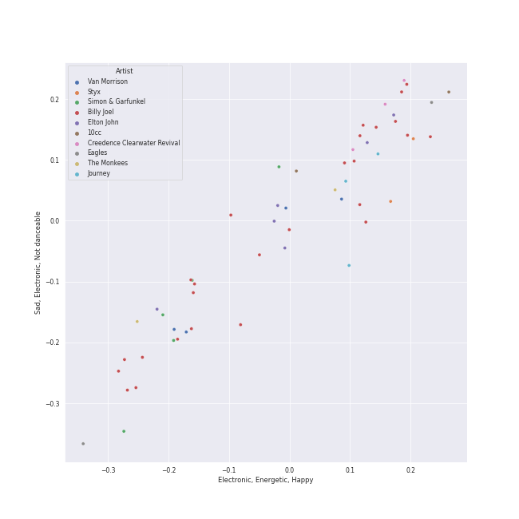

# mellow gold

[69 songs](mellow_gold_tracks.md)

## Top Artists

See all 23 artists

|   Number of Tracks | Art                                                                                              | Artist                                                 | 🔗                                                           |
|-------------------:|:-------------------------------------------------------------------------------------------------|:-------------------------------------------------------|:------------------------------------------------------------|
|                 23 |  | [Billy Joel](../artists/billy_joel.md)                 | [🔗](https://open.spotify.com/artist/6zFYqv1mOsgBRQbae3JJ9e) |
|                  6 |  | The Who                                                | [🔗](https://open.spotify.com/artist/67ea9eGLXYMsO2eYQRui3w) |
|                  6 |  | Elton John                                             | [🔗](https://open.spotify.com/artist/3PhoLpVuITZKcymswpck5b) |
|                  5 |  | Simon & Garfunkel                                      | [🔗](https://open.spotify.com/artist/70cRZdQywnSFp9pnc2WTCE) |
|                  4 |  | Van Morrison                                           | [🔗](https://open.spotify.com/artist/44NX2ffIYHr6D4n7RaZF7A) |
|                  3 |  | Journey                                                | [🔗](https://open.spotify.com/artist/0rvjqX7ttXeg3mTy8Xscbt) |
|                  2 |  | Natalie Cole                                           | [🔗](https://open.spotify.com/artist/5tTsrGPwQRWUsHR2Xf7Ke9) |
|                  2 |  | [The King's Singers](../artists/the_king_s_singers.md) | [🔗](https://open.spotify.com/artist/5lR7yDVN4z9kahOiUSlMhe) |
|                  2 |  | Styx                                                   | [🔗](https://open.spotify.com/artist/4salDzkGmfycRqNUbyBphh) |
|                  2 |  | The Monkees                                            | [🔗](https://open.spotify.com/artist/320EPCSEezHt1rtbfwH6Ck) |
|                  2 |  | Carole King                                            | [🔗](https://open.spotify.com/artist/319yZVtYM9MBGqmSQnMyY6) |
|                  2 |  | Kansas                                                 | [🔗](https://open.spotify.com/artist/2hl0xAkS2AIRAu23TVMBG1) |
|                  2 |  | Paul Simon                                             | [🔗](https://open.spotify.com/artist/2CvCyf1gEVhI0mX6aFXmVI) |
|                  2 |  | Eagles                                                 | [🔗](https://open.spotify.com/artist/0ECwFtbIWEVNwjlrfc6xoL) |
|                  1 |  | Nat King Cole                                          | [🔗](https://open.spotify.com/artist/7v4imS0moSyGdXyLgVTIV7) |
|                  1 |  | Commodores                                             | [🔗](https://open.spotify.com/artist/6twIAGnYuIT1pncMAsXnEm) |
|                  1 |  | Steve Miller Band                                      | [🔗](https://open.spotify.com/artist/6QtGlUje9TIkLrgPZrESuk) |
|                  1 |  | Foreigner                                              | [🔗](https://open.spotify.com/artist/6IRouO5mvvfcyxtPDKMYFN) |
|                  1 |  | Bonnie Raitt                                           | [🔗](https://open.spotify.com/artist/4KDyYWR7IpxZ7xrdYbKrqY) |
|                  1 |  | Harry Chapin                                           | [🔗](https://open.spotify.com/artist/42q4Ivs7tAiCZ5C7eG5q4c) |
|                  1 |  | Chicago                                                | [🔗](https://open.spotify.com/artist/3iDD7bnsjL9J4fO298r0L0) |
|                  1 |  | Frankie Valli                                          | [🔗](https://open.spotify.com/artist/3CDKmzJu6uwEGnPLLZffpD) |
|                  1 |  | Bee Gees                                               | [🔗](https://open.spotify.com/artist/1LZEQNv7sE11VDY3SdxQeN) |

## Top Albums

See all 52 albums

|   Number of Tracks | Art                                                                                              | Album                                          | 🔗                                                          |
|-------------------:|:-------------------------------------------------------------------------------------------------|:-----------------------------------------------|:-----------------------------------------------------------|
|                  5 |  | The Stranger                                   | [🔗](https://open.spotify.com/album/3IILMjMMnoN2sKzgesX8KV) |
|                  3 |  | Bridge Over Troubled Water                     | [🔗](https://open.spotify.com/album/0JwHz5SSvpYWuuCNbtYZoV) |
|                  2 |  | Who's Next (Deluxe Edition)                    | [🔗](https://open.spotify.com/album/5MqyhhHbT13zsloD3uHhlQ) |
|                  2 |  | Unforgettable: With Love                       | [🔗](https://open.spotify.com/album/4ilUfGGQXin7hr1srDDXF0) |
|                  2 |  | The Stranger (Legacy Edition)                  | [🔗](https://open.spotify.com/album/1Mhn9VosyjtWn4dMPFlna6) |
|                  2 |  | Tapestry                                       | [🔗](https://open.spotify.com/album/12n11cgnpjXKLeqrnIERoS) |
|                  2 |  | Storm Front                                    | [🔗](https://open.spotify.com/album/1Vw2uoVkLAJFVViJ1QyK1D) |
|                  2 |  | River Of Dreams                                | [🔗](https://open.spotify.com/album/4HPnwQJAEvTY910q4RNeOu) |
|                  2 |  | Piano Man                                      | [🔗](https://open.spotify.com/album/77ErLrVvYETIlQJHAwhfIH) |
|                  2 |  | Goodbye Yellow Brick Road (Remastered)         | [🔗](https://open.spotify.com/album/5WupqgR68HfuHt3BMJtgun) |
|                  2 |  | Good Vibrations                                | [🔗](https://open.spotify.com/album/10IUKCLZPs9onPwXfQVxfv) |
|                  2 |  | An Innocent Man                                | [🔗](https://open.spotify.com/album/3R3x4zIabsvpD3yxqLaUpc) |
|                  2 |  | 52nd Street                                    | [🔗](https://open.spotify.com/album/1HmCO8VK98AU6EXPOjGYyI) |
|                  1 |  | Who's Next (Expanded Edition)                  | [🔗](https://open.spotify.com/album/53PBYiedQrASAs5sy63JqT) |
|                  1 |  | Who Are You                                    | [🔗](https://open.spotify.com/album/7at3CV9Y9P57wsEXkfU0q8) |
|                  1 |  | Wednesday Morning, 3 A.M.                      | [🔗](https://open.spotify.com/album/5pnJrocLlZ3FWEbcr2PTz0) |
|                  1 |  | Verities & Balderdash                          | [🔗](https://open.spotify.com/album/3nta4nhqWoWjc6LmHIB0kT) |
|                  1 |  | Turnstiles                                     | [🔗](https://open.spotify.com/album/7GiLfxL1su3MSqz7pmKMZi) |
|                  1 |  | Tommy                                          | [🔗](https://open.spotify.com/album/5cT7ee1sy2oEbFalP4asS4) |
|                  1 |  | The Very Best of Frankie Valli & The 4 Seasons | [🔗](https://open.spotify.com/album/0NUEQILaBzavnzcMEs4buZ) |
|                  1 |  | The Ultimate Bee Gees                          | [🔗](https://open.spotify.com/album/5GucSY3249qHDx4v1Hcxry) |
|                  1 |  | The Nylon Curtain                              | [🔗](https://open.spotify.com/album/50bajZpetfL5T0iRCOR74J) |
|                  1 |  | The Joker                                      | [🔗](https://open.spotify.com/album/5uYNj1HkZrWKAkhEYcGmJr) |
|                  1 |  | The Grand Illusion                             | [🔗](https://open.spotify.com/album/6MFIBPVrZjHjP0pPkVF3IU) |
|                  1 |  | The Essential Van Morrison                     | [🔗](https://open.spotify.com/album/0RXzDyBEGd2EGQTmv8cxQa) |
|                  1 |  | The Bridge                                     | [🔗](https://open.spotify.com/album/2fRxSC6FtiAkhEDVZr2seH) |
|                  1 |  | The Birds, The Bees, & The Monkees             | [🔗](https://open.spotify.com/album/2Ov6zb7NfgDh3EXSIIWrb2) |
|                  1 |  | Point Of Know Return (Expanded Edition)        | [🔗](https://open.spotify.com/album/6oU298pdPTCQnMx1PYwyUA) |
|                  1 |  | Pieces Of Eight                                | [🔗](https://open.spotify.com/album/294yFGYq9SBXWR4g6dK63D) |
|                  1 |  | My Generation (Stereo Version)                 | [🔗](https://open.spotify.com/album/6Oc6Ok1Oawu8lRkjmD4mXy) |
|                  1 |  | More of The Monkees (Deluxe Edition)           | [🔗](https://open.spotify.com/album/50zHjIiTOZM232gnWvOydX) |
|                  1 |  | Moondance (Expanded Edition)                   | [🔗](https://open.spotify.com/album/6yNYC35npMBHbxG0Vle83O) |
|                  1 |  | Moondance (Deluxe Edition)                     | [🔗](https://open.spotify.com/album/7diHYi0CglGJekoM3KaWBK) |
|                  1 |  | Madman Across The Water                        | [🔗](https://open.spotify.com/album/2OZbaW9tgO62ndm375lFZr) |
|                  1 |  | Luck Of The Draw                               | [🔗](https://open.spotify.com/album/6blrkOZ0VmkhYPjfoD7eqf) |
|                  1 |  | Leftoverture (Expanded Edition)                | [🔗](https://open.spotify.com/album/7MejfRSNnrpcLZIxkeZDqR) |
|                  1 |  | Infinity                                       | [🔗](https://open.spotify.com/album/7K4Nk5fHkCuzNm5A6mdo2U) |
|                  1 |  | Hotel California (2013 Remaster)               | [🔗](https://open.spotify.com/album/2widuo17g5CEC66IbzveRu) |
|                  1 |  | Honky Chateau                                  | [🔗](https://open.spotify.com/album/2ei2X6ghPnw7YRwQtAH075) |
|                  1 |  | Graceland (25th Anniversary Deluxe Edition)    | [🔗](https://open.spotify.com/album/6WgGWYw6XXQyLTsWt7tXky) |
|                  1 |  | Glass Houses                                   | [🔗](https://open.spotify.com/album/5sztejERqpktXEdemlUvU5) |
|                  1 |  | Foreigner (Expanded)                           | [🔗](https://open.spotify.com/album/1OU7zJvUfgxxPHgkTClt1M) |
|                  1 |  | Escape (Bonus Track Version)                   | [🔗](https://open.spotify.com/album/43wpzak9OmQfrjyksuGwp0) |
|                  1 |  | Elton John                                     | [🔗](https://open.spotify.com/album/69P9Ro0W286yLFgYwrGVN0) |
|                  1 |  | Don't Shoot Me I'm Only The Piano Player       | [🔗](https://open.spotify.com/album/1reJ8DttK5EGwdyf7y9FBR) |
|                  1 |  | Desperado (2013 Remaster)                      | [🔗](https://open.spotify.com/album/09WBxbis5Sixt01FVMs8UM) |
|                  1 |  | Departure                                      | [🔗](https://open.spotify.com/album/2OyVtIEp7O7a6o82DF4Ba5) |
|                  1 |  | Commodores                                     | [🔗](https://open.spotify.com/album/2tzbNCAUTmW4MIM2Ulvrwl) |
|                  1 |  | Cold Spring Harbor                             | [🔗](https://open.spotify.com/album/274rMlKrr22086ohmwAJZA) |
|                  1 |  | Chicago IX: Chicago's Greatest Hits            | [🔗](https://open.spotify.com/album/5qWGV0fd7hpdptJYI4G9Dd) |
|                  1 |  | Bookends                                       | [🔗](https://open.spotify.com/album/3bzgbgiytguTDnwzflAZr2) |
|                  1 |  | Blowin' Your Mind!                             | [🔗](https://open.spotify.com/album/7dsWupQRlFuhG8FGiQAUjC) |

## Top Record Labels

See all 20 labels

|   Number of Tracks | Label                                                                           |
|-------------------:|:--------------------------------------------------------------------------------|
|                 31 | [Columbia](../labels/columbia.md)                                               |
|                  9 | [Legacy](../labels/legacy.md)                                                   |
|                  7 | [Rhino](../labels/rhino.md)                                                     |
|                  4 | [UMC (Universal Music Catalogue)](../labels/umc__universal_music_catalogue_.md) |
|                  4 | [Epic](../labels/epic.md)                                                       |
|                  3 | [Geffen](../labels/geffen.md)                                                   |
|                  3 | [Elektra](../labels/elektra.md)                                                 |
|                  3 | [EMI](../labels/emi.md)                                                         |
|                  2 | [Warner Records](../labels/warner_records.md)                                   |
|                  2 | [RCA Victor](../labels/rca_victor.md)                                           |
|                  2 | [Polydor Records](../labels/polydor_records.md)                                 |
|                  2 | [Ode](../labels/ode.md)                                                         |
|                  2 | [Legacy Recordings](../labels/legacy_recordings.md)                             |
|                  2 | [Craft Recordings](../labels/craft_recordings.md)                               |
|                  2 | [A&M](../labels/a_m.md)                                                         |
|                  1 | [Rhino Atlantic](../labels/rhino_atlantic.md)                                   |
|                  1 | [MOTOWN](../labels/motown.md)                                                   |
|                  1 | [Capitol Records](../labels/capitol_records.md)                                 |
|                  1 | [CAPITOL CATALOG MKT (C92)](../labels/capitol_catalog_mkt__c92_.md)             |
|                  1 | [Bee Gees Catalog](../labels/bee_gees_catalog.md)                               |

## Audio Features

| 10 most Danceable tracks       | 10 least Danceable tracks   |
|:-------------------------------|:----------------------------|
| You Can Call Me Al             | Captain Jack                |
| Cecilia                        | The Boxer                   |
| My Life                        | And So It Goes              |
| A Matter of Trust              | Piano Man                   |
| We Didn't Start the Fire       | Come Sail Away              |
| I Feel the Earth Move          | She's Always a Woman        |
| Stayin Alive                   | Unforgettable               |
| Won't Get Fooled Again - Remix | Desperado - 2013 Remaster   |
| Uptown Girl                    | Lights                      |
| Don't Ask Me Why               | Bridge Over Troubled Water  |

| 10 most Energetic tracks          | 10 least Energetic tracks               |
|:----------------------------------|:----------------------------------------|
| We Didn't Start the Fire          | The Sound of Silence - Acoustic Version |
| Uptown Girl                       | Bridge Over Troubled Water              |
| Any Way You Want It               | Crazy Love - 2013 Remaster              |
| Scenes from an Italian Restaurant | So Far Away                             |
| Movin' Out (Anthony's Song)       | Lullabye (Goodnight, My Angel)          |
| The Stranger                      | I Can't Make You Love Me                |
| Cecilia                           | She's Got a Way                         |
| Only the Good Die Young           | And So It Goes                          |
| 25 or 6 to 4                      | The Boxer                               |
| Won't Get Fooled Again - Remix    | And So It Goes                          |

| 10 most Speechy tracks            | 10 least Speechy tracks                                 |
|:----------------------------------|:--------------------------------------------------------|
| Only the Good Die Young           | Rocket Man (I Think It's Going To Be A Long, Long Time) |
| Scenes from an Italian Restaurant | Dust in the Wind                                        |
| Big Shot                          | Unforgettable                                           |
| Crazy Love - 2013 Remaster        | Goodbye Yellow Brick Road - Remastered 2014             |
| The Stranger                      | Tiny Dancer                                             |
| Crazy Love                        | Piano Man                                               |
| Can't Take My Eyes off You        | Cold as Ice                                             |
| The Boxer                         | Hotel California - 2013 Remaster                        |
| My Generation - Stereo Version    | A Matter of Trust                                       |
| The River of Dreams               | The Longest Time                                        |

| 10 most Acoustic tracks        | 10 least Acoustic tracks         |
|:-------------------------------|:---------------------------------|
| She's Got a Way                | A Matter of Trust                |
| Lullabye (Goodnight, My Angel) | Stayin Alive                     |
| Desperado - 2013 Remaster      | Cold as Ice                      |
| And So It Goes                 | Crocodile Rock                   |
| The Boxer                      | Pinball Wizard                   |
| And So It Goes                 | Renegade                         |
| So Far Away                    | Pressure                         |
| Unforgettable                  | Hotel California - 2013 Remaster |
| Crazy Love                     | Carry on Wayward Son             |
| I Can't Make You Love Me       | Any Way You Want It              |

| 10 most Instrumental tracks                 | 10 least Instrumental tracks            |
|:--------------------------------------------|:----------------------------------------|
| Won't Get Fooled Again - Remix              | The Longest Time                        |
| Baba O'Riley                                | Don't Stop Believin'                    |
| 25 or 6 to 4                                | Uptown Girl                             |
| Stayin Alive                                | Daydream Believer                       |
| My Generation - Stereo Version              | Pinball Wizard                          |
| Lights                                      | And So It Goes                          |
| You Can Call Me Al                          | The Sound of Silence - Acoustic Version |
| Who Are You                                 | We Didn't Start the Fire                |
| I Feel the Earth Move                       | Don't Ask Me Why                        |
| Goodbye Yellow Brick Road - Remastered 2014 | Cold as Ice                             |

| 10 most Live tracks      | 10 least Live tracks             |
|:-------------------------|:---------------------------------|
| Uptown Girl              | The River of Dreams              |
| Don't Stop Believin'     | Who Are You                      |
| Carry on Wayward Son     | The Boxer                        |
| Brown Eyed Girl          | Easy                             |
| Captain Jack             | Crocodile Rock                   |
| We Didn't Start the Fire | Movin' Out (Anthony's Song)      |
| Lights                   | Won't Get Fooled Again - Remix   |
| New York State of Mind   | Hotel California - 2013 Remaster |
| Piano Man                | My Life                          |
| A Matter of Trust        | I Feel the Earth Move            |

| 10 most Happy tracks           | 10 least Happy tracks          |
|:-------------------------------|:-------------------------------|
| Crocodile Rock                 | And So It Goes                 |
| I'm a Believer - 2006 Remaster | The Stranger                   |
| Cecilia                        | Lullabye (Goodnight, My Angel) |
| Stayin Alive                   | She's Got a Way                |
| Brown Eyed Girl                | New York State of Mind         |
| We Didn't Start the Fire       | Desperado - 2013 Remaster      |
| Movin' Out (Anthony's Song)    | Baba O'Riley                   |
| A Matter of Trust              | Unforgettable                  |
| Don't Ask Me Why               | Come Sail Away                 |
| Pressure                       | I Can't Make You Love Me       |
