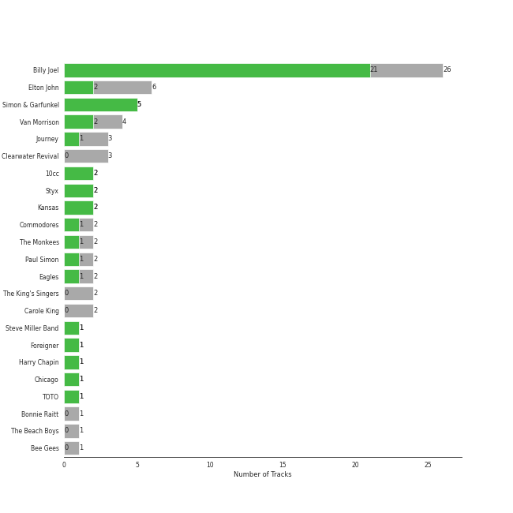
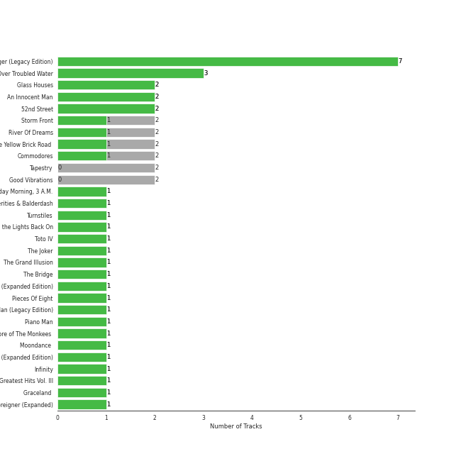
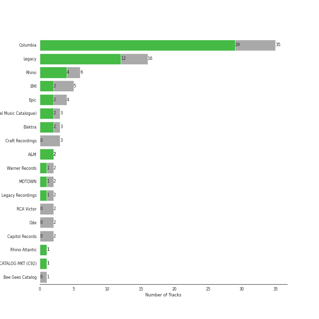

# mellow gold

[67 songs](mellow_gold_tracks.md)

## Top Artists

See all 21 artists

| Number of Tracks | Art | Artist | 🔗 |
|---:|:---|:---|:---|
| 23 |  | [Billy Joel](../artists/billy_joel.md) | [🔗](https://open.spotify.com/artist/6zFYqv1mOsgBRQbae3JJ9e) |
| 6 |  | The Who | [🔗](https://open.spotify.com/artist/67ea9eGLXYMsO2eYQRui3w) |
| 6 |  | Elton John | [🔗](https://open.spotify.com/artist/3PhoLpVuITZKcymswpck5b) |
| 5 |  | Simon & Garfunkel | [🔗](https://open.spotify.com/artist/70cRZdQywnSFp9pnc2WTCE) |
| 4 |  | Van Morrison | [🔗](https://open.spotify.com/artist/44NX2ffIYHr6D4n7RaZF7A) |
| 3 |  | Journey | [🔗](https://open.spotify.com/artist/0rvjqX7ttXeg3mTy8Xscbt) |
| 2 |  | [The King's Singers](../artists/the_king_s_singers.md) | [🔗](https://open.spotify.com/artist/5lR7yDVN4z9kahOiUSlMhe) |
| 2 |  | Styx | [🔗](https://open.spotify.com/artist/4salDzkGmfycRqNUbyBphh) |
| 2 |  | The Monkees | [🔗](https://open.spotify.com/artist/320EPCSEezHt1rtbfwH6Ck) |
| 2 |  | Carole King | [🔗](https://open.spotify.com/artist/319yZVtYM9MBGqmSQnMyY6) |
| 2 |  | Kansas | [🔗](https://open.spotify.com/artist/2hl0xAkS2AIRAu23TVMBG1) |
| 2 |  | Paul Simon | [🔗](https://open.spotify.com/artist/2CvCyf1gEVhI0mX6aFXmVI) |
| 2 |  | Eagles | [🔗](https://open.spotify.com/artist/0ECwFtbIWEVNwjlrfc6xoL) |
| 1 |  | Commodores | [🔗](https://open.spotify.com/artist/6twIAGnYuIT1pncMAsXnEm) |
| 1 |  | Steve Miller Band | [🔗](https://open.spotify.com/artist/6QtGlUje9TIkLrgPZrESuk) |
| 1 |  | Foreigner | [🔗](https://open.spotify.com/artist/6IRouO5mvvfcyxtPDKMYFN) |
| 1 |  | Bonnie Raitt | [🔗](https://open.spotify.com/artist/4KDyYWR7IpxZ7xrdYbKrqY) |
| 1 |  | Harry Chapin | [🔗](https://open.spotify.com/artist/42q4Ivs7tAiCZ5C7eG5q4c) |
| 1 |  | Chicago | [🔗](https://open.spotify.com/artist/3iDD7bnsjL9J4fO298r0L0) |
| 1 |  | Frankie Valli | [🔗](https://open.spotify.com/artist/3CDKmzJu6uwEGnPLLZffpD) |
| 1 |  | Bee Gees | [🔗](https://open.spotify.com/artist/1LZEQNv7sE11VDY3SdxQeN) |

## Top Albums

See all 50 albums

| Number of Tracks | Art | Album | Release Date | 🔗 |
|---:|:---|:---|:---|:---|
| 7 |  | The Stranger | 1977-09-29 | [🔗](https://open.spotify.com/album/3IILMjMMnoN2sKzgesX8KV) |
| 3 |  | Bridge Over Troubled Water | 1970-01-26 | [🔗](https://open.spotify.com/album/0JwHz5SSvpYWuuCNbtYZoV) |
| 2 |  | Who's Next (Deluxe Edition) | 1971-08-14 | [🔗](https://open.spotify.com/album/5MqyhhHbT13zsloD3uHhlQ) |
| 2 |  | Tapestry | 1971 | [🔗](https://open.spotify.com/album/12n11cgnpjXKLeqrnIERoS) |
| 2 |  | Storm Front | 1989-10-17 | [🔗](https://open.spotify.com/album/1Vw2uoVkLAJFVViJ1QyK1D) |
| 2 |  | River Of Dreams | 1993-08-10 | [🔗](https://open.spotify.com/album/4HPnwQJAEvTY910q4RNeOu) |
| 2 |  | Piano Man | 1973-11-09 | [🔗](https://open.spotify.com/album/77ErLrVvYETIlQJHAwhfIH) |
| 2 |  | Goodbye Yellow Brick Road (Remastered) | 1973-10-05 | [🔗](https://open.spotify.com/album/5WupqgR68HfuHt3BMJtgun) |
| 2 |  | Good Vibrations | 1993 | [🔗](https://open.spotify.com/album/10IUKCLZPs9onPwXfQVxfv) |
| 2 |  | An Innocent Man | 1983-08-08 | [🔗](https://open.spotify.com/album/3R3x4zIabsvpD3yxqLaUpc) |
| 2 |  | 52nd Street | 1978-10-13 | [🔗](https://open.spotify.com/album/1HmCO8VK98AU6EXPOjGYyI) |
| 1 |  | Who's Next (Expanded Edition) | 1971-08-14 | [🔗](https://open.spotify.com/album/53PBYiedQrASAs5sy63JqT) |
| 1 |  | Who Are You | 1978-08-18 | [🔗](https://open.spotify.com/album/7at3CV9Y9P57wsEXkfU0q8) |
| 1 |  | Wednesday Morning, 3 A.M. | 1964-10-19 | [🔗](https://open.spotify.com/album/5pnJrocLlZ3FWEbcr2PTz0) |
| 1 |  | Verities & Balderdash | 1974 | [🔗](https://open.spotify.com/album/3nta4nhqWoWjc6LmHIB0kT) |
| 1 |  | Turnstiles | 1976-05-19 | [🔗](https://open.spotify.com/album/7GiLfxL1su3MSqz7pmKMZi) |
| 1 |  | Tommy | 1969-05-23 | [🔗](https://open.spotify.com/album/5cT7ee1sy2oEbFalP4asS4) |
| 1 |  | The Very Best of Frankie Valli & The 4 Seasons | 2003-01-14 | [🔗](https://open.spotify.com/album/0NUEQILaBzavnzcMEs4buZ) |
| 1 |  | The Ultimate Bee Gees | 2009-11-03 | [🔗](https://open.spotify.com/album/5GucSY3249qHDx4v1Hcxry) |
| 1 |  | The Nylon Curtain | 1982-06-23 | [🔗](https://open.spotify.com/album/50bajZpetfL5T0iRCOR74J) |
| 1 |  | The Joker | 1973-01-01 | [🔗](https://open.spotify.com/album/5uYNj1HkZrWKAkhEYcGmJr) |
| 1 |  | The Grand Illusion | 1977-01-01 | [🔗](https://open.spotify.com/album/6MFIBPVrZjHjP0pPkVF3IU) |
| 1 |  | The Essential Van Morrison | 2015-12-04 | [🔗](https://open.spotify.com/album/0RXzDyBEGd2EGQTmv8cxQa) |
| 1 |  | The Bridge | 1986-07-28 | [🔗](https://open.spotify.com/album/2fRxSC6FtiAkhEDVZr2seH) |
| 1 |  | The Birds, The Bees, & The Monkees | 1968-04-22 | [🔗](https://open.spotify.com/album/2Ov6zb7NfgDh3EXSIIWrb2) |
| 1 |  | Point Of Know Return (Expanded Edition) | 1977 | [🔗](https://open.spotify.com/album/6oU298pdPTCQnMx1PYwyUA) |
| 1 |  | Pieces Of Eight | 1978-01-01 | [🔗](https://open.spotify.com/album/294yFGYq9SBXWR4g6dK63D) |
| 1 |  | My Generation (Stereo Version) | 1965-12-03 | [🔗](https://open.spotify.com/album/6Oc6Ok1Oawu8lRkjmD4mXy) |
| 1 |  | More of The Monkees (Deluxe Edition) | 1967-01-09 | [🔗](https://open.spotify.com/album/50zHjIiTOZM232gnWvOydX) |
| 1 |  | Moondance (Expanded Edition) | 1970-02 | [🔗](https://open.spotify.com/album/6yNYC35npMBHbxG0Vle83O) |
| 1 |  | Moondance (Deluxe Edition) | 1970-02 | [🔗](https://open.spotify.com/album/7diHYi0CglGJekoM3KaWBK) |
| 1 |  | Madman Across The Water | 1971-11-05 | [🔗](https://open.spotify.com/album/2OZbaW9tgO62ndm375lFZr) |
| 1 |  | Luck Of The Draw | 1991-01-01 | [🔗](https://open.spotify.com/album/6blrkOZ0VmkhYPjfoD7eqf) |
| 1 |  | Leftoverture (Expanded Edition) | 1976 | [🔗](https://open.spotify.com/album/7MejfRSNnrpcLZIxkeZDqR) |
| 1 |  | Infinity | 1978 | [🔗](https://open.spotify.com/album/7K4Nk5fHkCuzNm5A6mdo2U) |
| 1 |  | Hotel California (2013 Remaster) | 1976-12-08 | [🔗](https://open.spotify.com/album/2widuo17g5CEC66IbzveRu) |
| 1 |  | Honky Chateau | 1972-05-19 | [🔗](https://open.spotify.com/album/2ei2X6ghPnw7YRwQtAH075) |
| 1 |  | Graceland (25th Anniversary Deluxe Edition) | 1986-08-12 | [🔗](https://open.spotify.com/album/6WgGWYw6XXQyLTsWt7tXky) |
| 1 |  | Glass Houses | 1980-03-12 | [🔗](https://open.spotify.com/album/5sztejERqpktXEdemlUvU5) |
| 1 |  | Foreigner (Expanded) | 1977-03-08 | [🔗](https://open.spotify.com/album/1OU7zJvUfgxxPHgkTClt1M) |
| 1 |  | Escape (Bonus Track Version) | 1981 | [🔗](https://open.spotify.com/album/43wpzak9OmQfrjyksuGwp0) |
| 1 |  | Elton John | 1970-04-10 | [🔗](https://open.spotify.com/album/69P9Ro0W286yLFgYwrGVN0) |
| 1 |  | Don't Shoot Me I'm Only The Piano Player | 1973-01-22 | [🔗](https://open.spotify.com/album/1reJ8DttK5EGwdyf7y9FBR) |
| 1 |  | Desperado (2013 Remaster) | 1973 | [🔗](https://open.spotify.com/album/09WBxbis5Sixt01FVMs8UM) |
| 1 |  | Departure | 1980 | [🔗](https://open.spotify.com/album/2OyVtIEp7O7a6o82DF4Ba5) |
| 1 |  | Commodores | 1977-01-01 | [🔗](https://open.spotify.com/album/2tzbNCAUTmW4MIM2Ulvrwl) |
| 1 |  | Cold Spring Harbor | 1971-11-01 | [🔗](https://open.spotify.com/album/274rMlKrr22086ohmwAJZA) |
| 1 |  | Chicago IX: Chicago's Greatest Hits | 1975-11-10 | [🔗](https://open.spotify.com/album/5qWGV0fd7hpdptJYI4G9Dd) |
| 1 |  | Bookends | 1968-04-03 | [🔗](https://open.spotify.com/album/3bzgbgiytguTDnwzflAZr2) |
| 1 |  | Blowin' Your Mind! | 1967-09 | [🔗](https://open.spotify.com/album/7dsWupQRlFuhG8FGiQAUjC) |

## Top Record Labels

See all 19 labels

| Number of Tracks | Label |
|---:|:---|
| 31 | [Columbia](../labels/columbia.md) |
| 7 | [Rhino](../labels/rhino.md) |
| 7 | [Legacy](../labels/legacy.md) |
| 4 | [UMC (Universal Music Catalogue)](../labels/umc__universal_music_catalogue_.md) |
| 4 | [Epic](../labels/epic.md) |
| 3 | Geffen |
| 3 | Elektra |
| 3 | EMI |
| 2 | [Warner Records](../labels/warner_records.md) |
| 2 | RCA Victor |
| 2 | [Polydor Records](../labels/polydor_records.md) |
| 2 | Ode |
| 2 | Legacy Recordings |
| 2 | A&M |
| 1 | Rhino Atlantic |
| 1 | [MOTOWN](../labels/motown.md) |
| 1 | [Capitol Records](../labels/capitol_records.md) |
| 1 | CAPITOL CATALOG MKT (C92) |
| 1 | Bee Gees Catalog |

## Audio Features

| 10 most Danceable tracks | 10 least Danceable tracks |
|:---|:---|
| You Can Call Me Al (0.776) | Bridge Over Troubled Water (0.149) |
| Cecilia (0.755) | Lights (0.193) |
| My Life (0.741) | Desperado - 2013 Remaster (0.228) |
| A Matter of Trust (0.738) | She's Always a Woman (0.292) |
| We Didn't Start the Fire (0.712) | Come Sail Away (0.324) |
| I Feel the Earth Move (0.711) | Piano Man (0.334) |
| Stayin Alive (0.703) | And So It Goes (0.351) |
| Won't Get Fooled Again - Remix (0.702) | The Boxer (0.351) |
| Uptown Girl (0.701) | Captain Jack (0.392) |
| Don't Ask Me Why (0.691) | Behind Blue Eyes (0.394) |

| 10 most Energetic tracks | 10 least Energetic tracks |
|:---|:---|
| We Didn't Start the Fire (0.967) | And So It Goes (0.0387) |
| Uptown Girl (0.944) | The Boxer (0.0802) |
| Any Way You Want It (0.932) | And So It Goes (0.0871) |
| Scenes from an Italian Restaurant (0.931) | She's Got a Way (0.142) |
| Movin' Out (Anthony's Song) (0.88) | I Can't Make You Love Me (0.149) |
| The Stranger (0.878) | Lullabye (Goodnight, My Angel) (0.157) |
| Cecilia (0.876) | So Far Away (0.172) |
| Only the Good Die Young (0.872) | Crazy Love - 2013 Remaster (0.188) |
| 25 or 6 to 4 (0.869) | Bridge Over Troubled Water (0.206) |
| Won't Get Fooled Again - Remix (0.841) | The Sound of Silence - Acoustic Version (0.216) |

| 10 most Speechy tracks | 10 least Speechy tracks |
|:---|:---|
| Only the Good Die Young (0.159) | The Longest Time (0.0262) |
| Scenes from an Italian Restaurant (0.126) | A Matter of Trust (0.0268) |
| Big Shot (0.0972) | Hotel California - 2013 Remaster (0.027) |
| Crazy Love - 2013 Remaster (0.0959) | Cold as Ice (0.0271) |
| The Stranger (0.0837) | Piano Man (0.0276) |
| Crazy Love (0.0819) | Tiny Dancer (0.0278) |
| Can't Take My Eyes off You (0.0746) | Goodbye Yellow Brick Road - Remastered 2014 (0.0279) |
| The Boxer (0.0615) | Dust in the Wind (0.0283) |
| My Generation - Stereo Version (0.058) | Rocket Man (I Think It's Going To Be A Long, Long Time) (0.0286) |
| The River of Dreams (0.0576) | Candle In The Wind - Remastered 2014 (0.0288) |

| 10 most Acoustic tracks | 10 least Acoustic tracks |
|:---|:---|
| She's Got a Way (0.97) | Any Way You Want It (0.00251) |
| Lullabye (Goodnight, My Angel) (0.948) | Carry on Wayward Son (0.00321) |
| Desperado - 2013 Remaster (0.946) | Hotel California - 2013 Remaster (0.00574) |
| And So It Goes (0.941) | Pressure (0.0148) |
| The Boxer (0.93) | Renegade (0.0151) |
| And So It Goes (0.91) | Pinball Wizard (0.0192) |
| So Far Away (0.897) | Crocodile Rock (0.0263) |
| Crazy Love (0.85) | Cold as Ice (0.0264) |
| I Can't Make You Love Me (0.846) | Stayin Alive (0.0328) |
| Crazy Love - 2013 Remaster (0.841) | A Matter of Trust (0.0589) |

| 10 most Instrumental tracks | 10 least Instrumental tracks |
|:---|:---|
| Won't Get Fooled Again - Remix (0.235) | And So It Goes (0.0) |
| Baba O'Riley (0.185) | Cat's in the Cradle (0.0) |
| 25 or 6 to 4 (0.0367) | Only the Good Die Young (0.0) |
| Stayin Alive (0.00839) | We Didn't Start the Fire (0.0) |
| My Generation - Stereo Version (0.00822) | Brown Eyed Girl (0.0) |
| Lights (0.00711) | Don't Stop Believin' (0.0) |
| You Can Call Me Al (0.00647) | Lullabye (Goodnight, My Angel) (0.0) |
| Who Are You (0.0042) | The Longest Time (0.0) |
| I Feel the Earth Move (0.00226) | The Sound of Silence - Acoustic Version (0.0) |
| Goodbye Yellow Brick Road - Remastered 2014 (0.00141) | Uptown Girl (0.0) |

| 10 most Live tracks | 10 least Live tracks |
|:---|:---|
| Uptown Girl (0.601) | I Feel the Earth Move (0.0528) |
| Don't Stop Believin' (0.447) | My Life (0.0555) |
| Carry on Wayward Son (0.446) | Hotel California - 2013 Remaster (0.0575) |
| Brown Eyed Girl (0.406) | Won't Get Fooled Again - Remix (0.0584) |
| Captain Jack (0.374) | Movin' Out (Anthony's Song) (0.0591) |
| We Didn't Start the Fire (0.356) | Crocodile Rock (0.0591) |
| Lights (0.332) | Easy (0.0596) |
| New York State of Mind (0.323) | The Boxer (0.0619) |
| Piano Man (0.312) | Who Are You (0.0655) |
| A Matter of Trust (0.306) | The River of Dreams (0.0667) |

| 10 most Happy tracks | 10 least Happy tracks |
|:---|:---|
| Crocodile Rock (0.968) | I Can't Make You Love Me (0.113) |
| I'm a Believer - 2006 Remaster (0.962) | Come Sail Away (0.141) |
| Cecilia (0.954) | Baba O'Riley (0.15) |
| Stayin Alive (0.949) | Desperado - 2013 Remaster (0.18) |
| Brown Eyed Girl (0.908) | New York State of Mind (0.194) |
| Movin' Out (Anthony's Song) (0.895) | She's Got a Way (0.196) |
| We Didn't Start the Fire (0.895) | Lullabye (Goodnight, My Angel) (0.22) |
| A Matter of Trust (0.88) | The Stranger (0.222) |
| Don't Ask Me Why (0.868) | And So It Goes (0.24) |
| Pressure (0.851) | Bridge Over Troubled Water (0.264) |
