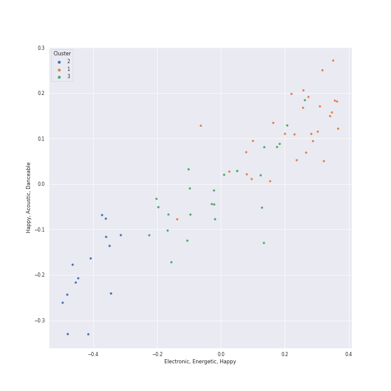

# Clusters in mellow gold

## Cluster #1

20 tracks

| Art | Track | Album | Artists | Label | 💚 | 🔗 |
|:---|:---|:---|:---|:---|:---|:---|
|  | Stayin Alive | The Ultimate Bee Gees | Bee Gees | Bee Gees Catalog | | [🔗](https://open.spotify.com/track/7qK3JFriCqLorQivsJYG2X) |
|  | Only the Good Die Young | The Stranger | [Billy Joel](../../../../artists/billy_joel/overview.md) | [Columbia](../../../../labels/columbia) | 💚 | [🔗](https://open.spotify.com/track/2xabqm0YNQCTcPteQjJ22K) |
|  | Big Shot | 52nd Street | [Billy Joel](../../../../artists/billy_joel/overview.md) | [Columbia](../../../../labels/columbia) | | [🔗](https://open.spotify.com/track/22wxe2Yc9JzihICXYLGAQ7) |
|  | Don't Ask Me Why | Glass Houses | [Billy Joel](../../../../artists/billy_joel/overview.md) | [Columbia](../../../../labels/columbia) | | [🔗](https://open.spotify.com/track/6g4vHtdGqD5eEgpf7nKISk) |
|  | Pressure | The Nylon Curtain | [Billy Joel](../../../../artists/billy_joel/overview.md) | [Columbia](../../../../labels/columbia) | | [🔗](https://open.spotify.com/track/3LqvmDtXWXjF7fg8mh8iZh) |
|  | 25 or 6 to 4 | Chicago IX: Chicago's Greatest Hits | Chicago | [Rhino](../../../../labels/rhino) | 💚 | [🔗](https://open.spotify.com/track/65eRcjlStTnk8opG5eIQ8Z) |
|  | Crocodile Rock | Don't Shoot Me I'm Only The Piano Player | Elton John | EMI | | [🔗](https://open.spotify.com/track/6WCeFNVAXUtNczb7lqLiZU) |
|  | You Can Call Me Al | Graceland (25th Anniversary Deluxe Edition) | Paul Simon | Legacy Recordings | | [🔗](https://open.spotify.com/track/0qxYx4F3vm1AOnfux6dDxP) |
|  | Cecilia | Bridge Over Troubled Water | [Simon & Garfunkel](../../../../artists/simon___garfunkel/overview.md) | [Columbia](../../../../labels/columbia) | 💚 | [🔗](https://open.spotify.com/track/6QhXQOpyYvbpdbyjgAqKdY) |
|  | Surfin' U.S.A. | 50 Big Ones: Greatest Hits | The Beach Boys | [Capitol Records](../../../../labels/capitol_records) | | [🔗](https://open.spotify.com/track/2EPr9Wx7e1cpGEbNAtuN7x) |
## Cluster #2

21 tracks

| Art | Track | Album | Artists | Label | 💚 | 🔗 |
|:---|:---|:---|:---|:---|:---|:---|
|  | Just the Way You Are | The Stranger | [Billy Joel](../../../../artists/billy_joel/overview.md) | [Columbia](../../../../labels/columbia) | 💚 | [🔗](https://open.spotify.com/track/06RdYCp0UxsBtWsonHfSZz) |
|  | The River of Dreams | River Of Dreams | [Billy Joel](../../../../artists/billy_joel/overview.md) | [Columbia](../../../../labels/columbia) | | [🔗](https://open.spotify.com/track/30qVCFYKBtAENjTIBA8FPZ) |
|  | Rocket Man (I Think It's Going To Be A Long, Long Time) | Honky Chateau | Elton John | EMI | | [🔗](https://open.spotify.com/track/3gdewACMIVMEWVbyb8O9sY) |
|  | Candle In The Wind - Remastered 2014 | Goodbye Yellow Brick Road (Remastered) | Elton John | [UMC (Universal Music Catalogue)](../../../../labels/umc__universal_music_catalogue_) | | [🔗](https://open.spotify.com/track/1L9fzw2pXprOqtemTwtxXF) |
|  | Goodbye Yellow Brick Road - Remastered 2014 | Goodbye Yellow Brick Road (Remastered) | Elton John | [UMC (Universal Music Catalogue)](../../../../labels/umc__universal_music_catalogue_) | 💚 | [🔗](https://open.spotify.com/track/4IRHwIZHzlHT1FQpRa5RdE) |
|  | Cold as Ice | Foreigner (Expanded) | Foreigner | Rhino Atlantic | 💚 | [🔗](https://open.spotify.com/track/7vidktgNZFQylTgH1GEnMs) |
|  | Cat's in the Cradle | Verities & Balderdash | Harry Chapin | [Rhino/Elektra](../../../../labels/rhino) | 💚 | [🔗](https://open.spotify.com/track/2obblQ6tcePeOEVJV6nEGD) |
|  | Any Way You Want It | Departure | Journey | [Columbia](../../../../labels/columbia), [Legacy](../../../../labels/legacy) | | [🔗](https://open.spotify.com/track/71SvEDmsOwIWw1IozsZoMA) |
|  | Daydream Believer | The Birds, The Bees, & The Monkees | The Monkees | [Rhino](../../../../labels/rhino) | | [🔗](https://open.spotify.com/track/7uEcCGtM1FBBGIhPozhJjv) |
|  | Moondance - 2013 Remaster | Moondance (Deluxe Edition) | Van Morrison | [Warner Records](../../../../labels/warner_records) | 💚 | [🔗](https://open.spotify.com/track/683b4ikwa62JevCjwrmfg6) |
## Cluster #3

20 tracks

| Art | Track | Album | Artists | Label | 💚 | 🔗 |
|:---|:---|:---|:---|:---|:---|:---|
|  | She's Got a Way | Cold Spring Harbor | [Billy Joel](../../../../artists/billy_joel/overview.md) | [Columbia](../../../../labels/columbia) | | [🔗](https://open.spotify.com/track/3Ie2eLOIj2IhKnzPwXrLbJ) |
|  | She's Always a Woman | The Stranger | [Billy Joel](../../../../artists/billy_joel/overview.md) | [Columbia](../../../../labels/columbia) | | [🔗](https://open.spotify.com/track/3ILLSvTYvFjjEdbxvQumOb) |
|  | And So It Goes | Storm Front | [Billy Joel](../../../../artists/billy_joel/overview.md) | [Columbia](../../../../labels/columbia) | 💚 | [🔗](https://open.spotify.com/track/1u7kQUb3lQcpHaYRfia13A) |
|  | Lullabye (Goodnight, My Angel) | River Of Dreams | [Billy Joel](../../../../artists/billy_joel/overview.md) | [Columbia](../../../../labels/columbia) | 💚 | [🔗](https://open.spotify.com/track/4cURHmiuYii52BVbhrGbv0) |
|  | So Far Away | Tapestry | Carole King | Ode, [Epic](../../../../labels/epic), [Legacy](../../../../labels/legacy) | | [🔗](https://open.spotify.com/track/4HHge4zAyIw3pkrtFzmwCl) |
|  | Your Song | Elton John | Elton John | [UMC (Universal Music Catalogue)](../../../../labels/umc__universal_music_catalogue_) | 💚 | [🔗](https://open.spotify.com/track/38zsOOcu31XbbYj9BIPUF1) |
|  | Tiny Dancer | Madman Across The Water | Elton John | EMI | | [🔗](https://open.spotify.com/track/2TVxnKdb3tqe1nhQWwwZCO) |
|  | The Sound of Silence - Acoustic Version | Wednesday Morning, 3 A.M. | [Simon & Garfunkel](../../../../artists/simon___garfunkel/overview.md) | [Columbia](../../../../labels/columbia) | 💚 | [🔗](https://open.spotify.com/track/5y788ya4NvwhBznoDIcXwK) |
|  | Crazy Love - 2013 Remaster | Moondance (Expanded Edition) | Van Morrison | [Warner Records](../../../../labels/warner_records) | | [🔗](https://open.spotify.com/track/2hjAc6x8EoSLhGxRNg8KEw) |
|  | Crazy Love | The Essential Van Morrison | Van Morrison | Legacy Recordings | | [🔗](https://open.spotify.com/track/04glHdRn4SgTADxKoKzOoO) |