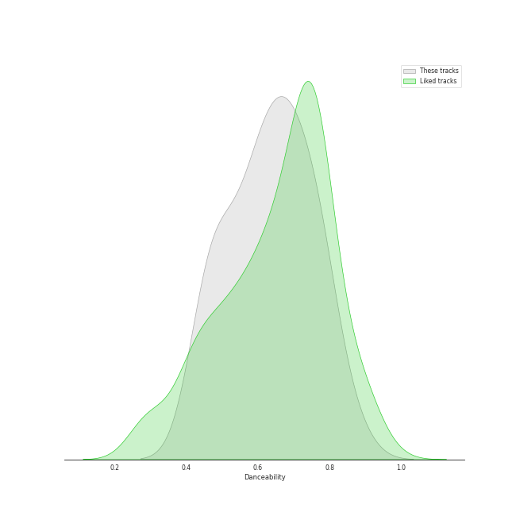
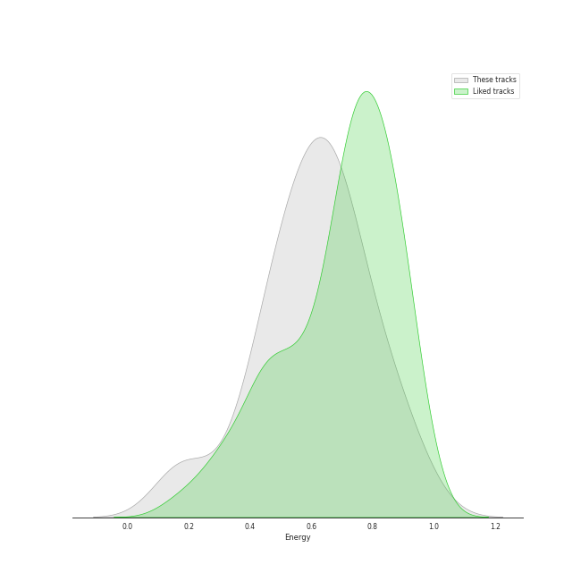
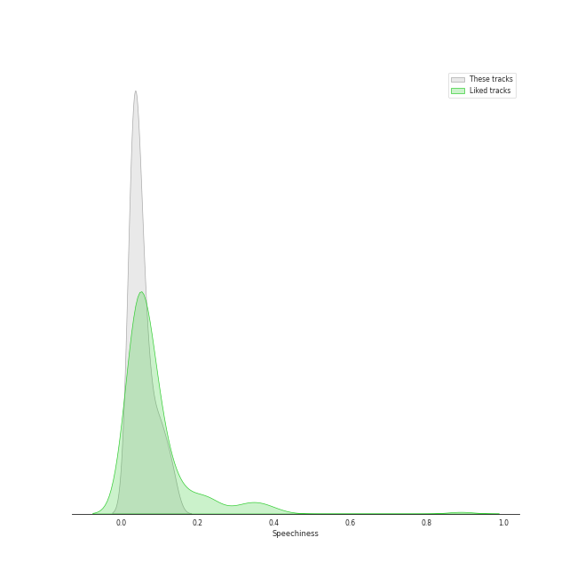
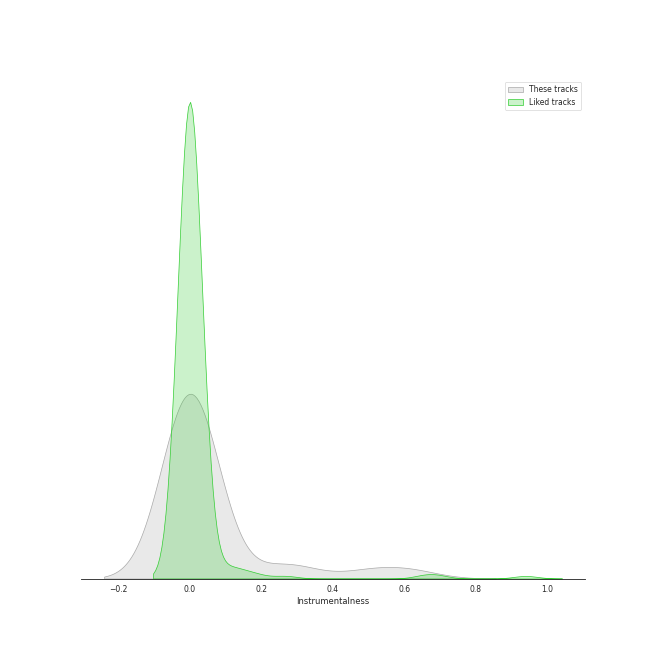
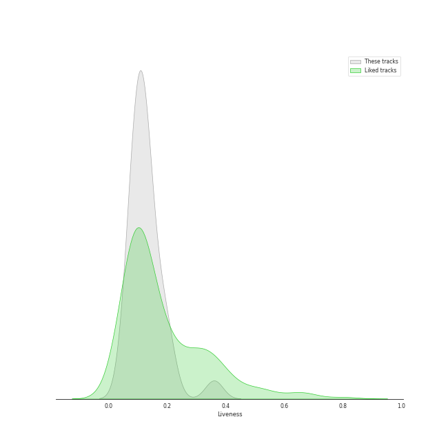
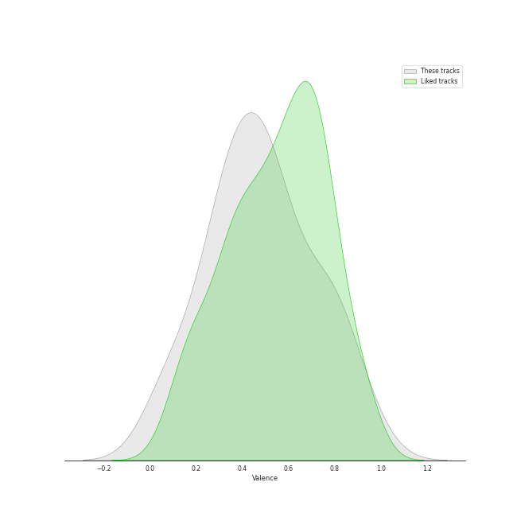
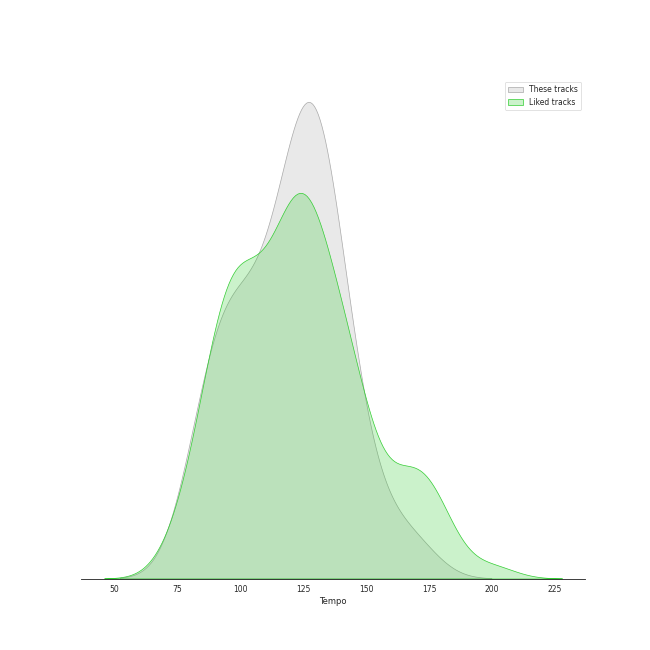

# Track Features for metropopolis

## Danceability

| ​ | 10 most Danceable tracks | ​​ | 10 least Danceable tracks |
|:---|:---|:---|:---|
|  | 360 (0.857) |  | Closing In (0.448) |
|  | Beg for You (feat. Rina Sawayama) (0.788) |  | Hide and Seek (0.451) |
|  | Guess featuring Billie Eilish (0.776) |  | Little Talks (0.457) |
|  | Good Ones (0.764) |  | Gimme Sympathy (0.47) |
|  | 365 (0.761) |  | Love Me Like You Do (0.489) |
|  | Slow Grenade (0.758) |  | Wait It Out (0.497) |
|  | Earth (0.756) |  | Your Song (0.523) |
|  | Beg for You (feat. Rina Sawayama) - A. G. Cook & VERNON OF SEVENTEEN Remix (0.716) |  | The Wire (0.547) |
|  | Lights - Single Version (0.683) |  | Yellow Flicker Beat (0.585) |
|  | Lost Kitten (0.68) |  | Close To Me - Red Velvet Remix (0.593) |

## Energy

| ​ | 10 most Energetic tracks | ​​ | 10 least Energetic tracks |
|:---|:---|:---|:---|
|  | Beg for You (feat. Rina Sawayama) (0.945) |  | Hide and Seek (0.166) |
|  | Gimme Sympathy (0.886) |  | Your Song (0.195) |
|  | 365 (0.856) |  | Wait It Out (0.377) |
|  | Something In The Way You Move (0.814) |  | Royals (0.426) |
|  | Lights - Single Version (0.788) |  | Speeding Cars (0.433) |
|  | Little Talks (0.757) |  | A New Kind Of Love - Demo (0.487) |
|  | Green Light (0.721) |  | Earth (0.493) |
|  | Closing In (0.708) |  | First Train Home (0.508) |
|  | Beg for You (feat. Rina Sawayama) - A. G. Cook & VERNON OF SEVENTEEN Remix (0.704) |  | Lost Kitten (0.525) |
|  | Close To Me - Red Velvet Remix (0.686) |  | Aha! (0.526) |

## Speechiness

| ​ | 10 most Speechy tracks | ​​ | 10 least Speechy tracks |
|:---|:---|:---|:---|
|  | The Wire (0.137) |  | Speeding Cars (0.0247) |
|  | Royals (0.122) |  | Lost Kitten (0.0271) |
|  | 365 (0.109) |  | Love Me Like You Do (0.0292) |
|  | Guess featuring Billie Eilish (0.0983) |  | Good Ones (0.0293) |
|  | Green Light (0.0957) |  | First Train Home (0.0295) |
|  | Slow Grenade (0.0771) |  | Goodnight and Go (0.0302) |
|  | Gimme Sympathy (0.0752) |  | Your Song (0.0311) |
|  | Hide and Seek (0.0696) |  | Little Talks (0.032) |
|  | Beg for You (feat. Rina Sawayama) (0.0599) |  | A New Kind Of Love - Demo (0.0331) |
|  | Somebody Else (0.0582) |  | Yellow Flicker Beat (0.0353) |

## Acousticness

| ​ | 10 most Acoustic tracks | ​​ | 10 least Acoustic tracks |
|:---|:---|:---|:---|
|  | Your Song (0.937) |  | Gimme Sympathy (0.00832) |
|  | Hide and Seek (0.909) |  | The Wire (0.0127) |
|  | Earth (0.856) |  | Guess featuring Billie Eilish (0.0146) |
|  | Speeding Cars (0.814) |  | Little Talks (0.0206) |
|  | Wait It Out (0.77) |  | Green Light (0.0209) |
|  | Aha! (0.731) |  | Lost Kitten (0.0224) |
|  | 360 (0.646) |  | Lights - Single Version (0.0283) |
|  | First Train Home (0.592) |  | Something In The Way You Move (0.0401) |
|  | Goodnight and Go (0.35) |  | Good Ones (0.072) |
|  | Beg for You (feat. Rina Sawayama) - A. G. Cook & VERNON OF SEVENTEEN Remix (0.286) |  | Slow Grenade (0.0996) |

## Instrumentalness

| ​ | 10 most Instrumental tracks | ​​ | 10 least Instrumental tracks |
|:---|:---|:---|:---|
|  | Lost Kitten (0.617) |  | Love Me Like You Do (0.0) |
|  | 365 (0.503) |  | Royals (0.0) |
|  | Guess featuring Billie Eilish (0.3) |  | Little Talks (0.0) |
|  | 360 (0.244) |  | Wait It Out (0.0) |
|  | Lights - Single Version (0.0469) |  | Slow Grenade (0.0) |
|  | A New Kind Of Love - Demo (0.00411) |  | Close To Me - Red Velvet Remix (0.0) |
|  | First Train Home (0.00213) |  | Something In The Way You Move (0.0) |
|  | Gimme Sympathy (0.00164) |  | Hide and Seek (0.0) |
|  | Your Song (0.00079) |  | Speeding Cars (1.23e-06) |
|  | Somebody Else (0.000529) |  | Beg for You (feat. Rina Sawayama) (2.97e-06) |

## Liveness

| ​ | 10 most Live tracks | ​​ | 10 least Live tracks |
|:---|:---|:---|:---|
|  | Close To Me - Red Velvet Remix (0.36) |  | Beg for You (feat. Rina Sawayama) - A. G. Cook & VERNON OF SEVENTEEN Remix (0.0585) |
|  | Somebody Else (0.209) |  | The Wire (0.0585) |
|  | Closing In (0.195) |  | Guess featuring Billie Eilish (0.0761) |
|  | Hide and Seek (0.19) |  | Goodnight and Go (0.0794) |
|  | Your Song (0.18) |  | Good Ones (0.0806) |
|  | 365 (0.16) |  | Green Light (0.0879) |
|  | Little Talks (0.146) |  | Lost Kitten (0.0913) |
|  | Aha! (0.14) |  | Speeding Cars (0.0927) |
|  | Wait It Out (0.136) |  | 360 (0.0934) |
|  | Royals (0.132) |  | Slow Grenade (0.0996) |

## Valence

| ​ | 10 most Happy tracks | ​​ | 10 least Happy tracks |
|:---|:---|:---|:---|
|  | Earth (0.938) |  | Yellow Flicker Beat (0.0597) |
|  | Beg for You (feat. Rina Sawayama) - A. G. Cook & VERNON OF SEVENTEEN Remix (0.824) |  | Hide and Seek (0.0901) |
|  | Lights - Single Version (0.809) |  | Gimme Sympathy (0.119) |
|  | 360 (0.796) |  | Green Light (0.253) |
|  | Good Ones (0.789) |  | Closing In (0.286) |
|  | 365 (0.729) |  | Wait It Out (0.304) |
|  | Speeding Cars (0.682) |  | Something In The Way You Move (0.318) |
|  | Guess featuring Billie Eilish (0.618) |  | Love Me Like You Do (0.323) |
|  | Slow Grenade (0.581) |  | A New Kind Of Love - Demo (0.329) |
|  | Aha! (0.576) |  | Royals (0.337) |

## Tempo

| ​ | 10 most Fast tracks | ​​ | 10 least Fast tracks |
|:---|:---|:---|:---|
|  | Closing In (167.982) |  | Speeding Cars (83.99) |
|  | Wait It Out (152.636) |  | Royals (84.876) |
|  | Close To Me - Red Velvet Remix (143.986) |  | Aha! (88.492) |
|  | Slow Grenade (142.035) |  | Yellow Flicker Beat (94.969) |
|  | Gimme Sympathy (139.046) |  | Earth (95.011) |
|  | Your Song (133.79) |  | Love Me Like You Do (95.013) |
|  | Lost Kitten (133.01) |  | First Train Home (99.985) |
|  | A New Kind Of Love - Demo (132.97) |  | Little Talks (102.961) |
|  | Guess featuring Billie Eilish (130.019) |  | Something In The Way You Move (109.023) |
|  | Good Ones (129.049) |  | Goodnight and Go (109.981) |
